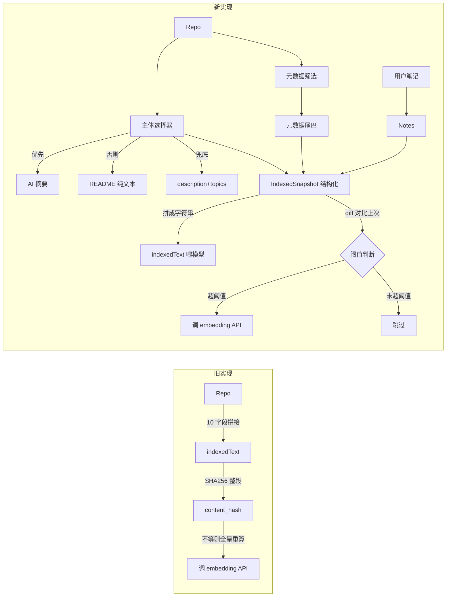
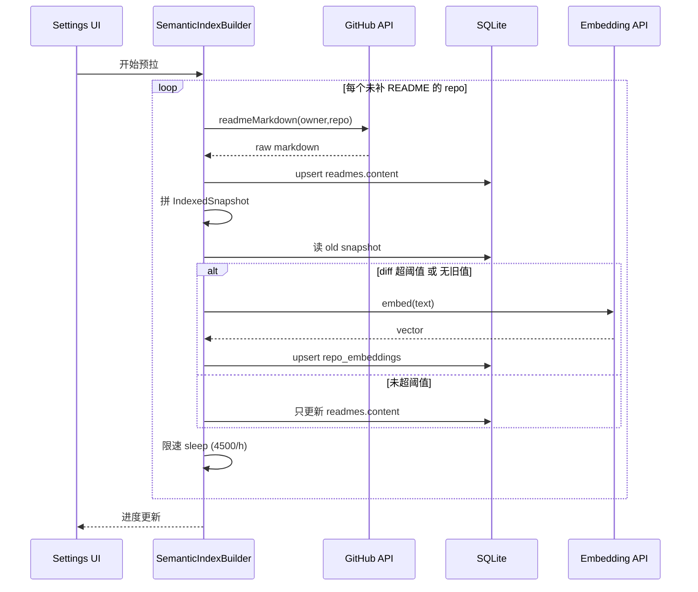

# 向量搜索改进 方案

> 落地文档目标位置：`docs/详细设计/26-向量搜索改进.md`

---

## 1. 收敛后的设计决策（8 条）

| ID | 决策 | 选项 |
|---|---|---|
| A | README 噪声清洗 | A3：先做简单清洗（删 ``/`<script>`/`<style>` + 字符截断），章节黑白名单留后续 |
| B | `readmes.plain_text` 缓存列 | 不加。`readmes.content` 已存在 schema，直接复用 |
| C1 | 新 repo SWR 拉到 README 后 | 自动判一次 diff 阈值，符合才真重建向量 |
| C2 | 截断长度配置项 | 默认 12000、范围 2000-32000，步进 1000 |
| D | indexedText 字段筛选 | 保留 fullName / description / language / topics / license / homepage + 主体 + 笔记；**移除 stars / forks / owner / name / 时间戳** |
| E | 怎么拉原始 Markdown | E3：懒补全（HTML 仍是 WebView 主路径，AI 触发时按需补一次 raw Markdown 落 `readmes.content`） |
| F | diff 算法粒度 | F2：行级 diff，`changed_lines / total_lines > 阈值` |
| G | 阈值默认值 | 主体 10% / 笔记 20%；三档预设（严格 5% / 标准 10% / 宽松 20%）+ 折叠暴露具体数字 |

---

## 2. 核心数据流（变更前后对比）



---

## 3. 模块改动清单

### 3.1 新增组件

**[Starcat/Features/AI/ReadmePreprocessor.swift](Starcat/Features/AI/ReadmePreprocessor.swift)** （新增）
- 单一职责：把 README（HTML 或原始 Markdown）清洗成 AI 可读的纯文本
- 复用方：`RepoAIInsightService.makeSource` 和 `IndexedTextBuilder`
- 关键方法：
  - `process(html:) -> String`（A3 简单清洗 + 截断）
  - `process(markdown:) -> String`（同上，Markdown 流程）
  - 截断长度从 `AppSettings.aiReadmeTruncateLength` 读，默认 12000

**[Starcat/Features/AI/IndexedSnapshot.swift](Starcat/Features/AI/IndexedSnapshot.swift)** （新增）
- 结构化"上次进过向量的快照"，替代 `content_hash` 的语义
- 字段：
  ```swift
  struct IndexedSnapshot: Codable, Equatable {
      var body: String                  // README/摘要/兜底主体
      var notes: String?                // 用户笔记
      var metadata: MetadataTuple       // fullName/description/language/topics/license/homepage
  }
  ```

**[Starcat/Features/AI/IndexedTextBuilder.swift](Starcat/Features/AI/IndexedTextBuilder.swift)** （新增）
- 把 `SemanticSearchService.makeIndexedText` 拆出来独立
- 实现三级降级主体 + 元数据尾巴 + 笔记
- 关键方法：
  - `buildSnapshot(repo:readme:summary:note:) -> IndexedSnapshot`
  - `render(snapshot:) -> String`（拼成喂模型的字符串）

**[Starcat/Features/AI/IndexedTextDiff.swift](Starcat/Features/AI/IndexedTextDiff.swift)** （新增）
- F2 行级 diff 算法
- 关键方法：
  - `shouldRebuild(old: IndexedSnapshot?, new: IndexedSnapshot, thresholds: DiffThresholds) -> Bool`
- 逻辑：
  1. `old == nil` → true
  2. metadata 任一字段不等 → true
  3. body 行级 diff ratio > bodyThreshold → true
  4. notes 行级 diff ratio > notesThreshold → true
  5. 否则 → false

**[Starcat/Features/AI/SemanticIndexBuilder.swift](Starcat/Features/AI/SemanticIndexBuilder.swift)** （新增）
- 后台慢速预拉服务（首次启用 + 增量补全）
- 双队列：
  - **README 拉取队列**：限速 4500/h（留 GitHub API 配额 buffer）
  - **Embedding 调用队列**：限速由 `aiEmbeddingTask` provider 决定
- 持久化进度（中断恢复），UI 进度条数据源
- 触发时机：
  - 首次启用 AI 索引
  - 检测到 `index_schema_version` 不匹配（一次性全量重建）

### 3.2 修改的核心文件

**[Starcat/Core/Network/GitHubAPI/GitHubAPIClientProtocol.swift](Starcat/Core/Network/GitHubAPI/GitHubAPIClientProtocol.swift)**
- 新增 `readmeMarkdown(owner:repo:ifNoneMatch:ifModifiedSince:)` 端点
- Accept 头：`application/vnd.github.raw`
- 与现有 `readmeHTML` 并列，不替换

**[Starcat/Core/Network/GitHubAPI/ReadmeAPI.swift](Starcat/Core/Network/GitHubAPI/ReadmeAPI.swift)**
- 新增 `refreshMarkdownIfNeeded(for:)`：按需懒补全，只在 `readmes.content` 为 nil 时去拉
- 修改现有 `refreshReadme(for:)`：触发后**异步**补一次 Markdown（不阻塞 HTML 上屏）

**[Starcat/Features/AI/SemanticSearchService.swift](Starcat/Features/AI/SemanticSearchService.swift)**
- 删除 `SemanticIndexRecord` 内部 struct + `makeIndexedText` + `hash`，迁移至 `IndexedTextBuilder`
- `ensureIndexed` 改造：
  - 不再读 `existing.contentHash != record.contentHash`
  - 改读 `existing.snapshot` 与新构建的 snapshot 做 `IndexedTextDiff.shouldRebuild`
- `refreshIndex(for:force:)` 保留 `force` 参数走"无条件重建"路径
- 新增方法：`refreshIndexIfChanged(for repo:)` 单 repo 路径，供 README/笔记/摘要触发

**[Starcat/Core/Database/Models/RepoEmbedding.swift](Starcat/Core/Database/Models/RepoEmbedding.swift)**
- 弃用 `content_hash`（保留兼容，不删列，便于回滚）
- 新增 `snapshotJson: String` 字段（存 `IndexedSnapshot` JSON）
- 新增 `schemaVersion: Int` 字段（迁移用，bump 后判定旧数据）

**[Starcat/Features/AI/RepoAIInsightService.swift](Starcat/Features/AI/RepoAIInsightService.swift)**
- `makeSource(for:)` 改用 `ReadmePreprocessor`
- 摘要生成成功后**触发** `SemanticSearchService.refreshIndexIfChanged(for: repo)`

**[Starcat/Features/Notes/...](Starcat/Features/Notes)**（用户笔记保存路径）
- 在笔记 upsert 成功后触发 `SemanticSearchService.refreshIndexIfChanged(for: repo)`（debounce 1.5s 防止逐字键入触发）

**[Starcat/Core/Settings/AppSettings.swift](Starcat/Core/Settings/AppSettings.swift)**
- 新增 5 个持久化字段：
  - `aiReadmeTruncateLength: Int` 默认 12000
  - `aiIndexBodyDiffRatio: Double` 默认 0.10
  - `aiIndexNotesDiffRatio: Double` 默认 0.20
  - `aiIndexPreset: AIIndexPreset`（strict/standard/relaxed）
  - `aiIndexAutoPrefetchEnabled: Bool` 默认 false（用户首次需手动开启，避免无声烧 API）

**[Starcat/Features/Settings/AISettingsView.swift](Starcat/Features/Settings/AISettingsView.swift)**
- 新增 "AI 索引" Section：
  - 截断长度滑杆（2000-32000，步 1000）
  - 阈值预设三档（严格/标准/宽松）+ 折叠区显示具体数字
  - "开始/暂停后台预拉"按钮 + 进度条
  - "全量重建"危险操作（弹确认对话框）

**[Starcat/Resources/Localizable.xcstrings](Starcat/Resources/Localizable.xcstrings)**
- 新增本地化键（en + zh-Hans）：
  - `settings.aiIndex.section`
  - `settings.aiIndex.truncateLength`
  - `settings.aiIndex.diffPreset.strict/standard/relaxed`
  - `settings.aiIndex.bodyThreshold` / `settings.aiIndex.notesThreshold`
  - `settings.aiIndex.prefetch.start/pause` / `settings.aiIndex.prefetch.progress`
  - `settings.aiIndex.rebuildAll.button/confirm`

### 3.3 数据库迁移

**[Starcat/Core/Database/Schema/](Starcat/Core/Database/Schema)** （在 migrator 加新版本）
- 加列：
  ```sql
  ALTER TABLE repo_embeddings ADD COLUMN snapshot_json TEXT;
  ALTER TABLE repo_embeddings ADD COLUMN schema_version INTEGER NOT NULL DEFAULT 0;
  ```
- `content_hash` 列**保留不动**（兼容回滚）
- 启动时检测 `schema_version < 1`（即所有旧行）→ 标记需要全量重建

---

## 4. 关键流程（伪代码）

### 4.1 单 repo 索引判定

```swift
func refreshIndexIfChanged(for repo: Repo) async throws {
    let readme = try await readmeRepository.find(repoId: repo.id)
    let summary = try await aiSummaryRepository.find(repoId: repo.id)
    let note = try await noteRepository.find(repoId: repo.id)

    let new = IndexedTextBuilder.buildSnapshot(
        repo: repo, readme: readme, summary: summary, note: note
    )
    let existing = try await embeddingRepository.fetchEmbedding(
        repoId: repo.id, model: model
    )
    let old: IndexedSnapshot? = existing.flatMap { try? decodeSnapshot($0.snapshotJson) }

    guard IndexedTextDiff.shouldRebuild(
        old: old, new: new, thresholds: settings.diffThresholds
    ) else { return }

    let text = IndexedTextBuilder.render(snapshot: new)
    let vector = try await client.embedding(input: text, model: model)
    try await embeddingRepository.upsert(
        RepoEmbedding(repoId: repo.id, model: model,
                      snapshotJson: encode(new), vector: vector, ...)
    )
}
```

### 4.2 后台预拉服务



---

## 5. 实施风险与缓解

- **首次切换全量重建代价大**：10k repo 预估 1.5-2h（本地 Ollama）或更长（OpenAI 网络）。缓解：默认不开启自动预拉（`aiIndexAutoPrefetchEnabled = false`），用户主动点 Settings 才启动；旧向量保留可读，搜索不中断。
- **GitHub API 配额吃紧**：5000/h 限速对单用户够用，但和其他同步流程共享配额。缓解：双队列限速 4500/h，留 buffer。
- **diff 阈值校准困难**：10% 是经验值，可能误判（一份 README 删了 1/5 内容但语义没变）。缓解：可配置 + 三档预设 + Settings 暴露重置；后续可加"重建预览"显示哪些 repo 会被触发。
- **笔记触发 debounce 不当**：用户连续键入触发风暴。缓解：笔记编辑路径用 1.5s debounce，且只在 `noteRepository.upsert` 成功后调（而不是 onChange）。

---

## 6. 测试计划

- `IndexedTextBuilderTests`：三级降级覆盖（有摘要 / 只有 README / 兜底）+ 元数据尾巴拼接
- `ReadmePreprocessorTests`：清洗 HTML 边界（``/`<script>`/Badge 行/HTML entities/超长截断）
- `IndexedTextDiffTests`：行级 diff 比例计算 + 三档阈值边界（5%/10%/20%）+ metadata 任一变化触发
- `SemanticSearchServiceTests`：用 mock embeddingRepository + mock client，验证 `refreshIndexIfChanged` 在 diff 超/未超时的不同行为
- 现有 `SemanticSearchService` 相关测试需要同步更新

---

## 7. 后续可演进方向（不在本次范围）

- 章节黑白名单清洗（A2）
- 全切 Markdown 客户端渲染（E1）
- 混合检索（向量召回 + SQL 精确过滤）
- 重建预览面板（让用户看到哪些 repo 会被触发再决定）
