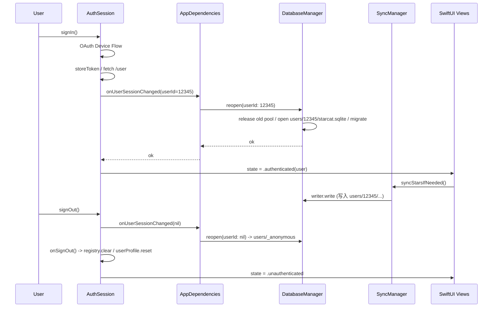

# 多账号 DB 隔离 — 方案 A-1（DB 内部切 writer）

## 1. 背景与现状

- **DatabaseManager 单例**（`static let shared`）+ 单一 `starcat.sqlite`，物理上不区分账号
- **AuthSession.signOut() 只清 token / 用户 profile / 内存 registry**，SQLite 一个字都没动
- 切账号后 SyncManager 把 B 的 stars 写进 A 残留的 `repos` 表里，且 A 的 tags / notes / status 全过继给 B —— 语义错误
- schema 是单租户设计（除 `starred_repos` / `sync_state` 有 `user_id` 列作种子但未在查询路径过滤）
- **CloudKit 实际未接入**（grep 全工程无 `CKContainer` / `NSPersistentCloudKit`），仅在表注释里预留 `modifiedAt` 字段

## 2. 用户拍板的方向

- 场景定义：**"先退出再登录另一个账号"**，不存在"运行时直接切账号"的并发场景 — 大幅简化设计
- 隔离方式：**按 GitHub User ID 切目录**（不是清表 / 不是重建文件）
- 实施路径：**A-1（DB 内部切 writer，不重建 AppDependencies）**
- 未登录态：**切到 `_anonymous` 占位 DB**，避免 Repository 加 nil 特判
- 旧 `starcat.sqlite` 抛弃（项目未上线）
- 测试加 SwitchUserDatabaseTests
- CloudKit "几周内会接"，本次不深入实现但在 plan 中预研

## 3. 目录结构设计

```
~/Library/Application Support/com.starcat.app/
├── credentials.json              ← 不动；AI Key / Service API Key 跨账号共享
└── users/
    ├── _anonymous/               ← 未登录占位（避免特判）
    │   └── starcat.sqlite
    ├── 12345/                    ← GitHub User ID（Int64，不变；login 可改名）
    │   ├── starcat.sqlite (+ .wal + .shm)
    │   └── _meta.json            ← {"login":"dong4j","last_at":"2026-06-12T..."}（仅诊断用）
    └── 67890/
        └── starcat.sqlite
```

- 用 `User ID` 而非 `login`：用户改 GitHub 用户名后 ID 不变，目录路径稳定
- `_meta.json` 只给开发者 Finder 看，运行时不读
- `credentials.json` 保留在共享位置：GitHub token 单 key 覆盖（切账号 OAuth 重新登录），AI Key / Service API Key 真正跨账号共享

## 4. 改造点（按文件）

### 4.1 [Starcat/Core/Database/DatabaseManager.swift](Starcat/Core/Database/DatabaseManager.swift)

- 删 `static let shared` 单例
- `final class DatabaseManager: DatabaseManaging, @unchecked Sendable`
- 私有可变字段：`private var currentPool: DatabasePool` / `private(set) var currentUserId: Int64?` / `private(set) var databasePath: String?`
- 协议 getter `var writer: any DatabaseWriter { currentPool }` — 每次访问拿到最新 pool（这是 A-1 核心）
- `init(userId: Int64?)` — 启动期由 AppDependencies 用 `nil` 调用，open `_anonymous` 占位 DB
- 新增 `@MainActor func reopen(userId: Int64?) async throws`：
  - 释放 `currentPool` 强引用 → GRDB 内部 in-flight 完成后 deinit
  - 解析新路径（`users/_anonymous` 或 `users/<userId>`）
  - 建父目录 → `DatabasePool(path:)` → `runMigrations`
  - 赋值 `currentPool` / `currentUserId` / `databasePath`
  - 写 `_meta.json`（如 userId 非 nil）
- 路径解析 helper：`static func databaseFileURL(userId: Int64?) throws -> URL`

### 4.2 12 个 Repository 改造

`Starcat/Core/Sync/` 目录下 12 个 `GRDBxxxRepository`（不包括 protocol 文件）：
- [RepoRepository.swift](Starcat/Core/Sync/RepoRepository.swift)
- [RepoNoteRepository.swift](Starcat/Core/Sync/RepoNoteRepository.swift)
- [RepoTagRepository.swift](Starcat/Core/Sync/RepoTagRepository.swift)
- [TagRepository.swift](Starcat/Core/Sync/TagRepository.swift)
- [ReadmeRepository.swift](Starcat/Core/Sync/ReadmeRepository.swift)
- [ReleaseRepository.swift](Starcat/Core/Sync/ReleaseRepository.swift)
- [ReleaseSubscriptionRepository.swift](Starcat/Core/Sync/ReleaseSubscriptionRepository.swift)
- [RepoEmbeddingRepository.swift](Starcat/Core/Sync/RepoEmbeddingRepository.swift)
- [AISummaryRepository.swift](Starcat/Core/Sync/AISummaryRepository.swift)
- [TrendingRepository.swift](Starcat/Core/Sync/TrendingRepository.swift)
- [TrendingReadmeRepository.swift](Starcat/Core/Sync/TrendingReadmeRepository.swift)
- [ReadmeTranslationRepository.swift](Starcat/Core/Sync/ReadmeTranslationRepository.swift)

每个文件的机械改动：
- `private let writer: any DatabaseWriter` → `private let database: any DatabaseManaging`
- `init(database: any DatabaseManaging) { self.writer = database.writer }` → `init(database: any DatabaseManaging) { self.database = database }`
- 方法体里 `try writer.read/write { ... }` → `try database.writer.read/write { ... }`

改动量小且机械，但每个文件都要过一遍，确保无遗漏。

### 4.3 [Starcat/App/AppDependencies.swift](Starcat/App/AppDependencies.swift)

- 字段 `let database: any DatabaseManaging = DatabaseManager.shared` → `let database: DatabaseManager`（具体类型，能调 reopen）
- init 中：`self.database = try DatabaseManager(userId: nil)` — 启动期默认 anonymous（如 throw 则 fatalError）
- 新增 `func switchUserDatabase(to userId: Int64?) async throws { try await database.reopen(userId: userId) }`
- AuthSession 装配后注入 closure（类似已有 `onSignOut`）：
  ```
  session.onUserSessionChanged = { [weak self] userId in
      try? await self?.switchUserDatabase(to: userId)
  }
  ```

### 4.4 [Starcat/Features/Auth/AuthSession.swift](Starcat/Features/Auth/AuthSession.swift)

- 新增 closure 字段 `var onUserSessionChanged: ((Int64?) async -> Void)?`（与 `onSignOut` 同 weak 引用模式）
- 4 个调用点：
  1. `runDeviceFlow` 拿到 user 后、emit `.authenticated` 之前：`await onUserSessionChanged?(user.id)`
  2. `restoreSessionIfAvailable` `/user` 验证成功后、emit `.authenticated` 之前：同上
  3. `signOut` 末尾、调 `onSignOut?()` 之前：`await onUserSessionChanged?(nil)`
  4. `invalidateSession` 末尾、调 `onSignOut?()` 之前：`await onUserSessionChanged?(nil)`

时序约束：**DB 切换必须在 state emit 之前**，让所有观察 state 变化的视图（HomeView `.task` 触发 SyncManager 等）已经拿到指向新 DB 的 Repository。

### 4.5 [Starcat/App/StarcatApp.swift](Starcat/App/StarcatApp.swift)

- `Self.bootstrap()` 删掉 `DatabaseManager.bootstrap()` 调用（单例不存在了）
- 启动期 KeychainManager.ping() 保留
- AppDependencies init 内部自己 open anonymous DB

### 4.6 [Starcat/Shared/Utilities/Constants.swift](Starcat/Shared/Utilities/Constants.swift)

- 新增 `static let usersDirectoryName = "users"`
- 新增 `static let anonymousUserDirectoryName = "_anonymous"`
- 保留 `databaseFileName = "starcat.sqlite"`

### 4.7 InMemoryDatabaseManager 改造

- 实现新的 DatabaseManaging 协议（含 reopen）
- `reopen(userId:)` 行为：关老 queue → 新建空 DatabaseQueue → migrate → 赋值。模拟"切到新账号 = 进入空库"语义
- 测试可断言 `currentUserId` 字段验证切换

## 5. 触发链路（时序图）



## 6. 内存状态联动（已自动 work）

- `starredRegistryBootstrapper.reload()` 已挂在 `syncManager.onSyncCompleted` —— 切 DB 后 SyncManager 拉完新账号 stars 自动重建 registry
- `session.onSignOut` 已挂 `bootstrapper.clearOnSignOut()` —— 保留
- `userProfileService.reset()` 已在 signOut 调用 —— 保留
- 4 个 MultiSelectionStore / 各种 view-level State 是 view 生命周期，不持久化 —— 不动

## 7. 测试设计

新增 `StarcatTests/SwitchUserDatabaseTests.swift`：

- **test_inMemorySwitch_emptyAfterReopen**：InMemoryDatabaseManager 切到另一 userId 后，旧数据查不到（in-memory 语义是"切就清"）
- **test_diskPersistsAcrossSwitch**：真磁盘 DatabaseManager（用 tmpDir 注入 basePath）写 A 数据 → 切 B → 写 B 数据 → 切回 A → A 数据应仍在
- **test_anonymousFallback**：reopen(nil) 走 `_anonymous` 路径，Migration 跑过，写读正常
- **test_authSessionHookFiresReopen**：mock AppDependencies 注入 closure，验证 signIn / signOut / restore / invalidate 4 个钩子都触发 `onUserSessionChanged` 且参数正确

DatabaseManager 需要新增"可注入 basePath"的测试构造器（生产代码默认走沙盒）。

## 8. CloudKit 多账号策略（follow-up，不在本次实施）

**问题**：同一台 Mac，一个 iCloud 账号，登录过 GitHub 账号 A 和 B。CloudKit 容器是 per-iCloud-account 的，A 和 B 的 tags / notes 都会进同一个 iCloud 容器。

**候选方案**（接 CloudKit 时再决定）：
- 方案 X：CloudKit 记录新增 `github_user_id` 字段作为分区键，客户端按当前 user_id `NSPredicate` 过滤
- 方案 Y：每个 GitHub 账号一个 CloudKit 自定义 zone，登录时 subscribe / 切换 zone
- 方案 Z：完全不跨账号同步 —— 切账号 = 一个干净的 CloudKit 视图（最简单但功能弱）

**本次只做的事**：在 [docs/CloudKit数据同步设计.md](docs/CloudKit数据同步设计.md) 末尾追加"多账号下的 CloudKit 设计预研"章节，把上述 X / Y / Z 三个方案与 trade-off 写清楚，dong4j 几周后接 CloudKit 时直接拾起。

## 9. 风险与边角

- **风险 R1（低）**：`DatabasePool` 释放是异步的（GRDB 等 in-flight 完成）。如果 reopen 时刚好有 task 没结束 → 旧 pool 暂时不释放，新旧 pool 短暂共存。**缓解**：因为是"先退出再登录"语义，signOut 时所有后台任务本就该停，理论上无 in-flight。但 plan 实施时**需 grep + 人工 review 一遍 signOut 流程**确认。
- **风险 R2（低）**：reopen 失败（磁盘满 / 权限）后 currentPool 还是老 pool。**缓解**：reopen 设计为"先建好新 pool 再赋值"（赋值失败仍指向老 pool），错误抛回 AuthSession 由 UI 弹错误。
- **风险 R3（低）**：starred_repos 表里有 `user_id` 列 + sync_state 用 user_id 作 PK。这些是单租户 schema 的"半成品种子"，本次不动 schema（每个账号 DB 物理隔离后这些列在该 DB 里只会有一个 user_id 值，与设计预期一致）。
- **边角 E1**：启动期 AppDependencies init 时已 open anonymous DB → 紧接着 `.task { authSession.restoreSessionIfAvailable() }` 验证成功后 reopen 到 user DB。这中间有 ~100-500ms 窗口 starredRegistryBootstrapper.reload() 可能在 anonymous DB 上跑（空 DB，无影响）。
- **边角 E2**：`DatabaseManager.bootstrap()` 删掉后，单元测试如果有调用要更新（grep 确认）。

## 10. 不在本次范围（明确划清）

- CloudKit 实际接入（预研在 docs 里）
- Keychain（实为加密 JSON）per-account token 隔离 —— 单 key 覆盖，切账号重新 OAuth
- 旧 `starcat.sqlite` 数据迁移 —— 直接抛弃
- 视图层任何改动 —— A-1 路径下视图层完全不动
- `AutoTidyScheduler` 加 cancel 接口 —— "先退出再登录"语义下不需要

## 11. 验收

- `xcodegen generate && xcodebuild -scheme Starcat -destination 'platform=macOS,arch=arm64' test` 通过
- 手测路径：登录 A → 同步若干 stars + 加几个 tag/note → 登出 → 登录 B → 看到完全空白的 B 数据视图（不应有 A 的任何痕迹） → 登出 → 登录回 A → 看到 A 的完整数据
- Finder 检查 `Application Support/com.starcat.app/users/` 下两个 user 子目录都存在且独立

## 12. 文档同步（开发完成后）

- [docs/工程进度/功能实现总览.md](docs/工程进度/功能实现总览.md)：追加 D-XX 技术债条目（用户数据按账号隔离），完成后勾选 + `> 实现：...` 行
- [docs/CloudKit数据同步设计.md](docs/CloudKit数据同步设计.md)：末尾追加"多账号下的 CloudKit 设计预研"章节
- [docs/详细设计/01-数据库设计.md](docs/详细设计/01-数据库设计.md)：在文件路径章节追加"按 user 隔离"说明（如该文档存在）