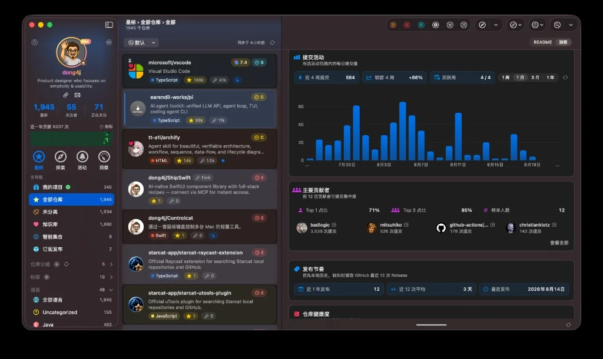

<div align="center">
<a href="https://starcat.ink"></a>

<h2>Starcat</h2>
<p>GitHub Stars 管理、本地知识库 RAG、Agent 工作台、我的项目、全局与仓库洞察、macOS 桌面小组件、AI 摘要与语义搜索、Release 追踪、Browser Plugin、Alfred / uTools / Raycast 等能力。</p>

<a href="https://github.com/starcat-app/homebrew-starcat"></a><br/>
<sub>
<b>macOS 15 Sequoia 或更高版本</b>：优先使用 <a href="https://github.com/starcat-app/homebrew-starcat">Homebrew</a> 安装，也可以下载面向 Apple Silicon Mac 的 <a href="https://starcat.ink/downloads/Starcat-1.3.0-arm64.dmg">当前 Direct 版本（1.3.0）</a>，或在 Mac App Store 获取 <b><a href="https://apps.apple.com/cn/app/starcat-for-github/id6788809803?mt=12">Starcat for GitHub</a></b>。<br>
历史版本与发布说明：<a href="./CHANGELOG-ZH.md">更新日志</a> · <a href="https://starcat.ink/changelog-zh.html">官网更新记录</a><br>
公开问题反馈：<a href="https://github.com/starcat-app/starcat-pro/issues">反馈 bug 或提出功能建议</a><br>
用户文档：<a href="https://starcat.mintlify.app/">starcat.mintlify.app</a> · 隐私：<a href="https://starcat.ink/privacy-zh.html">隐私政策</a> · <a href="https://starcat.ink/eula-zh.html">用户协议</a><br>
English: <a href="./README.md">README.md</a>
</sub>
</div>

<br />

<div align="center">
<a href="https://starcat.ink"></a>
<a href="https://starcat.ink/downloads/Starcat-1.3.0-arm64.dmg"></a>
<a href="https://github.com/starcat-app/starcat-localization"></a>
<a href="https://github.com/starcat-app/starcat-pro/issues"></a>
<a href="https://github.com/starcat-app"></a>
</div>

<br />

本仓库是 **macOS 客户端源码**。公开支持、Issue 和发布说明在 [starcat-pro](https://github.com/starcat-app/starcat-pro)。配套文档、CLI、插件和可自建 API 见下方「相关项目」。

## 这是什么

**Starcat** 是原生 macOS 应用，面向 GitHub Stars 已经超出普通收藏夹规模的人。它把 starred 仓库同步到本地优先的桌面工作区，渲染 README，支持标签、私有笔记和阅读状态，追踪 Release，评估仓库健康度，并把真正要用的项目收进可检索、可追问的本地知识库。

做 Starcat 的过程中，我开始重新看 GitHub Star 的本质。我们习惯把它们当成以后再看的书签。时间长了，它们是一份数字资产，记录专业兴趣、技能方向，以及以后可能真正用到的项目。

Star 本身还是公开的认同。真正准备学习、使用或长期保留的项目，再进入 Starcat 知识库。点 Star 不自动变成待整理清单，入库才进入检索、摘要和 RAG 问答的范围。

Starcat 一开始是按收费产品来做的，上线后几乎没人买。把 GitHub Stars 管到这个深度，需求可能太小众了。所以现在把相关项目全部开源，只保留 [`starcat-license-api`](https://github.com/starcat-app/starcat-license-api) 为私有，它负责 Direct 渠道授权。**Mac App Store** 和 **Direct**（[starcat.ink](https://starcat.ink)）仍会提供下载并继续维护。你也可以用本仓库自己编译、自己部署。

<div align="center">

</div>

当前公开版本为 **Starcat 1.3.0**。

## 官方包和自己编译

官方渠道是 Mac App Store（[Starcat for GitHub](https://apps.apple.com/cn/app/starcat-for-github/id6788809803?mt=12)）和 Direct（官网 DMG / Homebrew + Sparkle）。核心整理能力可免费使用。官方包里的 Pro 工作流、更高 AI 配额和代码智能，走 App Store 内购或 Direct 授权。

从本仓库编译、自建服务，不需要 Starcat License。Direct 授权签发仍走私有的 `starcat-license-api`。

首选 Homebrew：

```bash
brew tap starcat-app/starcat
brew trust starcat-app/starcat
brew install --cask starcat
```

也可以从 [starcat.ink](https://starcat.ink) 下载 Direct `.dmg`，拖到 `/Applications` 后用 GitHub 登录。

## 核心能力

主界面是三栏工作区：侧栏导航、仓库列表、当前仓库详情。另外还有两个独立工作台：知识库 RAG 和 Agent。

### 整理 Stars

用 GitHub OAuth 登录后增量同步 starred 仓库，数据落在本地 SQLite。仓库缓存丢了可以重建；标签、私有笔记、阅读状态是用户数据，不能丢。

- 三栏布局，macOS 26 优先适配 Liquid Glass
- 标签、语言、未分类、智能集合、置顶
- 阅读状态：未读 / 阅读中 / 已采用 / 已废弃
- 私有笔记，可基于 README 用 AI 起草或改写
- FTS5 全文搜索：仓库名、描述、Topics、笔记
- 语义搜索：按意图找仓库，不只靠关键词
- README 渲染，含图片、Mermaid、专注阅读
- JSON 导入导出，兼容 OhMyStar / Astral

### 知识库

Star 和知识库是两层。GitHub Star 表示公开认同；知识库表示这份仓库进入你的私有资料。可以从 Stars 批量入库，也可以在探索、周刊、Trending 里直接加入，不必先去 GitHub 点 Star。

入库之后，仓库才成为 RAG 索引、知识库浏览、MCP / CLI 默认上下文的来源。没入库的 Star 继续当收藏。

### 知识库 RAG 工作台

独立窗口，快捷键 `⇧⌘K`。默认只问知识库里的仓库，回答带引用，并能跳回对应仓库和证据片段。

工作台分三栏：左侧会话与知识库状态，中间流式回答，右侧 Citation Inspector 核对来源。检索是混合的：FTS5 关键词、Embedding 语义召回、RRF 融合。索引按分片建立，citation 能指到具体段落，而不只是仓库名。

还可以带上仓库洞察 XML、README / 笔记 / 摘要分片，以及文本、Markdown、JSON、源码附件。需要时可以显式走 GitHub 结构化查询或联网搜索，步骤会写进执行时间线。默认只读，不会自动改标签、笔记或入库状态。

### Agent 工作台

覆盖式任务窗口：左侧选 Agent 和历史，中间看步骤与工具调用，右侧看产物和确认。当前工具面向仓库、知识库、周刊、Trending、Discovery 这类只读或受确认的操作，例如整理未打标仓库、生成周报。运行过程可审计，写操作要经过确认。

### 理解单个仓库

详情页围绕当前仓库工作。AI 读完 README 后生成结构化摘要：项目做什么、技术栈是什么、适用场景有哪些。标签推荐带确认，不会直接写入。也可以对当前仓库追问，或按需翻译 README，保留原结构，支持分段对照和全文替换。

CodeFlow 用来看仓库内部的依赖和调用关系，不必离开 App 去另开编辑器。

### 评估与洞察

- Repo Health：活跃度、维护状态、风险信号
- OpenSSF Scorecard：公开安全评分雷达图
- 我的洞察：整理进度、技术分布、待处理项
- 仓库洞察：Star 增长、提交、协作、发布节奏、健康度与安全
- 洞察生成后可复用到摘要、对话和 RAG，作为可移除的只读上下文

### 找回与发现

智能集合覆盖 Needs Review、Unmaintained、High Value、No Tags 等规则，也可以自己组合元数据、状态、笔记和 Health 信号。我的项目用来看个人仓、组织仓和协作仓，私有仓走 GitHub App 授权。

探索侧有 GitHub Trending、发现榜单、阮一峰周刊等来源，以及 Release 订阅、时间线和按平台过滤的下载资产。桌面小组件可以看常用仓库、今日重逢、未读 Release 和收藏趋势。

### 接到其他工具

同一份本地数据可以通过 CLI、MCP、Agent Skill、浏览器插件和启动器使用。浏览器插件在 GitHub 页面上带出笔记、标签、健康度和 AI 操作。Alfred、uTools、Raycast 可以直接搜本地仓库。分享卡片和短链给还没装 Starcat 的人看。

AI 走 BYOK 或自建代理：Gemini、OpenAI、Anthropic Claude、DeepSeek、Ollama。Key 和配额留在你这边。界面目前 18 种语言，翻译在 [starcat-localization](https://github.com/starcat-app/starcat-localization)。

## 数据在哪

标签、私有笔记、阅读状态、知识库归属和 RAG 分片都在本机 SQLite。GitHub Token 和 AI API Key 在 Keychain。仓库缓存（README、元数据）丢了可以重建，用户数据不行。

出本机的请求只有这几类：

- GitHub.com：同步 Stars、拉 README / Release、OAuth
- 你配置的 AI Provider：摘要、对话、RAG 生成和 Embedding（Ollama 则留在本机）
- 可选的 Starcat 支撑 API：Trending、周刊、发现、Wiki 探测、相似推荐、公开分享页；都可以自建
- 可选的外部检索后端：Meilisearch、Qdrant，默认仍用 SQLite FTS5 和本地向量

CloudKit 同步字段已经预留，生产版本还没有接上。Starcat 不托管你的 AI Key，也不会把知识库默认上传到自家服务器。

## 截图

<p align="center">
  
  
</p>
<p align="center">
  
  
</p>
<p align="center">
  
  
</p>
<p align="center">
  
  
</p>
<p align="center">
  
  
</p>
<p align="center">
  
  
</p>
<p align="center">
  
  
</p>

## 相关项目

本仓库是 macOS 客户端源码。Starcat 还有一组独立仓库，覆盖文档、分发、CLI、插件和可自建 API。完整清单在 [`supports/README.md`](supports/README.md)。组织主页：[github.com/starcat-app](https://github.com/starcat-app)。

### 产品、文档与分发

| 项目 | 说明 |
|------|------|
| [starcat.ink](https://starcat.ink) | Direct 官网、下载、更新说明 |
| [starcat-pro](https://github.com/starcat-app/starcat-pro) | 公开支持、Issue、Changelog 与营销图 |
| [starcat-docs](https://github.com/starcat-app/starcat-docs) | 官方用户文档源码，发布于 [starcat.mintlify.app](https://starcat.mintlify.app/) |
| [starcat-site](https://github.com/starcat-app/starcat-site) | Direct / App Store 官网与法律页面源码 |
| [starcat-localization](https://github.com/starcat-app/starcat-localization) | 界面本地化资源，目前 18 种语言 |
| [homebrew-starcat](https://github.com/starcat-app/homebrew-starcat) | App 的 Homebrew Cask：`brew install --cask starcat` |

### 在其他工具里用 Starcat

| 项目 | 说明 |
|------|------|
| [starcat-cli](https://github.com/starcat-app/starcat-cli) | 跨平台 CLI，并作为 MCP 运行时给 Agent 读同一份本地知识库 |
| [homebrew-starcat-cli](https://github.com/starcat-app/homebrew-starcat-cli) | CLI 的 Homebrew Formula |
| [starcat-skill](https://github.com/starcat-app/starcat-skill) | 给 Codex / Claude Code 等 Agent 用的 Skill |
| [starcat-chrome-plugin](https://github.com/starcat-app/starcat-chrome-plugin) | Chrome 插件，在 GitHub 页面里用 Starcat 上下文 |
| [starcat-safari-plugin](https://github.com/starcat-app/starcat-safari-plugin) | Safari 插件 |
| [starcat-alfred-workflow](https://github.com/starcat-app/starcat-alfred-workflow) | Alfred 搜索本地仓库与 GitHub |
| [starcat-utools-plugin](https://github.com/starcat-app/starcat-utools-plugin) | uTools 搜索本地仓库与 GitHub |
| [starcat-raycast-extension](https://github.com/starcat-app/starcat-raycast-extension) | Raycast 搜索本地仓库与 GitHub |

### 可自建后端

客户端会请求一组独立 API。GitHub 官方没有 Trending 接口，周刊、发现、Wiki 探测、相似推荐、公开分享页也都需要服务端。这些仓库都可以自己部署，各仓 README 里有部署说明。

| 项目 | 说明 |
|------|------|
| [starcat-sharing-api](https://github.com/starcat-app/starcat-sharing-api) | 分享短链与公开分享页 |
| [starcat-trending-api](https://github.com/starcat-app/starcat-trending-api) | GitHub Trending 抓取与 API |
| [starcat-weekly-api](https://github.com/starcat-app/starcat-weekly-api) | 周刊、Show HN、HelloGitHub 等发现源 |
| [starcat-wiki-api](https://github.com/starcat-app/starcat-wiki-api) | DeepWiki / Zread / CodeWiki 收录探测 |
| [starcat-recommend-api](https://github.com/starcat-app/starcat-recommend-api) | 相似仓库推荐 |
| [starcat-discovery-api](https://github.com/starcat-app/starcat-discovery-api) | 探索、热门、新发布榜单 |
| [starcat-api-kit](https://github.com/starcat-app/starcat-api-kit) | 六个业务 API 共用的 auth / envelope / GitHub 基础包 |
| [starcat-license-api](https://github.com/starcat-app/starcat-license-api) | Direct 授权，仓库保持私有 |

知识库关键词默认走 SQLite FTS5，向量默认本地计算。若要在本机验证外部检索后端，见 [`docker/meilisearch`](docker/meilisearch/README.md) 和 [`docker/qdrant`](docker/qdrant/README.md)。端口只绑 `127.0.0.1`。

## 文章

- 少数派：[我为 GitHub 重度使用者做了一款 macOS 原生应用](https://sspai.com/post/113420)
- 个人博客：[同一篇文章](https://blog.dong4j.site/posts/37f07b70.html)

## 从源码编译

完整步骤（客户端、配套 API、CLI、本机 Meilisearch / Qdrant）见 **[本地编译教程](docs/7-工具与脚本/本地编译教程.md)**。贡献约定见 [CONTRIBUTING.md](./CONTRIBUTING.md)。

最短路径：macOS 15+、Xcode 26+、`brew install xcodegen`，checkout `dev`，复制 `Configs/Secrets.xcconfig.template`，`xcodegen generate` 后 Run `Starcat` scheme。新增或删除 Swift 文件后再跑一次 `xcodegen generate`。

配套仓库一次拉齐：

```bash
cd supports
./clone-all.sh
```

`supports/` 是独立 git 仓库的工作区，不进本仓库的提交。`starcat-license-api` 和 `starcat-api` 是私有仓，需要组织权限。

### 项目结构

```text
Starcat/
├── App/                 # 入口、生命周期、依赖装配
├── Features/
│   ├── Home/            # 三栏主窗口
│   ├── RAG/             # 知识库 RAG 工作台
│   ├── Agents/          # Agent 工作台
│   ├── AI/              # 摘要、对话、翻译、语义搜索
│   ├── Insights/        # 我的洞察 / 仓库洞察
│   ├── Explore/         # 发现
│   ├── Trending/        # GitHub Trending
│   ├── Tags/            # 标签
│   ├── Releases/        # Release 订阅与时间线
│   ├── MCP/             # 本地 MCP 门面
│   └── Settings/        # 设置
├── Core/
│   ├── Database/        # GRDB / 迁移
│   ├── RAG/             # 分片索引与写入
│   ├── Network/         # GitHub API
│   ├── Sync/            # Stars 同步
│   └── Keychain/        # Token 与 API Key
├── Shared/              # 共享组件与工具
└── Resources/
```

### 测试

跑命令行测试前请关掉 Xcode IDE，避免抢同一个 `testmanagerd`。启动期任何 Keychain / 系统授权调用必须用 `TestEnvironment.isRunning` 门控，否则测试 host 会卡住。

```bash
xcodegen generate
xcodebuild -scheme Starcat -destination 'platform=macOS,arch=arm64' test
```

### 技术栈

| 层级 | 技术选型 |
|------|---------|
| 客户端 | SwiftUI + macOS 15+，macOS 26 Liquid Glass |
| 本地数据库 | GRDB.swift（SQLite）、FTS5、本地 Embedding |
| 云同步 | CloudKit 字段已预留，生产版本尚未接入 |
| 安全存储 | Keychain |
| AI | BYOK / 自建代理（Gemini / OpenAI / Claude / DeepSeek / Ollama） |

## 兼容性

- 当前支持 **macOS 15 Sequoia 或更高版本**
- 公开 Direct 下载面向 **Apple Silicon Mac**
- 没有 iOS、iPadOS、watchOS、Windows 或 Android 版本
- 从源码编译需要 Apple Developer Program（$99/年）
- AI 能力取决于你配置的 Provider 或 API Key

## 竞品参考

| 应用 | 特点 |
|------|------|
| [Starship](https://apps.apple.com/us/app/starship-your-stars-on-github/id1530665887) | 嵌套标签、iCloud 同步 |
| [OhMyStar](https://apps.apple.com/cn/app/ohmystar/id1218642292) | 功能完整、搜索强大 |
| [GithubStarsManager](https://github.com/AmintaCCCP/GithubStarsManager) | AI 摘要、语义搜索、Release 追踪 |

## 文档

- [本地编译教程](docs/7-工具与脚本/本地编译教程.md) - 从源码编 App、配套 API 和 CLI
- [用户文档](https://starcat.mintlify.app/) - 安装、功能与日常使用
- [功能清单](docs/1-立项/功能清单.md) - 完整功能规格
- [功能实现总览](docs/功能实现总览.md) - 主进度索引与工程债
- [详细设计索引](docs/3-设计/详细设计/README.md) - 技术设计文档入口
- [DESIGN.md](DESIGN.md) - 主窗口 / RAG / Agent 的 UI 契约

## 贡献

见 [CONTRIBUTING.md](./CONTRIBUTING.md)。请遵守 [Code of Conduct](./CODE_OF_CONDUCT.md)。

## 安全

请按 [SECURITY.md](./SECURITY.md) 私下报告漏洞，不要发到公开 Issue。

## 支持

产品问题请到 [starcat-pro](https://github.com/starcat-app/starcat-pro/issues)。
源码问题请到本仓库。说明见 [SUPPORT.md](./SUPPORT.md)。

## License

[MIT](./LICENSE) © 2026 dong4j

第三方声明：[THIRD_PARTY_NOTICES.md](./THIRD_PARTY_NOTICES.md)
