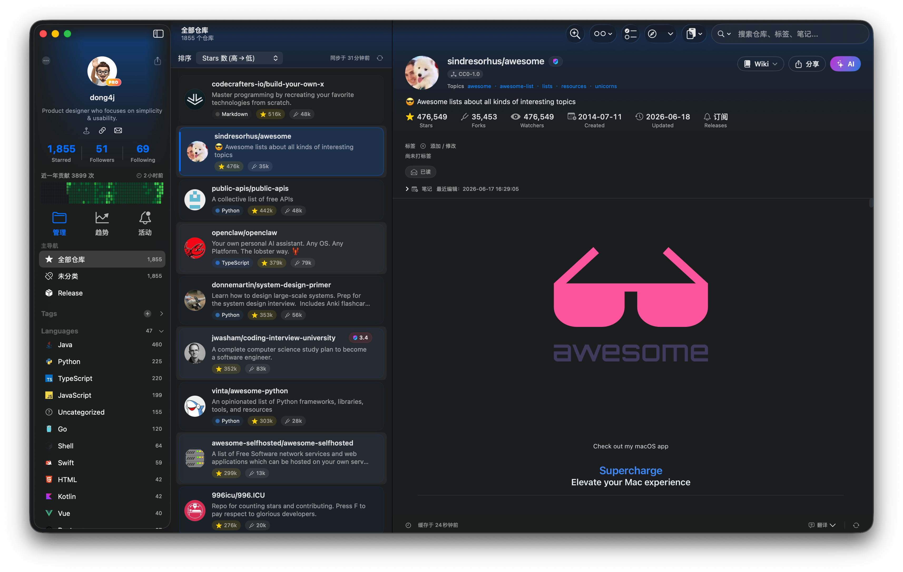

# Starcat



> A GitHub Star manager and AI knowledge organizer for power users on Apple platforms

[](https://developer.apple.com)
[](https://swift.org)
[](https://www.apple.com/macos)

[简体中文](./README-ZH.md)

## Core Value

**Organize, understand, rediscover, and evaluate** — turn GitHub Stars from a flat list of bookmarks into a reusable knowledge base.

## Features

### Essentials

- GitHub OAuth sign-in and incremental synchronization
- Native three-column interface for macOS 15+, with first-class Liquid Glass support on macOS 26
- Tag organization and language filters
- FTS5 full-text search
- README Markdown rendering
- Private notes and reading status management (Unread / Reading / Adopted / Deprecated)
- JSON import and export compatible with OhMyStar and Astral

### AI

- AI-generated summaries in English and Chinese
- AI tag recommendations with a confirmation workflow
- Hybrid semantic search using BM25, Embeddings, and RRF
- Personalized daily recommendations from GitHub Trending
- AI-assisted repository health evaluation
- 14 preset categories

### Differentiators

- Release subscription tracking
- Unified activity timeline
- Smart release asset filtering for macOS, Windows, and Linux
- One-click subscription and download workflows

## Technology Stack

| Layer | Technology |
|------|------------|
| Client | SwiftUI + macOS 26 |
| Local database | GRDB.swift (SQLite) |
| Cloud sync | CloudKit |
| Secure storage | Keychain |
| AI proxy | Self-hosted service (Gemini/OpenAI/DeepSeek) |

## Requirements

- macOS 15 (Sequoia) or later
- Apple Developer Program membership ($99/year)

## Development

### Setup

1. Install Xcode 26 or later.
2. Clone this repository.
3. Open `Starcat.xcodeproj`.
4. Configure Signing & Capabilities.
5. Run the project.

### Project Structure

```text
Starcat/
├── App/
│   ├── StarcatApp.swift          # Application entry point
│   ├── ContentView.swift         # Root view
│   └── AppDependencies.swift     # Dependency composition
├── Features/
│   ├── Auth/                     # GitHub OAuth
│   ├── Home/                     # Three-column main interface
│   ├── Tags/                     # Tag management
│   ├── Notes/                    # Private notes and reading status
│   └── Settings/                 # Settings
├── Core/
│   ├── Database/                 # GRDB database layer
│   ├── Network/                  # GitHub API
│   ├── Sync/                     # Synchronization and repositories
│   ├── Keychain/                 # Secure storage
│   ├── Settings/                 # Local settings
│   ├── Cache/                    # Cache cleanup
│   └── Models/                   # Domain models
├── Shared/
│   ├── Components/               # Shared components
│   └── Utilities/                # Utilities and logging
└── Resources/
    └── Assets.xcassets
```

### Full Test Suite

```bash
xcodegen generate
xcodebuild -scheme Starcat -destination 'platform=macOS,arch=arm64' test
```

### AI Service Configuration

Starcat supports several AI service modes:

1. **Starcat Pro** with built-in quota
2. **Self-hosted service** on your own server
3. **BYOK** with your own API key

Supported providers:

- Google Gemini
- OpenAI
- Anthropic Claude
- DeepSeek
- Ollama for local models

## Related Projects

| App | Highlights |
|-----|------------|
| [Starship](https://apps.apple.com/us/app/starship-your-stars-on-github/id1530665887) | Nested tags and iCloud sync |
| [OhMyStar](https://apps.apple.com/cn/app/ohmystar/id1218642292) | Comprehensive features and powerful search |
| [GithubStarsManager](https://github.com/AmintaCCCP/GithubStarsManager) | AI summaries, semantic search, and release tracking |

## Pricing

| Plan | Price | Includes |
|------|-------|----------|
| Free | $0 | GitHub OAuth and Stars sync, offline SQLite cache, untagged/tag/language views, filters, README previews, Clone URL and GitHub shortcuts, private notes, status management, local full-text search, HTML/Markdown export, and share cards; free limits are 20 tags, 4 Smart Collections, and 5 Release subscriptions |
| Pro Monthly | $3.99/month | Unlimited tags, collections, and Release subscriptions; Release polling and notifications; AI summaries, AI tag recommendations, AI Chat, README translation, automatic AI organization, Embedding semantic search, LLM-friendly web context, RepoContextPacker, CodeFlow, Trending AI recommendations, and BYOK provider configuration |
| Pro Yearly | $29.99/year | Everything in Pro Monthly, with about 37% savings compared with monthly billing |
| Pro Lifetime | $39.99 one-time | Everything in Pro Monthly, with lifetime access to the current Pro feature set and no recurring subscription |
| Self-hosted service | Free | Use your own server |

## Documentation

- [Feature list](docs/1-立项/功能清单.md) — complete feature specification
- [Implementation overview](docs/功能实现总览.md) — primary progress index and engineering debt
- [Detailed design index](docs/3-设计/详细设计/README.md) — technical design documentation
- [Open Design UI skill](docs/原型设计/Starcat-UI-SKILL.md) — UI design guidelines

## Contributing

See [CONTRIBUTING.md](./CONTRIBUTING.md). Please follow the [Code of Conduct](./CODE_OF_CONDUCT.md).

## Security

Report vulnerabilities privately as described in [SECURITY.md](./SECURITY.md).

## Support

Product questions: [starcat-pro](https://github.com/starcat-app/starcat-pro/issues).
Source-code issues: this repository. Details in [SUPPORT.md](./SUPPORT.md).

## License

[MIT](./LICENSE) © 2026 dong4j

Third-party notices: [THIRD_PARTY_NOTICES.md](./THIRD_PARTY_NOTICES.md)
