<div align="center">
<a href="https://starcat.ink">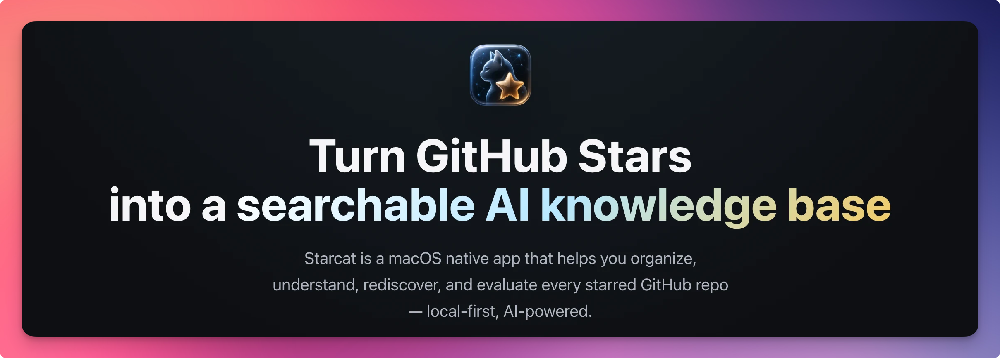</a>

<h2>Starcat</h2>
<p>GitHub Stars management, local RAG knowledge base, Agent workspace, My Projects, library and repository insights, macOS desktop widgets, AI summaries, semantic search, release tracking, browser plugins, Alfred / uTools / Raycast, and more.</p>

<a href="https://github.com/starcat-app/homebrew-starcat"></a>
<br/>
<a href="https://apps.apple.com/app/starcat-for-github/id6788809803?mt=12"></a>
<br/>
<sub>
<b>macOS 15 Sequoia or newer</b>: Install with <a href="https://github.com/starcat-app/homebrew-starcat">Homebrew</a>, download the <a href="https://starcat.ink/downloads/Starcat-1.3.0-arm64.dmg">current Direct build (1.3.0)</a> for Apple Silicon Macs, or get <b><a href="https://apps.apple.com/app/starcat-for-github/id6788809803?mt=12">Starcat for GitHub</a></b> from the Mac App Store.<br>
Previous versions and release notes: <a href="./CHANGELOG.md">Changelog</a> · <a href="https://starcat.ink/changelog.html">Website changelog</a><br>
Public issue tracker: <a href="https://github.com/starcat-app/starcat-pro/issues">Report a bug or request a feature</a><br>
User docs: <a href="https://starcat.mintlify.app/">starcat.mintlify.app</a> · Mac App Store: <a href="https://dong4j.app/starcat/">dong4j.app/starcat</a> · Privacy: <a href="https://starcat.ink/privacy.html">Privacy Policy</a> · <a href="https://starcat.ink/eula.html">EULA</a><br>
中文说明: <a href="./README-ZH.md">README-ZH.md</a>
</sub>
</div>

<br />

<div align="center">
<a href="https://starcat.ink"></a>
<a href="https://dong4j.app/starcat/"></a>
<a href="https://starcat.ink/downloads/Starcat-1.3.0-arm64.dmg"></a>
<a href="https://github.com/starcat-app/starcat-localization"></a>
<a href="https://github.com/starcat-app/starcat-pro/issues"></a>
<a href="https://github.com/starcat-app"></a>
</div>

<br />

This repository is the **macOS app source**. Public support, issues, and release notes live in [starcat-pro](https://github.com/starcat-app/starcat-pro). Docs, CLI, plugins, and self-hostable APIs are listed under Related projects.

## About Starcat

**Starcat** is a native macOS app for people whose GitHub Stars have outgrown a bookmark list. It syncs starred repositories into a local-first desktop workspace, renders README content, adds tags, notes and reading status, tracks releases, evaluates repository health, and turns the repos you still need into a searchable, askable knowledge base.

While building Starcat I started thinking about what a GitHub Star is. We treat them as read-later bookmarks. Over time they become a digital asset: a record of professional interest, technical judgment, and projects we may still need.

A public Star is still an endorsement. Repositories you plan to learn, use, or keep go into the Starcat knowledge base. Starring does not create a backlog you must tidy. Only ingested repos enter search, summaries, and RAG.

Starcat started as a paid product. Almost nobody bought it. Managing GitHub Stars this deeply turned out to be a niche of one. The related projects are now open source, except [`starcat-license-api`](https://github.com/starcat-app/starcat-license-api), which stays private because it issues Direct licenses. Official **Mac App Store** and **Direct** ([starcat.ink](https://starcat.ink)) builds remain available and will keep being maintained. You can also build from this repository and run your own stack.

<div align="center">
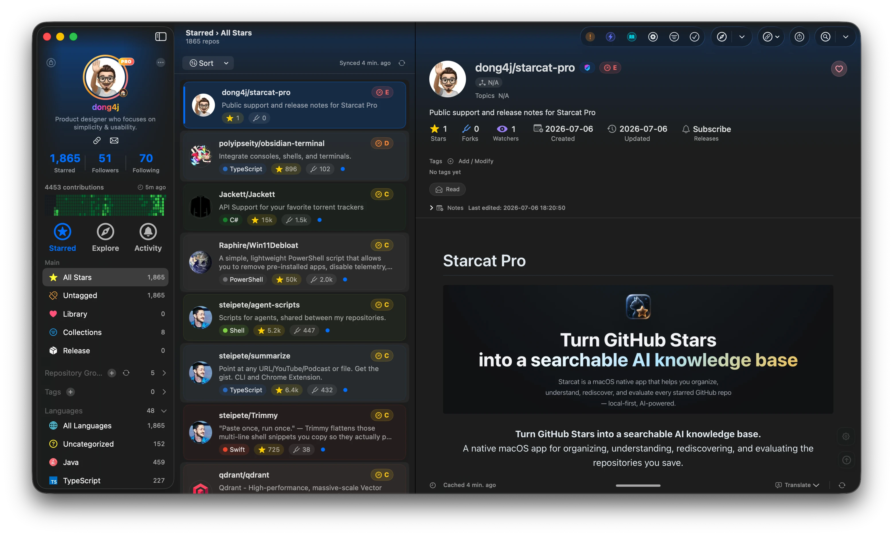
</div>

The current public version is **Starcat 1.3.0**.

## Official builds and source

Official channels are the Mac App Store ([Starcat for GitHub](https://apps.apple.com/app/starcat-for-github/id6788809803?mt=12), landing page [dong4j.app/starcat](https://dong4j.app/starcat/)) and Direct (website DMG / Homebrew with Sparkle). Core organization features are free. Pro workflows, higher AI quotas, and code-intelligence features in official builds use App Store in-app purchase or a Direct license.

Building from this repository and running your own services does not require a Starcat license. Direct license issuance stays on the private `starcat-license-api`.

Homebrew is the preferred install:

```bash
brew tap starcat-app/starcat
brew trust starcat-app/starcat
brew install --cask starcat
```

You can also download the Direct `.dmg` from [starcat.ink](https://starcat.ink), move Starcat to `/Applications`, and sign in with GitHub.

## What it does

The main window is a three-column workspace: sidebar, repository list, and the current repo. Two more windows sit beside it: the knowledge-base RAG workspace and the Agent workspace.

### Manage Stars

Sign in with GitHub OAuth, sync starred repos incrementally, and keep the cache in local SQLite. Repository cache can be rebuilt. Tags, private notes, and reading status are user data and must not be lost.

- Three-column layout, with Liquid Glass on macOS 26
- Tags, languages, untagged, Smart Collections, pinning
- Reading status: Unread / Reading / Adopted / Deprecated
- Private notes, with optional AI drafts from the README
- FTS5 search across names, descriptions, topics, and notes
- Semantic search by intent, not only exact keywords
- README rendering with images, Mermaid, and a reading surface
- JSON import and export compatible with OhMyStar and Astral

### Knowledge base

Stars and the knowledge base are separate layers. A GitHub Star is a public endorsement. The knowledge base is your private set of repos worth keeping. You can ingest from Stars in bulk, or add a repo from Explore, Weekly, or Trending without starring it on GitHub first.

RAG indexing, knowledge-base browsing, and the default CLI / MCP context all start from ingested repos. Stars you never ingest stay a collection.

### Knowledge-base RAG workspace

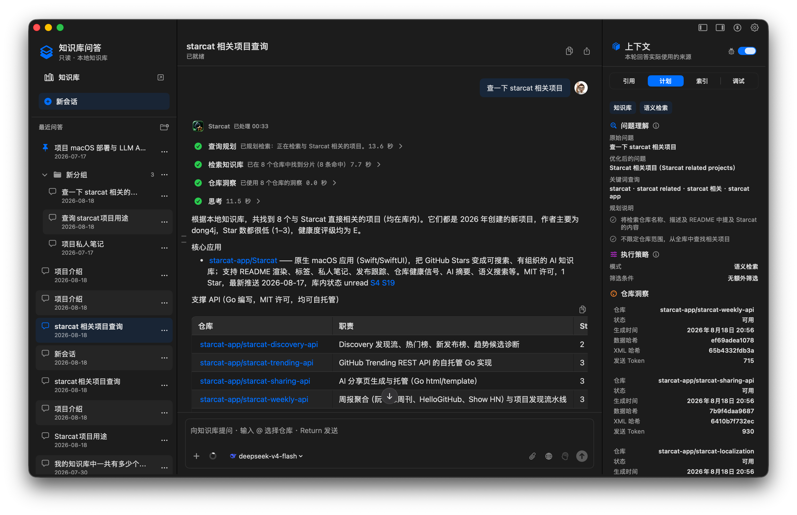

Opens in its own window (`⇧⌘K`). Questions default to ingested repos. Answers stream with citations you can open back to the matching repository and evidence chunk.

The layout is a conversation rail, an answer surface, and a Citation Inspector. Retrieval mixes FTS5 keywords, embeddings, and RRF. The index is chunk-level, so a citation can point at a paragraph, not only a repo name.

You can attach insight XML, README / notes / summary chunks, and text, Markdown, JSON, or source-code files. GitHub structured lookups and web search are opt-in, and they show up on the execution timeline. The workspace is read-only by default. It will not write tags, notes, or library state on its own.

### Evaluate and review

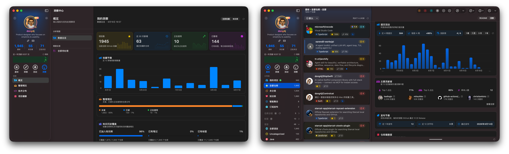

- Repo Health: activity, maintenance, risk signals
- OpenSSF Scorecard: public security radar
- My Insights: organization progress, tech mix, follow-ups
- Repository Insights: star growth, commits, collaboration, release cadence, health and security
- Generated insights can feed summaries, repo chat, and RAG as removable read-only context

### Rediscover and explore

Smart Collections cover Needs Review, Unmaintained, High Value, No Tags, and custom rules over metadata, status, notes, and Health. My Projects lists personal, organization, and collaborator repos, including private ones via GitHub App.

Explore covers GitHub Trending, discovery boards, and sources such as ruanyf Weekly, plus Release subscriptions, a unified timeline, and platform-filtered assets. Desktop widgets surface frequent repos, a daily rediscovery, unread releases, and star trends.

### Share a starred repository

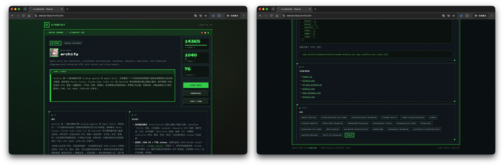

From the repo detail you can copy the GitHub link for people who do not have Starcat. Starred public repos can also get a standalone public share page: summary, stars / forks, README highlights, topics, and switchable card styles. Recipients open a webpage. No account required.

Public share pages run on [`starcat-sharing-api`](https://github.com/starcat-app/starcat-sharing-api), which you can self-host. Private repos do not get a page the server can crawl.

### Analyze a starred repository

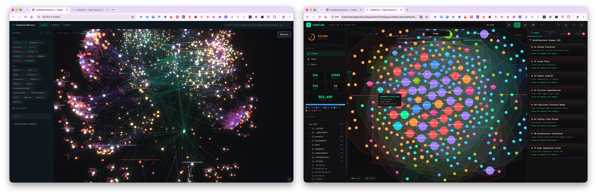

You can pull the current repo's source onto this Mac and inspect structure without cloning it into another IDE. Starcat embeds two open-source analyzers:

- **[codebase-memory-mcp](https://github.com/DeusData/codebase-memory-mcp)**: a symbol-level knowledge graph. Files, classes, functions, and dependencies unfold in a local 3D view, filterable by type.
- **[codeflow](https://github.com/braedonsaunders/codeflow)**: an architecture checkup. File size, coupling, cycles, duplication, complexity, and a health score.

Source defaults to a GitHub ZIP. Generated artifacts can be deleted.

### Notes, summaries, and repo chat

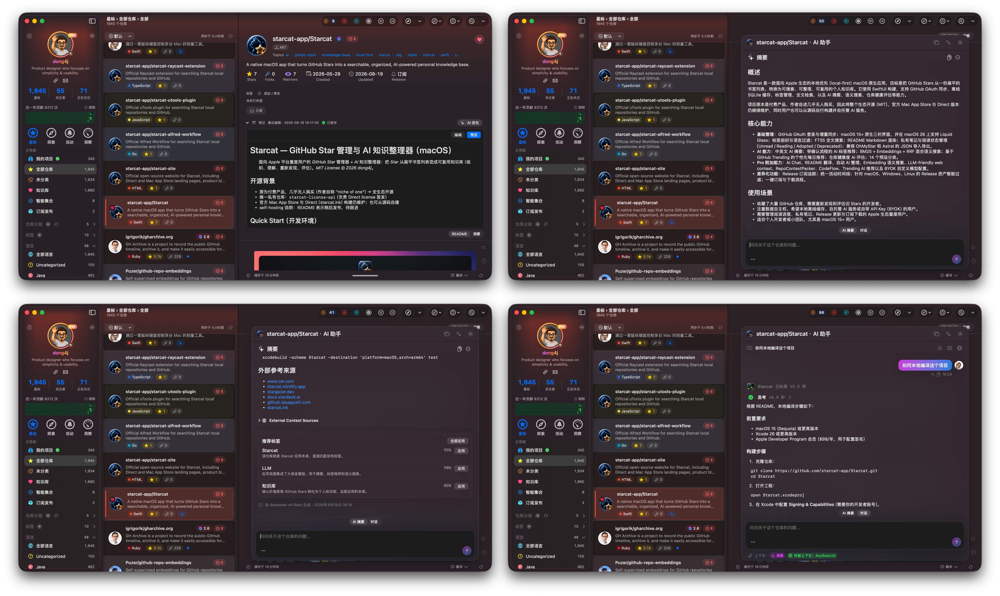

This is AI in the main-window detail pane, not a separate workspace. Notes, summaries, and tags stay on this Mac. After ingest they enter RAG.

- **Notes**: AI can draft a private note from the README. You edit it afterwards. This is where gotchas, setup steps, and mismatches with upstream docs belong. Notes never go back to GitHub.
- **Summaries and tags**: AI reads the README and writes a structured summary (what it does, which stack, where it fits), then suggests tags. Tags land only after you confirm. You can also batch-generate tags for every starred repo and confirm them one by one. Both summaries and tags are indexed for RAG.
- **Repo chat**: Ask the current project directly, for example how to build it or where a feature lives. Answers use that repo's README, notes, and summary. You can also translate the README while keeping structure, as a bilingual view or a full replacement.

### Use the same data elsewhere

CLI, MCP, an Agent Skill, browser plugins, and launchers all read the local store. The browser plugins bring notes, tags, health, and AI actions onto GitHub pages. Alfred, uTools, and Raycast search local repos. Share cards and short links work for people who do not have Starcat installed.

AI runs through BYOK or a self-hosted proxy: Gemini, OpenAI, Anthropic Claude, DeepSeek, Ollama. Keys and quotas stay with you. The UI ships in 18 languages. Translations live in [starcat-localization](https://github.com/starcat-app/starcat-localization).

## Where data lives

Tags, private notes, reading status, knowledge-base membership, and RAG chunks stay in local SQLite. GitHub tokens and AI API keys stay in Keychain. Repository cache (README, metadata) can be rebuilt. User data cannot.

Traffic that leaves the Mac:

- GitHub.com: Stars sync, README / Release fetch, OAuth
- The AI provider you configure: summaries, chat, RAG generation, and embeddings (Ollama stays on-device)
- Optional Starcat support APIs: Trending, Weekly, discovery, wiki probes, similar-repo recommendations, public share pages. All of these can be self-hosted
- Optional external search backends: Meilisearch and Qdrant. The default remains SQLite FTS5 and local vectors

CloudKit sync fields are reserved. The production adapter is not wired yet. Starcat does not host your AI keys, and it does not upload the knowledge base to a Starcat server by default.

## Screenshots

<p align="center">
  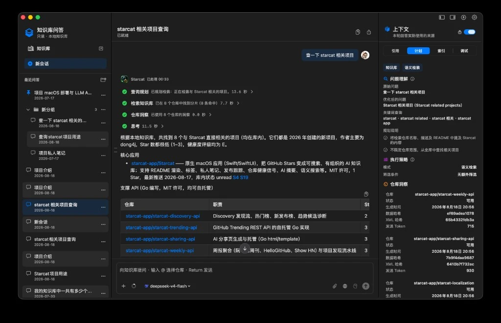
  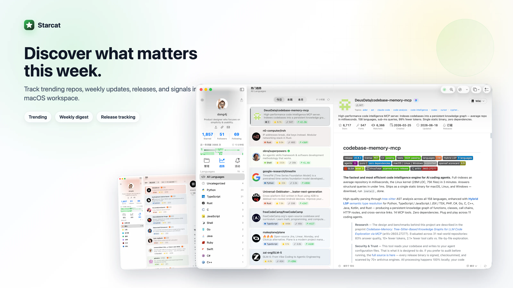
</p>
<p align="center">
  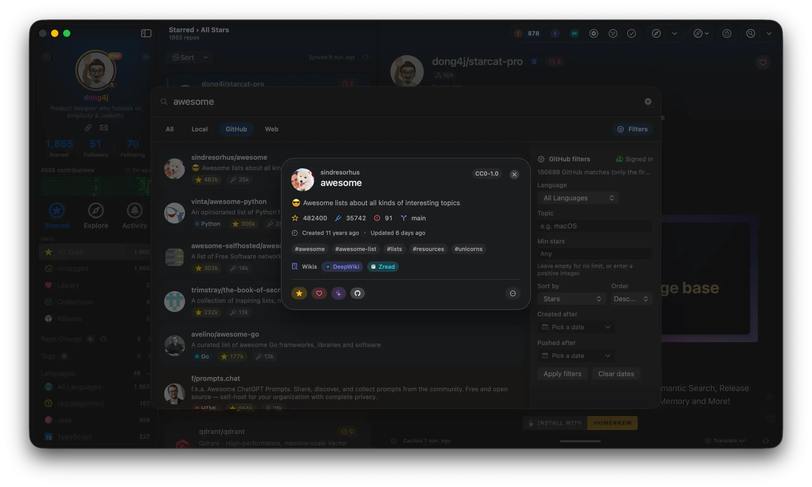
  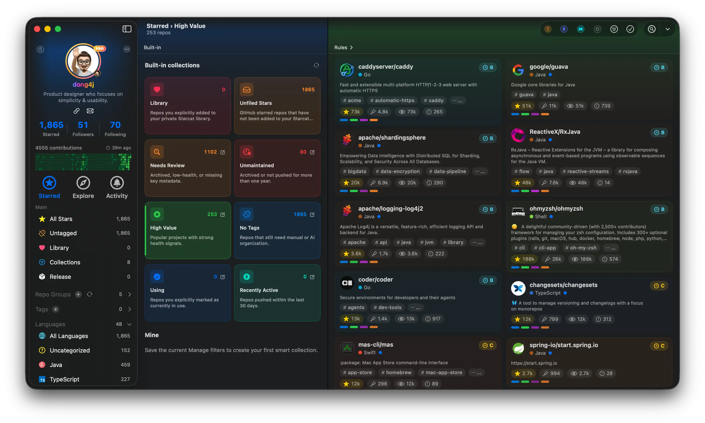
</p>
<p align="center">
  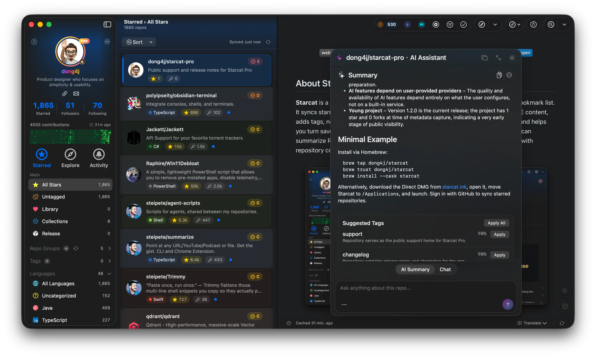
  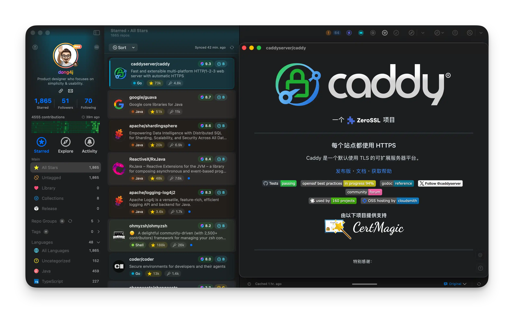
</p>
<p align="center">
  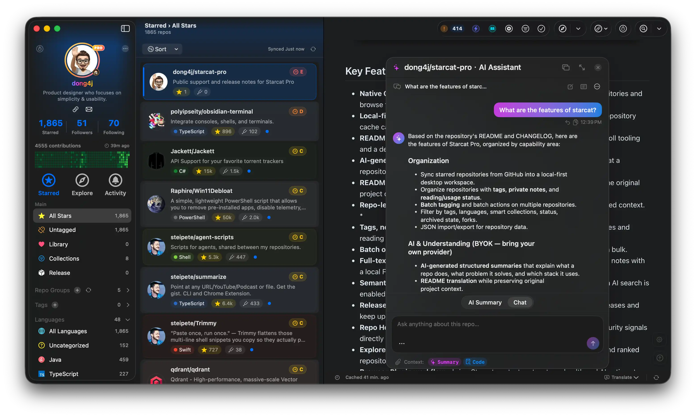
  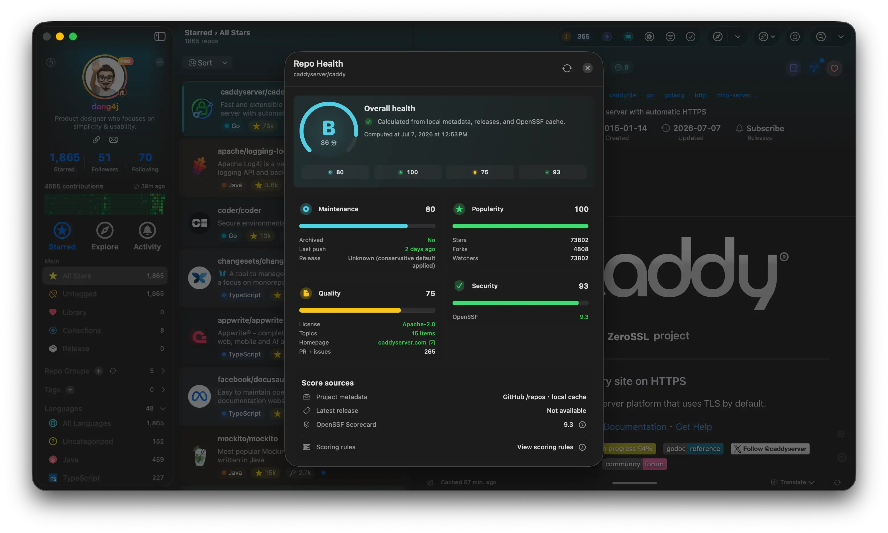
</p>
<p align="center">
  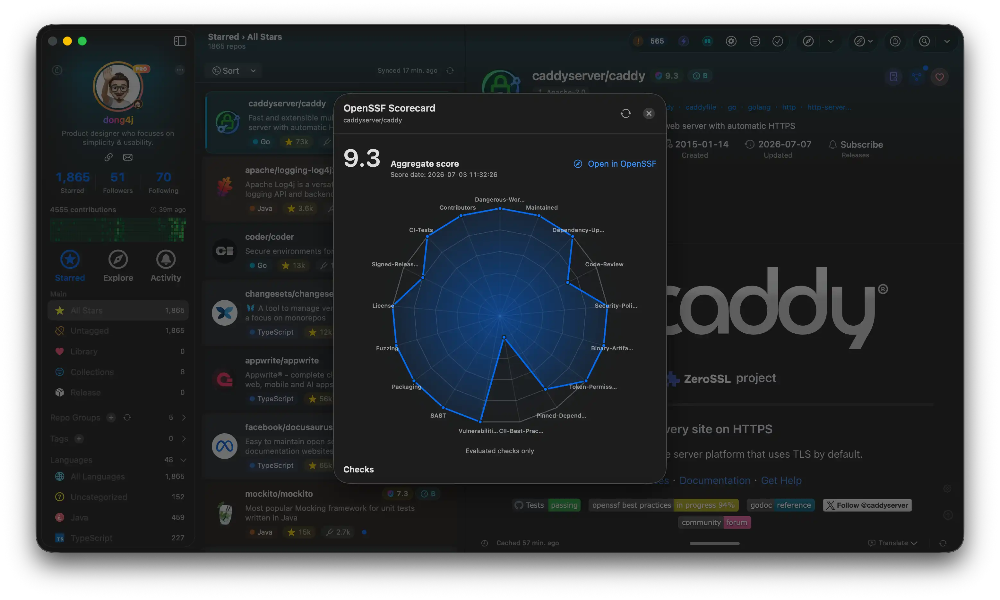
  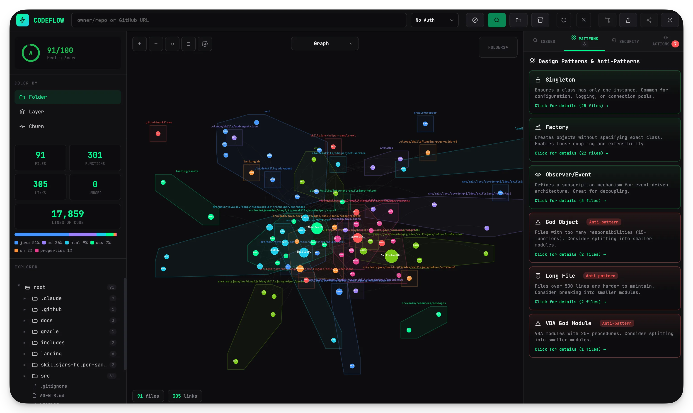
</p>
<p align="center">
  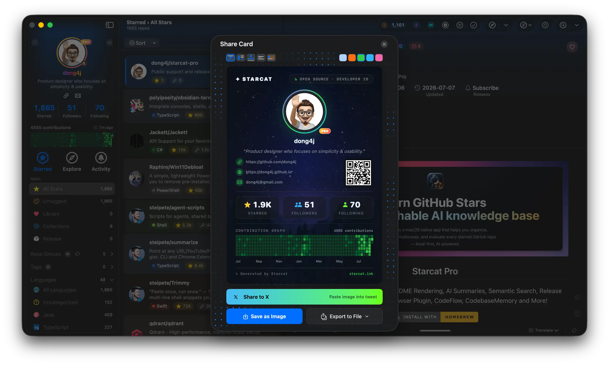
  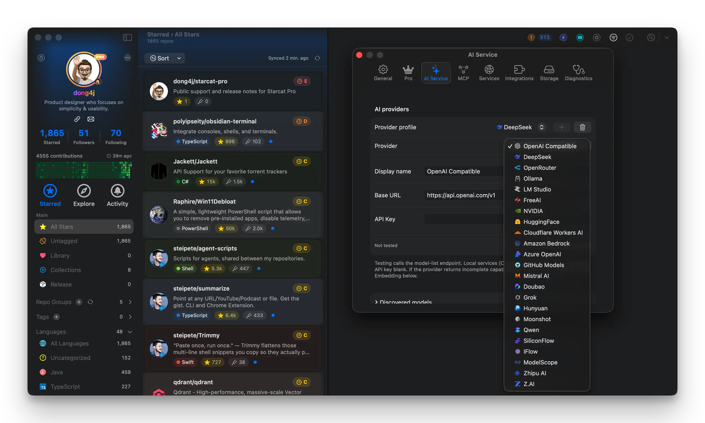
</p>

## Related projects

This repository is the macOS app. Starcat also has standalone repos for docs, distribution, CLI, plugins, and self-hostable APIs. The full map is in [`supports/README.md`](supports/README.md). Organization home: [github.com/starcat-app](https://github.com/starcat-app).

### Product, docs, and distribution

| Project | Role |
|---------|------|
| [starcat.ink](https://starcat.ink) | Direct website, downloads, release notes |
| [dong4j.app/starcat](https://dong4j.app/starcat/) | Mac App Store landing page |
| [starcat-pro](https://github.com/starcat-app/starcat-pro) | Public support, issues, changelog, and promo images |
| [starcat-docs](https://github.com/starcat-app/starcat-docs) | Official user docs, published at [starcat.mintlify.app](https://starcat.mintlify.app/) |
| [starcat-site](https://github.com/starcat-app/starcat-site) | Direct / App Store site and legal pages |
| [starcat-localization](https://github.com/starcat-app/starcat-localization) | UI localization, currently 18 languages |
| [homebrew-starcat](https://github.com/starcat-app/homebrew-starcat) | App Homebrew Cask: `brew install --cask starcat` |

### Use Starcat from other tools

| Project | Role |
|---------|------|
| [starcat-cli](https://github.com/starcat-app/starcat-cli) | Cross-platform CLI and MCP runtime over the local knowledge base |
| [homebrew-starcat-cli](https://github.com/starcat-app/homebrew-starcat-cli) | CLI Homebrew Formula |
| [starcat-skill](https://github.com/starcat-app/starcat-skill) | Skill for agents such as Codex and Claude Code |
| [starcat-chrome-plugin](https://github.com/starcat-app/starcat-chrome-plugin) | Chrome extension with Starcat context on GitHub pages |
| [starcat-safari-plugin](https://github.com/starcat-app/starcat-safari-plugin) | Safari extension |
| [starcat-alfred-workflow](https://github.com/starcat-app/starcat-alfred-workflow) | Search local repos and GitHub from Alfred |
| [starcat-utools-plugin](https://github.com/starcat-app/starcat-utools-plugin) | Search local repos and GitHub from uTools |
| [starcat-raycast-extension](https://github.com/starcat-app/starcat-raycast-extension) | Search local repos and GitHub from Raycast |

### Self-hostable APIs

The app talks to a small set of independent APIs. GitHub has no Trending endpoint. Weekly, discovery, wiki probes, similar-repo recommendations, and public share pages also need a server. These repos can be deployed on your own. Each one has its own README and deploy notes.

| Project | Role |
|---------|------|
| [starcat-sharing-api](https://github.com/starcat-app/starcat-sharing-api) | Share short links and public share pages |
| [starcat-trending-api](https://github.com/starcat-app/starcat-trending-api) | GitHub Trending crawl and API |
| [starcat-weekly-api](https://github.com/starcat-app/starcat-weekly-api) | Weekly, Show HN, HelloGitHub, and related feeds |
| [starcat-wiki-api](https://github.com/starcat-app/starcat-wiki-api) | DeepWiki / Zread / CodeWiki availability |
| [starcat-recommend-api](https://github.com/starcat-app/starcat-recommend-api) | Similar-repository recommendations |
| [starcat-discovery-api](https://github.com/starcat-app/starcat-discovery-api) | Explore, popular, and new-release boards |
| [starcat-api-kit](https://github.com/starcat-app/starcat-api-kit) | Shared auth, envelope, and GitHub helpers |
| [starcat-license-api](https://github.com/starcat-app/starcat-license-api) | Direct licensing, private repository |

Knowledge-base keywords default to SQLite FTS5. Vectors default to local cosine. To try the optional external backends on this Mac, see [`docker/meilisearch`](docker/meilisearch/README.md) and [`docker/qdrant`](docker/qdrant/README.md). Bind them to `127.0.0.1` only.

## Articles

- SSPAI: [我为 GitHub 重度使用者做了一款 macOS 原生应用](https://sspai.com/post/113420)
- Blog: [the same essay](https://blog.dong4j.site/posts/37f07b70.html)

## Build from source

The full walkthrough (macOS app, support APIs, CLI, local Meilisearch / Qdrant) is **[本地编译教程](docs/7-工具与脚本/本地编译教程.md)** (Chinese). Contributor rules: [CONTRIBUTING.md](./CONTRIBUTING.md).

Short path: macOS 15+, Xcode 26+, `brew install xcodegen`, checkout `dev`, copy `Configs/Secrets.xcconfig.template`, run `xcodegen generate`, then Run the `Starcat` scheme. After adding or deleting Swift files, generate the project again.

Clone the supporting repos in one pass:

```bash
cd supports
./clone-all.sh
```

`supports/` is a workspace of independent git repos. Those trees are not committed here. `starcat-license-api` and `starcat-api` are private and need org access.

### Project structure

```text
Starcat/
├── App/                 # Entry, lifecycle, dependency composition
├── Features/
│   ├── Home/            # Three-column main window
│   ├── RAG/             # Knowledge-base RAG workspace
│   ├── Agents/          # Agent workspace
│   ├── AI/              # Summaries, chat, translation, semantic search
│   ├── Insights/        # Library and repository insights
│   ├── Explore/         # Discovery
│   ├── Trending/        # GitHub Trending
│   ├── Tags/            # Tags
│   ├── Releases/        # Release subscriptions and timeline
│   ├── MCP/             # Local MCP facade
│   └── Settings/        # Settings
├── Core/
│   ├── Database/        # GRDB / migrations
│   ├── RAG/             # Chunk index and writes
│   ├── Network/         # GitHub API
│   ├── Sync/            # Stars sync
│   └── Keychain/        # Tokens and API keys
├── Shared/              # Shared components and utilities
└── Resources/
```

### Tests

Quit Xcode before command-line tests, or the two will fight over `testmanagerd`. Any start-up path that talks to Keychain or system authorization must be gated with `TestEnvironment.isRunning`, or the test host hangs.

```bash
xcodegen generate
xcodebuild -scheme Starcat -destination 'platform=macOS,arch=arm64' test
```

### Technology stack

| Layer | Technology |
|------|------------|
| Client | SwiftUI on macOS 15+, Liquid Glass on macOS 26 |
| Local database | GRDB.swift (SQLite), FTS5, local embeddings |
| Cloud sync | CloudKit fields are reserved, production adapter not wired yet |
| Secure storage | Keychain |
| AI | BYOK / self-hosted proxy (Gemini / OpenAI / Claude / DeepSeek / Ollama) |

## Compatibility

- Starcat currently supports **macOS 15 Sequoia or newer**
- The public Direct download is for **Apple Silicon Macs**
- There are no iOS, iPadOS, watchOS, Windows, or Android builds
- Building from source needs Apple Developer Program membership ($99/year)
- AI features depend on the provider or API key you configure

## Related apps

| App | Highlights |
|-----|------------|
| [Starship](https://apps.apple.com/us/app/starship-your-stars-on-github/id1530665887) | Nested tags and iCloud sync |
| [OhMyStar](https://apps.apple.com/cn/app/ohmystar/id1218642292) | Comprehensive features and powerful search |
| [GithubStarsManager](https://github.com/AmintaCCCP/GithubStarsManager) | AI summaries, semantic search, and release tracking |

## Documentation

- [Local build guide](docs/7-工具与脚本/本地编译教程.md) - compile the app, support APIs, and CLI (Chinese)
- [User docs](https://starcat.mintlify.app/) - install, features, daily use
- [Feature list](docs/1-立项/功能清单.md) - complete feature specification
- [Implementation overview](docs/功能实现总览.md) - primary progress index and engineering debt
- [Detailed design index](docs/3-设计/详细设计/README.md) - technical design documentation
- [DESIGN.md](DESIGN.md) - UI contract for the main window, RAG, and Agent

## Contributing

See [CONTRIBUTING.md](./CONTRIBUTING.md). Please follow the [Code of Conduct](./CODE_OF_CONDUCT.md).

## Security

Report vulnerabilities privately as described in [SECURITY.md](./SECURITY.md).

## Support

Product questions: [starcat-pro](https://github.com/starcat-app/starcat-pro/issues).
Source-code issues: this repository. Details in [SUPPORT.md](./SUPPORT.md).

## Acknowledgments

Starcat is built on open-source work. The in-app **About → Credits** list is the canonical registry (`Starcat/Features/About/AboutView.swift`). License texts for bundled files are in [THIRD_PARTY_NOTICES.md](./THIRD_PARTY_NOTICES.md).

Starcat's own CLI, plugins, and APIs are listed under Related projects, not repeated here.

### Swift packages

| Project | License | Role |
|---------|---------|------|
| [GRDB.swift](https://github.com/groue/GRDB.swift) | MIT | Local SQLite |
| [KeychainAccess](https://github.com/kishikawakatsumi/KeychainAccess) | MIT | Token and API key storage |
| [Kingfisher](https://github.com/onevcat/Kingfisher) | MIT | Image loading and cache |
| [swift-markdown-ui](https://github.com/gonzalezreal/swift-markdown-ui) | MIT | SwiftUI Markdown for AI summaries |
| [OpenAI](https://github.com/MacPaw/OpenAI) | MIT | OpenAI-compatible client |
| [ConfettiSwiftUI](https://github.com/simibac/ConfettiSwiftUI) | MIT | Celebration effects |
| [ZIPFoundation](https://github.com/weichsel/ZIPFoundation) | MIT | GitHub source ZIP extraction |
| [MCP Swift SDK](https://github.com/modelcontextprotocol/swift-sdk) | Apache-2.0 / MIT | Local MCP |
| [Aptabase Swift](https://github.com/aptabase/aptabase-swift) | MIT | Optional analytics |
| [Sparkle](https://github.com/sparkle-project/Sparkle) | MIT | Direct-channel updates only |

### Bundled resources and generated data

| Project | License | Role |
|---------|---------|------|
| [Devicon](https://github.com/devicons/devicon) | MIT | Language / tool icons |
| [GitHub Linguist](https://github.com/github/linguist) | MIT | Language colors and names |
| [Mermaid](https://github.com/mermaid-js/mermaid) | MIT | README diagrams |
| [CodeFlow](https://github.com/braedonsaunders/codeflow) | MIT | In-app architecture view |
| [codebase-memory-mcp](https://github.com/DeusData/codebase-memory-mcp) | MIT | Symbol graph and 3D explorer |
| [Repomix](https://github.com/yamadashy/repomix) | MIT | Repository context packing |
| [OpenSSF Scorecard](https://github.com/ossf/scorecard) | CDLA-2.0 / Apache-2.0 | Security radar |

### Upstream services and data

These are not SPM packages. Starcat uses them through support APIs or as public datasets.

| Project | License | Role |
|---------|---------|------|
| [SimRepo](https://github.com/Mubelotix/SimRepo) | MIT / GPL-3.0 | Similar-repository recommendations via `starcat-recommend-api` |
| [ruanyf/weekly](https://github.com/ruanyf/weekly) | CC BY-NC-SA 4.0 | Weekly discovery source |
| [HelloGitHub](https://github.com/521xueweihan/HelloGitHub) | — | Weekly / discovery source |

### CodeFlow WebView runtime

The vendored CodeFlow page also loads these libraries:

[React](https://github.com/facebook/react), [ReactDOM](https://github.com/facebook/react), [Babel Standalone](https://github.com/babel/babel), [D3](https://github.com/d3/d3), [d3-sankey](https://github.com/d3/d3-sankey), [Acorn](https://github.com/acornjs/acorn), [jsrsasign](https://github.com/kjur/jsrsasign), [JSZip](https://github.com/Stuk/jszip), [jsPDF](https://github.com/parallax/jsPDF), [web-tree-sitter](https://github.com/tree-sitter/tree-sitter), [3d-force-graph](https://github.com/vasturiano/3d-force-graph).

## License

[MIT](./LICENSE) © 2026 dong4j

Third-party notices: [THIRD_PARTY_NOTICES.md](./THIRD_PARTY_NOTICES.md)
