# Starcat 产品思考：GitHub Star 管理工具

## 1. 背景与定位

Starcat 要解决的问题不是「再做一个 GitHub 客户端」，而是把 GitHub Stars 从一个扁平收藏夹变成可长期复用的开发者知识库。

GitHub 官方 Stars 适合快速收藏和基础回看，但它的管理能力偏弱：官方支持 starred repositories/topics、public lists、搜索、排序和按语言/类型过滤；其中 stars 页搜索主要按仓库或 topic 名称查找，不覆盖完整的个人标签、笔记、README 语义和使用意图。对于已经 star 了大量仓库的开发者来说，真正的问题是：

- 当初为什么收藏这个项目？
- 它适合用在什么场景？
- 和同类项目相比有什么差异？
- 现在是否还维护、是否值得继续使用？
- 需要时能不能快速从几千个 stars 里找回来？

因此 Starcat 的定位建议是：

> 面向重度 GitHub 用户的 Apple 平台 Star 管理与 AI 知识整理工具，核心价值是「整理、理解、找回、评估」。

## 2. 竞品概览

### 2.1 OhMyStar

OhMyStar 是当前重点参考对象，也是功能最完整的竞品。它覆盖 star 同步、分组、标签、评分、搜索、README 阅读、Trending、CloudKit、阅读窗口、快捷键、缓存、日志、导入导出和订阅管理。

它的问题也比较明显：视觉风格偏旧，控件质感和布局细节不够现代，设置页和主界面的设计语言有割裂感。Starcat 可以在功能深度上学习 OhMyStar，在 UI 质量和跨设备体验上超越它。

### 2.2 Starship

Starship 更现代，视觉上更接近当前 Apple 平台应用。它重点做嵌套标签、iCloud 同步、未标记队列、语言分类、快捷键、外部 research 工具入口，以及 README 详情页里的标签操作。

它的功能边界相对克制，付费点主要是无限标签。Starcat 不建议只复刻这个付费逻辑，AI 批量整理、语义搜索、项目评估才更适合作为订阅价值。

### 2.3 Starflare

Starflare 是轻量三栏工具，左侧导航、中间列表、右侧 README。它的优势是上手简单，Import/Export 和主题切换入口清晰，但深度功能不如 OhMyStar。

Starcat 可以借鉴它的低门槛体验，但不能停留在轻量标签工具层面。

## 3. 竞品 UI 与功能分析

### 3.1 OhMyStar 主工作台

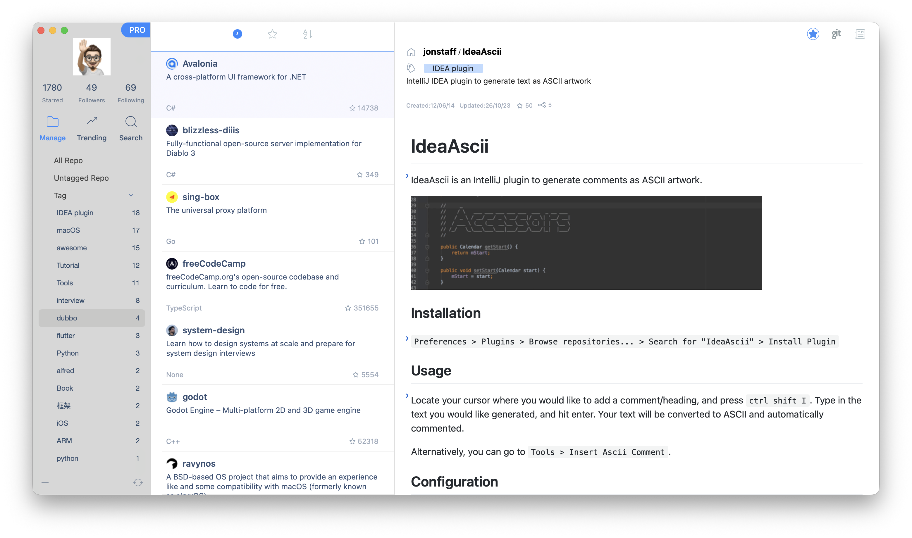

OhMyStar 的主工作台是典型 macOS 三栏布局：

- 左栏是账户与导航：头像、Starred、Followers、Following、`Manage`、`Trending`、`Search`。
- Manage 下有 `All Repo`、`Untagged Repo`、`Tag`，标签带数量。
- 中栏是 repo 列表：图标、名称、描述、语言、star 数。
- 右栏是 repo 详情和 README：owner/repo、标签、描述、created/updated、star/fork、README 正文。
- 顶部提供排序入口，包括最近、star、字母序。

这个布局的核心价值是连续：用户可以在同一个界面里完成「筛选 -> 浏览列表 -> 阅读 README -> 打标签」。Starcat 的 macOS / iPad 版本也应该采用这个工作台思路。

### 3.2 OhMyStar Trending

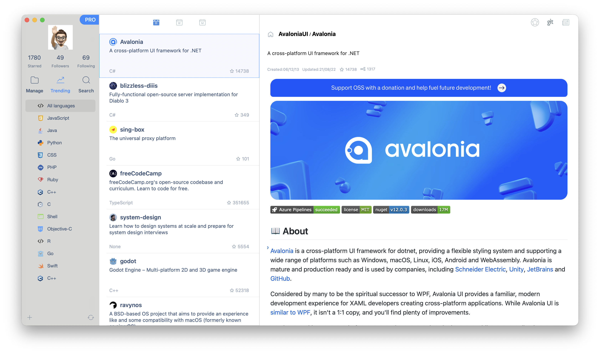

Trending 说明 OhMyStar 不只是管理已有 stars，也承担发现新项目：

- 左栏按语言筛选，语言带图标。
- 中栏列表保持和 Manage 一致。
- 右栏仍然是 README，用户可以直接判断是否值得关注。

对 Starcat 来说，Trending 可以作为基础版全量功能的一部分，但不应作为 MVP 第一屏。它适合放在独立入口，用于补全「发现 -> 收藏 -> 整理」链路。

### 3.3 OhMyStar 结构化搜索

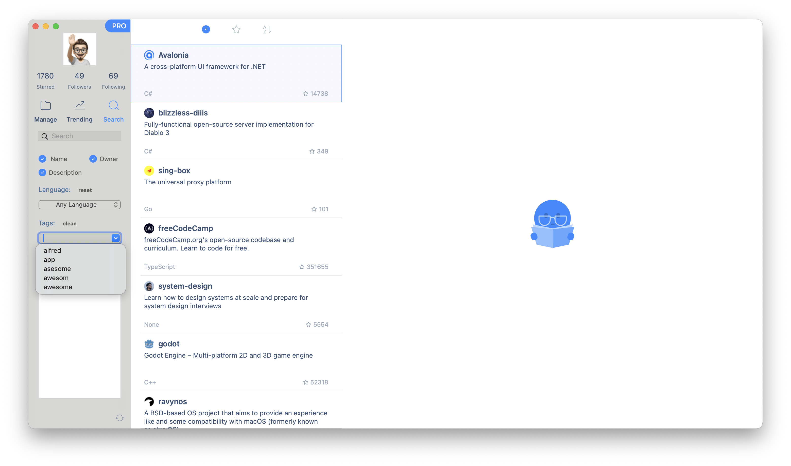

Search 页面比普通搜索框更完整：

- 支持搜索字段选择：`Name`、`Owner`、`Description`。
- 支持 Language 下拉筛选。
- 支持 Tags 下拉筛选和 clean。
- 搜索结果仍然复用中栏 repo 列表。
- 未选中结果时，右侧显示空状态。

这说明 Starcat 的搜索要分两层：顶部快速搜索解决高频查找，结构化搜索页解决精确过滤和保存搜索。

### 3.4 OhMyStar 详情操作与阅读窗口

右上角操作体现了 repo 详情页必须内置高频动作：

1. 取消 star。
2. 拷贝 GitHub 地址。

   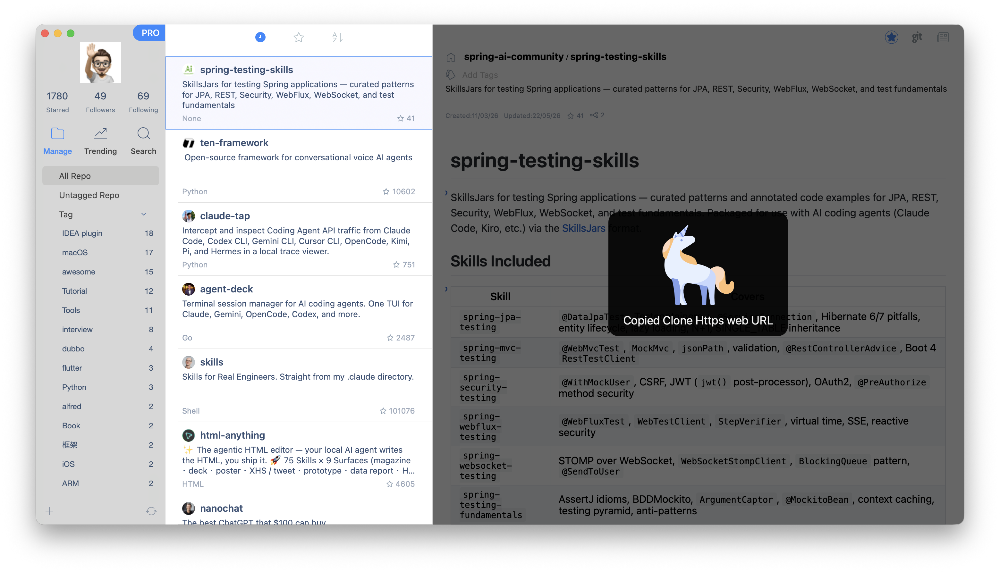

3. 在新窗口打开 README。

   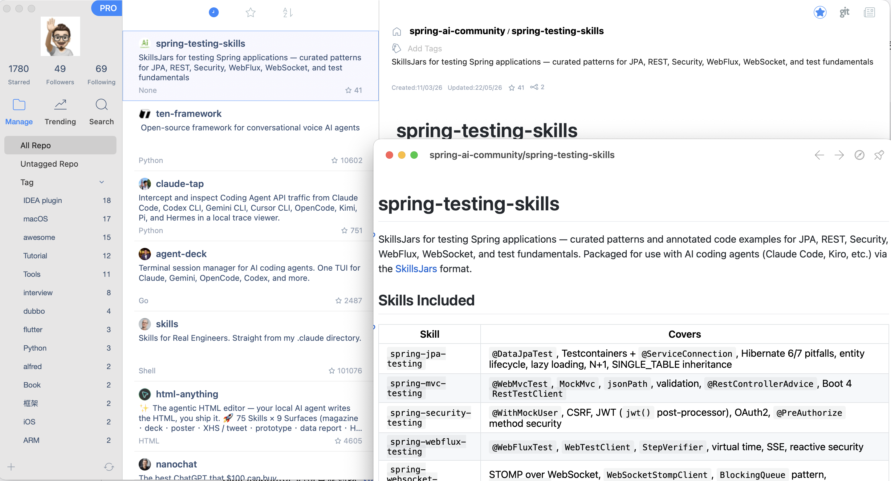

独立 README 窗口右上角还有浏览器打开和 pin 到屏幕上。这是重度用户真实会用的能力：一边写代码，一边固定一个 README 或示例文档参考。

Starcat 应该保留这些能力，并做得更自然：

- 详情页顶部固定操作区：star/unstar、复制 URL、打开 GitHub、阅读窗口、pin。
- README 独立窗口支持置顶、返回主窗口、浏览器打开。
- 复制入口要支持 HTTPS / SSH / GitHub URL。

### 3.5 OhMyStar 设置与数据控制

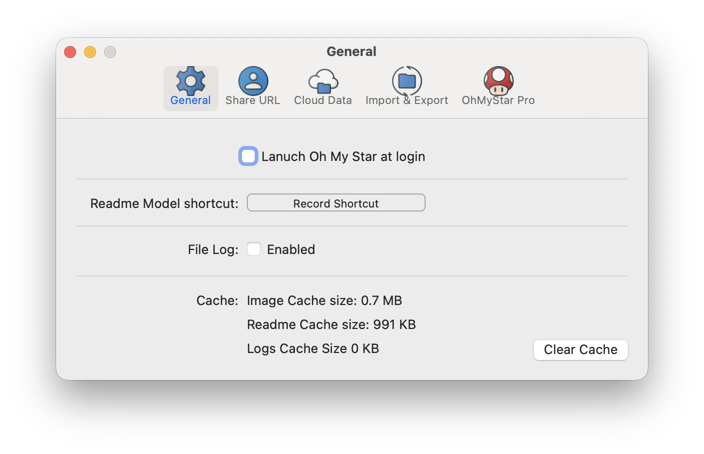

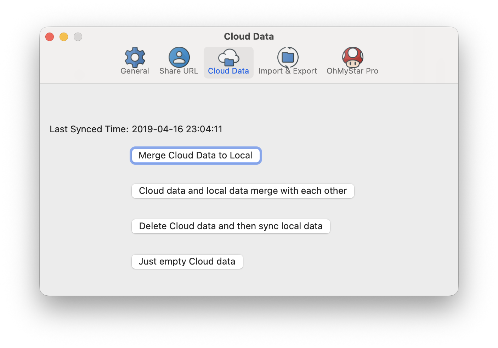

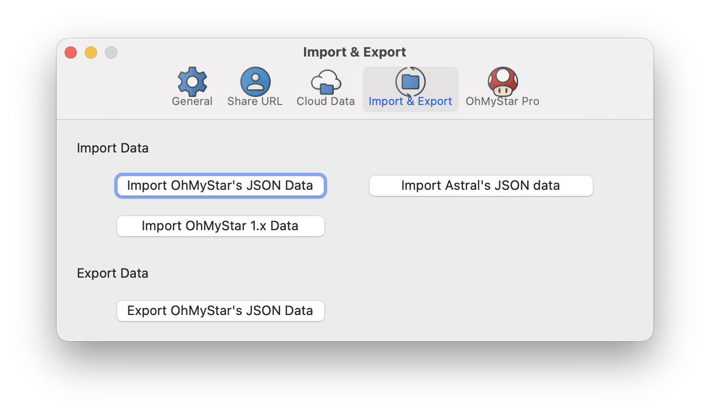

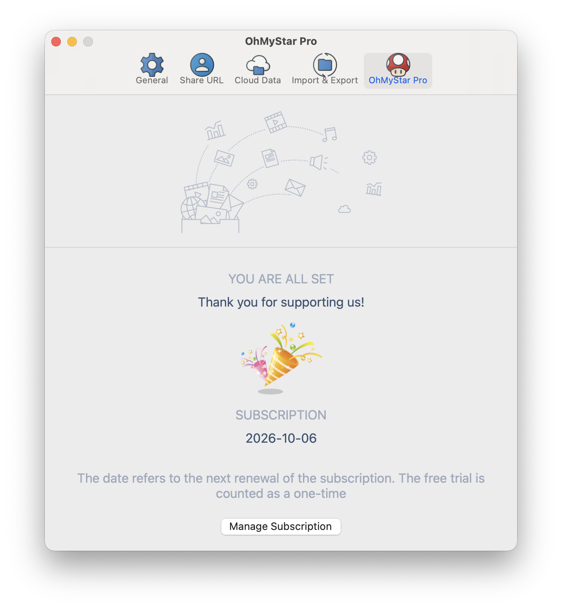

OhMyStar 的设置页很值得重点参考：

- General：开机启动、README 模式快捷键、文件日志、图片/README/日志缓存、清理缓存。
- Cloud Data：显示上次同步时间，支持云端数据合并到本地、本地云端互相合并、删除云端后同步本地、清空云端。
- Import & Export：支持 OhMyStar JSON、OhMyStar 1.x、Astral JSON 导入，以及 OhMyStar JSON 导出。
- Pro：订阅状态和管理订阅。

这里暴露出一个重要事实：重度用户会在乎数据控制。Starcat 不能只说「支持 iCloud 同步」，还要考虑导入、导出、冲突合并、清空云端、从旧工具迁移。

### 3.6 Starship 主界面

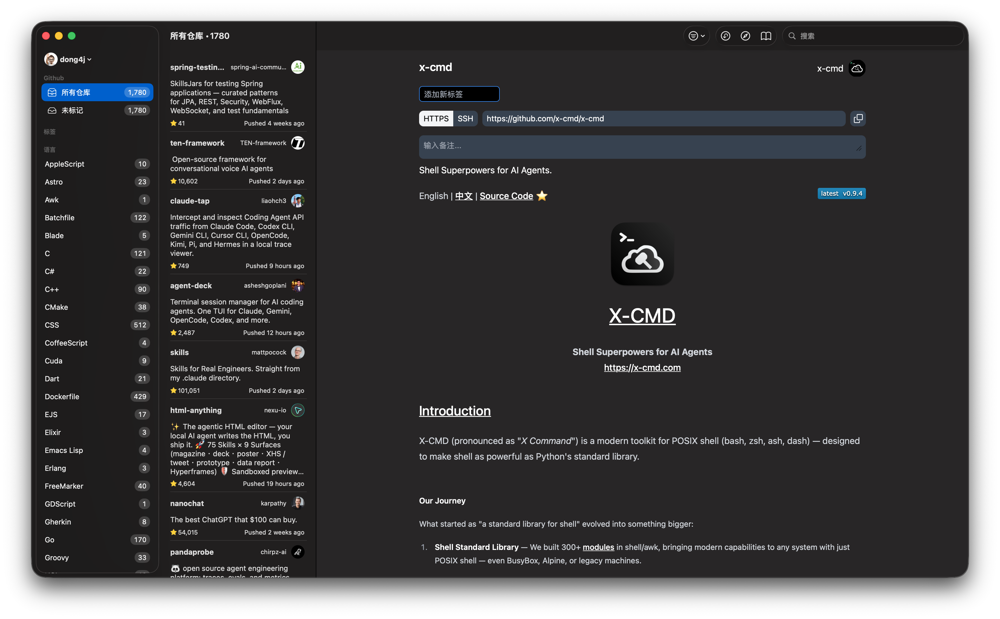

Starship 的优势在现代 UI 和流畅感：

- 暗色模式完整，视觉统一。
- 三栏布局清晰：左侧分类，中间列表，右侧 README。
- 左侧有 `所有仓库`、`未标记`、语言列表和数量。
- 中间列表展示 owner/repo、描述、star、pushed 时间、owner/avatar。
- 右侧顶部提供添加新标签、HTTPS/SSH clone URL、复制按钮、备注输入。

Starcat 应该采用 Starship 这类更现代的视觉方向，但功能深度要向 OhMyStar 看齐。

### 3.7 Starship 设置与差异化

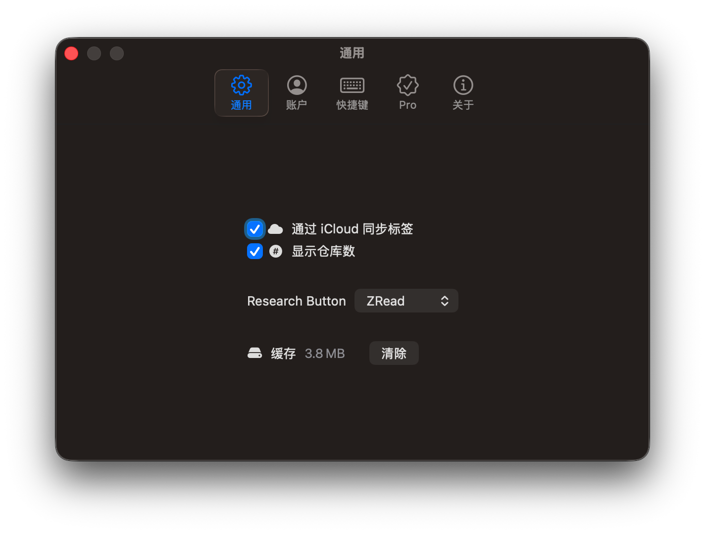

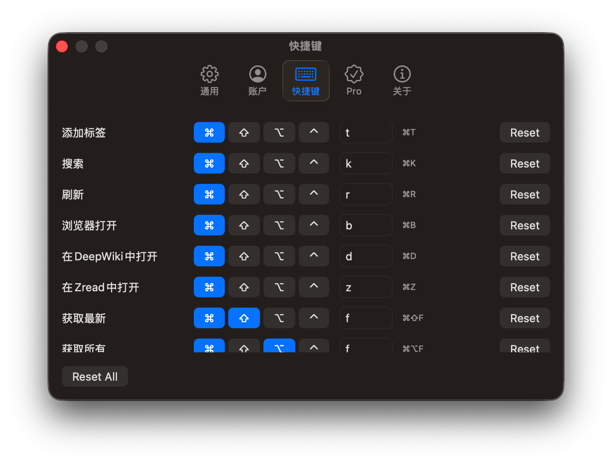

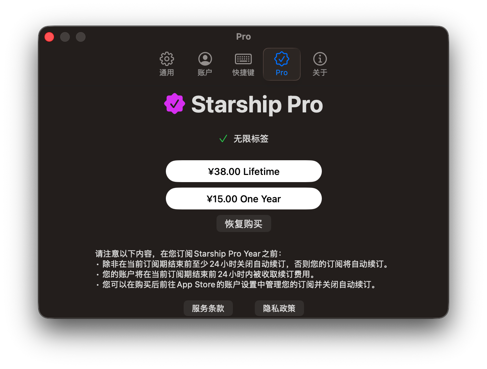

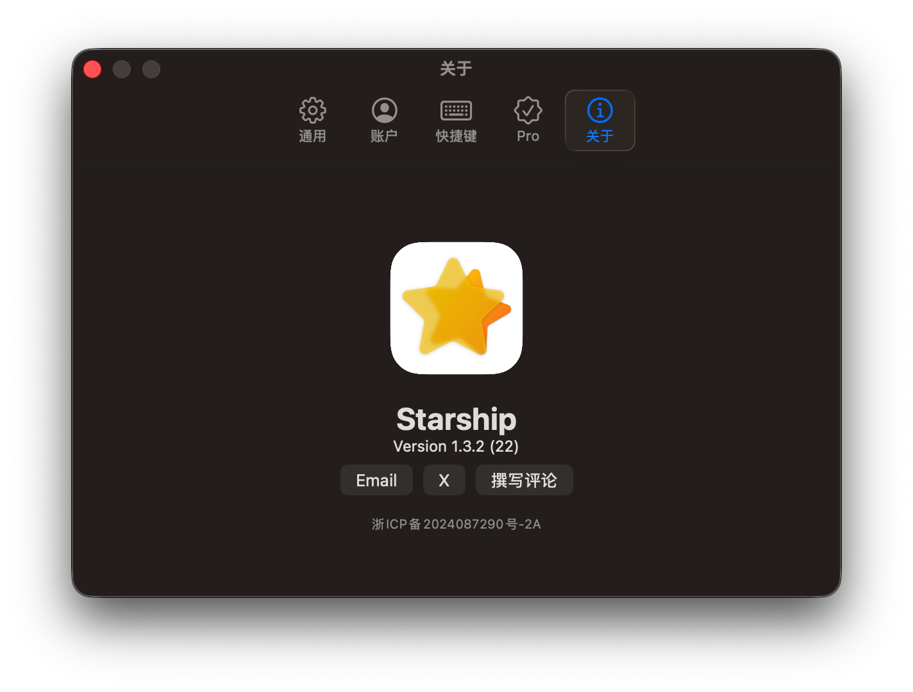

Starship 的差异化功能：

- iCloud 同步标签。
- 显示仓库数。
- Research Button 可选择 ZRead 等外部工具。
- 缓存清理。
- 账号页支持获取所有、登出。
- 快捷键覆盖添加标签、搜索、刷新、浏览器打开、DeepWiki、ZRead、获取最新、获取所有。
- Pro 付费点是无限标签。

Starcat 应该学习它的快捷键和外部工具入口。DeepWiki / ZRead / 浏览器打开这类 research 动作，和 GitHub Star 的真实使用场景非常贴合。

### 3.8 Starflare

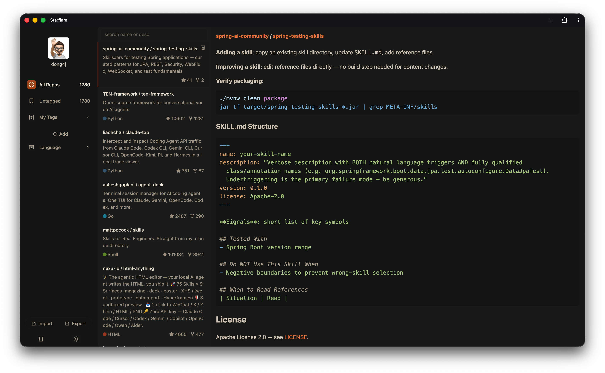

Starflare 是轻量三栏：

- 左侧：头像、`All Repos`、`Untagged`、`My Tags`、Add、Language、Import/Export、登录和主题切换。
- 中间：搜索框和 repo 列表。
- 右侧：README 渲染。

它的价值是简单直接。Starcat 的首次体验可以借鉴它：登录后先看到 All/Untagged/Tags/Language/Search/README，不要让用户一开始面对复杂配置。

## 4. Starcat 基础版全量功能

这里先给「全量版基础功能」，不代表第一版全部一次实现，但它定义基础版能力边界：不依赖 AI 也应该是一个好用的 star 管理应用。

### 4.1 账号与同步

- GitHub OAuth 登录、登出、重新授权。
- 拉取当前用户所有 starred repositories。
- 增量同步新增 star、取消 star、仓库元数据变化。
- 手动刷新当前列表、获取最新、获取所有。
- 同步状态：上次同步时间、本地仓库数、未分类数量、失败数量。
- GitHub token 存入 Keychain。
- 支持 GitHub API rate limit 提示和失败重试。

### 4.2 主工作台

- macOS 三栏布局：Sidebar / Repo List / Detail。
- iPhone 单列到详情的导航流。
- iPad 双栏或三栏自适应。
- watchOS 只做轻量查看、搜索、最近收藏、快速打开。
- All Repos、Untagged、Tags、Languages、Recently Starred、Recently Updated。
- 标签和语言都显示数量。
- 支持暗色/浅色模式，窗口尺寸和列宽记忆。

### 4.3 Repo 列表

- 展示 owner/repo、描述、语言、tags、star、fork、pushed/updated 时间。
- 支持 compact / comfortable 两种密度。
- 支持按名称、star 数、最近 star、最近更新、最近 push、语言排序。
- 支持列表项快速打标签、取消标签、复制 URL、打开 GitHub。
- 支持未读、已读、已试用、在使用、废弃等状态标识。

### 4.4 Repo 详情与 README

- README Markdown 渲染。
- README 缓存和刷新。
- GitHub 页面、Issues、Releases、Homepage 快速打开。
- HTTPS / SSH clone URL 切换和复制。
- 取消 star。
- 当前标签展示和新增标签。
- 私有备注输入。
- 独立 README 阅读窗口。
- Pin / 置顶阅读窗口。
- 浏览器打开。
- README 中代码块、表格、图片、链接基本可读。

### 4.5 标签与分组

- 标签创建、编辑、删除。
- 标签颜色、图标、计数。
- 嵌套标签或标签分组。
- 批量给 repo 添加/移除标签。
- 标签合并、重命名、清理空标签。
- Untagged 作为一级整理队列。
- Collection / 分组，用于人工主题合集。
- Saved Search，用于保存复杂过滤条件。

### 4.6 搜索与过滤

- 全局搜索：name、owner、description、topics、tags、notes。
- 结构化搜索页：选择 name / owner / description / note 等搜索字段。
- 按语言、标签、状态、license、archived、fork、更新时间过滤。
- README 全文搜索，本地索引可作为高级基础能力。
- 搜索历史和保存搜索。
- 空状态提示和清空条件。

### 4.7 数据控制

- 本地优先缓存 repo 元数据、README、图片。
- 清理缓存：README、图片、日志。
- JSON 导入导出。
- 从 OhMyStar / Astral / Starship 迁移导入。
- CSV / Markdown 导出。
- iCloud 同步标签、备注、状态、分组、保存搜索。
- 云端与本地合并、清空云端、以本地覆盖云端、以云端恢复本地。

### 4.8 效率功能

- 全局快捷键唤起搜索。
- 快捷键：添加标签、搜索、刷新、浏览器打开、复制 URL、打开独立阅读窗口。
- App Shortcuts / Spotlight 搜索 repo。
- 菜单栏快速搜索。
- Share Extension 或浏览器扩展：在 GitHub 页面快速添加标签/备注。
- 最近查看、最近使用、常用标签。

### 4.9 发现与趋势

- Trending 页面，按语言查看热门 repo。
- 查看他人的 starred repositories 可以作为后续扩展。
- 不建议第一版把趋势放首页，但可以作为独立入口。

## 5. AI 付费功能梳理

AI 功能不能只做「帮你生成摘要」这种一次性新鲜感功能。用户愿意付费的点应该是：节省大量整理时间、降低选型成本、提升找回效率、帮助维护个人技术知识库。

### 5.1 AI 自动标签与分组

价值：

- 用户首次导入几百到几千个 stars 时，手工整理成本很高。
- AI 可以根据 README、description、topics、语言、文件结构生成初始标签和分组。

功能建议：

- 一键整理未分类仓库。
- 为单个 repo 推荐 3-8 个标签。
- 为全量 stars 生成标签体系，例如 `AI Agent`、`Database`、`macOS`、`DevOps`。
- 识别同义标签并建议合并，例如 `llm`、`LLMs`、`大模型`。
- 支持用户确认后再落库，避免 AI 擅自污染标签体系。

### 5.2 AI 摘要与使用场景

- 生成一句话摘要。
- 生成结构化卡片：核心用途、适用场景、主要特性、安装方式、最小示例。
- 提取适合收藏管理的关键词。
- 提取限制和注意事项，例如维护状态、平台限制、license 风险。
- 支持中文摘要，降低英文 README 阅读成本。

### 5.3 AI 语义搜索

- 用自然语言搜索 stars。
- 基于 README、摘要、notes、tags 做 embedding 检索。
- 返回结果时解释命中原因。
- 支持组合查询，例如「找最近还在维护、适合生产用的 Python CLI 框架」。

### 5.4 AI 项目评估与健康度

- 维护健康度：最近 commit、release 频率、issue 响应、archived、依赖风险。
- 采用建议：`可生产使用`、`适合调研`、`谨慎使用`、`已过时`。
- README 质量评估：安装、示例、API 文档是否清晰。
- license 提醒。
- fake stars / 异常增长风险提示可以作为后续增强，但需要谨慎表达，避免误判。

### 5.5 AI 同类项目对比

- 选中多个 repos 生成对比表。
- 对比维度：定位、语言、维护活跃度、成熟度、上手成本、license、适用场景。
- 自动识别同类候选，例如 `React table` 相关库聚类。
- 输出「我该选哪个」的建议，但必须附依据。

### 5.6 AI 工作流输出

- 从一个 collection 生成 Markdown 调研报告。
- 从多个 repos 生成 Awesome List。
- 为某个 repo 生成「试用清单」：安装、运行 demo、验证指标。
- 生成给 Coding Agent 的 prompt，例如「阅读这个 repo 并总结架构」。

## 6. 免费版与付费版边界

基础版必须可独立成立，付费版卖「AI 和规模效率」，不要把基础整理能力切得太碎。

免费版建议包含：

- GitHub 登录与 stars 同步。
- 本地缓存和离线浏览。
- 基础 repo 信息展示。
- README Markdown 渲染。
- 标签、分组、搜索、过滤、排序。
- 笔记和状态管理。
- 基础导入导出。

Pro / AI 订阅建议包含：

- AI 自动标签、摘要、分类。
- AI 语义搜索。
- AI 项目健康度和采用建议。
- AI 同类项目对比。
- AI 技术雷达月报。
- 批量 AI 处理。
- 高级导出：调研报告、Awesome List、选型报告。

## 7. 推荐 MVP 范围

第一版目标应该是「一个可靠、精美、流畅的 Apple 平台 GitHub Stars 管理器」，AI 先做最能打的 2-3 个能力。

MVP 必做：

- GitHub OAuth 登录。
- 拉取和增量同步 stars。
- 本地数据库缓存。
- macOS 三栏布局。
- 标签、未分类、语言视图。
- 搜索和基础过滤。
- README Markdown 渲染。
- 私有笔记、状态。
- JSON 导入导出。

MVP AI：

- 单仓库 AI 摘要。
- 单仓库 AI 标签推荐。
- 批量整理未分类仓库。
- 自然语言语义搜索的最小版本。

暂缓：

- 复杂趋势报告。
- fake stars 检测。
- 团队协作。
- 社区公开分享。
- 浏览器插件。

## 8. 产品差异化

- UI 精美：以 Starship 的现代视觉为基准，不沿用 OhMyStar 的老式控件风格。
- 功能扎实：覆盖 OhMyStar 的主流程，尤其是搜索、README、导入导出、缓存和云同步。
- AI 可控：AI 只给建议，用户确认后写入标签、摘要、备注。
- Apple 生态：macOS、iPhone、iPad、watch、Shortcuts、Spotlight、iCloud、StoreKit。
- Decision-first：重点支持「我要选一个库」而不是只支持「我要找一个库」。

## 9. 风险与约束

- GitHub API rate limit：需要分页、增量同步、缓存和失败重试。
- README 拉取成本：批量 AI 前应先缓存 README，并控制并发。
- AI 成本：批量处理几千个 stars 成本不低，必须设计队列、配额和增量更新。
- 标签污染：AI 自动写标签容易造成混乱，必须以建议和确认流程为主。
- 隐私：用户 notes、私有仓库信息和 AI 请求内容必须有明确边界。
- 多端同步：iCloud 冲突和恢复路径要设计清楚。

## 10. 资料来源

- Starship App Store 页面：https://apps.apple.com/cn/app/starship-github-%E6%A0%87%E7%AD%BE%E5%88%86%E7%B1%BB%E7%AE%A1%E7%90%86%E6%94%B6%E8%97%8F%E4%BB%A3%E7%A0%81%E4%BB%93%E5%BA%93/id1530665887?platform=mac
- OhMyStar App Store 页面：https://apps.apple.com/cn/app/ohmystar/id1218642292?mt=12
- Starflare 官网：https://starflare.app
- GitHub Stars 官方文档：https://docs.github.com/en/get-started/exploring-projects-on-github/saving-repositories-with-stars
