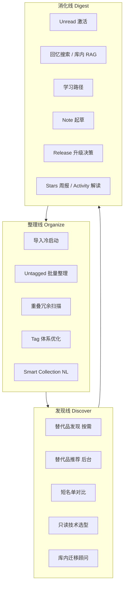

# Starcat Agent 产品叙事：整理 · 发现 · 消化 三条主线

> **文档定位**：把 Starcat 散落的 Agent 场景收束为**可对外讲清楚、对内可排期**的产品叙事；供 dong4j 后续立项、UI 信息架构、营销文案参考。
> **状态**：讨论稿（2026-06-27），非实施许可；具体 Agent 仍以各场景方案文档为准。
> **关联文档**：
> - [`00-概览-Agent方向讨论与方案.md`](00-概览-Agent方向讨论与方案.md)：技术总览与共用编排器
> - [`02-替代品推荐-Agent方案.md`](02-替代品推荐-Agent方案.md) / [`09-替代品发现-Agent方案.md`](09-替代品发现-Agent方案.md)：发现线
> - [`03-Starred-Repo-周报-Agent方案.md`](03-Starred-Repo-周报-Agent方案.md)：消化线（增量）
> - [`07-Smart-Collection-生成方案.md`](07-Smart-Collection-生成方案.md)：整理线
> - [`04-AgentRunKit-Swarm-SwiftAgent-对比分析.md`](04-AgentRunKit-Swarm-SwiftAgent-对比分析.md)：运行时选型
> - [`../需求分析.md`](../需求分析.md)：Starcat 核心价值「整理、理解、找回、评估」

---

## 一、为什么要「三条主线」而不是「十五个 Agent」

### 1.1 问题

Starcat Agent 候选场景已经很多（替代品、周报、Smart Collection、技术选型、重叠扫描、Release 决策……）。若每个场景都在 UI 里占一个独立入口，会导致：

1. **用户认知负担**：不知道先点哪个，感觉「又是 AI 功能堆砌」。
2. **工程重复**：每个场景各写一套 UI / quota / 流式展示，维护成本线性上涨。
3. **叙事模糊**：对外说不清 Starcat Agent 和「又一个 ChatGPT 壳」的区别。

### 1.2 解法

用 **用户生命周期** 而不是 **技术能力** 来组织 Agent：

```text
收藏（star）→ 整理（taxonomy）→ 发现（expand）→ 消化（use）→ 再收藏 …
```

Starcat 的核心价值是 **「整理、理解、找回、评估」**（见需求分析）。三条主线与这四词一一对应：

| 主线 | 对应核心价值 | 用户心里的一句话 |
|------|--------------|------------------|
| **整理线** | 整理 | 「我的 1800 个 stars 太乱了，帮我把库理清楚。」 |
| **发现线** | 评估 + 扩展 | 「我想找更好的、或选型时该 pick 谁。」 |
| **消化线** | 理解 + 找回 | 「我 star 了但没用上，帮我把库存变成知识。」 |

> **产品承诺（对外可讲）**：
> Starcat Agent 不是通用聊天机器人，而是 **围绕你的 GitHub Stars 知识库**，在整理、发现、消化三个阶段提供 **可确认、可引用、可沉淀** 的 AI 协助。

### 1.3 与竞品叙事的差异

| 竞品典型叙事 | Starcat 三条主线 |
|--------------|------------------|
| 「AI 搜索全网」 | **先读你的 stars 库**，再决定是否扩到 GitHub / 网页 |
| 「Trending 周报」 | **个人收藏**的动态与解读，不是大众热门 |
| 「Copilot 写代码」 | **读 README / note / health**，帮评估与理解，不是 codegen |
| 「自动打标签」 | **建议 → 预览 → 确认** 才写入（AI 保守策略铁律） |

---

## 二、三条主线总览



三条线 **不是严格线性**，用户可在任意阶段切入；但 **新用户** 典型路径是 `整理 → 发现 → 消化`，**老用户** 更常从 `消化` 或 `发现` 进入。

---

## 三、整理线（Organize）

### 3.1 定位

**把扁平、膨胀的 stars 库变成可导航的结构**——tags、Smart Collection、阅读状态、去冗余。

用户 pain point：

- 刚导入 500~2000 stars，**untagged 占绝大多数**；
- 同一技术栈 star 了太多相似 repo，**不知道保留谁**；
- tag 命名混乱（`tools` / `tool` / `cli-tools`），**越用越不敢动**。

### 3.2 场景地图

| 场景 | 触发时机 | 输出形态 | 写操作 | 方案文档 |
|------|----------|----------|--------|----------|
| **导入冷启动整理** | 首次全量 sync 完成 / stars > N | Tag 体系建议 + 分批归类预览 | 打 tag（确认后） | 待写 |
| **Untagged 批量整理** | Sidebar Untagged 视图 / Batch AI 入口 | 每 repo tag 建议列表 | 打 tag（确认后） | 概览 §4.1 #2 |
| **重叠 / 冗余扫描** | 手动「库体检」/ 季度提醒 | 重叠簇 + 保留建议 | unstar / tag（确认后） | 待写 |
| **Tag 体系优化** | 设置页 / tag 管理 | 合并/重命名/删除建议 | 改 tag（确认后） | 待写 |
| **Smart Collection 自然语言** | Smart Collection 编辑器 | 规则 JSON + 匹配预览 | 保存规则（确认后） | [`07`](07-Smart-Collection-生成方案.md) |

### 3.3 典型用户旅程

```text
Day 0  登录 OAuth → 全量 sync 完成
       → 弹窗：「检测到 1,842 个 stars，其中 1,601 未分类」
       → [开始整理] → 冷启动 Agent（分批 50，队列进度条）

Day 1  用户浏览 Untagged → 顶部 banner：「还有 1,200 未分类，继续批量整理？」

Day 7  设置页提示：「发现 12 组高度相似 repo，要看看吗？」→ 重叠扫描 Agent

Day 30 用户说「我想找这周 star 的 Swift 项目」→ 切到 Smart Collection NL（07）
```

### 3.4 整理线的 Agent 行为约束

- **必须预览**：任何 tag / unstar / 规则写入前展示 diff（受影响 repo 数量 + 样例列表）。
- **批量必须可中断**：复用 `BatchAIQueueService` 模式；用户 Cmd+. 或点停止 → 已确认部分保留，未确认不写入。
- **默认只读分析步**：重叠扫描的「分析」阶段不写入；「应用建议」是第二次显式动作。

### 3.5 整理线 KPI（产品验证用）

| 指标 | 含义 |
|------|------|
| Untagged 占比 | 7 日内是否从 >80% 降到 <50% |
| 有效 tag 数 | 用户实际点击过的 tag 数量 |
| Smart Collection 创建数 | NL 创建 vs 手动创建比例 |
| 重叠扫描采纳率 | 用户确认 unstar/merge 建议的比例 |

---

## 四、发现线（Discover）

### 4.1 定位

**在「已有收藏」基础上向外扩展，或在你关心的候选里做评估**——不是无脑 Trending，而是 **带个人上下文的发现与对比**。

用户 pain point：

- 某个 star 很久不更新，**有没有更好的替代**；
- 技术选型时要 **对比 3~5 个方案**，不想自己开 20 个 tab；
- 全网找项目容易，**和我已有 stars 的关系**说不清。

### 4.2 场景地图

| 场景 | 触发时机 | 输出形态 | 范围 | 方案文档 |
|------|----------|----------|------|----------|
| **替代品发现（按需）** | Repo 详情「找同类」 | 页内对比表 | 单 repo → 外部候选 | [`09`](09-替代品发现-Agent方案.md) |
| **替代品推荐（后台）** | 每周扫库 / 健康度告警 | 清单 / 通知 | 全库 | [`02`](02-替代品推荐-Agent方案.md) |
| **短名单深度对比** | 列表多选 2~5 → 「对比」 | 结构化对比表 | 用户选定 | 待写 |
| **只读技术选型** | Agent 中心 / 搜索中心 | Markdown 调研报告 | GitHub + 网页 + 本地 stars | [`04`](04-AgentRunKit-Swarm-SwiftAgent-对比分析.md) §5 |
| **库内迁移顾问** | 对话输入迁移意图 | Checklist + 相关已 star repo | 以 stars 库为主 | 待写 |
| **Trending/Weekly 解读** | Trending / Weekly 视图 | 多形态内容（可选） | 全网 | [`08`](08-Weekly-Trending解读方案.md) |

> **发现线内部二分**：
> - **In-library**：短名单对比、迁移顾问（强依赖 stars 库）
> - **Out-library**：替代品发现、技术选型（扩到 GitHub / AnySearch，但仍 **交叉引用** 本地 stars）

### 4.3 典型用户旅程

```text
场景 A — 浏览触发
  打开 5 年未更新的 vim-config
  → 详情页卡片：「有更活跃的替代吗？」
  → 09 替代品发现 → 对比表 → [Star 候选] [加待考察 tag]（均需确认）

场景 B — 选型触发
  Agent 中心 → 发现线 → 「技术选型调研」
  → 输入：「macOS 本地向量库」
  → 04 只读 Agent：github_search + semantic + AnySearch + README
  → 报告含「与你已 star 的 sqlite-vec / chromadb 的关系」

场景 C — 列表触发
  多选 zustand / jotai / recoil
  → 「生成对比」→ 短名单对比 Agent
```

### 4.4 发现线的 Agent 行为约束

- **只读优先**：调研类（04）MVP 不做 auto-star；star / tag 永远是独立按钮。
- **引用强制**：报告里每个结论必须挂 repo URL 或 README 片段来源。
- **个人上下文段落**：凡涉及外部候选，固定有一节 **「与你 Stars 库的重叠」**（semantic 召回）。

### 4.5 发现线 KPI

| 指标 | 含义 |
|------|------|
| 替代品发现转化率 | 看后 7 日内 star 候选 repo 的比例 |
| 选型报告完成率 | 开始 run → 看完报告的比例 |
| 报告 → star 转化 | 从报告内链点击并 star 的数量 |
| 重复 run 率 | 同一主题 30 日内是否重复（过高说明报告不可沉淀） |

---

## 五、消化线（Digest）

### 5.1 定位

**让已经 star 的东西产生知识价值**——从「收藏动作」变成「用过 / 理解 / 找得到」。

用户 pain point：

- **Unread 越堆越多**，不知道先看哪个；
- **star 过但忘了**是哪个 repo（「去年那个 SSR 框架」）；
- Release 发了 **不知道要不要升级**；
- 周报类工具讲 **全网热门**，不讲 **我的库发生了什么**。

### 5.2 场景地图

| 场景 | 触发时机 | 输出形态 | 方案文档 |
|------|----------|----------|----------|
| **Unread 激活** | 打开 app / Untagged+Unread 视图 | 本周必读 Top N + 理由 | 待写 |
| **回忆搜索 / 库内 RAG** | 搜索中心自然语言问句 | 带引用的答案（非纯列表） | [`30-本地RAG设计.md`](../详细设计/30-本地RAG设计.md) |
| **学习路径** | Repo 详情「怎么学这个项目」 | 阅读顺序 + 关键链接 | 待写 |
| **Note 起草** | 空 note / 「AI 写笔记」 | Note 草稿（不自动保存） | 待写 |
| **Release 升级决策** | Release 订阅通知 / Release 视图 | 升级建议 + breaking 摘要 | 待写 |
| **Stars 周报** | 每周 / 手动 | 本周**新增** stars 聚类 | [`03`](03-Starred-Repo-周报-Agent方案.md) |
| **Activity 解读** | 每周 / Activity 视图 | 已有 stars **动态**（发版、archived） | 待写 |

> **03 vs Activity 解读**：
> - **03 周报**：「这周新 star 了什么」→ 兴趣画像的周更。
> - **Activity 解读**：「我库里的老 repo 发生了什么」→ 维护与跟进。

### 5.3 典型用户旅程

```text
周一   打开 app → 消化线卡片「本周 Stars 周报」→ 03
       同卡片下方「3 个 using 项目发 major 版」→ Release 升级 Agent

日常   搜索中心输入：「我 star 过的 edge SSR 是哪个？」
       → 回忆搜索 Agent → 答案 + 链接 grpc/fresh

读 repo  详情页 note 为空 → 「起草笔记」→ Note Agent → 用户编辑后保存

深度     「我想系统学 grpc-gateway」→ 学习路径 Agent → 挂到 note 或导出
```

### 5.4 消化线的 Agent 行为约束

- **Note 起草**：永远 **草稿态**；保存动作只能是用户点击。
- **Release 决策**：必须引用 release notes 原文片段；与 user note 冲突处 **高亮**。
- **回忆搜索**：答不出时诚实降级为「相关 repo 列表」，不编造 star 记录。

### 5.5 消化线 KPI

| 指标 | 含义 |
|------|------|
| Unread → Read 转化率 | Agent 推荐后 7 日内状态变化 |
| 回忆搜索满意度 | 点击首个结果 / 二次追问率 |
| Note 起草采纳率 | 草稿保存 / 生成次数 |
| 周报打开率 | 生成后是否展开阅读 |

---

## 六、信息架构：一个入口，三条线，多触点

### 6.1 原则

1. **一个品牌入口**：Sidebar 一级项 **「Agent」**（或「助手」），内部三分 tab；避免 15 个 scattered 按钮。
2. **场景触手**：详情页、搜索中心、Untagged banner 等只放 **单场景快捷入口**，点击后 **带上上下文** 跳进 Agent 中心对应线，而不是各做各的 UI。
3. **共用壳层**：所有 Agent run 共用 **进度 / tool 步骤 / 停止 / 报告渲染**（见 `00-概览` §5、`04` 自研架构）。

### 6.2 建议 IA 草图

```text
Sidebar
├── Stars / Tags / …（现有）
└── Agent                    ← 唯一一级入口
    ├── [整理] [发现] [消化]  ← 三个 Tab
    ├── 最近报告 / 进行中的任务
    └── 「描述你想做什么…」   ← 可选 NL 路由（v2：自动分到三线之一）

Repo 详情页（触手，非独立 Agent 产品）
├── 发现 · 找同类替代          → 09，带 repo 上下文
├── 消化 · 学习路径 / 起草笔记
└── （现有 AI 窗口仍可保留，逐步收敛到 Agent 壳）

搜索中心
└── 问句模式 → 路由到 消化线·回忆搜索 或 发现线·技术选型

首次导入
└── 整理线 · 冷启动向导（可跳过）
```

### 6.3 NL 路由（可选，v2）

用户在一个输入框说：「帮我把没 tag 的项目分类」→ 路由 **整理线**；
「macOS 向量数据库选型」→ **发现线**；
「我 unread 太多先看哪几个」→ **消化线**。

MVP 可不做自动路由，**三个 Tab 足够**；路由是体验 polish，不是 blocker。

### 6.4 与 `00-概览` UI 建议的衔接

`00-概览` §6 曾建议 MVP 复用 `RepoAIWindowContentView`。本叙事 **不推翻** 该建议，而是补充：

| 阶段 | UI 策略 |
|------|---------|
| **Phase 0~1** | 单场景（如 09 替代品发现）仍嵌详情页；共用 VM 层 `AgentOrchestrator` |
| **Phase 2** | Agent 一级入口上线；详情页按钮 **deep link** 到 Agent 中心 |
| **Phase 3** | 报告历史、跨场景任务队列统一在 Agent 中心 |

---

## 七、跨线协作：场景不是孤岛

### 7.1 常见跨线流

| 用户意图 | 线路径 |
|----------|--------|
| 新用户第一天 | 整理（冷启动）→ 消化（Unread 激活） |
| 老库清理 | 整理（重叠扫描）→ 发现（替代品）→ 整理（确认 unstar） |
| 技术选型后落地 | 发现（04 报告）→ 整理（打 tag + Smart Collection）→ 消化（学习路径） |
| 跟进订阅项目 | 消化（Activity 解读）→ 消化（Release 决策）→ 消化（更新 note） |

### 7.2 共用基础设施（只建一次）

| 模块 | 三线共用 |
|------|----------|
| `AgentOrchestrator` / `AgentRuntime` | ✅ |
| Tool：get_repo / get_readme / semantic_search | ✅ |
| Tool：github_search / web_search | 发现线为主，整理/消化可选 |
| 报告存储 `AgentReport` | ✅ |
| Quota / Pro 门控 | ✅ |
| 流式 UI：tool 步骤 + 最终报告 | ✅ |

### 7.3 配额与 Pro 的分线策略（建议）

| 线 | Free 建议 | Pro |
|----|-----------|-----|
| 整理 | 冷启动 1 次 + 每月 2 次批量 | 不限 batch |
| 发现 | 每月 3 次深度 run（09/04） | 不限 + 后台替代品推荐 |
| 消化 | 周报只读 + 每月 5 次回忆搜索 | 不限 + Release 决策 |

具体数字待 dong4j 拍板；叙事上 **发现线最耗 API**，适合 Pro 主卖点。

---

## 八、分阶段落地路线图（叙事顺序 ≠ 工程优先级）

工程上仍可 **发现线 09 先做**（ROI 高、已有文档）；叙事上对外讲 **「整理 → 发现 → 消化」** 完整故事。

| 阶段 | 叙事重点 | 建议交付 | 对外一句话 |
|------|----------|----------|------------|
| **P0** | 发现 | 09 替代品发现 + 共用 Agent 壳 | 「Star 的项目，帮你找更好的替代。」 |
| **P1** | 消化 | 03 周报 + 回忆搜索 MVP | 「你的 stars，每周可读、随时可问。」 |
| **P2** | 整理 | 07 Smart Collection NL + Untagged 批量 | 「一句话，整理上千 stars。」 |
| **P3** | 发现加深 | 04 只读技术选型 + 短名单对比 | 「选型报告，带引用、带你的收藏上下文。」 |
| **P4** | 整理加深 | 重叠扫描 + 冷启动 | 「库体检：去冗余、建结构。」 |
| **P5** | 消化加深 | Release 决策 + 学习路径 + Note 起草 | 「从 star 到真会用。」 |

---

## 九、对外文案锚点（可直接改写入上架/官网）

**一句话**：

> Starcat Agent：围绕你的 GitHub Stars，**整理**成体系、**发现**更好选项、**消化**为可用知识。

**三 bullet**：

- **整理**：未分类、重叠、规则集合——AI 建议，你来确认。
- **发现**：同类替代、技术选型、深度对比——始终看见「你 already starred 什么」。
- **消化**：周报、回忆搜索、Release 与笔记——让收藏不再吃灰。

**克制承诺（避免 over-promise）**：

- 不自动改你的 tags / stars，**你确认后才写入**。
- 不替代 GitHub；Stars 库 **本地优先**，Agent 读的是你的缓存与笔记。
- 深度代码分析、全自动 codegen **不在** 三条主线内。

---

## 十、反模式（刻意不做）

| 反模式 | 原因 |
|--------|------|
| Sidebar 下挂 10+ 「AI xxx」菜单项 | 破坏叙事，像功能堆砌 |
| 每个 Agent 独立窗口、独立 quota 逻辑 | 工程债；违背共用壳层 |
| 整理线 auto-unstar 无预览 | 违反 AI 保守策略 |
| 发现线只有 Trending、不交叉本地 stars | 丢失 Starcat 差异化 |
| 消化线做成通用 ChatGPT | 与「stars 知识库」定位脱节 |
| 为了 Agent 而 Agent（无 report / 无沉淀） | 用户用完即走，无数据闭环 |

---

## 十一、场景 → 主线 → 文档 索引表

| 场景 | 主线 | 状态 | 文档 |
|------|------|------|------|
| 替代品发现 | 发现 | 方案稿 | [`09`](09-替代品发现-Agent方案.md) |
| 替代品推荐 | 发现 | 方案稿 | [`02`](02-替代品推荐-Agent方案.md) |
| 只读技术选型 | 发现 | 04 §5 + 待独立稿 | [`04`](04-AgentRunKit-Swarm-SwiftAgent-对比分析.md) |
| Trending/Weekly 解读 | 发现 | 方案稿 | [`08`](08-Weekly-Trending解读方案.md) |
| Smart Collection NL | 整理 | 方案稿 | [`07`](07-Smart-Collection-生成方案.md) |
| Stars 周报 | 消化 | 方案稿 | [`03`](03-Starred-Repo-周报-Agent方案.md) |
| 导入冷启动 / Untagged 批量 | 整理 | **方案稿** | [`13`](13-Untagged批量整理-Agent方案.md) |
| **重叠冗余扫描** | 整理 | **方案稿** | [`11`](11-重叠扫描-Agent方案.md) |
| Tag 体系优化 | 整理 | 待写 | — |
| 短名单对比 | 发现 | 待写 | — |
| 库内迁移顾问 | 发现 | 待写 | — |
| Unread 激活 | 消化 | **方案稿** | [`14`](14-Unread激活-Agent方案.md) |
| **回忆搜索 / RAG** | 消化 | **方案稿** | [`12`](12-回忆搜索-Agent方案.md) · [`30-本地RAG设计.md`](../详细设计/30-本地RAG设计.md) |
| 学习路径 | 消化 | 待写 | — |
| Note 起草 | 消化 | 待写 | — |
| Release 升级决策 | 消化 | 待写 | — |
| Activity 解读 | 消化 | 待写 | — |

---

## 十二、待 dong4j 拍板的叙事层决策

1. **Sidebar 一级入口命名**：「Agent」vs「助手」vs「AI」（i18n 与品牌调性）。
2. **新用户是否强制冷启动整理**：可跳过 vs 强引导。
3. **三线 Tab 默认 land 哪条线**：新用户 → 整理；老用户 → 消化或上次使用。
4. **对外是否统一用「整理·发现·消化」三字**：或英文 Organize / Discover / Digest 并列。
5. **第一个对外 marketing 的主线**：发现（09 最快）vs 消化（03 订阅感）vs 整理（新用户故事）。

---

## 十三、变更记录

| 日期 | 变更 | 作者 |
|------|------|------|
| 2026-06-27 | 初稿：三条主线产品叙事、IA、路线图、场景索引 | Claude |
| 2026-06-27 | §十一索引：11 重叠扫描、12 回忆搜索 链入 | Claude |
| 2026-06-27 | §十一索引：13 Untagged 批量整理、14 Unread 激活 链入 | Claude |
