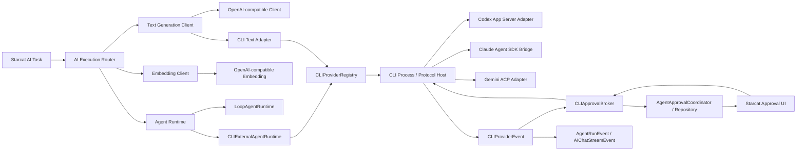
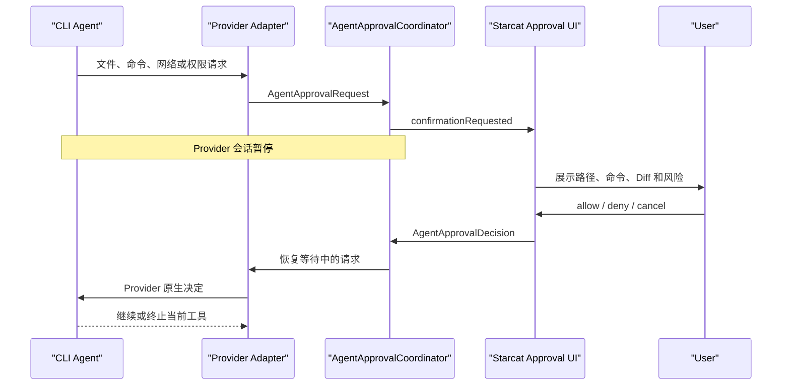
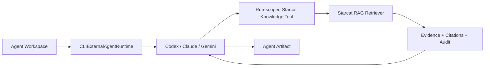

# CLI Agent 作为 AI Provider 初步方案

> **文档定位**：讨论 Starcat 如何把 Claude Code、Codex、Gemini CLI 及后续同类 CLI Agent 接入为 AI 执行后端。本文是初步方案，用于固定问题边界、推荐架构、渠道限制和分阶段落地路径，不代表已经立项或开始实现。
>
> **状态**：初步方案，已确认与 Agent 工作台后续迭代一起实施；Direct-only、动态人工审批闭环及 RAG Tool 边界已确认，尚未开始代码实现。
>
> **创建日期**：2026-07-30。
>
> **关联文档**：
>
> - [`00-概览-Agent方向讨论与方案.md`](00-概览-Agent方向讨论与方案.md)
> - [`16-Agent底层平台技术方案.md`](16-Agent底层平台技术方案.md)
> - [`19-Cline-Agent设计学习心得.md`](19-Cline-Agent设计学习心得.md)
> - [`../../../3-设计/详细设计/15-AI设置与调用链重构方案.md`](../../../3-设计/详细设计/15-AI设置与调用链重构方案.md)
> - [`../../../3-设计/详细设计/30-本地RAG设计.md`](../../../3-设计/详细设计/30-本地RAG设计.md)
> - [`../../../3-设计/详细设计/37-外部搜索服务设计.md`](../../../3-设计/详细设计/37-外部搜索服务设计.md)
> - [`../../../3-设计/详细设计/37-AI用量统计面板设计.md`](../../../3-设计/详细设计/37-AI用量统计面板设计.md)

---

## 一、背景

Starcat 当前通过 OpenAI-compatible HTTP API 对接各类 AI 服务商，主要承载：

- AI 对话
- 仓库摘要
- 标签建议
- 个人笔记生成
- README 翻译
- RAG Planner / Generator
- Embedding

对普通用户而言，直接调用模型 API 已能覆盖多数文本生成场景；但开发者日常更常使用 Claude Code、Codex、Gemini CLI 等 Agent CLI。相比单次 LLM 请求，这些 CLI 通常还具备：

- 读取工作区与文件
- 执行多轮任务
- 调用 Shell、MCP、浏览器或网络搜索
- 输出计划、工具调用和执行轨迹
- 保存并恢复会话
- 根据权限策略决定是否读取、修改或执行

因此，需求不是“再增加三个模型服务商”，而是让 Starcat 可以选择本机已安装、已登录的 CLI Agent 作为一种 AI 执行后端，并把其流式输出、工具事件、联网行为和最终产物映射到 Starcat 现有 UI 与审计体系。

---

## 二、核心结论

### 2.1 可行性判断

**可行，但不能把 CLI Agent 伪装成 OpenAI-compatible HTTP Provider。**

推荐结论：

| 判断 | 结论 |
|---|---|
| Direct 版接入 CLI Agent | **GO，必须具备动态人工审批与强制权限边界** |
| Agent 工作台优先接入 CLI 原生能力 | **GO** |
| 后续把 CLI 用于摘要、对话、标签等文本任务 | **GO，需拆分 Text / Embedding 能力** |
| CLI 直接承担 Embedding | **NO-GO** |
| 首期让 CLI 直接写 Starcat 数据库 | **NO-GO** |
| 未经逐次审批执行 Shell / 文件编辑 | **NO-GO** |
| YOLO / Danger Full Access / Bypass Permissions | **NO-GO** |
| Mac App Store 版集成 CLI Agent | **NO-GO，不纳入后续路线** |
| 首期支持任意“自定义命令模板” | **NO-GO** |

### 2.2 产品术语

对外仍可使用“AI Provider”作为用户易懂的总称，但内部应区分：

| 概念 | 含义 |
|---|---|
| `API Provider` | 通过 HTTP API 调用模型服务 |
| `CLI Agent Provider` | 启动本机 CLI Agent，以 JSON-RPC、ACP、SDK Bridge 或受限 JSONL 协议交互 |
| `Text Generation Backend` | 能完成 Chat / Streaming / Structured Output 的后端 |
| `Embedding Backend` | 能生成向量的后端 |
| `Agent Runtime Backend` | 能产生计划、工具调用、联网、会话和产物事件的后端 |

不能继续用一个“模型服务商”概念同时表达上述全部能力，否则业务层会被迫处理大量“不支持 Embedding”“没有模型列表”“没有工具事件”的假实现。

---

## 三、当前代码现实

### 3.1 AI 调用层

当前 `AIClientProtocol` 同时定义：

- `chat`
- `chatStream`
- `embedding`
- `embeddings`
- `listModels`
- `testConnection`

主要文件：

- `Starcat/Features/AI/AIClient.swift`
- `Starcat/Features/AI/OpenAIClient.swift`
- `Starcat/Features/AI/AIConfiguration.swift`

这套协议适合 OpenAI-compatible Provider，但不适合 CLI Agent：

- CLI 通常没有 Embedding。
- CLI 不一定有稳定的模型枚举接口。
- CLI 会输出 tool / plan / web search / command 等事件，当前协议无法表达。
- CLI 需要工作目录、进程取消、权限策略和 session resume，HTTP Client 不需要。

### 3.2 Provider 设置

当前 `AIProviderProfile` 保存：

- Provider 枚举
- Base URL
- API Key
- 模型列表
- 测试状态

设置页的“测试连接”会创建 `OpenAIClient` 并调用 `listModels()`。CLI Provider 没有 Base URL / API Key / `/models` 语义，因此不能直接往 `AIServiceProvider` 枚举追加 `codex`、`claudeCode`、`geminiCLI`。

### 3.3 业务装配

当前多个业务服务分别直接创建 `OpenAIClient`，包括但不限于：

- `AppDependencies.makeRAGClient`
- `RepoAIInsightService.makeClient`
- `SemanticSearchService.makeClient`
- `ReadmeTranslationService.makeClient`
- `AgentLoopModelClientFactory.make`

若只在某一个调用点增加 CLI 分支，其他任务仍然不会生效。后续需要统一的 Text Backend Factory，但首期不要求一次性重写全部业务调用。

### 3.4 Agent 工作台

当前已有：

- `AgentRuntime`
- `LoopAgentRuntime`
- `AgentLoopModelClient`
- `AgentPromptBuilder`
- `AgentRunEvent`
- `AgentTool`
- `AgentToolRegistry`
- `AgentApprovalCoordinator`
- `AgentArtifact`
- Agent Run / Message / Approval / Artifact 持久化

现有 `LoopAgentRuntime` 已按 `model -> tool-call -> tool-result -> model` 驱动内置 Agent，
并通过 `AgentLoopModelClient` 复用 `OpenAIClient`、现有 Provider 配置、Keychain 和模型参数。
审批、消息回放、artifact 与 Workspace 审计也已经形成统一契约。

这意味着后续 CLI 集成不是重做 Agent 工作台，也不是替换 `AgentLoopModelClient`，而是新增
与 `LoopAgentRuntime` 并列的 `CLIExternalAgentRuntime`：让外部 CLI 自己驱动 Agent loop，
再把 Provider 事件、动态审批、用量和产物归一到现有 Workspace 契约。

### 3.5 后续开发接入点

`codex/agent-iteration` 已在 2026-07-30 合入当时最新 `dev`，后续 Agent 开发以当前
`LoopAgentRuntime` 基线继续。CLI 方案的最小接入顺序固定为：

1. 在 `AgentRuntime` 装配层增加 execution backend 路由，保留 `LoopAgentRuntime` 作为 API 路径。
2. 新增 Direct-only 的 `CLIExternalAgentRuntime`、`CLIProviderAdapter` 与 `CLIProcessHost`。
3. 把 Provider 原生事件归一为 `AgentRunEvent` / message / artifact，但保留原始事件用于脱敏审计。
4. 新增 `CLIApprovalBroker`，把 Provider permission request 映射到现有审批 UI，并将决定回写原 request。
5. 复用现有 Agent Workspace、run repository 和 Inspector，不新增第二套 CLI 专用工作台。

实现时禁止恢复已删除的 `DefaultAgentRuntime` 或 `AgentTextGenerating` 线性路径。

---

## 四、总体架构



### 4.1 核心分层

#### `CLIProviderAdapter`

负责单个 CLI 的协议差异：

```swift
protocol CLIProviderAdapter: Sendable {
    var id: CLIProviderID { get }

    func probe(executableURL: URL) async -> CLIProbeResult

    func makeSession(
        request: CLIProviderRequest,
        configuration: CLIProviderConfiguration
    ) async throws -> any CLIProviderSessionProtocol
}
```

约束：

- Adapter 负责参数构造、双向协议和事件转换。
- Adapter 不直接更新 UI。
- Adapter 不直接写数据库。
- Adapter 不自己执行 `/bin/sh -c`。
- Adapter 收到 Provider 审批请求后必须转换为统一 `AgentApprovalRequest`，等待 Starcat 返回决定，再映射回 Provider 协议。
- 不能双向返回审批结果的 Adapter 必须声明 `supportsDynamicApproval == false`，此时禁止启用 Provider 原生写入和 Shell。
- 新增其他 CLI 时实现新 Adapter，不修改所有业务层。

#### `CLIProcessHost`

负责所有 CLI 共用的进程和协议生命周期：

- 解析绝对可执行文件路径
- 构造环境变量
- 管理 stdin / stdout / stderr 或本地 socket
- 支持 JSONL、JSON-RPC、ACP 和 SDK Bridge
- 将 Provider 主动发起的 request 路由给 Adapter
- 将审批结果写回原 Provider 会话
- 超时
- 取消
- 终止完整进程组
- 输出大小限制
- 临时目录清理

建议实现为 `actor`，避免同一个进程的启动、审批、取消和终态回调发生竞态。名称不应继续限定为 Runner，因为 Codex App Server、Gemini ACP 和 Claude SDK Bridge 都是持续的双向会话，不是一次性命令输出解析。

#### `CLIProviderRegistry`

负责按 Provider ID 返回 Adapter：

```swift
enum CLIProviderID: String, Codable, CaseIterable, Sendable {
    case codex
    case claudeCode
    case geminiCLI
}
```

首期只注册三种内置 CLI，不提供任意命令模板。

#### `CLITextClient`

把 CLI 的最终文本与文本 delta 适配成 Starcat 的 Text Generation 接口。

它只提供：

- `chat`
- `chatStream`
- 可选 structured final output

不提供：

- Embedding
- `/models`
- 直接写文件

#### `CLIExternalAgentRuntime`

把 CLI 原生 Agent 事件映射为：

- `AgentRunEvent`
- `AgentMessage`
- `AgentApprovalRequest`
- `AgentArtifact`

从而复用现有 Agent Workspace，而不是另做一个 CLI 专用终端页面。

---

## 五、统一事件模型

建议新增：

```swift
enum CLIProviderEvent: Sendable {
    case sessionStarted(CLIProviderSession)
    case turnStarted
    case assistantDelta(String)
    case reasoningDelta(String)
    case planUpdated([CLIPlanStep])
    case toolStarted(CLIToolInvocation)
    case toolProgress(CLIToolProgress)
    case toolCompleted(CLIToolResult)
    case webSearchStarted(CLIWebSearchEvent)
    case webSearchCompleted(CLIWebSearchEvent)
    case approvalRequested(AgentApprovalRequest)
    case approvalResolved(AgentApprovalResolution)
    case userInputRequested(CLIUserInputRequest)
    case usageUpdated(CLIUsageSnapshot)
    case completed(CLIProviderResult)
    case failed(CLIProviderFailure)
}
```

### 5.1 事件处理原则

- 只展示 Provider 明确输出的 reasoning，不能把等待文案伪装成思考。
- 未识别的新事件类型应记录 Debug 摘要并忽略，不能导致整个 Run 失败。
- JSONL 单行损坏时要区分：
  - 可忽略的未知事件
  - Provider 明确错误
  - 连续协议损坏
- 最终答案以 Provider 的 completion / result 事件为准。
- 若 Provider 只给最终文本、不提供 delta，允许退化成一次 `.assistantDelta(final)`。
- Tool 输入输出只保存脱敏摘要；完整大结果进入临时 Artifact 或不落盘。
- Provider 发起审批后，对应 Tool 必须保持 `.pending`，收到允许、拒绝、取消或超时结果后才能进入终态。
- 审批请求与普通 `AskUserQuestion` / `requestUserInput` 必须分开建模，不能把业务澄清问题误判成系统权限。
- 原始 token / delta 不逐条写入 SwiftUI 可观察状态，继续遵守现有流式快照频率约束。

### 5.2 Agent UI 映射

| CLI 事件 | Starcat 展示 |
|---|---|
| session / turn started | Run Header + Timeline |
| plan updated | 计划步骤 |
| assistant delta | Run Surface 流式正文 |
| reasoning delta | 可折叠 Think |
| tool started / completed | Tool Step + Trace |
| web search | 联网搜索步骤 |
| approval requested / resolved | 审批卡片 + Tool 等待态 + 审计结果 |
| user input requested | Agent 提问卡片 |
| completed | Markdown / JSON Artifact |
| failed | Run Failed + 可展开技术详情 |

---

## 六、三类 CLI Adapter

### 6.1 Codex

首选可编程入口：

- `codex app-server`
- stdio / WebSocket / Unix socket 双向 JSON-RPC
- `item/commandExecution/requestApproval`
- `item/fileChange/requestApproval`
- `item/permissions/requestApproval`
- `item/tool/requestUserInput`

首期调用模板仅表达传输意图，最终参数必须按实际安装版本探测：

```text
codex app-server --listen stdio://
```

注意：

- Starcat 作为 App Server Client，必须响应 Provider 主动发起的 approval request。
- 命令执行、文件修改、网络和额外文件系统权限分别映射为不同的 `AgentApprovalAction`。
- `acceptForSession` 只能映射 Starcat 明确支持的 Run 级授权；文件写入首期不得映射为整轮自动允许。
- `codex exec --json` 可保留为纯文本或只读降级路径，但不能承载需要动态人工审批的任务。
- 首期不使用 `danger-full-access`，也不开放绕过审批的配置。
- Web Search 是否可用必须按当前版本、配置和事件能力判断，不能只按“Codex”品牌判断。

官方参考：

- [Codex App Server](https://learn.chatgpt.com/docs/app-server)
- [Unlocking the Codex harness](https://openai.com/index/unlocking-the-codex-harness/)

### 6.2 Claude Code

首选可编程入口：

- Claude Agent SDK
- `canUseTool` 动态审批回调
- `allowedTools` / `disallowedTools`
- `permissionMode`
- Hook 与 MCP

Starcat 是原生 Swift App，首期通过一个最薄的本地 Bridge 承载官方 SDK：

```text
Starcat
  ↕ JSON-RPC / JSONL
ClaudeAgentSDKBridge
  ↕ canUseTool
Claude Agent SDK / Claude Code
```

注意：

- `canUseTool` 收到 `Read`、`Write`、`Edit`、`Bash` 或其他工具请求后暂停执行，Bridge 将请求转发给 Starcat。
- Starcat 返回允许或拒绝后，Bridge 才能完成回调。
- 普通 `claude -p --output-format stream-json` 可作为纯文本或固定只读降级路径，但不能作为动态审批主路径。
- “只读 + 联网”仍需要显式允许 Web Search / Web Fetch，同时拒绝未经授权的 Edit / Write / Bash。
- 不默认启用 Chrome 集成。
- 不能使用 `--dangerously-skip-permissions` 或 `bypassPermissions`。
- Bridge 只做协议转换和进程托管，不保存或复制 Claude 登录凭据。

官方参考：

- [Claude Agent SDK Permissions](https://code.claude.com/docs/en/agent-sdk/permissions)
- [Claude Agent SDK Approvals and User Input](https://code.claude.com/docs/en/agent-sdk/user-input)

### 6.3 Gemini CLI

首选可编程入口：

- `gemini --acp`
- stdio JSON-RPC
- ACP session control
- ACP proxied file system
- MCP
- `--policy` / Policy Engine

首期调用模板：

```text
gemini --acp --policy <generated-policy>
```

注意：

- Starcat 作为 ACP Client，通过 proxied file system 控制 CLI 实际可访问的文件范围。
- 不能只依赖 `approval-mode`；必须生成临时 Policy，显式定义 `allow`、`deny` 和需要人工确认的工具。
- 普通 headless 模式中 `ask_user` 会退化为拒绝，因此 `-p --output-format stream-json` 只作为纯文本或固定只读降级路径。
- ACP 未覆盖或当前安装版本不支持双向审批的工具，必须改走 Starcat MCP Tool Broker 或直接拒绝。
- Workspace policy 存在版本限制时，使用通过 `--policy` 显式传入的 Starcat 临时策略。
- `--yolo` 永不作为首期 UI 选项。

官方参考：

- [Gemini CLI ACP Mode](https://geminicli.com/docs/cli/acp-mode/)
- [Gemini CLI Policy Engine](https://geminicli.com/docs/reference/policy-engine/)

### 6.4 版本策略

不能按固定版本号硬编码全部行为。

Provider 探测结果至少包含：

```swift
struct CLIProbeResult: Sendable {
    var executableURL: URL
    var resolvedExecutableURL: URL
    var version: String
    var capabilities: Set<CLIProviderCapability>
    var warnings: [String]
}
```

关键能力至少包括：

- `supportsBidirectionalSession`
- `supportsDynamicApproval`
- `supportsFileChangePreview`
- `supportsCommandApproval`
- `supportsPermissionScopeGrant`
- `supportsUserInputRequest`
- `supportsSessionResume`
- `supportsManagedWebSearch`

能力来源按优先级：

1. Provider 初始化事件中的 capability 字段
2. 官方稳定 JSON 事件
3. 当前 `--help` 暴露的参数
4. 已知版本兼容表

不认识的新版本默认保守：

- 允许纯文本
- 禁止写入
- 禁止 Shell
- 禁止假设支持 Web Search
- 不假设支持 session resume

---

## 七、Run Capsule 与上下文传递

### 7.1 临时工作区

CLI 不应默认运行在：

- Starcat 源码目录
- 用户 Home
- Starcat 数据库目录
- 用户任意 Git 仓库

每次 Run 创建独立目录：

```text
Application Support/Starcat/AgentRuns/<run-id>/
├── input/
│   ├── request.json
│   ├── context.md
│   ├── repositories.json
│   └── attachments/
├── output/
└── schemas/
```

目录约束：

- 目录权限 `0700`
- 文件权限 `0600`
- Run 结束后按保留策略清理
- 失败和取消同样清理临时输入
- 需要保留的 Artifact 通过 Starcat 自己复制到正式存储

### 7.2 Prompt 传递

优先顺序：

1. stdin
2. Run Capsule 内的 prompt / context 文件
3. CLI 参数只放固定短参数

禁止把大 Prompt、README、私有仓库内容直接拼进 shell command。

### 7.3 上下文内容

Starcat 只导出本轮必要快照：

- 用户目标
- 当前 Agent Definition
- Repo 基础信息
- README / Note / Summary 的受控片段
- External Search 是否授权
- 输出格式要求
- 只读与写入禁止规则

CLI 不直接读取 Starcat SQLite。即使未来支持写操作，也必须返回结构化提案，由 Starcat UI 确认后调用领域 Repository 写入。

---

## 八、权限与安全

### 8.1 三层权限模型

CLI Agent 的“用户授权”不是一个开关，必须同时处理三层边界：

| 层次 | 负责内容 | Starcat 责任 |
|---|---|---|
| macOS TCC | Desktop、Documents、Full Disk Access 等系统权限 | 不能代替用户点击授权；捕获权限错误并给出准确引导 |
| Starcat 产品审批 | 用户是否同意本次读取、修改、命令或联网 | 展示统一审批 UI，记录决定并恢复或拒绝 CLI |
| Provider Sandbox / Policy | 防止 CLI 绕过 Starcat UI | 启用原生 sandbox、policy、路径 allowlist 和工具 deny 规则 |

Starcat Direct 和 CLI 都以当前用户身份运行，因此 Starcat 审批弹窗本身不是操作系统安全边界。任何“不要写文件”的 Prompt 都只能作为模型提示，不能代替 Provider Sandbox / Policy。

### 8.2 Run 启动权限档位

| 档位 | 能力 | 首期 |
|---|---|---|
| `textOnly` | 只生成文本，不使用工具 | 支持 |
| `capsuleRead` | 读取 Run Capsule 内上下文 | 支持 |
| `capsuleReadWithWeb` | 读取 Run Capsule + 显式 Web Search | 支持 |
| `workspaceRead` | 读取用户本轮选择的工作区 | 支持 |
| `workspaceWriteByApproval` | 对所选工作区提出修改，每次写入仍需审批 | 支持 |
| `fullAccess` | 任意 Shell / 文件 / 网络 | 禁止 |

启动档位只是本轮能力上限，不代表后续操作全部自动放行。`workspaceWriteByApproval` 的含义是“允许 CLI 提出写入请求”，不是“自动允许写入”。

### 8.3 动态审批闭环

统一请求和决定建议建模为：

```swift
struct AgentApprovalRequest: Sendable, Identifiable {
    var id: UUID
    var runID: UUID
    var providerID: CLIProviderID
    var action: AgentApprovalAction
    var toolName: String
    var targetPaths: [URL]
    var command: String?
    var workingDirectory: URL?
    var diffPreview: String?
    var reason: String?
    var riskLevel: AgentApprovalRisk
    var requestedAt: Date
}

enum AgentApprovalDecision: Sendable {
    case allowOnce
    case allowForRun(scope: AgentApprovalScope)
    case denyOnce
    case denyForRun
    case cancelRun
}
```

运行链路：



`CLIApprovalBroker` 必须实现为 `actor`，并复用现有
`AgentApprovalCoordinator` / Repository 的 UI 与持久化契约：

- 使用受检 continuation 暂停等待，不能只发 UI 事件后继续运行。
- 同一个 Run 可以存在多个请求，但 UI 和决定必须按 request ID 精确关联。
- App 退出、Run 取消、Provider 崩溃、连接断开或审批超时，全部自动解析为 `deny` 或 `cancel`。
- 已解析请求不能重复恢复 continuation。
- 请求、决定、作用域、时间和最终执行状态进入脱敏审计。
- 当前 `LoopAgentRuntime` 的内置 Tool approval 已具备持久化暂停/恢复；CLI 实施时还必须
  补齐 **Provider permission request → Starcat decision → Provider 原生响应** 的往返，
  不能只复用 `.confirmationRequested` 展示层后就认为外部进程已经被约束。

### 8.4 操作级规则

| 操作 | 首期行为 |
|---|---|
| 读取 Run Capsule | 自动允许 |
| 读取用户选择的工作区 | 本轮目录授权范围内允许 |
| 读取工作区外路径 | 默认拒绝；由用户显式扩展本轮范围 |
| 读取 `.env`、SSH 私钥、Keychain 导出、CLI auth 等敏感内容 | 默认硬拒绝，不提供整轮放行 |
| 新建文件 | 展示目标路径和内容摘要，允许一次 |
| 修改文件 | 先展示 Diff，允许一次 |
| 删除、移动、覆盖 | 高风险；首期默认拒绝，后续单独评审 |
| Shell | 展示准确命令、`cwd` 和风险；允许一次，危险命令硬拒绝 |
| Web Search | Run 级显式开关，默认关闭 |
| 任意网络访问 | 按目标域名 / 协议申请，不能自动等同于 Web Search |
| 永久允许 | 首期不提供 |

路径处理必须：

- 解析绝对路径并做 `standardizedFileURL` / symlink canonicalization。
- 校验最终目标仍位于已授权 root 内，防止 `../` 和符号链接逃逸。
- UI 显示规范化后的真实路径。
- 写入采用临时文件 + 原子替换，审批内容与实际落盘内容必须一致。
- Provider 给不出可审阅 Diff 时，不允许静默降级成直接写入。

### 8.5 Starcat Tool Broker

Provider 原生双向协议优先保留其完整 Agent 能力；协议缺口和 Starcat 领域操作通过 Run-scoped MCP Tool Broker 收口。

首期可暴露：

- `workspace.list_files`
- `workspace.read_file`
- `workspace.propose_patch`
- `workspace.apply_patch`
- `web.search`
- 必要的 Starcat 只读领域工具

约束：

- 每个 Run 使用短生命周期 MCP endpoint 和临时 token。
- 不把 Starcat 日常 MCP 的全部写工具直接暴露给 CLI。
- `workspace.apply_patch` 必须进入 `AgentApprovalCoordinator`。
- Provider 不支持动态审批时，只允许调用 Broker 中可被 Starcat 强制控制的工具；Provider 原生 Write / Edit / Bash 必须禁用。
- CLI 仍可通过 Shell 绕过文件 Broker，因此只要开启 Shell，就必须同时依赖 Provider Sandbox / Policy 约束工作区和网络。

### 8.6 Provider 决定映射

| Starcat 决定 | Codex | Claude Agent SDK | Gemini ACP / Policy |
|---|---|---|---|
| `allowOnce` | `accept` | `canUseTool` 返回 allow | ACP / Broker 返回单次允许 |
| `allowForRun` | 受限使用 `acceptForSession` | 返回带本轮作用域的 allow | 设置本轮会话范围或 Broker grant |
| `denyOnce` | `decline` | 返回 deny | 返回拒绝 |
| `denyForRun` | `decline` + Starcat 本轮 deny rule | 返回 deny + 本轮规则 | 临时 Policy / Broker deny |
| `cancelRun` | `cancel` / interrupt turn | 取消 SDK query | ACP cancel |

文件写入首期不映射为 `allowForRun`。即使 Provider 提供“本会话不再询问”，Starcat 也只能在自身产品策略允许时暴露该选项。

### 8.7 强制规则

- 禁止 `/bin/sh -c`、`zsh -c` 和字符串命令拼接。
- 只使用绝对 executable URL + 参数数组。
- 首期不开放任意额外参数输入框。
- 不把完整进程环境输出到日志。
- 不读取或复制 CLI 的 auth 文件。
- CLI 继续使用用户已经完成的官方登录状态。
- stderr 需要脱敏后才能进入诊断详情。
- API Key、OAuth token、Authorization header、Cookie、Home 路径中的敏感片段不得进入持久化 Trace。
- 任何 Starcat 数据写入继续遵守“AI 只建议，用户确认后写入”。
- 禁止向用户提供 `--yolo`、`danger-full-access`、`bypassPermissions`、`--dangerously-skip-permissions` 等选项。
- Provider 自带 MCP、Skill、Hook 或用户配置可能扩大能力，探测后必须显示风险；Starcat 的临时 deny policy 优先于用户配置中的自动允许。

### 8.8 联网

CLI 自带联网能力不能自动等价为“Starcat 已授权联网”。

规则：

- 每轮 Agent Run 都有独立“允许联网”开关。
- 默认关闭。
- 开启后只对本轮生效。
- 私有仓库身份进入搜索 query 仍受现有私有仓库外部搜索开关约束。
- UI 必须展示联网步骤和 Provider。
- 若 CLI 事件没有提供 query / URL，只能记录“Provider managed web search”，不能伪造完整审计。
- Web Search 授权不自动允许 `curl`、包管理器、任意 MCP 网络调用或访问局域网地址。
- 任意网络请求若由 Provider 提供 host / protocol / port，审批 UI 必须展示网络目标而不是无意义的 Shell 摘要。

### 8.9 取消与审批恢复

只调用 `Process.terminate()` 可能留下 CLI 启动的 MCP、浏览器或其他子进程。

Process Host 必须：

1. 先把全部待审批请求解析为 `cancelRun`，释放所有 continuation。
2. 通过 Provider 原生协议取消当前 turn / query / session。
3. 为每次 Run 建立独立进程组。
4. 协议取消无效时发送温和中断。
5. 等待短暂 grace period。
6. 仍未退出时终止整个进程组。
7. 最终写入 `.cancelled`，不能误报成 Provider Failure。

---

## 九、Direct-only 渠道边界

### 9.1 当前签名边界

当前：

- `Starcat` target 使用 `Starcat.entitlements`，启用 App Sandbox。
- `StarcatDirect` target 使用 `StarcatDirect.entitlements`，按非沙箱应用运行。

Apple 的平台边界：

- Sandbox App 创建的子进程继承父进程 Sandbox。
- Sandbox App 不能直接运行 App Bundle、Container 或 App Group 以外的用户程序。
- Mac App Store App 需要保持自包含，不能依赖执行外部代码改变功能。

官方参考：

- [Foundation Process](https://developer.apple.com/documentation/foundation/process)
- [Accessing files from the macOS App Sandbox](https://developer.apple.com/documentation/security/accessing-files-from-the-macos-app-sandbox)
- [App Review Guidelines](https://developer.apple.com/app-store/review/guidelines/)

### 9.2 已确认决策

CLI Agent Provider **只在 Direct build 开放**。

实现要求：

- 新增 `ChannelFeature.cliAgentProvider`。
- `DistributionGate` 在 service 装配和 UI 两层门控。
- App Store build 不展示 CLI Provider 设置。
- 即使设置数据残留，App Store build 也不能启动进程。
- 测试不能只验证“UI 隐藏”，还要验证 Factory 拒绝创建。
- App Store 版本不提供外置 Bridge、localhost 转发或其他绕行集成。
- 后续 CLI 能力扩展只讨论 Direct 版，不在本路线中保留 App Store 集成占位。

---

## 十、设置与数据模型

### 10.1 不修改现有 Provider 枚举语义

保留：

```swift
AIProviderProfile
AIServiceProvider
```

只表达 API Provider。

新增独立模型：

```swift
struct AICLIProviderProfile: Codable, Identifiable, Equatable, Sendable {
    var id: String
    var provider: CLIProviderID
    var displayName: String
    var executablePath: String
    var modelOverride: String?
    var defaultPermissionPreset: CLIPermissionPreset
    var isEnabled: Bool
    var lastProbe: CLIProbeSnapshot?
}
```

`defaultPermissionPreset` 只决定新 Run 的初始建议，不保存“永久允许写入”或“永久允许 Shell”。具体目录、联网和高风险工具仍在 Run 启动或运行时由用户确认。

再通过统一引用选择执行后端：

```swift
struct AIExecutionBackendReference: Codable, Equatable, Sendable {
    var kind: AIExecutionBackendKind
    var profileID: String
}

enum AIExecutionBackendKind: String, Codable, Sendable {
    case api
    case cli
}
```

这样可避免破坏已有 `AIProviderProfile` JSON，也不会让 CLI 假装拥有 Base URL、API Key 和模型列表。

### 10.2 模型选择

CLI 不做 `/models` 枚举。

设置页默认展示：

- `跟随 CLI 默认模型`
- 可选的“模型覆盖”文本字段

连接测试只验证：

- executable 是否存在
- 是否可执行
- 版本能否识别
- JSON / JSONL 协议是否可用
- 双向协议握手是否可用
- 是否支持动态审批和审批结果回写
- 当前登录是否可调用
- 当前权限档位是否能完成最小请求

“真实调用测试”可能消耗 CLI 订阅额度，按钮旁必须明确说明。

### 10.3 Settings UI

在 AI Settings 中增加独立 Section：

```text
CLI Agent
├── 当前渠道：Direct
├── Codex      /opt/homebrew/bin/codex      0.x.x   Ready
├── Claude     /opt/homebrew/bin/claude     2.x.x   Ready
├── Gemini     /opt/homebrew/bin/gemini     0.x.x   Ready
└── 测试连接
```

每个 Profile 展开后展示：

- CLI 类型
- 可执行文件路径
- 自动检测结果
- 版本
- 模型覆盖
- 默认 Run 权限建议
- 双向审批、Diff、Shell 审批、文件系统代理等能力
- 最近测试结果

“是否允许联网”不保存为 Provider 永久开关，改为每次 Run 的显式选择；Settings 只显示 Provider 是否具备联网能力以及 Starcat 能否审计目标。

UI 继续遵守：

- `Form + grouped`
- 技术值使用等宽 caption
- 测试结果固定位置
- 独立按钮右对齐
- 不做终端模拟器
- 不暴露原始 JSONL

---

## 十一、任务路由

### 11.1 首期

| 场景 | 执行方式 |
|---|---|
| Agent Workspace | `CLIExternalAgentRuntime` + `CLIApprovalBroker` + 现有 Agent 审批 / 持久化 |
| Agent 最终 Markdown | CLI 原生最终输出 |
| 普通 AI 对话 | 继续 API Provider |
| 摘要 / 标签 / 笔记 / 翻译 | 继续 API Provider |
| RAG | 保持 Starcat 受控 Pipeline；不接入 CLI 原生 Agent Runtime |
| Embedding | 继续 API Provider |
| 后台 AI 整理 | 继续 API Provider |

首期先证明 CLI 的核心价值：计划、Tool、联网、受控文件修改、会话、Artifact 与审计，而不是一次性把所有 AI 任务迁走。文件修改必须逐次审批；首期不开放自动编辑、批量写入或后台无人值守写入。

### 11.2 后续 Text Backend 阶段

拆分协议：

```swift
protocol AITextClientProtocol: Sendable {
    func chat(request: AIChatRequest) async throws -> AIChatResponse
    func chatStream(
        request: AIChatRequest
    ) -> AsyncThrowingStream<AIChatStreamEvent, Error>
}

protocol AIEmbeddingClientProtocol: Sendable {
    func embedding(input: String, model: String?) async throws -> [Float]
    func embeddings(inputs: [String], model: String?) async throws -> [[Float]]
}

protocol AIClientProtocol:
    AITextClientProtocol,
    AIEmbeddingClientProtocol {}
```

迁移方式：

- `OpenAIClient` 继续实现完整 `AIClientProtocol`。
- `CLITextClient` 只实现 `AITextClientProtocol`。
- Text-only 业务依赖收窄为 `AITextClientProtocol`。
- `SemanticSearchService` 与索引构建继续依赖 `AIEmbeddingClientProtocol`。
- 建立集中 `AITextClientFactory`，逐步替换业务中分散的 `OpenAIClient` 构造。

该阶段可支持：

- AI 对话
- 仓库摘要
- 个人笔记
- 标签建议
- README 翻译

其中标签等结构化任务必须使用 Provider 原生 schema 能力或经过严格解析，不能把任意 Markdown 当成合法 JSON。

### 11.3 CLI Agent 与 RAG 的边界

#### 11.3.1 产品判断

| 使用方式 | 判断 | 优先级 |
|---|---|---|
| Agent 工作台以 CLI 作为完整 Runtime | 推荐，是 CLI Provider 的主入口 | 最高 |
| RAG 把 CLI 当完整 Agent Runtime | 不推荐，不进入默认路线 | 不做 |
| CLI Agent 调用 Starcat RAG 作为 Tool | 推荐，是两者结合的主路线 | Agent Runtime 稳定后 |
| RAG 把 CLI 当纯文本 Planner / Generator | 可选，但不能使用 CLI 原生工具 | 低 |

Agent 工作台天然承载 Plan、Step、Tool、Trace、Artifact、Confirmation、Cancel 和 Session，能完整映射 Codex、Claude Code、Gemini CLI 的执行过程。RAG 工作台的核心价值则是受控检索、证据裁剪、引用和审计，不能为了复用 CLI 而把它改造成另一个自由执行 Agent。

#### 11.3.2 为什么不让完整 CLI Agent 替换 RAG Pipeline

当前 RAG 的稳定边界是：

```text
Planning
  → Knowledge-base-only Retrieval
  → Repo Context
  → 经用户授权的 Remote Context
  → Evidence Prompt
  → Generation
  → Citations / Audit
```

Starcat Retriever 负责：

- 只查询知识库范围内的项目。
- Keyword / Vector 融合与 Rerank。
- Evidence Score、每仓库上限和全局证据上限。
- 显式仓库 scope。
- 引用 marker、命中和淘汰原因审计。
- 远端正文与长期历史之间的数据边界。

如果把完整 CLI Agent 放进 RAG，它可能自行读取知识库范围外文件、搜索网络、改变仓库范围或绕过 Evidence Score，最终回答无法稳定映射到 citation。Planner 和 Generator 分别启动 CLI Agent 还会重复联网、增加延迟与订阅消耗。

CLI 也不提供稳定 Embedding 能力，因此即使 Planner / Generator 使用 CLI，向量索引和 query vector 仍必须使用现有 `AIEmbeddingClientProtocol` 后端。CLI 不能成为完整 RAG Provider。

#### 11.3.3 推荐方向：让 CLI Agent 调用 Starcat RAG

更合理的依赖方向是“RAG 作为 Agent Tool”，而不是“Agent 取代 RAG”：



候选 Tool：

- `starcat.knowledge.search`
- `starcat.knowledge.get_evidence`
- `starcat.knowledge.get_repo_context`
- `starcat.knowledge.analytics`

Tool Schema 后续单独收口，至少需要：

```swift
struct AgentKnowledgeSearchRequest: Sendable {
    var query: String
    var explicitRepoIDs: [Int64]
    var explicitMode: RAGExplicitRepoMode
    var limit: Int?
}

struct AgentKnowledgeEvidence: Sendable {
    var citationMarker: String
    var repoID: Int64
    var repositoryName: String
    var source: String
    var sectionTitle: String
    var score: Double
    var excerpt: String
}
```

强制边界：

- Tool 通过 Starcat Service / Repository 调用 RAG，CLI 不直接读取 SQLite。
- 数据源仍限定为知识库项目，不能因为 CLI 选择了工作目录而扩大 RAG 范围。
- 返回给 CLI 的内容必须带 citation marker、仓库、来源、章节和分数。
- 私有仓库、显式仓库范围、External Search 和 Remote Context Consent 继续复用 RAG 现有规则。
- Tool 调用写入 Agent Trace，同时复用 RAG retrieval audit；不把完整远端正文复制进 Agent 历史。
- CLI 原生 Web Search 不能伪装成 RAG evidence。需要进入 RAG 引用链的联网内容必须通过 Starcat 受控入口获取。

#### 11.3.4 可选方向：CLI 作为 RAG Text Backend

后续可以让 `CLITextClient` 只替换 Planner 或 Generator，但此时它只是文本后端，不是完整 Agent Runtime：

- 使用 `textOnly` / fixed-evidence 模式。
- 禁用 CLI 原生文件、Shell、Web Search、MCP 和浏览器工具。
- Prompt 和 Evidence 仍由 Starcat 组装。
- Planner 输出继续通过 `RAGQueryPlan` schema 校验和执行层 guard。
- Generator 输出必须遵守 citation marker 协议。
- Retrieval、Embedding、Repo Context、Remote Context Consent 和审计仍由 Starcat 控制。

该方案无法发挥 CLI 的主要 Agent 优势，还会引入进程启动延迟和订阅额度差异，因此优先级低于“RAG 作为 Agent Tool”。

---

## 十二、会话、存储与数据库

### 12.1 一次性任务

摘要、标签、翻译等默认：

- 不保存 CLI session
- 只保存最终 Starcat 业务结果
- 临时 Run Capsule 完成后清理

### 12.2 Agent 会话

Agent 工作台可保存：

- CLI Provider ID
- CLI Profile ID
- CLI 版本
- 外部 session ID
- 事件协议版本
- 权限档位
- 是否允许联网

不得保存：

- CLI auth token
- Cookie
- CLI 完整配置文件
- 未脱敏环境变量

### 12.3 Migration

若现有 Agent Run 表缺少上述字段，应追加新 migration。

当前方案调研快照中最新 migration 为 `v17-my-projects`，因此实现时预计追加 `registerV18`；但实际编号必须以开工时仓库最新 migration 为准，禁止抢占已经被其他功能使用的编号。

禁止：

- 修改 `v1-initial`
- 修改已发布的 `v3-agent-runs`
- 要求用户删库重建

---

## 十三、用量与审计

### 13.1 用量

三类 CLI 能提供的用量字段并不完全一致：

| Provider | 可能提供 |
|---|---|
| Codex | input / cached / output / reasoning token |
| Claude Code | token、cost、session metadata |
| Gemini CLI | token、latency、per-model stats |

统一模型全部使用可选字段：

```swift
struct CLIUsageSnapshot: Sendable {
    var inputTokens: Int?
    var cachedInputTokens: Int?
    var outputTokens: Int?
    var reasoningTokens: Int?
    var costUSD: Decimal?
    var durationMilliseconds: Int
}
```

无用量时：

- 仍记录 call count、成功/失败、耗时。
- token 标为 unavailable。
- 不能估算假 token。

### 13.2 Trace

至少记录：

- Provider
- CLI 版本
- Profile
- 权限档位
- Session ID 的短标识
- Tool 名称
- Tool 状态
- 审批请求类型与脱敏目标
- 用户决定及其作用域
- 是否联网
- 耗时
- Exit Code
- 脱敏错误摘要

外部网页正文、完整命令输出和大 JSON 不直接塞进 Trace。

---

## 十四、错误模型

建议新增稳定错误：

```swift
enum CLIProviderError: Error, Sendable {
    case unavailable
    case executableNotFound
    case executableNotAllowed
    case unsupportedVersion
    case authenticationRequired
    case permissionDenied
    case systemPermissionRequired
    case approvalTimedOut
    case approvalProtocolUnavailable
    case protocolDisconnected
    case invalidEventStream
    case outputLimitExceeded
    case timedOut
    case processExited(code: Int32)
    case cancelled
}
```

UI 展示分两层：

- 用户可读摘要：未安装、未登录、权限不足、运行超时等。
- 技术详情：Provider、版本、exit code、最后一个脱敏事件。

不能把 stderr 原文直接作为主错误消息。

`permissionDenied` 需要区分：

- 用户在 Starcat 拒绝本次操作。
- Starcat Policy 自动拒绝。
- Provider 自身规则拒绝。
- macOS TCC / 文件系统权限拒绝。

四种情况的修复路径不同，不能统一显示成“CLI 执行失败”。

---

## 十五、并发与后台策略

首期：

- 每个 CLI Profile 最大并发 `1`。
- CLI Agent 只允许前台显式触发。
- 不接入自动后台整理。
- 不接入批量标签队列。
- App 退出时取消活跃 Run。
- 系统睡眠 / 唤醒后不自动恢复失联进程。

原因：

- CLI Run 可能长时间占用订阅额度。
- 多 Run 会并发启动 MCP / 浏览器 / Shell 子进程。
- 非交互权限失败需要明确归因。
- 后台 App 生命周期不适合默认承载不受控长任务。

后续若支持后台或排队，需要独立定义：

- 队列
- 限额
- 重试
- 恢复
- 系统休眠
- 用户可见通知

---

## 十六、分阶段落地

### Phase 0：方案收口

交付：

- 将本初步方案评审为正式方案。
- 将 Direct-only 作为固定渠道边界。
- 固化启动权限、动态审批、Provider Sandbox / Policy 三层模型。
- 明确文件、Shell、联网和敏感路径规则。
- 固化首期只接 Agent Workspace，普通 AI 任务与 RAG Text Backend 不进入首期。
- 在 dong4j 明确授权后，再登记 `docs/功能实现总览.md`。

### Phase 1：CLI 审批与安全底座

交付：

- 在现有 `AgentApprovalRequest`、`AgentApprovalDecision`、`AgentApprovalCoordinator`
  和审批 UI 之上新增 `CLIApprovalBroker`
- Provider permission request ID 与现有 run / approval ID 的稳定映射
- Provider 原生 approve / reject 回写与 CLI Run 等待态
- Run-scoped 权限 grant
- 路径 canonicalization、敏感路径规则和 Diff 校验
- 取消、超时、App 退出时的 continuation 收口
- 审批与拒绝审计
- Provider-agnostic fixture tests

### Phase 2：CLI 会话基础层

交付：

- `AICLIProviderProfile`
- `CLIProviderAdapter`
- `CLIProviderRegistry`
- `CLIProcessHost`
- `CLIProviderEvent`
- executable 探测与测试连接
- Direct 渠道门控
- JSONL / JSON-RPC / ACP / Bridge transport tests
- Run-scoped MCP Tool Broker

### Phase 3：Codex 参考 Adapter 与 Agent Workspace

交付：

- Codex App Server Adapter
- `CLIExternalAgentRuntime`
- Agent Run Event 映射
- Message / Approval / Web Search / Artifact 映射
- 命令、文件、网络和额外权限请求回写
- 取消完整进程组
- 外部 session ID 持久化
- 历史恢复

先以 Codex 完成端到端验收，验证审批底座后再复制到其他 Provider，避免三套协议同时开发却重复返工。

### Phase 4：Claude 与 Gemini Adapter

交付：

- Claude Agent SDK Bridge + `canUseTool`
- Gemini ACP Adapter + proxied file system
- 两者的临时 deny / ask policy
- Provider 能力降级和版本兼容测试

### Phase 5：Starcat RAG 作为 Agent Tool

交付：

- Run-scoped `starcat.knowledge.*` Tool。
- `AgentKnowledgeSearchRequest` / `AgentKnowledgeEvidence`。
- 复用 Starcat Retriever、显式仓库 scope、知识库边界和 citation。
- Agent Trace 与 RAG retrieval audit 的关联标识。
- 私有仓库、Remote Context Consent 和完整远端正文不落历史的边界测试。
- 禁止 CLI 直接读取 RAG SQLite。

该阶段只让 Agent 使用 RAG，不让 CLI Agent 取代 RAG Pipeline。

### Phase 6：Text Backend

交付：

- `AITextClientProtocol`
- `AIEmbeddingClientProtocol`
- `AITextClientFactory`
- `CLITextClient`
- 摘要 / 对话 / 笔记 / 标签 / 翻译逐项接入

### Phase 7：高级能力

候选：

- Provider session resume
- 其他 CLI Adapter
- 删除 / 移动等高风险操作的独立审批
- 经评审的命令 allowlist
- 更细粒度的网络 host grant
- CLI 作为 RAG Planner / Generator 的纯文本实验模式

不默认承诺：

- 未经逐次审批的任意 Shell
- 自动编辑
- 自动发布
- Danger Full Access
- 任意自定义命令模板

---

## 十七、测试与验收

### 17.1 自动化测试

#### Adapter Protocol

- Codex App Server JSON-RPC fixture
- Claude SDK Bridge fixture
- Gemini ACP fixture
- 纯文本 / 只读 JSONL 降级 fixture
- Provider 主动发起 request
- Starcat 返回 allow / deny / cancel
- Provider 确认 request resolved
- 未知事件
- 空行
- CRLF
- 分段读取的半行 JSON
- 超大单行
- malformed JSON
- Provider error
- final result
- usage

#### Process Host

- stdout / stderr 分离
- stdin / socket 正确关闭
- 超时
- 用户取消
- 审批等待中取消
- Provider 断开时释放待审批 continuation
- 子进程组清理
- 非零 exit code
- 输出上限
- 临时目录清理
- 环境变量不进入日志

#### Approval Coordinator

- `allowOnce` 只放行目标请求。
- `allowForRun` 不能越过授权 scope。
- 文件写入不能被错误升级为整轮允许。
- `denyOnce` / `denyForRun` 正确回写 Provider。
- 同一 request 不能重复恢复。
- App 退出、Run 取消、超时和 Provider 崩溃全部收口。
- `../`、symlink 和路径大小写差异不能逃逸工作区。
- 审批展示的 Diff 与实际写入内容一致。
- 敏感路径默认拒绝。

#### RAG Agent Tool Boundary

- 只返回知识库范围内的项目和证据。
- 显式仓库 ID 与 `RAGExplicitRepoMode` 正确生效。
- 返回证据包含 citation marker、repo、source、section、score 和 excerpt。
- CLI 无法通过 Tool 直接读取 RAG SQLite 或扩大查询范围。
- 私有仓库与 Remote Context Consent 继续由 Starcat 门控。
- CLI 原生 Web Search 结果不能自动进入 RAG citation。
- Agent Trace 能关联 RAG retrieval audit，但不持久化完整远端正文。
- RAG Tool 失败只按 Agent Tool 策略降级或阻断，不能伪造空证据回答。

#### Routing

- API Provider 继续走 `OpenAIClient`
- CLI Provider 走 `CLITextClient` / `CLIExternalAgentRuntime`
- Embedding 不能选择 CLI
- App Store build Factory 拒绝 CLI
- Direct build 才允许 CLI

#### Persistence

- 新字段迁移
- 旧 Agent Run 仍可读取
- 未知 Provider session 不影响历史展示
- 删除 Run 时清理关联临时目录

### 17.2 真实 CLI 人工验收

真实 CLI 不进入普通 CI，采用本机显式验收：

- 三个 CLI 未安装
- 已安装未登录
- 已登录可用
- 默认模型
- 模型覆盖
- 纯文本
- 流式文本
- Tool 事件
- 读取已授权工作区
- 尝试读取工作区外路径
- 写入前展示 Diff，并分别验证允许和拒绝
- Shell 命令审批、拒绝和取消
- 审批等待时取消 Run
- macOS TCC 拒绝与用户引导
- Web Search 开 / 关
- 取消
- 超时
- Resume
- App 退出

需要明确记录：

- CLI 版本
- macOS 版本
- 登录方式
- 权限档位
- 是否实际联网
- 是否产生订阅额度消耗

### 17.3 成功标准

- 设置页可识别路径、版本和能力。
- 用户不需要把 CLI API Key 交给 Starcat。
- Agent Workspace 能展示计划、Tool、联网和最终产物。
- Provider 发起文件、命令或权限请求时，CLI 会真实暂停，用户决定后才继续。
- 未审批的写入、Shell 和目录扩展不会执行。
- 审批 UI 展示的路径、命令、Diff 和网络目标与实际请求一致。
- 未授权联网时没有 Web Search。
- 取消后 CLI 和子进程全部退出。
- CLI 不能直接修改 Starcat 数据。
- API Provider 与 Embedding 行为不回归。
- App Store build 不显示也不能启动 CLI。
- 未识别事件不会让 Starcat 崩溃。

---

## 十八、风险与待确认项

### 18.1 已识别风险

| 风险 | 影响 | 初步处理 |
|---|---|---|
| CLI 协议事件随版本变化 | Parser / RPC 失效 | 宽容解码 + fixture + capability probe |
| 双向审批协议随版本变化 | CLI 卡住或越过 Starcat UI | capability probe + 协议 fixture + 不支持时禁用原生写入 / Shell |
| Direct 版无 App Sandbox | UI 审批不能形成系统安全边界 | Provider Sandbox / Policy + 路径 allowlist + Tool Broker |
| 待审批请求未收口 | Run 永久等待或 continuation 泄漏 | `CLIApprovalBroker` 单次回写 + 取消 / 超时兜底 |
| 路径与 symlink 逃逸 | 读取或修改授权目录外文件 | canonicalization 后再做 root 检查 |
| CLI 启动子进程 | 取消后残留 | 独立进程组 |
| GUI App 的 PATH 不完整 | 找不到 Homebrew CLI | 标准路径扫描 + 用户选择 |
| CLI 使用用户订阅额度 | 不可预测成本 | 显式测试提示 + 前台单并发 |
| CLI 自带配置 / MCP / Skill | 行为不完全由 Starcat 控制 | 显示 Provider managed 能力与风险 |
| CLI 联网绕过 Starcat External Search | 审计和隐私不一致 | 每轮显式开关 + Agent-only 首期 |
| CLI Agent 替换 RAG Pipeline | 知识库 scope、Evidence Score、citation 和联网授权失真 | 不接完整 Runtime；让 CLI 通过 `starcat.knowledge.*` Tool 调用受控 RAG |
| CLI Text Backend 用于 RAG | 仍依赖 Embedding，且增加进程延迟和额度差异 | 仅作为后续 fixed-evidence 文本实验模式 |
| 私有仓库上下文外发 | 隐私风险 | 复用现有私有内容授权规则 |

### 18.2 已确认决策

1. CLI Agent Provider 只进入 **Direct** 版本；App Store 版本不集成，也不保留外置 Bridge 路线。
2. 动态权限不能只靠启动参数；必须由 Starcat 接管审批并把决定回写 Provider。
3. Provider 原生 Sandbox / Policy 与 Starcat 审批同时启用。
4. 文件写入首期逐次展示 Diff 并使用 `allowOnce`，不提供整轮自动写入。
5. 三类协议共同设计，但先用 Codex App Server 验证统一审批底座，再实现 Claude Agent SDK Bridge 和 Gemini ACP。
6. 完整 CLI Agent 的首期产品入口只放在 **Agent Workspace**；普通 AI 任务与 RAG Text Backend 留到后续评估。

### 18.3 待 dong4j 后续确认

1. CLI Provider 是否继续复用现有 **Pro 权益门禁**。
2. “允许联网”是否默认关闭且每轮单独选择。
3. 是否需要保存并恢复外部 CLI session。

当前推荐答案：

| 决策 | 推荐 |
|---|---|
| 渠道 | Direct-only |
| 首期入口 | Agent Workspace |
| 权益 | 复用 AI Pro gate |
| 联网 | 默认关闭，每轮显式开启 |
| 本地目录 | 用户每轮显式选择；读在 scope 内允许，写逐次审批 |
| Session | 普通任务不保存，Agent 可保存 |
| Adapter | 三类协议一起设计；Codex App Server 先实现验证 |
| RAG 结合方式 | Agent 调用 Starcat RAG Tool；不让完整 CLI Agent 替换 RAG Pipeline |

---

## 十九、拟登记到主进度总览的条目

本文不修改 `docs/功能实现总览.md`。后续只有 dong4j 明确说“可以写总览 / 同步总览 / 记到总览”后，才提议登记：

```markdown
- [ ] **CLI Agent 作为 AI 执行后端** — Direct 版通过双向协议接入 Codex、Claude Code、Gemini CLI，以 Agent 工作台为主入口，支持动态审批、受控文件操作、RAG Tool、显式联网与运行审计 — **P2**
```

最终文案、章节和优先级仍需届时确认。

---

## 二十、初步方案结论

Starcat 应把 CLI Agent 视为新的 **AI Execution Backend**，而不是新的 OpenAI-compatible Provider。

首期正确路径是：

1. Direct 版。
2. Agent Workspace 是完整 CLI Agent Runtime 的主入口。
3. 启动权限、动态人工审批、Provider Sandbox / Policy 三层共同约束。
4. 读取限定在 Run Capsule 或用户本轮选择的工作区；写入逐次展示 Diff 并只允许一次。
5. Shell、目录扩展和任意网络访问分别审批，禁止 YOLO / Danger Full Access。
6. CLI 不直接写 Starcat 数据；Starcat 领域写入继续由现有领域 Repository 在用户确认后完成。
7. 统一 `AgentApprovalCoordinator`、`CLIProcessHost` 和事件协议。
8. Codex 走 App Server，Claude 走 Agent SDK Bridge，Gemini 走 ACP；只读 JSONL 仅作为降级路径。
9. Embedding 保持 API Provider。
10. RAG 保持独立的受控 Evidence Pipeline，不接入完整 CLI Agent Runtime。
11. CLI Agent 通过 Run-scoped `starcat.knowledge.*` Tool 使用 Starcat RAG，并保留知识库 scope、citation 和 audit。
12. CLI 作为 RAG Planner / Generator 只保留为低优先级纯文本模式，禁用原生 Tool。
13. 普通文本任务在后续阶段通过 Text / Embedding 协议拆分后逐项接入。

本文只负责固定初步方向。未收到 dong4j 下一步明确确认前，不进入代码实现，也不修改主进度总览。
