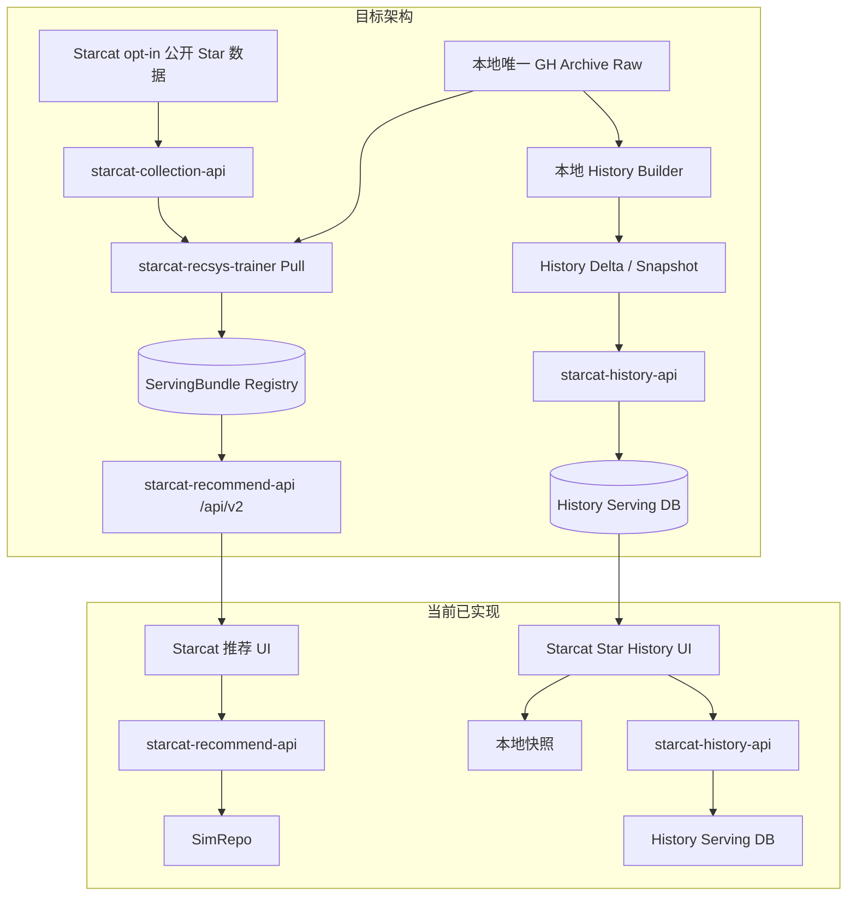

# Starcat 推荐、数据贡献与 Star History 文档导航

> 日期: 2026-08-31
> 状态: 当前需求统一入口
> 适用范围: Starcat macOS 客户端、本地数据平台、推荐训练服务、推荐查询服务、Star History 服务
> 用途: 为后续开发者和 AI Agent 提供文档优先级、阅读顺序、代码入口与实施边界

## 1. 当前结论

这组需求包含三条关联但职责独立的链路：

1. **Starcat 数据贡献当前阶段**：用户主动开启后，客户端以完全静默的旁路任务向独立 `starcat-collection-api` 贡献匿名公开 Star 全量快照；不建设 History 用户观测贡献。
2. **自研仓库推荐**：训练服务基于 Starcat opt-in 数据、GH Archive 和公开 repo metadata 生成推荐产物，在线 API 只读 Serving DB。
3. **自研 Star History**：独立服务读取本地 WatchEvent 日级聚合，按不处理 Unstar 的固定口径提供公共估算历史；当前不增加 History 用户贡献。

三条业务链路共用一套本地数据基础设施：BigQuery Raw 只在本地保存一份，History 和 Trainer 通过 Artifact URI 只读复用；云端只接收派生 History DB 和 Recommendation ServingBundle。

当前线上推荐由 `starcat-recommend-api` 的 `/api/v1` 中转已获作者授权的 SimRepo 接口；该服务同时是长期统一推荐入口，已新增 `/api/v2` 读取自研 ServingBundle。普通公开仓库 Star History 已迁到聚合生产入口中的 `starcat-history-api`，Discovery 旧路径默认关闭，仅在一个稳定发布窗口内保留代码级回退能力。

2026-08-24 本机真实数据全链路结果见 [公开 Star 自研推荐全链路最终测试报告](公开Star自研推荐全链路最终测试报告.md)，交付收口见 [公开 Star 自研推荐全链路需求完成结果报告](公开Star自研推荐全链路需求完成结果报告.md)。需要在当前 `dev` 重新执行真实数据验证时，按 [本地推荐全链路验证指南](本地推荐全链路验证指南.md) 操作。

2026-08-29 已记录 [全量 WatchEvent 推荐训练扩容实施方案](22-全量WatchEvent推荐训练扩容实施方案.md)。当前只等待 PushEvent 2016—2026 下载与完整性检查完成，不自动启动全量数据构建或训练。

当前实施与目标后端拆分为：

```text
supports/starcat-collection-api  独立接收公开 Star 快照并向 Trainer 提供内部导出
supports/starcat-recsys-trainer  Pull 数据、构建数据集、训练、评估、模型发布
supports/starcat-recommend-api    /api/v1 代理 SimRepo；/api/v2 只读自研 ServingBundle
supports/starcat-history-api      接收本地 History Delta/Snapshot 并提供公共查询
本地数据平台                     唯一保存 BigQuery Raw，负责 Catalog、分析和派生产物发布
```

不再创建 `starcat-recsys-api`。自研服务达到质量、稳定性和迁移门槛后，只删除 `starcat-recommend-api` 内的 SimRepo Provider 及对应密钥；统一 Recommend 服务继续保留。History 仍按独立方案迁移 Discovery 路径。

## 2. 当前状态与目标架构



说明：

- 当前推荐链路已落地，SimRepo 作者授权已经取得。
- Starcat 与生产聚合入口已使用独立 History 服务；Discovery 的按请求 BigQuery History 路径默认关闭，并在稳定发布窗口后删除。
- `starcat-collection-api`、静默贡献开关和 Collection Pull Connector 已进入第一阶段实施，尚未生产部署。
- 当前不实现 History 用户贡献、贡献状态展示和服务端删除；Collection 失败必须与 Starcat 主功能完全隔离。

## 3. 文档优先级

后续开发出现文档冲突时，按以下顺序判断：

1. **已发布事实和项目硬性规范**：`AGENTS.md`、开发前问题清单、当前代码、数据库 migration。
2. **当前权威详细设计**：61、62、63、66。
3. **当前实现基线**：相似仓库推荐正式方案、50-Star History 整体方案。
4. **历史总体方案、调研与早期草案**：60、16～21，用于理解背景和备选方案，不能覆盖新设计。
5. **功能实现总览**：只用于确认项目进度；没有 dong4j 单独授权时禁止修改。

权威性不是“编号越大越正确”。例如 50 记录当前 Discovery 实现事实，62 记录未来迁移目标，两者分别回答“现在是什么”和“后面怎么改”，不能互相替代。

## 4. 本目录文档

| 编号 | 文档 | 当前定位 | 后续开发什么时候读 |
|---|---|---|---|
| 16 | [SimRepo 接入与自研方案](16-仓库推荐算法-SimRepo接入与自研方案.md) | SimRepo 接入历史、接口形态、v1/v2 算法复核和自研背景 | 排查现有 SimRepo Provider、理解外部基线时 |
| 17 | [Meilisearch 调研与本地集成方案](17-Meilisearch-调研与本地集成方案.md) | 全文检索基础设施调研，不是推荐模型权威方案 | 推荐需要关键词召回或检索服务复用时 |
| 18 | [Qdrant 语义搜索迁移方案](18-Qdrant-语义搜索迁移方案.md) | 向量 Serving 的历史技术选型，不代表生产推荐必须使用 Qdrant | 评估向量数据库和迁移成本时 |
| 19 | [内容向量、行为训练与数据获取](19-推荐训练-内容向量vs行为训练与用户行为采集.md) | 内容/行为信号基础解释；广义行为采集部分属于历史候选 | 设计训练数据和理解为何需要训练时 |
| 20 | [Repo Research Agent 设计方案](20-Repo-Research-Agent-设计方案.md) | 推荐系统的上层消费场景之一 | 把推荐候选接入项目调研 Agent 时 |
| 21 | [自研相似仓库推荐算法草案](21-自研相似仓库推荐算法-设计方案.md) | 早期多路召回总体草案，固定权重和服务边界已被 61 修订 | 回顾备选算法、表结构和演进背景时 |
| 22 | [全量 WatchEvent 推荐训练扩容实施方案](22-全量WatchEvent推荐训练扩容实施方案.md) | 记录当前实测规模、PushEvent 前置门禁、全量 Silver 构建、单机资源保护和下一模型验收 | PushEvent 下载完成后实施全量训练扩容时 |
| 指南 | [本地推荐全链路验证指南](本地推荐全链路验证指南.md) | 使用真实 Star 主库复现 Collection、Trainer、Recommend v2 和 Direct UI 全链路 | 在 `dev` 本地重跑完整链路、排查跨服务问题时 |
| 指南 | [WatchEvent 与 Star History 每日增量运维指南](WatchEvent与Star-History每日增量运维指南.md) | 记录 UTC 昨日补数、History Delta 追赶、LaunchAgent 调度和失败恢复 | 补齐历史缺口或维护每日增量链路时 |

### 4.1 不能直接照搬的历史内容

- 16 中“SimRepo 统一使用 repo embedding”的描述只适用于早期理解；当前公开说明已区分 SVD v1 和时间衰减 shared-stargazer v2。
- 19 中点击、浏览、AI 分析、标签、笔记和加入对比等行为不是当前获准上传字段。
- 21 中固定全局融合权重只作为 baseline；生产方案使用分数校准、行为置信度动态融合和 MMR。
- 17/18 是搜索与向量基础设施调研，不构成必须采用 Meilisearch 或 Qdrant 的决策。

## 5. 跨目录权威文档

| 文档 | 作用 | 权威范围 |
|---|---|---|
| [相似仓库推荐实施方案](../正式方案/相似仓库推荐实施方案.md) | 记录当前客户端与 `starcat-recommend-api` 已落地契约 | 当前推荐实现、SimRepo 适配和客户端兼容边界 |
| [50-仓库星标历史整体落地方案](../../../3-设计/详细设计/50-仓库星标历史整体落地方案.md) | 记录本地快照、Discovery API、UI 和 v16 已实现事实 | 当前 Star History 行为和现有验收边界 |
| [60-Starcat 数据贡献与数据平台详细设计](../../../3-设计/详细设计/60-Starcat数据贡献与数据平台详细设计.md) | 保留推荐与 History 两类贡献的历史总体设计 | 理解早期隐私和备选 DTO；新实现不得覆盖 62/63/66 |
| [61-Starcat 自研仓库推荐系统详细设计](../../../3-设计/详细设计/61-Starcat自研仓库推荐系统详细设计.md) | 定义数据源、算法、Trainer、Serving DB、API、评估和迁移 | 自研推荐实现的单一权威方案 |
| [62-Starcat 自研星标历史服务详细设计](../../../3-设计/详细设计/62-Starcat自研星标历史服务详细设计.md) | 定义本地 WatchEvent 聚合、单锚点估算、Delta/Snapshot、History API 和 Discovery 迁移 | 自研 Star History 的单一权威方案 |
| [63-Starcat 公开 Star 数据静默上报与 Collection 服务详细设计](../../../3-设计/详细设计/63-Starcat公开Star数据静默上报与Collection服务详细设计.md) | 定义当前单 Toggle、静默旁路、独立 Collection API、分块上传和 Trainer Pull | 第一阶段公开 Star 数据链路的单一权威实施契约 |
| [66-Starcat 本地数据湖与云端 Serving 同步详细设计](../../../3-设计/详细设计/66-Starcat本地数据湖与云端Serving同步详细设计.md) | 定义 BigQuery 本地唯一 Raw、Catalog、History 日增量、Recommend 分片和云端发布 | 数据存储、分析、增长与同步的单一权威方案 |
| [67-Starcat 数据平台 Web 运维控制台详细设计](../../../3-设计/详细设计/67-Starcat数据平台Web运维控制台详细设计.md) | 定义 Admin Console 复用、数据平台页面、结构化 Job、单机 Runner 和多机 Worker | 本地数据平台可视化与操作控制面的单一权威方案 |
| [57-Agent 工作台与统一能力层详细设计](../../../3-设计/详细设计/57-Agent工作台与统一能力层详细设计.md) | 定义当前 Agent Run Surface 和统一能力边界 | 推荐结果进入 Agent 工作台时的 UI/Runtime 约束 |
| [开发前问题清单](../../../1-立项/开发前问题清单.md) | 记录 5.18、5.20、5.21 的隐私、服务、数据湖和控制台边界 | 架构决策基线 |
| [功能实现总览](../../../功能实现总览.md) | 活文档主进度索引 | 只读核对；修改需要 dong4j 单独授权 |

## 6. 上游项目与算法参考

| 项目 | 可借鉴内容 | 不能假设的内容 |
|---|---|---|
| [SimRepo](https://github.com/Mubelotix/simrepo) | v1 SVD、v2 时间衰减 shared-stargazer、单仓/多仓推荐产品形态 | 公开仓库没有 v2 完整训练流水线，不能自行补写精确公式 |
| [GitHub Repo Embeddings](https://github.com/Puzer/github-repo-embeddings) | GH Archive WatchEvent user-repo 集合、PushEvent repo 基础目录、`EmbeddingBag(mean)`、128D repo embedding、`MultiSimilarityLoss` | README/Qwen 初始化和生产 Serving 没有完整公开实现；Push 时间不是权威仓库创建/更新时间 |
| [GH Archive](https://www.gharchive.org/) | GitHub 公开事件和 BigQuery bootstrap 数据 | `WatchEvent` 没有完整 Unstar；`PushEvent` 不能替代 GitHub 当前完整 metadata |

调研基线 commit：

```text
Puzer/github-repo-embeddings
f6a2f836b63f1065b2a2efdee21e8485449923bc

Mubelotix/simrepo
07c6ef1dcfe2fd96cc050ef91529b7f180a55288
```

重新实施前应先核对上游最新 commit；算法事实发生变化时更新调研说明，但不能静默改变已经冻结的 Starcat API 和隐私契约。

## 7. 当前代码入口

### 7.1 推荐客户端

| 入口 | 职责 |
|---|---|
| [RecommendAPI.swift](../../../../Starcat/Core/Network/RecommendAPI.swift) | 显式选择 SimRepo v1 或自研 Bundle v2 的推荐网络请求 |
| [RecommendModels.swift](../../../../Starcat/Core/Network/RecommendModels.swift) | v1/v2 共用推荐 DTO，v2 额外解码 `model_version` |
| [RecommendationContextService.swift](../../../../Starcat/Features/Recommendations/RecommendationContextService.swift) | 推荐结果与仓库上下文协调 |
| [RepoRecommendationViewModel.swift](../../../../Starcat/Features/Recommendations/RepoRecommendationViewModel.swift) | 推荐加载、分页和状态 |
| [RepoRecommendationPopover.swift](../../../../Starcat/Features/Recommendations/RepoRecommendationPopover.swift) | 推荐结果 UI |
| [DiskRecommendationCache.swift](../../../../Starcat/Shared/Services/DiskRecommendationCache.swift) | 推荐本地缓存 |

### 7.2 当前推荐后端

| 入口 | 职责 |
|---|---|
| [starcat-recommend-api README](../../../../supports/starcat-recommend-api/README.md) | 当前服务说明、配置和运行方式 |
| [recommend.go](../../../../supports/starcat-recommend-api/internal/handler/recommend.go) | 推荐 HTTP handler |
| [simrepo.go](../../../../supports/starcat-recommend-api/internal/provider/simrepo.go) | SimRepo Provider |
| [cache.go](../../../../supports/starcat-recommend-api/internal/provider/cache.go) | 当前服务端推荐缓存 |

### 7.3 Star History 客户端

| 入口 | 职责 |
|---|---|
| [StarHistoryAPI.swift](../../../../Starcat/Core/Network/StarHistoryAPI.swift) | 当前远端历史 API |
| [RepoStarHistoryRepository.swift](../../../../Starcat/Core/Insights/RepoStarHistoryRepository.swift) | local-first 读取、合并和快照写入 |
| [RepoStarHistoryPointRecord.swift](../../../../Starcat/Core/Database/Models/RepoStarHistoryPointRecord.swift) | 本地历史点持久化模型 |
| [StarHistoryViewModel.swift](../../../../Starcat/Features/Insights/StarHistoryViewModel.swift) | 范围、轮询、取消和 UI 状态 |

### 7.4 当前 Discovery History 后端

| 入口 | 职责 |
|---|---|
| [star_history.go handler](../../../../supports/starcat-discovery-api/internal/handler/star_history.go) | 当前 Star History 查询和异步构建入口 |
| [star_history.go store](../../../../supports/starcat-discovery-api/internal/store/star_history.go) | 当前缓存、历史点和构建状态存储 |
| [star_history.go model](../../../../supports/starcat-discovery-api/internal/model/star_history.go) | 当前后端 DTO |

### 7.5 数据贡献未来会复用的客户端基础

| 入口 | 职责 |
|---|---|
| [Repo.swift](../../../../Starcat/Core/Database/Models/Repo.swift) | repo ID、公开性、Star 数和 metadata |
| [StarredRepo.swift](../../../../Starcat/Core/Database/Models/StarredRepo.swift) | 当前账户与已 Star repo 的本地关系；真实 `userId` 禁止上传 |
| [RepoRepository.swift](../../../../Starcat/Core/Sync/RepoRepository.swift) | repo、Star 关系和本地 Star History 快照写入入口 |
| [DatabaseMigrationsV1.swift](../../../../Starcat/Core/Database/Migrations/DatabaseMigrationsV1.swift) | 当前 migration 注册事实；未来只能追加新 `registerVN` |
| [TestEnvironment.swift](../../../../Starcat/Shared/Utilities/TestEnvironment.swift) | 测试 host 的 Keychain / 系统授权门控 |

### 7.6 现有回归测试入口

| 入口 | 覆盖范围 |
|---|---|
| [RecommendationCacheTests.swift](../../../../StarcatTests/RecommendationCacheTests.swift) | 推荐磁盘缓存 |
| [RecommendAPITests.swift](../../../../StarcatTests/RecommendAPITests.swift) | v1/v2 路由选择与 ServingBundle 响应契约 |
| [StarHistoryAPITests.swift](../../../../StarcatTests/StarHistoryAPITests.swift) | History API 契约 |
| [RepoStarHistoryRepositoryTests.swift](../../../../StarcatTests/RepoStarHistoryRepositoryTests.swift) | local-first 合并和快照存储 |
| [StarHistoryViewModelTests.swift](../../../../StarcatTests/StarHistoryViewModelTests.swift) | 范围、轮询、取消和派生状态 |

## 8. 按开发任务阅读

### 8.1 修改现有推荐 UI 或 SimRepo 适配

阅读顺序：

```text
相似仓库推荐实施方案
    → 16-SimRepo 接入与自研方案
    → RecommendAPI / RecommendModels / Recommendation ViewModel
    → starcat-recommend-api handler/provider/tests
```

约束：保持 `/api/v1/repos/{repo_id}/recommendations` 资源语义；客户端不直连 SimRepo，不持有 SimRepo key。

### 8.2 开发 Starcat 数据贡献

阅读顺序：

```text
开发前问题清单 5.18
    → 63-公开 Star 数据静默上报与 Collection 服务
    → 60-数据贡献与数据平台背景
    → Repo / StarredRepo / RepoRepository / 本地 Star History Repository
    → 数据库设计与现有 migration
```

实现边界：第一阶段只有推荐贡献 Toggle；直接访问独立 Collection 服务。上传完全静默，任何构造、入队或网络失败都不能改变 Stars 同步和其他功能状态。

### 8.3 开发推荐训练服务

阅读顺序：

```text
61-自研仓库推荐系统
    → 66-本地数据湖与云端 Serving 同步
    → 22-全量 WatchEvent 推荐训练扩容实施方案
    → 60-推荐快照 DTO 与删除边界
    → 19-内容与行为训练基础
    → Puzer / SimRepo 固定 commit
```

先实现可复现数据集和 A～G ablation，再决定生产存储。不能因为早期文档出现 Qdrant、ALS 或 LightFM 就直接绑定技术栈。

### 8.4 开发在线推荐 API

阅读顺序：

```text
61-在线 API、Serving、SLO、灰度
    → 当前相似仓库推荐实施方案
    → 当前 RecommendModels
```

`starcat-recommend-api` 的 v2 Provider 只读已发布模型和 Serving DB，不能读取匿名快照原始表，也不能在请求进程内训练；v1 SimRepo 路径保持原契约。

### 8.5 开发独立 Star History 服务

阅读顺序：

```text
50-当前实现事实
    → 62-目标 History 服务
    → 66-本地数据湖、History Delta 与 Snapshot
    → 当前 StarHistoryAPI / Repository / Discovery handler/store
```

先兼容当前客户端资源和点级 `source/precision` 语义，再做 shadow、历史回填和灰度。稳定前不能删除 Discovery 路径。

### 8.6 将推荐接入 Repo Research Agent

阅读顺序：

```text
20-Repo Research Agent
    → 61-多仓推荐 API 与可解释 reasons
    → 57-Agent 工作台与统一能力层
```

Agent 只能消费推荐结果和公开 metadata，不能获得匿名参与者、共同 Stargazer 身份或原始训练数据。

### 8.7 开发数据平台 Web 运维控制台

阅读顺序：

```text
66-本地数据湖与云端 Serving 同步
    → 67-数据平台 Web 运维控制台
    → starcat-admin-console 落地方案与 AGENTS.md
    → Collection / Trainer / History / Recommend 管理接口
```

复用现有 `starcat-admin-console`，不新建第三套前端。页面只创建固定 Action Job，不提供任意 Shell、SQL、数据库编辑器或 URL 代理；首期只绑定本机回环地址，远程访问另行设计。

## 9. 实施硬约束

### 9.1 数据与隐私

- 当前只有推荐贡献 Toggle，默认关闭，且与匿名遥测完全独立；不增加 History 贡献 Toggle。
- Collection 只接收公开 repo ID 和可空 `starred_at`；History 不上传本机日级 `stars_count`。
- 不上传 GitHub user ID/login、Token、Private/Internal repo、标签、笔记、搜索、点击、README、代码、AI/RAG 内容。
- 关闭 Toggle 停止未来推荐贡献并清理本地待发送任务；当前不实现服务端删除、状态查询或 History 删除重算。

### 9.2 架构

- 推荐 Trainer、统一 Recommend API、Star History 是三个独立职责。
- Recommend API 只承接在线 Serving，不能接收原始贡献数据或执行训练；History 不能重新塞进 Discovery。
- 在线推荐 API 不读取匿名原始数据；History 查询 API 不读取参与者身份。
- BigQuery Raw 只保存在本地唯一数据湖；History 和 Trainer 只读复用，不向云端或业务仓库复制。
- History 使用日级 Delta 和月度 Snapshot；Recommend 使用完整 model manifest 原子激活，不能把不同模型版本增量混写。
- SimRepo 和 Discovery 是迁移期 Provider，最终删除对应 Provider，禁止永久双写/双读。
- 算法结果必须带 model version、source/signal 和可解释降级状态。

### 9.3 Starcat 客户端

- local-first 不变；未参与数据贡献的用户仍可使用公共推荐和 History 查询。
- Private/Internal History 保持本机处理，公共服务客户端和服务端双重拦截。
- 正式版数据库变更只能追加新的 `registerVN`，禁止修改 `v1-initial` 或已经发布的 migration。
- 新增启动期 Keychain 访问必须使用 `TestEnvironment.isRunning` 门控。
- UI 实施前先读取根目录 `DESIGN.md` 和对应 UI 规范。

### 9.4 文档与协作

- 开发前先读取根目录 `AGENTS.md` 和 [开发前问题清单](../../../1-立项/开发前问题清单.md)。
- 以当前代码和 Git 状态核对文档，不把“方案已确认”写成“功能已实现”。
- `supports/` 下各后端是独立 Git 仓库，分别提交和验收。
- 未经 dong4j 单独确认，禁止修改 [功能实现总览](../../../功能实现总览.md)。
- 未经授权，不 push、不部署、不执行数据迁移或生产 BigQuery 查询。

## 10. 推荐实施顺序

```text
1. 保持已完成的 Collection、Trainer、Recommend v2 和 Starcat Direct 链路稳定
2. 登记本地唯一 WatchEvent Raw，建立 Catalog、watermark、checksum 和容量统计
3. 构建 History 日级 Silver、Delta、月 Snapshot 和独立 History API
4. 回填并 shadow 对比 Discovery，完成客户端 endpoint 切换和人工验收
5. 用本地增量 Dataset 完成 co-star / Metric Learning / content / SVD 评估和版本化发布
6. 真实 Bundle 达到 SLO 门槛后再实施内容寻址分片
7. 自研质量达标后删除 SimRepo Provider 和 Discovery History 路径，保留统一 Recommend 服务
```

任何阶段都不能通过长期兼容层掩盖未完成迁移。回滚窗口可以保留上一版本产物和短期只读路径，但收口阶段必须删除废弃代码、密钥、表和配置。

## 11. AI Agent 开工检查

后续 AI Agent 在改动前至少回答：

```text
[ ] 本次任务属于当前实现维护，还是目标架构建设？
[ ] 已读取对应的 50 / 60 / 61 / 62 / 63 / 66 / 67 权威文档？
[ ] 是否会接触 Private/Internal、真实 GitHub 身份或本地用户数据？
[ ] 后端删除和回滚路径是否已经存在？
[ ] 是否需要追加数据库 migration？
[ ] 是否错误地把旧 Provider 变成永久双轨？
[ ] 是否跨越了 supports/ 独立仓库边界？
[ ] 自动化证明和人工验收边界分别是什么？
[ ] 是否取得修改功能总览、push、部署或生产数据查询的单独授权？
```

如果这些问题无法从当前代码和权威文档得到确定答案，应先停止实现并向 dong4j 说明缺口，不能自行扩大数据范围或服务职责。
