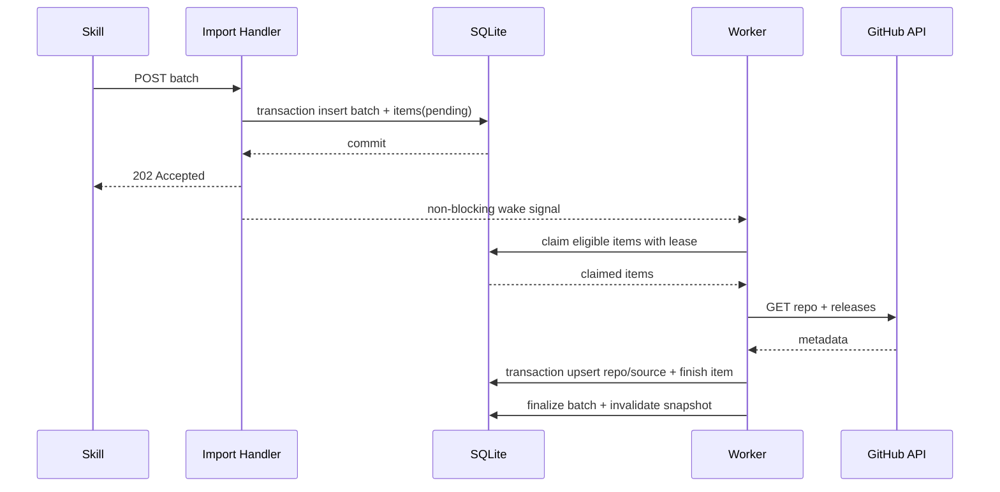
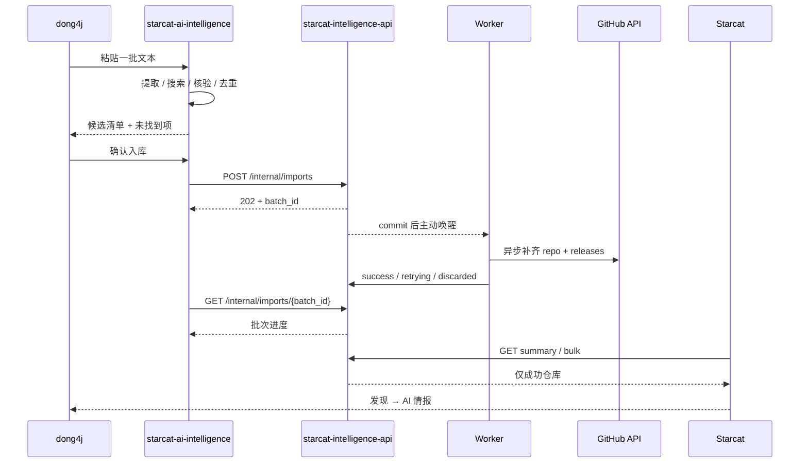

# AI 情报独立服务与采集 Skill 正式方案

> 日期：2026-07-15
> 状态：方向已确认，待实施
> 范围：`starcat-intelligence-api`、Starcat「探索 → 发现 → AI 情报」、repo-local `starcat-ai-intelligence` skill

## 1. 目标

把一批 AI 新闻、项目推荐或其他文本线索转换为可在 Starcat 浏览的真实 GitHub 仓库，同时保持采集、补全和客户端展示三层解耦：

1. repo-local skill 负责理解文本、搜索并核验真实 GitHub 仓库，输出 `owner/repo`。
2. 独立后端 `starcat-intelligence-api` 负责批量接收仓库、持久化排队、异步调用 GitHub API、失败重试与公开查询。
3. Starcat 通过独立只读 API 和独立本地缓存消费成功数据，在「探索 → 发现 → AI 情报」展示。

## 2. 已确认的核心决策

1. **不修改 `starcat-discovery-api`**
   AI 情报不是 Discovery Search seed、热门排名或新发布排名的一部分，不复用其数据库、Worker、bulk 或分类表。

2. **新增独立服务 `starcat-intelligence-api`**
   服务目录规划为 `supports/starcat-intelligence-api/`，本地端口使用现有 5001～5006 之后的 `5007`。

3. **批量提交先落库，再异步调用 GitHub**
   `POST` 请求中禁止调用 GitHub API。接口只校验、去重、创建批次和任务，事务提交后返回 `202 Accepted`。

4. **Worker 主动唤醒为主，15 分钟巡检兜底**
   新批次提交成功后发送内存信号立即唤醒 Worker；Worker 每 15 分钟巡检遗留任务、失败重试、超时恢复和多次失败剔除。

5. **Starcat 使用独立客户端链路**
   新增 `IntelligenceAPI`、`IntelligenceRepository` 和 `intelligence_*` 可重建缓存表，不把 Intelligence DTO 塞进 Discovery DTO。

6. **UI 挂在“发现”下，但数据源独立**
   `ExploreMode` 仍是 `.discover`；用户选择「AI 情报」后，中栏切换到 Intelligence 数据源，不新增与“发现 / 趋势 / 热门 / 新发布 / 周刊”并列的一级模式。

7. **`type` 是来源类型，不是新的 Explore 一级入口**
   首期使用 `ai_news`。后续可以增加 `weekly_recommendation`、`manual_pick`、`social_media` 等类型，Starcat 首期统一展示，未来再增加类型筛选。

## 3. 总体架构


服务边界：

| 组件 | 负责 | 不负责 |
|---|---|---|
| skill | 文本拆分、URL 提取、联网搜索、仓库真实性核验、批量提交 | GitHub 元数据持久化、失败重试、公开列表 |
| `starcat-intelligence-api` | 批次队列、GitHub enrich、来源类型、重试/剔除、只读 API | 理解自然语言、搜索新闻正文、修改 Discovery 数据 |
| Starcat | 本地优先读取、筛选排序、列表与详情展示 | 调用管理 POST、等待任务状态、直接调用 GitHub 补列表字段 |

## 4. 独立后端服务设计

### 4.1 工程边界

```text
supports/starcat-intelligence-api/
├── cmd/server/
├── internal/config/
├── internal/github/
├── internal/handler/
├── internal/model/
├── internal/store/
├── internal/tokenpool/
├── internal/worker/
├── docs/
├── Dockerfile
├── fly.toml
├── go.mod
├── LICENSE
└── README.md / README-ZH.md
```

统一遵循现有 supports 服务约定：

- Go 1.25；
- SQLite WAL；
- `Authorization: Bearer <key>`；
- `/api/v1/*` 使用 Starcat envelope；
- `/internal/*` 使用独立 Admin API Key；
- GitHub PAT 使用 Token Pool；
- `.env` 只存本地真实配置，仓库仅提交 `.env.example`；
- Fly.io 使用独立 app 和独立 volume。

建议配置：

```text
PORT=5007
STORE_FILE=./intelligence.db
API_KEYS=...
ADMIN_API_KEYS=...
GITHUB_TOKENS=...
WORKER_SWEEP_INTERVAL=15m
WORKER_MAX_ATTEMPTS=3
WORKER_LEASE_TIMEOUT=30m
WORKER_CLAIM_LIMIT=10
CACHE_TTL_SECONDS=900
```

### 4.2 管理端批量提交接口

```http
POST /internal/imports
Authorization: Bearer <admin-api-key>
Content-Type: application/json
```

请求：

```json
{
  "type": "ai_news",
  "idempotency_key": "20260715-7f0a...",
  "repositories": [
    { "owner": "Zackriya-Solutions", "repo": "meetily" },
    { "owner": "iOfficeAI", "repo": "OfficeCLI" }
  ]
}
```

约束：

- 单批最多 200 个仓库；
- `owner` / `repo` 去除首尾空白，不接受完整 URL；
- 以小写 `owner/repo` 作为批内去重键，但保留原始大小写供日志展示；
- `type` 首期允许 `ai_news`，新增类型通过后端显式白名单开放；
- `idempotency_key` 必填且全局唯一，skill 在网络超时后重试同一请求不会创建重复批次；
- Handler 不创建 goroutine 执行网络任务，不调用 GitHub，不等待 Worker。

成功响应使用 `202 Accepted`：

```json
{
  "schema_version": 1,
  "data": {
    "batch_id": "019f...",
    "status": "pending",
    "type": "ai_news",
    "total": 2,
    "duplicate_count": 0,
    "created_at": "2026-07-15T12:30:00Z"
  }
}
```

同一 `idempotency_key` 重放时返回原批次，不重复插入任务。

### 4.3 批次状态接口

```http
GET /internal/imports/{batch_id}
Authorization: Bearer <admin-api-key>
```

响应需要包含批次汇总和每项结果：

```json
{
  "schema_version": 1,
  "data": {
    "batch_id": "019f...",
    "status": "partial_success",
    "total": 5,
    "pending": 0,
    "processing": 0,
    "retrying": 0,
    "success": 4,
    "discarded": 1,
    "items": [
      {
        "full_name": "iOfficeAI/OfficeCLI",
        "status": "success",
        "attempts": 1,
        "github_repo_id": 123456
      },
      {
        "full_name": "example/missing",
        "status": "discarded",
        "attempts": 1,
        "last_error": "GITHUB_REPO_NOT_FOUND"
      }
    ]
  }
}
```

### 4.4 公开只读接口

```text
GET /healthz
GET /api/v1/ping
GET /api/v1/intelligence/summary
GET /api/v1/intelligence/bulk
```

- `/healthz` 不鉴权，只检查进程和 SQLite 是否可用；
- `/api/v1/*` 使用普通 `API_KEYS`，不接受 Admin API Key 替代；
- `summary` 只返回成功仓库总数、类型计数和生成时间；
- `bulk` 返回全部成功仓库、来源扩展段、summary、ETag，并支持 gzip；
- 首期不增加远端分页接口，Starcat 使用 bulk 落本地后分页。

`bulk` 示例：

```json
{
  "schema_version": 1,
  "data": {
    "repos": [
      {
        "repo": {
          "repo_id": 123456,
          "owner": "iOfficeAI",
          "name": "OfficeCLI",
          "full_name": "iOfficeAI/OfficeCLI",
          "description": "...",
          "language": "Python",
          "stars": 1000,
          "forks": 100,
          "watchers": 20,
          "subscribers": 12,
          "open_issues": 8,
          "owner_avatar": "https://...",
          "homepage": "https://...",
          "default_branch": "main",
          "license_spdx": "MIT",
          "topics": ["ai", "office"],
          "pushed_at": "2026-07-15T08:00:00Z",
          "updated_at": "2026-07-15T08:00:00Z",
          "created_at": "2026-06-01T08:00:00Z",
          "is_archived": false,
          "is_fork": false,
          "latest_release_tag": "v1.0.0",
          "latest_release_at": "2026-07-10T08:00:00Z"
        },
        "intelligence": {
          "types": ["ai_news"],
          "first_collected_at": "2026-07-15T12:30:00Z",
          "last_collected_at": "2026-07-15T12:30:00Z"
        }
      }
    ],
    "summary": {
      "total": 1,
      "types": [
        { "key": "ai_news", "label": "AI 新闻", "count": 1 }
      ],
      "generated_at": "2026-07-15T12:31:00Z"
    }
  },
  "meta": {
    "total": 1,
    "generated_at": "2026-07-15T12:31:00Z"
  }
}
```

`repo` 与 `intelligence` 必须分层，来源字段不得加入跨服务共享 Repo DTO。

### 4.5 数据库设计

新服务尚未发布，首次实现可以在自身 initial schema 中创建以下表；发布后所有变更必须追加版本迁移。

#### `import_batches`

| 字段 | 说明 |
|---|---|
| `id` | UUID/ULID 主键 |
| `idempotency_key` | 唯一幂等键 |
| `type` | 来源类型 |
| `status` | `pending / processing / success / partial_success / failed` |
| `total_count` | 去重后的任务数 |
| `success_count` | 成功数 |
| `discarded_count` | 剔除数 |
| `created_at / started_at / finished_at` | 批次时间 |

#### `import_items`

| 字段 | 说明 |
|---|---|
| `id / batch_id` | 任务与批次 |
| `owner / repo / normalized_full_name` | 输入和去重键 |
| `status` | `pending / processing / retrying / success / discarded` |
| `attempts` | 已执行 GitHub enrich 次数 |
| `next_attempt_at` | 下次允许领取时间 |
| `lease_owner / lease_expires_at` | Worker 领取租约 |
| `github_repo_id` | 成功后关联 `repos` |
| `last_error_code / last_error_message` | 最后失败原因 |
| `created_at / updated_at / finished_at` | 任务时间 |

约束：`UNIQUE(batch_id, normalized_full_name)`。

#### `repos`

以 GitHub Repo ID 为主键，保存 Starcat 列表和详情需要的公开 GitHub 元数据。`full_name` 唯一，仓库改名时以 GitHub Repo ID 更新 canonical `owner/name`。

#### `repo_sources`

| 字段 | 说明 |
|---|---|
| `github_repo_id` | 关联 `repos` |
| `type` | `ai_news` 等来源类型 |
| `first_batch_id / last_batch_id` | 首次和最近批次 |
| `first_collected_at / last_collected_at` | 首次和最近收录时间 |

主键：`(github_repo_id, type)`。同一仓库被不同文本或类型重复提交时只更新 `last_*`，不复制仓库行。

#### `repo_releases`

保存最近 GitHub Releases 及 asset 摘要，供详情和后续排序使用。首期最多拉取最近 5 条。

### 4.6 Worker 生命周期

Worker 使用“持久化队列 + 主动唤醒 + 15 分钟巡检”：



关键约束：

- GitHub 网络请求必须发生在 SQLite transaction 之外；
- Handler 只有在 transaction commit 成功后才发送唤醒信号；
- 唤醒 channel 使用容量 1 的非阻塞发送，连续批次只需保证 Worker 至少醒一次；
- Worker 每次领取最多 `WORKER_CLAIM_LIMIT` 条，先写租约再离开 transaction；
- 启动时立即执行一次巡检；运行期每 15 分钟巡检；
- `processing` 租约超过 30 分钟未完成时重新变为可领取；
- 一个任务失败不回滚同批其他成功任务；
- 批次进入终态后统一失效 summary/bulk 内存缓存。

### 4.7 GitHub API 调用时机

只有 Worker 成功领取任务后才允许调用 GitHub：

1. 查询本服务 `repos` 是否已有相同 `normalized_full_name`；
2. 已有且 `enriched_at` 在 24 小时内：不调用 GitHub，直接关联新的 `repo_sources`；
3. 不存在或缓存已过期：调用 `GET /repos/{owner}/{repo}`；
4. repo 成功后调用最近 5 条 releases；Release 失败不阻止 repo 入库，但记录警告；
5. 在一个短 transaction 中 upsert `repos`、`repo_releases`、`repo_sources` 并完成任务。

这样既保证 POST 快速返回，也避免相同仓库在短时间内重复消耗 GitHub 配额。

### 4.8 重试与剔除

| 错误 | 处理 |
|---|---|
| GitHub `404 / 422` | 永久错误，直接 `discarded` |
| GitHub `401` | 当前 token 标记不可用，Token Pool 换 token；全部失败后进入重试 |
| GitHub `403 / 429` | 读取 `Retry-After / X-RateLimit-*`，进入 `retrying` |
| GitHub `5xx`、超时、网络失败 | 进入 `retrying` |
| SQLite 写入失败 | 不把任务标成功，租约到期后恢复 |

`WORKER_MAX_ATTEMPTS=3` 表示最多执行 3 次 GitHub enrich：第一次失败后等待 15 分钟，第二次失败后等待 30 分钟，第三次仍失败则改为 `discarded`。任务从可领取队列剔除，但保留记录供批次查询和去重诊断，禁止物理删除失败证据。

### 4.9 发布顺序与缓存一致性

- 公开接口只查询 `import_items.status = success` 且存在 `repo_sources` 的仓库；
- 默认顺序为 `repo_sources.last_collected_at DESC, github_repo_id DESC`；
- 同一仓库存在多个 type 时只返回一个 repo，`intelligence.types` 聚合全部来源；
- Worker 完成单项后数据已持久化，但仅在批次进入终态时失效 bulk cache，避免每个项目都重建快照；
- 手动刷新请求必须绕过 HTTP/URLCache；
- ETag 基于公开数据生成版本而非每次请求时间，内容没变时保持稳定。

## 5. Starcat 对接方案

### 5.1 导航语义

```text
探索
├── 发现
│   ├── 分类
│   │   ├── 全部分类
│   │   ├── AI 情报      ← 独立 Intelligence 数据源
│   │   ├── 人工智能      ← Discovery topic=ai
│   │   ├── 隐私
│   │   └── 工具
│   └── 平台
├── 趋势
├── 热门
├── 新发布
└── 周刊
```

“AI 情报”与“人工智能”必须保持不同语义：前者表示采集渠道，后者表示仓库主题。

建议新增发现分类选择模型：

```swift
enum DiscoveryCategorySelection: Hashable {
    case all
    case intelligence
    case topic(String)
}
```

- 选择 `.intelligence` 时 `ExploreMode` 仍为 `.discover`；
- 中栏切换到 `IntelligenceContentView`；
- 选择 `.all / .topic` 时继续使用现有 `ExploreDiscoveryListView`；
- 平台筛选首期不作用于 AI 情报，避免把两个独立服务的筛选契约强行耦合；进入 AI 情报时清空/忽略 Discovery topic 与 platform；
- Sidebar 的“AI 情报”数量来自 Intelligence summary，不从 Discovery summary 推断。

### 5.2 网络与配置

沿用现有自建服务配置方式，不为 App 引入运行时 URL 环境变量：

- `AppEndpoints.Intelligence.productionURL = https://starcat-intelligence-api.fly.dev`；
- `ThirdPartyService` 增加 `.intelligence`，自建 URL 继续存入 `AppSettings.customServiceURLs`；
- 生产只读 Key 使用 build setting / Info.plist key `STARCAT_PRODUCTION_API_KEY_INTELLIGENCE`；
- 设置页允许填写自建 URL 和自建 API Key，并通过 `/api/v1/ping` 测试；
- App Store / Direct 两个 target 同步注入同名生产 Key。

客户端组件：

```text
AppEndpoints.Intelligence
ThirdPartyService.intelligence
IntelligenceAPI
IntelligenceRepositoryProtocol
IntelligenceRepository
IntelligenceRepoDTO
IntelligenceSummaryDTO
```

`IntelligenceRepoDTO` 使用 endpoint-specific `{ repo, intelligence }`，不得修改 `DiscoveryRepoDTO` 或跨服务共享 DTO 来承载来源字段。

设置页“服务”区域增加 Intelligence API 配置和连通性测试；内置服务与自建服务沿用现有 API Key 热更新方式。

### 5.3 本地缓存

新增可重建公开缓存：

```text
intelligence_bulk_repos
intelligence_bulk_sources
intelligence_bulk_meta
intelligence_summary_types
```

- `intelligence_bulk_repos` 保存仓库卡片字段；
- `intelligence_bulk_sources` 保存 repo 与 type、首次/最近收录时间；
- `intelligence_bulk_meta` 保存 ETag、拉取时间、生成时间和总量；
- `intelligence_summary_types` 保存来源类型及数量；
- TTL 首期 30 分钟，与 Explore Discovery bulk 体验一致；
- 进入页面先显示本地缓存，再按 TTL 后台刷新；
- 网络失败且缓存存在时保留旧数据并显示统一 cache warning；
- 手动刷新使用 `.reloadIgnoringLocalAndRemoteCacheData`；
- 这些表必须使用当前实现时的下一个 `registerVN` 迁移创建，禁止修改已发布的 `v1-initial` 或要求用户删库。

### 5.4 列表与详情复用

新增薄层：

```text
IntelligenceCatalogStore
IntelligenceViewModel
IntelligenceContentView
IntelligenceDetailView
```

复用现有组件：

- `UnifiedSortMenu`；
- `UnifiedRepoRow` / `RepoCardViewData` 适配器；
- `RepoDetailScaffold`；
- `ReadmeStateView`；
- `StarActionService`；
- `SyncIconButton`；
- Star 状态、加入知识库和 README 缓存链路。

不要把 `IntelligenceRepoDTO` 强转成 `DiscoveryRepoDTO`。两种网络模型分别适配到 UI view data，详情只增加一个薄的 Intelligence 容器。

首期排序：

1. 最新收录（默认，`last_collected_at DESC`）；
2. Stars 降序 / 升序；
3. 最近更新 / 最早更新；
4. 创建时间；
5. 名称。

### 5.5 加载与空态

- Intelligence 服务不可用但有缓存：展示缓存 + warning；
- 无缓存且服务不可用：显示错误与重试；
- 服务正常但没有成功仓库：显示“暂无 AI 情报”空态；
- `pending / processing / retrying / discarded` 仅属于管理接口，Starcat 不展示任务队列；
- Worker 完成后，用户手动刷新可立即看到新数据；自动路径最多受客户端 30 分钟 TTL 影响。

### 5.6 i18n、设置与致谢

- 新增文案全部进入 `Localizable.xcstrings`，至少覆盖简体中文和英文；
- 图标建议使用 `sparkles`，文字/图标遵循 `.primary / .secondary`；
- Sidebar 继续使用系统 `List(selection:)` 选中态，不手写背景；
- 新服务随 Starcat 交付时，在 `AboutDependency.all` 登记 `starcat-intelligence-api`；
- 本地运维面板后续增加第 7 个服务卡片，但不作为首批 Starcat 客户端阻断项。

## 6. `starcat-ai-intelligence` Skill 设计

### 6.1 定位与目录

规划为 repo-local 中文 skill：

```text
.claude/skills/starcat-ai-intelligence/
├── SKILL.md
├── agents/openai.yaml
└── references/api.md
```

- 名称使用小写 kebab-case：`starcat-ai-intelligence`；
- `SKILL.md`、`references/` 和示例说明全部使用中文；
- 命令、URL、JSON key、环境变量和错误码保持原文；
- 不创建 README、安装指南、变更日志等冗余文件；
- 实现时使用 `skill-creator/scripts/init_skill.py` 初始化，并用 `quick_validate.py` 验证。

### 6.2 触发语义

description 应覆盖以下意图：

- 用户粘贴一批 AI 新闻或项目推荐文本；
- 要求找出真实 GitHub 项目；
- 要求转换为 `owner/repo`；
- 要求提交到 Starcat AI 情报服务。

### 6.3 工作流

1. 接收整段文本，按编号、换行、标题和 GitHub URL 拆分条目。
2. 直接提取：
   - `https://github.com/{owner}/{repo}`；
   - `github.com/{owner}/{repo}`；
   - 明确的 `{owner}/{repo}`。
3. 对没有地址的条目生成搜索词，优先搜索：
   - `site:github.com <项目名> <组织名>`；
   - 官方组织 GitHub；
   - 官方产品页、论文或公告中指向的 GitHub。
4. 打开候选仓库核验：
   - 仓库真实存在；
   - owner/name 与项目主体一致；
   - description / README / topics 支持匹配；
   - 排除 GitHub 搜索页、用户主页、issue、release、topic 页面；
   - 无法确认时标记“未找到”，禁止猜测 URL。
5. 一条文本包含多个明确仓库时全部保留。
6. 按小写 `owner/repo` 去重，形成候选清单。
7. 默认先向用户展示清单和未找到条目，用户确认后再产生外部写入。
8. 生成一次 `idempotency_key`，将整个列表一次性 POST 到 `/internal/imports`。
9. 轮询批次状态；短时间未结束时返回 `batch_id`，不无限等待。
10. 报告 success、retrying、discarded 和未提交条目。

### 6.4 环境变量与安全边界

```text
STARCAT_INTELLIGENCE_API_BASE_URL
STARCAT_INTELLIGENCE_ADMIN_API_KEY
```

- Admin Key 只从环境变量读取，不写入 skill、日志、Markdown 输出或命令回显；
- skill 只调用管理端 import/status，不调用公开 bulk；
- 未经用户确认不提交；
- 不把原始新闻全文上传后端，后端只收到 `type`、`idempotency_key` 和仓库列表；
- 搜索结果只能作为候选，必须实际核验 GitHub 仓库后才提交。

### 6.5 Skill 输出格式

提交前：

| 原始条目 | 结果 | GitHub |
|---|---|---|
| Meetily | 已确认 | `Zackriya-Solutions/meetily` |
| 某闭源模型新闻 | 未找到公开仓库 | — |

提交后：

```text
batch_id: 019f...
type: ai_news
submitted: 8
success: 7
retrying: 1
discarded: 0
```

### 6.6 Skill 验证样例

至少覆盖：

1. 文本自带单个 GitHub URL；
2. 同一条目包含两个 URL；
3. 只有项目名，需要联网搜索；
4. 闭源产品没有公开仓库；
5. 搜索结果存在同名第三方仓库；
6. 大小写不同的重复 URL；
7. POST 网络超时后使用相同 `idempotency_key` 重试；
8. 后端返回部分成功；
9. 缺少 Admin Key 时只输出候选，不提交。

## 7. 端到端时序



## 8. 实施切片

### Slice A：独立服务骨架与存储

- 新建 `supports/starcat-intelligence-api`；
- 配置、鉴权、envelope、SQLite、Token Pool；
- initial schema 和 store 单测；
- `POST /internal/imports` / `GET /internal/imports/{id}`。

验证：POST 只写数据库，测试用 fake GitHub Client 断言 Handler 阶段调用次数为 0。

### Slice B：Worker 与 GitHub enrich

- commit 后主动唤醒；
- 启动巡检 + 15 分钟 ticker；
- claim lease、repo/releases enrich、重试、剔除、批次收口；
- 注入 clock 和 fake GitHub Client 覆盖状态机。

验证：服务重启后 pending/retrying 可恢复；同批单项失败不影响其他项。

### Slice C：公开 summary / bulk

- endpoint-specific DTO；
- 类型聚合、默认顺序、ETag、gzip、缓存失效；
- API/Admin Key 权限隔离。

验证：公开接口只包含 success；内容不变时 ETag 稳定。

### Slice D：Starcat 客户端

- 新 migration 创建 `intelligence_*` 缓存；
- API / Repository / CatalogStore / ViewModel；
- Sidebar「AI 情报」、中栏列表、右侧详情；
- 设置、i18n、About 致谢。

验证：缓存首显、远端刷新、断网 fallback、手动刷新、Star/加入知识库和 README 均可用。

### Slice E：repo-local skill

- 用 `init_skill.py` 创建 skill；
- 编写中文 `SKILL.md` 和 `references/api.md`；
- 运行 `quick_validate.py`；
- 用本方案中的 9 类样例前向验证。

### Slice F：联调与运维

- 本地端口 5007 联调；
- API Console 增加 Intelligence 服务；
- 服务文档、Fly 配置、备份恢复和监控；
- staging / production 分别部署并验证后再切 Starcat 默认 endpoint。

## 9. 验收标准

### 后端

- 批量 POST 在数据库 commit 后返回 `202`，请求期间 GitHub 调用次数为 0；
- commit 后主动唤醒 Worker，新任务无需等待 15 分钟；
- 15 分钟巡检能恢复遗留、超时和到期重试任务；
- 瞬时错误最多尝试 3 次，永久错误或超限任务进入 `discarded`；
- 服务重启不丢批次和任务；
- 幂等重放不创建重复批次；
- 公开接口只返回成功数据；
- 同一仓库多次提交不会重复创建 repo；
- 普通 API Key 无权调用 `/internal/*`。

### Starcat

- Sidebar 在「发现」下展示“AI 情报”和真实数量；
- “AI 情报”不与现有“人工智能”主题混淆；
- 数据来自 Intelligence API，不请求 Discovery API 获取该列表；
- 本地缓存、TTL、手动刷新和断网 fallback 生效；
- 复用统一仓库行、README 详情、Star 和知识库动作；
- 老版本服务返回可选字段缺失时客户端不崩溃；
- App Store 与 Direct 两个 target 都能使用同一只读链路。

### Skill

- 能处理整批文本和多 GitHub URL；
- 无 URL 时能联网搜索并核验；
- 无公开仓库时明确输出未找到，不编造地址；
- 确认后只发送一次批量 POST；
- Admin Key 不进入输出和日志；
- 能报告批次 ID、成功、重试和剔除结果。

## 10. 明确不做

- 不修改 `starcat-discovery-api` schema、Worker、bulk 或分类；
- 不把原始新闻全文存入后端；
- 不在 Starcat 展示后台 pending/retrying 队列；
- 不让 Starcat 调用管理端 POST；
- 不在 POST Handler 内调用 GitHub 或启动不可恢复的临时 goroutine；
- 不把 Intelligence 来源字段塞进 Discovery DTO；
- 首期不做 AI 情报全文、来源文章详情、编辑审核后台和多用户权限系统；
- 本方案阶段不执行构建、部署、Fly secrets、生产迁移或发布脚本。
