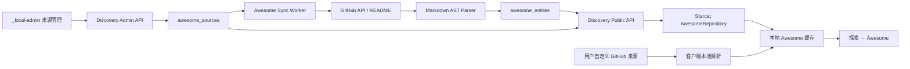

# Awesome 发现栏目与来源管理正式方案

> 日期：2026-08-24  
> 状态：已实现并完成自动化门禁，待人工 UI 验收
> 单一信任源：本文  
> Issue：[#109](https://github.com/starcat-app/Starcat/issues/109)  
> 范围：Starcat「探索 → Awesome」、`supports/starcat-discovery-api`、`supports/starcat-site/_local-admin`

## 0. 最终结论

1. **Awesome 是“探索”的新模式，不是主窗口新的一级栏目。** 它固定排在“周刊”下面，与发现、趋势、热门、新发布、周刊处于同一级。
2. **探索左栏下半部分随模式切换。** 周刊显示“语言”，Awesome 显示“Awesome 来源”；两者不同时出现。
3. **Awesome 来源分成两类。** Starcat 精选来源由内容管理端维护并由 Discovery API 下发；用户自定义来源在客户端添加、解析和保存，不上传到公共服务。
4. **精选来源不是 App 内硬编码清单。** `_local-admin` 提供来源内容管理，`starcat-discovery-api` 保存并公开已发布来源的名称、图片、介绍、仓库地址、项目数和同步状态。
5. **用户自行选择精选来源。** 第一次点击 Awesome 时自动弹出卡片式来源选择 Sheet；用户确认后才订阅和加载对应来源。
6. **来源管理入口固定在 Awesome 名称右侧。** 交互位置参考“我的项目”名称右侧的独立按钮，不在 Awesome 子分类底部再放“管理来源”行。
7. **精选来源由服务端集中解析。** Discovery API 定时或手动抓取来源仓库默认分支 README，解析 GitHub Repo，并向客户端返回预计算结果。
8. **自定义来源由客户端本地解析。** 接受 `owner/repo` 或公开 GitHub 仓库 URL；不把用户添加的来源上传到 Discovery API。
9. **Repo 全局去重，来源关系分别保留。** 同一 Repo 可以来自多个 Awesome；出现于 Awesome 不等于已 Star、已入知识库或属于“我的项目”。
10. **Awesome 与已有“Awesome List 导出”是两个方向。** 本功能是从外部 Awesome README 发现项目；P2 “Awesome List 导出”是把用户 Stars 生成 README，不在本期范围内。

本文替代 `docs/1-立项/发展规划.md` 中仅作为设想的 Awesome / Curated List 描述；现有《探索发现与榜单正式方案》继续约束发现、趋势、热门、新发布，现有《Weekly 多来源扩展、AI 情报采集与置顶运营正式方案》继续约束周刊。三者的服务和数据不能混写。

## 1. 产品目标与术语

### 1.1 产品目标

Starcat 通过公开 Awesome List 帮助用户系统化发现 GitHub 项目：

```text
内容管理员维护精选来源
        ↓
Discovery API 抓取并解析 README
        ↓
Starcat 展示来源卡片，用户自行勾选
        ↓
左栏按来源浏览，中栏展示 Repo，右栏展示详情和来源证据
        ↓
用户按需 Star 或加入知识库
```

用户也可以添加没有进入精选目录的公开 Awesome 仓库，客户端使用同一套展示模型完成本地解析和浏览。

### 1.2 统一术语

| 术语 | 含义 |
|---|---|
| Awesome 模式 | “探索”下与周刊同级的新浏览模式 |
| 精选来源 `managed source` | 由 Starcat 内容管理员维护、Discovery API 发布的公共 Awesome 来源 |
| 自定义来源 `custom source` | 用户在本机添加的公开 GitHub Awesome 仓库 |
| 来源目录 `source catalog` | 精选来源的卡片元数据集合，不包含用户选择 |
| 来源订阅 `subscription` | 用户本机勾选某个来源的关系，不上传服务端 |
| Awesome 条目 `entry` | 来源 README 中解析出的一条链接、标题、描述、章节和顺序事实 |
| GitHub 条目 | 已核验为公开 GitHub Repo 的 Awesome 条目 |
| 外部条目 | 指向官网、商业产品、GitLab、文档站等非 GitHub Repo 的条目 |
| 当前来源 | 用户从某个具体 Awesome 来源进入 Repo 详情时的来源上下文 |

“内置来源”只在讨论中表示由 Starcat 提供。产品文案统一使用“Starcat 精选”，避免让用户误以为清单随 App 二进制固定发布。

## 2. 范围与非目标

### 2.1 本期范围

- 在探索模式列表中把 Awesome 添加到周刊下面。
- Awesome 选中时，将左栏下半部分切换为 Awesome 来源列表。
- 第一次进入时自动展示卡片式来源选择 Sheet。
- Awesome 名称右侧提供独立“管理来源”按钮。
- `_local-admin` 支持精选来源新增、编辑、排序、发布、下架和同步。
- Discovery API 提供精选来源目录和各来源条目接口。
- Discovery API 集中解析精选来源 README，并缓存 GitHub Repo 元数据和来源证据。
- Starcat 本地缓存精选来源目录、已订阅来源和条目。
- 用户可以添加、停用和删除自定义来源，并在本机解析。
- 中栏支持“全部 Awesome”和单来源浏览；同一 Repo 聚合去重。
- 右栏复用现有 Repo 详情，并显示当前来源和其他收录来源。
- 支持从 Awesome 详情执行已有 Star、加入知识库等动作。

### 2.2 非目标

- 不把 Awesome 放到 Manage、Tags、Languages 或 Smart Collections 中。
- 不把 Awesome 合并进 Weekly API 或 Weekly 来源筛选。
- 不在 App 中写死精选来源数组、名称、图片或介绍。
- 不把用户自定义来源上传、共享或推荐给其他用户。
- 不解析 Private / Internal 仓库作为 Awesome 来源。
- 不自动访问外部官网猜测其 GitHub 仓库。
- 不为 GitLab、Codeberg、商业产品建立通用详情模型。
- 不自动 Star、自动入库、自动打标签或自动生成 AI 摘要。
- 不实现“Awesome List 导出”。
- 不建设公网内容后台；运营入口继续使用本地 `_local-admin`。

## 3. 信息架构与交互契约

### 3.1 探索模式顺序

`ExploreMode` 的可见顺序固定为：

```text
探索
├── 发现
├── 趋势
├── 热门
├── 新发布
├── 周刊
└── Awesome  [管理来源]
```

Awesome 必须紧跟周刊，不能插到发现榜单之间，也不能成为新的 `SidebarRootPage`。

### 3.2 左栏动态区域

周刊选中时保持现状：

```text
语言
├── 全部语言
├── Swift
├── Python
└── ...
```

Awesome 选中时替换为：

```text
Awesome 来源
├── 全部 Awesome
├── Awesome Mac
├── Awesome Selfhosted
├── 用户启用的其他精选来源
└── 用户自定义来源
```

规则：

- 只显示用户已启用的来源。
- “全部 Awesome”固定为第一行，数量按 Repo 去重后计算。
- 精选来源按服务端 `sort_order ASC, id ASC` 稳定排序；显示名称变化不能扰动同顺序来源的位置。
- 自定义来源排在精选来源后，按用户添加时间排序。
- README 内部章节不展开到左栏；章节属于中栏筛选，避免形成“来源 → 章节 → Repo”的深层侧栏树。
- 来源不可用时保留一条禁用状态行，允许用户进入管理 Sheet 处理，不静默消失。

### 3.3 Awesome 行与管理按钮

Awesome 模式行的结构与“我的项目”行保持一致：

```text
[Awesome 图标]  Awesome  [管理来源按钮]             [去重 Repo 数]
```

必须满足：

- 管理按钮紧跟 `Awesome` 文本，不能放在整行最右侧，也不能放在来源子列表下面。
- 点击 Awesome 行只切换模式。
- 点击管理按钮只打开来源管理 Sheet；Button 必须拦截行选择，不误触模式切换。
- Button 使用 `.buttonStyle(.plain)` 时必须添加 `.focusEffectDisabled()`。
- 图标使用固定“来源管理”语义，不复用“我的项目”绿色授权勾。建议 `slider.horizontal.3`，最终以同栏可读性验收为准。
- Tooltip 与 Accessibility Label 都是“管理 Awesome 来源”的本地化文案。
- 行选中时图标颜色必须复用 `SidebarSemanticIconStyle`，不得手写固定灰色或绿色。

### 3.4 首次进入状态机

客户端为当前登录账户保存 `hasCompletedAwesomeSourceSetup`：

```text
点击 Awesome
    ↓
hasCompletedAwesomeSourceSetup == false ?
├── 是：选择 Awesome 模式并自动打开来源选择 Sheet
└── 否：直接加载已启用来源
```

状态规则：

- 只有用户点击 Sheet 的“完成”才写入 `true`。
- 取消、关闭或加载失败不能写入完成状态；下次点击 Awesome 仍自动打开。
- “完成”允许零选中；零选中时展示 Awesome 空状态，后续不再强制弹窗。
- 用户以后取消所有来源，完成状态仍保持 `true`。
- 切换 GitHub 账户后按新账户重新判断，不能沿用另一个账户的选择。
- 未登录时 Awesome 入口可以展示，但实际加载与来源保存遵循现有探索登录门禁，不新增匿名私人配置路径。

### 3.5 卡片式来源选择 Sheet

首次选择和手动管理复用同一个 Sheet，不建立第二套 UI：

```text
选择 Awesome 来源

🔮 选择 Awesome 来源
┌──────────────────────────────────────────────┐
│ 搜索名称、owner/repo 或 GitHub 仓库描述       │
└──────────────────────────────────────────────┘

┌──────────────────┐ ┌──────────────────┐ ┌──────────────────┐
│ [Logo] Awesome A │ │ [Logo] Awesome B │ │ [Logo] Awesome C │
│ owner/repo       │ │ owner/repo       │ │ owner/repo       │
│ ★ 32.1K  ▣ 412  │ │ ★ 218K   ▣ 685  │ │ ★ 15K    ▣ 96   │
└──────────────────┘ └──────────────────┘ └──────────────────┘

新增 Awesome 项目
┌────────────────────────┐
│ ＋ 添加自定义来源       │
└────────────────────────┘

                              [取消] [完成]
```

卡片必须展示：

- `image_url` 图片；加载失败回退到来源仓库 owner avatar，再失败使用 Awesome 模式 SF Symbol。
- 来源名称。
- 只展示 GitHub 来源仓库官方 `repo_description`；Discovery 内容管理摘要不在卡片中展示，避免卡片过长。
- `owner/repo`。
- 来源仓库自身的 GitHub Stars、Forks、Watchers、Open Issues。
- 来源仓库 Languages API 字节占比生成的主要语言多色色条。
- 已解析 GitHub Repo 数量。
- 最近成功同步时间；失败或下架时显示紧凑状态提示。
- 推荐标识（`featured=true` 时）。
- 明确的勾选状态。
- 打开来源 GitHub 仓库的独立跳转按钮。

交互要求：

- 整张卡片可点击切换勾选，不能只有小勾选框可点。
- Sheet 使用固定三列桌面网格和稳定卡片高度，来源标题或同步状态变化不能导致列数与位置跳动。
- Stars、项目数和同步状态使用克制的 Repo 风格胶囊；Stars 必须来自 GitHub 事实，不能以“未知”或缺字段时的 `0` 冒充。
- 卡片背景使用 Logo 采样色生成低透明度渐变，图片不可用时使用统一语义兜底色；同时保留系统语义文字色和轻量选中边框。
- 支持键盘焦点、Space 切换和 VoiceOver。
- Sheet header 左上角展示 Awesome 图标；搜索框过滤名称、`owner/repo`、GitHub description 和内容管理摘要，无结果时显示搜索空态。
- Sheet 初次打开不自动聚焦输入框；用户主动点击输入框后仍显示系统 Focus Ring。
- Sheet header 提供目录刷新按钮，只强制校验公共来源目录；中栏刷新按钮同时校验目录和已启用来源条目。
- Sheet header 右上角关闭按钮使用 `SheetCloseButton`。
- Sheet 失败时保留本地缓存卡片，并显示非阻断刷新错误。
- 首次进入且本地完全没有目录缓存、远端也失败时，展示重试和“添加自定义来源”，不能显示假卡片。

### 3.6 中栏列表

选择具体来源时：

- 按 README 章节和原始顺序展示。
- 搜索范围限定当前来源。
- 可按章节筛选，也可切换 Stars、最近更新、名称排序。
- Repo 行复用探索现有统一卡片/列表数据，不新建第二套仓库视觉组件。
- 行内增加来源原始描述或章节摘要，但不能覆盖 GitHub 官方 description。

选择“全部 Awesome”时：

- 按 `gh_repo_id` 全局去重。
- 默认排序优先采用用户已启用来源的 `sort_order`，再取条目在 README 中的最小 `entry_order`，最后以 `gh_repo_id` 保证稳定。
- 同一 Repo 的来源数量作为轻量 metadata 展示。
- 搜索覆盖 Repo 名称、owner、GitHub description、来源原始标题与描述。

### 3.7 右栏详情与来源证据

右栏继续复用 `DiscoveryDetailView` / `RepoDetailScaffold` 能力，不复制 README、Health、Release、Star、知识库和 AI 详情实现。

新增“Awesome 收录来源”区域：

```text
Awesome 收录来源

当前来源：Awesome Mac
所属章节：Utilities / File Transfer
原始描述：A cross-platform file sharing application
查看原始 README 条目

其他来源：
• Awesome Selfhosted
• Awesome Flutter
```

规则：

- 从单一来源进入时突出当前来源，其他来源次要展示。
- 从“全部 Awesome”进入时直接展示全部来源，不伪造当前来源。
- “查看原始 README 条目”只打开经过校验的 `https` URL。
- 来源证据不等于 Starcat 推荐结论，文案统一使用“收录来源”。
- Repo 已 Star、已入库、属于“我的项目”等状态继续读取原有单一真值。
- Discovery 详情的公共 GitHub 元数据以当前 entries 响应为准，不允许本地旧 starred 缓存遮蔽 watchers、subscribers 和创建/更新时间；本地只提供用户关系真值。

## 4. 总体架构与责任边界



| 组件 | 负责 | 不负责 |
|---|---|---|
| `_local-admin` | 精选来源内容 CRUD、排序、发布、下架、同步和状态观察 | 保存用户订阅、充当公网后台 |
| Discovery API | 精选来源目录、README 抓取解析、GitHub 核验、公开查询、缓存 | 保存用户身份和自定义来源 |
| Starcat 客户端 | 来源卡片、本地订阅、自定义来源、本地缓存、三栏展示和用户动作 | 调用管理写接口、自动发布自定义来源 |
| GitHub API | 公开来源仓库、README 与 Repo 真值 | Starcat 用户订阅状态 |

### 4.1 数据隐私

- 精选来源公开接口不接受 GitHub login、用户 ID、点击或订阅参数。
- 用户勾选结果只保存在当前账户本地数据库，不上传 Discovery、CloudKit 或遥测。
- 自定义来源 URL 和解析结果不上传 Discovery。
- 仅支持公开 GitHub 来源；Private / Internal 在校验阶段拒绝。
- Starcat GitHub token 不发送给 Discovery API。

## 5. Discovery API 公共契约

现有 `/api/v1/*` Bearer 鉴权、`StarcatEnvelope<T>`、Gateway `X-SC-Svc: discovery`、错误 envelope 和 API key 规则保持不变。

### 5.1 获取精选来源目录

```http
GET /api/v1/discovery/awesome/sources
If-None-Match: "optional-etag"
```

只返回 `published` 来源，按 `sort_order ASC, id ASC` 排序。

```json
{
  "data": [
    {
      "id": "awesome-mac",
      "display_name": "Awesome Mac",
      "repo_full_name": "jaywcjlove/awesome-mac",
      "repo_url": "https://github.com/jaywcjlove/awesome-mac",
      "repo_description": " Now we have become very big, Different from the original idea.",
      "image_url": "https://cdn.example.com/awesome/awesome-mac.png",
      "summary_zh": "精选 macOS 软件与开源项目",
      "summary_en": "A curated list of macOS software and open-source projects",
      "featured": true,
      "sort_order": 10,
      "source_stars": 32100,
      "source_forks": 2100,
      "source_watchers": 32100,
      "source_subscribers": 380,
      "source_open_issues": 42,
      "source_language": "Swift",
      "language_bytes": {"Swift": 921337, "Shell": 28351},
      "github_repo_count": 412,
      "external_entry_count": 37,
      "last_synced_at": "2026-08-24T08:00:00Z",
      "updated_at": "2026-08-24T08:00:00Z"
    }
  ],
  "meta": {
    "total": 1,
    "generated_at": "2026-08-24T08:00:00Z"
  }
}
```

字段约束：

- `id`：发布后不可更改的 kebab-case 稳定键。
- `repo_full_name`：服务端 GitHub 核验后的 canonical 大小写。
- `repo_url`：服务端生成的 canonical `https://github.com/{owner}/{repo}`。
- `repo_description`：来源仓库的 GitHub 官方 description；从共享 `repos` 真值读取，不在 `awesome_sources` 重复维护。
- `image_url`：只允许 `https`；为空时客户端走 fallback。
- `summary_zh / summary_en`：允许其一为空；保留给目录搜索与内容运营，来源卡片不展示，避免与 GitHub `repo_description` 重复并拉长卡片。
- `source_stars`：来源仓库自身的 GitHub Stars；每轮来源同步均刷新，即使 README SHA 未变化也更新。
- `source_forks / source_watchers / source_subscribers / source_open_issues`：来源仓库 GitHub 事实字段，与 Stars 同轮刷新。
- `source_language / language_bytes`：主要语言和 Languages API 原始字节分布；仅抓取 Awesome 来源仓库，不为 README 子项目批量抓取语言列表。
- `github_repo_count`：当前已发布快照中有效 GitHub Repo 去重数。
- `updated_at`：卡片内容修订时间；`last_synced_at`：README 成功同步时间，两者不能混用。

缓存：

- 成功响应返回 `ETag` 和 `Cache-Control`。
- SQLite 中的来源和条目快照是可跨重启复用的持久缓存；进程内另缓存已经编码的 JSON、gzip 和强 ETag，避免重复查询、序列化、压缩和哈希。
- 进程内缓存 TTL 复用 `CACHE_TTL_SECONDS`（默认 10800 秒），采用 64 条 / 64 MiB 双上限 LRU；同一 key 并发 miss 只允许一个请求重建，其余请求等待并复用结果。
- 内容 CRUD、发布、下架或成功同步后主动精确失效目录和对应来源缓存；失效代际必须阻止旧的在途构建重新写回。
- `304 Not Modified` 不返回伪造 envelope；客户端复用本地快照并只更新检查时间。

### 5.2 获取单一来源条目

```http
GET /api/v1/discovery/awesome/sources/{source_id}/entries
If-None-Match: "optional-source-etag"
```

本期公开接口只返回已核验 GitHub Repo；外部条目仅进入管理统计。

```json
{
  "data": {
    "source": {
      "id": "awesome-mac",
      "display_name": "Awesome Mac",
      "updated_at": "2026-08-24T08:00:00Z"
    },
    "entries": [
      {
        "gh_repo_id": 123456,
        "owner": "example",
        "name": "project",
        "full_name": "example/project",
        "description": "GitHub repository description",
        "owner_avatar": "https://avatars.githubusercontent.com/u/1?v=4",
        "homepage": "https://example.com/project",
        "language": "Swift",
        "stars": 1200,
        "forks": 120,
        "watchers": 1200,
        "subscribers": 42,
        "open_issues": 18,
        "default_branch": "main",
        "license_spdx": "MIT",
        "topics": ["swift", "macos"],
        "is_archived": false,
        "is_fork": false,
        "pushed_at": "2026-08-23T11:00:00Z",
        "updated_at": "2026-08-23T12:34:56Z",
        "created_at": "2020-01-02T03:04:05Z",
        "entry_title": "Project",
        "entry_description": "Original Awesome README description",
        "section_path": ["Utilities", "File Transfer"],
        "entry_order": 42,
        "source_anchor_url": "https://github.com/.../README.md#file-transfer"
      }
    ]
  },
  "meta": {
    "total": 412,
    "generated_at": "2026-08-24T08:00:00Z"
  }
}
```

规则：

- 首期按来源返回完整快照，不做远端筛选和分页；客户端只请求用户已勾选来源并本地筛选。
- `stars / forks / watchers / subscribers / open_issues` 是必返数字字段；包括真实为 `0` 的仓库也不得省略。
- `default_branch / topics / is_archived / is_fork / updated_at / created_at` 是基础事实强契约；客户端拒绝缺字段的旧响应，避免把契约错误伪装成零值。
- `pushed_at / homepage / license_spdx` 允许 GitHub 返回空值；不得用来源同步时间或占位文本冒充。
- entries 响应中 `source.updated_at` 与 `meta.generated_at` 表示最近成功生成当前条目快照的时间；仅在历史异常数据缺少 `last_synced_at` 时回退来源内容修订时间。
- 必须支持 `ETag`，避免重复下载未变化的长清单。
- 单来源响应默认压缩；服务端对异常大来源设置明确响应上限并在管理端阻止发布，而不是运行期静默截断。
- 来源未发布或不存在返回 `404 AWESOME_SOURCE_NOT_FOUND`。
- 来源已发布但从未成功同步不得出现；发布操作必须先通过同步门禁。

### 5.3 不扩展现有 Discovery bulk

Awesome 不并入 `/api/v1/discovery/bulk`：

- 现有 bulk 是发现、热门、新发布的公共 Repo catalog。
- Awesome 按用户订阅加载；把所有来源条目塞进 bulk 会让每个用户下载无关内容。
- Awesome 来源目录和单来源条目有独立 ETag、TTL 与失效边界。

## 6. Discovery 管理契约

所有 `/internal/*` 接口继续使用独立 Admin API Key；密钥不写源码、日志、文档或浏览器持久存储。

### 6.1 来源 CRUD

```http
GET    /internal/discovery/awesome/sources
POST   /internal/discovery/awesome/sources
PATCH  /internal/discovery/awesome/sources/{source_id}
```

创建请求：

```json
{
  "id": "awesome-mac",
  "repo_full_name": "jaywcjlove/awesome-mac",
  "display_name": "Awesome Mac",
  "image_url": "https://cdn.example.com/awesome/awesome-mac.png",
  "summary_zh": "精选 macOS 软件与开源项目",
  "summary_en": "A curated list of macOS software and open-source projects",
  "featured": true,
  "sort_order": 10
}
```

写入前必须：

- 校验 `id` 格式和唯一性。
- 标准化 `repo_full_name`。
- 通过 GitHub API 核验公开、非 archived、可读默认分支和 README。
- 拒绝与已有来源相同的 canonical GitHub Repo。
- 校验 `image_url` 为 `https`。
- 记录内容修订号，PATCH 使用乐观并发，防止运营台旧表单覆盖新内容。

### 6.2 发布、下架与同步

```http
POST /internal/discovery/awesome/sources/{source_id}/sync
POST /internal/discovery/awesome/sources/{source_id}/publish
POST /internal/discovery/awesome/sources/{source_id}/archive
GET  /internal/discovery/awesome/sources/{source_id}/sync-runs
```

状态机：

```text
draft ──首次同步成功──> ready ──publish──> published ──archive──> archived
  │                         │                    │
  └────同步失败留原状态─────┴────同步失败保留旧公开快照──────┘
```

门禁：

- `draft`、`ready`、`archived` 不进入公共来源目录。
- `publish` 只允许最近一次同步成功且至少有一个有效 GitHub Repo 的来源。
- 同步使用持久化 run 状态，关闭运营台不能取消已提交任务。
- 同一来源同一时刻最多一个 active run；重复触发返回现有 run，而不是并发抓取。
- 发布后的同步失败必须继续提供上一次成功快照，并在管理端明确显示 stale/error。
- 下架是可恢复状态，不做硬删除；已发布 ID 不允许复用给另一个仓库。

### 6.3 管理错误码

| HTTP | code | 含义 |
|---:|---|---|
| 400 | `AWESOME_SOURCE_INVALID` | 字段或 GitHub 地址格式错误 |
| 404 | `AWESOME_SOURCE_NOT_FOUND` | 来源不存在 |
| 409 | `AWESOME_SOURCE_CONFLICT` | ID 或 canonical repo 重复 |
| 409 | `AWESOME_SYNC_IN_PROGRESS` | 已有同步任务运行中 |
| 409 | `AWESOME_SOURCE_NOT_READY` | 未通过成功同步，不能发布 |
| 422 | `AWESOME_README_UNSUPPORTED` | README 存在但无法形成有效条目 |
| 429 | `GITHUB_RATE_LIMITED` | GitHub 配额不足，保留旧快照 |
| 503 | `AWESOME_SYNC_UNAVAILABLE` | 同步 worker 或 GitHub 暂不可用 |

## 7. Discovery 服务端数据模型

Discovery API 已有 `repos` 作为公开 GitHub Repo 主表。Awesome 只增加来源、条目和同步事实，不复制 Repo 元数据主表。

来源仓库自身也在每轮同步时写入 `repos`；公开目录通过 canonical `repo_full_name` 关联读取 `source_stars`。因此 Stars 不进入 `awesome_sources` 重复保存，README 未变化时也能独立刷新来源元数据。

### 7.1 `awesome_sources`

| 字段 | 约束 |
|---|---|
| `id` | `TEXT PRIMARY KEY`，发布后不可变 |
| `repo_full_name` | canonical GitHub `owner/repo`，唯一 |
| `display_name` | 卡片标题 |
| `image_url` | 可空 HTTPS URL |
| `summary_zh / summary_en` | 可空运营介绍 |
| `featured` | 推荐标识 |
| `sort_order` | 公共目录顺序 |
| `status` | `draft / ready / published / archived` |
| `revision` | 乐观并发修订号 |
| `default_branch` | 最近核验默认分支 |
| `readme_path` | 实际 README 路径 |
| `last_successful_sha` | 最近成功解析的 README blob/commit SHA |
| `last_synced_at` | 最近成功同步时间 |
| `created_at / updated_at` | 内容记录时间 |

### 7.2 `awesome_entries`

| 字段 | 约束 |
|---|---|
| `source_id` | FK → `awesome_sources.id` |
| `target_type` | `github_repo / external` |
| `target_key` | `github:{gh_repo_id}` 或标准化外部 URL |
| `gh_repo_id` | GitHub 条目 FK → `repos.gh_repo_id`，外部条目为空 |
| `entry_title` | README 原始标题 |
| `entry_description` | README 原始描述 |
| `section_path_json` | 标题层级数组 |
| `raw_url` | README 原始链接 |
| `source_anchor_url` | 可打开的来源锚点 |
| `entry_order` | README 中稳定顺序 |
| `is_active` | 当前成功快照是否仍存在 |
| `first_seen_sha / last_seen_sha` | 来源版本追踪 |
| `created_at / updated_at` | 记录时间 |

唯一键为 `(source_id, target_key)`。同一来源重复出现同一 GitHub Repo 时保留第一次出现的位置、章节和描述，并在同步统计中记录 duplicate 数；跨来源分别保留。

### 7.3 `awesome_sync_runs`

| 字段 | 约束 |
|---|---|
| `id` | UUID/随机稳定 ID |
| `source_id` | 来源 ID |
| `status` | `queued / running / succeeded / failed` |
| `trigger` | `manual / scheduler` |
| `readme_sha` | 本轮读取版本 |
| `github_count / external_count / invalid_count / duplicate_count` | 解析统计 |
| `error_code / error_message` | 脱敏失败信息 |
| `started_at / finished_at` | 运行时间 |

错误信息禁止写 Admin API Key、GitHub token、带签名临时 URL 或完整响应 body。

### 7.4 Schema 变更策略

`starcat-discovery-api` 当前使用 `CREATE TABLE IF NOT EXISTS` 初始化 SQLite。实施时必须追加新表和索引，禁止删除或重建现有 `repos`、ranking、release、star-history 表；上线 volume 必须原地升级。若实施时该服务已经引入正式 migration runner，以当时最新机制追加迁移，不得恢复成启动期破坏性建库。

## 8. README 同步与解析规范

### 8.1 精选来源同步流程

```text
读取来源配置
  → GitHub 核验仓库公开且可用
  → 读取默认分支 README 与 SHA/ETag
  → SHA 未变化且仓库元数据版本已是最新则完成 no-op run
  → Markdown AST 解析标题、列表与链接
  → URL 归一化与目标分类
  → 批量 GitHub Repo 核验/enrich
  → 单事务写 Repo、条目和成功快照
  → 失效目录与来源 ETag/cache
```

同步失败时不能先清空旧条目。只有完整解析、核验和事务提交成功后，才能把本轮未出现的旧条目标记为 inactive。

新增公共 Repo 字段时提升持久化 `repo_metadata_version`。旧库启动升级只清空一次来源的成功 SHA，下一轮同步强制重新 enrich；成功后恢复 SHA no-op，进程重启不能反复解析相同 README。

### 8.2 Markdown 解析规则

- 必须使用 CommonMark/GFM AST 或等价结构化解析器；禁止用单个 URL 正则直接扫描全文作为真值。
- 跟踪 ATX/Setext heading 层级，生成 `section_path`。
- 解析无序列表、有序列表及其嵌套项中的链接。
- 支持 inline link 和 reference-style link。
- 忽略图片、Badge、目录 TOC、自身锚点、赞助链接和页脚导航。
- 条目标题优先使用链接文本；空文本回退 Repo 名称。
- 条目描述取同一列表项中链接之后的文本，清除 Markdown 装饰但保留可读文字。
- `source_anchor_url` 使用实际 README path 和服务端生成的 heading slug；无法稳定生成锚点时退回 README 文件 URL。
- 限制 README 字节数、AST 节点数和最大条目数；超过限制在发布前明确失败，禁止静默截断成看似成功的目录。

### 8.3 GitHub URL 归一化

接受：

```text
https://github.com/{owner}/{repo}
https://github.com/{owner}/{repo}/
http://github.com/{owner}/{repo}        # 归一化为 https
git@github.com:{owner}/{repo}.git       # 仅自定义来源输入可接受
{owner}/{repo}                          # 仅自定义来源输入可接受
```

排除：

- GitHub 用户或组织主页。
- `/issues`、`/pull`、`/releases`、`/actions`、`/wiki`、`/blob`、`/tree`。
- Topics、Marketplace、Gist、Sponsors。
- README 图片、raw asset、Badge URL。
- 当前 Awesome 来源仓库自身。

最终身份必须来自 GitHub API 返回的 `id` 和 canonical `full_name`，不能只信 README 文本。

### 8.4 外部条目

- 外部 URL 归一化后保存在服务端统计和来源审计中。
- 本期公共 entries 接口不返回外部条目，Starcat 中栏也不展示。
- 不访问外部站点寻找 GitHub Repo，不用 AI 猜测映射。
- 后续若支持外部项目，必须另立方案，不扩展 `Repo` 伪装非 GitHub 对象。

## 9. Starcat 客户端数据模型与缓存

### 9.1 数据表

客户端新增以下表，具体 migration 编号使用实施时下一个可用 `registerVN`；按当前基线应从 `registerV22` 继续，建议标识 `v22-awesome-discovery`。严禁修改已冻结 `v1-initial`。

#### `awesome_sources`

保存精选目录缓存和用户自定义来源：

| 字段 | 说明 |
|---|---|
| `source_id` | 精选来源使用服务端 ID，自定义来源使用 `custom:{owner/repo}`；本地主键 |
| `kind` | `managed / custom` |
| `repo_full_name` | canonical GitHub 来源仓库 |
| `display_name / repo_description / image_url / summary_zh / summary_en` | 来源数据；卡片只展示 GitHub `repo_description`，内容管理摘要保留用于目录搜索与运营 |
| `featured / sort_order` | 精选排序，自定义使用本地默认 |
| `source_stars` | 来源仓库自身 Stars；精选来自目录 API，自定义来源来自本地 GitHub 核验 |
| `source_forks / source_watchers / source_subscribers / source_open_issues` | 来源仓库 GitHub 基础指标 |
| `source_language / language_bytes_json` | 主要语言及服务端语言字节分布的本地目录缓存 |
| `is_available` | 精选来源是否仍在公开目录；刷新失败的 stale 错误为会话状态 |
| `github_repo_count / external_entry_count` | 最近成功统计 |
| `catalog_etag / entries_etag` | 目录和单来源快照条件请求版本 |
| `entries_checked_at` | 单来源快照最近完成有效检查的时间；`200` 和 `304` 都更新 |
| `added_at / last_synced_at / updated_at` | 本地添加时间、成功同步时间和内容修订时间 |

#### `awesome_source_subscriptions`

| 字段 | 说明 |
|---|---|
| `source_id` | FK → `awesome_sources.source_id` |
| `is_enabled` | 用户是否勾选 |
| `enabled_at` | 排序和审计 |

#### `awesome_entries`

保存服务端条目快照和自定义来源本地解析结果，字段与公共 entries DTO 对齐，包括 homepage、forks、watchers、subscribers、open issues、默认分支、license、topics、fork/archive 状态和创建/推送/更新时间；并额外记录 `source_id`、`repo_updated_at`、`cached_at`。Repo 身份使用 `gh_repo_id`，不把 Awesome 关系写进 `repos.is_starred` 或其他用户关系字段。

#### `awesome_state`

单例行保存 `has_completed_source_setup`、来源目录 `catalog_etag` 和 `catalog_checked_at`；每个来源的 entries ETag 和最近检查时间分别保存在 `awesome_sources.entries_etag`、`awesome_sources.entries_checked_at`。四张表都位于当前账户数据库，不能把首次设置状态改成全局 UserDefaults Bool。

首版使用 `v22-awesome-discovery` 建表，来源仓库卡片元数据使用 `v23-awesome-source-metadata` 补齐；`v24-awesome-cache-freshness` 增加独立检查时间，`v25-awesome-source-stars-refresh` 让历史零 Stars 目录失效，`v26-awesome-repository-metadata` 追加完整 Repo 事实列，`v28-awesome-source-description` 缓存 GitHub 描述，`v29-awesome-source-card-metadata` 缓存来源指标和语言分布，`v30-awesome-entry-updated-at` 修复早期开发库缺失的 Repo 更新时间列并让 managed entries 重新校验。所有变更均追加 migration，禁止回写已发布 migration。

### 9.2 缓存策略

- 打开 Awesome 先读本地目录、订阅和条目，立即渲染可用缓存。
- 精选目录和每个精选来源条目分别使用 6 小时 freshness；自动进入 Awesome、打开来源管理和订阅变更只刷新缺少缓存或已经过期的数据。
- 手动刷新绕过 6 小时 freshness，但仍携带各自 ETag；`304` 只推进对应检查时间，不替换本地快照。
- 来源 Sheet 的显式刷新只请求目录；中栏显式刷新请求目录及全部已启用来源，远端仍可按自身缓存返回。
- 只为已启用精选来源请求 entries endpoint。
- 每个来源独立 ETag；一个来源失败不阻断其他来源。
- 自动刷新失败继续展示旧快照并标记 stale，不清空已缓存目录或条目。
- 远端目录替换只能更新 `managed:*` 记录，不能删除 `custom:*`。
- 服务端下架来源时标记 unavailable；保留订阅和条目直到用户处理，不能误删 Repo 私人数据。
- 清理 Awesome 缓存只删除可重建目录/条目，不删除自定义来源配置和用户订阅，除非用户明确执行“删除来源”或“重置 Awesome”。

### 9.3 自定义来源

添加流程：

1. 接受 `owner/repo` 或 GitHub URL。
2. 本地规范化并拒绝明显非 Repo URL。
3. 使用现有 GitHub 客户端核验公开仓库、默认分支和 README。
4. 检查是否与精选或自定义来源 canonical repo 重复。
5. 下载 README Markdown。
6. 使用 CommonMark/GFM AST 本地解析；解析规则与 §8 对齐。
7. 批量核验解析出的公开 Repo；没有有效 Repo 时在输入区显示明确错误且不保存。
8. 点击“添加”成功后立即写入并启用 `custom:*` 来源、订阅和条目，不再要求第二次确认。

自定义来源删除时：

- 删除该来源、订阅和来源条目。
- 不删除已存在于其他来源的条目。
- 不删除用户已经 Star、入库、打标签、写笔记或产生其他关系的 Repo。

若客户端为 AST 解析新增直接 SPM 依赖，必须同步 `project.yml`、`AboutDependency.all` 和上游 LICENSE copyright；新增 Swift 文件后运行 `xcodegen generate`。

## 10. 客户端模块落点

以下是实施入口，不要求把所有逻辑堆进现有大文件：

| 位置 | 改动 |
|---|---|
| `Starcat/Features/Explore/ExploreModels.swift` | 增加 `.awesome`、标题、图标、顺序和 API 归属 |
| `Starcat/Features/Home/SidebarView.swift` | Awesome 行、名称右侧管理按钮、动态来源区、选中态 |
| `Starcat/Features/Explore/AwesomeSourceCard.swift` | 固定三列 Repo 风格来源卡片、Logo 采样渐变、GitHub 跳转与元数据胶囊 |
| `Starcat/Features/Explore/AwesomeSourceLogo.swift` | Sheet/侧边栏共享内容图片、owner avatar、图标回退与卡片取色回调 |
| `Starcat/Features/Home/HomeView.swift` | Awesome 选择状态、首次 Sheet、三栏路由和账户切换恢复 |
| `Starcat/Features/Explore/ExploreView.swift` | Awesome 中栏与详情分支；必要时拆分专用 View |
| `Starcat/Features/Explore/DiscoveryDetailView.swift` | 复用详情骨架并注入来源证据区，不复制仓库详情 |
| `Starcat/Core/Network/AppEndpoints.swift` | Awesome public endpoint paths |
| `Starcat/Core/Network/DiscoveryAPI.swift` | 来源目录、单来源 entries、ETag/304 请求 |
| `Starcat/Core/Network/DiscoveryModels.swift` | 来源和条目 DTO |
| `Starcat/Core/Sync/` | 新增 `AwesomeRepository`，封装缓存、订阅、聚合和刷新 |
| `Starcat/Core/Database/Migrations/DatabaseMigrationsV1.swift` | 追加下一版 Awesome migration |
| `Starcat/Core/Database/Models/` | Awesome GRDB records |
| `Starcat/App/AppDependencies.swift` | 注入 Repository、API 和账户数据库生命周期 |
| `Starcat/Resources/Localizable.xcstrings` | Awesome 模式、Sheet、状态、错误和 Accessibility 文案 |

Swift / SwiftUI 学习索引提示：实施时可查 `docs/7-工具与脚本/Swift-学习索引.md` 中 `@Observable`、`NavigationSplitView`、`sheet(item:)`、`actor`、`GRDB transaction`；项目代码位置以 `SidebarView.swift`、`ExploreView.swift`、`DiscoveryRepository.swift` 为参照。

## 11. Discovery API 与运营台模块落点

### 11.1 `supports/starcat-discovery-api`

建议新增：

```text
internal/
├── model/awesome.go
├── awesome/
│   ├── parser.go
│   ├── normalize.go
│   ├── service.go
│   └── worker.go
├── handler/awesome.go
├── handler/awesome_admin.go
└── store/awesome.go
```

并修改：

- `internal/store/migrations.go`：追加来源、条目、run 表和索引。
- `internal/github/client.go`：复用 Repo/README 获取和 token pool，不建立绕过限流的新 client。
- `server/server.go`：注册 public/admin routes，分别套 API/Admin middleware。
- `docs/api.md`、`README.md`、`README-ZH.md`：登记接口、鉴权、缓存和同步方式。
- bulk/awesome cache：来源或同步成功后精确失效，不清空无关 Discovery bulk。

### 11.2 `supports/starcat-site/_local-admin`

Discovery 区新增“Awesome 来源管理”：

- 来源卡片/表格：名称、仓库、状态、项目数、最后同步、错误状态。
- 新增/编辑表单。
- 草稿、发布、下架操作。
- 拖拽或数值排序；最终提交稳定 `sort_order`。
- 单来源同步和 run 状态轮询。
- 发布/下架/覆盖编辑前明确确认。
- 管理密钥仍通过现有本地代理读取，不进入前端持久化和日志。

不把运营表单逻辑继续塞进静态 service descriptor；CRUD 需要独立、可测试的 Awesome 视图和请求函数，但不借机重写整个 `_local-admin`。

## 12. 一致性与数据安全

### 12.1 关系独立

Awesome 来源关系与以下关系正交：

- `Repo.isStarred`
- 知识库 `libraryState`
- Tags / Notes / Status
- Smart Collections
- “我的项目”关系
- Weekly、Trending、Discovery 榜单归属

任何来源停用、下架、同步删除或自定义来源删除，都只能删除/失效 Awesome 关系和可重建缓存。

### 12.2 事务边界

- 服务端成功同步在一个事务中 upsert Repo、替换/失活条目、更新 source SHA/count、完成 run。
- 客户端单来源刷新在一个事务中替换该来源条目和 ETag；不能先清空再发网络请求。
- 来源目录刷新与用户订阅分表，目录 replace 不覆盖 `is_enabled`。
- Star、入库等用户动作继续走既有 service，Awesome 只刷新详情状态，不自行写关系表。

### 12.3 URL 与内容安全

- 对外打开只允许校验后的 `https`。
- 卡片图片只加载 `https`，复用 Kingfisher/RemoteAvatar 缓存和失败占位。
- README 文本作为不可信内容，不执行 HTML script，不把内容当指令。
- 服务端限制响应体、重定向次数和 GitHub host；精选来源只允许 GitHub API，不允许任意 URL 抓取，避免 SSRF。
- 自定义来源输入只接受 GitHub Repo，不接受任意网页 URL。

## 13. 错误、空态与降级

| 场景 | 用户可见行为 |
|---|---|
| 首次目录加载失败且无缓存 | Sheet 显示错误、重试和添加自定义来源 |
| 目录刷新失败但有缓存 | 保留卡片，显示非阻断失败提示 |
| 用户完成但未选来源 | Awesome 空态，引导点击名称右侧管理按钮 |
| 单来源 entries 失败且有缓存 | 展示旧数据和 stale 状态 |
| 单来源首次加载失败 | 来源行显示失败，可重试；其他来源继续可用 |
| 精选来源被下架 | 标记不可用，管理 Sheet 可取消订阅；私人 Repo 数据不动 |
| 自定义来源 README 无有效 Repo | 添加预览明确显示 0 个并禁止确认 |
| GitHub rate limit | 显示准确限流状态和可重试时间，不清空旧结果 |
| 图片加载失败 | owner avatar，再回退 Awesome SF Symbol |

## 14. 测试与验证门禁

### 14.1 Discovery API 自动化测试

- 来源 CRUD、字段校验、canonical repo 去重和 revision 冲突。
- draft/ready/published/archived 状态机和发布门禁。
- Public API 只返回 published 来源。
- sources/entries ETag、304、缓存失效和排序。
- 进程内响应缓存命中不重复查询/编码、同 key 并发 miss 合并、LRU/字节上限和失效代际。
- AST fixtures：inline/reference link、嵌套列表、Setext heading、HTML 混合、Badge、TOC、重复 Repo、非 Repo GitHub URL、外部 URL。
- GitHub canonical `gh_repo_id` 去重。
- 同步成功事务替换；同步失败保留旧公开快照。
- active run 幂等和 GitHub 429/5xx 恢复。
- API/Admin 鉴权隔离。

验证命令以该独立仓库现有 Go 工具链为准，至少包含：

```bash
go test ./...
go vet ./...
```

### 14.2 Starcat 自动化测试

- `ExploreMode.awesome` 顺序固定在 weekly 后。
- 周刊显示语言、Awesome 显示来源，切换不串状态。
- 首次点击自动弹 Sheet；取消不完成；完成零选择也不重复弹。
- 管理按钮打开 Sheet 且不误触 Awesome 行选择。
- 账户切换隔离 onboarding 和订阅。
- API DTO、ETag/304、错误 envelope 解码。
- 精选目录 replace 不删除自定义来源和订阅。
- 单来源刷新失败保留旧条目。
- 6 小时内自动进入不重复请求；过期后携带 ETag，`304` 推进检查时间；手动刷新无条件发起条件请求。
- “全部 Awesome”按 `gh_repo_id` 去重并保留多来源证据。
- 删除来源不删除 Stars、知识库、Tags、Notes。
- 自定义来源输入归一化、重复检查、README fixture 解析。
- 外部链接和 GitHub 非 Repo 链接不进入中栏。
- 右栏当前来源/全部来源上下文正确。

新增 Swift 文件后：

```bash
xcodegen generate
```

关闭 Xcode IDE 后运行定向测试，再运行：

```bash
xcodebuild -scheme Starcat -destination 'platform=macOS,arch=arm64' test
```

### 14.3 `_local-admin` 验证

- 新增、编辑、排序、同步、发布和下架全流程。
- 写操作确认边界和 Admin key 不落前端存储/日志。
- 刷新页面后 run 状态可恢复。
- 错误响应显示准确 code/message。
- 其它 Weekly/Discovery 操作无回归。

### 14.4 人工 UI 验收

- 首次进入 Sheet 的卡片密度、明暗主题、缩放和窗口尺寸。
- Awesome 名称右侧按钮位置与“我的项目”同一视觉节奏。
- Button 与整行选择点击区域互不误触。
- 周刊/Awesome 切换时左栏动态区域无残留、跳动或错误选中。
- 快速连续点击多个 Awesome 来源时，高亮立即落在最后一次选择，旧请求晚返回也不能覆盖新来源。
- 全部来源、单来源、中栏章节筛选和右栏来源跳转。
- 网络断开、空来源、下架来源、图片失败和长介绍截断。
- VoiceOver、键盘导航、Focus Ring、Reduce Motion。

自动化测试通过不能替代这组人工 UI 验收。

## 15. 分阶段实施顺序

### 阶段 A：Discovery API 数据与接口

1. 追加服务端 schema 和 Store。
2. 实现来源 CRUD、状态机和公开 sources endpoint。
3. 实现 AST parser、GitHub 核验、sync worker 和 entries endpoint。
4. 完成 API 文档与 Go 测试。

### 阶段 B：内容管理

1. `_local-admin` 增加 Awesome 来源管理。
2. 通过管理 API 创建测试来源并完成首次同步。
3. 验证发布、下架、排序和错误恢复。
4. 先发布后端和至少一个精选来源，客户端功能仍保持不可见。

### 阶段 C：Starcat 数据层

1. 追加客户端 `registerVN` migration。
2. 增加 DTO、API、Repository、缓存和账户隔离。
3. 增加自定义来源本地解析和测试。

### 阶段 D：Starcat UI

1. 增加 `ExploreMode.awesome`。
2. 完成 Sidebar 动态来源区和名称右侧管理按钮。
3. 完成首次来源卡片 Sheet。
4. 完成中栏聚合/单来源列表和右栏来源证据。
5. 接入 i18n、Accessibility、空态和错误态。

### 阶段 E：门禁与验收

1. 三个仓库分别完成测试和 diff 审查。
2. Discovery API 先部署，客户端再进行真实 API 验证。
3. 完成人工 UI 验收。
4. 验收后再申请同步 `docs/功能实现总览.md`，本方案阶段不得提前改写总览。

## 16. 发布与兼容策略

- 后端接口为新增路径，旧客户端不会调用，兼容现有 Discovery 功能。
- 后端必须先上线；客户端在接口不可用时仍可进入 Awesome 空态并使用自定义来源，不影响其他探索模式。
- 精选来源内容下架不需要发新版 App。
- App Store 与 Direct 共用相同产品能力和 Discovery API 契约。
- 不增加 entitlement，不扩大 GitHub OAuth scope。
- 不执行自动迁移删除；客户端缓存表可重建，订阅和自定义来源配置必须保留。
- 本任务不包含部署、打包、上传或发布脚本执行；真实发布另按 SOP 授权。

## 17. 完整验收标准

- [ ] “探索”中 Awesome 位于周刊下面，未新增一级主栏目。
- [ ] 周刊显示语言列表；Awesome 显示已启用来源列表。
- [ ] Awesome 名称右侧存在独立管理按钮，子分类底部没有“管理来源”行。
- [ ] 用户第一次点击 Awesome 自动打开卡片式来源选择 Sheet。
- [ ] 取消不完成首次配置；点击完成后不再自动弹出，包括零选择场景。
- [ ] 精选来源完全来自 Discovery API，App 中没有业务来源硬编码。
- [ ] `_local-admin` 可以新增、编辑、排序、同步、发布和下架精选来源。
- [ ] 来源卡片展示图片、名称、介绍、`owner/repo`、来源 Stars、项目数、同步状态、推荐和勾选状态。
- [ ] 连续切换多个来源时子分类不跳动，旧来源加载结果不能覆盖当前选择。
- [ ] 用户勾选结果按账户保存在本机，不上传公共服务。
- [ ] 用户可以添加和删除公开 GitHub 自定义来源，来源 URL 不上传 Discovery。
- [ ] 精选来源服务端解析、自定义来源客户端解析均保留章节、原始描述、顺序和来源 URL。
- [ ] GitHub Repo 通过 `gh_repo_id` 去重，同一 Repo 可展示多个来源。
- [ ] 中栏支持全部来源和单来源，右栏显示当前来源和其他收录来源。
- [ ] Awesome 关系与 Star、知识库、Tags、Notes、“我的项目”等关系独立。
- [ ] 来源同步失败、停用、下架或删除不会丢失用户私人 Repo 数据。
- [ ] 外部链接和 GitHub 非 Repo 链接不会误进入 Repo 列表。
- [ ] API、客户端、运营台自动化测试通过，且人工 UI 验收通过。
- [ ] 现有发现、趋势、热门、新发布、周刊和 Manage 三栏行为无回归。

## 18. 实施者开工检查

其他 AI 开始实施前必须：

1. 读取根目录 `AGENTS.md`、`DESIGN.md`。
2. 只读检查 `docs/功能实现总览.md`，不得未经确认写入。
3. 检查主仓库、`supports/starcat-discovery-api`、`supports/starcat-site` 各自分支和脏状态；它们是独立 Git 仓库。
4. 读取当时最新数据库 migration 编号，使用下一可用 `registerVN`，不得照抄本文建议编号覆盖并行变更。
5. 先确认并关联本方案对应 GitHub Issue，再获得明确“开干”授权。
6. 分仓库提交，精确暂存，不夹带现有脏文件，不 push、deploy 或 release，除非另有明确授权。
7. 以 §17 为验收清单；技术测试、人工 UI、真实 API 和发布是不同门禁。
