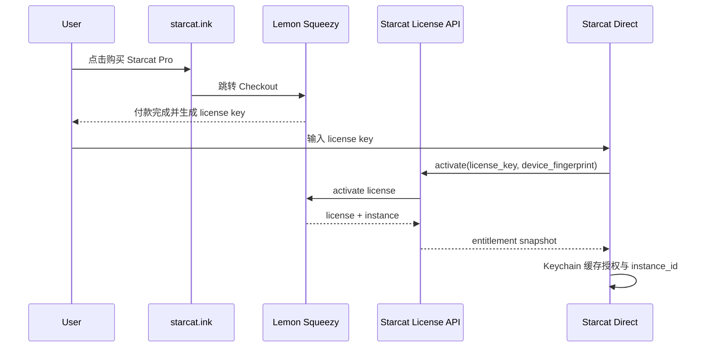

# Direct 分发与 Lemon Squeezy 授权方案

> 创建：2026-06-27
> 状态：**方案已拍板，客户端 / 后端尚未实现**
> 用途：官网 DMG 分发、Lemon Squeezy 支付、授权码激活与 Pro 权益接入的单一信任源
> 前置阅读：`docs/2-产品/需求讨论/正式方案/StoreKit订阅上架方案.md`、`docs/2-产品/需求讨论/正式方案/PRO 订阅功能划分.md`、`docs/6-发版与上架/SOP-发版流程.md`

---

## 1. 目标

Starcat 同时支持两种商业分发渠道：

| 渠道 | 分发方式 | 支付 / 授权 | App 内入口 |
|------|----------|-------------|------------|
| App Store | Mac App Store | StoreKit 2 / Apple IAP | 订阅、恢复购买、管理 Apple 订阅 |
| Direct | 官网下载 DMG | Lemon Squeezy / License Key | 输入授权码、激活、解绑、管理官网订阅 |

两种渠道都解锁 Starcat Pro，但购买、续费、退款、授权验证链路必须分离。

---

## 2. 核心决策

### 2.1 双渠道、单权益

业务功能只依赖统一权益结果，不感知用户从哪里购买：

```text
Pro 功能入口
  -> EntitlementGate
      -> AppStoreEntitlementProvider   # App Store build
      -> DirectEntitlementProvider     # Direct build
```

关键约束：

1. `EntitlementGate` 仍是 Pro 功能入口的统一门控。
2. StoreKit 与 Lemon Squeezy 只在权益 Provider 层分叉。
3. `AppSettings.isProUser` 仍只能作为 UI 镜像，不作为授权真相源。
4. App Store build 不包含 Lemon Squeezy 激活入口或外部购买引导。
5. Direct build 不显示 StoreKit 商品购买入口。

### 2.2 构建渠道显式化

新增构建渠道概念，建议命名：

```swift
enum DistributionChannel {
    case appStore
    case direct
}
```

渠道来源使用编译配置或 Info.plist 注入，不允许运行时自动猜测。原因是审核边界必须稳定，不能因为环境、bundle path 或 receipt 状态误判。

建议配置：

| 配置 | 值 |
|------|-----|
| App Store build | `STARCAT_DISTRIBUTION=appstore` |
| Direct build | `STARCAT_DISTRIBUTION=direct` |

### 2.3 App Store 合规边界

App Store 版必须保持干净：

- 不展示 Lemon Squeezy。
- 不展示 license key 激活入口。
- 不展示官网购买链接。
- 不写“官网购买更便宜”之类引导。
- 不允许用外部 license 解锁 App Store build 的 Pro。

Direct 版可以展示：

- Lemon Squeezy checkout / customer portal 链接。
- 授权码输入与激活。
- 设备解绑。
- 官网订阅管理说明。

---

## 3. Direct 支付与授权流程

### 3.1 购买流程



### 3.2 启动 / 恢复验证

Direct build 在以下时机验证 license：

1. App 启动后。
2. App 从后台回到前台。
3. 用户打开 Pro / License 设置页。
4. 本地缓存超过宽限期。

建议宽限策略：

| 状态 | 行为 |
|------|------|
| 最近 7 天内验证成功 | 离线继续视为 Pro |
| 超过 7 天未验证 | 进入“需要联网验证”状态，Pro 功能可被门控拦截 |
| Lemon Squeezy 返回 expired / disabled / refunded | 取消 Pro |
| 网络失败但仍在 7 天内 | 保持上次权益，不打扰用户 |

宽限期是产品策略，不是安全边界。真正的订阅状态仍以服务端和 Lemon Squeezy 为准。

---

## 4. 后端策略

### 4.1 推荐接 Starcat License API

不建议长期让客户端直接调用 Lemon Squeezy License API。Direct v1 建议增加一个轻量授权服务：

```text
POST /v1/licenses/activate
POST /v1/licenses/validate
POST /v1/licenses/deactivate
POST /v1/webhooks/lemonsqueezy
```

理由：

1. Lemon Squeezy API 细节不泄漏到客户端。
2. 后续换支付商不会影响 App。
3. 可以统一实现设备数限制、封禁、审计、缓存、客服补偿。
4. Webhook 可先写入 Starcat 自己的授权快照，App validate 时只读自家状态。

### 4.2 最小 API 契约

`activate` 请求：

```json
{
  "license_key": "XXXX-XXXX-XXXX-XXXX",
  "device_id": "hashed-device-id",
  "app_version": "1.0.0",
  "build": "123"
}
```

`activate` / `validate` 响应：

```json
{
  "is_pro": true,
  "license_status": "active",
  "subscription_status": "active",
  "expires_at": "2026-12-31T23:59:59Z",
  "instance_id": "lemon-instance-id",
  "plan": "pro_yearly",
  "features": ["pro"]
}
```

`deactivate` 请求：

```json
{
  "license_key": "XXXX-XXXX-XXXX-XXXX",
  "instance_id": "lemon-instance-id"
}
```

### 4.3 Webhook

后端接收 Lemon Squeezy webhook 后更新授权快照。首批关注事件：

| 事件类别 | 影响 |
|----------|------|
| subscription created / updated | 更新订阅状态、到期时间、plan |
| subscription cancelled / expired | validate 后取消 Pro |
| order refunded | 取消或冻结对应 license |
| license key disabled | 取消 Pro |

Webhook 必须校验签名，不能信任裸 payload。

---

## 5. 客户端落地边界

### 5.1 文件规划

建议新增 / 改造：

```text
Starcat/Core/Subscription/
  DistributionChannel.swift
  EntitlementProvider.swift
  StoreKitEntitlementProvider.swift
  DirectEntitlementProvider.swift
  DirectLicenseManager.swift
  DirectLicenseStore.swift
  DirectLicenseAPI.swift
```

设置页：

```text
App Store build:
  ProSettingsView
    - 当前订阅
    - 购买
    - 恢复购买
    - 管理 Apple 订阅

Direct build:
  LicenseSettingsView
    - 当前授权状态
    - 输入授权码
    - 激活
    - 解绑本设备
    - 打开官网订阅管理
```

### 5.2 本地存储

Direct build 本地只保存必要授权信息：

| 字段 | 存储 | 说明 |
|------|------|------|
| license key | Keychain | 用户授权码，敏感 |
| instance id | Keychain | Lemon Squeezy 设备实例 |
| entitlement snapshot | UserDefaults 或小 JSON | 非敏感 UI 缓存 |
| last validated at | UserDefaults 或小 JSON | 离线宽限判断 |
| expiration / status | UserDefaults 或小 JSON | UI 展示与门控快照 |

新增任何启动期 Keychain 访问，都必须继续遵守 `TestEnvironment.isRunning` 门控，避免 test host 弹系统授权窗。

### 5.3 设备标识

Direct 授权需要稳定但隐私克制的 device id：

- 不上传硬件序列号原文。
- 用安装期生成的随机 UUID 作为 device seed。
- seed 存 Keychain。
- 上传前做 hash，例如 `SHA256(seed + bundleID)`。

如果用户重装系统或清空 Keychain，视为新设备激活。

---

## 6. 分阶段实施计划

| Phase | 内容 | 产出 |
|-------|------|------|
| 0 | 本文档拍板 | 双渠道边界明确 |
| 1 | 构建渠道配置 | App Store / Direct build 可区分 |
| 2 | Entitlement Provider 抽象 | StoreKit 现有逻辑迁入 `StoreKitEntitlementProvider` |
| 3 | Lemon Squeezy 产品与 license 配置 | Pro 月订 / 年订 / license policy |
| 4 | Starcat License API | activate / validate / deactivate / webhook |
| 5 | Direct 客户端激活 UI | License 设置页 + Keychain 缓存 |
| 6 | Direct 打包发版 | Developer ID 签名、notarization、DMG |
| 7 | 验收 | 购买、激活、重启、过期、退款、解绑 |

---

## 7. 验收标准

### 7.1 App Store build

- [ ] App Store build 内无 Lemon Squeezy 文案、链接、授权码入口。
- [ ] Pro 购买 / 恢复 / 管理订阅仍走 StoreKit。
- [ ] Pro 功能门控继续复用 `EntitlementGate`。

### 7.2 Direct build

- [ ] Direct build 内无 StoreKit 商品购买入口。
- [ ] 输入有效 license key 后变为 Pro。
- [ ] 重启 App 后仍保持授权。
- [ ] 离线 7 天内保持上次 Pro 快照。
- [ ] license 过期 / 退款 / 禁用后 validate 取消 Pro。
- [ ] 解绑本设备后本机 Pro 失效。

### 7.3 分发

- [ ] Direct build 使用 Developer ID 签名。
- [ ] Direct DMG 完成 notarization 和 staple。
- [ ] `docs/6-发版与上架/SOP-发版流程.md` 补 Direct release 分支步骤。

---

## 8. 风险与缓解

| 风险 | 缓解 |
|------|------|
| App Store 审核认为绕过 IAP | App Store build 完全不出现 Direct 激活或外链购买 |
| license 被共享 | Lemon Squeezy instance + 自家 API 设备数限制 |
| Lemon Squeezy API 变更 | 客户端只依赖 Starcat License API |
| 退款后仍可离线使用 | 宽限期有限；validate / webhook 下次同步取消 |
| Keychain 弹窗影响测试 | 启动期 Keychain 路径继续用 `TestEnvironment.isRunning` 门控 |
| 客服补偿 / 手动赠送 | 后端保留 admin grant 或 allowlist 能力，客户端不硬编码 |

---

## 9. 变更日志

| 日期 | 变更 |
|------|------|
| 2026-06-27 | 初版：确认 App Store + Direct 双分发；App Store 走 StoreKit，Direct 走 Lemon Squeezy license；统一 `EntitlementGate`，构建产物隔离审核边界。 |

---

*维护者：dong4j + AI 协作者。Direct 分发后续实现以本文为准；与 `StoreKit订阅上架方案.md` 冲突时，按渠道拆分：App Store 以 StoreKit 文档为准，Direct 以本文为准。*
