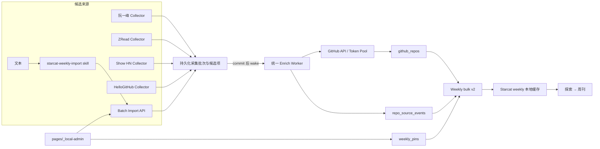
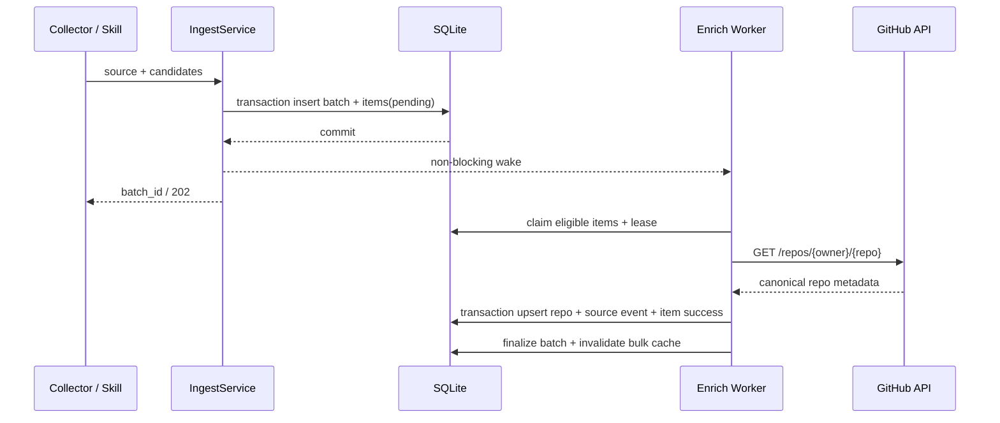

# Weekly 多来源扩展、AI 情报采集与置顶运营正式方案

> 日期：2026-07-15  
> 状态：最终方案，主体功能已实现，等待多轮专项审查收口  
> 单一信任源：本文  
> 范围：`supports/starcat-weekly-api`、Starcat「探索 → 周刊」、`pages/_local-admin`、repo-local `starcat-weekly-import` skill

## 0. 最终结论

1. **取消独立 `starcat-intelligence-api`。** AI 情报、HelloGitHub、阮一峰周刊、ZRead、Show HN 都属于「外部渠道发现 GitHub 仓库」；采集、GitHub 补全、聚合查询统一归 `starcat-weekly-api`。
2. **HelloGitHub 不再接入 Trending。** 它作为 Weekly 的新来源，用户在 Weekly 来源筛选中选择「HelloGitHub」。需要同时完成历史月刊回填与后续增量采集。
3. **AI 情报也是 Weekly 来源。** repo-local skill 把一批文本解析、搜索、核验成 `owner/repo`，通过 weekly-api 管理接口一次提交整批仓库；Starcat 不调用写接口，只读取成功公开的数据。
4. **来源不是任意字符串。** weekly-api 维护固定来源目录；人工录入接口只接受目录中 `manual_import_enabled=true` 的来源。首期仅 `ai_intelligence` 可由 skill 写入，HelloGitHub 只能由 crawler 写入。
5. **从“三源硬编码”重构成通用来源事件模型。** 现有 `weekly_extras / zread_events / discovery_submissions` 不能继续按每个新渠道加一张表、一组 DTO、一段 UI switch；统一迁移到 `repo_source_events`，列表返回通用 `source_entries`。
6. **所有 GitHub 补全统一异步化。** Collector 或管理 POST 先把候选项写入持久化队列，事务提交后用内存信号唤醒 Worker；Worker 启动时扫描一次，此后每 15 分钟兜底扫描，负责 GitHub enrich、失败重试、租约恢复和多次失败剔除。
7. **Weekly 支持多个全局置顶项目。** 置顶只改变符合当前筛选结果内的排序，不绕过来源、语言或仓库状态筛选；管理操作放到 `pages/_local-admin` 的 Weekly 专区，并通过 weekly-api 管理接口原子保存有序列表。
8. **weekly-api 名称暂不改。** 服务职责升级为「Starcat 编辑型 GitHub 发现源聚合服务」，但重命名会牵涉域名、Fly app、配置和客户端迁移，本期没有收益。

本文替代以下旧方向：

- `HelloGitHub → Trending 本地直连`；
- 独立 `starcat-intelligence-api`；
- AI 情报挂到「发现」分类；
- 每增加一个来源就新增一套来源表、snapshot 字段和客户端 enum case。

## 1. 当前代码基线与必须重构的原因

### 1.1 weekly-api 已经具备可复用能力

当前代码已存在：

- `github_repos` 统一仓库主表，以 `gh_repo_id` 为稳定身份；
- GitHub Token Pool、限流器和 `Enricher.EnsureGitHubRepo`；
- 阮一峰、ZRead、Show HN 三条采集链路；
- `/api/v1/repos`、详情、语言 facet 与 `/api/v1/repos/bulk`；
- `ADMIN_API_KEYS` 管理鉴权；
- scheduler、防重锁与 bulk cache 主动失效。

因此 AI 情报若再建独立服务，会重复数据库、GitHub Token Pool、enricher、bulk、配置、部署和 Starcat 缓存链路。

### 1.2 当前“三源模型”不能继续横向复制

现有实现把来源写死在多个位置：

- 后端常量只有 `weekly / zread / discovery`；
- `hasAnySourceSQL()` 与 `recomputeAggregateTx()` 显式查询三张表；
- `RepoFeedItem` 固定带 `weekly / zread / discovery` 三个 snapshot；
- Starcat `WeeklySourceFilter` 是固定 `CaseIterable enum`；
- 详情 URL、短标签、图标和本地缓存各自 switch 三个来源；
- `weekly_bulk_repos` 固定保存三个 snapshot JSON 字段。

继续为 HelloGitHub、AI 情报复制第四、第五套分支，会让每个新来源都必须改数据库查询、API DTO、Swift DTO、缓存 schema、筛选和详情逻辑。最终方案必须先修正这个扩展边界。

## 2. 统一术语与固定来源目录

### 2.1 术语

| 术语 | 含义 |
|---|---|
| 来源 `source` | 仓库被 Starcat Weekly 收录的外部渠道，也是 Weekly 的用户可选分类 |
| 来源代码 `source_code` | API 与数据库使用的稳定英文键，不随 UI 文案变化 |
| Collector | 从外部站点/API 获取候选 `owner/repo` 的适配器 |
| 人工录入 | 由 skill 或管理工具调用 API 批量提交候选仓库 |
| 来源事件 | 某仓库在某来源被收录的一次事实，包含时间、来源 URL、标题、摘要等 |
| GitHub enrich | 用 GitHub API 把 `owner/repo` 补全为可信 `gh_repo_id` 和仓库元数据 |
| 置顶 | Weekly 全局编辑排序；只作用于已经通过当前筛选的仓库 |

产品文案可以使用「来源」或「分类」，但后端契约统一使用 `source_code`，不再增加含义重叠的自由 `type/category/channel` 字段。

### 2.2 首期来源目录

| `source_code` | 中文名 | 录入方式 | 可由 skill 写入 | 图标 key | 默认顺序 |
|---|---|---|---:|---|---:|
| `weekly` | 阮一峰周刊 | crawler | 否 | `ruanyf` | 10 |
| `zread` | ZRead | crawler | 否 | `zread` | 20 |
| `discovery` | Hacker News | crawler | 否 | `hackernews` | 30 |
| `hellogithub` | HelloGitHub | crawler + 历史回填 | 否 | `hellogithub` | 40 |
| `ai_intelligence` | AI 情报 | admin batch API | 是 | `ai-intelligence` | 50 |

来源目录由 weekly-api 代码和 schema migration 共同维护，不能通过普通管理 POST 新建来源。新增来源必须同时完成：

1. weekly-api 来源定义与采集方式；
2. Starcat 来源文案、图标和筛选验证；
3. local-admin 运维入口；
4. 测试与发布说明；
5. 最后才把来源改为 `enabled=true`；若需要人工录入，再显式开启 `manual_import_enabled`。

这样可以保证 skill 永远只能写入 Starcat 已经实现的分类。

## 3. 总体架构



职责边界：

| 组件 | 负责 | 不负责 |
|---|---|---|
| Collector | 拉取来源、解析 `owner/repo`、生成来源事实 | 直接写公开仓库、同步等待 GitHub enrich |
| skill | 理解文本、搜索、核验、选择允许的来源、整批提交 | 自由创建分类、直接改数据库、伪造未确认仓库 |
| weekly-api | 队列、GitHub enrich、来源事件、重试、置顶、公开 bulk | 理解任意自然语言 |
| Starcat | 缓存、来源筛选、排序、列表和详情 | 调用管理写接口、展示失败队列 |
| local-admin | 观察同步、触发回填、查看批次、管理置顶 | 充当公网控制台或保存生产密钥到仓库 |

## 4. weekly-api 后端改造

### 4.1 模块结构

```text
supports/starcat-weekly-api/internal/
├── source/
│   ├── catalog.go          # 固定来源目录与能力校验
│   ├── collector.go        # Collector 接口
│   └── hellogithub.go      # HelloGitHub 增量 + 历史回填
├── ingest/
│   ├── service.go          # 批次/候选入队
│   ├── worker.go           # claim/enrich/retry/discard
│   └── wake.go             # 容量 1 的非阻塞唤醒信号
├── handler/
│   ├── imports.go          # 人工批量录入与批次状态
│   ├── sources.go          # 来源目录、同步与状态
│   └── pins.go             # 搜索与置顶管理
└── store/
    ├── migrations.go       # weekly-api schema 版本迁移
    └── sqlite.go
```

现有 `enricher`、`github`、`tokenpool`、`middleware`、`BulkCache` 继续复用。`discovery`、`spider` 和 weekly parser 逐步改成 Collector 实现，不保留第二条直接 enrich 写入路径。

### 4.2 数据库目标模型

#### `source_catalog`

| 字段 | 说明 |
|---|---|
| `code` | 稳定 `source_code` 主键 |
| `display_name_zh / display_name_en` | UI 文案 |
| `icon_key` | Starcat 本地图标映射键 |
| `ingest_mode` | `crawler / manual` |
| `sort_order` | 来源筛选顺序 |
| `enabled` | 是否进入公开 feed |
| `manual_import_enabled` | 是否允许管理批量录入 |

表由 migration 按代码目录同步，管理 API 只读，禁止任意插入来源。

#### `github_repos`

继续作为唯一仓库主表，`gh_repo_id` 为主键。保留 GitHub 元数据、`enriched_at`、`is_available`。`source_types_json / first_event_at / latest_event_at` 若保留，只是由来源事件重建的查询缓存，不能作为事实真源。

#### `repo_source_events`

| 字段 | 说明 |
|---|---|
| `id` | 自增主键 |
| `source_code` | 外键到固定来源目录 |
| `external_key` | 来源内稳定幂等键 |
| `gh_repo_id` | 关联仓库 |
| `occurred_at` | 来源事实发生时间 |
| `source_url` | 周刊、HN、HelloGitHub 或原始情报链接 |
| `title` | 来源标题，可空 |
| `summary` | 来源推荐语/摘要，可空 |
| `rank` | 来源内排名，可空 |
| `payload_json` | 少量来源专属字段；只用于详情，不参与通用筛选 |
| `created_at / updated_at` | 写入时间 |

约束：`UNIQUE(source_code, external_key)`；索引至少覆盖 `(source_code, occurred_at DESC)` 与 `(gh_repo_id, occurred_at DESC)`。

列表所需的来源集合与最新代表事件统一从该表聚合，不再为新来源增加专属 snapshot 列。

#### `ingest_batches`

| 字段 | 说明 |
|---|---|
| `id` | ULID/UUID 主键 |
| `source_code` | 固定来源 |
| `kind` | `collector / manual_import / backfill` |
| `idempotency_key` | 管理请求或同步任务幂等键 |
| `status` | `pending / processing / success / partial_success / failed` |
| `cursor_json` | 回填进度，例如 HelloGitHub volume |
| `total/success/discarded` | 汇总 |
| `created_at / started_at / finished_at` | 生命周期 |

#### `ingest_items`

| 字段 | 说明 |
|---|---|
| `id / batch_id` | 候选项和所属批次 |
| `owner / repo / normalized_full_name` | 原始输入与去重键 |
| `external_key` | 最终来源事件幂等键 |
| `occurred_at / source_url / title / summary / rank` | 等待落来源事件的数据 |
| `payload_json` | 来源专属字段 |
| `status` | `pending / processing / retrying / success / discarded` |
| `attempts / next_attempt_at` | 重试控制 |
| `lease_owner / lease_expires_at` | Worker 租约 |
| `gh_repo_id` | 成功后回填 |
| `last_error_code / last_error_message` | 失败证据 |
| `created_at / updated_at / finished_at` | 生命周期 |

约束：`UNIQUE(batch_id, normalized_full_name, external_key)`。

#### `weekly_pins`

| 字段 | 说明 |
|---|---|
| `gh_repo_id` | 主键，必须是公开可用仓库 |
| `position` | 从 1 开始的人工顺序，唯一 |
| `pinned_at / updated_at` | 操作时间 |

置顶是 Weekly 全局编辑状态，不属于任何来源事件；同一仓库即使拥有多个来源也只置顶一次。

### 4.3 现有三源数据迁移

weekly-api 已有线上数据，禁止要求删库。实现时新增版本迁移：

1. 创建 `source_catalog / repo_source_events / ingest_batches / ingest_items / weekly_pins`；
2. 注册 5 个固定来源，其中新来源先 `enabled=false`；
3. 把 `weekly_extras` 转为 `source_code=weekly` 的事件；
4. 把 `zread_events` 转为 `source_code=zread` 的事件；
5. 把 `discovery_submissions` 转为 `source_code=discovery` 的事件；
6. 校验每个旧来源的 distinct repo 数和事件数；
7. 从新事件表重建 `source_types_json / first_event_at / latest_event_at`；
8. 代码只读写新模型，旧表停止写入；确认一个发布周期后追加迁移删除旧表。

过渡期只有一个真源 `repo_source_events`；旧表只作为回滚证据，不允许双写。旧接口字段可以由新模型只读派生一个兼容窗口，但不能保留两套存储状态机。

### 4.4 统一入队与 Worker

所有 Collector 和人工录入最终都调用同一个 `IngestService.EnqueueBatch`：



硬性约束：

- POST/Collector 入队事务内不调用 GitHub；
- 只有 transaction commit 成功后才发送唤醒信号；
- wake channel 容量为 1，使用非阻塞发送；连续提交只需保证 Worker 至少醒一次；
- Worker 启动时立即扫描一次，此后每 15 分钟兜底扫描；
- 被唤醒后持续 drain，直到没有当前可领取任务；
- 领取任务只在短事务中写租约，GitHub 网络请求必须在事务外；
- `processing` 租约默认 30 分钟，超时后恢复为可领取；
- 一个候选失败不能回滚同批其他候选；
- 批次进入终态时失效 bulk cache；大量回填按批次节流，禁止每条重建一次 bulk。

### 4.5 GitHub API 调用与去重

Worker 领取任务后按以下顺序处理：

1. 用 `normalized_full_name` 查 `github_repos`；
2. 若已有仓库且 `enriched_at` 在 24 小时内，跳过 GitHub 请求，直接写来源事件；
3. 否则调用 `GET /repos/{owner}/{repo}`，统一走现有 Token Pool 与限流器；
4. 用 GitHub 返回的 canonical owner/name 和 `gh_repo_id` upsert 主表；
5. 在同一个短事务中 upsert 来源事件、更新 item 和批次汇总；
6. 同一仓库被多个来源收录时主表仍只有一行，`source_entries` 聚合多个来源。

首期不额外拉 Releases、README 或 AI 摘要，避免把本需求扩大成新的详情数据平台。Starcat 详情继续使用现有 README 与本地能力链路。

### 4.6 失败重试与剔除

| 失败类型 | 处理 |
|---|---|
| GitHub `404 / 422` | 永久错误，直接 `discarded` |
| GitHub `401` | 当前 token 失效，Token Pool 尝试其他 token；全部失败后重试 |
| GitHub `403 / 429` | 读取 `Retry-After / X-RateLimit-*`，进入 `retrying` |
| GitHub `5xx`、超时、网络失败 | 进入 `retrying` |
| SQLite 写入失败 | 不标成功，租约超时后恢复 |
| 来源解析不出 owner/repo | Collector 记录 `discarded`，不进入 GitHub enrich |

最多执行 3 次 enrich：第一次失败后等待至少 15 分钟，第二次失败后至少 30 分钟，第三次仍失败则 `discarded`。剔除只表示不再进入工作队列；失败记录必须保留，供 skill、local-admin 和运维诊断查看。

### 4.7 公开 bulk v2 契约

保留 `/api/v1/repos/bulk`，升级 `schema_version`，新增来源目录、通用来源条目和置顶字段：

```json
{
  "schema_version": 2,
  "data": {
    "sources": [
      {
        "code": "hellogithub",
        "display_name_zh": "HelloGitHub",
        "display_name_en": "HelloGitHub",
        "icon_key": "hellogithub",
        "sort_order": 40,
        "count": 1200
      },
      {
        "code": "ai_intelligence",
        "display_name_zh": "AI 情报",
        "display_name_en": "AI Intelligence",
        "icon_key": "ai-intelligence",
        "sort_order": 50,
        "count": 42
      }
    ],
    "repos": [
      {
        "gh_repo_id": 123,
        "full_name": "owner/repo",
        "owner": "owner",
        "repo": "repo",
        "source_types": ["hellogithub", "ai_intelligence"],
        "first_event_at": "2026-06-29T00:00:00Z",
        "latest_event_at": "2026-07-15T12:00:00Z",
        "source_entries": [
          {
            "source_code": "ai_intelligence",
            "occurred_at": "2026-07-15T12:00:00Z",
            "source_url": "https://example.com/news/1",
            "title": "项目标题",
            "summary": "来源摘要",
            "rank": null
          }
        ],
        "is_pinned": true,
        "pin_position": 1
      }
    ],
    "languages": []
  },
  "meta": {
    "total": 1,
    "generated_at": "2026-07-15T12:01:00Z"
  }
}
```

说明：

- 共享 `StarcatRepoCardDTO` 仍只承载 GitHub 仓库字段；`source_entries / is_pinned / pin_position` 属于 Weekly feed DTO；
- `sources` 只包含 `enabled=true` 且当前存在公开数据的来源；
- `source_entries` 默认每个来源只返回最新代表事件，完整历史仍由详情接口返回；
- bulk 继续支持 gzip、ETag 和内存缓存；内容变化或置顶变化必须主动失效；
- 分页 `/api/v1/repos` 与 bulk 使用同一通用查询和排序规则。

### 4.8 管理接口

所有写接口使用 `ADMIN_API_KEYS`：

```text
GET  /internal/sources?manual_import=true
POST /internal/sources/{source_code}/sync
GET  /internal/ingest-batches/{batch_id}

POST /internal/imports
GET  /internal/imports/{batch_id}

GET  /internal/repos/search?q=&limit=
GET  /internal/pins
POST /internal/pins
```

`POST /internal/pins` 原子替换完整有序列表，避免多个“上移/下移”请求中途失败：

```json
{
  "gh_repo_ids": [123, 456, 789]
}
```

服务端验证 ID 存在、公开可用、无重复，并在一个 transaction 中重写 `position=1...N`。空数组表示取消全部置顶。

## 5. HelloGitHub 数据源

### 5.1 数据策略

HelloGitHub 官方月刊页面按期号长期存在，并直接链接 GitHub 仓库；当前官网也提供 featured API。为同时满足历史回填和后续增量：

1. **历史真源**：按 `https://hellogithub.com/periodical/volume/{volume}` 回填月刊，解析页面中的 GitHub 仓库链接、发布日期、语言分组、标题与推荐语；
2. **日常增量**：每天拉取 `https://abroad.hellogithub.com/v1/?sort_by=featured&page={page}&rank_by=newest&tid=all` 的最近分页，快速发现新增项目；
3. **月刊对账**：每月检查最新 periodical volume，把 API 未覆盖或字段发生变化的项目补齐；
4. 两条采集路径最终都转换成通用候选项，由同一个 Worker enrich，不能直接写 `github_repos`。

官方月刊页面已公开完整期号和 GitHub 项目链接；例如 [HelloGitHub 月刊第 123 期](https://hellogithub.com/periodical/volume/123)。官网前端源码也公开在 [HelloGitHub-Team/geese](https://github.com/HelloGitHub-Team/geese)。

### 5.2 历史回填

`POST /internal/sources/hellogithub/sync`：

```json
{
  "mode": "backfill",
  "from_volume": 1,
  "to_volume": null
}
```

- `to_volume=null` 时自动探测当前最新期号，不在代码中硬编码；
- Handler 只创建持久化 backfill batch 并返回 `202 Accepted`；
- Worker 按 volume 递增处理，每完成一期更新 `cursor_json`；
- 服务重启后从最后成功期号继续；
- 每期解析完成立即入队候选，不把全部历史攒在内存；
- `external_key` 使用稳定的 `volume:{n}:{normalized_full_name}`；
- 同一仓库跨来源或跨入口重复出现时，主表去重但来源事实保留；
- 某一期页面失败进入重试，不阻断已完成期号；超过 3 次标记该期失败并在 local-admin 暴露。

### 5.3 增量调度

- featured API：每天一次，与现有 ZRead/Show HN cron 错峰；
- periodical reconcile：每月 29 日执行一次，并允许管理端手动触发；
- 空结果不覆盖已有来源事件；
- 响应结构或 HTML 解析断言失效时整批失败并告警，禁止把“解析到 0 条”当成功；
- 保存 `source_url` 指向 HelloGitHub 项目详情或对应月刊页，Starcat 详情可直接跳转原文。

### 5.4 来源字段映射

| HelloGitHub 数据 | 通用事件字段 |
|---|---|
| `item_id` 或 volume + repo | `external_key` |
| GitHub URL / `full_name` | `owner / repo` |
| 月刊发布日期 / `updated_at` | `occurred_at` |
| 项目详情或月刊页 | `source_url` |
| `title` / `title_en` | `title` |
| `summary` / `summary_en` | `summary` |
| 月刊内序号 | `rank` |
| volume、语言分组、`is_hot` | `payload_json` |

GitHub stars、forks、owner avatar 等字段必须以 GitHub API enrich 结果为准，不能把 HelloGitHub 的缓存值写进 `github_repos`。

## 6. AI 文本解析与批量录入

### 6.1 Batch API

```http
POST /internal/imports
Authorization: Bearer <admin-api-key>
Content-Type: application/json
```

```json
{
  "source_code": "ai_intelligence",
  "idempotency_key": "20260715-7f0a...",
  "repositories": [
    {
      "owner": "Zackriya-Solutions",
      "repo": "meetily",
      "title": "Meetily - 本地优先的 AI 会议助手",
      "source_url": "https://example.com/article"
    },
    {
      "owner": "iOfficeAI",
      "repo": "OfficeCLI"
    }
  ]
}
```

约束：

- 一次提交列表，首期每批最多 200 个仓库；
- `source_code` 必须存在、启用且允许 manual import；首期只有 `ai_intelligence`；
- 接口只接受 `owner` 和 `repo`，不接受把完整 URL 塞进字段；
- `title / source_url` 可选，只作为来源事件上下文，不影响 GitHub 身份判断；
- 批内按小写 `owner/repo` 去重；
- `idempotency_key` 全局唯一；网络超时后重放返回原批次；
- transaction 只写 batch/items，commit 后唤醒 Worker，返回 `202 Accepted`；
- 不在 POST 中调用 GitHub API，不因为一项失败回滚整批。

响应：

```json
{
  "schema_version": 1,
  "data": {
    "batch_id": "019f...",
    "source_code": "ai_intelligence",
    "status": "pending",
    "total": 2,
    "duplicate_count": 0,
    "created_at": "2026-07-15T12:30:00Z"
  }
}
```

### 6.2 `starcat-weekly-import` skill

规划为 repo-local 中文 skill：

```text
.claude/skills/starcat-weekly-import/
├── SKILL.md
├── agents/openai.yaml
├── references/api.md
└── scripts/submit_batch.py
```

遵循 skill 约束：

- `SKILL.md` frontmatter 只保留 `name` 与清晰的 `description`；
- 正文与 `references/` 使用中文，命令、路径、JSON key、错误码保持原文；
- 不创建 README、安装指南或变更日志；
- API 细节放 `references/api.md`，避免 SKILL.md 膨胀；
- 提交脚本负责 JSON schema、幂等键、Bearer header、批量 POST 与状态查询；
- 实现时用 `skill-creator/scripts/init_skill.py` 初始化，并用 `quick_validate.py` 校验。

工作流：

1. 接收一整批文本，按编号、换行、标题和已有 GitHub URL 拆分；
2. 直接提取明确的 GitHub URL 或 `owner/repo`；
3. 对没有地址的项目联网搜索，优先官方 GitHub 组织、产品页、论文或公告；
4. 打开候选仓库核验项目名、主体、description/README/topics，排除用户主页、issue、release、topic、镜像和无关同名仓库；
5. 无法确认的条目标记“未找到”，不得猜测提交；
6. 批内按规范化 `owner/repo` 去重；
7. 调用 `GET /internal/sources?manual_import=true` 获取允许分类；
8. 用户文本明确属于 AI 情报时选择 `ai_intelligence`；否则只能从返回列表中选择，不能自由生成；
9. 先向用户展示“已确认 / 未确认 / 将提交来源”的摘要；
10. 经用户确认后一次性调用提交脚本；
11. 返回 `batch_id` 与受理结果，可按需查询批次状态。

环境变量：

```text
STARCAT_WEEKLY_API_BASE_URL
STARCAT_WEEKLY_ADMIN_API_KEY
```

Skill 不把密钥写入仓库、日志或最终 Markdown。

## 7. Starcat 客户端改造

### 7.1 产品位置

```text
探索
├── 发现
├── 趋势
├── 热门
├── 新发布
└── 周刊
    └── 来源筛选
        ├── 全部来源
        ├── 阮一峰周刊
        ├── ZRead
        ├── Hacker News
        ├── HelloGitHub
        └── AI 情报
```

AI 情报和 HelloGitHub 都属于 Weekly 来源，不新增 Explore 一级模式，也不再挂到 Discovery topic。原 Show HN 也继续作为 Weekly 的 Hacker News 来源，不再另做 Activity 客户端分类。

### 7.2 来源模型重构

把固定 enum 改为稳定 raw-value 模型：

```swift
struct WeeklySource: RawRepresentable, Codable, Hashable, Sendable {
    let rawValue: String
}

enum WeeklySourceSelection: Hashable, Sendable {
    case all
    case source(WeeklySource)
}
```

来源展示信息由 bulk 的 `sources` 驱动，客户端保留本地 fallback：

```swift
struct WeeklySourceDescriptor: Codable, Hashable, Identifiable, Sendable {
    let code: WeeklySource
    let displayNameZh: String
    let displayNameEn: String
    let iconKey: String
    let sortOrder: Int
    let count: Int
}
```

- `WeeklySourceFilter.allCases` 改为 `viewModel.sourceFilters`；已知来源优先使用本地 i18n，未知来源再用服务端中英文名兜底；
- 未知来源仍能解码和出现在「全部来源」，使用通用 fallback 图标；
- 新来源只有完成本地图标/文案和测试后才在服务端启用；
- `WeeklySource.displayName/assetName` 的 switch 迁到独立 presentation resolver，不让 wire 模型承担 UI 逻辑。

### 7.3 通用来源条目

`WeeklyFeedRepoDTO / WeeklyFeedItem` 新增：

```swift
let sourceEntries: [WeeklySourceEntry]
let isPinned: Bool
let pinPosition: Int?
```

并逐步移除 `weekly / zread / discovery` 三个固定 snapshot：

- 列表短标签取最新或当前筛选来源的 `sourceEntry`；
- 详情 header 图标和链接直接读取 entry 的 `sourceCode / sourceURL`；
- 详情事件时间线渲染通用 `title / summary / rank / occurredAt`；
- 少量来源专属 `payload` 只在对应 presentation 中增强，不影响通用渲染；
- 不再为 HelloGitHub、AI 情报新增平行的 DTO 字段和 `sourceURL` switch。

### 7.4 来源图标

继续使用 `Assets.xcassets/WeeklySources`：

- HelloGitHub：加入经许可的官方标识资源，asset key 为 `WeeklySources/hellogithub`；若许可或素材不明确，首版使用本地绘制的通用来源图标，不抓取远程图片；
- AI 情报：使用 SF Symbol `sparkles` 或自有矢量资产，asset key resolver 为 `ai-intelligence`；
- Hacker News、阮一峰、ZRead 保持现有资源；
- 外部 logo 若随 App bundle 分发，实施时按 `AboutDependency.all` 规则核对版权与许可；运行时数据来源说明不伪装成开源依赖。

### 7.5 本地缓存与数据库迁移

现有 Weekly bulk 缓存继续复用，不另建 AI 情报缓存：

- `weekly_bulk_repos` 追加 `source_entries_json / is_pinned / pin_position`；
- `weekly_bulk_sources` 新表保存来源目录、数量与顺序；
- `weekly_bulk_meta / weekly_bulk_languages` 保留；
- 旧三个 snapshot JSON 字段通过迁移或 decode fallback 转成通用 entries，稳定后再追加迁移删除；
- 必须使用实现时下一个可用的 `registerVN`，禁止修改已发布 migration 或要求用户删库；
- `WeeklyBulkRepository.cachedPage` 在 SQLite 中先应用来源、语言、覆盖强度和状态筛选，再按置顶规则排序。

### 7.6 置顶排序语义

排序优先级固定为：

1. 当前筛选条件；
2. `is_pinned DESC`；
3. `pin_position ASC`；
4. 用户选择的 Weekly 排序；
5. `gh_repo_id DESC` 稳定兜底。

因此：

- 选择「AI 情报」时，只会置顶同时属于 AI 情报的置顶仓库；
- 选择某语言时，不属于该语言的置顶仓库不会强行出现；
- 多来源仓库只显示一行；
- 所有排序模式都保留置顶在前，编辑置顶高于普通 Stars/更新时间排序；
- 取消全部置顶后完全恢复原排序。

本地 sorter 与 SQL `ORDER BY` 必须共享同一套比较语义，并补对应测试，避免 remote/local 切换后顺序跳变。

### 7.7 UI 与 i18n

- 继续使用现有 Weekly filter popover，在「来源」区动态展示来源及 count；
- HelloGitHub 与 AI 情报不新增独立 Tab，避免来源数增加后横向拥挤；
- 列表来源 badge 复用现有小圆图标设计；置顶项目增加克制的 `pin.fill` 标记，不另起大卡片区域；
- 新文案全部进入 `Localizable.xcstrings`，至少覆盖简体中文与英文；
- 文本/图标只使用 `.primary / .secondary`；若使用 `.buttonStyle(.plain)` 必须 `.focusEffectDisabled()`；
- 列表、详情继续复用 `UnifiedRepoRow / RepoDetailScaffold / WeeklyDetailScaffoldShell / StarredRegistry`。

## 8. `pages/_local-admin` 改造

### 8.1 Weekly 专用运营区

在现有 Weekly 服务卡片内增加三个专用面板，而不是只往通用 API Console 塞 endpoint：

1. **来源状态**
   - 每个来源的公开 repo 数；
   - 最近成功/失败时间；
   - 当前 batch、pending、retrying、discarded 数；
   - HelloGitHub backfill 当前 volume 与总进度。
2. **HelloGitHub 同步**
   - 触发增量；
   - 触发历史回填；
   - 输入起始/结束 volume；
   - 展示 `batch_id` 并轮询状态；
   - 危险操作继续二次确认。
3. **Weekly 置顶管理**
   - 搜索 `full_name`；
   - 将结果加入置顶列表；
   - 使用上移/下移调整顺序，避免引入拖拽库；
   - 移除单项或清空；
   - 点击保存时一次 POST 完整有序 ID 列表；
   - 保存成功后刷新 bulk cache 状态和预览顺序。

### 8.2 现有基础设施复用

- 继续从本地 `config.js` 读取 Weekly `baseURL / apiKey / adminKey`；
- 浏览器直接调用 weekly-api，密钥不经过公网 pages；
- weekly-api 现有 CORS 已允许 `GET / POST / OPTIONS`，置顶采用 POST 原子替换，不需要扩展为 PUT/DELETE；
- `server.mjs` 无需新增业务代理，只继续负责静态页面、Fly API 和本地 env；
- 通用 API Console 同步追加来源目录、批量录入、批次查询、同步和置顶 endpoint，便于原始 JSON 调试。

## 9. 安全、缓存与兼容性

### 9.1 鉴权

- `/api/v1/*` 继续使用普通 `API_KEYS`；
- `/internal/imports`、来源同步、批次状态、搜索和置顶全部使用 `ADMIN_API_KEYS`；
- 普通客户端 Key 不能触发任何写入或 GitHub 配额消耗；
- skill 和 local-admin 不在输出中展示完整 Key。

### 9.2 缓存失效

以下操作必须失效 Weekly bulk cache：

- 新来源事件成功公开；
- GitHub repo availability 改变；
- 来源启用/禁用；
- 置顶列表改变；
- 重建聚合完成。

大量历史回填按批次或固定条数合并失效，避免每条重建 payload。ETag 必须基于内容版本，不能只用请求时间。

### 9.3 API 兼容窗口

- bulk 升级 `schema_version=2`，新字段全部 additive；
- 旧 `weekly / zread / discovery` snapshot 可从通用事件只读派生一个客户端发布窗口，禁止双写旧表；
- Starcat 新版切到 `source_entries` 后，旧字段标记 deprecated；
- 后续移除旧字段和旧表必须追加迁移并同步更新 schema 版本与测试。

## 10. 实施顺序

### 阶段 A：weekly-api 通用底座

1. 加 schema migration、固定来源目录、通用事件表、批次/任务表和置顶表；
2. 回填三源历史事实并校验计数；
3. 落地统一 `IngestService + Worker`；
4. 把 weekly、zread、discovery Collector 切到统一入队；
5. 提供 bulk v2、管理接口和缓存失效；
6. 完成 store/handler/worker/scheduler 测试。

### 阶段 B：HelloGitHub 与 AI 情报录入

1. 实现 HelloGitHub featured 增量 Collector；
2. 实现 periodical 历史回填、checkpoint 和恢复；
3. 实现 batch import 与状态查询；
4. 创建 `starcat-weekly-import` skill 和提交脚本；
5. 验证主动唤醒、15 分钟扫描、3 次重试和 discarded。

### 阶段 C：Starcat

1. 来源 raw-value 化与动态来源目录；
2. 通用 `source_entries`、详情来源时间线和图标 resolver；
3. 下一可用数据库 migration 与 WeeklyBulkRepository；
4. 来源筛选、HelloGitHub/AI 情报图标、置顶排序和 i18n；
5. DTO、缓存、排序、筛选、详情和未知来源测试。

### 阶段 D：local-admin 与历史回填

1. Weekly 来源状态与批次监控；
2. HelloGitHub 增量/回填控制；
3. 置顶搜索、排序、保存；
4. 先在测试环境跑完整历史回填并核对数量；
5. 部署 weekly-api，再发布 Starcat；来源启用顺序为 `hellogithub` 后 `ai_intelligence`；
6. 生产回填使用持久化 cursor，可暂停和恢复，不执行删库重建。

## 11. 测试与验收

### 11.1 weekly-api

- 旧三源迁移前后 distinct repo 数与事件数一致；
- 同一 `gh_repo_id` 被 5 个来源收录时 bulk 只返回一条 repo；
- 任意未知或禁用 `source_code` 的人工 POST 返回 `400`；
- `hellogithub` 即使存在于目录，也因 `manual_import_enabled=false` 拒绝 skill 写入；
- import POST 在 GitHub 不可达时仍快速返回 `202` 且任务已持久化；
- commit 失败不发送 wake；wake 丢失后 15 分钟扫描仍能恢复；
- Worker 重启恢复过期 lease；永久错误直接剔除，瞬时错误最多 3 次；
- HelloGitHub backfill 可从中断 volume 继续且不会重复事件；
- 置顶原子替换、重复 ID、不可用 repo、清空列表均有测试；
- source/filter/pin 排序与 bulk/分页一致；
- `go test ./...`、`go test -race ./...`、`go vet ./...`、`go build ./...` 通过。

### 11.2 Starcat

- bulk v1 兼容解码，bulk v2 完整解码；
- 未知来源不导致整批失败；
- 来源列表按后端顺序与 count 展示；
- HelloGitHub、AI 情报筛选准确；
- 多来源覆盖强度仍按 distinct source 计算；
- pin 在所有排序模式优先，但不绕过来源/语言/状态筛选；
- remote 与本地缓存排序一致；
- 详情来源链接打开正确原文；
- 离线时旧 bulk 仍可展示；
- 全部新增文案完成中英文校验。

### 11.3 local-admin 与 skill

- local-admin 不配置 adminKey 时所有写操作明确失败；
- 回填进度在刷新页面后可从服务端恢复；
- 置顶保存后 Starcat 下一次刷新顺序一致；
- skill 能处理用户示例中的直接 URL、`owner/repo` 和无 URL 新闻；
- 无法确认的项目不会提交；
- skill 一次提交整批，重放同一幂等键不重复；
- skill 不能提交服务端未开放的分类。

## 12. 明确不做

- 不新建 `starcat-intelligence-api`；
- 不把 HelloGitHub 混入 Trending；
- 不把 AI 情报挂到 Discovery topic；
- 不允许 skill 创建任意分类；
- 不让 Starcat 直接调用 GitHub 补 weekly 列表字段；
- 不在管理 POST 中同步调用 GitHub；
- 不为每个新来源新增一张专属表和一个固定 snapshot 字段；
- 不建设公网后台，本期只扩展本地 `_local-admin`；
- 不在本需求中加入 LLM 自动分类、README 抓取、Release 补全或内容推荐算法。

---

*最终方案确认后，实施以本文为单一信任源；`21-weekly-api-后端3源聚合改造.md`、`22-weekly-客户端3源聚合对接.md` 和 `25-Show-HN发现源设计.md` 仅保留历史背景。*
