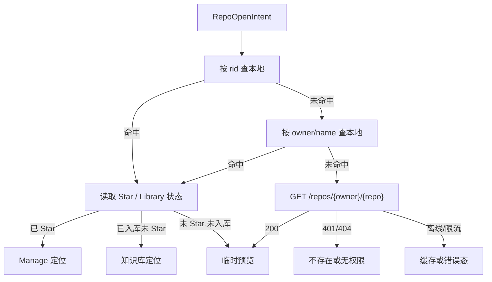

# 仓库分享链接与 OG 预览正式方案

> 日期: 2026-07-21
> 状态: 核心代码已实现,待生产部署与人工验收
> 范围: Starcat 仓库分享链接、Open Graph 图片卡片、Universal Link、未 Star 仓库临时预览
> 不包含: 私有仓库分享、AI `/s/{id}` 视觉升级、匿名访问统计；本轮不更新 `docs/功能实现总览.md`

## 1. 方案结论

Starcat 新增一类面向用户分享的「仓库链接」:

```text
https://starcat.ink/r/{owner}/{repo}?v=1&rid={github_repo_id}
```

同一条链接同时承担四个职责:

1. 在支持 Open Graph 的聊天或社交平台中展示仓库图片卡片。
2. 接收方已安装 Starcat 时,通过 Universal Link 打开 App 并定位仓库。
3. 接收方未安装 Starcat 时,打开可用的仓库落地页。
4. 接收方没有 Star 或没有加入知识库时,打开只读临时预览,不自动写入本地数据。

基础仓库链接是免费、即时、无 AI 依赖的能力。现有 Pro「AI 分享页」继续保留,两者使用统一视觉语言,但不混用产品语义、权益判断和后端数据模型。

## 2. 背景与现状

当前 Starcat 已具备部分可复用能力,但还没有完整的仓库分享链路:

- `Starcat/App/StarcatApp.swift` 已统一接收 URL,但当前只明确区分 Direct License,其余 URL 都交给 OAuth callback。
- `project.yml` 已注册 `starcat` URL Scheme,尚未配置 Associated Domains。
- `Starcat/Core/Network/GitHubAPI/RepoAPI.swift` 已封装 `GET /repos/{owner}/{repo}`,公开仓库支持匿名获取。
- `Starcat/Features/Search/GitHubRepositorySearchProvider.swift` 已能构造 `isStarred = false`、不落库的临时 `Repo`。
- `Starcat/Features/Home/HomeView.swift` 已有本地仓库的外部导航、分页加载和选中链路。
- `Starcat/Core/Sync/RepoResolver.swift` 已有本地、远端、最小数据的仓库解析思路。
- `Starcat/Features/Home/RepoListView.swift` 当前的分享操作会检查 Pro、生成 AI 摘要并调用 sharing API,它不是本方案的基础仓库链接。
- `pages/direct/index.html` 等公开页面已经包含静态 `og:title`、`og:description`、`og:image` 等 metadata,但还没有按仓库动态生成的 OG 页面和图片。
- `pages/direct/starcat.ink.conf` 当前由阿里云 Nginx 承接 `starcat.ink`,静态文件部署到 `/var/www/starcat`。
- `supports/starcat-sharing-api` 已在 Fly.io 常驻运行,并通过 Go `html/template` 服务端渲染公开 `/s/{id}` AI 分享页,是本功能最接近的现有服务边界。

因此本方案不是从零新增仓库模型,而是补齐「公开链接协议 + 网页预览 + App 路由 + 外部仓库临时详情」之间的闭环。

## 3. 产品目标

### 3.1 必须实现

- 用户可以从 Starcat 中复制一个稳定、可读的 HTTPS 仓库链接。
- 链接在支持 Open Graph 的平台中显示仓库级图片卡片。
- 已安装 Starcat 时能打开 App,冷启动和热启动都不丢失目标仓库。
- 已 Star、已入库未 Star、纯外部仓库分别进入正确状态。
- 未安装 App 时,网页仍能展示仓库信息并提供有效退路。
- 链接不携带 Token、笔记、标签、状态、AI 对话或用户身份。
- 私有、无权限、已删除、离线、限流等状态有明确且不泄密的降级。

### 3.2 本期不做

- 不通过链接自动 Star、自动加入知识库、自动生成 AI 摘要或自动写入笔记。
- 不把用户本地 notes、tags、status、README 私有缓存放入 OG 图片或网页。
- 不为基础仓库链接创建永久分享记录或要求 Pro 权益。
- 不保证所有聊天平台使用完全一致的卡片布局;最终裁剪由接收平台决定。
- MVP 不支持私有仓库的富内容分享。
- 不修改已发布数据库 schema;本方案不需要数据库 migration。

## 4. 核心产品决策

### 4.1 使用 HTTPS 作为对外协议

对外只复制 HTTPS 链接,不直接复制 `starcat://`:

```text
推荐: https://starcat.ink/r/openai/openai?v=1&rid=80478
不推荐: starcat://repo?fullname=openai/openai
```

原因:

- HTTPS 可以被 iMessage、Slack、Discord、X 等平台抓取为 Link Preview。
- 未安装 Starcat 时仍然有网页体验。
- Universal Link 使用网站与 App 的双向关联,比自定义 Scheme 更可控。
- 自定义 Scheme 被其他 App 抢注、未安装时无退路,也无法直接承载 OG metadata。

`starcat://` 继续保留给 OAuth、Direct License 和网页「打开 Starcat」按钮的内部 fallback,但不是用户分享出去的 canonical URL。

### 4.2 `starcat.ink` 是仓库链接的 canonical domain

基础仓库链接统一使用 `starcat.ink/r/*`,不根据发送方是 App Store 版还是 Direct 版生成两个不同域名。

这是一个渠道中立的内容标识:

- App Store 合规页、隐私页等继续遵守现有 `dong4j.app/starcat/*` 边界。
- Direct 官网、下载和产品公共入口继续使用 `starcat.ink`。
- 仓库分享链接属于跨渠道公共内容入口,接收方不应被发送方安装渠道绑定。

### 4.3 基础链接与 AI 分享页分层

| 能力 | 基础仓库链接 | AI 分享页 |
|---|---|---|
| 示例 | `/r/owner/repo` | `/s/{share_id}` |
| 是否免费 | 是 | 沿用现有 Pro 规则 |
| 是否即时 | 是 | 可能需要生成 AI 摘要 |
| 数据来源 | GitHub 公开 metadata | App 上传的 repo + AI summary |
| 是否创建服务端记录 | 否 | 是 |
| 点击后 | 打开仓库 | 打开完整 AI 分享页,同时可进入 Starcat |
| OG 图片 | 基础仓库卡片 | AI 摘要增强卡片 |

两类链接可以共享品牌、字体、间距和卡片构图,但基础链接不能因为 AI 分享失败而不可用。

### 4.4 打开链接不等于写入数据

接收方点击链接只表达「查看这个仓库」。系统必须遵守:

- 不自动 Star。
- 不自动加入知识库。
- 不自动创建 notes/status/tags。
- 不自动触发 AI。
- 不因为打开链接改变列表筛选或用户持久偏好;导航期间可以临时切换展示上下文。

## 5. 链接协议

### 5.1 Canonical URL

```text
https://starcat.ink/r/{owner}/{repo}?v=1&rid={github_repo_id}
```

字段定义:

| 字段 | 必填 | 说明 |
|---|---:|---|
| `owner` | 是 | GitHub user 或 organization login |
| `repo` | 是 | GitHub repository name |
| `v` | 是 | 链接协议版本,首版固定为 `1` |
| `rid` | 否 | GitHub repository numeric ID,用于本地精确匹配和改名辅助 |

示例:

```text
https://starcat.ink/r/groue/GRDB.swift?v=1&rid=7508411
```

### 5.2 仓库身份规则

- GitHub numeric ID 是仓库主身份,本地命中时优先使用 `rid`。
- `owner/repo` 是人类可读定位符,也是远端精确获取的必要参数。
- `rid` 与远端返回 ID 不一致时,以远端当前真值为准并记录诊断,不得打开另一个同名仓库。
- GitHub 返回 canonical `full_name` 与链接不同但 ID 相同时,视为改名或转移,页面和 App 展示新的 `full_name`。
- `rid` 缺失时允许按 `owner/repo` 正常处理,保证旧链接和手工构造链接可用。

### 5.3 URL 校验

App 和网站使用同一组协议约束:

- HTTPS host 必须精确等于 `starcat.ink`。
- path 必须严格匹配 `/r/{owner}/{repo}`。
- 只进行一次 percent decode,拒绝二次编码绕过。
- `owner`、`repo` 必须非空并限制长度。
- 拒绝 `.`、`..`、额外 path segment、反斜杠和控制字符。
- `v` 不是受支持版本时进入网页兼容页,App 不猜测执行。
- `rid` 只能是正整数。
- 未知 query 参数默认忽略,但任何带写入语义的参数都不得执行。

以下参数首版明确禁止:

```text
?star=1
?add_to_library=1
?summarize=1
?note=...
?token=...
```

### 5.4 内部 fallback Scheme

网页上的「打开 Starcat」按钮可以使用内部 fallback:

```text
starcat://repo/{owner}/{repo}?v=1&rid={github_repo_id}
```

它必须与 HTTPS route 解析为同一个只读 `RepoOpenIntent`,不能另外实现一套业务逻辑。

## 6. 用户状态矩阵

| 接收方状态 | App 行为 | 是否写库 | 主要操作 |
|---|---|---:|---|
| 已 Star | 进入 Manage 对应范围并选中仓库 | 否 | 查看详情、现有本地能力 |
| 未 Star、已加入知识库 | 进入知识库集合并选中仓库 | 否 | 查看详情、notes/tags/status |
| 本地有 metadata,未 Star 且未入库 | 打开外部仓库临时预览 | 否 | Star、加入知识库、打开 GitHub |
| 本地无数据、公开仓库、在线 | 精确拉取 GitHub metadata 后打开临时预览 | 否 | Star、加入知识库、打开 GitHub |
| 本地有缓存、当前离线 | 展示缓存并标记离线 | 否 | 重试、打开缓存内容 |
| 本地无缓存、当前离线 | 展示小型错误态 | 否 | 重试、复制 GitHub URL |
| 未登录、公开仓库 | 允许只读预览 | 否 | 登录后 Star/入库 |
| 私有仓库且当前账号有权限 | MVP 不生成富 OG;App 可在后续版本按权限预览 | 否 | 登录、打开 GitHub |
| 私有仓库无权限、404、已删除 | 统一显示「仓库不存在或无权访问」 | 否 | 登录、重试、返回 |
| 未安装 Starcat | 打开网页落地页 | 否 | 下载 Starcat、打开 GitHub |

错误文案不能区分「私有无权限」和「真实不存在」,避免通过 Starcat 探测私有仓库存在性。

## 7. App 内展示规则

### 7.1 本地仓库

本地仓库继续使用主窗口三栏:

1. 激活主窗口。
2. 清理只影响当前导航的临时搜索状态。
3. 选择能真实包含目标仓库的范围。
4. 必要时加载目标分页。
5. 选中仓库并滚动到对应行。

已入库未 Star 仓库不能被强行切到 `.allStars`,应进入知识库集合。

### 7.2 外部仓库临时预览

纯外部仓库不应伪装成 Manage 列表成员。推荐复用 Search Center 的远端仓库详情能力,并增加明确状态:

```text
外部仓库 · 未 Star · 未加入知识库
```

临时预览允许:

- 仓库头像、名称、描述、语言、Stars、Forks、Topics。
- 公开 README。
- 打开 GitHub。
- 显式 Star。
- 显式加入知识库。

临时预览不允许:

- 在未入库时创建 notes、tags、status。
- 伪造 `isStarred = true`。
- 仅因打开页面就持久化 repo metadata。
- 进入依赖本地 active scope 的后台刷新队列。

用户完成 Star 或加入知识库后,再把临时详情切换到本地主窗口真值。

### 7.3 加载、错误和空状态

遵守 `DESIGN.md` 的 Empty / Loading / Error 规则:

- 加载使用稳定的行内 progress 或 skeleton,不使用全屏 spinner。
- 错误只显示短摘要、原因分类和恢复动作。
- 长 `owner/repo` 单行截断,tooltip 展示完整值。
- 不使用营销式大标题或大插画。

## 8. Open Graph 图片卡片

### 8.1 页面 metadata

`GET /r/{owner}/{repo}` 必须由服务端直接返回包含 metadata 的 HTML。不能依赖客户端 JavaScript 在页面加载后再写 `<head>`,因为多数 Link Preview crawler 不执行完整前端脚本。

最小 metadata:

```html
<meta property="og:type" content="website">
<meta property="og:site_name" content="Starcat">
<meta property="og:title" content="owner/repository">
<meta property="og:description" content="Repository description">
<meta property="og:url" content="https://starcat.ink/r/owner/repository?v=1&rid=123">
<meta property="og:image" content="https://starcat.ink/og/repo/owner/repository.png?rev=20260721">
<meta property="og:image:width" content="1280">
<meta property="og:image:height" content="640">
<meta property="og:image:alt" content="Starcat repository preview for owner/repository">
<meta name="twitter:card" content="summary_large_image">
<meta name="twitter:title" content="owner/repository">
<meta name="twitter:description" content="Repository description">
<meta name="twitter:image" content="https://starcat.ink/og/repo/owner/repository.png?rev=20260721">
```

参考:

- Open Graph Protocol: <https://ogp.me/>
- GitHub Social Preview: <https://docs.github.com/en/repositories/managing-your-repositorys-settings-and-features/customizing-your-repository/customizing-your-repositorys-social-media-preview>

### 8.2 图片尺寸与格式

- 目标尺寸: `1280 × 640`。
- 格式: PNG 首选,JPEG 可作为体积降级。
- Content-Type 必须与格式匹配。
- 图片使用 HTTPS 绝对 URL。
- 图片必须可以被匿名 crawler 访问,不得要求 Cookie、Bearer Token 或 JavaScript。
- 单张图片建议控制在 1 MB 内。

### 8.3 卡片信息结构

```text
┌────────────────────────────────────────────────────────────┐
│ Starcat                                                    │
│                                                            │
│ [Owner Avatar]  owner/repository                           │
│                 Repository description, up to two lines    │
│                                                            │
│ ● Swift       ★ 12.8k       Fork 420       starcat.ink     │
└────────────────────────────────────────────────────────────┘
```

字段优先级:

1. Starcat 标识。
2. owner avatar。
3. `owner/repo`。
4. description,最多两行。
5. primary language + GitHub 语言色。
6. Stars / Forks。
7. 必要状态: Archived / Template。
8. `starcat.ink` 品牌尾标。

不进入卡片:

- 用户是否 Star、是否入库。
- 用户 notes、tags、status。
- Starcat 用户名或发送者身份。
- AI 内容,除非链接本身是现有 AI 分享页。
- 私有仓库 metadata。

### 8.4 多语言与长文本

- repo full name 单行,超长时中间或尾部截断。
- description 最多两行,不因图片生成失败而阻断链接页。
- 图片渲染字体必须覆盖中英文;服务端字体使用允许再分发的开源字体,不打包 Apple SF Pro。
- 图片 renderer 缺少字符时,优先省略 description,不能输出乱码方块。

### 8.5 缓存策略

Link Preview 平台普遍会缓存 HTML 和图片。服务端使用:

- 仓库 metadata: 正常 TTL 1 小时。
- OG PNG: 正常 TTL 24 小时。
- GitHub 限流或短时失败: 允许 `stale-if-error` 返回旧 metadata 和旧图片。
- `og:image` 增加 `rev` 版本,值来自模板版本和仓库 `updated_at` 的稳定摘要。
- 卡片模板视觉变更时提升模板版本,避免旧 CDN 缓存长期污染。

页面 URL 保持稳定,不为每次复制生成随机链接。

## 9. 网页与 Universal Link

### 9.1 网页落地页

没有安装 Starcat 时,`/r/{owner}/{repo}` 展示轻量落地页:

- 仓库名称、描述、头像、语言、Stars、Forks。
- 主操作: `打开 Starcat`。
- 次操作: `在 GitHub 打开`。
- 未安装提示: `下载 Starcat`。
- App Store 与 Direct 下载入口按现有渠道策略分别呈现,不能把 App Store 用户引向外部付费。
- 页面正文不依赖 OG 图片才能读懂。

### 9.2 AASA

网站必须提供:

```text
https://starcat.ink/.well-known/apple-app-site-association
```

要求:

- HTTPS。
- 无文件扩展名。
- 无 301/302 跳转。
- 正确 Content-Type。
- 只匹配 `/r/*`,不把官网、支付、隐私页等全部交给 App。
- 同时登记 App Store 与 Direct 两个 bundle ID。

示意,真实 `TEAM_ID` 在实施时从签名配置读取,不得在方案阶段猜测:

```json
{
  "applinks": {
    "details": [
      {
        "appIDs": [
          "TEAM_ID.com.starcat.app.store",
          "TEAM_ID.com.starcat.app.direct"
        ],
        "components": [
          { "/": "/r/*" }
        ]
      }
    ]
  }
}
```

### 9.3 App entitlement

`Starcat/Starcat.entitlements` 与 `Starcat/StarcatDirect.entitlements` 都增加:

```text
applinks:starcat.ink
```

两个 target 即使都能打开同一路径,最终路由结果也必须一致。用户同时安装两个渠道构建时由 macOS 决定实际 handler,Starcat 不依赖特定 target 才能解析链接。

### 9.4 AASA 发布时序

Associated Domains 会经过 Apple CDN。实施顺序必须是:

1. 先发布 AASA 和网页。
2. 验证 AASA 无跳转、内容正确。
3. 再发布带 entitlement 的 App。
4. 使用真实签名构建做冷启动和热启动验证。

不能先发布 App 再补 AASA,否则首批安装设备可能缓存失败状态。

## 10. App 路由设计

### 10.1 单一解析模型

建议新增纯值类型:

```swift
struct RepoDeepLink: Equatable, Sendable {
    let owner: String
    let name: String
    let githubRepoID: Int64?
    let version: Int
}
```

以及统一入口:

```swift
enum DeepLinkRoute: Equatable, Sendable {
    case oauthCallback(URL)
    case directLicenseActivation(URL)
    case repository(RepoDeepLink)
    case unsupported(URL)
}
```

HTTPS Universal Link 与 `starcat://repo/...` 必须共用 `RepoDeepLink` parser。

### 10.2 路由优先级

`StarcatApp.handleIncomingURL(_:)` 的目标顺序:

1. 校验 scheme / host / path。
2. Direct License route。
3. OAuth callback route。
4. Repository route。
5. Unsupported route。

未知 URL 不能继续无条件交给 OAuth,避免仓库链接被当作无效登录回调吞掉。

### 10.3 冷启动暂存

URL 到达时不代表 HomeView 已经可以导航。建议新增 `PendingDeepLinkStore` 或等价 `@MainActor @Observable` 状态:

- URL 一到达立即完成纯解析。
- 依赖、登录恢复、主窗口和 HomeView 未就绪时暂存 `RepoOpenIntent`。
- HomeView 注册消费能力后再执行仓库解析和导航。
- 同一 intent 只消费一次。
- 新链接到达时取消旧的未完成远端解析,避免后到链接被旧请求覆盖。
- OAuth、License 不进入仓库导航队列。

### 10.4 仓库打开协调器

建议新增 `RepositoryOpenCoordinator` 或等价职责对象:



协调器返回展示结果,不直接写数据库:

```swift
enum RepositoryOpenResult {
    case localStarred(Repo)
    case localLibrary(Repo)
    case externalPreview(Repo)
    case cachedPreview(Repo, isStale: Bool)
    case unavailable(RepositoryOpenFailure)
}
```

### 10.5 主窗口激活

处理仓库 route 时必须保证:

- Dock 隐藏模式仍能激活主窗口。
- 已关闭主窗口时能重新打开。
- 链接到达 Settings 或其他窗口前台时,主窗口被正确激活。
- 不重复创建多个主窗口。

## 11. Web / Link Preview 服务设计

### 11.1 推荐部署边界

不新增 Cloudflare Worker 或新的 Fly.io App。扩展现有 `supports/starcat-sharing-api`,继续部署到 Fly.io,由 `starcat.ink` 的阿里云 Nginx 统一承接外部域名和按路径反向代理。

最终路由拓扑:

```text
https://starcat.ink
        │
        ▼
阿里云 Nginx · pages/direct/starcat.ink.conf
        │
        ├── /、/downloads/*、/privacy* 等 ──> /var/www/starcat 静态文件
        ├── /.well-known/apple-app-site-association ──> pages/direct 静态文件
        └── /r/*、/og/repo/*、/s/* ──> starcat-sharing-api.fly.dev
```

`starcat-sharing-api` 增加两个公开、无鉴权路由:

```text
GET /r/{owner}/{repo}
GET /og/repo/{owner}/{repo}.png
```

现有路由保持:

```text
POST /api/v1/share   # AI 分享记录,鉴权
GET  /s/{id}         # AI 分享页面,公开
```

复用 `starcat-sharing-api` 的理由:

- 它已经负责 Starcat 对外分享页面的 Go 服务端渲染和公开托管。
- Fly.io 配置当前 `min_machines_running = 1`,能避免 Link Preview crawler 命中冷启动空窗。
- `/r/*`、`/og/*` 与 `/s/*` 可以共享品牌模板、字体、HTML 安全和诊断日志。
- 继续使用当前 Go 技术栈和部署链路,无需额外维护 Worker runtime、Cloudflare secret 和第二套告警。

基础仓库链接仍与 AI 分享持久模型严格分层:

- 基础链接是 stateless canonical URL。
- `/r/*` 不创建 share ID,不写 `sharing.db`,不读取 AI 分享记录。
- `/s/{id}` 继续只读取现有 SQLite AI 分享快照。
- 两类能力共享 HTTP 服务和视觉资源,但不共享 handler、model 或数据库表。

### 11.2 Nginx 与静态站职责

`pages/direct/starcat.ink.conf` 增加精确路由:

```text
/r/*         -> https://starcat-sharing-api.fly.dev
/og/repo/*   -> https://starcat-sharing-api.fly.dev
/s/*         -> https://starcat-sharing-api.fly.dev
```

反向代理必须保留原始 path 和 query,并正确配置上游 TLS SNI、`Host`、`X-Forwarded-Proto`、请求超时和响应大小限制。`/r/*` 与 `/og/repo/*` 可以使用独立 Nginx proxy cache zone:

- `/r/*`: 正常缓存 1 小时。
- `/og/repo/*`: 正常缓存 24 小时。
- GitHub 限流、上游超时或 `5xx`: 允许返回 stale cache。
- `/s/*`: 不套用仓库 metadata 缓存策略,避免影响已有 AI 分享页更新语义。

AASA 不经过 Fly.io,直接新增静态文件:

```text
pages/direct/.well-known/apple-app-site-association
```

Nginx 使用 exact location 返回该文件,Content-Type 为 `application/json`,禁止 redirect 和 SPA fallback。`pages/direct/deploy.sh` 需要允许同步 `.well-known/` 目录并校验远端文件可读。

### 11.3 GitHub metadata

`starcat-sharing-api` 只读取公开仓库 metadata:

```text
GET https://api.github.com/repos/{owner}/{repo}
```

约束:

- GitHub token pool 使用现有支撑服务约定的 `GITHUB_TOKENS`,只存 Fly secret,不得进入网页或 App 链接。
- token 选择必须识别剩余 quota 和无效 token,不能把所有 crawler 流量固定压在单个 token 上。
- 服务内使用有容量上限的内存 TTL cache 和同仓库请求合并,Nginx 使用 proxy cache,避免每次 crawler 请求都消耗 GitHub quota。
- 404、私有、无权限统一返回通用 landing + 通用 OG 卡片。
- 远端超时或限流优先由 Nginx 返回 stale cache;无缓存时返回静态 fallback。
- 不请求用户 Star 状态、不请求用户私有数据。
- 基础仓库 metadata cache 不写入现有 `sharing.db`。

### 11.4 图片生成

图片生成实现放在独立 renderer 边界:

```text
RepositoryPreviewModel -> RepositoryOGRenderer -> PNG bytes
```

renderer 使用 Go 标准 `image` 能力或纯 Go 图像库输出 PNG,不能依赖浏览器截图、Node runtime 或系统 GUI。renderer 不直接请求 GitHub,只消费已经验证和截断的 `RepositoryPreviewModel`,便于单测和快照测试。

字体、头像和语言颜色均需有超时与 fallback:

- 头像失败使用 Starcat 默认 repo 图标。
- 字体失败仍能生成只含 repo full name 的基础图片。
- description 异常或超长时截断,不允许撑破布局。
- renderer 失败时返回静态 Starcat 仓库分享图,不能让 `og:image` 404。

### 11.5 HTML 安全

- 所有 GitHub 文本必须 HTML escape。
- OG 图片 renderer 不解析 Markdown/HTML。
- description 只当纯文本。
- URL path 和 canonical URL 必须重新编码,不能拼接未验证输入。
- 页面设置合理 CSP,不加载不必要的第三方脚本。

### 11.6 域名与发布顺序

当前配置存在需要收口的差异:

- `starcat-sharing-api` 的代码默认值和部署文档以 `BASE_URL=https://starcat.ink` 为目标。
- `supports/scripts/fly-secrets-sync.sh` 当前会强制写入 `BASE_URL=https://starcat-sharing-api.fly.dev`。

实施时必须按以下顺序处理:

1. 先在 `starcat.ink` Nginx 配置并验证 `/r/*`、`/og/repo/*`、`/s/*` 反向代理。
2. 验证 `https://starcat.ink/s/{existing_id}` 不改变现有 AI 分享页行为。
3. 再把统一 secrets 同步规则改为 `BASE_URL=https://starcat.ink`。
4. 最后验证新创建 AI 分享返回 `starcat.ink/s/{id}`,基础链接返回 `starcat.ink/r/{owner}/{repo}`。

不能先切 `BASE_URL` 再上线 Nginx 路由,否则新生成的 AI 分享链接会先落到静态站的 SPA fallback。

## 12. 分享入口设计

现有详情页分享图标调整为菜单,建议固定顺序:

1. `复制 Starcat 项目链接`
2. `复制 GitHub 链接`
3. 分割线
4. `生成 AI 分享页`

交互规则:

- `复制 Starcat 项目链接` 免费、立即执行,成功反馈复用 `CopyFeedbackButton`。
- `复制 GitHub 链接` 保留用户熟悉的原始 URL。
- `生成 AI 分享页` 沿用现有 Pro preflight、AI 生成和 sharing API。
- 基础链接入口应覆盖 Manage、知识库、Search Center、Explore、Trending、Weekly 等公开仓库详情。
- 私有仓库 MVP 禁用基础分享入口,tooltip 说明「暂不支持分享私有仓库」。
- 分享入口不能因为用户未登录而隐藏公开仓库的基础链接复制能力。

## 13. 隐私与安全边界

链接允许包含:

- GitHub public `owner/repo`。
- GitHub numeric repo ID。
- 协议版本。

链接和 OG 页面禁止包含:

- GitHub OAuth token、Starcat Local API Key、AI API Key。
- Starcat 用户 ID、GitHub 登录用户 ID、设备 ID。
- 用户 notes、tags、status、library state。
- AI prompt、AI 对话、私有摘要。
- 本地数据库主键或文件路径。
- 能触发写入的 action 参数。

服务端日志不得记录 Authorization 值。若后续增加匿名统计,只记录聚合访问量、route 类型和成功/失败类别,不记录发送者与接收者关系。

## 14. 实施阶段

> 2026-07-21 实施快照：Phase 1～4 的核心代码与自动化构建已完成；生产部署、
> Apple provisioning profile 更新、真实 AASA/CDN、聊天平台 crawler 与四种窗口状态
> 人工验收尚未执行。Phase 2 的 AI `/s/{id}` 视觉升级和 Phase 5 继续保留为后续项。

### Phase 1: 链接与网页基础

- 固化 URL parser 和测试向量。
- 在 `starcat-sharing-api` 增加 `/r/*` 服务端 landing page 和基础 OG metadata。
- 在 `pages/direct` 增加 AASA 静态文件。
- 在阿里云 Nginx 增加 `/r/*`、`/og/repo/*`、`/s/*` 反向代理。
- 部署静态 fallback 图片。
- 验证现有 `/s/{id}` 经过 `starcat.ink` 代理后保持兼容。
- 验证 crawler 可以匿名读取 HTML 和图片。

验收结果: 链接未安装 App 时已经有用,且不会 404。

### Phase 2: 动态 OG 图片

- 接入 GitHub public metadata cache。
- 实现 `RepositoryPreviewModel`。
- 实现 1280 × 640 PNG renderer。
- 增加服务内 TTL cache、Nginx proxy cache、模板版本和缓存刷新策略。
- 为 AI `/s/{id}` 分享页补同视觉体系的增强 OG 卡片。
- Nginx 路由稳定后,把 production `BASE_URL` 与 secrets 同步脚本统一为 `https://starcat.ink`。

验收结果: 不同公开仓库分享时显示对应的图片、名称、描述和统计。

### Phase 3: App Universal Link

- 两个 target 增加 Associated Domains。
- 新增 `RepoDeepLink` / `DeepLinkRoute`。
- 重构 `handleIncomingURL(_:)` 的路由优先级。
- 增加冷启动 pending intent。
- 接入主窗口激活与本地仓库导航。

验收结果: 冷启动、热启动、窗口关闭、隐藏 Dock 四种状态都能消费一次链接。

### Phase 4: 未 Star 临时预览与分享入口

- 接入本地 Star / Library 状态解析。
- 复用远端仓库临时 `Repo` 和 Search Center 详情。
- 增加外部仓库状态标识与错误态。
- 将分享图标调整为基础链接 / GitHub 链接 / AI 分享页菜单。

验收结果: 未 Star 仓库无需入库也可查看,用户动作前不产生本地写入。

### Phase 5: 稳定性与运营

- OG cache 观察和刷新工具。
- GitHub rate limit、renderer、AASA 诊断日志。
- iMessage、Slack、Discord、X 等平台人工验收。
- 补齐双渠道下载和安装引导文案。

## 15. 预计文件影响

以下是方案阶段的影响评估；实际实现以当前 Git diff 和各独立 support 仓库状态为准。

### 15.1 App

```text
Starcat/App/StarcatApp.swift
Starcat/App/AppDelegate.swift
Starcat/Starcat.entitlements
Starcat/StarcatDirect.entitlements
Starcat/Features/Home/HomeView.swift
Starcat/Features/Home/HomeViewModel.swift
Starcat/Features/Home/RepoListView.swift
Starcat/Features/Search/SearchCenterView.swift
Starcat/Features/Search/SearchCenterViewModel.swift
Starcat/Core/Network/GitHubAPI/RepoAPI.swift
Starcat/Resources/Localizable.xcstrings
```

建议新增:

```text
Starcat/Core/Navigation/DeepLinkRoute.swift
Starcat/Core/Navigation/PendingDeepLinkStore.swift
Starcat/Core/Navigation/RepositoryOpenCoordinator.swift
```

### 15.2 网站 / Sharing API

现有静态站和 Nginx:

```text
pages/direct/starcat.ink.conf
pages/direct/deploy.sh
pages/direct/.well-known/apple-app-site-association
```

现有 `starcat-sharing-api` 候选改动:

```text
supports/starcat-sharing-api/cmd/server/main.go
supports/starcat-sharing-api/internal/handler/repository_preview.go
supports/starcat-sharing-api/internal/model/repository_preview.go
supports/starcat-sharing-api/internal/github/repository_client.go
supports/starcat-sharing-api/internal/cache/repository_cache.go
supports/starcat-sharing-api/internal/render/repository_og.go
supports/starcat-sharing-api/templates/repository.html
supports/starcat-sharing-api/assets/
supports/starcat-sharing-api/.env.example
supports/starcat-sharing-api/README.md
supports/starcat-sharing-api/README-ZH.md
supports/starcat-sharing-api/docs/deploy-env.md
supports/scripts/fly-secrets-sync.sh
```

### 15.3 Tests

```text
StarcatTests/DeepLinkRouteTests.swift
StarcatTests/PendingDeepLinkStoreTests.swift
StarcatTests/RepositoryOpenCoordinatorTests.swift
supports/starcat-sharing-api/internal/handler/repository_preview_test.go
supports/starcat-sharing-api/internal/cache/repository_cache_test.go
supports/starcat-sharing-api/internal/render/repository_og_test.go
```

新增 Swift 文件后必须先执行 `xcodegen generate`。跑测试前关闭 Xcode IDE,避免与 `xcodebuild test` 争抢 `testmanagerd`。

Swift 学习索引关键词:

- `URLComponents` / URL parsing
- SwiftUI `.onOpenURL`
- `@Observable` / `@MainActor`
- `Task` cancellation
- 项目位置: `Starcat/App/StarcatApp.swift`、`Starcat/Features/Home/HomeView.swift`

## 16. 自动化验收

### 16.1 URL parser

- 标准 HTTPS URL 解析成功。
- fallback Scheme 解析为相同模型。
- 缺 owner/repo、非法 `rid`、未知版本、双重编码被拒绝。
- OAuth 和 License route 不被仓库 parser 抢占。

### 16.2 网页与 OG

- `curl` 获取 `/r/{owner}/{repo}` 为 `200 text/html`。
- HTML 首次响应正文已包含 `og:title`、`og:image`、`og:url`。
- `og:image` 返回 `200 image/png`。
- 图片尺寸为 1280 × 640。
- repo 描述中的 `<`, `>`, `&`, 引号均被安全转义。
- GitHub 404、限流、超时、头像失败都有 fallback。
- AASA 返回 `200`,无 redirect,只声明 `/r/*`。

### 16.3 App

- 热启动打开已 Star 仓库。
- 冷启动打开已 Star 仓库。
- 打开已入库未 Star 仓库。
- 打开本地不存在的公开仓库临时预览。
- 连续点击两个不同链接时以后一个为准,旧请求不会覆盖。
- 同一 intent 不重复消费。
- 打开链接不会修改 Star、library、notes、tags、status。
- 私有/404 使用不泄密错误文案。

## 17. 人工验收

以下项目不能只凭自动化测试勾选完成:

- iMessage 实际图片卡片。
- Slack 实际图片卡片。
- Discord 实际图片卡片。
- X 实际 Social Preview。
- Finder / Safari 点击 Universal Link 的冷启动行为。
- App Store 与 Direct 签名包各自的 Associated Domains。
- 同时安装两个渠道构建时的系统选择行为。
- 中文、英文、超长 repo 名、无 description、无 avatar 的视觉表现。
- 明暗聊天背景下 OG 图片的可读性。

平台不支持或主动禁用 OG 时,只显示普通 HTTPS 链接属于允许降级,不能判定 Starcat 功能失败。

## 18. 风险与处理

| 风险 | 影响 | 处理 |
|---|---|---|
| 平台缓存旧 OG | 分享后仍显示旧图 | `rev` + 模板版本 + 调试刷新工具 |
| Apple CDN 缓存旧 AASA | Universal Link 延迟生效 | 先发 AASA,再发 App,保留 Scheme fallback |
| GitHub API 限流 | 页面或图片生成失败 | `GITHUB_TOKENS` pool + 服务内 TTL cache + Nginx stale cache |
| 仓库改名/转移 | 旧 URL owner/repo 过期 | `rid` 辅助校验,展示 canonical full name |
| 私有仓库泄密 | 暴露名称/描述 | MVP 禁用私有分享,错误统一模糊化 |
| crawler 不执行 JS | 无图片卡片 | metadata 必须服务端输出 |
| renderer 字体缺失 | 中文乱码/方块 | 开源字体覆盖 + description 降级 |
| 两个 bundle ID 竞争 | 打开渠道不可预测 | 两个 App 解析结果保持一致,不绑定渠道状态 |
| Sharing API 或 Fly.io 故障 | `/r/*`、`/og/*`、`/s/*` 不可用 | Nginx stale cache + 静态 fallback,GitHub URL 始终可达 |
| Nginx 路由先后顺序错误 | 动态路由落入 SPA fallback | `^~`/exact location 优先于 `location /`,上线前逐路径验收 |
| `BASE_URL` 提前切换 | 新 AI 分享链接在代理上线前失效 | 先发布并验证 Nginx,再同步 Fly secret |

## 19. 开发前确认项

本方案默认以下方向,后续进入开发前只需确认视觉和排期,不重新讨论底层语义:

1. canonical link 使用 `starcat.ink/r/{owner}/{repo}`。
2. 基础链接免费,与 Pro AI 分享页分离。
3. 未 Star 仓库使用临时预览,不自动入库。
4. MVP 只为公开仓库生成富 OG。
5. OG 图片使用 1280 × 640 的 Starcat 品牌仓库卡片。
6. App Store 与 Direct 共享同一个仓库链接协议。
7. 本功能不需要数据库 migration。

开发前仍需产出或确认:

- OG 卡片最终视觉稿。
- `TEAM_ID` 与 AASA 正式 app IDs。
- Nginx proxy cache 的容量、磁盘目录和过期策略。
- `starcat-sharing-api` 使用的 `GITHUB_TOKENS` pool 与 Fly secret 配置。
- 私有仓库分享是否进入后续版本。
- 人工验收平台清单的优先级。

## 20. 完成定义

只有同时满足以下条件,才能把功能标记为完成:

- 用户能从 Starcat 复制基础仓库链接。
- 链接在至少两个主流平台完成真实 OG 图片卡片验收。
- 未安装 App 时落地页可用。
- 安装 App 后冷启动、热启动都能打开正确仓库。
- 未 Star 仓库能够临时预览且不产生隐式写入。
- 私有/404/离线/限流状态不泄密、不崩溃、有恢复动作。
- App Store 与 Direct 构建都通过 Associated Domains 验证。
- 自动化测试与人工验收证据分开记录,不以单测代替平台 UI 验收。

---

本文件是后续实现的产品单一方案入口。开始开发时,再根据本方案拆分详细技术设计和工程进度任务;未经 dong4j 明确确认,不得提前改写 `docs/功能实现总览.md`。
