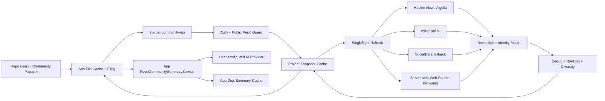

# 仓库社区动态 Feed 正式方案

> 创建：2026-08-30
> 状态：已按独立社区数据服务修订，待 dong4j 确认后实施
> 上游需求：[仓库社区动态 Feed 需求讨论](../仓库社区动态Feed需求讨论.md)
> 适用范围：Starcat macOS 仓库详情页、`starcat-community-api`、AI Summary

---

## 1. 方案结论

采用 **“详情页按需打开 + 独立社区数据服务 + 项目级共享缓存 + 确定性相关性排序 + App 内独立 AI 社区总结”** 路线。

核心决策如下：

1. 在 `RepoDetailScaffold` Hero 操作区增加“社区动态”按钮，首期打开约 480pt 宽的 Popover。
2. 新增独立、可自部署的 `starcat-community-api`；Starcat App 不直接调用 Hacker News、Reddit 或 Web Search Provider。
3. 用户点击后才请求社区服务；客户端先读本地缓存，服务端按 `owner/name` 共享公共项目缓存，不在仓库切换时预取。
4. 同一项目无论由同一 Starcat 用户的多台设备还是不同用户访问，都复用同一服务端快照；缓存未命中的并发请求合并为一个上游抓取任务。
5. 服务端统一模型显式区分 `provider`、`platform` 和 `kind`，集中完成身份匹配、去重、排序和多样性控制。
6. 首期不在每次刷新中调用 LLM rerank；相关性规则必须可测试、可解释。
7. AI 总结保留在 App 内，只消费当前 Feed 快照，不复用或覆盖现有 `AISummaryRecord`，也不把用户 BYOK 密钥交给社区服务。
8. 首期只支持公开仓库；不保存第三方完整正文，不自动进入知识库或 RAG。
9. Starcat App 使用可重建文件缓存，不新增 GRDB 表和 migration；社区服务使用自己的 SQLite 保存公共缓存与刷新状态。

---

## 2. 现状评估与复用边界

### 2.1 详情页入口

`Starcat/Shared/Components/RepoDetailScaffold.swift` 的 `trailingActionsView` 已集中承载 Wiki、相似项目、知识库等详情操作，且被 Manage、Trending、Weekly、Activity 等 repo-backed 详情共用。

本次直接在该公共入口增加按钮，可以覆盖所有标准仓库详情，而不在每个 Feature 重复接线。

现有 `RepoRecommendButton` 和 `LibraryToggleButton` 已定义同组按钮视觉：

- 28×28 capsule。
- 13pt SF Symbol。
- `.buttonStyle(.plain)` + `.focusEffectDisabled()`。
- hover / pressed 反馈。
- `help` 和 VoiceOver label。

社区动态按钮复用这一视觉契约，不再创建另一套 toolbar 风格。

### 2.2 独立社区数据服务

Starcat 已有 `starcat-weekly-api`、`starcat-trending-api`、`starcat-recommend-api`、`starcat-discovery-api` 等独立支持服务，但它们的职责分别是固定来源周刊、趋势榜单、相似项目和项目发现，不适合承载“任意公开仓库的外部社区讨论查询”。

因此新增 `supports/starcat-community-api`：

- 对客户端提供稳定、版本化的 Community Feed REST API。
- 在服务端管理 Hacker News、Reddit、Web Search、YouTube 等来源适配器。
- 统一执行仓库身份匹配、内容类型识别、URL 去重、相关性排序和来源多样性。
- 按项目共享缓存，并处理 ETag、TTL、singleflight、退避和来源健康状态。
- 把第三方 Provider 凭据、配额和条款边界留在服务端，不暴露给客户端。

现有 App 内 External Search 继续服务搜索中心和 AI Context，不作为社区 Feed 的传输链路，也不要求用户为了查看社区动态配置 AnySearch、Tavily、Exa 或 Brave。

### 2.3 AI

现有 `RepoAIInsightService` 面向 README、源码上下文和通用项目洞察，并可能写入现有 AI Summary 记录。社区动态属于另一种证据快照，生命周期和失效条件不同。

因此在 App 内新增独立 `RepoCommunitySummaryService`，只复用底层 AI Provider、语言设置和 `.aiSummary` 权益，不复用现有摘要存储记录。`starcat-community-api` 首期只提供事实 Feed，不接收用户 BYOK 密钥，也不负责生成 AI 总结。

### 2.4 隐私

`ProjectPrivacyPolicy` 已提供公开服务判断。本专题在 App 发请求前和 `starcat-community-api` 接收请求后都进行公开仓库门禁，采用“双门禁”避免未来调用路径变化造成私有仓库外发。

首期沿用 Starcat 支持服务的 Client API Key 鉴权，不把 GitHub access token 发送给社区服务，也不要求服务端识别具体 Starcat 用户。Pro 权益由 App 判断；服务端公共 Feed 缓存不以用户 ID 为主键，默认不记录 `user → repo` 的长期浏览关系。

---

## 3. 总体架构



请求原则：

```text
用户点击入口
  → App 检查公开仓库并读取本地快照
  → 携带 ETag 请求 starcat-community-api
  → 服务端命中新鲜项目缓存：直接返回或 304
  → 服务端命中陈旧缓存：立即返回 stale 数据并后台刷新
  → 服务端缓存缺失：合并同项目并发请求，只执行一个上游抓取任务
  → 服务端标准化、身份匹配、去重、排序并原子写入快照
  → App 更新本地缓存和 Feed
  → 用户点击 AI 后才生成总结
```

### 3.1 服务边界

| 组件 | 负责 | 不负责 |
|---|---|---|
| Starcat App | 详情 UI、本地快照、ETag、AI 总结、Pro 权益 | 直接抓取社区平台、保存服务端 Provider key |
| `starcat-community-api` | 来源抓取、公共项目缓存、相关性、去重、排序、限流 | 用户笔记、RAG、BYOK AI 总结 |
| 社区来源 | 提供公开 Story、文章、视频和公开指标 | Starcat 用户身份与业务状态 |

### 3.2 API 契约

```text
GET  /healthz
GET  /api/v1/ping
GET  /api/v1/repos/{owner}/{repo}/community?kind=&limit=
POST /api/v1/repos/{owner}/{repo}/community/refresh
GET  /internal/stats
```

主查询响应：

```json
{
  "schema_version": 1,
  "data": {
    "repository": "owner/repo",
    "generated_at": "2026-08-30T10:24:00Z",
    "expires_at": "2026-08-30T16:24:00Z",
    "stale": false,
    "content_hash": "...",
    "items": [],
    "sources": []
  }
}
```

服务端返回基于 `content_hash + schema_version` 的 `ETag`。客户端发送 `If-None-Match`，数据未变化时返回 `304 Not Modified`。

`POST .../refresh` 需要有效 Client API Key 并执行项目级冷却；它表达“请求刷新”，不保证绕过服务端保护直接访问所有上游。未来只有在 Starcat 提供独立、可验证且不暴露 GitHub token 的账号凭据后，才增加用户级刷新冷却。

---

## 4. UI 与交互方案

### 4.1 入口位置

`trailingActionsView` 建议顺序：

```text
Weekly actions（如有）
→ Wiki
→ 社区动态
→ 相似项目
→ 知识库
→ 其他详情操作
```

按钮规范：

| 项 | 方案 |
|---|---|
| SF Symbol | `dot.radiowaves.left.and.right` |
| 尺寸 | 28×28 |
| 图标 | 13pt，`.secondary`；激活时 `.accentColor` |
| Label | `Text("community.feed.open")`，保证 VoiceOver 可读 |
| Plain Button | 必须 `.focusEffectDisabled()` |
| Tooltip | “社区动态” |
| 加载反馈 | 按钮保持可见；Popover 内显示状态，不在按钮上叠加复杂 spinner |

私有仓库首期不显示可执行入口。若产品希望教育用户，可显示 disabled 按钮和 help，但不得点击后才发现已经泄露查询；默认方案是直接隐藏。

### 4.2 Popover

建议宽度约 480pt，高度范围约 360–640pt，最终以真实窗口视觉验收为准。

```text
┌──────────────────────────────────────────────┐
│ 社区动态  ·  12 条  ·  更新于 10:24   [AI] [刷新] │
│ [全部] [讨论] [文章] [视频] [发布] [新闻]         │
├──────────────────────────────────────────────┤
│ AI 社区观察（生成后出现，可折叠）                   │
│ 共识 / 好评 / 批评 / 对比 / 证据范围                │
│ [1] [3] [7] ...                                  │
├──────────────────────────────────────────────┤
│ HN · 讨论 · 2 天前                                 │
│ 标题                                               │
│ snippet ...                         128 points · 42 │
│                                                      │
│ example.com · 文章 · 1 周前                         │
│ 标题                                               │
│ snippet ...                                         │
└──────────────────────────────────────────────┘
```

实现约束：

- Header 使用现有 `SyncIconButton` 表达刷新，不另造刷新图标。
- 筛选项数量固定且较少，使用横向紧凑 Picker / segmented-like control，具体样式以 `DESIGN.md` 为准。
- 列表使用 `LazyVStack`，避免一次性创建所有条目。
- 标题最多两行，snippet 最多三行，保证可扫读。
- 点击条目使用系统浏览器打开原始 URL。
- 文本和图标只用 `.primary` / `.secondary`，不使用 `.tertiary`。
- 所有可见文案进入 `Localizable.xcstrings`。

### 4.3 加载与降级

| 状态 | UI 行为 |
|---|---|
| 无缓存首次加载 | skeleton / ProgressView + “正在获取社区动态” |
| 有本地缓存且 ETag 未变化 | 立即展示，服务端返回 `304`，不传输重复 Feed |
| 有本地缓存但服务端快照更新 | 先展示旧内容，再替换为新快照 |
| 部分来源失败 | 展示成功结果，底部显示可展开的来源错误摘要 |
| 全部失败、有缓存 | 保留旧内容，显示“更新失败 · 当前为缓存结果” |
| 全部失败、无缓存 | 空状态 + 社区数据服务设置入口或重试 |
| 相关结果为 0 | 说明“未找到可确认与该仓库相关的外部内容” |
| AI 证据不足 | AI 区显示门槛说明，不调用模型 |

### 4.4 刷新行为

- 打开 Popover：先读取 App 本地缓存，再携带 ETag 请求社区服务；客户端不直接判断是否需要抓取上游。
- 手动刷新：调用服务端 refresh endpoint，由服务端执行项目级冷却，不能无条件绕过 TTL。
- 快速重复点击：App 合并同一 repo 的客户端请求；服务端还要对所有用户的同项目请求执行 singleflight。
- 切换 repo：取消旧 UI 订阅；已发出的社区服务请求可以完成并写本地缓存，但不得更新新 repo 的界面。

---

## 5. 数据模型

### 5.1 三个维度必须分开

```swift
enum RepoCommunityProvider: String, Codable, Sendable {
    case hackerNewsAlgolia
    case serverWebSearch
    case twitterAPIIO
    case socialData
    case youtubeDataAPI
    case productHuntAPI
}

enum RepoCommunityPlatform: String, Codable, Sendable {
    case hackerNews
    case x
    case reddit
    case youtube
    case productHunt
    case lobsters
    case stackOverflow
    case v2ex
    case zhihu
    case juejin
    case bilibili
    case web
}

enum RepoCommunityKind: String, Codable, CaseIterable, Sendable {
    case discussion
    case article
    case video
    case launch
    case news
}
```

- `provider`：社区服务使用哪个上游适配器找到这条结果。
- `platform`：原始内容实际发布在哪里。
- `kind`：这条内容对用户属于什么类型。

例如：SocialData 找到一条 X 帖子时，应记录 `provider = .socialData`、`platform = .x`、`kind = .discussion`；服务端 Web Search 找到一条 Reddit 帖子时，应记录 `provider = .serverWebSearch`、`platform = .reddit`、`kind = .discussion`。

### 5.2 Feed 条目

```swift
struct RepoCommunityFeedItem: Codable, Identifiable, Equatable, Sendable {
    let id: String
    let repositoryKey: String
    let title: String
    let url: URL
    let canonicalURL: URL
    let snippet: String
    let publishedAt: Date?
    let author: String?
    let provider: RepoCommunityProvider
    let platform: RepoCommunityPlatform
    let kind: RepoCommunityKind
    let metrics: RepoCommunityMetrics?
    let identityEvidence: RepoCommunityIdentityEvidence
    let relevanceScore: Double
}

struct RepoCommunityMetrics: Codable, Equatable, Sendable {
    let score: Int?
    let commentCount: Int?
    let viewCount: Int?
}
```

`repositoryKey` 使用标准化 `owner/name`，不能依赖本地 `repo.id`。Trending、Weekly 或远端临时仓库可能尚未落库并使用 `id == 0`，但仍应能查看公开社区信息。

### 5.3 身份证据

```swift
enum RepoCommunityIdentityEvidence: Codable, Equatable, Sendable {
    case canonicalGitHubURL
    case fullName
    case nameAndOwner
    case nameAndHomepage
    case nameAndUniqueTopic
}
```

不定义 `nameOnly` 的正式可展示证据。只有通用名称而无其他仓库证据的结果直接丢弃。

### 5.4 Feed 快照

```swift
struct RepoCommunityFeedSnapshot: Codable, Equatable, Sendable {
    let schemaVersion: Int
    let repositoryKey: String
    let generatedAt: Date
    let items: [RepoCommunityFeedItem]
    let sourceStatuses: [RepoCommunitySourceStatus]
    let contentHash: String
}
```

`contentHash` 由排序后的稳定字段生成，用于判断 AI 总结是否仍与当前 Feed 一致。

---

## 6. 查询与来源策略

### 6.1 Query Builder

每个 repo 生成一组有明确意图的查询，不使用一个超长 OR 查询覆盖所有平台。

基础身份：

```text
canonical URL: https://github.com/<owner>/<repo>
full name:     "<owner>/<repo>"
name + owner:  "<repo>" "<owner>"
```

内容查询示例：

```text
"<owner>/<repo>" review OR experience OR migration
"<owner>/<repo>" alternatives OR vs
"<owner>/<repo>" issue OR problem OR production
"https://github.com/<owner>/<repo>"
```

域名型来源由服务端适配器使用结构化 domain filter，例如 Reddit、YouTube、Product Hunt；不要把 `site:` 方言硬编码进所有 Provider 的同一 query。

查询词只使用公开仓库可公开字段：owner、name、canonical URL、homepage 域名和少量公开 topics。App 不上传用户笔记、私有标签、状态或本地 RAG 内容，社区服务也不得为查询索取这些字段。

### 6.2 P0 来源

#### Hacker News

`starcat-community-api` 使用 Algolia HN Search API 作为结构化适配器，不爬取 Hacker News HTML。查询分三步：

1. 用 canonical GitHub URL 搜索 `story`，优先限制 URL 属性，找到直接指向仓库的讨论。
2. 用 `owner/name` 搜索 `story` 和 `comment`，补充没有直接链接仓库但明确提到项目的讨论。
3. 对强相关 Story 调用 `/api/v1/items/:id` 获取评论树，只提取有限长度的高信息量评论摘要，不持久化完整评论树。

适配器保留：

- story / comment 标识。
- points。
- comment count。
- created_at。
- HN discussion URL 和外链 URL。

Comment 命中需要按 `story_id` 归并到所属讨论，不能把每条评论都展示成独立 Feed 卡片。独立 Story thread 必须保留为独立 Feed 条目，不能因其外链与文章相同而被 URL 去重吞掉。

#### Reddit 与 Web 文章

首期通过 `starcat-community-api` 配置的服务端 Web Search Provider 获取，不直接引入 Reddit 登录或 OAuth：

- Reddit：`reddit.com`。
- 文章：不限制域名或使用博客 / 技术社区域名集合。

Provider key 只保存在服务端 secrets 中，不下发给 Starcat App。这一路径用于快速验证内容价值，不承诺 Reddit 的完整分数、评论数和帖子状态。未来若改成专用 API，再由新的结构化适配器补齐指标。

### 6.3 X 双 Provider

X 来源采用两个第三方只读数据服务：

| Provider | 接口 | 鉴权 | 角色 |
|---|---|---|---|
| twitterapi.io | `GET https://api.twitterapi.io/twitter/tweet/advanced_search` | `X-API-Key` | 主来源，优先执行强 URL 查询 |
| SocialData | `GET https://api.socialdata.tools/twitter/search` | `Authorization: Bearer` | 补充召回、429 和来源故障时降级 |

两组凭据只存放在 `starcat-community-api` 的 secrets，不写入 Starcat App、Git 仓库、请求日志或响应 DTO。

#### 查询顺序

```text
正常请求:
1. twitterapi.io: url:github.com/<owner>/<repo> -filter:retweets
2. SocialData fallback: url:github.com/<owner>/<repo> -filter:retweets

仅用于受控诊断 / 后续离线补召回:
3. "https://github.com/<owner>/<repo>" -filter:retweets
4. "<owner>/<repo>" -filter:retweets
5. "<repo>" "<owner>" -filter:retweets
```

- 正常点击链路只执行第 1 项；满足 fallback 条件时再执行第 2 项，因此最多两次 X Search 请求。
- 第 1、2 项使用 `Top` 取首屏热门结果。
- 第 3–5 项只用于受控诊断或未来离线补召回，不在用户点击链路自动执行，也不得直接成为强身份证据。
- 首期每次调用只取一页，不使用无界 cursor 分页。
- twitterapi.io 有足够强相关结果时不再调用 SocialData。
- twitterapi.io 返回 429、超时、5xx 或强相关结果不足时，才进入 SocialData fallback。

#### 实测质量结论

2026-08-30 使用 `openai/codex` 与 `starcat-app/Starcat` 做了真实接口验证：

- twitterapi.io 的 `url:` 查询能找到 canonical 仓库、Release 和 PR 链接，长尾 Starcat 样本返回 1 条且为强相关帖子。
- twitterapi.io 短时间连续请求出现过 `429 Too Many Requests`；加入请求间隔后恢复，说明服务端必须队列化并尊重退避，不能让客户端突发直连。
- SocialData 连续请求稳定、返回量更大，但会返回 conversation 父帖、没有仓库链接的相关回复和通用名称内容。
- 两家都可能把 `/openai/codex-security` 作为 `/openai/codex` 的前缀命中，必须自行校验 GitHub URL path segment。

#### 强相关过滤

X 条目只有满足以下任一条件才进入正式 Feed：

1. `entities.urls[].expanded_url` 的 host 为 `github.com`，path 恰好是 `/<owner>/<repo>` 或以 `/<owner>/<repo>/` 开头。
2. 正文包含边界完整的 `owner/repo`，并有 owner、官方主页或独有 topic 作为第二证据。
3. 属于已确认强相关 Tweet 的 reply / quote，且当前条目本身包含明确项目讨论内容。

必须拒绝：

- 只命中 repo 名前缀的其他仓库，例如 `codex-security`。
- 仅因处于同一 conversation 而被返回、正文与链接都没有项目证据的父帖。
- 只有 `codex`、`swift`、`echo` 等通用词的内容。

#### 去重与热度

- 两家结果先按 Tweet ID 去重，同一 Tweet 保留字段更完整的版本。
- Provider 的 `Top` 只作为候选排序信号，不能假设它严格按点赞数排列。
- Starcat 服务端统一使用 likes、reposts、replies、quotes、views、发布时间和身份分计算展示顺序。
- 引用帖、回复和原帖属于不同 Tweet 时可分别保留，但首屏避免被同一 conversation 占满。

### 6.4 X 资费与成本预算

资费按 Provider 官方页面于 2026-08-30 核对：

| Provider | 当前 Search 资费 | 1,000 条估算 | 一页 20 条估算 | 计费备注 |
|---|---:|---:|---:|---|
| [twitterapi.io](https://twitterapi.io/) | `$0.00015 / 返回 Tweet` | `$0.15` | `$0.003` | Pay-as-you-go，无月度最低消费；可选自动充值不改变单价 |
| [SocialData](https://docs.socialdata.tools/getting-started/pricing/) | `$0.0002 / 返回 Tweet` | `$0.20` | `$0.004` | 需要正余额；失败请求不扣费；余额按官方说明不过期 |

成本控制规则：

- 默认一次冷缓存刷新只调用 twitterapi.io 一页，理论上限约 `$0.003`。
- 只有主来源失败或强相关结果不足时再调用 SocialData；两家各一页约 `$0.007`。
- 单次刷新最多执行 2 个 X Provider 请求，不自动翻页。
- 空结果的实际最低扣费、折扣和价格变动以 Provider dashboard 为准。
- 服务端记录 Provider、返回条数、估算成本、实际错误和缓存命中率，但不记录 API key 或用户浏览身份。
- 配置月度预算软阈值；达到阈值后停止 fallback，只返回已有缓存和其他社区来源。

建议使用以下服务端配置，不在代码中写死真实凭据：

```text
TWITTERAPI_IO_API_KEY
SOCIALDATA_API_KEY
X_PRIMARY_PROVIDER=twitterapiio
X_FALLBACK_PROVIDER=socialdata
X_MAX_RESULTS_PER_PROVIDER=20
X_MONTHLY_SOFT_BUDGET_USD
```

价格属于外部易变事实。每次实施、上线和发版前必须复查官方价格页，不把文档数字硬编码进业务逻辑。

### 6.5 P1 来源

- YouTube：首期可由服务端 domain-scoped Web Search 提供标题、snippet 和 URL；需要稳定频道、发布时间、播放量时再接 YouTube Data API。
- Product Hunt：专用 API 需先确认商业使用授权；在此之前仅允许公开 Web 搜索结果进入 Feed。

### 6.6 后续来源

Lobsters、Stack Overflow、V2EX、知乎、掘金、少数派和 Bilibili 仍按覆盖率、接口稳定性、成本和条款逐个评估，不因 X Provider 已接入而自动扩张来源范围。

---

## 7. 标准化、相关性、去重与排序

### 7.1 处理流水线

```text
Raw source result
→ URL 安全校验
→ canonical URL 归一化
→ platform / kind 分类
→ 仓库身份证据提取
→ 低相关结果过滤
→ canonical URL 去重
→ 跨来源字段合并
→ 确定性评分
→ 来源与类型多样性重排
→ 截断为展示上限
```

### 7.2 URL 归一化

允许移除：

- `utm_*`、`ref` 等明确跟踪参数。
- 默认端口、fragment。
- 可安全判断的移动端 host 差异。
- 尾部无语义 `/`。

不得随意移除可能改变内容身份的 query 参数，例如 YouTube `v`、HN `id`、Reddit comment path。

### 7.3 相关性评分

建议基础分：

| 证据 | 基础分 |
|---|---:|
| canonical GitHub URL | 100 |
| 完整 `owner/name` | 90 |
| repo name + owner | 78 |
| repo name + homepage 域名 | 72 |
| repo name + 独有 topic | 65 |

调整项：

- 标题中命中强身份：+8。
- 正文 snippet 中命中强身份：+4。
- 最近 90 天：+6；最近一年：+3。
- 同一域名在候选中占比过高：多样性阶段降位，不直接删除。
- repo 名属于高歧义词且没有强身份：直接过滤。

具体分值属于可测试的初始参数，不应暴露为用户可配置项。实现时通过 fixture 调整，不为一套排序规则建立复杂配置系统。

### 7.4 多样性重排

默认首屏建议：

- 同一 platform 连续不超过 2 条。
- 同一 domain 在前 10 条中不超过 4 条，除非总结果不足。
- 有足够候选时，前 8 条至少覆盖 2 种内容类型和 2 个独立域名。

这是展示重排，不改变条目的相关性事实和 AI 输入来源编号。

---

## 8. 缓存与刷新

### 8.1 缓存身份

社区 Feed 是项目级公共数据，服务端缓存主键使用：

```text
repositoryKey(owner/name)
+ sourceProfile
+ queryVersion
+ schemaVersion
```

缓存主键不包含 Starcat 用户 ID。这样可以保证：

- 同一设备重复查看不会重复抓取。
- 同一 Starcat 用户换设备时复用同一个服务端项目快照。
- 不同用户查看同一公开项目时也复用同一快照。
- 服务端规则升级时通过 version 字段安全失效旧数据。

首期 API 使用 Client API Key 鉴权，服务端不需要 Starcat / GitHub 用户 ID。Pro 权益由 App 判断，刷新至少执行项目级冷却和服务级滥用保护。未来若增加独立账号 token，用户 ID 也只能用于限流，不能进入 Feed cache key 或长期浏览记录。

### 8.2 服务端持久缓存

`starcat-community-api` 首期使用 SQLite，建议最小表集合：

```text
community_projects         # 标准化公开仓库身份与最后成功快照
community_items            # 标准化 Feed 条目
community_source_states    # 各来源成功/空/错误时间与退避状态
community_refresh_jobs     # 项目级刷新任务与 singleflight 状态
```

这些表只保存可重建公共数据，不保存用户笔记、标签、RAG 内容、第三方 Cookie 或完整网页正文。

### 8.3 客户端文件缓存

建议新增独立目录：

```text
<Application Support>/Starcat/community-feed/
├── feeds/<sha256(repositoryKey + queryVersion + sourceProfile)>.json
└── summaries/<sha256(repositoryKey + contentHash + model + promptVersion)>.json
```

Feed 是公开、可重建缓存，不进入 GRDB，也不参与 CloudKit。

客户端 Feed 快照保存服务端 `ETag`。再次打开时先展示本地数据，再发送 `If-None-Match`；服务端返回 `304` 时不重复传输 Feed。

### 8.4 TTL

服务端建议区分三种 TTL：

- 成功且非空：6 小时新鲜。
- 成功但为空：1 小时，避免把暂时搜不到长期缓存为“没有讨论”。
- 上游错误：10 分钟退避，避免故障期间反复轰击来源。
- 最大陈旧可读期：30 天；超过后可保留文件，但 App 不当作可用内容展示。

App 内 AI Summary 无固定时间 TTL，以 `contentHash + model + promptVersion` 命中为准。

客户端可复用 `DiskExternalSearchCache` 已验证的安全文件名和原子写入模式，但社区快照必须是独立 cache type。服务端使用自己的 SQLite transaction 和原子快照发布，不与 App 的 External Search 缓存共享 schema。

### 8.5 服务端 SWR

```text
fresh project cache   → 直接返回 200 / 304，不请求上游
stale project cache   → 返回 stale 快照，同时后台刷新
missing project cache → 创建或加入 singleflight，等待首次结果
refresh failure       → 保留 stale 快照，不用空结果覆盖
refresh success       → transaction 原子替换快照，重新生成 ETag/contentHash
```

### 8.6 请求合并与手动刷新

服务端为每个缓存 key 维护一个 in-flight refresh：

```text
第一个请求             → 创建上游抓取任务
同项目后续并发请求      → 等待同一个任务或先读取 stale 快照
任务完成               → 所有等待者共享同一结果
```

`POST .../refresh` 也必须经过：

- 项目级冷却：建议同一项目 10–15 分钟内不重复强刷，不论请求来自哪个设备或用户。
- 服务级限流：按 Client API Key、来源和整体并发限制请求，防止接口滥用。
- 来源错误退避：处于 429 / 5xx 退避期的来源不立即重试。
- singleflight：手动刷新不得绕过正在执行的项目刷新任务。

### 8.7 缓存失效

以下变化必须产生新 key 或失效：

- `owner/name` 变化。
- Query 规则版本变化。
- 启用来源组合变化。
- 标准化 / 排序 schema 变化。
- Feed 内容变化导致 AI `contentHash` 变化。
- AI 模型或 prompt 版本变化。

---

## 9. AI 社区总结

### 9.1 App 内独立总结服务

建议新增：

```text
RepoCommunitySummaryService
├── makeEvidence(snapshot:)
├── generate(snapshot:configuration:)
├── decodeAndValidate(response:sourceIDs:)
└── cachedSummary(for:contentHash:model:promptVersion:)
```

它只依赖 `starcat-community-api` 返回的标准化 Feed、现有 AI 配置与 App 文件缓存，不调用 External Search 或任何社区来源，也不写 `AISummaryRecord`。

### 9.2 输入预算

- 最多选择 20 条高相关 Feed。
- 同一域名最多 6 条。
- 每条只传标题、短 snippet、时间、平台和固定 source ID。
- 不抓取网页全文补 prompt。
- snippet 中的指令性文本一律视为不可信数据，不得改变 system prompt 或输出格式。

### 9.3 最低证据门槛

调用模型前本地校验：

```text
有效条目 >= 3
独立域名 >= 2
至少 1 条强身份结果（canonical URL 或 owner/name）
```

不满足时直接返回 `.insufficientEvidence`，节省模型费用并防止单一来源被放大。

### 9.4 输出结构

建议模型返回严格 JSON：

```json
{
  "headline": "...",
  "consensus": [
    { "text": "...", "sourceIDs": ["S1", "S4"] }
  ],
  "praise": [],
  "criticism": [],
  "comparisons": [],
  "evidenceNote": "..."
}
```

解码后必须验证：

- `sourceIDs` 全部存在于本次输入。
- 每个观点至少有一个 source ID。
- “共识”至少引用两个独立域名，否则降级为“单一来源观察”。
- 输出为空或引用非法时整体失败，不展示半可信总结。

### 9.5 权益与失败降级

- 点击 AI 按钮时调用 `EntitlementGate` 的现有 `.aiSummary` 权益。
- 无 AI Provider：引导到 AI Settings，不影响 Feed。
- Free 用户：显示现有 Pro 引导，不隐藏原始 Feed。
- 生成失败：保留上一次 contentHash 匹配的有效总结；若不匹配则只显示错误，不展示旧结论。

---

## 10. 模块与文件规划

### 10.1 新增文件

```text
Starcat/Features/CommunityFeed/
├── RepoCommunityFeedModels.swift
├── RepoCommunityAPIClient.swift
├── RepoCommunityFeedViewModel.swift
├── RepoCommunityFeedButton.swift
├── RepoCommunityFeedPopover.swift
├── RepoCommunitySummaryService.swift
└── CommunityFeedDiskCache.swift

StarcatTests/CommunityFeed/
├── CommunityFeedDiskCacheTests.swift
├── RepoCommunityAPIClientTests.swift
├── RepoCommunityFeedViewModelTests.swift
└── RepoCommunitySummaryServiceTests.swift

supports/starcat-community-api/              # 独立 Git 仓库
├── cmd/server/
├── internal/api/                            # v1 envelope、auth、ETag、refresh endpoint
├── internal/community/                      # 聚合、相关性、去重、排序
├── internal/source/hackernews/              # Algolia Search + item detail
├── internal/source/websearch/               # 服务端 Provider 适配
├── internal/source/twitterapiio/             # X 主来源、X-API-Key、429 退避
├── internal/source/socialdata/               # X fallback、Bearer、conversation 过滤
├── internal/store/                          # SQLite schema 与 transaction
├── internal/refresh/                        # TTL、singleflight、退避、后台任务
├── migrations/
├── README.md
├── README-ZH.md
├── Dockerfile
└── fly.toml
```

完整新文件必须按项目规范补充模块说明、关键类型说明和复杂逻辑的“为什么 + 约束”注释。

### 10.2 最小改动文件

| 文件 | 改动 |
|---|---|
| `Starcat/Shared/Components/RepoDetailScaffold.swift` | 增加 Popover 状态、按钮和当前 repo 接线 |
| `Starcat/Core/Privacy/ProjectPrivacyPolicy.swift` | 如现有方法语义不足，增加明确的 community feed public-only 判断 |
| `Starcat/App/AppDependencies.swift` | 注入 Community API Client、Feed Cache 和 Summary Service |
| `Starcat/Core/Settings/AppSettings.swift` 或现有支持 API 配置 | 增加 hosted default / self-hosted Community API endpoint |
| `Starcat/Resources/Localizable.xcstrings` | 只按行新增本专题文案，不重排 Catalog |
| `Starcat/Features/Settings/SettingsView.swift` 或现有存储设置文件 | 仅当缓存管理需要用户入口时增加清理项 |

Starcat App 不修改已发布 migration，不直接改任何历史建表 SQL。`starcat-community-api` 是独立仓库，使用自身首版数据库 schema 和后续迁移。

### 10.3 不复用的对象

- 不把社区 Feed 塞入 `RepoRecommendationPopover`。
- 不把社区总结塞入 `RepoAIInsightViewModel`。
- 不把 Feed 快照写入 `RepoRepository` 或用户数据表。
- 不让 App 或 View 直接调用 Hacker News、twitterapi.io、SocialData 或 Web Search Provider。
- 不把社区项目缓存按 Starcat 用户拆成多份。

---

## 11. 并发与错误处理

### 11.1 并发模型

App 的 `RepoCommunityFeedViewModel` 只管理当前 UI 任务和本地缓存，避免切换 repo 后串结果。

`starcat-community-api` 的 refresh coordinator 管理：

- 每个项目缓存 key 的 in-flight refresh。
- 所有用户共享的 singleflight。
- 来源并发请求和固定并发上限。
- X Provider 的独立串行队列、429 退避和单次成本预算。
- 取消、超时、错误退避与 SQLite transaction。
- 最终 source status 和 ETag 发布。

来源请求可并发执行，但设置一个小而固定的并发上限。首期来源数量有限，不引入通用任务调度框架。

### 11.2 部分成功

来源聚合使用“部分成功可用”语义：

- 一个来源失败不取消其他来源。
- 至少一个来源成功且有有效条目，即返回 Feed + source errors。
- 所有来源完成后再做一次统一去重和排序，避免响应时序影响结果顺序。
- 失败或空结果不得覆盖已有非空缓存，除非服务端明确确认新结果为空且没有错误。

### 11.3 URL 安全

- 只接受 `https`，HN 本地生成的可信跳转也统一为 `https`。
- 拒绝 `file:`、`javascript:`、`data:` 和自定义 scheme。
- 打开前再次验证 URL scheme。
- snippet 始终作为纯文本渲染，不解释 HTML。

---

## 12. 测试与验收计划

### 12.1 单元测试

| Suite | 关键用例 |
|---|---|
| Backend Query Builder | canonical URL、owner/name、domain filter、高歧义名称 |
| Backend Result Pipeline | platform/kind 分类、tracking 参数归一化、讨论串保留 |
| Backend Identity Match | 强证据通过、name-only 拒绝、大小写和 URL 编码 |
| Backend X Sources | 两家 DTO 解码、URL path boundary、Tweet ID 去重、conversation 父帖过滤 |
| Backend Ranking | 结果顺序稳定、来源多样性、无指标时不崩溃 |
| Backend Store | 项目级 key、TTL、transaction、旧 schema 迁移、空/错误差异化缓存 |
| Backend Refresh | 同用户重复请求、跨用户共享、singleflight、冷却、部分成功 |
| API Contract | auth、envelope、ETag/304、stale、refresh 限流 |
| App Disk Cache | ETag、原子替换、损坏文件降级、旧 schema 失效 |
| App View Model | 切 repo 不串数据、304 保留缓存、服务不可用降级 |
| Privacy | 私有 repo 在 App 和 API 两层均被拒绝，社区来源收到 0 次请求 |
| AI Summary | 证据门槛、非法引用拒绝、contentHash 失效、prompt injection fixture |

### 12.2 网络桩

- Hacker News fixture 覆盖 story、comment、无外链、重复外链。
- Web Search fixture 覆盖同一 URL 来自多个服务端 Provider。
- twitterapi.io fixture 覆盖 canonical URL、Release/PR 子路径、`codex-security` 前缀误匹配和 429。
- SocialData fixture 覆盖 conversation 父帖、无展开链接、重复 Tweet 和 fallback。
- 并发 fixture 验证 20 个同项目请求只触发一次上游抓取。
- ETag fixture 验证相同快照返回 `304`，新快照返回新 ETag。
- 不依赖真实外网跑自动化测试。
- 错误 fixture 覆盖 401、403、429、5xx、超时和非法 JSON。

### 12.3 构建与静态检查

实施后按项目标准执行：

```bash
# starcat-community-api 独立仓库
go test ./...
go test -race ./...
go vet ./...
go build ./...

# Starcat 主仓库
make test TEST_ARGS="-only-testing:StarcatTests/<CommunityFeedSuites>"
make build-appstore
make build-direct
jq empty Starcat/Resources/Localizable.xcstrings
git diff --check
```

两个仓库分别验证、分别提交。跑 Starcat 测试前关闭 Xcode IDE；若新增 Swift 文件，先执行 `xcodegen generate`，再使用 Makefile 标准入口。

### 12.4 人工 UI 验收

- 浅色 / 深色。
- 小窗口和标准窗口。
- Manage、Trending、Weekly、Activity 的 repo-backed 详情。
- Feed 长标题、无时间、无 snippet、超长域名。
- VoiceOver 读出按钮、筛选、来源和 AI 引用。
- Popover 打开期间切换 repo，不显示旧 repo 结果。
- 手动打开原文，确认 URL 和当前卡片一致。

---

## 13. 分阶段实施

### 阶段 A：社区数据服务

1. 创建独立 `supports/starcat-community-api` 仓库和 v1 API envelope。
2. 完成 SQLite、项目级缓存、TTL、ETag、singleflight 和刷新冷却。
3. 完成 Hacker News Algolia 适配器、query builder、相关性、评论归并和去重。
4. 完成 twitterapi.io 主来源、SocialData fallback、X 强相关过滤和成本预算。
5. 接入一个服务端 Web Search Provider，提供 Reddit 和公开文章候选。
6. 完成 auth、public repo guard、部分成功和 metrics。

阶段 A 用 API fixture 和真实公开仓库样本验收，不依赖 Starcat UI。

### 阶段 B：Starcat Feed 客户端

1. Community API Client、DTO、本地文件缓存和 ETag。
2. 详情按钮、Popover、筛选、刷新和所有状态。
3. 私有仓库在 App/API 双层 0 上游请求验证。
4. 同设备、同用户跨设备、跨用户的重复请求与缓存命中验证。

阶段 B 完成即具备独立产品价值，不依赖 AI。

### 阶段 C：AI 社区总结

1. evidence builder 和最低门槛。
2. 严格 JSON prompt、引用校验和 summary cache。
3. Pro 门控、设置引导和 UI 展示。
4. prompt injection、非法引用和 cache invalidation 测试。

### 阶段 D：来源质量补强

1. 评估 YouTube 专用 API。
2. 取得授权后再评估 Product Hunt 专用 API。
3. 用真实仓库样本评估中文社区、Lobsters、Stack Overflow。

每个阶段都可独立交付，不要求一次性接完所有平台。

---

## 14. 风险与缓解

| 风险 | 缓解 |
|---|---|
| 同名仓库噪音污染 Feed | 强身份门槛 + 高歧义词测试集 + 宁缺毋滥 |
| Provider 返回重复或漂移结果 | canonical URL 归一化 + snapshot schema/version |
| 第三方 API 条款变化 | 专用适配器隔离；实施前复核；随时降级为公开 Web 搜索 |
| twitterapi.io 突发请求返回 429 | 独立串行队列、指数退避、项目缓存；失败时按预算切 SocialData |
| SocialData 返回 conversation 噪音 | 强 URL / `owner/repo` 证据校验；无项目证据的父帖不进入 Feed |
| GitHub URL 前缀误匹配其他仓库 | 解析 URLComponents，按 owner/repo path segment 边界比较 |
| X 资费上涨或余额不足 | Provider 可停用；月度软预算和余额告警；返回缓存及其他来源 |
| 多来源刷新变慢 | 并发执行 + 缓存先显 + 部分成功 |
| 多个用户同时触发同项目抓取 | 项目级 singleflight + 成功/空/错误差异化 TTL |
| 同一用户或多台设备频繁手动刷新 | 项目级冷却 + Client API Key 服务级限流；refresh 只表达刷新意图 |
| 后端集中后成为可用性依赖 | App 保留本地陈旧快照；服务端健康检查、metrics 和 self-hosted endpoint |
| 后端记录用户浏览偏好 | 首期不上传用户 ID；缓存按项目建模，不保存长期浏览关系 |
| AI 把个例写成共识 | 最低证据门槛 + 独立域名校验 + 来源引用 |
| 外部文本 prompt injection | snippet 视为不可信数据 + 固定结构输出 + source ID 白名单 |
| 网络费用或配额失控 | 仅点击后联网 + TTL + in-flight 合并 + 不用 LLM rerank |
| 私有仓库身份泄露 | UI 与 Service 双门禁 + 0 请求单测 |
| Popover 承载内容过多 | 首期紧凑卡片 + AI 区折叠；验证后再决定是否升级独立页面 |

---

## 15. 回滚与兼容性

- UI 入口可独立移除，不影响详情页其他操作。
- App Community Feed 文件缓存可直接清理，不影响用户数据和 CloudKit。
- `starcat-community-api` 可独立停服或回滚，不要求 Starcat App 数据迁移；App 降级显示本地旧快照和服务不可用状态。
- HN 或任一服务端 Provider 可从 source profile 中停用；服务端 schema 变化走自己的 migration，不触碰 Starcat GRDB。
- AI 总结是附加层，停用后原始 Feed 继续工作。
- 不改现有 `AISummaryRecord`、知识库和推荐缓存，因此不会产生跨功能数据回滚。

---

## 16. 实施授权边界

本文档只定义方案，不代表已经获得代码修改许可。

实施前需要 dong4j 明确回复“开干 / 实施 / 改吧”等授权。实施结束后，`docs/功能实现总览.md` 的拟写内容应单独提交 dong4j 审阅；只有收到“可以写总览 / 同步总览”后才能修改该文件。
