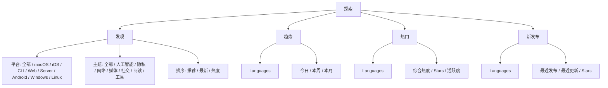
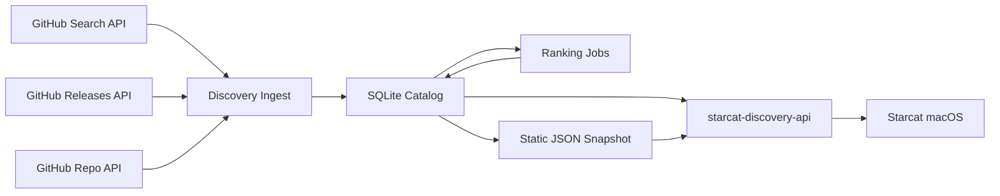
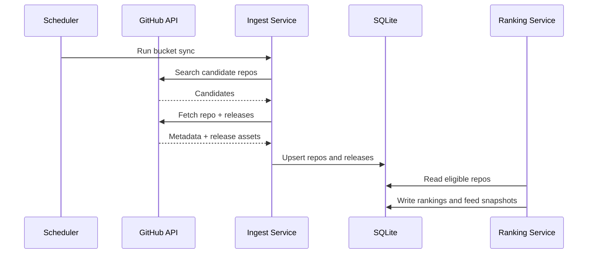
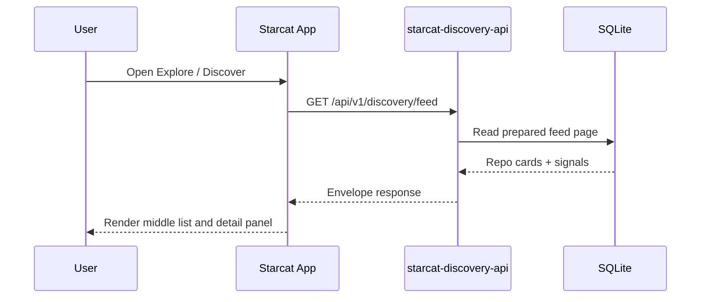

# 探索发现与榜单正式方案

> 日期: 2026-06-30
> 状态: 已确认方向, 待排期实施
> 范围: Starcat 探索入口、发现 / 趋势 / 热门 / 新发布、`starcat-discovery-api`

## 1. 目标

将现有 `Trending` 升级为统一的「探索」入口,提供四类项目发现能力:

- **发现**: 面向主题和平台的推荐流,帮助用户主动发现未收藏项目。
- **趋势**: 保留当前 GitHub Trending 今日 / 本周 / 本月能力。
- **热门**: 高质量、高热度、长期受欢迎项目。
- **新发布**: 最近有稳定 Release 的项目。

首期目标不是替换当前 Trending,而是在不破坏现有调用链的前提下新增 Discovery 能力。

## 2. 核心决策

1. **新增 `starcat-discovery-api`**  
   不扩展 `starcat-trending-api` 的职责。旧 Trending 保持现状,新服务负责发现、热门、新发布和未来新版趋势。

2. **后端预计算,客户端只消费稳定接口**  
   GitHub Search、Release asset 检查、下载量聚合、排名计算、冷却曝光全部在后端完成。

3. **发现走主题 + 平台,榜单走 Languages**  
   「发现」的子分类是主题与平台;「趋势 / 热门 / 新发布」继续沿用 Languages 心智。

4. **中栏顶部统一筛选条**  
   四个模式都显示同一类筛选容器,但具体选项按模式开放,避免 UI 一致性和能力真实性冲突。

5. **开源优先**  
   新服务按现有后端服务规范建设,包含 README、LICENSE、CONTRIBUTING、SECURITY、Dockerfile、Fly.io 配置和部署文档。

## 3. 产品信息架构



### 3.1 发现

发现是主题化推荐流。用户先选择平台,再选择主题。平台和主题均可折叠,折叠后仅保留「全部」入口,降低侧边栏噪音。

默认推荐流应满足:

- 不只展示高星项目。
- 不重复集中展示同 owner / 同主题 / 同语言项目。
- 能解释推荐原因,例如「最近发布」「下载量高」「近期增长快」。

### 3.2 趋势

趋势首期保持当前实现:

- 数据继续来自 `starcat-trending-api`。
- 左侧继续用 Languages。
- 中栏顶部继续使用今日 / 本周 / 本月。

正式方案只调整入口命名和容器结构,不改变旧接口契约。

### 3.3 热门

热门参考 komi-store 的 `most-popular`,但 Starcat 需要支持 Languages。排序不应只看 Star,而应综合:

- stars
- forks
- release downloads
- latest release recency
- pushed activity
- archived / fork / private 等质量门禁

如果首期没有足够快照历史,可以先使用静态热度分;但接口和字段要为后续动态分预留。

### 3.4 新发布

新发布关注最近稳定 Release。需要排除:

- draft release
- prerelease
- 无实质 release asset 且只有源码包的项目
- archived repo

排序优先使用 `latest_release_at DESC`,再用质量分兜底。

## 4. 后端总体方案



后端不在用户请求时临时打 GitHub。请求路径只读 SQLite 或内存缓存。GitHub API 消耗集中在定时任务和 admin sync 中。

### 4.1 服务边界

| 服务 | 保留职责 | 本次是否改动 |
|---|---|---|
| `starcat-trending-api` | GitHub Trending 单源今日 / 本周 / 本月 | 不改 |
| `starcat-weekly-api` | Weekly / ZRead / Show HN 聚合 | 不改 |
| `starcat-recommend-api` | 相似仓库推荐 | 不改 |
| `starcat-discovery-api` | 发现流、热门、新发布、未来新版趋势 | 新增 |

### 4.2 对外接口

```text
GET /healthz
GET /api/v1/ping
GET /api/v1/discovery/feed?platform=&topic=&language=&sort=&page=&limit=
GET /api/v1/discovery/categories/most-popular?language=&platform=&sort=&page=&limit=
GET /api/v1/discovery/categories/new-releases?language=&platform=&sort=&page=&limit=
GET /api/v1/discovery/categories/trending?language=&platform=&period=&page=&limit=
GET /api/v1/discovery/languages
GET /api/v1/discovery/topics
GET /api/v1/discovery/platforms
POST /internal/sync/discovery
```

首期客户端只接:

- `feed`
- `most-popular`
- `new-releases`
- metadata endpoints

`trending` endpoint 可先实现但不接客户端,用于与旧 `trending-api` 对比。

## 5. 业务流程

### 5.1 数据生成流程



### 5.2 客户端浏览流程



## 6. 性能要求

- 请求路径 P95 目标: 300ms 内返回首屏。
- 每页最大 50 条,默认 20 条。
- 后端响应必须可 CDN 缓存;匿名公共接口不读取用户 token。
- 定时抓取必须分 bucket、可恢复、可跳过新鲜缓存。
- GitHub Search API 必须有速率窗口控制,GitHub REST API 必须有 token pool 和剩余额度保护。
- SQLite 查询必须覆盖主路径索引,禁止接口层全表扫描后内存排序。

## 7. 安全与隐私要求

- `GET /healthz` 公开;`/api/v1/*` 使用 Starcat 自建服务 API key;`/internal/*` 使用独立 admin key。
- 服务端不保存用户 GitHub token。
- 发现和榜单接口不接受用户身份参数,确保 CDN 共享缓存正确。
- 不采集客户端点击、安装、阅读行为。推荐流所需 cooldown 只记录全局曝光,不记录个人。
- API key、GitHub PAT、Fly volume 路径均通过 secrets / env 配置,不写入仓库。

## 8. 风险与缓解

| 风险 | 缓解 |
|---|---|
| 新服务质量不稳定 | 旧 Trending 保留,新入口独立灰度 |
| GitHub API 配额不足 | token pool、bucket sync、失败保留旧数据 |
| 发现流头部垄断 | cooldown、diversity、topic/owner spacing |
| UI 筛选项多导致复杂 | 左侧分类可折叠,中栏统一筛选条 |
| 数据字段漂移 | 后端 DTO endpoint-specific,客户端不依赖 GitHub 原始结构 |

## 9. 分阶段实施

1. **后端 P0**: 新建 `starcat-discovery-api`,完成 ingest、SQLite、`feed`、`most-popular`、`new-releases`、metadata endpoints。
2. **客户端 P0**: `Trending` 改名为「探索」,新增发现 / 热门 / 新发布模式,旧趋势继续调用 `trending-api`。
3. **质量对比**: 让新服务输出 `trending` endpoint,与旧 Trending 对比一段时间。
4. **迁移决策**: 如果新版趋势质量更高,再把趋势模式迁移到 `starcat-discovery-api`。

