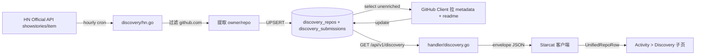

# AI Discovery（Show HN）设计

> **2026-07-15 当前结论**：Show HN 已以 `discovery` 来源进入 Weekly 三源聚合，原计划的 Activity 独立 Discovery 客户端不再实施。后续来源通用化、队列、图标、筛选与置顶统一以 [`Weekly 多来源扩展、AI 情报采集与置顶运营正式方案`](../../2-产品/需求讨论/正式方案/Weekly多来源扩展与AI情报采集正式方案.md) 为准。
>
> 创建：2026-06-11
> 状态：历史设计；后端采集与 Weekly 客户端聚合均已落地
> 版本：v1.2
> 关联：

---

## 修订说明（v1.2，2026-06-12）

**变更类型：架构简化 — 移除 LLM 分类模块。**

**变更原因：**
1. Discovery 定位调整：从「需要 AI 分类的垂直发现频道」变为「Show HN 原始数据聚合」，与阮一峰周刊、zread trending 统一为同一模式——爬取外部源 → GitHub 补全 → 单一聚合接口暴露
2. 统一聚合表方案（`github_repos` 主表 + 数据源附表）要求所有数据源走相同流水线，LLM 分类是唯一引入外部 AI 调用的环节，拆掉后流水线完全一致
3. 7 分类体系维护成本高（prompt 迭代、分类重叠仲裁、confidence 阈值调参），Show HN 体量小（30 条/小时），分类 ROI 不足以支撑持续投入
4. 客户端 segmented control（8 个 AI 子分类）可用更简单的筛选替代（如按语言、按 stars 排序），不依赖服务端分类

**具体变更：**
- ❌ 删除：`internal/discovery/classifier.go`（LLM 分类器）
- ❌ 删除：§3 AI 分类体系（7 分类 + unknown + 优先级规则）
- ❌ 删除：§11 附录 A：LLM Prompt 模板
- ❌ 删除：`discovery_repos` 表中分类相关字段（`category` / `classify_confidence` / `classify_attempts` / `classify_next_retry_at` / `classify_error`）
- ❌ 删除：`DISCOVERY_*` 环境变量中 LLM 相关配置（`LLM_API_BASE` / `LLM_API_KEY` / `LLM_MODEL` / `DISCOVERY_CONFIDENCE_THRESHOLD` / `DISCOVERY_MAX_CLASSIFY_ATTEMPTS` / `DISCOVERY_CLASSIFY_COOLDOWN_DAYS`）
- ✅ 保留：HN 采集 + GitHub enrich 两阶段流水线
- ✅ 保留：`discovery_repos` / `discovery_submissions` 双表模型（去掉分类列）
- ✅ 保留：`GET /api/v1/discovery` / `GET /api/v1/discovery/{owner}/{repo}` / `POST /internal/sync/discovery` 三个端点
- ⚠️ 端点响应中 `discovery.category` / `discovery.classify_confidence` 字段移除，客户端不得依赖

**关联影响：**
- `.env.example` 移除 LLM 配置段，保留抓取与 enrich 配置
- `cmd/server/main.go` 移除 `LLM_API_KEY` 判断与 classifier 初始化，Discovery 不再依赖 LLM
- `internal/discovery/service.go` 三阶段简化为两阶段（collect → enrich）
- 客户端 §6 中栏 segmented 方案废除，改为简单列表 + 语言/stars 排序

> **v1.2 实施真值**：本文档中标注「❌ 删除」「⚠️ 移除」的章节与字段均不再有效。后端实施以 `supports/starcat-weekly-api/internal/discovery/` 当前代码为准。

---

## 文档版本演进

| 版本 | 日期 | 主要调整 | 触发人 / 触发原因 |
|---|---|---|---|
| v1.0 | 2026-06-11 | 把 v1 需求文档升级为可落地设计：四项核心决策（Q1 Activity 第 7 分类 / Q2 寄生 weekly-api / Q3 单标签互斥 / Q4 24h 窗口 + 合并记录）+ 完整 schema + 后端实现清单 + 客户端实现清单 + 文档同步清单 | dong4j 2026-06-11 拍板四项关键决策；v1 文档保留作为讨论历史不再维护 |
| v1.1 | 2026-06-11 | 后端实施评审修订：改用 HN 官方 API；仓库/投稿双表；显式 retry 状态机；endpoint 专用 `{repo, discovery}` DTO；Admin Key 独立；Activity 实际为第 8 个具体分类 | 代码审查发现 v1.0 的 Algolia、单表主键、unknown 状态复用、README 来源和共享 DTO 契约均会导致实现错误 |
| v1.2 | 2026-06-12 | **架构简化**：移除 LLM 分类模块，三阶段流水线简化为两阶段（collect → enrich），7 分类体系 + prompt 模板 + classifier 全部删除。统一聚合表方案要求所有数据源走相同流水线，LLM 是唯一外部 AI 调用，拆掉后与阮一峰/zread 模式完全一致 | dong4j 决策：Discovery 定位从「AI 分类发现频道」调整为「Show HN 原始聚合」，与周刊/zread 统一为同模式，降低维护成本 |
> - `docs/需求讨论/show-hn-发现源-需求初稿.md`（v1 原始需求，本设计是其升级版）
> - `docs/3-设计/详细设计/16-活动页设计.md`（Activity 现有 7 个具体分类，本设计是其第 8 个具体分类扩展）
> - `docs/3-设计/详细设计/18-三场景共用架构.md`（envelope / Bearer Auth / UnifiedRepoRow / RepoDetailScaffold / StarredRegistry，**本设计沿用**）
> - `docs/3-设计/详细设计/19-wiki集成.md`（zread spider + enricher + 单文件 createSchema 模式，**本设计仿写**）
> - 后端脚手架：`supports/starcat-weekly-api`（端口 5003，本设计在内新增 Discovery 双表 + 3 端点）

> **v1.2 实施真值**：后端代码位于 `supports/starcat-weekly-api/internal/discovery/`，本文件后续章节已按 v1.2 修订。客户端实施必须消费 `{repo, discovery}`，不得再给共享 `StarcatRepoCardDTO` 增加 `discovery` 字段。

---

## 1. 背景与目标

### 1.1 现状（截至 2026-06-11）

- `Activity` 模块已上线 7 个具体分类：`announcement` / `release` / `star` / `repository` / `following` / `suggestion` / `weekly`（另有聚合入口 `all`；详见 `docs/3-设计/详细设计/16-活动页设计.md`）
- `starcat-weekly-api`（端口 5003）已在做「外部数据源 → 入库 → envelope API」职责（阮一峰周刊 + zread Trending），与 Show HN 抓取语义对齐
- 4 个后端服务（trending / weekly / sharing / wiki）已统一 `envelope schema_version+data+meta` + `Authorization: Bearer` + `/api/v1/ping`（R-01 v1.2 / R-03）
- 4 个后端服务统一 `createSchema(s)` 单文件 schema 模式，无 `user_version` / 无 destructive migration（2026-06-10 决策）
- 客户端已上线 `UnifiedRepoRow` + `RepoDetailScaffold` + `StarredRegistry` 共用骨架（R-01 v2.0），跨场景 ✓ 标记由 registry 驱动；未 star 项目走 ephemeral repo 链路
- 客户端 `BackendAggregateRepoSource` 已实现「未 star 详情页降级聚合」链路（R-01 RISK-2 解除）
- 客户端「设置 → 服务连接」已支持 4 个后端服务的 BYOK API Key + URL + R-03 单步 `/api/v1/ping` 测试

### 1.2 问题

GitHub Star 用户面对「AI 项目井喷」时痛点突出：

1. **Trending 滞后**：`starcat-trending-api` 的 GitHub Trending 数据是「已经验证热门」的项目（一般要积累 100+ stars 才进 daily trending），错过早期发现窗口
2. **官方 Explore 不足**：GitHub 官方 Trending / Explore 不专注 AI 子领域，AI Agent / MCP / RAG 等垂类项目混在一起
3. **Show HN 是早期信号**：`https://news.ycombinator.com/show` 是开发者社区「项目刚上线找用户」的主战场，含大量 GitHub 链接，是 Trending 之前的 leading indicator
4. **AI 子领域分类缺失**（v1.2 已移除）：~~用户想按「我现在关心 AI Agent」或「我想看 MCP Server」过滤，没有现成数据源做这个粒度的归类~~ — v1.2 统一聚合表方案不再需要服务端 AI 分类

### 1.3 目标

1. **Show HN → GitHub 链路自动化**：每小时调用 HN 官方 API，过滤出含 GitHub URL 的帖子，提取 `owner/repo`，进入 enricher 补全队列
2. **复用现有客户端骨架**：作为 `Activity` 的第 8 个具体分类（`ActivityCategory.discovery`），row 用 `UnifiedRepoRow`，详情页用 `RepoDetailScaffold` + ephemeral repo 链路
3. **后端寄生 weekly-api**：新增 `discovery_repos` / `discovery_submissions` 双表 + 3 端点 + 1 cron，不开新服务、不动 trending-api
4. **与统一聚合表对齐**（v1.2 新增）：Discovery 数据最终进入 `github_repos` 统一主表，与其他数据源（阮一峰周刊、zread）走相同流水线模式

### 1.4 非目标

1. **不接入 Show HN 之外的源**：Product Hunt / Reddit LocalLLaMA / HuggingFace Trending / Awesome AI 列出但留待 v2
2. **不做 AI 分类**（v1.2 移除）：~~LLM 单标签分类、7 分类体系、confidence 阈值~~ 全部删除，统一聚合表模式不需要服务端分类
3. **不做客户端缓存**：每次走后端，weekly-api 已有 SQLite 持久化 + 最多 30 条 24h 内数据，体量很小
4. **不做中文翻译字段**（`description_zh`）：留待对接 wiki-api 时再加，当前不是核心痛点

---

## 2. 总体方案

### 2.1 架构数据流（v1.2：两阶段，无 LLM）



> v1.2 移除 Classifier 节点。流水线简化为 collect → enrich 两阶段，与阮一峰周刊 / zread 完全一致。

### 2.2 与现有架构的复用关系

| 现有能力 | AI Discovery 的复用方式 |
|---|---|
| `starcat-weekly-api` cron scheduler | 加一个每小时第 17 分 cron job，与 zread 周一 06:00 / 阮一峰每小时第 7 分错峰 |
| `starcat-weekly-api` GitHub Token Pool | enricher 直接调用现有 token pool（zread enricher 同款） |
| `starcat-weekly-api` Bearer Auth 中间件 | 两个 GET 使用普通 `API_KEYS`；Admin sync 复用同一中间件实现但使用独立 `ADMIN_API_KEYS` 白名单 |
| `starcat-weekly-api` envelope `schema_version + data + meta` | response 复用 `internal/model/envelope.go` 共享 envelope |
| `StarcatRepoCardDTO`（共享 DTO） | 作为 endpoint 专用 `DiscoveryItemDTO.repo` 嵌套字段复用；共享 DTO 与共享 `Meta` 均不加 Discovery 字段 |
| 客户端 `WeeklyAPI` actor | 加 `fetchDiscovery` / `fetchDiscoveryDetail` 两个方法，复用现有 actor 的 `apiKey` / `baseURL` / Bearer header / envelope 解码 |
| 客户端 `UnifiedRepoRow` + `RepoDetailScaffold` | row + 详情页直接复用，未 star 走 ephemeral repo |
| 客户端 `StarredRegistry` | ✓ 标记的派生信号，与 trending / weekly 一致 |
| 客户端 `BackendAggregateRepoSource` | 详情页 resolveRepo 链路同 trending / weekly |

### 2.3 关键决策摘要（Q1–Q4）

| 编号 | 决策点 | 选定方案 | 拒绝方案与理由 |
|---|---|---|---|
| Q1 | 导航位置 | Activity 第 8 个具体分类（第 9 个 enum case，含 `all`） | A. 升级顶栏一级会让顶栏拥挤；B. 在 trending 下做二级 tab 跟「趋势」语义重叠；C. 把 trending 也搬到 activity 改动太大 |
| Q2 | 后端归属 | 寄生 starcat-weekly-api | A. 独立 starcat-discovery-api 工程量大且要复制 4 件套；B. 寄生 trending-api 跟「已验证热门」语义不符 |
| Q3 | AI 分类 | ❌ v1.2 移除，不再做 AI 分类 | B. 多标签让 UI tab 重复出现 + LLM prompt 复杂；C. 规则先行 + LLM fallback 维护负担重；v1.2 统一聚合表模式不再需要服务端分类 |
| Q4 | 抓取边界 | 每小时取官方 showstories 前 30 条 + 24h 查询窗口；repo/submission 分表 | 单表 `(owner,repo)` 主键会把二次投稿的新分数拼到旧 hn_id，并因旧 published_at 无法重新进入 24h 窗口 |

---

## 3. AI 分类体系（❌ v1.2 移除）

> **本章全部内容已被 v1.2 修订移除。** LLM 分类器、7 分类体系、prompt 模板均不再使用。保留本章仅作历史参考，实施以 v1.2 两阶段流水线为准。

### 3.1 7 个主分类（不含 unknown）~~（已移除）~~

| 分类 | enum 值 | 定义 | 标杆项目 |
|---|---|---|---|
| AI Agent | `agent` | 多步推理、工具调用、规划任务的 Agent 框架 / 应用 | CrewAI, AutoGen, LangGraph, Mastra |
| AI Coding | `coding` | 代码生成、代码补全、CLI / IDE 编程助手 | OpenHands, Aider, Continue, OpenCode, Roo Code |
| AI MCP | `mcp` | Model Context Protocol 服务端 / 客户端 / 注册表 / 网关 | MCP Server, MCP Registry, MCP Gateway |
| AI RAG | `rag` | 检索增强生成、Knowledge Graph + RAG、向量库工程 | RAGFlow, GraphRAG, Dify RAG |
| AI Infra | `infra` | 模型推理 / 部署 / 调度 / 加速基础设施 | vLLM, LiteLLM, Ollama, Ray |
| AI Model | `model` | 开源大模型本体（含权重） | Qwen, DeepSeek, Llama, Gemma, GLM |
| AI Skill | `skill` | 可被 Agent / Assistant 直接加载和复用的能力包 | SkillsJars, Agent Skills, Prompt Packs, AI Workflow Templates |

### 3.2 unknown 分类

- LLM 返回 confidence < `DISCOVERY_CONFIDENCE_THRESHOLD`（默认 0.6）
- LLM 返回的 category 不在 7 类白名单内
- LLM 判断为非目标 AI 项目或置信度不足时进入 `rejected`，API 不展示
- 客户端默认不展示（segmented control 8 个 tab：`all / agent / coding / mcp / rag / infra / model / skill`，不显 `unknown`）

### 3.3 分类优先级（解决重叠）

LLM prompt 内显式写明优先级，处理多义场景（如 LangGraph 既是 Agent 框架又有 Skill 模板，OpenHands 是 Coding 但也含 Agent 编排）：

```
判定优先级（更具体的优先）：skill > mcp > agent > coding > rag > infra > model
```

- 一个项目同时是 Agent 框架 + Skill 包 → 归 `skill`（更具体）
- 一个项目同时是 MCP Server + Agent 容器 → 归 `mcp`（协议层比应用层更具体）
- 一个项目是 Coding 助手 + 内部用 RAG → 归 `coding`（用户感知层在 Coding）
- 一个项目是 RAG 系统 + 自带模型权重 → 归 `rag`（应用层比底座层更具体）

### 3.4 LLM Prompt 设计要点

- 输入：`description`（GitHub repo description）+ `topics`（前 10 个 topic）+ `readme_excerpt`（README 头 2000 字符，去除图片 / badge / TOC）
- 输出：严格 JSON `{"category": "agent|coding|mcp|rag|infra|model|skill|unknown", "confidence": 0.0-1.0, "reason": "<= 80 chars 中文"}`
- 模型：默认 `deepseek-chat`（成本最低 + 中文友好），可经 `LLM_MODEL` 环境变量切换
- Token 预算：input ~2500 tokens / output ~80 tokens / 单次 ~$0.0003（DeepSeek 价格）；30 条 / 小时 → 月成本 < $1
- 失败 fallback：保持 `category='unknown'`，状态写 `retryable`；连续 3 次后清零 attempts 并把 `classify_next_retry_at` 推迟 7 天

---

## 4. 数据库设计（v1.1 实现）

### 4.1 双表模型

schema 位于 `supports/starcat-weekly-api/internal/store/sqlite.go#createSchema`：

| 表 | 主键 | 职责 |
|---|---|---|
| `discovery_repos` | `(owner, repo)`，`COLLATE NOCASE` | GitHub metadata、README excerpt、enrichment 状态、AI 分类状态；同 repo 只处理一次 |
| `discovery_submissions` | `(hn_id, owner, repo)` | 每次 Show HN 投稿的标题、链接、分数、评论、发布时间；同 repo 可保留多次投稿 |

列表查询使用 `ROW_NUMBER() OVER (PARTITION BY owner, repo ORDER BY published_at DESC, hn_id DESC)`，只取 24h 窗口内每个仓库最新投稿。这样二次投稿会以新的 HN 链接重新进入列表，不会把新分数拼到旧记录。

### 4.2 显式流水线状态（v1.2：仅 enrichment 阶段）

v1.2 移除 classification 阶段，仅保留 enrichment 状态机：

| 阶段 | 状态 |
|---|---|
| enrichment | `pending / ready / retryable / unavailable` |

enrichment 失败保存 `attempts / next_retry_at / error`，达到阈值后冷却并设置重试时间。404 标记为 `unavailable` 不再重试。

### 4.3 Metadata 与 README

- Discovery GitHub 客户端复用 weekly-api 的 Token Pool 与 `RateLimitHandler`，但不复用写死 `model.Project` 的旧 `Enricher.enrichOne`。
- metadata 覆盖共享 Repo DTO 所需字段，包括 `updated_at / is_archived / is_fork / is_private`。
- README 通过 GitHub `/repos/{owner}/{repo}/readme` 拉取，只保存清洗后的前 2000 字符 `readme_excerpt`；README 404 不判定仓库不可用。
- `topics_json` 使用 JSON TEXT；API DTO 转换时恢复为 `[String]`。

---

## 5. 后端 weekly-api 实现清单

后端已于 2026-06-11 落地。所有路径均在 `supports/starcat-weekly-api/` 内。

### 5.1 新增文件

| 路径 | 职责 | 仿写参考 |
|---|---|---|
| `internal/discovery/hn.go` | 调 HN 官方 `showstories/item` API，从 item URL 与自发布正文提取 GitHub repo | 新增 |
| `internal/discovery/github.go` | 复用 Token Pool 拉 metadata + README，清洗并截取 2000 字符 | 新增 |
| `internal/discovery/classifier.go` | ~~纯标准库 OpenAI-compatible 调用 + JSON 白名单校验 + prompt injection 防护~~ **v1.2 移除** | — |
| `internal/discovery/service.go` | collect → enrich 两阶段编排与失败隔离（v1.2 移除 classify 阶段） | 新增 |
| `internal/model/discovery.go` | `DiscoveryItem` 行模型 + `DiscoveryEnvelope` | `internal/model/zread_trending.go` |
| `internal/handler/discovery.go` | 3 个 handler（list / single / admin sync） | `internal/handler/zread_trending.go` |
| `internal/handler/discovery_test.go` | 200 envelope + Bearer 鉴权 + category 参数校验 | `internal/handler/handler_test.go` |
| `internal/discovery/*_test.go` | HN/GitHub/LLM fixture + URL 去重 + README 清洗 | 新增 |

### 5.2 编辑现有文件

| 路径 | 改动 |
|---|---|
| `internal/store/sqlite.go` + `internal/store/discovery.go` | `createSchema` 加双表 + 4 索引；实现投稿 upsert、候选队列、状态更新、分页/分类/详情查询 |
| `internal/store/discovery_test.go` | 重复投稿取最新 + 分类冷却结束重新入队 |
| `cmd/server/main.go` | 注册 3 个新路由 + 启动 banner 加 3 行 + 启动期触发首次 sync |
| `internal/scheduler/cron.go` | 默认每小时第 17 分执行 + `tryLock("discovery")`，启动期异步跑首轮 |
| `.env.example` | 加 `ADMIN_API_KEYS`、LLM 配置、cron/batch/threshold/retry 配置 |
| `CHANGELOG.md` | 加 `[0.6.0] - 2026-06-XX` 段，列出 spider / classifier / store / handler 4 块 |
| `README.md` | 加端点章节（参照现有 `/api/v1/zread` 段格式） |
| `todo.list` | 标记完成项 |

### 5.3 三个新端点

| 方法 | 路径 | 鉴权 | 用途 |
|---|---|---|---|
| `GET` | `/api/v1/discovery?page=&page_size=` | Bearer | 列表查询（v1.2 移除 `category` 参数）；24h 窗口内的 Show HN 项目；`page_size` 上限 50 |
| `GET` | `/api/v1/discovery/{owner}/{repo}` | Bearer | 详情页单查（客户端 `BackendAggregateRepoSource` 用） |
| `POST` | `/internal/sync/discovery` | 独立 Admin Bearer | 内部 sync 触发；不允许使用会随客户端分发的普通 API Key |

### 5.4 端点响应 envelope

复用 `internal/model/envelope.go` 共享 envelope；`data` 使用 endpoint 专用 `[]DiscoveryItemDTO`，共享 `StarcatRepoCardDTO` 与共享 `Meta` 均不增加 Discovery 字段：

```json
{
  "schema_version": 1,
  "data": [
    {
      "repo": {
        "gh_repo_id": 1234567,
        "full_name": "owner/repo",
        "description": "..."
      },
      "discovery": {
        "hn_id": 39823456,
        "hn_title": "Show HN: ...",
        "hn_url": "https://news.ycombinator.com/item?id=39823456",
        "hn_score": 142,
        "hn_comments": 38,
        "hn_published_at": "2026-06-11T08:30:00Z"
      }
    }
  ],
  "meta": {
    "page": 1,
    "page_size": 30,
    "total": 28,
    "generated_at": "2026-06-11T15:00:00Z"
  }
}
```

→ 客户端新增 `DiscoveryItemDTO { repo: StarcatRepoCardDTO, discovery: DiscoveryExtension }`，不得修改共享 `StarcatRepoCardDTO`。`UnifiedRepoRow` 从 `item.repo` 构造卡片，从 `item.discovery` 构造 HN badge。

---

## 6. 客户端 Starcat 实现清单

工程量约半天。**核心策略**：Activity 第 8 个具体分类 + 中栏 segmented + 全套 row / 详情页 / API 复用现有骨架。

### 6.1 Activity 第 8 个具体分类（侧栏）

| 文件 | 改动 |
|---|---|
| `Starcat/Features/Activity/ActivityModels.swift` | `ActivityCategory` 加 `case discovery`；`ActivityKind` 加 `case discovery` |
| `Starcat/Resources/Localizable.xcstrings` | 加 `activity.category.discovery`（zh-Hans「AI 发现」/ en「AI Discovery」）+ `activity.discovery.subtitle`（zh-Hans「来自 Show HN 的 AI 项目」） |
| `Starcat/Core/Settings/AppSettings.swift` | 新增 `lastDiscoverySubcategoryRaw` UserDefaults key（持久化中栏 segmented 选中态） |
| `Starcat/Features/Home/SidebarView.swift` | Activity 分类列表自动追加（`ActivityCategory.allCases` 驱动）；SF Symbol 用 `sparkles` 或复用 `LanguageIconView(language: "Solidity")` 暖橙色 |

### 6.2 中栏 Discovery 子页（v1.2：简化为列表，无 segmented）

v1.2 移除 LLM 分类后，不再需要 AI 子分类 segmented control。Discovery 子页为简单列表 + 排序。

新建目录 `Starcat/Features/Activity/Discovery/`：

| 文件 | 职责 |
|---|---|
| `DiscoveryViewModel.swift` | `@Observable`，订阅 `WeeklyAPI.fetchDiscovery()`；`@MainActor` 曝光 `[DiscoveryItemDTO]`；下拉刷新走 `WeeklyAPI.fetchDiscovery(forceRefresh:)` |
| `DiscoveryView.swift` | 列表用 `UnifiedRepoRow(card: item.repo.asCardData(badge: .discoveryHN(...)))`；`.focusEffectDisabled()` 强制规则；空态 / 加载态 / 错误态三种 UI 复用既有 placeholder；顶部可选排序 Picker（`stars` / `hn_score` / `pushed_at`） |

> v1.2 移除 `DiscoveryCategory.swift`（8 子分类枚举），客户端不再需要 category 参数。

### 6.3 网络层（复用 WeeklyAPI）

| 文件 | 改动 |
|---|---|
| `Starcat/Core/Network/WeeklyAPI.swift` | 加 `func fetchDiscovery(category: DiscoveryCategory, page: Int = 1) async throws -> [DiscoveryItemDTO]` 与 `func fetchDiscoveryDetail(owner: String, name: String) async throws -> DiscoveryItemDTO?` 两方法，复用现有 `apiKey` / `baseURL` / Bearer header / envelope 解码 |
| `Starcat/Core/Network/AppEndpoints.swift` | `Weekly.Paths` 加 `discovery = "/api/v1/discovery"` / `discoveryByOwnerRepo = "/api/v1/discovery/%@/%@"` 两常量 |
| `Starcat/Core/Network/Models/DiscoveryDTO.swift`（新建） | `DiscoveryItemDTO { repo: StarcatRepoCardDTO, discovery: DiscoveryExtension }`；extension 含 hnId / hnTitle / hnUrl / hnScore / hnComments / hnPublishedAt / category / classifyConfidence |
| `Starcat/Core/Network/Sources/BackendAggregateRepoSource.swift` | 在 `weeklyAPI.fetchProject` 失败时追加 `weeklyAPI.fetchDiscoveryDetail` 链路尝试（仅 Discovery 列表 → 未 star 详情页路径用） |

### 6.4 卡片右侧徽标（HN score + comments）

| 文件 | 改动 |
|---|---|
| `Starcat/Shared/Models/RepoCardViewData.swift` | `enum TrailingBadge` 加 `case discoveryHN(score: Int, comments: Int)` |
| `Starcat/Shared/Components/UnifiedRepoRow.swift` | trailing badge 渲染区分支加 `.discoveryHN`：竖排 `▲ {score}` 上行 + `💬 {comments}` 下行；色板复用 trending change badge 的 .secondary 灰 |
| `DiscoveryView.swift` | 从 `item.repo` 调现有 `asCardData`，并用 `item.discovery` 显式构造 `discoveryHN` badge；共享 DTO 不感知 Discovery |

### 6.5 详情页（直接复用 RepoDetailScaffold）

- 不新建详情页（与 trending / weekly 同款）
- 详情页通过 `selectedActivityItem.kind == .discovery` 分支进入 `RepoDetailView`，传 `repoSource = .backendAggregate(owner, repo)`（resolver 链路）
- trailingActions：`.share` / `.ai`（用户登录 + repo 已 star 时显示，按 R-01 v2.0 规则）+ `.weeklyIssue` 类比的 `.hnDiscussion(hnUrl)`（外链 HN 帖子，与登录态独立）
- 这意味着 `RepoDetailAction` 加一个新 case `.hnDiscussion(URL)`：
  - `Starcat/Shared/Components/RepoDetailScaffold.swift` 加 `.hnDiscussion` case 渲染（SF Symbol `bubble.left.and.bubble.right`，i18n key `repo.detail.action.hnDiscussion`）

### 6.6 数据来源与开源致谢评估

本功能仅通过运行时 HTTP 调用 Hacker News、GitHub 和 LLM 服务，不新增 SPM、嵌入资源、生成代码或 vendored 源码，因此不触发 `AboutDependency.all` 的强制登记规则。若产品希望展示数据来源，可另加产品级来源说明，但不得伪造 license / copyright 字段。

### 6.7 测试

| 文件 | 用例 |
|---|---|
| `StarcatTests/WeeklyAPITests.swift` | 加 3 case：`fetchDiscoveryDecodesEnvelope` / `fetchDiscoverySendsBearer` / `fetchDiscoveryHandles401WithEnvelope` |
| `StarcatTests/DiscoveryViewModelTests.swift`（新建） | 加 5 case：默认 `all` / 切换到 `agent` 重新 fetch / fetch 失败展示错误态 / ✓ 标记派生 / 子分类切换持久化到 `AppSettings.lastDiscoverySubcategoryRaw` |
| 全量基线 | 客户端从当前 422 → ≥430（+8 关键路径，按实际为准） |

---

## 7. cron 调度与时间窗口

### 7.1 cron 时刻表（与现有 weekly-api 任务错峰）

| 任务 | 频次 | 时刻 | 备注 |
|---|---|---|---|
| 阮一峰周刊 sync | 每日 | 09:00 | 现有 |
| zread Trending sync | 每周 | 周一 06:00 | 现有 |
| **Show HN Discovery sync** | **每小时** | **第 17 分** | **本设计新增；可用 `DISCOVERY_CRON` 覆盖** |

每小时执行流程（v1.2 两阶段）：

```
HH:17:00  Collector:  HN showstories/item → 提取 github URL → UPSERT 双表
随后       Enricher:   取 pending/retryable 候选 → GitHub Client 拉 metadata + README → UPDATE
```

> v1.2 移除 Classifier 阶段。每条仓库的 enrich 失败只影响自身；collector 整体失败会结束本轮并等待下次 cron。

### 7.2 24h 时间窗口（Q4 决策）

- collector 取 `showstories` 前 `DISCOVERY_HN_LIMIT` 条（默认 30），不在采集阶段丢弃历史投稿
- Query 层按调用时刻减 24h 过滤 `published_at`，并对同 repo 只保留窗口内最新投稿
- 表本身保留全部历史，未来想切窗口策略不改 schema
- 客户端不感知窗口：只看到「今天的 AI 发现」，自然循环

### 7.3 配额与限流

- HN 官方 Firebase API：每轮 1 次 `showstories` + 最多 30 次 `item`；客户端设置明确 User-Agent，并设置请求超时
- GitHub API：复用 weekly-api 现有 token pool（zread enricher 同款），enricher 限速由 token pool 自管
- LLM API：~~每小时最多 30 次调用 + 每条 ~$0.0003 → 月成本 < $1~~ **v1.2 移除，不再调用 LLM**

---

## 8. 关键约束与已知边界

### 8.1 不做的事（YAGNI）

1. **多标签分类**（v1.2 移除）：~~一个 repo 只属于一个主分类（Q3 决策）~~ 不再需要
2. **star 跃迁触发再分类**（v1.2 移除）：~~分类后稳定，仅 LLM 失败时 7 天冷却后重试~~ 不再需要
3. **Show HN 之外的源**：留待 v2（Product Hunt / Reddit / HuggingFace / Awesome AI）
4. **中文翻译字段**：`description_zh` 留待对接 wiki-api 时再加
5. **客户端缓存**：每次走后端，weekly-api SQLite 已持久化
6. **后台人工修正 UI**（v1.2 移除）：~~分类错误反馈机制留待 v2~~ 不再需要
7. **HN 评论摘要**：详情页只放外链按钮，不抓评论
8. **多 model A/B 测试**（v1.2 移除）：~~第一版只 `LLM_MODEL` 单一变量~~ 不再需要

### 8.2 同 repo 在 Trending 与 Discovery 同时出现

- UI 不打交叉标记（Activity 与 Trending 是不同侧栏入口，自然分离）
- 详情页可能从两个入口进入同一 repo，但两个入口都走 `BackendAggregateRepoSource` → `Repo` 链路 → 同一份 `repos` 表本地记录（已 star 时）；ephemeral 路径（未 star 时）按入口数据源构造，不会冲突
- 详情页 ✓ 标记由 `StarredRegistry` 派生，与入口无关

### 8.3 未登录态的 Discovery 列表

- Discovery 产品页面可对 GitHub 未登录用户展示，但 weekly-api HTTP 请求仍必须携带应用配置的普通 `API_KEYS` Bearer；这与 GitHub 登录态是两套概念
- 未登录时 row 不显 ✓（`StarredRegistry.contains` false）
- 详情页 trailingActions 中 `.share` / `.ai` / 私人三段（Tags / Notes / Releases）按 R-01 v2.0 规则隐藏
- `.hnDiscussion(hnUrl)` 与登录态独立，未登录可点击

### 8.4 LLM 失败的 user-visible 影响（v1.2 移除）

> **本章已移除。** v1.2 不再使用 LLM 分类，不存在 LLM 失败场景。所有 enrich 阶段完成的 repo 直接进入 API 可查询状态。

### 8.5 Show HN collector 解析鲁棒性

- 不解析 HN HTML，避免页面结构变更导致采集器失效；只依赖官方 `showstories/item` JSON 字段
- collector 失败不影响 web 服务可用性（cron 记录错误 + 下次重试）
- 失败日志写 `log.Printf`，运维可监控
- fixture 测试覆盖 URL / 自发布正文提取、保留字路径过滤和大小写去重（`internal/discovery/hn_test.go`）

### 8.6 license / 法律边界

- 使用 HN 官方 API，不抓取页面 HTML；上线前仍需以届时有效的 API 文档与 Y Combinator 条款为准
- 只持久化投稿标题、链接、分数、评论数和发布时间，不拉取或保存评论正文
- §6.6 的 About 规则只约束集成进客户端的第三方代码/资源，本运行时数据源不伪装成开源依赖

---

## 9. 实施顺序建议

1. **后端 §5**（独立可验证：curl + 单测，约 1 天）
   1. discovery/hn.go（HN 官方 API + GitHub URL 提取）
   2. store/sqlite.go + store/discovery.go（双表 + 状态机 + 查询）
   3. discovery/github.go + classifier.go + service.go + 单测
   4. handler/discovery.go 3 端点 + 单测
   5. cmd/server/main.go 路由注册 + scheduler/cron.go 加 hourly job
   6. .env.example + CHANGELOG + README + todo.list
   7. e2e：本地起服务 → curl 三端点 → SQLite 检查
2. **客户端 §6.1 + §6.3**（接通数据层，约 2 小时）
3. **客户端 §6.2 + §6.4 + §6.5**（中栏 UI + row badge + 详情页 hnDiscussion，约 3 小时）
4. **客户端 §6.6**（按产品需要评估数据来源说明；不登记伪造的开源依赖）
5. **客户端 §6.7(详见 `docs/3-设计/详细设计/06-核心模块设计.md`)**（测试，约 1 小时）
6. **文档同步 §10**

## 10. 文档同步清单

- 本文档（`docs/3-设计/详细设计/25-Show-HN发现源设计.md`）= 单一信任源
- `docs/需求讨论/show-hn-发现源-需求初稿.md` 顶部追加 v2 指针段，原文保留作历史
- `docs/功能实现总览.md` P1 章节维护 AI Discovery 10 个条目；当前 5 个后端项已完成、5 个客户端项待实施
- `docs/3-设计/详细设计/16-活动页设计.md` §3.2 表格追加 `discovery` 行；§5.1 `ActivityKind` 加 `case discovery`；末尾加「v2 修订指针 → 21 文档」
- 实施完成后回填本文档勾选状态 / 实际工程量 / 偏离设计的微调记录

## 11. 附录 A：LLM Prompt 模板（❌ v1.2 移除）

> **本章全部内容已被 v1.2 修订移除。** LLM 分类器与 prompt 模板不再使用，保留仅作历史参考。

```
你是 GitHub AI 项目分类专家。把项目归入下面 7 个分类之一。

判定优先级（更具体的优先）：skill > mcp > agent > coding > rag > infra > model

分类定义与示例：
- agent：多步推理、工具调用、规划任务的 Agent 框架。例：CrewAI, AutoGen, LangGraph, Mastra
- coding：代码生成、代码补全、CLI / IDE 编程助手。例：OpenHands, Aider, Continue, OpenCode, Roo Code
- mcp：Model Context Protocol 服务端 / 客户端 / 注册表 / 网关。例：MCP Server, MCP Registry
- rag：检索增强生成、Knowledge Graph + RAG、向量库工程。例：RAGFlow, GraphRAG, Dify RAG
- infra：模型推理 / 部署 / 调度 / 加速基础设施。例：vLLM, LiteLLM, Ollama, Ray
- model：开源大模型本体（含权重）。例：Qwen, DeepSeek, Llama, Gemma, GLM
- skill：可被 Agent / Assistant 直接加载和复用的能力包 / Prompt Pack / Workflow Template

输入：
- description: {description}
- topics: {topics_joined}
- readme_excerpt: {readme_first_2000_chars}

输出严格 JSON（不要 markdown 包裹）：
{"category": "agent|coding|mcp|rag|infra|model|skill|unknown", "confidence": 0.0-1.0, "reason": "<= 80 字中文"}

如果不确定或者明显不是 AI 项目，category 填 unknown，confidence 写实际数值。
```

## 12. 附录 B：与原始需求文档的差异对照

| 原始需求 line | 内容 | v1.1 设计修订 | 修订原因 |
|---|---|---|---|
| line 14 | "在 Activity 模块中新增 AI Discovery 频道" | ✓ 保留：`ActivityCategory.discovery` 为第 8 个具体分类 | 代码现状含 7 个具体分类 + `all` |
| line 17–19 | "Activity ├── GitHub Trending └── AI Discovery" | ❌ 删除：Trending 仍是顶栏一级，与 Activity 无关 | 与现状矛盾 |
| line 22–25 | "唯一新增数据源：Show HN" | ✓ 保留 | 一致 |
| line 27–34 | "抓取流程：Show HN → GitHub Filter → Metadata → README → LLM 分类" | ✓ 细化为 official API collector + enricher + classifier 三段 | 实施层落点 |
| line 36–82 | "AI 分类体系 7 类 + 标杆项目" | ✓ 保留 + 追加优先级规则（skill > mcp > agent > ...） | 解决重叠 |
| line 86–101 | "ai_discovery 表结构 12 列" | ❌ 重写为 `discovery_repos` + `discovery_submissions` 双表 + 4 索引 | 仓库元数据与多次投稿事实生命周期不同 |
| line 105–106 | "UI 分类：All / Agent / Coding / MCP / RAG / Infra / Model / Skill" | ✓ 保留：8 个 segmented tab；`unknown` 默认隐藏 | 一致 |
| line 110–117 | "每小时执行 5 段流水线" | ✓ 收敛为 collect/enrich/classify 三阶段，默认每小时第 17 分 | 与现有 cron 错峰 |
| line 119–121 | "去重：唯一键 owner/repo" | ❌ 仓库 `(owner,repo)` 去重，投稿 `(hn_id,owner,repo)` 独立保留 | 防止二次投稿的新信号被旧 hn_id/published_at 吞掉 |
| line 123–132 | "未来扩展 Product Hunt / Reddit / ..." | ✓ 列入 §1.4(详见 `docs/2-产品/需求讨论/正式方案/Pro付费墙验证清单.md`) 非目标，留 v2 | YAGNI |

---

*最后更新：2026-06-12（v1.2，移除 LLM 分类模块，两阶段流水线；客户端待实施）*
