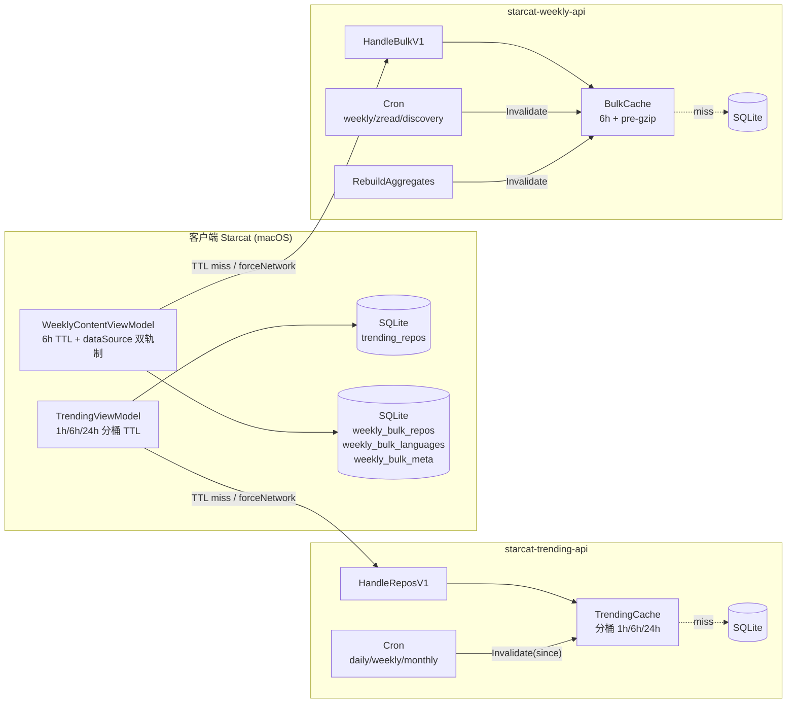
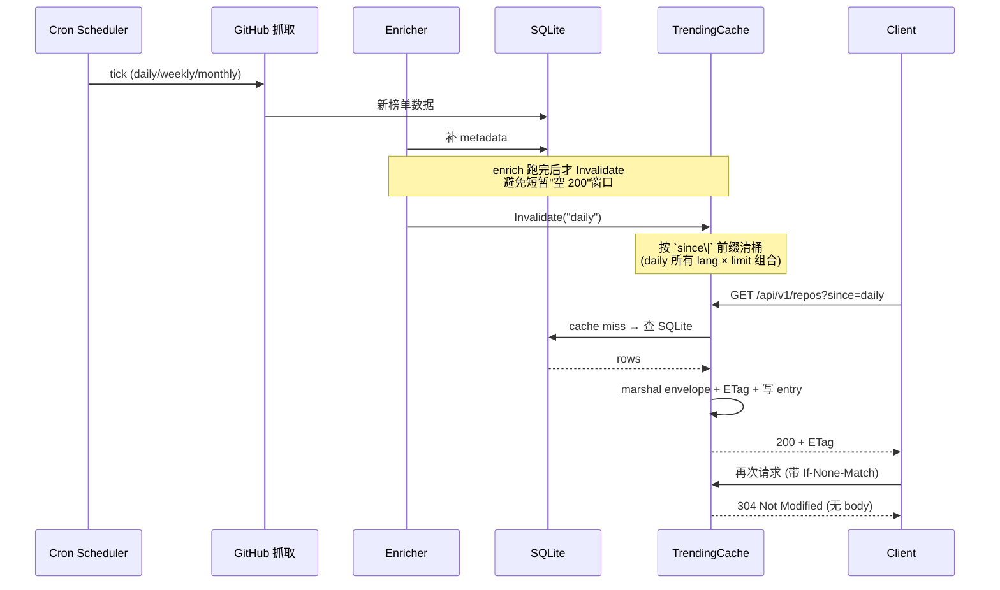
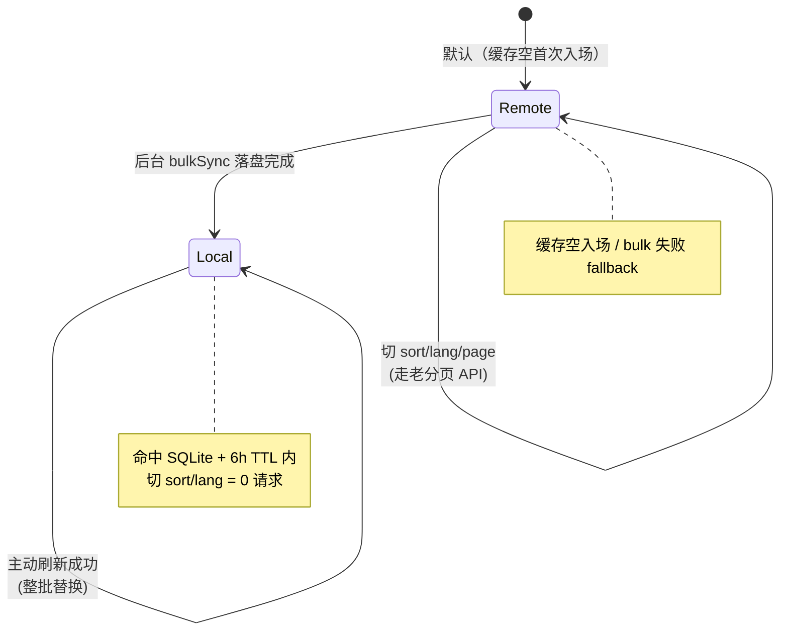
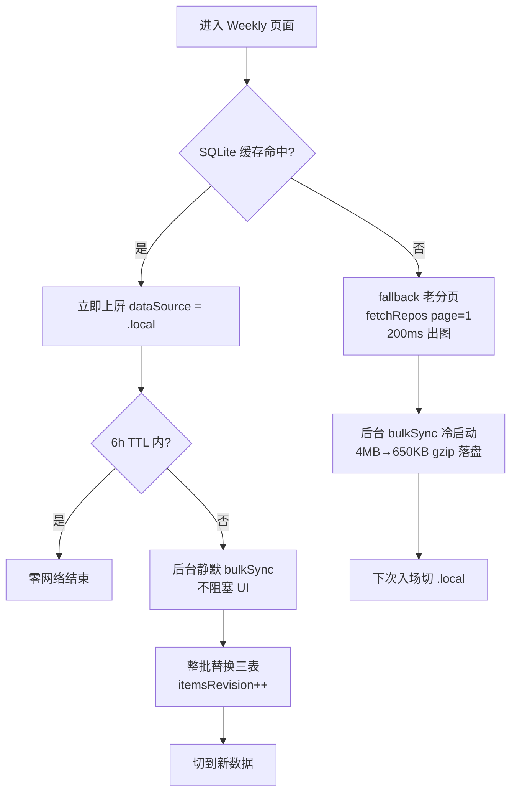

# Trending / Weekly 多级缓存改造（R-06）

> **状态**：✅ 已落地（2026-06-15，4 子项 R-06.1~R-06.4 全部完成）
> **范围**：客户端 Starcat（macOS）+ 后端 `starcat-trending-api` / `starcat-weekly-api`
> **关联**：进度文档 `工程进度/功能实现总览.md` §6.6 R-06；变更日志 2026-06-15 20:30 / 21:10 / 22:00 / 22:45
> **互补文档**：07-Trending 数据本地缓存设计（基础持久化方案，本文不再赘述表结构来源）

---

## 1. 背景与问题

R-06 之前的 Trending / Weekly 数据链路存在三个明显短板：

- **Trending 客户端无 TTL**：每次进 Trending 页面或切 period / language 都无条件走网络，即使 6 分钟前刚看过同一个桶；列表数据已经持久化到 SQLite（见 [07-Trending 数据本地缓存设计](07-Trending数据本地缓存设计.md)），但 ViewModel 把它当成"离线兜底"而非"主动短路"。
- **Weekly 客户端完全无缓存**：约 4000 条三源聚合数据每次都通过 `/api/v1/repos` 分页拉取；切 sort / language 重置到 page 1 → 又一轮分页；离线场景列表全空。
- **两个后端均无内存缓存**：N 个客户端打过来的同 query 全部命中 SQLite 查询 + JSON marshal；cron 跑完后无机制让前端感知"数据已更新"。

需求收敛后定型「**客户端 SQLite TTL + 后端内存缓存 + 渐进式 SWR**」三层架构，覆盖 Trending 与 Weekly 两条业务线。

---

## 2. 总体架构

### 2.1 三级缓存梯度

| 层 | 位置 | TTL | 主要承担 |
|---|---|---|---|
| L1 | 客户端 ViewModel `lastRefreshedAt` 时间戳 | **Trending 1h/6h/24h 分桶 / Weekly 6h** | 与服务端数据刷新窗口一致，同一桶在有效期内不再发请求 |
| L2 | 客户端 GRDB SQLite | 不设单独 TTL（与 L1 共享） | 跨 App 重启的持久化、离线兜底、本地 sort / filter / page |
| L3 | 后端 `*-api` 进程内 `sync.RWMutex` map / 单 entry | **trending 1h/6h/24h 分桶 / weekly 6h** | "数据新鲜度节奏"——主动 Invalidate 是主线、TTL 只是兜底 |

> ⚠️ **L1 与 L3 独立判定**：L1 决定"客户端要不要发请求"，L3 决定"server 要不要打 SQLite"，两端互不感知。用户主动刷新（toolbar / `.refreshable`）绕过 L1 但仍享受 L3，6h 内秒回。

### 2.2 改造拓扑

---

## 3. Trending 改造（R-06.1 + R-06.2）

### 3.1 客户端：cachePolicy enum + 1h/6h/24h 分桶 TTL

把原来"二选一"的 `forceNetwork: Bool` 升级为意图明确的枚举：

| Policy | 触发场景 | 行为 |
|---|---|---|
| `.respectTTL` | `.task` 首次入场、`selectedPeriod / selectedLanguage` 切桶 | 命中当前周期 TTL 内的桶 → 零请求；过期 → 拉网络 |
| `.forceNetwork` | toolbar 刷新按钮、`.refreshable` 下拉、错误重试 | 用户主动意图，必发请求 |

**两个关键设计决策**：

1. **TTL 判断放在 ViewModel 层**（而非 `TrendingRepository`）：ViewModel 本来就持有 `lastRefreshedAt` 做"新鲜度展示"，复用最直接；Repository 协议保持纯净，避免引入"返回值标记 from-cache vs from-network"的复杂度（否则 ViewModel 不知道要不要 `lastRefreshedAt = Date()`，会出现 always-fresh 死循环 bug）。
2. **`isStale` 使用当前周期 TTL 的 80%**：daily / weekly / monthly 分别在约 48 分钟 / 4.8 小时 / 19.2 小时后显示橙色"接近过期"提示，过期后入场自动走网络。

### 3.2 后端：TrendingCache 分桶 TTL + ETag

`sync.RWMutex + map[key]*entry` 内存表，key = `since|lang|limit`，entry 存 **pre-marshaled JSON 字节流** + weak ETag + lastModified + builtAt。

**分桶 TTL 与 cron 节奏精准 1:1 对齐**：

| since | cron | Cache TTL | 备注 |
|---|---|---|---|
| daily | 每小时 | **1h** | 节奏紧 |
| weekly | 每 6 小时 | **6h** | |
| monthly | 每 2 天 | **24h** | cap 到 24h 让客户端最大滞后 1 天 |
| unknown | — | 1h | fallback |

**ETag 用 weak validator**（`W/"<sha256[:8]>"` 16 hex 字符）：HTTP 7232 §2.1 weak 语义"允许语义等价不要求字节级一致"，16 字符 = 8 byte = 64 bit 冲突概率足够低。

### 3.3 主动失效流程

### 3.4 包间循环 import 解耦

scheduler 包**不直接 import** handler 包——scheduler 包定义最小接口 `CacheInvalidator { Invalidate(since string) }`，handler 包的 `*TrendingCache` 自动满足，`main.go` 注入实例。这是 Go 包设计常见的"接口在调用方"原则。

---

## 4. Weekly 改造（R-06.3 + R-06.4，重头戏）

Weekly 数据量级（~4000 条）远大于 Trending（300 条/桶），原"分页 API 每次拉 30 条"的访问模式无法支撑离线 + 快速切 sort/lang。改造分两步：先在后端做"一次性返回全量"的 bulk endpoint，再在客户端做"渐进式 SWR + 双轨制"。

### 4.1 后端：/api/v1/repos/bulk + BulkCache

新增 `GET /api/v1/repos/bulk` 端点，**不接受任何 query 参数**——一次性返回全量 repos + languages 聚合（envelope.data = `{repos, languages}`），让客户端拿全量后本地做 source / lang / sort / page 过滤。

`BulkCache` 与 `TrendingCache` 的关键差异：

| 维度 | TrendingCache | BulkCache |
|---|---|---|
| 桶 | `map[since\|lang\|limit]*entry` 多桶 | 单 `*entry` 指针不分桶（全量未过滤） |
| TTL | 1h / 6h / 24h | **6h**（与 trending weekly 桶同档） |
| 预处理 | pre-marshaled JSON | pre-marshaled JSON + **pre-compressed gzip** |
| 失效 | enrich 完后 `Invalidate(since)` | 3 个 sync 触点 + admin RebuildAggregates 后 `Invalidate()` |

**6h TTL 选择理由**：主动失效（scheduler + admin）是主线、TTL 只是"漏触点"兜底窗口；客户端与服务端统一为 6h，避免客户端跨过服务端刷新窗口仍展示旧快照。后端 cache 主要扛"多客户端并发 / 主动刷新风暴"；6h 与 trending weekly 桶对齐方便运维心智统一。**2026-06-15 由初版 60s 调整，2026-07-18 客户端由 12h 收敛到 6h**（见 §8 演进记录）。

**pre-gzip 收益**：4MB JSON → ~650KB（gzip BestSpeed level 1，16% 原大小）；hit 路径直接 `w.Write(gzipped)` 省每次响应的压缩 CPU。level 6 多压 5% 但 CPU 翻 3 倍，不划算。

### 4.2 三个永久陷阱（写入文件头注释）

| 陷阱 | 修复 |
|---|---|
| **路由顺序**：`/api/v1/repos/bulk` 必须挂在 `/api/v1/repos/{gh_repo_id}` **之前** | 否则被 Go 1.22 PathValue 通配吃掉，`ParseInt("bulk")` 失败 → 400 |
| **`Vary: Accept-Encoding`** header 必须设 | 否则 CDN 给不支持 gzip 的客户端返回 gzipped 响应造成 garbage |
| **scheduler 触点统一在 `sync()` 末尾失效** | sync 链路包含 Start 冷启动 / cron / Sync admin 三条调用，统一一处避免漏 |

### 4.3 客户端：3 张 SQLite 表 + 渐进式 SWR + 双轨制

#### 4.3.1 表结构（migration `v1-initial` 直接加）

| 表 | PK | 用途 |
|---|---|---|
| `weekly_bulk_repos` | `gh_repo_id` | 整批落盘 4000 条聚合 repo + 3 个 snapshot JSON 列；3 个索引覆盖 latest_event_at / stars / language 三条最热查询 |
| `weekly_bulk_languages` | `key` | 后端 languages 聚合 1:1，附 `sort_order` 保留后端原始顺序 |
| `weekly_bulk_meta` | `id = "singleton"` 单行 | etag / last_fetched_at / generated_at / total |

产品未上线 → 直接改 v1-initial 不写 ALTER（遵循 AGENTS.md 铁律 #1）。

#### 4.3.2 dataSource 双轨制

#### 4.3.3 入场流程（渐进式 SWR）

#### 4.3.4 主动刷新与 sort/lang 切换

- **主动刷新**（toolbar / pull-to-refresh）：永远走 bulkSync（forceNetwork 语义），失败 fallback 分页 API（保证按钮不空手而归）；完成后强制切到 `.local`，6h TTL 重新计时。
- **切 sort/lang**：`.local` 模式走本地纯过滤 + 排序（瞬时无网络），切片到 page 1 上屏；`.remote` 模式仍走旧分页 API。
- **本地排序与后端 SQL 排序精确对齐**：`latest_event_at DESC + ghRepoId tiebreaker` / `stars DESC + ghRepoId` / `pushed_at ISO8601 字典序 DESC + ghRepoId`——否则用户切到 .local 后切 sort 的视觉结果会与 .remote 模式不一致。

#### 4.3.5 关键写入语义

- **整批替换**：bulk 拉到新数据后单 transaction 内"DELETE 三表 → 批量 INSERT"，与后端"当前全量快照"语义对齐；不做增量 upsert。
- **网络失败 fallback 缓存**：与 `TrendingRepository` 一致的"离线兜底"语义——缓存非空即返回缓存，缓存空才抛错。
- **三个 Snapshot 升级 Codable**：`WeeklySnapshot / ZreadSnapshot / DiscoverySnapshot` 原本只 `Decodable`，落 SQLite JSON 序列化需要 `Encodable`；这是 R-06.4 唯一接受的 wire DTO 修改，CodingKeys 不变保证 wire round-trip 一致。

---

## 5. 缓存关键决策一览

| 维度 | 选择 | 理由 |
|---|---|---|
| Trending 客户端 TTL | 分桶 1h/6h/24h | 与后端分桶更新节奏一致，daily 不再被统一 24h TTL 遮蔽 |
| Weekly 客户端 TTL | 6h | 与服务端 bulk 快照窗口一致，避免跨刷新周期展示旧快照 |
| `isStale` 阈值 | 当前周期 TTL 的 80% | 接近过期预警，非"已过期" |
| Trending 后端 TTL | 分桶 1h/6h/24h | 与 cron 1:1 对齐，monthly cap 24h 让客户端最大滞后 1 天 |
| Weekly 后端 TTL | 6h | 主动失效是主线、TTL 只是"漏触点"兜底；与 trending weekly 桶对齐；初版 60s 容易被主动刷新风暴击穿造成反复 build CPU 浪费 |
| ETag 类型 | weak (`W/`) | HTTP 7232 §2.1，允许语义等价 |
| ETag 长度 | SHA256 前 8 字节 = 16 hex | 64 bit 冲突概率足够低 |
| Trending 缓存粒度 | (since, lang, limit) 多桶 | 切 language 不污染其它桶 |
| Weekly 缓存粒度 | 单 entry 不分桶 | bulk endpoint 本身就是"全量未过滤" |
| Weekly 落盘策略 | 3 表整批 transactional replace | bulk 语义本就是"快照"，增量 upsert 复杂度无收益 |
| 客户端 conditional GET 304 | **不做** | 客户端 TTL 总闸已经做"是否要发请求"决策，304 只用于"绝对要发 + server 没变"的极少数场景，代码翻倍收益微小 |
| 是否做 LRU / 持久化磁盘 | **都不做** | TrendingCache MB 级；BulkCache 单 entry 服务重启冷启动自然回填 |

---

## 6. 后端配置改造

### 6.1 starcat-trending-api

| 变更 | 说明 |
|---|---|
| 新增 `internal/handler/trending_cache.go` | `TrendingCache` 类型 + 分桶 TTL + ETag 工具 |
| `HandleReposV1` 签名加 `cache *TrendingCache` | cache hit 直接 `w.Write(entry.payload)` 跳过 SQLite + JSON marshal |
| `scheduler.New(...)` 加第 4 参数 `cache CacheInvalidator` | nil 退化 `noopCacheInvalidator` 不阻塞调用方 |
| `syncDaily / syncWeekly / syncMonthly` 末尾 `cache.Invalidate(since)` | enrich 跑完后才失效（不在 scrape 中间，避免"空 200"窗口） |
| `main.go` 新增 `trendingCache := handler.NewTrendingCache()` 单例 + 注入两路 | scheduler + handler 共享同一实例 |

无新增 env 变量；不持久化磁盘。

### 6.2 starcat-weekly-api

| 变更 | 说明 |
|---|---|
| 新增 `internal/handler/bulk_cache.go` | `BulkCache` 类型 + pre-gzip + ETag |
| 新增 `internal/handler/bulk.go` | `HandleBulkV1` + `writeBulkResponse` helper |
| `store.Store` 接口加 `QueryAllRepos()` | 不分页 / 不过滤 / `latest_event_at DESC + gh_repo_id DESC` |
| `ReposHandler` 加 `bulkCache *BulkCache` 字段 + `NewReposHandlerWithBulkCache` 构造 | `HandleRebuildAggregates` 跑完后 `bulkCache.Invalidate()`（admin 路径） |
| `Scheduler` 加 `bulkCache BulkCacheInvalidator` + `scheduler.New(...)` 第 8 参数 | 3 个 sync 触点末尾失效（`sync()` / `runZreadFetch()` / `runDiscovery()`） |
| `main.go` 路由 `/api/v1/repos/bulk` 注册**必须**早于 `/api/v1/repos/{gh_repo_id}` | Go 1.22 PathValue 通配陷阱 |

无新增 env 变量；不持久化磁盘。

### 6.3 客户端

| 变更 | 说明 |
|---|---|
| `AppEndpoints.Weekly.Paths.reposBulk = "/api/v1/repos/bulk"` | 新路径 |
| `WeeklyAPI.fetchBulkRepos()` | URLSession 自动 gzip 解压（CFNetwork 透明） |
| migration v1-initial 加 3 张 `weekly_bulk_*` 表 | 直接改 v1，不写 ALTER |
| `AppDependencies` 注入 `WeeklyBulkRepository` 单例 | 与 `weeklyAPI` actor 共享让 baseURL / apiKey 热更新双路径同时生效 |
| `WeeklyContentViewModel` SWR 双轨制重写 | enum `WeeklyDataSource` / 6h TTL / 4 个入口分支调度 |

---

## 7. 验证

### 7.1 测试覆盖

| 项目 | 测试数 | 关键覆盖点 |
|---|---|---|
| starcat-trending-api | 6 新 cache 用例 + 4 sub-TTL（go test 112/12 packages 全绿） | cache hit / ETag 304 / Invalidate / 桶隔离 / TTLFor 分桶 |
| starcat-weekly-api | 13 新 case（go test 41/15 packages 全绿） | envelope / cache hit / ETag 304 / gzip 字节级一致 / Vary / Invalidate / TTL expiry / store error 双路径 |
| 客户端 Trending | 5 个 TTL 边界 case（xcodebuild test 843 全绿） | TTL 内 skip / TTL 过期 fetch / 边界刚过 / 边界刚到 / `lastRefreshedAt = nil` |
| 客户端 Weekly | 9 case（xcodebuild test 852 全绿） | cache miss/hit / 整批替换 / 网络失败 fallback / lastRefreshedAt / clearCache / TTL 常量 |

### 7.2 dong4j 端到端验收路径

**Trending**：① 5 分钟前刷过的桶不再走网络；② daily / weekly / monthly 分别在 1h / 6h / 24h 内复用缓存；③ toolbar 刷新仍走网络（绕过 TTL）；④ 超过当前周期 TTL 的 80% 显示橙色预警，TTL 过期后上屏旧缓存并后台刷新；⑤ 后端 `curl -H "If-None-Match: <etag>"` → 304 + 无 body；⑥ cron 跑完 syncDaily 后下次客户端拿到新数据。

**Weekly**：① 首次入场缓存空 → 老分页 200ms 出图 + 后台 bulkSync ~4MB→650KB gzip 落盘；② 杀进程重进缓存命中 → 立即上屏切 `.local` + 零请求；③ TTL 内切 sort/lang 瞬时无网络；④ 主动刷新 bulk endpoint → 整批替换 → 入场动画；⑤ TTL 过期入场 → 上屏立即出 + 后台静默 bulkSync；⑥ 网络失败 + 缓存非空 → fallback 不抛错；⑦ admin POST `/internal/rebuild-aggregates` 后 bulk endpoint 立即失效。

---

## 8. 已知限制与后续方向

- **BulkCache TTL 演进**：2026-06-15 后端由初版 60s 调整到 6h，主动失效（scheduler + admin）作为主线、TTL 作为漏触点兜底；2026-07-18 客户端由 12h 收敛到 6h，避免两级窗口错位。
- **不做 conditional GET 304**：客户端 Trending 1h/6h/24h、Weekly 6h 的 TTL 总闸已经短路绝大多数请求，少数 forceNetwork 路径下省的几 KB body 不值得引入"304 → fallback 本地缓存 + 还要维护 ETag"的双路径复杂度。如未来真要做，建议先在客户端"刷新但 server 没变"的频次实测后再评估。
- **不做后端 LRU / 持久化**：TrendingCache 总量级 MB；BulkCache 单 entry，服务重启冷启动下一次请求自然回填，无需磁盘。
- **Weekly bulk endpoint 不接受 query 参数**：所有过滤 / 排序 / 分页都在客户端做。如未来字段超出 4000 条 / payload 超 10MB，应考虑：① 分多个 endpoint（如 `/repos/bulk?source=weekly`）；② 引入 `Last-Modified` + 304 让长期开 App 的客户端按需更新。
- **客户端 `lastBulkFetchedAt` 不挂 UI**：当前只用于 6h TTL 判断，将来如需"上次同步：N 小时前"展示，已经预留接口 `WeeklyContentViewModel.lastBulkFetchedAt` 公开。

---

## 9. 关联文档与代码索引

- [07-Trending 数据本地缓存设计](07-Trending数据本地缓存设计.md) — 基础持久化方案（trending_repos 表结构来源）
- [21-weekly-api 后端 3 源聚合改造](21-weekly-api-后端3源聚合改造.md) — `QueryRepos` 排序分支定义（本地排序对齐基准）
- [22-weekly 客户端 3 源聚合对接](22-weekly-客户端3源聚合对接.md) — Weekly 客户端三源数据模型
- 进度文档 `工程进度/功能实现总览.md` §6.6 R-06 — 4 子项实现说明 + 验证记录
- 客户端：`Starcat/Features/Trending/TrendingViewModel.swift` / `Starcat/Features/Activity/WeeklyContentView.swift` / `Starcat/Core/Sync/{TrendingRepository,WeeklyBulkRepository}.swift`
- 后端：`supports/starcat-trending-api/internal/handler/trending_cache.go` / `supports/starcat-weekly-api/internal/handler/bulk_cache.go`

---

*最后更新：2026-07-18（客户端 Trending 改为 1h/6h/24h 分桶，Weekly 改为 6h；后端 TTL 不变）*
