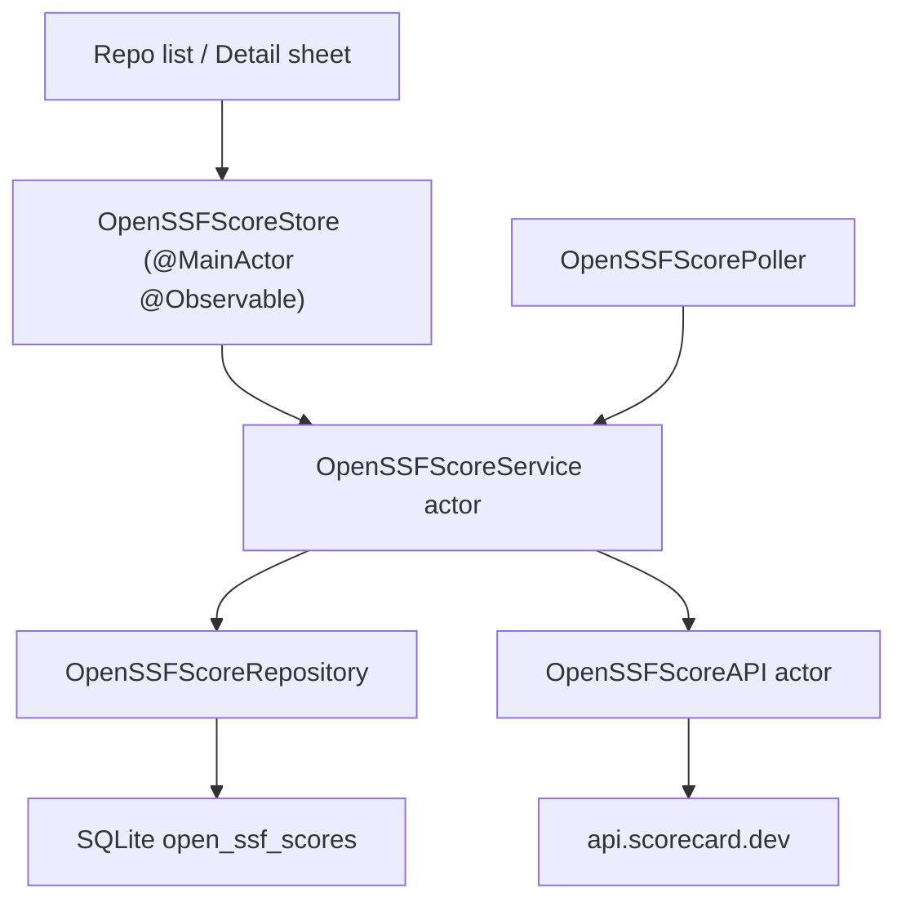

# OpenSSF Scorecard 安全评分设计

> 版本：v1.0  
> 日期：2026-06-16  
> 状态：已实现  
> 范围：已 star 仓库的 OpenSSF Scorecard 缓存、列表徽章、详情页查看与后台刷新。

---

## 1. 背景

OpenSSF Scorecard 是 OpenSSF 维护的开源项目安全健康度评分系统，会从维护活跃度、依赖更新、分支保护、发布签名、CI 配置等维度给 GitHub 仓库计算检查项与总分。

Starcat 的目标不是重新实现 Scorecard 算法，而是在用户自己的 star 库中把公开评分作为轻量参考信号展示出来：

- 列表中快速看到安全评分。
- 详情页可以查看总分、雷达图与检查项。
- 没有本地记录时异步拉取，不能卡住主进程和 UI。
- 后台只刷新已 star 仓库，避免对发现型临时 repo 做无意义缓存。

## 2. 目标与非目标

### 2.1 目标

1. 对已 star 仓库展示 OpenSSF 总分徽章。
2. 徽章放在列表 row 的 `full_name` 行最右侧，只显示图标 + 分数，不显示说明文字。
3. 详情页 toolbar 提供安全评分入口，打开 sheet 后展示总分、日期、雷达图和检查项列表。
4. 本地无记录时通过后台 `Task` 异步拉取，不阻塞列表滚动、详情页首屏或主线程。
5. 成功、未收录、网络失败、解析失败都落库并进入冷却期，避免重复打同一个端点。
6. 所有用户可见文案走 `Localizable.xcstrings`，遵循项目 i18n 军规。

### 2.2 非目标

1. 不自己计算 Scorecard 分数。
2. 不对未 star 的 ephemeral repo 做持久化评分缓存。
3. 不把 OpenSSF 分数并入 AI 摘要、排序或过滤。
4. 不做历史趋势图；当前只保存最近一次 API 响应。
5. 不做兼容旧字段或旧 API 迁移；项目未上线，schema 直接进入 v1 初始表。

## 3. 数据源与合规

### 3.1 API

默认端点：

```text
GET https://api.scorecard.dev/projects/github.com/{owner}/{repo}
```

客户端实现：`Starcat/Core/Network/OpenSSFScoreAPI.swift`。

请求不带 GitHub token，也不复用 `GitHubAPIClient`。这是 OpenSSF 的公开 API，独立于 Starcat 的 GitHub OAuth 权限。

### 3.2 开源致谢

本功能集成 OpenSSF Scorecard API 数据源，已按项目“开源致谢同步规则”在关于页 Credits 里登记：

- `Starcat/Features/About/AboutView.swift`
- 名称：`OpenSSF Scorecard API`
- 项目地址：`https://github.com/ossf/scorecard`

## 4. 本地数据模型

新增表：`open_ssf_scores`

```sql
CREATE TABLE open_ssf_scores (
  repo_id INTEGER PRIMARY KEY REFERENCES repos(id) ON DELETE CASCADE,
  fetch_status TEXT NOT NULL,
  aggregate_score REAL,
  checks_json BLOB,
  score_date TEXT,
  fetched_at TEXT NOT NULL,
  last_error TEXT
);

CREATE INDEX idx_open_ssf_scores_status_fetched
ON open_ssf_scores(fetch_status, fetched_at);
```

模型：`Starcat/Core/Database/Models/OpenSSFScoreRecord.swift`

字段语义：

| 字段 | 说明 |
|------|------|
| `repo_id` | GitHub repo id，外键到 `repos.id` |
| `fetch_status` | `success` / `notIndexed` / `networkError` / `parseError` |
| `aggregate_score` | OpenSSF 总分，只有成功态有值 |
| `checks_json` | 原始 API JSON，详情页从这里解析 checks |
| `score_date` | API 返回的评分日期 |
| `fetched_at` | 最近一次尝试时间，成功和失败都会更新 |
| `last_error` | 网络或解析错误摘要 |

`fetched_at` 采用“最近一次尝试时间”而不是“最近一次成功时间”，原因是失败态也要冷却。否则详情页 cache miss 或后台轮询会在网络失败时连续重打同一个端点。

## 5. 分层架构



### 5.1 API 层

文件：`Starcat/Core/Network/OpenSSFScoreAPI.swift`

职责：

- 拼接 `/projects/github.com/{owner}/{repo}`。
- 校验 owner / repo 字符集，非法输入本地拒绝。
- 2xx 解码 `OpenSSFScorePayload`，同时保留原始 `Data`。
- 404 映射为 `notIndexed` 业务态。
- 其它 HTTP 状态映射为 `serverError`。

### 5.2 Repository 层

文件：`Starcat/Core/Sync/OpenSSFScoreRepository.swift`

职责：

- 按 repo id 读取单条或批量评分缓存。
- upsert 评分记录。
- 查询需要后台刷新的 starred repos。
- 统一 TTL 策略。

TTL：

| 状态 | TTL |
|------|-----|
| `success` | 7 天 |
| `notIndexed` | 30 天 |
| `networkError` / `parseError` | 1 天 |

### 5.3 Service 层

文件：`Starcat/Core/Sync/OpenSSFScoreService.swift`

职责：

- `refreshIfNeeded(repo:force:)`：按 TTL 判断是否刷新。
- `refresh(repo:)`：强制刷新并落库。
- `refreshStaleStarredRepos(limit:)`：后台批量刷新。
- `inFlight` 按 repo id 合并同仓库并发请求。
- `OpenSSFScoreRateLimiter` 限制到最多 5 req/s。

后台批量刷新使用最多 3 个并发任务。限流器仍是全局 actor，保证即便并发任务同时启动，也不会超过约定请求速率。

### 5.4 Store 层

文件：`Starcat/Core/Sync/OpenSSFScoreStore.swift`

职责：

- 主线程可观察缓存：`records: [Int64: OpenSSFScoreRecord]`。
- 列表只调用 `loadCachedScores(for:)`，同步读取 DB 缓存，不触发网络。
- 详情页 cache miss 时调用 `prefetchIfNeeded(repo:)`，该方法只启动后台 `Task` 并立即返回。
- 手动刷新调用 `refresh(repo:force:true)`，仅影响当前 sheet 的 loading 状态。

这是“不影响主进程和 UI”的关键边界：列表和详情首屏不等待 OpenSSF 网络响应，网络刷新始终在 actor + unstructured task 里完成，结果回来后再更新 observable 字典。

## 6. UI 设计

### 6.1 列表徽章

文件：`Starcat/Shared/Components/UnifiedRepoRow.swift`

位置：

- `full_name` 行最右侧。
- `Spacer(minLength: 8)` 后渲染。
- 仅显示 `checkmark.shield.fill` + `8.4` 这种分数。
- 不显示“OpenSSF”“Scorecard”“安全评分”等文字描述。

设计理由：

- `full_name` 是 repo 身份行，评分是 repo 级信号，放同一行最符合扫描路径。
- 只用图标 + 分数降低噪音，避免列表变成说明型 UI。
- 没有缓存或非成功态不显示徽章，避免用错误态污染列表。

### 6.2 详情页入口

文件：`Starcat/Shared/Components/RepoDetailScaffold.swift`

新增 action：

```swift
case securityScore
```

渲染为 `checkmark.shield` 图标按钮，使用 `.buttonStyle(.plain)` 后紧跟 `.focusEffectDisabled()`，符合项目 Focus Ring 规范。

只对 `repo.isStarred == true` 的详情页展示。未 star 的 trending / weekly / activity ephemeral repo 不展示入口。

### 6.3 详情 sheet

文件：`Starcat/Features/Home/OpenSSFScoreSheet.swift`

内容：

1. 标题和 repo full name。
2. 手动刷新按钮。
3. 成功态：总分、评分日期、雷达图、检查项列表、OpenSSF Viewer 外链。
4. 未收录 / 网络失败 / 解析失败：展示状态文案与刷新入口。
5. 无缓存且正在异步刷新：展示轻量 loading。

sheet 根视图挂 `.appLocaleEnvironment()`，避免 macOS sheet 不继承父 scene locale 的问题。

### 6.4 雷达图

雷达图只消费 `score >= 0` 的检查项。OpenSSF 使用 `-1` 表示无法评估或不适用，这类项不进入雷达图，避免把“不可评估”误画成低分。

## 7. 刷新策略

### 7.1 列表

列表只读缓存：

- Manage：`RepoListView`
- Trending：`TrendingView`
- Weekly：`WeeklyContentView`
- Activity：`ActivityView`

这些列表通过 `.task(id: itemsRevision)` 批量读取已存在评分，不发网络。这样列表滚动、切页、筛选不会被 OpenSSF API 影响。

### 7.2 详情页

详情 sheet 打开后：

1. 先 `loadCachedScores(for:)`。
2. 如果无记录，调用 `prefetchIfNeeded(repo:)`。
3. `prefetchIfNeeded` 立即返回，后台任务完成后更新 store。

手动刷新是显式用户动作，允许在当前 sheet 上展示 loading。

### 7.3 后台轮询

文件：`Starcat/Core/Scheduling/OpenSSFScorePoller.swift`

使用 `NSBackgroundActivityScheduler`：

- 登录后启动。
- 登出后停止。
- 默认每日调度一次。
- 每次最多刷新 100 个 stale starred repos。

后台失败只写日志，不弹 UI banner。OpenSSF 评分是辅助信息，不能影响主流程。

## 8. 国际化约束

新增 key 均在 `Starcat/Resources/Localizable.xcstrings`，提供 en + zh-Hans：

- `openssf.action.*`
- `openssf.badge.*`
- `openssf.sheet.*`
- `openssf.score.*`
- `openssf.check.*`
- `openssf.loading.*`
- `openssf.status.*`
- `openssf.chart.*`
- `openssf.error.*`

代码规则：

1. SwiftUI 静态文案直接用 `Text("openssf.xxx")` / `Label("openssf.xxx", systemImage:)`。
2. 返回 `String` 的 errorDescription 和日期模板使用 `String.l10n("openssf.xxx")`。
3. sheet 根视图必须挂 `.appLocaleEnvironment()`。
4. 不使用 `String(localized:)` 或 `NSLocalizedString`。

## 9. 测试策略

新增测试：

- `OpenSSFScoreAPITests`
  - 成功响应路径、header 和 payload 解码。
  - 404 映射为 `notIndexed`。
  - 非法 owner / repo 本地拒绝且不发请求。
  - 损坏 JSON 映射为 decoding error。

- `OpenSSFScoreRepositoryTests`
  - success 记录 round-trip。
  - 批量 records 字典读取。
  - stale starred repos 查询遵守 TTL 与 `is_starred`。
  - `OpenSSFScoreRefreshPolicy` 不同状态 TTL。

- `DatabaseMigrationsV1Tests`
  - v1 初始 schema 包含 `open_ssf_scores`。

## 10. 已知约束

1. OpenSSF API 返回的 checks 文案当前按上游原文展示，不做二次翻译。
2. `notIndexed` 可能代表上游暂未收录，不代表项目“不安全”。
3. 列表不展示错误态；错误态只在详情 sheet 中可见。
4. 后台刷新只处理已 star repo；发现型临时 repo 必须先 star 后才进入缓存体系。
5. 当前只保留最近一次结果；趋势对比留作后续单独设计。

## 11. 涉及文件

核心实现：

- `Starcat/Core/Database/Models/OpenSSFScoreRecord.swift`
- `Starcat/Core/Network/OpenSSFScoreModels.swift`
- `Starcat/Core/Network/OpenSSFScoreAPI.swift`
- `Starcat/Core/Sync/OpenSSFScoreRepository.swift`
- `Starcat/Core/Sync/OpenSSFScoreService.swift`
- `Starcat/Core/Sync/OpenSSFScoreStore.swift`
- `Starcat/Core/Scheduling/OpenSSFScorePoller.swift`
- `Starcat/Features/Home/OpenSSFScoreSheet.swift`

集成点：

- `Starcat/App/AppDependencies.swift`
- `Starcat/Features/Home/HomeView.swift`
- `Starcat/Shared/Models/RepoCardViewData.swift`
- `Starcat/Shared/Models/RepoDetailViewData.swift`
- `Starcat/Shared/Components/UnifiedRepoRow.swift`
- `Starcat/Shared/Components/RepoDetailScaffold.swift`
- `Starcat/Features/Home/RepoListView.swift`
- `Starcat/Features/Trending/TrendingView.swift`
- `Starcat/Features/Activity/WeeklyContentView.swift`
- `Starcat/Features/Activity/ActivityView.swift`
- `Starcat/Features/About/AboutView.swift`
- `Starcat/Resources/Localizable.xcstrings`

测试：

- `StarcatTests/OpenSSFScoreAPITests.swift`
- `StarcatTests/OpenSSFScoreRepositoryTests.swift`
- `StarcatTests/DatabaseMigrationsV1Tests.swift`
