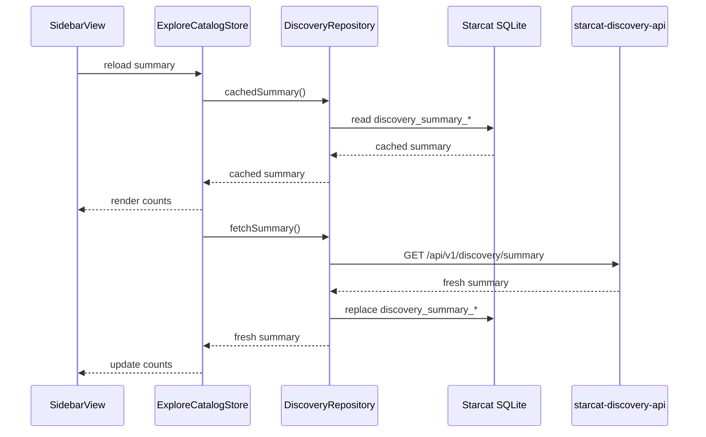

# 探索发现与榜单详细设计

> 日期: 2026-06-30
> 状态: 已实施，按本次补强同步更新
> 范围: 新增 `supports/starcat-discovery-api/` 后端服务 + Starcat macOS 探索入口改造

## 1. 目标与边界

本设计落地「探索」入口:

- `发现`: 主题 + 平台推荐流。
- `趋势`: 首期保留现有 `starcat-trending-api` 调用链。
- `热门`: 新增长期热门榜单。
- `新发布`: 新增最近稳定 release 榜单。

明确不做:

- 不在 `starcat-trending-api` 中扩展发现 / 热门 / 新发布。
- 不在客户端直连 GitHub Search API。
- 不做用户级行为采集和个性化排序。
- 不写兼容旧 discovery 字段或迁移旧数据。本项目尚未上线,新服务直接按新 schema 建库。

## 2. 后端服务: `starcat-discovery-api`

### 2.1 目录结构

新增目录:

```text
supports/starcat-discovery-api/
  .dockerignore
  .env.example
  .gitignore
  CHANGELOG.md
  CODE_OF_CONDUCT.md
  CONTRIBUTING.md
  LICENSE
  README.md
  SECURITY.md
  TODO.md
  Dockerfile
  Makefile
  fly.toml
  go.mod
  go.sum
  docs/
    DEPLOY_FLY.md
    DEPLOY_RENDER.md
    custom-domain.md
    deploy-env.md
    api.md
    ranking.md
  scripts/
    deploy.sh
  cmd/server/main.go
  internal/
    config/
    handler/
    middleware/
    model/
    store/
    github/
    tokenpool/
    ingest/
    ranking/
    scheduler/
    version/
```

规范对齐现有 `starcat-trending-api`、`starcat-weekly-api`、`starcat-recommend-api`:

- Go 标准库 `net/http`。
- 统一 envelope。
- Bearer API key。
- SQLite 使用 `modernc.org/sqlite`。
- Fly.io 使用 volume 持久化。
- README / CONTRIBUTING / SECURITY / LICENSE 完整,因为服务需要开源。

### 2.2 环境变量

| 变量 | 必填 | 默认值 | 说明 |
|---|---:|---|---|
| `PORT` | 否 | `5006` | HTTP 端口 |
| `STORE_FILE` | 否 | `./discovery.db` | SQLite 路径;Fly 使用 `/data/discovery.db` |
| `API_KEYS` | 是 | 无 | Starcat 客户端 Bearer key 白名单 |
| `ADMIN_API_KEYS` | 是 | 无 | `/internal/*` 管理接口 key |
| `GITHUB_TOKENS` | 是 | 无 | GitHub PAT 池,逗号分隔 |
| `SYNC_ENABLED` | 否 | `true` | 是否启动定时同步 |
| `SYNC_CRON` | 否 | `17 */3 * * *` | 默认每 3 小时跑一轮轻同步 |
| `FULL_SYNC_CRON` | 否 | `23 2 * * *` | 每日全量刷新 |
| `CACHE_TTL_SECONDS` | 否 | `10800` | `/bulk` 进程内缓存 TTL（3 小时） |
| `MAX_SEARCH_CALLS_PER_MINUTE` | 否 | `28` | GitHub Search API 保护阈值 |
| `RATE_LIMIT_FLOOR` | 否 | `50` | token 剩余额度低于该值停止非必要请求 |
| `FEED_TARGET_SIZE` | 否 | `500` | 每个平台每日 feed 候选规模 |

同步语义:

- 轻同步: `SYNC_CRON` 触发,只 upsert 本轮命中的仓库并刷新 ranking,不删除旧 catalog。用于降低 GitHub API 波动对线上数据的影响。
- 全量同步: `FULL_SYNC_CRON` 或 `mode=scheduled-full/full/manual-full` 触发,先完成本轮 GitHub seed 搜索和 repo enrichment,再按本轮候选 repo id 删除不再命中的 catalog 记录。候选集为空时必须失败并跳过删除,防止 GitHub 异常导致线上数据被清空。
- 删除依赖 SQLite 外键级联清理 release、ranking、snapshot、exposure 等公开缓存数据。用户本地 stars、tags、notes、status 不在 discovery-api 内,不受影响。

### 2.3 Fly.io 配置

`fly.toml`:

```toml
app = 'starcat-discovery-api'
primary_region = 'nrt'

[env]
  GOGC = '100'
  GOMAXPROCS = '1'
  PORT = '5006'
  STORE_FILE = '/data/discovery.db'

[processes]
  app = './server'

[[mounts]]
  source = 'starcat_discovery_data'
  destination = '/data'

[http_service]
  internal_port = 5006
  force_https = true
  auto_stop_machines = 'off'
  auto_start_machines = true
  min_machines_running = 1
  processes = ['app']

  [http_service.concurrency]
    type = 'connections'
    hard_limit = 25
    soft_limit = 20

  [[http_service.checks]]
    interval = '30s'
    timeout = '5s'
    grace_period = '10s'
    method = 'GET'
    path = '/healthz'

[[vm]]
  size = 'shared-cpu-1x'
  memory = '512mb'
  cpu_kind = 'shared'
  cpus = 1
  memory_mb = 512
```

512MB 是有意选择: discovery 服务有 GitHub enrich、ranking、SQLite 查询和短期内存缓存,比 `trending-api` 的 HTML 爬取路径更重。

## 3. 数据模型

### 3.1 核心表

```sql
CREATE TABLE repos (
    gh_repo_id             INTEGER PRIMARY KEY,
    owner                  TEXT NOT NULL,
    name                   TEXT NOT NULL,
    full_name              TEXT NOT NULL UNIQUE,
    description            TEXT,
    homepage               TEXT,
    language               TEXT,
    stars                  INTEGER NOT NULL DEFAULT 0,
    forks                  INTEGER NOT NULL DEFAULT 0,
    watchers               INTEGER NOT NULL DEFAULT 0,
    subscribers            INTEGER NOT NULL DEFAULT 0,
    open_issues            INTEGER NOT NULL DEFAULT 0,
    owner_avatar           TEXT,
    default_branch         TEXT,
    license_spdx           TEXT,
    topics_json            TEXT NOT NULL DEFAULT '[]',
    pushed_at              TEXT,
    updated_at             TEXT,
    created_at             TEXT,
    is_archived            INTEGER NOT NULL DEFAULT 0,
    is_fork                INTEGER NOT NULL DEFAULT 0,
    latest_release_tag     TEXT,
    latest_release_at      TEXT,
    latest_release_url     TEXT,
    release_download_count INTEGER NOT NULL DEFAULT 0,
    has_asset_macos        INTEGER NOT NULL DEFAULT 0,
    has_asset_ios          INTEGER NOT NULL DEFAULT 0,
    has_asset_cli          INTEGER NOT NULL DEFAULT 0,
    has_asset_web          INTEGER NOT NULL DEFAULT 0,
    has_asset_server       INTEGER NOT NULL DEFAULT 0,
    has_asset_android      INTEGER NOT NULL DEFAULT 0,
    has_asset_windows      INTEGER NOT NULL DEFAULT 0,
    has_asset_linux        INTEGER NOT NULL DEFAULT 0,
    trending_score         REAL,
    popularity_score       REAL,
    release_score          REAL,
    discovery_score        REAL,
    search_score           REAL,
    indexed_at             TEXT NOT NULL,
    enriched_at            TEXT
);

CREATE INDEX idx_repos_language ON repos(language);
CREATE INDEX idx_repos_popularity ON repos(popularity_score DESC, gh_repo_id DESC);
CREATE INDEX idx_repos_release ON repos(latest_release_at DESC, gh_repo_id DESC);
CREATE INDEX idx_repos_search_score ON repos(search_score DESC, gh_repo_id DESC);
```

### 3.2 榜单排名表

```sql
CREATE TABLE category_rankings (
    category    TEXT NOT NULL,
    bucket      TEXT NOT NULL,
    gh_repo_id  INTEGER NOT NULL REFERENCES repos(gh_repo_id) ON DELETE CASCADE,
    rank        INTEGER NOT NULL,
    score       REAL,
    generated_at TEXT NOT NULL,
    PRIMARY KEY (category, bucket, gh_repo_id)
);

CREATE INDEX idx_category_rankings_lookup
    ON category_rankings(category, bucket, rank);
```

`bucket` 规则:

- language bucket: `language:Swift`, `language:TypeScript`, `language:__all__`
- platform bucket: `platform:macos`, `platform:linux`
- topic bucket: 使用 `topic_rankings` 单独保存

### 3.3 主题与平台

```sql
CREATE TABLE topic_rankings (
    topic       TEXT NOT NULL,
    platform   TEXT NOT NULL,
    gh_repo_id INTEGER NOT NULL REFERENCES repos(gh_repo_id) ON DELETE CASCADE,
    rank       INTEGER NOT NULL,
    score      REAL,
    generated_at TEXT NOT NULL,
    PRIMARY KEY (topic, platform, gh_repo_id)
);

CREATE INDEX idx_topic_rankings_lookup
    ON topic_rankings(topic, platform, rank);

CREATE TABLE repo_topic_codes (
    gh_repo_id INTEGER NOT NULL REFERENCES repos(gh_repo_id) ON DELETE CASCADE,
    code       TEXT NOT NULL,
    PRIMARY KEY (gh_repo_id, code)
);
```

主题代码:

| code | 显示 |
|---|---|
| `ai` | 人工智能 |
| `privacy` | 隐私 |
| `networking` | 网络 |
| `media` | 媒体 |
| `social` | 社交 |
| `reading` | 阅读 |
| `tools` | 工具 |

平台代码:

| code | 判断来源 |
|---|---|
| `macos` | `.dmg`, `.pkg`, Swift/AppKit/SwiftUI topic |
| `ios` | iOS topic, Swift package, release asset 辅助判断 |
| `cli` | release binary、CLI topic、Go/Rust/C 等语言 |
| `web` | web app / browser extension / npm package 线索 |
| `server` | Docker / server / self-hosted / backend 线索 |
| `android` | `.apk` 且排除 Alpine Linux apk |
| `windows` | `.exe`, `.msi` |
| `linux` | `.AppImage`, `.deb`, `.rpm`, `.pkg.tar.zst` |

### 3.4 Release 与快照

```sql
CREATE TABLE repo_releases (
    id                 INTEGER PRIMARY KEY AUTOINCREMENT,
    gh_repo_id         INTEGER NOT NULL REFERENCES repos(gh_repo_id) ON DELETE CASCADE,
    tag_name           TEXT NOT NULL,
    html_url           TEXT,
    published_at       TEXT,
    is_prerelease      INTEGER NOT NULL DEFAULT 0,
    is_draft           INTEGER NOT NULL DEFAULT 0,
    asset_count        INTEGER NOT NULL DEFAULT 0,
    download_count     INTEGER NOT NULL DEFAULT 0,
    platforms_json     TEXT NOT NULL DEFAULT '[]',
    fetched_at         TEXT NOT NULL,
    UNIQUE(gh_repo_id, tag_name)
);

CREATE TABLE repo_daily_snapshots (
    gh_repo_id          INTEGER NOT NULL REFERENCES repos(gh_repo_id) ON DELETE CASCADE,
    snapshot_date       TEXT NOT NULL,
    stars               INTEGER NOT NULL,
    forks               INTEGER NOT NULL,
    release_download_count INTEGER NOT NULL,
    latest_release_at   TEXT,
    star_velocity_ewma  REAL,
    download_velocity_ewma REAL,
    captured_at         TEXT NOT NULL,
    PRIMARY KEY (gh_repo_id, snapshot_date)
);
```

### 3.5 Feed 曝光

```sql
CREATE TABLE feed_exposure (
    gh_repo_id       INTEGER NOT NULL REFERENCES repos(gh_repo_id) ON DELETE CASCADE,
    platform         TEXT NOT NULL,
    topic            TEXT NOT NULL DEFAULT '__all__',
    last_shown_day   INTEGER,
    shown_count      INTEGER NOT NULL DEFAULT 0,
    last_position    INTEGER,
    updated_at       TEXT NOT NULL,
    PRIMARY KEY (gh_repo_id, platform, topic)
);
```

该表是全局曝光,不是用户级行为。它只用于避免 feed 长期被同一批项目垄断。

## 4. 排名算法

### 4.1 通用分数

```text
popularity = 0.45 * log(stars)
           + 0.25 * log(downloads)
           + 0.15 * log(forks)
           + 0.15 * release_recency
```

```text
discovery = 0.40 * momentum
          + cooldown * (0.30 * popularity + 0.20 * release_recency + 0.10 * topic_quality)
```

```text
new_release = 0.60 * release_recency
            + 0.25 * popularity
            + 0.15 * asset_quality
```

所有分数归一到 `[0, 1]` 后再写入表。接口可返回 0-100 的整数展示分。

### 4.2 比 komi-store 更强的点

1. **Languages 是一等维度**  
   komi-store 以平台为主,Starcat 需要平台和语言并行。

2. **解释字段**  
   接口返回 `reasons` 和 `signals`,让 UI 能展示「近期增长快」「最近发布」「下载量高」。

3. **主题与平台分离**  
   发现流可同时表达「AI + macOS」「工具 + CLI」。

4. **全局曝光冷却**  
   feed 不做用户追踪,但能降低重复展示。

5. **旧 Trending 双轨验证**  
   新趋势先后台产出,不直接替换当前 `trending-api`。

## 5. API 设计

### 5.1 Envelope

沿用现有后端:

```json
{
  "schema_version": 1,
  "data": {},
  "meta": {}
}
```

错误:

```json
{
  "schema_version": 1,
  "error": {
    "code": "BAD_REQUEST",
    "message": "invalid platform"
  }
}
```

### 5.2 Repo 卡片 DTO

```json
{
  "repo_id": 975734319,
  "full_name": "anomalyco/opencode",
  "owner": "anomalyco",
  "name": "opencode",
  "description": "The open source coding agent.",
  "language": "TypeScript",
  "stars": 180598,
  "forks": 22222,
  "open_issues": 7093,
  "owner_avatar_url": "https://avatars.githubusercontent.com/u/66570915?v=4",
  "html_url": "https://github.com/anomalyco/opencode",
  "topics": [],
  "topic_codes": ["ai", "tools"],
  "platforms": ["macos", "linux", "windows", "cli"],
  "latest_release_tag": "v1.17.11",
  "latest_release_at": "2026-06-25T12:09:29Z",
  "release_download_count": 68119962,
  "ranking_score": 94,
  "ranking_reasons": ["下载量高", "近期发布", "跨平台安装包完整"],
  "signals": {
    "stars_delta_7d": 1200,
    "download_velocity_7d": 430000,
    "days_since_release": 4
  }
}
```

DTO endpoint-specific,不扩写现有 `StarcatRepoCardDTO`。

### 5.3 路由

| Method | Path | 鉴权 | 说明 |
|---|---|---:|---|
| `GET` | `/healthz` | 否 | Fly 健康检查 |
| `GET` | `/api/v1/ping` | 是 | 客户端服务测试 |
| `GET` | `/api/v1/discovery/feed` | 是 | 发现流 |
| `GET` | `/api/v1/discovery/categories/most-popular` | 是 | 热门榜单 |
| `GET` | `/api/v1/discovery/categories/new-releases` | 是 | 新发布榜单 |
| `GET` | `/api/v1/discovery/summary` | 是 | 探索 Sidebar 总量与筛选项计数 |
| `GET` | `/api/v1/discovery/bulk` | 是 | Starcat 本地优先所需的全量公开 catalog 快照 |
| `GET` | `/api/v1/discovery/languages` | 是 | 可用语言及数量 |
| `GET` | `/api/v1/discovery/topics` | 是 | 主题元数据 |
| `GET` | `/api/v1/discovery/platforms` | 是 | 平台元数据 |
| `GET` | `/internal/discovery/trending-candidates` | Admin | 新趋势候选,仅后台质量对比 |
| `POST` | `/internal/sync/discovery` | Admin | 手动触发同步 |

### 5.4 查询参数

`feed`:

| 参数 | 默认 | 说明 |
|---|---|---|
| `platform` | `all` | 平台 |
| `topic` | `all` | 主题 |
| `language` | 空 | 可选语言过滤 |
| `sort` | `recommended` | `recommended/latest/popular` |
| `page` | `1` | 1-based |
| `limit` | `20` | 最大 50 |

### 5.5 Summary DTO

`GET /api/v1/discovery/summary` 专门服务 Starcat 左侧 Sidebar 中的 discovery 数据。它一次性返回发现 / 热门 / 新发布 3 个 discovery 子模式的 repo 总量和可展示筛选项数量,避免客户端为了数字触发多次分页请求。趋势的数量和语言计数继续来自 `starcat-trending-api`。

```json
{
  "schema_version": 1,
  "data": {
    "generated_at": "2026-06-30T10:00:00Z",
    "modes": [
      {
        "mode": "discover",
        "total": 1200,
        "topics": [
          { "key": "ai", "label": "人工智能", "count": 320 }
        ],
        "platforms": [
          { "key": "macos", "label": "macOS", "count": 180, "system_name": "desktopcomputer" }
        ]
      },
      {
        "mode": "popular",
        "total": 500,
        "languages": [
          { "key": "TypeScript", "label": "TypeScript", "count": 80 }
        ]
      },
      {
        "mode": "new_releases",
        "total": 300,
        "languages": [
          { "key": "Go", "label": "Go", "count": 44 }
        ]
      }
    ]
  }
}
```

后端实现要求:

- `discover.total` 读 `repos` 总量。
- `discover.topics` 聚合 `repo_topic_codes`。
- `discover.platforms` 聚合 `repo_platform_codes`。
- `popular/new_releases` 的语言计数基于对应 `category_rankings(category, bucket='__all__')` 聚合;ranking 尚未生成时返回空计数,不能回退到全量 `repos`,避免把分类管道异常伪装成有效数据。
- discovery 新趋势候选不写入 summary。Starcat 正式趋势继续走 `starcat-trending-api`;候选接口只用于后端质量对比。
- 该接口只查 SQLite,不触发 GitHub,不记录曝光。

### 5.6 Bulk DTO

`GET /api/v1/discovery/bulk` 是 Starcat 发现 / 热门 / 新发布的主读取入口。它一次返回:

- `repos`: 全量公开 discovery repo 快照,包含基础字段、主题、平台、release 字段、`trending_score / popularity_score / release_score / discovery_score`,以及 `categories / category_ranks`。
- `summary`: 与 `/api/v1/discovery/summary` 同结构的 Sidebar 汇总。

后端约束:

- 不接收筛选、排序、分页 query,避免客户端重新退回远端分页语义。
- 读取只查 SQLite,不触发 GitHub。
- `popular / new_releases` 归属必须来自 `category_rankings(bucket='__all__')`;客户端不得用 score 自行推断分类。`trending` 不进入 bulk 归属。
- 服务端内存缓存由 `CACHE_TTL_SECONDS` 控制,默认 10800 秒（3 小时）,同步成功后主动失效。
- 支持 `ETag` / `If-None-Match` / `Last-Modified` / gzip,降低 Starcat 冷启动后的重复传输成本。

客户端约束:

- Starcat 把 bulk 快照落入本地 SQLite 后,在本地完成发现 / 热门 / 新发布的筛选、排序和分页。
- Starcat 客户端 freshness TTL 为 3 小时,与服务端默认 `CACHE_TTL_SECONDS=10800` 及轻量同步周期一致；用户主动刷新仍绕过客户端 TTL。
- 只有趋势继续沿用现有 `starcat-trending-api` 与今日 / 本周 / 本月逻辑。

`most-popular`:

| 参数 | 默认 | 说明 |
|---|---|---|
| `language` | `all` | 语言 |
| `platform` | `all` | 可选平台 |
| `sort` | 空 | 空 / `popular` 走预计算热门排名;其他支持 `recommended/activity/release/stars/stars_asc/updated_desc/updated_asc/created_desc/created_asc/release_desc/release_asc/name_asc/name_desc` |
| `page` | `1` | 1-based |
| `limit` | `20` | 最大 50 |

`new-releases`:

| 参数 | 默认 | 说明 |
|---|---|---|
| `language` | `all` | 语言 |
| `platform` | `all` | 可选平台 |
| `sort` | 空 | 空 / `release` 走预计算新发布排名;其他支持 `recommended/popular/activity/stars/stars_asc/updated_desc/updated_asc/created_desc/created_asc/release_desc/release_asc/name_asc/name_desc` |
| `page` | `1` | 1-based |
| `limit` | `20` | 最大 50 |

## 6. Ingest 设计

### 6.1 候选来源

每个 bucket 生成 search specs:

- 主题 query: `topic:ai OR topic:llm OR topic:machine-learning`
- 语言 query: `language:Swift stars:>50 pushed:>=...`
- 平台 query: `topic:macos OR topic:cli OR topic:self-hosted`
- 高星兜底: `stars:>5000 archived:false pushed:>=...`
- 新发布: `pushed:>=14d` + release 验证

所有 query 自动加:

```text
archived:false
```

fork 是否纳入按类别区分:

- `popular` 默认排除 fork。
- `new-releases` 默认排除 fork。
- `feed` 可保留高质量 fork,但必须有稳定 release 和清晰项目活跃信号。

### 6.2 GitHub API 访问

`internal/tokenpool`:

- 多 PAT 轮换。
- 记录 remaining / reset。
- Search API 单独限速: 每 token 每分钟最多 28 次。
- Core API 低于 `RATE_LIMIT_FLOOR` 停止非必要 release 翻页。

`internal/github`:

- `SearchRepositories(query, sort, order, pages)`
- `FetchRepo(owner, name)`
- `FetchReleases(owner, name, maxPages)`
- `FetchLanguages(owner, name)` 可选,首期不强依赖。

### 6.3 Release asset 判断

平台 / 形态判断:

| 平台 | asset / topic 线索 |
|---|---|
| macOS | `.dmg`, `.pkg`, `macos`, `swiftui`, `appkit` |
| iOS | `ios`, `swift`, `iphone`, `ipad`; release asset 不能作为唯一判断 |
| CLI | `cli`, `terminal`, `command-line`, Go/Rust binary 命名 |
| Web | `browser-extension`, `webapp`, `chrome-extension`, `npm` |
| Server | `self-hosted`, `docker`, `server`, `backend` |
| Android | `.apk`, 但排除 `linux/amd64/386/alpine` 命名 |
| Windows | `.exe`, `.msi` |
| Linux | `.AppImage`, `.deb`, `.rpm`, `.pkg.tar.zst` |

只把 stable release 作为榜单主信号。prerelease 可保存,但不进入 `new-releases` 首屏。

## 7. Starcat 客户端设计

### 7.1 导航与状态

新增:

```swift
enum ExploreMode: String, CaseIterable, Identifiable {
    case discover
    case trending
    case popular
    case newReleases
}
```

`Trending` 顶级入口改名为「探索」。内部根据 `ExploreMode` 切换列表数据源和侧边栏筛选。

### 7.2 左侧子分类

`discover`:

- 平台 section
- 主题 section
- 两者都支持折叠
- 折叠后只显示「全部」

`trending / popular / newReleases`:

- 复用现有 Languages 列表样式。
- `trending` 仍从 `starcat-trending-api/languages` 读取。
- `popular / newReleases` 从 `starcat-discovery-api/summary` 的 mode-specific `languages` 读取。

Sidebar 计数规则:

- 探索下 4 个子模式行右侧显示模式总量。
- 发现模式下,「全部分类」「全部平台」显示 `discover.total`;各主题 / 平台行显示对应 facet count。
- 热门 / 新发布模式下,「全部语言」显示模式总量;各语言行显示对应 language count。
- 趋势模式行总量优先使用现有 `TrendingLanguageStore.displayList` 的 count 求和,保持与当前 `TrendingView` 数据源一致。
- summary 未加载且无本地缓存时不显示伪造数字。

### 7.3 中栏顶部筛选条

新增 `ExploreFilterBar`:

- 尺寸复用 `ManageListFilterBarMetrics`。
- 趋势使用 `PillSegmentedControl` 显示今日 / 本周 / 本月。
- 热门和新发布使用 `UnifiedSortMenu`。
- 发现使用平台 / 主题结果摘要 + sort menu。

首期不要放后端不支持的筛选项。

### 7.4 API 客户端

新增:

- `DiscoveryAPI`
- `DiscoveryModels`
- `DiscoveryRepository`
- `ExploreDiscoveryViewModel`
- `ExploreCatalogStore`

服务配置:

- `ThirdPartyService.discovery`
- `AppEndpoints.Discovery`
- `STARCAT_PRODUCTION_API_KEY_DISCOVERY`
- 设置页服务状态、API key 管理、状态栏健康检查同步增加 discovery。

数据流:



### 7.5 详情联动

发现 / 热门 / 新发布列表点击规则:

1. 如果 repo 已在本地 stars 中,打开 Starcat 内部详情。
2. 如果未在本地 stars 中,右侧展示远端详情卡片;用户可打开 GitHub。
3. 首期不实现一键 star,避免把探索功能和写操作耦合。

## 8. 缓存与性能

后端:

- `summary` 读取 SQLite 聚合,不实时访问 GitHub。
- `bulk` 读取 SQLite 全量快照,服务端内存缓存 TTL 由 `CACHE_TTL_SECONDS` 控制,默认 3 小时,支持 gzip 与 ETag,同步成功后主动失效。
- 榜单接口只读排名表,不实时计算。
- SQLite 开 WAL。
- 每次 sync 用事务替换单个 bucket 排名,失败不影响旧数据。

客户端:

- 本地 SQLite discovery 缓存分两类:
  - `discovery_bulk_repos`: 全量公开 catalog 快照,保存 repo 字段、主题/平台 JSON、release 字段和 4 类 score。
  - `discovery_bulk_category_memberships`: 保存 repo 属于哪些 discovery 子模块以及对应全量 rank,仅用于热门 / 新发布的本地过滤。
  - `discovery_bulk_meta`: bulk 的 ETag、拉取时间、生成时间和总量。
  - `discovery_summary_modes`: 发现 / 热门 / 新发布 3 个 discovery 模式总量。
  - `discovery_summary_facets`: mode 下的 topic / platform / language 计数。
- 分页接口仍有接口级缓存表,用于诊断和降级:
  - `discovery_list_pages`: `cache_key + page` 的分页 meta。
  - `discovery_list_items`: 对应 page 内的 `DiscoveryRepoDTO` 快照。
- `DiscoveryRepository` 提供 `cachedBulk`、`fetchBulk`、`cachedSummary`、`fetchSummary`,并保留 `cachedPage` / `fetchPage` 作为分页接口能力:
  - `cached*`: 只读 SQLite,用于快速首屏。
  - `fetch*`: 拉远端成功后替换缓存;远端失败且缓存存在时返回缓存;无缓存才抛错。
- `ExploreDiscoveryViewModel.reload`:
  - 非手动刷新先读本地 bulk 并上屏。
  - bulk 在 3 小时 TTL 内不主动请求远端;但热门 / 新发布缓存缺少 category membership 且 summary 显示该模式有数据时,必须视为不可用并刷新 `/bulk`。
  - 发现 / 热门 / 新发布的筛选、排序、分页均在本地完成。
  - 若无 bulk 缓存且远端失败,清空列表并显示错误,避免展示不匹配结果。
- `ExploreCatalogStore`:
  - 管理 summary 会话态。
  - 进入探索时先读本地 summary,再刷新远端 summary。
  - 设置页修改 discovery baseURL/API key 后执行 `invalidate + reload(force:)`。
- 分页 append 必须保持 row identity。
- 空态、错误态不能影响旧 Trending。

客户端缓存表只存公开 discovery 快照,不写入 `repos` 主表。用户在探索页执行 Star 操作时,仍由 `StarActionService` 通过 GitHub 真值写入用户数据。

## 9. 开源与部署文档要求

`starcat-discovery-api` 首次落地必须包含:

- `README.md`: 产品定位、接口、环境变量、本地运行。
- `CONTRIBUTING.md`: 开发、测试、PR 要求。
- `SECURITY.md`: 漏洞报告方式,不要公开 issue。
- `LICENSE`: 与其他支持服务保持一致。
- `CHANGELOG.md`: 初始版本。
- `TODO.md`: 后续路线。
- `docs/DEPLOY_FLY.md`: Fly app、volume、secrets、deploy、logs、backup。
- `docs/deploy-env.md`: 所有环境变量说明。
- `docs/api.md`: 请求 / 响应契约。
- `docs/ranking.md`: 排名算法与参数。

Fly secrets:

```bash
fly secrets set \
  API_KEYS="sk-starcat-prod-..." \
  ADMIN_API_KEYS="sk-starcat-admin-..." \
  GITHUB_TOKENS="ghp_a,ghp_b,ghp_c" \
  STORE_FILE="/data/discovery.db" \
  -a starcat-discovery-api
```

## 10. 验收标准

后端:

- `go test ./...` 通过。
- `go test -race ./...` 通过。
- `go vet ./...` 通过。
- `/healthz` 无鉴权返回 200。
- `/api/v1/ping` 无 key 返回 401,正确 key 返回 200。
- 三个公开读取接口分页、过滤、非法参数、空结果均有测试。
- admin sync 能启动任务,不会并发启动同类任务。
- sync 失败不会用空结果覆盖旧榜单。

客户端:

- 顶级入口显示为「探索」。
- 四个 mode 可切换。
- `趋势` 旧数据和今日 / 本周 / 本月行为不变。
- `发现` 显示平台 + 主题,折叠后只显示全部。
- `热门 / 新发布` 使用 Languages 子分类。
- 中栏顶部统一筛选条存在且不会展示无效选项。
- discovery 服务失败不影响旧 Trending。

## 11. 分阶段实施清单

1. 新建 `supports/starcat-discovery-api` 骨架和开源文档。
2. 落 SQLite schema、GitHub client、token pool。
3. 实现 popular / new-releases ingest 与接口。
4. 实现 feed ranking、cooldown、diversity。
5. 接入 Fly.io volume 和 deploy docs。
6. Starcat 增加 Discovery API 配置和服务状态。
7. Starcat 探索入口改造,保留旧 Trending。
8. 上线后对比 discovery trending 与旧 trending-api,再决定是否迁移趋势。
