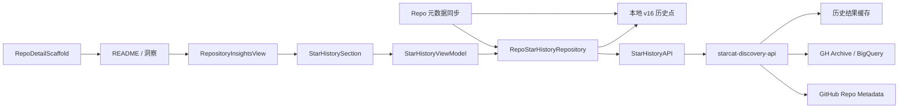

# 仓库星标历史整体落地方案

> 日期: 2026-07-27
> 状态: 方案待确认，尚未实施
> 版本: v1.1（并入仓库洞察）
> 范围: Starcat macOS 客户端 + `supports/starcat-discovery-api`
> 调研基线: `star-history/star-history` commit `bcddc9d532b10bac7e0187a741288bf9cab17616`
> 上位方案: [洞察中心详细设计](49-洞察中心详细设计.md)

## 1. 结论

Starcat 可以在仓库详情的“洞察”页增加「Star 趋势」能力，但不能继续照搬 Star History 原有的 GitHub `/stargazers` 实现。

2026-06-30 起，GitHub 将 `GET /repos/{owner}/{repo}/stargazers` 限制为仓库管理员和协作者可访问。Star History 已确认，用户不拥有或不协作的仓库无法再通过该接口生成曲线：

- [GitHub Changelog: Upcoming access restrictions](https://github.blog/changelog/2026-06-30-upcoming-access-restrictions-to-public-api-endpoints-and-ui-views/)
- [GitHub REST API: Starring endpoints](https://docs.github.com/en/rest/activity/starring?apiVersion=2026-03-10)
- [Star History: GitHub Has Restricted Access to Star Data](https://www.star-history.com/blog/github-stargazer-api-restriction/)

因此，首版采用两段式数据：

1. **公开仓库历史段**：后端通过 GH Archive 的公开 `WatchEvent` 重建并归一化，明确标记为「估算」。
2. **Starcat 观察段**：客户端从功能上线后按日记录 GitHub 当前 `stargazers_count`，标记为「精确快照」。

私有仓库不发送到 Starcat 后端，只显示本机已经记录的精确快照。任意公开仓库的完整历史精确值，目前没有通用且合规的 GitHub API 获取方式。

产品入口统一服从 [洞察中心详细设计](49-洞察中心详细设计.md)：

- 不在详情 Hero 增加独立星标历史按钮。
- 不弹出独立 `StarHistorySheet`。
- 用户在 `README / 洞察` 切换到“洞察”后，直接看到“Star 趋势”区块。
- 星标历史保留独立数据层和 ViewModel，避免与 PR / Issue / Commit 的活动范围、错误状态和缓存语义混在一起。

## 2. 产品目标与非目标

### 2.1 目标

- 在 Manage 仓库详情页和独立详情窗口的“洞察”内容中提供统一的 Star 趋势区块。
- 首次打开时先显示本地缓存，再异步刷新远程历史。
- 对公开仓库展示长期估算曲线，并从 Starcat 开始观察后逐日积累精确快照。
- 清楚展示数据来源、精度、覆盖起点和最后更新时间。
- 支持 `3 个月`、`1 年`、`全部`三个时间范围。
- 遵循 Starcat 的 macOS 原生视觉、明暗主题、国际化和辅助功能规范。

### 2.2 首版不做

- 不做多仓库对比。
- 不做对数坐标。
- 不导出 PNG / CSV。
- 不复制 Star History 的 React、D3、Next.js 或 SVG 服务代码。
- 不引入 Star History 运行时依赖。
- 不把估算数据描述为精确的历史 Star 数。
- 不为该功能新建独立后端项目或 Fly App。
- 不把私有仓库信息发送给 `starcat-discovery-api`。
- 不在首版请求受限的 `/stargazers` 接口。
- 不新增独立 Hero action、Sheet 或第四种详情内容模式。

## 3. 上游实现调研

### 3.1 Star History 原有数据路径

`star-history/star-history` 的主曲线数据来自：

```http
GET /repos/{owner}/{repo}/stargazers
Accept: application/vnd.github.v3.star+json
```

响应中的每个当前 stargazer 带有 `starred_at`，前端按时间累计后绘制曲线。

其实现还有两个重要特征：

- 小仓库读取全部分页。
- 大仓库最多抽取约 15 至 16 个分页位置，所以大仓库曲线本身已经是采样结果。

仓库中的 GH Archive / BigQuery 逻辑主要用于榜单和分析，不是原主曲线的数据来源。

### 3.2 为什么不能直接复用

- GitHub 已限制 stargazer 列表访问。
- Star History 的服务端 token 也不是目标仓库协作者，公开嵌入图同样失效。
- 即使用户对自己拥有的仓库有权限，`/stargazers` 返回的也是「当前仍在 stargazer 列表中的用户及其时间」，无法还原后来取消 Star 的用户，因此也不等价于每个历史时刻的精确总数。
- Starcat 需要覆盖用户收藏的任意公开仓库，不能把「用户是仓库协作者」作为前置条件。

### 3.3 可借鉴部分

- 按时间累计事件形成折线。
- 对长时间范围进行日 / 周 / 月降采样。
- 提供范围选择、悬停读数和当前总数摘要。
- 对大量数据做缓存，避免每次打开详情都重新计算。

## 4. 当前 Starcat 代码基础

### 4.1 macOS 客户端

- `RepoDetailView` 和 `RepoDetailWindowContent` 都复用 `RepoDetailScaffold`。
- `RepoMetadataHeaderView` 已有 Hero、统计行和 trailing actions。
- Stars 统计 chip 当前负责 Star / Unstar，不能再复用为历史入口，否则一个控件会承担两种冲突行为。
- `ManageDetailContent` 只负责 README 正文，把图表直接塞入正文会破坏现有折叠和阅读布局。
- `AIUsageDashboardView` 已使用 Swift Charts，项目不需要新增图表依赖。
- `AppEndpoints` 是自建服务 endpoint 的统一入口。
- 当前数据库最新迁移为 `v15-repo-pins`，新增表必须追加 `v16`，不能修改 `v1-initial`。

### 4.2 `starcat-discovery-api`

服务内已经存在：

- `repo_daily_snapshots` 表。
- `SQLiteStore.RecordDailySnapshot` 写入方法。
- 公开 API Bearer 鉴权、SQLite、scheduler 和统一响应 envelope。

当前生产 ingest 链路已在 repo metadata 与 release 成功落库后调用 `RecordDailySnapshot`，按 UTC 日期幂等保存 Stars / Forks / Watchers / Release 下载量；当前真正缺少的是任意公开仓库的长期历史缓存和查询 endpoint。

现有 `repo_daily_snapshots` 依赖 Discovery catalog，并会随 catalog 清理级联删除。它适合补齐 Discovery 仓库的服务端精确快照，但不适合作为任意用户仓库历史缓存的唯一存储。

## 5. 总体架构



核心原则：

- **local-first**：进入仓库洞察后 Star 区块先读本地，不阻塞其他洞察区块。
- **精度显式**：每个点带 `source` 和 `precision`，UI 不混淆估算与快照。
- **稳定 repo ID**：历史查询和缓存以 GitHub repository ID 为主键，`owner/name` 只用于校验和展示，避免重命名导致历史断裂。
- **客户端合并**：远程估算点和本机精确快照在 Repository 层合并，ViewModel 不感知数据库与网络细节。
- **私有边界**：`repo.isPrivate == true` 时禁止调用 Discovery API。

## 6. 数据来源与计算方法

### 6.1 GH Archive 估算段

[GH Archive](https://www.gharchive.org/) 保存 GitHub 公开事件，并提供按小时归档和 BigQuery 公共数据集。GitHub `WatchEvent` 表示一次公开仓库 Star 事件。

后端按稳定 `repo.id` 查询，避免仓库转移或重命名影响结果：

```sql
SELECT
  DATE(created_at) AS event_date,
  COUNT(*) AS event_count
FROM `githubarchive.day.*`
WHERE _TABLE_SUFFIX BETWEEN @start_day AND @end_day
  AND type = 'WatchEvent'
  AND repo.id = @repo_id
GROUP BY event_date
ORDER BY event_date;
```

以上 SQL 是实现方向，正式开发前必须在 Phase 0 用目标 BigQuery 项目验证当前表名、字段类型、扫描量和账单上限。

### 6.2 归一化

GH Archive 只观察公开 Star 事件，不提供对应的 Unstar 事件；归档还可能存在覆盖缺口。因此原始累计 WatchEvent 不能直接冒充当前 Star 总数。

设：

- `eventCount(d)`：日期 `d` 的 WatchEvent 数。
- `cumulative(d)`：截至 `d` 的累计 WatchEvent。
- `totalEvents`：全部累计 WatchEvent。
- `currentStars`：GitHub repo metadata 当前 `stargazers_count`。

估算值：

```text
estimatedStars(d) = round(currentStars × cumulative(d) / totalEvents)
```

约束：

- `totalEvents == 0` 时不生成估算曲线。
- 最后一个估算点必须等于 `currentStars`。
- 估算段保持单调不下降。
- 归一化会随当前总数变化而轻微重算历史，这是首版已知限制。
- UI 固定标记为「估算 · GH Archive」，不能只显示「历史数据」。

### 6.3 精确快照段

每次 Starcat 成功获得 repo metadata 后，按 UTC 日期记录：

```text
repo_id + observed_on + stars_count + captured_at
```

同一仓库同一天只保留最后一次值。该点表示「Starcat 在该时间观察到的 GitHub 当前总数」，属于精确快照；两个快照之间仍不能推导每次 Star / Unstar 的准确时间。

服务端现有 Discovery catalog 同步也要调用 `RecordDailySnapshot`，让公开 catalog 仓库拥有服务端快照。客户端自己的 repo 同步继续写本地快照。

### 6.4 合并规则

Repository 统一输出 `[StarHistoryPoint]`：

1. 远程估算点按日期排序。
2. 从第一条本地精确快照开始，同日优先保留精确点。
3. 精确快照日期之间不伪造中间值；Chart 只连接真实观察点。
4. 当前 repo 的 `starsCount` 比缓存新时，追加今天的精确点。
5. 本地精确段允许下降，因为真实总数可能发生 Unstar。

点级来源：

| `source` | `precision` | 含义 |
|---|---|---|
| `gh_archive` | `estimated` | 公开事件归一化估算 |
| `discovery_snapshot` | `snapshot` | Discovery 同步观察到的服务端快照 |
| `local_snapshot` | `snapshot` | Starcat 客户端观察到的本机快照 |

## 7. 后端 API 契约

### 7.1 Endpoint

```http
GET /api/v1/repos/{owner}/{repo}/star-history
    ?repo_id={github_repository_id}
    &range=3m|1y|all
```

规则：

- 使用 `starcat-discovery-api` 现有 Bearer API key。
- `repo_id` 必填，后端从 GitHub metadata 校验 `owner/repo` 与 ID 是否一致。
- 后端必须确认仓库是公开仓库。
- `range` 默认 `1y`。
- interval 由服务端按范围决定，首版不暴露给客户端。

### 7.2 成功响应

```json
{
  "data": {
    "repo_id": 123456,
    "full_name": "owner/repo",
    "current_stars": 42810,
    "range": "1y",
    "coverage_start": "2011-02-12",
    "generated_at": "2026-07-27T08:30:00Z",
    "points": [
      {
        "date": "2025-07-27",
        "count": 30120,
        "source": "gh_archive",
        "precision": "estimated"
      },
      {
        "date": "2026-07-27",
        "count": 42810,
        "source": "discovery_snapshot",
        "precision": "snapshot"
      }
    ]
  },
  "meta": {
    "cache": "hit",
    "max_age_seconds": 86400
  }
}
```

### 7.3 构建中响应

首次查询长期历史可能需要异步构建，不能让 HTTP 请求一直等待：

```http
HTTP/1.1 202 Accepted
Retry-After: 5
```

```json
{
  "error": {
    "code": "STAR_HISTORY_BUILDING",
    "message": "Star history is being prepared."
  }
}
```

客户端保留本地缓存，显示「正在更新历史数据」，最多自动轮询三次；之后停止自动请求并提供手动刷新。

### 7.4 错误语义

| HTTP | code | 客户端行为 |
|---:|---|---|
| 400 | `INVALID_REPOSITORY` | 不重试，显示数据不可用 |
| 401 | `UNAUTHORIZED` | 走现有服务鉴权错误 |
| 404 | `REPOSITORY_NOT_FOUND` | 保留本地缓存 |
| 409 | `REPOSITORY_ID_MISMATCH` | 刷新 repo metadata 后重试一次 |
| 422 | `PRIVATE_REPOSITORY_UNSUPPORTED` | 不上传信息，客户端通常应提前拦截 |
| 429 | `RATE_LIMITED` | 读取 `Retry-After`，不连续轮询 |
| 503 | `HISTORY_PROVIDER_UNAVAILABLE` | 保留缓存，允许手动刷新 |

### 7.5 缓存策略

- 成功结果缓存 24 小时。
- 同一个 `repo_id + range` 只允许一个构建任务。
- 响应带 `Cache-Control` 和 `ETag`；客户端支持 `If-None-Match`。
- 每个返回序列最多 500 点。
- `3m` 按日、`1y` 按周、`all` 按月聚合；末尾当前点始终保留。
- 失败采用短期负缓存，避免反复扫描 BigQuery。

## 8. `starcat-discovery-api` 落地

### 8.1 为什么扩展现有服务

- 该服务已经负责公开仓库元数据、榜单、SQLite 持久化和定时同步。
- 星标历史同样是公开 repo intelligence，不需要新建服务。
- 可复用 GitHub token pool、Bearer 鉴权、scheduler、Fly volume 和 API envelope。

### 8.2 新增模块

建议目录：

```text
supports/starcat-discovery-api/
  internal/
    starhistory/
      service.go
      provider.go
      bigquery_provider.go
      normalize.go
      downsample.go
    handler/
      star_history.go
    model/
      star_history.go
```

职责：

- `provider.go`：抽象历史事件提供方，便于测试替换。
- `bigquery_provider.go`：参数化查询 GH Archive。
- `normalize.go`：累计、归一化和末点校准。
- `downsample.go`：日 / 周 / 月聚合，保证末点不丢。
- `service.go`：校验公开仓库、cache-first、去重构建任务。
- `star_history.go`：解析 path/query、输出统一 envelope。

### 8.3 后端存储

新增独立缓存表，不把任意用户仓库强行写入 Discovery catalog：

```sql
CREATE TABLE repo_star_history_cache (
    gh_repo_id       INTEGER PRIMARY KEY,
    full_name        TEXT NOT NULL,
    current_stars    INTEGER NOT NULL,
    coverage_start   TEXT,
    points_json      TEXT NOT NULL DEFAULT '[]',
    status           TEXT NOT NULL,
    generated_at     TEXT,
    expires_at       TEXT,
    last_error       TEXT,
    updated_at       TEXT NOT NULL
);
```

`status` 只允许：

- `building`
- `ready`
- `failed`

同时保留并验证现有 catalog 快照链路：

- 每次成功 upsert repo metadata 与 releases 后继续调用 `RecordDailySnapshot`。
- 仅在一轮 repo 数据完整时记录，失败响应不能写入零值。
- 保留现有 `(date, gh_repo_id)` 幂等约束。
- 补 ingest 回归测试，防止后续重构遗漏现有生产调用。

### 8.4 异步构建

- 首次 miss 写入 `building`，放入有界 worker queue，立即返回 `202`。
- 同 repo 的并发请求合并。
- 服务重启后，过期的 `building` 状态可在下次请求时重新入队。
- worker 设置 BigQuery 单次扫描上限、超时和每日预算。
- 不能在 HTTP handler 内直接执行无界全历史查询。

### 8.5 配置

正式实现前由 Phase 0 确认最终变量名，预计需要：

```text
STAR_HISTORY_ENABLED
STAR_HISTORY_CACHE_TTL_SECONDS
STAR_HISTORY_MAX_POINTS
STAR_HISTORY_WORKER_CONCURRENCY
GCP_PROJECT_ID
GOOGLE_APPLICATION_CREDENTIALS_JSON
BIGQUERY_MAX_BYTES_BILLED
```

密钥只能通过 Fly secrets 注入，不能提交到仓库。后端改动验证通过后，测试与生产环境需要分别配置和部署；任何部署都必须另行获得 dong4j 明确授权。

## 9. Starcat 本地数据设计

### 9.1 合并到统一 `v16` 迁移

迁移名：

```text
v16-repository-insights
```

该迁移由洞察中心与星标历史共同使用，一次创建：

- `repo_insights_snapshots`：PR / Issue / Commit / contributors / community 等可过期远端快照。
- `repo_star_history_points`：按日期、来源保存的 Star 历史点。

两类数据的生命周期不同，必须保持两张表，不能为了“统一”塞进一个 JSON payload。

新增表：

```sql
CREATE TABLE repo_star_history_points (
    repo_id       INTEGER NOT NULL
                  REFERENCES repos(id) ON DELETE CASCADE,
    observed_on   TEXT NOT NULL,
    stars_count   INTEGER NOT NULL CHECK (stars_count >= 0),
    source        TEXT NOT NULL,
    precision     TEXT NOT NULL,
    fetched_at    TEXT NOT NULL,
    PRIMARY KEY (repo_id, observed_on, source)
);

CREATE INDEX idx_repo_star_history_points_lookup
ON repo_star_history_points(repo_id, observed_on);
```

约束：

- 两个需求同批开工时只追加一次 `registerV16`，禁止修改 `v1-initial`。
- 远程刷新时，只替换该 repo 的 `gh_archive` / `discovery_snapshot` 点。
- `local_snapshot` 不得被远程刷新删除或覆盖。
- 表属于可重建缓存，不进入 CloudKit，不进入 JSON 用户数据导入导出。
- 删除 repo 时随外键级联清理。

### 9.2 模型

建议新增：

```swift
enum StarHistorySource: String, Codable, Sendable {
    case ghArchive = "gh_archive"
    case discoverySnapshot = "discovery_snapshot"
    case localSnapshot = "local_snapshot"
}

enum StarHistoryPrecision: String, Codable, Sendable {
    case estimated
    case snapshot
}

struct StarHistoryPoint: Identifiable, Equatable, Sendable {
    let date: Date
    let count: Int
    let source: StarHistorySource
    let precision: StarHistoryPrecision
}
```

数据库 Record 与领域模型分开，避免 UI 直接依赖 GRDB。

### 9.3 快照写入时机

复用现有 repo metadata 落库链路，在成功写入 `repos.stars_count` 后记录当天快照：

- Stars 首次全量同步。
- 手动 Stars 同步。
- 单仓库 metadata 刷新。
- Discovery / Trending 等外部 repo 只有在已经持久化到本地 `repos` 时才记录。

不能为了写快照额外请求一次 GitHub；快照只消费已经成功拿到的 metadata。

## 10. 客户端分层与文件改动

建议新增：

```text
Starcat/
  Core/
    Database/
      Models/
        RepoStarHistoryRecord.swift
      Migrations/
        DatabaseMigrationsV1.swift
    Network/
      AppEndpoints.swift
      StarHistoryAPI.swift
    Sync/
      RepoStarHistoryRepository.swift
      RepoStarHistoryRepositoryProtocol.swift
  Features/
    Insights/
      RepositoryInsights/
        RepositoryInsightsView.swift
        RepositoryInsightsViewModel.swift
        StarHistory/
          StarHistoryViewModel.swift
          StarHistorySection.swift
          StarHistoryChart.swift
          StarHistorySummaryView.swift
          StarHistorySourceBadge.swift
  App/
    AppDependencies.swift
  Resources/
    Localizable.xcstrings
```

测试：

```text
StarcatTests/
  DatabaseMigrationsV16Tests.swift
  RepoStarHistoryRepositoryTests.swift
  StarHistoryAPITests.swift
  StarHistoryViewModelTests.swift
  StarHistoryChartTests.swift
  RepositoryInsightsViewTests.swift
```

职责边界：

- `StarHistoryAPI`：只处理 HTTP、DTO 和错误映射。
- `RepoStarHistoryRepository`：本地读取、远程刷新、事务写入、来源合并。
- `StarHistoryViewModel`：Star 区块状态、范围选择、取消旧任务、派生增长指标。
- `StarHistorySection`：仓库洞察内稳定的区块布局和状态切换。
- `StarHistoryChart`：只接收已经排序和筛选好的点。
- `RepositoryInsightsView`：编排 Star、协作活动、Health、社区与安全区块，不承载历史计算。
- `RepoDetailScaffold`：保持现状，只承载共享头部和 Manage body，不新增星标历史入口。

`RepoDetailWindowContent` 已按窗口独立持有环境依赖。星标历史服务必须从 `AppDependencies` 注入，不能在 View 内创建另一套网络或数据库对象，否则独立窗口会出现状态不一致。

## 11. 仓库洞察集成设计

### 11.1 入口

位置：

- 用户先在 Manage 详情中切换 `README / 洞察`。
- “Star 趋势”位于仓库洞察的活动 KPI 之后、Commit 活动之前。
- 主窗口与独立详情窗口复用相同 `RepositoryInsightsView`。
- `repo.id <= 0` 或仓库尚未持久化时，区块显示不可用说明，不发网络请求。

明确删除：

- 不在 `RepoDetailScaffold.trailingActionsView` 增加 `chart.xyaxis.line`。
- 不复用 Stars chip 作为历史入口。
- 不新增 `StarHistorySheet`。
- 不让用户在 Hero、README 和洞察之间维护三套导航状态。

### 11.2 Star 趋势区块

结构：

```text
┌─ Star 趋势 ───────────────────────── [刷新] [3月|1年|全部] ┐
│ 42,810 Stars   +1,284 / 30 天   +8,932 / 1 年              │
│ [估算 · GH Archive] [本机精确快照]                         │
│                                                            │
│                    Swift Charts 折线                        │
│                                                            │
│ hover: 2026-07-12 · 41,992 · 当期 +182                     │
│ 覆盖自 2011-02-12 · 更新于 10:30 · 估算数据说明            │
└────────────────────────────────────────────────────────────┘
```

规范：

- 区块刷新统一使用 `SyncIconButton`。
- Star 范围独立于 PR / Issue / Commit 的活动范围；前者为 `3月 / 1年 / 全部`，后者为 `1周 / 1月 / 3月 / 1年`。
- 区块保持稳定内容树，loading / stale / error 不切换整个根布局。
- 使用 Swift Charts 的 `LineMark`；估算段和快照段使用同一主色、不同线型或透明度。
- 当前选中点使用 `RuleMark` 和紧凑信息浮层。
- 网格线使用系统 separator 语义色，不写死 RGB。
- 遵循 `starcatReduceMotion`；范围切换时允许无动画。
- 不能用 hover 作为唯一信息入口；VoiceOver 要能读当前总数、范围增量、数据来源和覆盖时间。
- Detail 宽度充足时图表高度建议 220～260 pt；窄窗口下降到 180 pt，不设置固定 Detail 最小宽度。

### 11.3 状态

| 状态 | 表现 |
|---|---|
| 首次加载且无缓存 | 保留区块骨架，Chart 区使用紧凑 ProgressView |
| 有缓存并刷新 | 继续显示旧曲线，刷新按钮旋转 |
| `202 building` | 显示「正在准备长期历史」，保留已有本地快照 |
| 离线 | 显示本地缓存和离线说明，不清空 Chart |
| 远程失败 | 区块底部显示非阻塞错误和手动刷新 |
| 只有一个快照 | 显示当前值和「需要至少两个观察日」 |
| 私有仓库 | 只显示本机快照，并解释不会上传私有仓库信息 |
| 无任何数据 | 空状态，不展示伪造的零值曲线 |

### 11.4 范围和指标

- `3 个月`：适合观察近期增长。
- `1 年`：默认值。
- `全部`：展示可用覆盖期，不承诺覆盖仓库创建以来的所有事件。
- `30 天增长` / `1 年增长` 只有在范围起点附近存在有效点时才计算，否则显示 `—`。
- 增长值允许为负，不能强制钳制为 0。

## 12. 并发与数据一致性

- `StarHistoryViewModel` 使用 `.task(id: repo.id)` 或等价 identity 门控。
- repo 切换时取消旧请求，旧 repo 的响应不能覆盖新 repo 的 Star 区块。
- 范围切换只读取已缓存全量序列时不发网络；缓存缺少目标范围才请求。
- Repository 数据库写入使用单次事务：
  1. 删除旧远程来源点。
  2. 插入新远程点。
  3. 保留本地快照。
- UI 更新在 `MainActor`，网络和数据库不占用主线程。
- 远程失败不删除上次成功缓存。
- 后端返回的 `repo_id` 必须与当前 repo 一致，否则丢弃。
- 活动指标和 Star 历史分别持有 loading / error / range；一个区块失败不能把整个仓库洞察切到错误页。

## 13. 分阶段实施

本节是 Star 历史专项任务拆解，整体交付顺序以 [洞察中心详细设计 §10](49-洞察中心详细设计.md#10-实施切片) 的 M0～M5 为主：

| 本文阶段 | 洞察中心里程碑 |
|---|---|
| Phase 0：数据可行性 Spike | M0：星标历史数据可行性门槛 |
| Phase 1：Discovery API | M4：仓库远端活动与缓存 |
| Phase 2：客户端数据层 | M3～M4：本地信息与远端合并 |
| Phase 3：macOS UI | M3、M5：仓库洞察区块与视觉收口 |
| Phase 4：联调与灰度 | M4～M5：联调和最终验收 |

### Phase 0：数据可行性 Spike

目标：先证明 GH Archive 路径在成本和质量上可接受，再进入正式开发。

任务：

1. 选择小、中、大各 2 个公开仓库。
2. 用稳定 repo ID 查询 `WatchEvent`。
3. 验证 GH Archive 表结构、覆盖起点、查询耗时和扫描字节。
4. 对比当前 `stargazers_count` 与累计 WatchEvent。
5. 验证归一化曲线是否满足产品可读性。
6. 给出 BigQuery 单仓库首次构建和每日增量成本上限。

通过门槛：

- 6 个样本都能生成可解释曲线，或能明确解释空数据原因。
- 查询有 `maximumBytesBilled` 硬限制。
- 单仓库首次构建成本和响应时间可以接受。
- 曲线末点等于 GitHub 当前总数。
- dong4j 接受「估算」的产品语义。

若未通过：

- 不上线伪精确历史。
- 功能降级为「从 Starcat 开始记录」的本地精确快照曲线。

### Phase 1：Discovery API

1. 新增 provider、归一化、降采样和缓存。
2. 新增公开仓库校验。
3. 新增异步构建与 `202` 契约。
4. 暴露 `/api/v1/repos/{owner}/{repo}/star-history`。
5. 保留现有 `RecordDailySnapshot` 生产调用并补回归验证。
6. 补充 API、store、handler 和计算测试。

验收：`go test ./...`、`go vet ./...`、`make check` 通过，API contract fixture 固定。

### Phase 2：客户端数据层

1. 与洞察中心一起追加 `v16-repository-insights`，一次创建活动快照表和 Star 历史点表。
2. 新增 Record、DTO、API、Repository。
3. 在现有 metadata 成功落库链路写每日快照。
4. 注入 `AppDependencies`。
5. 完成 cache-first、合并和取消测试。

验收：从 v15 数据库迁移后用户数据不变；离线可读缓存；私有 repo 不产生后端请求。

### Phase 3：macOS UI

1. 在 `RepositoryInsightsView` 增加 Star 趋势区块，不修改共享 Scaffold 的 Hero actions。
2. 实现 section、summary、source badge 和 Chart。
3. 实现范围选择、hover、刷新、空态和错误态。
4. 补齐全部 i18n key。
5. 验证 Manage 详情与独立详情窗口。

验收：明暗主题、不同 Detail 宽度、Reduce Motion、VoiceOver 基本语义和 18 种语言布局无阻塞问题。

### Phase 4：联调与灰度

1. 测试环境接入真实 Discovery API。
2. 验证 cache miss、`202`、`200`、`304`、`429`、`503`。
3. 记录构建耗时、BigQuery 扫描字节、缓存命中率和错误率。
4. 达到成本门槛后再决定生产部署。

测试和生产部署均需 dong4j 在实施阶段另行明确授权。

## 14. 测试清单

### 14.1 后端自动化

- WatchEvent 日累计。
- `totalEvents == 0`。
- 归一化末点等于 current stars。
- 舍入后保持单调。
- 周 / 月降采样不丢失首末点。
- 同 repo 并发请求只构建一次。
- 公开仓库校验和 repo ID mismatch。
- 私有仓库拒绝。
- cache hit / stale / failed / building。
- BigQuery 超时、预算超限和 provider 失败。
- 现有 ingest 链路继续调用 `RecordDailySnapshot`，且失败响应不写入零值。

### 14.2 客户端自动化

- v15 → v16 迁移。
- 同日 local snapshot 幂等更新。
- 远程替换不删除 local snapshot。
- 同日精确点优先于估算点。
- 负增长计算。
- 无足够起点时增长为 nil。
- private repo 不调用 API。
- `202` 有界轮询。
- repo 切换后旧响应不覆盖。
- 远程失败继续返回 stale cache。
- URL path/query 编码和 API 错误映射。

### 14.3 人工 UI 验收

- Manage 三栏详情。
- 独立详情窗口。
- Light / Dark。
- 主窗口最小尺寸和窄 Detail。
- 长仓库名和大 Star 数。
- 中文、英文和较长文案语言。
- hover 读数不会越过 Detail 边界。
- 刷新时不闪空白。
- 私有仓库只显示本机数据。
- README 滚动和 Hero 折叠行为不受影响。

人工项必须由实际 UI 验收，不能只凭单测勾选完成。

## 15. 安全、隐私与成本

- 客户端只对公开仓库调用历史 API。
- 后端再次向 GitHub 校验公开性，不能相信客户端参数。
- 日志只记录 `repo_id`、公开 `full_name`、状态码和耗时，不记录用户 GitHub token。
- 不把用户的 Star 列表或访问顺序作为后端历史数据。
- BigQuery 使用只读 service account 和 `maximumBytesBilled`。
- worker 并发默认 1，防止首次 miss 形成成本尖峰。
- 后端缓存使用公开数据，不进入用户 CloudKit。
- 私有仓库历史完全留在本机数据库。

## 16. 风险与应对

| 风险 | 影响 | 应对 |
|---|---|---|
| GH Archive 缺事件 | 估算偏差 | 明示估算、展示覆盖起点、保留本地精确段 |
| 没有 Unstar 事件 | 历史累计偏高 | 按当前总数归一化，不宣传精确 |
| BigQuery 扫描成本高 | 后端成本不可控 | Phase 0、预算上限、24h 缓存、异步队列 |
| 首次构建慢 | Star 区块等待 | `202` + 本地快照 + 有界轮询 |
| 历史重算轻微漂移 | 用户两次看到旧点不同 | 显示 generated time，近期以精确快照覆盖 |
| repo 改名或转移 | name 查询断裂 | repo ID 主键，owner/name 只校验 |
| 私有信息泄露 | 严重隐私问题 | 客户端和后端双重拦截 |
| 仓库洞察信息过密 | Detail 首屏过长 | Star 区块位于活动 KPI 后，窄窗单列，保持紧凑高度和独立状态 |

## 17. 涉及项目与改动规模

需要改动两个独立 Git 仓库：

| 项目 | 必需 | 主要改动 |
|---|---:|---|
| Starcat 主项目 | 是 | 统一 v16 数据表、API、Repository、快照写入、仓库洞察 Star 区块、i18n、测试 |
| `supports/starcat-discovery-api` | 是 | GH Archive provider、异步构建、缓存表、查询 endpoint、接通每日快照、测试和部署配置 |

不需要：

- 新建第三个服务。
- 修改 `star-history/star-history`。
- 把 Star History 作为 SPM / npm 依赖。
- 因此不新增 Star History 到 App 内开源依赖列表；方案仅参考其公开实现思路。

两个仓库后续应分别提交，不能把 `supports/starcat-discovery-api` 当成主仓库普通目录一起 commit。

## 18. 完成定义

只有同时满足以下条件，功能才可标记完成：

- 公开仓库能显示来源明确的估算历史。
- 本地精确快照从同步链路稳定积累。
- 私有仓库不访问 Starcat 历史后端。
- 当前点与最新 repo metadata 一致。
- 远程失败不清空缓存。
- Manage 和独立详情窗口行为一致。
- Star 趋势区块符合 macOS UI、明暗主题、i18n 和辅助功能规范。
- 仓库详情不存在重复的星标历史 Hero 入口或独立 Sheet。
- 主项目和 Discovery API 自动化测试通过。
- BigQuery 成本上限经过真实验证。
- 测试环境联调完成。
- 人工 UI 验收完成。
- dong4j 明确确认后，才能另行同步 `docs/功能实现总览.md`。

## 19. 建议决策

建议按以下默认项确认后实施：

1. 首版只作为仓库洞察中的 Star 趋势区块，覆盖 Manage 详情和独立详情窗口。
2. 公开历史使用「估算 · GH Archive」字样，不弱化精度说明。
3. 默认时间范围为 `1 年`。
4. 私有仓库只显示本地精确快照。
5. Phase 0 是强制 GO / NO-GO 门槛；不通过就降级为纯本地快照。
6. 不实现 `/stargazers` 的 owner / collaborator 特例，避免首版维护第三种语义。
7. 与洞察中心共用 `v16-repository-insights`，但保持独立数据表和独立 ViewModel。
8. 不在本轮改写 `docs/功能实现总览.md`；待实现并验收后再单独确认。
