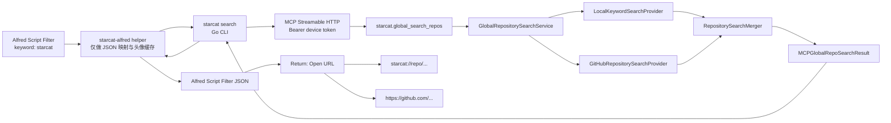

# Alfred 外部搜索集成详细设计

> 状态：主体与代码审查项已实现，待 Workflow 发布与 Alfred 人工验收
>
> 创建：2026-07-29
>
> 适用版本：待排期版本
>
> 产品边界：Starcat Pro 外部集成，仅支持 macOS 上具备 Workflows 能力的 Alfred
>
> 关联文档：
> - [搜索增强最终方案](28-搜索增强最终方案.md)
> - [GitHub 搜索集成设计](24-GitHub-搜索集成设计.md)
> - [Starcat CLI、Skill 与外部 MCP 桥接设计](34-StarcatCLI与外部MCP桥接设计.md)
> - [MCP Service 实施方案](../../2-产品/需求讨论/正式方案/MCP%20Service%20实施方案.md)
> - [uTools 与 Raycast 外部搜索集成详细设计](53-uTools与Raycast外部搜索集成详细设计.md)

---

## 0. 结论先行

Alfred Workflow 不是第四套 Starcat 客户端业务实现。完整调用链固定为：

```text
Alfred Script Filter
    -> Alfred Workflow 内置薄适配器
        -> starcat search "<query>"
            -> starcat.global_search_repos
                -> Starcat App 全局仓库搜索服务
                    -> Local FTS Provider
                    -> GitHub Repository Search Provider
                    -> 跨来源去重、本地优先、打开目标生成
```

必须遵守以下决策：

| 决策 | 结论 |
|------|------|
| 产品归属 | Alfred 是 Starcat Pro 的外部集成 |
| 业务入口 | Starcat App MCP Service 是唯一业务入口 |
| CLI 职责 | 参数校验、MCP Tool 映射、结构化 JSON 输出 |
| Alfred 职责 | 把 CLI JSON 转为 Script Filter JSON、缓存头像、打开 URL |
| 本地数据库 | Alfred 和 CLI 都禁止直接读取 |
| GitHub Token | Alfred 和 CLI 都禁止读取或保存 |
| 搜索范围 | MVP 只聚合 Starcat 本地仓库与 GitHub Repository Search，不包含 Web Reference |
| 去重规则 | GitHub repo ID 优先，缺失时按 lowercased `owner/name`；同仓库本地结果优先 |
| 本地点击 | 打开 `starcat://repo/{owner}/{name}?v=1&rid={repo_id}` |
| 远端点击 | 打开仓库 `html_url` |
| 项目图标 | 使用 GitHub owner / organization avatar，不从 README 猜项目 Logo |
| 来源标识 | 左侧显示 owner avatar，subtitle 首段显示 `Starcat 本地` 或 `GitHub` |
| 图标加载 | Alfred 只读取本地图片；Workflow 在 `alfred_workflow_cache` 下载并缓存头像 |
| 兼容原则 | 保留现有 `starcat repo search` 的本地 FTS / semantic 语义，新增顶层 `starcat search` |

---

## 1. 背景与目标

### 1.1 用户场景

用户在 Alfred 中输入：

```text
starcat local rag
```

Alfred 展示 Starcat 全局仓库搜索结果：

```text
[owner avatar]  owner/repo
                Starcat 本地 · Swift · ★ 12.4k · 项目描述

[owner avatar]  other/project
                GitHub · Rust · ★ 8.6k · 项目描述
```

按 Return 后：

- `Starcat 本地`：启动或激活 Starcat，并定位到仓库详情。
- `GitHub`：使用默认浏览器打开 GitHub 仓库。

### 1.2 目标

1. Alfred 中获得与 Starcat Search Center 一致的本地 + GitHub 仓库搜索能力。
2. 本地结果与远端结果使用同一身份规则去重。
3. 每条结果明确展示数据来源。
4. 每条结果展示 Starcat 当前使用的 owner / organization avatar。
5. 复用现有 CLI 配对、MCP 鉴权、Pro 权限和 GitHub API 客户端。
6. Workflow 可以独立发布、安装、升级和卸载，不进入 Starcat App bundle。
7. 冷缓存、断网、MCP 未启动、非 Pro 等状态在 Alfred 中给出可操作提示。

### 1.3 非目标

MVP 不包含：

- Web Reference / AnySearch / Tavily / Brave 等网页搜索结果。
- 在 Alfred 中 Star / Unstar、改标签、改笔记或改阅读状态。
- 从 README、Open Graph、仓库主页推断项目 Logo。
- 在 Alfred 中渲染 README 或 Starcat 仓库详情。
- GitHub 远端分页 UI。
- 把 Alfred 专属 JSON 格式加入 MCP Tool。
- 让 Alfred 读取 SQLite、Local API Key、GitHub OAuth Token 或 Starcat Keychain item。
- 来源角标与头像合成。MVP 使用 subtitle 文本表达来源。

---

## 2. 当前实现事实与缺口

### 2.1 已有能力

| 能力 | 当前实现 | 可复用结论 |
|------|----------|------------|
| 本地关键词搜索 | `LocalKeywordSearchProvider` + `RepoRepository.searchFTS` | 直接复用 |
| GitHub 仓库搜索 | `GitHubRepositorySearchProvider` + `GitHubAPIClient.searchRepositories` | 直接复用 |
| Provider 编排 | `SearchCoordinator` 并发执行 Provider，允许部分失败 | 复用语义，抽出无 UI 的服务边界 |
| 跨来源去重 | `SearchCoordinator.mergeRepositories` | 抽成共享 merger，禁止复制算法 |
| 来源优先级 | 同仓库同时包含 local / GitHub 时显示 local | MCP 输出沿用 |
| 本地仓库 Deep Link | `RepositoryDeepLink` 支持 `starcat://repo/owner/name?v=1&rid=...` | 直接生成 |
| owner avatar | `Repo.ownerAvatar`，缺失时使用 `https://github.com/{owner}.png?size=80` | MCP 输出统一 `icon_url` |
| CLI/MCP 配对 | `starcat pair`、device token、MCP Streamable HTTP | Workflow 直接复用已有 CLI profile |
| Pro 门控 | MCP Service 启动和每个请求都检查 Pro | Alfred 不增加第二套订阅判断 |
| CLI JSON 输出 | `capabilities`、`repo`、`tags` 等数据命令输出 JSON | 新命令沿用 |

### 2.2 当前缺口

现有命令：

```bash
starcat repo search "local RAG" --scope starred --limit 20
```

只调用：

```text
starcat.search_repos
```

该 MCP Tool 只搜索 Starcat 本地 FTS 数据。Search Center 才同时调用 Local 与 GitHub Provider。

因此不能让 Alfred 分别调用：

```text
starcat repo search ...
gh search repos ...
```

这种做法会产生以下问题：

- 绕开 Starcat MCP 权限与 GitHub 客户端。
- 重复实现去重与来源优先级。
- 远端结果无法稳定带回 Starcat 统一字段。
- Alfred 需要额外 GitHub 凭据。
- Search Center 与 Alfred 的行为会逐步漂移。

正确修复是先补齐 Starcat MCP 的全局仓库搜索能力，再由 CLI 和 Alfred 逐层复用。

---

## 3. 总体架构



### 3.1 三个仓库的边界

| 仓库 | 开发路径 | 责任 |
|------|----------|------|
| Starcat 主仓库 | 当前仓库 | Provider 复用、全局搜索服务、MCP Tool、Pro 门控、设置页入口 |
| `starcat-cli` | `supports/starcat-cli` | 新增 `starcat search`，映射 MCP Tool |
| `starcat-alfred-workflow` | 计划新增 `supports/starcat-alfred-workflow` | Script Filter、头像缓存、Alfred JSON、Workflow 打包 |

`supports/starcat-cli` 和未来的 `supports/starcat-alfred-workflow` 都是独立 Git 仓库。父 Starcat 仓库不得 force-add 它们。

### 3.2 为什么需要 Alfred helper

不建议只用 shell 拼 JSON，原因是：

- macOS 不内置 `jq`。
- 现代 macOS 不保证系统 Python / Ruby 运行时。
- 仓库描述可能包含换行、引号、Emoji，shell 拼接容易生成非法 JSON。
- 头像需要 HTTPS 校验、重定向校验、并发下载和原子缓存。
- 需要把 CLI 错误稳定映射为 Alfred 的不可执行提示项。

建议 Workflow 内置一个小型 Go helper：

- 搜索数据仍然必须来自 `starcat` CLI。
- helper 不直接连接 MCP。
- helper 不接触 Starcat 凭据。
- Release 时构建 `darwin/arm64` 和 `darwin/amd64`，再合并为 universal binary。

不在 `starcat` CLI 中增加 `--alfred`，避免通用 CLI 被特定 Launcher 的 UI JSON 契约污染。

---

## 4. 用户流程

### 4.1 首次安装

前置条件：

1. 已安装 Alfred，并具备 Workflows 能力。
2. 已安装 Starcat App。
3. 已激活 Starcat Pro。
4. Starcat 设置中已开启 MCP Service。
5. 已安装 `starcat` CLI。
6. 已执行一次：

```bash
starcat pair "starcat-pair://..."
starcat doctor
```

7. 安装 `Starcat.alfredworkflow`。

Workflow 不要求用户配置 GitHub Token、Local API Key 或 MCP endpoint。

### 4.2 正常搜索

1. 用户唤起 Alfred。
2. 输入 `starcat` 和查询文本。
3. Script Filter 把查询作为独立 argv 传给 helper，禁止插入 shell 命令字符串。
4. helper 执行 `starcat search <query> --limit 30`。
5. CLI 调用 `starcat.global_search_repos`。
6. Starcat 并行搜索本地与 GitHub。
7. MCP 返回去重后的结构化结果。
8. helper 生成 Alfred JSON。
9. 已缓存头像立即显示；未缓存头像先显示 fallback，并异步预热。
10. 用户按 Return，Alfred 的 Open URL Action 打开 `arg`。

### 4.3 本地结果打开

本地命中必须生成：

```text
starcat://repo/{owner}/{name}?v=1&rid={repo_id}
```

约束：

- `owner`、`name` 必须使用 URLComponents 生成，禁止字符串裸拼后直接执行。
- `rid` 存在时必须携带，用 GitHub 全局 ID 抵抗仓库 rename。
- App 未运行时由 URL Scheme 拉起。
- App 已运行时激活窗口并定位仓库。

### 4.4 GitHub 结果打开

纯远端命中使用 GitHub API 返回的 `html_url`：

```text
https://github.com/{owner}/{name}
```

Workflow 只接受：

- scheme 为 `https`
- host 为 `github.com`

不允许 MCP 返回任意 scheme 后由 Alfred 直接执行。

---

## 5. MCP 契约

### 5.1 新工具

新增：

```text
starcat.global_search_repos
```

保留现有：

```text
starcat.search_repos
starcat.semantic_search
```

三者语义不同：

| Tool | 数据来源 | 用途 |
|------|----------|------|
| `starcat.search_repos` | Starcat 本地 FTS | Agent 查询用户本地仓库 |
| `starcat.semantic_search` | Starcat 本地 embedding | Agent 语义召回 |
| `starcat.global_search_repos` | 本地 FTS + GitHub Search | Search Center / Alfred 等外部搜索入口 |

禁止直接修改 `starcat.search_repos` 为全局搜索，否则会破坏既有 Agent、Skill 和 CLI 命令的隐私与网络语义。

### 5.2 输入参数

```json
{
  "query": "local rag",
  "limit": 30,
  "sources": ["local", "github"]
}
```

| 字段 | 类型 | 必填 | 默认值 | 约束 |
|------|------|------|--------|------|
| `query` | string | 是 | - | trim 后 1~200 字符 |
| `limit` | integer | 否 | `30` | 1~50，表示去重后的最大返回条数 |
| `sources` | string[] | 否 | `["local","github"]` | 只接受 `local` / `github`，至少一项 |

MVP 不暴露 GitHub language、stars、sort 等高级筛选。需要高级筛选时应另行扩展 schema，不能让 Alfred 构造 GitHub query syntax 并绕开 Starcat 的输入模型。

### 5.3 输出参数

```json
{
  "schema_version": 1,
  "query": "local rag",
  "returned_count": 2,
  "items": [
    {
      "repo_id": 123,
      "owner": "owner",
      "name": "repo",
      "full_name": "owner/repo",
      "description": "Local-first RAG toolkit",
      "language": "Swift",
      "stars_count": 12400,
      "is_private": false,
      "is_starred": true,
      "primary_source": "local",
      "sources": ["local", "github"],
      "icon_url": "https://avatars.githubusercontent.com/u/1?v=4&s=80",
      "open_url": "starcat://repo/owner/repo?v=1&rid=123",
      "html_url": "https://github.com/owner/repo",
      "updated_at": "2026-07-29T08:00:00Z"
    },
    {
      "repo_id": 456,
      "owner": "other",
      "name": "project",
      "full_name": "other/project",
      "description": "Remote project",
      "language": "Rust",
      "stars_count": 8600,
      "is_private": false,
      "is_starred": false,
      "primary_source": "github",
      "sources": ["github"],
      "icon_url": "https://github.com/other.png?size=80",
      "open_url": "https://github.com/other/project",
      "html_url": "https://github.com/other/project",
      "updated_at": "2026-07-28T08:00:00Z"
    }
  ],
  "providers": {
    "local": {
      "status": "success",
      "count": 1,
      "message": null
    },
    "github": {
      "status": "success",
      "count": 2,
      "message": null
    }
  },
  "warnings": []
}
```

### 5.4 字段规则

#### `primary_source`

```text
if sources contains local:
    primary_source = local
else:
    primary_source = github
```

本地与 GitHub 同时命中时仍显示 `local`，与 Search Center 当前来源标识一致。

#### `icon_url`

优先级：

1. GitHub API / 本地 Repo 已有的 `ownerAvatar`。
2. `https://github.com/{owner}.png?size=80`。

GitHub Repository API 没有标准项目 Logo 字段，因此不要把 README 第一张图、Open Graph image 或 favicon 当作项目图标。

#### `open_url`

```text
primary_source == local
    -> RepositoryDeepLink custom URL
primary_source == github
    -> html_url
```

#### `sources`

MCP 对外只暴露产品级来源：

```text
local
github
```

不要把内部的 `localKeyword` / `localSemantic` 枚举泄露到公共契约。当前全局 Tool 的本地来源只有 keyword FTS；以后若增加 semantic，可继续归一为 `local`。

### 5.5 去重与排序

去重键：

1. 两边均有 `ghRepoID` 时按 ID。
2. 否则按 lowercased `owner/name`。

合并规则：

- `sources` 取并集。
- 只要存在本地 Repo，`primary_source` 就是 `local`。
- 卡片主数据优先使用本地 Repo，远端只补本地缺失的会话字段。
- `open_url` 按最终 `primary_source` 生成。

排序规则：

1. 保持 Local FTS 内部排序。
2. 本地结果整体优先。
3. GitHub 独有结果按 GitHub API 返回顺序追加。
4. 最后应用总 `limit`。

本地与 GitHub 的相关度分数口径不同，MVP 不做伪精确的跨来源 score 混排。Alfred 默认 `limit=30`；如果真实使用中本地结果经常占满，可单独评审配额或交错策略，禁止在首版静默引入。

### 5.6 Provider 部分失败

| Local | GitHub | Tool 结果 |
|-------|--------|-----------|
| 成功 | 成功 | 返回合并结果 |
| 成功 | 失败 | 返回本地结果，`github.status=failed`，写入 warning |
| 失败 | 成功 | 返回 GitHub 结果，`local.status=failed`，写入 warning |
| 失败 | 失败 | MCP Tool error |

单一 Provider 失败不能清空另一个 Provider 已成功的结果。

对外 `message` 必须是可展示的归一化错误，不返回：

- GitHub Token
- Bearer Token
- Local API Key
- 请求 Header
- 数据库路径
- 原始 SQL

### 5.7 能力发现

`starcat.get_capabilities` 增加：

```json
{
  "global_repository_search": true
}
```

Workflow 不需要每次按键都先调用 capabilities。安装诊断和不兼容错误时使用该字段判断 App / CLI 是否需要升级。

---

## 6. Starcat App 实现方案

### 6.1 新增无 UI 的全局搜索服务

建议新增：

```text
Starcat/Features/Search/GlobalRepositorySearchService.swift
```

职责：

- 根据 `sources` 选择 Local / GitHub Provider。
- 并发执行 Provider。
- 保留单 Provider 成功结果。
- 调用共享 merger。
- 映射 Provider 状态。
- 生成稳定、有界的结果。

服务禁止依赖：

- SwiftUI View
- Search Center 当前 Tab
- hover / selection 状态
- Alfred 类型
- MCP SDK 类型

建议接口：

```swift
@MainActor
protocol GlobalRepositorySearching {
    func search(
        query: String,
        limit: Int,
        sources: Set<GlobalRepositorySearchSource>
    ) async throws -> GlobalRepositorySearchSnapshot
}
```

### 6.2 抽出共享去重器

当前 `SearchCoordinator.mergeRepositories` 不能在 MCP 新路径中复制一份。

建议新增：

```text
Starcat/Features/Search/RepositorySearchMerger.swift
```

并让以下调用方共同使用：

- `SearchCoordinator`
- `GlobalRepositorySearchService`

共享规则必须覆盖：

- ID 相同。
- ID 缺失但 fullName 相同。
- 远端先到、本地后到。
- 本地先到、远端后到。
- 本地卡片覆盖远端卡片。
- `sources` 合并。

这只是把现有纯合并逻辑移动到共享位置，不调整 Search Center UI。

### 6.3 复用 Provider

`GlobalRepositorySearchService` 使用：

```swift
LocalKeywordSearchProvider(
    repository: repoRepository,
    noteRepository: repoNoteRepository
)

GitHubRepositorySearchProvider(
    client: githubAPIClient,
    noteRepository: repoNoteRepository
)
```

构造请求：

```swift
SearchRequest(
    query: query,
    scope: .all,
    page: 1,
    perPage: min(limit, 50),
    includeWebInAll: false
)
```

禁止引入 Web Provider。

### 6.4 MCP DTO

建议在：

```text
Starcat/Features/MCP/StarcatMCPModels.swift
```

新增：

```swift
MCPGlobalRepoSearchResult
MCPGlobalRepoSearchItem
MCPGlobalRepoSearchProviderState
```

不要直接把 `RepositoryCandidate` Codable 化。内部领域模型会继续演进，公共 MCP schema 必须由专用 DTO 稳定承接。

### 6.5 MCP Facade

在：

```text
Starcat/Features/MCP/StarcatMCPFacade.swift
```

新增：

```swift
func globalSearchRepos(
    query: String,
    limit: Int,
    sources: Set<GlobalRepositorySearchSource>
) async throws -> MCPGlobalRepoSearchResult
```

门控：

- HTTP MCP 请求层继续检查 `settings.mcpServiceEnabled`。
- HTTP MCP 请求层继续检查 `entitlementGate.isProUser`。
- HTTP MCP 请求层继续检查 Bearer device token。
- Facade 可调用 `entitlementGate.requirePro(.mcpService)` 做防御性校验。
- 不新增 `.alfredIntegration` ProFeature，避免同一外部能力出现两套付费口径。

### 6.6 MCP Tool Registry

在：

```text
Starcat/Features/MCP/StarcatMCPToolRegistry.swift
```

完成：

1. 注册 `starcat.global_search_repos`。
2. 声明 `readOnlyHint=true`。
3. 声明 `openWorldHint=true`，因为默认会调用 GitHub 网络搜索。
4. 校验 query、limit、sources。
5. 在 `callTool` switch 中调用 facade。

现有本地 `starcat.search_repos` 继续保持 `openWorldHint=false`。

### 6.7 AppDependencies

在：

```text
Starcat/App/AppDependencies.swift
```

创建并注入 `GlobalRepositorySearchService`，复用现有：

- `repoRepository`
- `repoNoteRepository`
- `githubAPIClient`
- Search Session Cache

不要在每次 MCP 调用时重新创建 GitHub cache；服务生命周期与 AppDependencies 对齐。

### 6.8 设置页入口

Alfred 作为 Pro 外部集成，应在「设置 → 集成」中提供可发现入口。

建议在 Browser Plugin 后增加 Alfred section：

```text
Alfred
在 Alfred 中搜索 Starcat 本地仓库与 GitHub。
需要 Starcat Pro、MCP Service 与 Starcat CLI。

[获取 Workflow] [打开 MCP 设置]
```

实现约束：

- 文件：`Starcat/Features/Settings/IntegrationSettingsView.swift`
- 复用现有设置页 section 密度，不新增营销式大卡片。
- 操作按钮右对齐。
- `.buttonStyle(.plain)` 必须 `.focusEffectDisabled()`。
- 文本 / 图标只使用 `.primary` / `.secondary`。
- 使用现有 `.mcpService` Pro 口径。
- Workflow 发布前，链接先指向公开 GitHub Repository；进入 Alfred Gallery 后切换到稳定安装页。
- 所有新增文案必须进入 `Localizable.xcstrings`，补齐项目当前全部 locale。

实现 UI 前必须重新阅读：

- 根目录 `DESIGN.md`
- `docs/5-规范/UI-设置页规范.md`
- `docs/5-规范/UI-颜色规范.md`
- `docs/5-规范/UI-Focus-Ring-规范.md`
- `docs/5-规范/国际化-规范.md`

---

## 7. CLI 实现方案

### 7.1 新命令

新增顶层命令：

```bash
starcat search <query> [--source all|local|github] [--limit N]
```

示例：

```bash
starcat search "local rag"
starcat search "swift package" --source github --limit 30
starcat search "grdb" --source local --limit 10
```

映射：

```text
starcat search
    -> starcat.global_search_repos
```

保留：

```bash
starcat repo search <query> [--scope starred|knowledge|all] [--limit N] [--semantic]
```

`repo search` 仍然表示 Starcat 本地索引搜索，不能复用 `--source` 改写原语义。

### 7.2 参数规则

| 参数 | 规则 |
|------|------|
| query | 恰好一个 positional；允许空格，由 argv 保留 |
| `--source` | `all` / `local` / `github`，默认 `all` |
| `--limit` | 1~50，默认 30 |
| 未知 flag | 直接报错 |
| stdout | 只写 MCP 返回的 JSON |
| stderr | 只写诊断和错误 |
| exit code | 成功 0，失败非 0 |

### 7.3 文件改动

独立 `supports/starcat-cli` 仓库：

| 文件 | 改动 |
|------|------|
| `internal/cli/runner.go` | 增加顶层 `search` 分发和参数映射 |
| `internal/cli/runner_test.go` | 命令、flag、Tool 参数、错误输出测试 |
| `README.md` | 英文命令说明 |
| `README-ZH.md` | 中文命令说明 |

若命令帮助继续在 `runner.go` 的 `usage` / `commandHelp` 中维护，必须同时补齐：

```text
starcat help
starcat help search
```

### 7.4 CLI 不做的事

CLI 不得：

- 再调用 GitHub API。
- 再查本地数据库。
- 再做跨来源去重。
- 判断某条结果应打开 Starcat 还是 GitHub。
- 下载头像。
- 输出 Alfred Script Filter JSON。
- 自己判断订阅状态。

---

## 8. Alfred Workflow 实现方案

### 8.1 独立仓库

计划新增：

```text
supports/starcat-alfred-workflow
```

公开仓库：

```text
https://github.com/starcat-app/starcat-alfred-workflow
```

建议目录：

```text
starcat-alfred-workflow/
├── .github/
│   └── workflows/
│       └── release.yml
├── assets/
│   ├── workflow-icon.png
│   └── repo-fallback.png
├── cmd/
│   └── starcat-alfred/
│       └── main.go
├── internal/
│   ├── alfredjson/
│   │   ├── model.go
│   │   └── renderer.go
│   ├── avatarcache/
│   │   └── cache.go
│   ├── starcatcli/
│   │   └── client.go
│   └── workflow/
│       └── search.go
├── scripts/
│   ├── build.sh
│   └── package.sh
├── info.plist
├── README.md
├── README-ZH.md
├── LICENSE
└── go.mod
```

Release 产物：

```text
Starcat.alfredworkflow
```

生成的 universal binary 和 `.alfredworkflow` 不提交到源码分支，Release workflow 生成并附加 SHA-256。

### 8.2 Workflow 配置

| 配置项 | 默认值 | 说明 |
|--------|--------|------|
| Keyword | `starcat` | 允许用户在 Workflow Configuration 修改 |
| CLI Path | 空 | 空时自动查找 |
| Result Limit | `30` | 允许 5~50 |

不提供：

- GitHub Token 输入框
- MCP endpoint 输入框
- Local API Key 输入框
- Starcat device token 输入框

### 8.3 CLI 定位

查找顺序：

1. 用户配置的绝对 `CLI Path`。
2. `PATH` 中的 `starcat`。
3. `/opt/homebrew/bin/starcat`。
4. `/usr/local/bin/starcat`。
5. `$HOME/.local/bin/starcat`。

执行前验证：

- 文件存在。
- 是普通文件。
- 当前用户可执行。

不要加载用户 `.zshrc`。Alfred 的脚本环境与 Terminal 不同，依赖 shell profile 会导致不可复现。

### 8.4 Script Filter

Script Filter 配置：

- Keyword：`{var:keyword}`，默认 `starcat`。
- Argument：Required。
- Queue Mode：新查询到来时终止上一实例。
- Queue Delay：Automatic。
- 输入：作为 argv 传入 helper，不进行 shell 字符串插值。
- 输出：JSON。

执行概念：

```bash
./bin/starcat-alfred search "$1"
```

Alfred helper 内部执行：

```bash
starcat search "$QUERY" --source all --limit "$LIMIT"
```

### 8.5 Alfred JSON

输出示例：

```json
{
  "items": [
    {
      "uid": "repo:123",
      "title": "owner/repo",
      "subtitle": "Starcat 本地 · Swift · ★ 12.4k · Local-first RAG toolkit",
      "arg": "starcat://repo/owner/repo?v=1&rid=123",
      "autocomplete": "owner/repo",
      "match": "owner repo owner/repo Local-first RAG toolkit Swift",
      "valid": true,
      "icon": {
        "path": "/Users/example/Library/Caches/com.runningwithcrayons.Alfred/Workflow Data/com.starcat.alfred/avatars/v1/abc.png"
      }
    }
  ]
}
```

映射规则：

| MCP 字段 | Alfred 字段 |
|----------|-------------|
| `repo_id` | `uid = repo:{repo_id}` |
| `full_name` | `title` |
| source + language + stars + description | `subtitle` |
| `open_url` | `arg` |
| `full_name` | `autocomplete` |
| owner / name / description / language | `match` |
| 本地头像缓存路径 | `icon.path` |

`uid` 在有 ID 时只用 ID；极端情况下 ID 缺失才使用：

```text
repo-name:{lowercased full_name}
```

### 8.6 来源展示

Alfred 一条结果只有一个主要图标槽，没有 Search Center 的独立 trailing source badge。

MVP 固定：

- 左侧：owner / organization avatar。
- subtitle 首段：`Starcat 本地` 或 `GitHub`。

示例：

```text
Starcat 本地 · Swift · ★ 12.4k · 项目描述
GitHub · Rust · ★ 8.6k · 项目描述
```

不使用容易受字体与主题影响的彩色 Emoji 伪装 source badge。

如果后续确认必须视觉复刻来源角标，应另开需求：由 helper 把头像和本地 / GitHub 小角标合成为两套缓存 PNG。该能力不进入 MVP。

### 8.7 描述与 stars 格式

subtitle 拼接规则：

1. 来源永远存在。
2. language 非空才显示。
3. stars 使用短格式：
   - `999`
   - `1.2k`
   - `12.4k`
   - `1.2M`
4. description trim、折叠换行为空格，并限制展示长度。
5. 不把 private repo 名称或描述写入 Workflow 日志。

### 8.8 无结果

返回一条不可执行项：

```json
{
  "title": "没有找到仓库",
  "subtitle": "已搜索 Starcat 本地仓库和 GitHub",
  "valid": false,
  "icon": {
    "path": "./assets/repo-fallback.png"
  }
}
```

### 8.9 错误映射

| 场景 | Alfred title | subtitle | valid |
|------|--------------|----------|-------|
| CLI 未安装 | `未找到 Starcat CLI` | `请安装 CLI，或在 Workflow 配置中选择路径` | false |
| CLI 未配对 | `Starcat CLI 尚未配对` | `在 Starcat 的 MCP 设置中复制配对命令` | false |
| MCP 未开启 | `Starcat MCP Service 未开启` | `请在 Starcat 设置中开启 MCP Service` | false |
| 非 Pro | `Alfred 集成需要 Starcat Pro` | `打开 Starcat 查看 Pro 方案` | false |
| App / CLI 太旧 | `请升级 Starcat 和 CLI` | `当前版本不支持全局仓库搜索` | false |
| GitHub 失败、本地成功 | 正常结果 | 可选增加一条不可执行 warning item | false |
| 全部失败 | `搜索失败` | 使用归一化错误，不展示凭据或路径 | false |

错误分类只使用 CLI / MCP 的稳定错误码。MCP 失败结果通过 `structuredContent` 返回
`schema_version`、`code` 和 `message`，CLI 将其解码为 typed error，再对外输出
`STARCAT_ERROR <code>`；Alfred 不解析英文错误全文。该契约同时作为 uTools / Raycast
适配器的公共错误基线。

---

## 9. 头像方案

### 9.1 为什么不能直接使用远程 URL

Alfred Script Filter 的 `icon.path` 是本地路径或相对 Workflow 根目录的路径，不能直接使用 HTTP URL。

官方参考：

- [Script Filter JSON Format](https://www.alfredapp.com/help/workflows/inputs/script-filter/json/)
- [Workflow Script Environment Variables](https://www.alfredapp.com/help/workflows/script-environment-variables/)

因此 MCP 只返回 `icon_url`，Workflow 必须先把图片落到自己的 cache。

### 9.2 缓存目录

使用 Alfred 注入的：

```text
$alfred_workflow_cache
```

目录：

```text
$alfred_workflow_cache/
└── avatars/
    └── v1/
        ├── {sha256(icon_url)}.png
        └── cleanup-state.json
```

必须给 Workflow 设置稳定 bundle id，例如：

```text
com.starcat.alfred
```

否则 Alfred 不会提供稳定的 `alfred_workflow_cache`。

### 9.3 缓存键

```text
sha256(normalized icon_url)
```

不用 `repo_id`：

- 同一 owner 下多个 repo 可以复用同一头像。
- owner avatar 变化时 URL query 可能变化，可自然生成新缓存。
- remote / local 同仓库共用缓存。

### 9.4 冷缓存行为

搜索主结果不能等待全部头像下载。

流程：

1. helper 读取 MCP 结果。
2. 已缓存头像直接写入 `icon.path`。
3. 未缓存头像先写 `assets/repo-fallback.png`。
4. helper 启动有界后台 hydrate 任务，只处理当前结果前 N 个缺失头像。
5. 顶层 JSON 在确有 pending avatar 时设置 `rerun`。
6. Alfred 重新执行后命中本地缓存并显示头像。

建议：

```json
{
  "variables": {
    "avatar_refresh_count": "1"
  },
  "rerun": 0.4,
  "items": []
}
```

`rerun` 只允许在当前 session 最多 3 次，避免下载失败造成死循环。Alfred 官方允许的间隔为 0.1~5.0 秒。

### 9.5 下载安全

只允许：

```text
https://github.com/{owner}.png
https://avatars.githubusercontent.com/...
```

要求：

- scheme 必须是 `https`。
- 初始 host 和每次 redirect host 都要校验 allowlist。
- 禁止把 Starcat Bearer、GitHub Token 或 cookie 带入头像请求。
- 超时建议 2 秒。
- 最大响应体建议 2 MiB。
- 最大图片边长建议 1024 px。
- 只接受可解码的 PNG / JPEG。
- 解码后统一重新编码为 PNG，避免扩展名与真实内容不一致。
- 并发上限建议 4。
- 先写同目录临时文件，再 atomic rename。
- 临时文件失败后清理。

### 9.6 淘汰策略

建议：

- TTL：7 天。
- 文件上限：500。
- 总容量上限：50 MiB。
- 每 24 小时最多执行一次 opportunistic cleanup。
- 超限时按最近修改时间删除最旧文件。

只缓存公开头像文件，不缓存查询词、搜索结果、仓库描述或 Starcat 凭据。

### 9.7 fallback

Workflow 必须自带静态 PNG：

```text
assets/repo-fallback.png
```

Alfred 不能直接渲染 SF Symbol，因此不能把 `person.crop.circle.fill` 字符串作为 `icon.path`。

fallback 应：

- 同时适配浅色和深色主题。
- 不依赖透明度过低的灰色细线。
- 保持 1:1。
- 至少提供 128x128 或 256x256 PNG。

---

## 10. 性能与取消

### 10.1 预算

建议验收预算：

| 场景 | 目标 |
|------|------|
| helper 启动 + JSON 映射 | P95 < 50 ms |
| 本地 / MCP warm search | P95 < 300 ms |
| GitHub 正常网络搜索 | P95 < 2.5 s |
| 缓存头像读取 | 不发网络请求 |
| 冷头像 | 不阻塞首批文本结果 |

网络指标只在可控正常网络下验收，不把 GitHub 故障算作本地搜索失败。

### 10.2 快速输入

用户连续输入：

```text
s
sw
swi
swif
swift
```

必须：

- Alfred 使用 terminate previous run。
- helper 用 `exec.CommandContext` 启动 CLI。
- helper 收到取消后终止子进程。
- CLI context cancellation 继续传递到 MCP HTTP。
- Search Service 丢弃取消请求返回值。

禁止让旧查询结果覆盖新查询。

### 10.3 GitHub 缓存

继续复用 `GitHubRepositorySearchProvider` 的 5 分钟 `SearchSessionCache`。

头像 rerun 可能再次执行同一查询，缓存可以避免短时间重复请求 GitHub Search API。不要在 Workflow 额外持久化完整搜索结果作为第二业务缓存。

---

## 11. 隐私与安全

### 11.1 查询外发

默认 `--source all` 会把查询词发送给 GitHub Repository Search API。

文档和 Workflow README 必须明确：

- 本地来源在 Starcat 本机 FTS 中查询。
- GitHub 来源需要网络，并会把查询发送给 GitHub。
- Workflow 自己不连接 GitHub。

### 11.2 凭据

Workflow 仓库和 `.alfredworkflow` 中禁止包含：

- Local API Key
- device token
- GitHub Token
- pairing URI
- endpoint
- certificate fingerprint

全部连接状态沿用用户已经完成的 `starcat pair`。

### 11.3 shell 注入

查询必须作为 argv 传递。

必须覆盖以下输入测试：

```text
owner/repo
"quoted repo"
$(touch /tmp/should-not-exist)
`touch /tmp/should-not-exist`
repo; open https://example.com
中文 RAG
emoji 🚀
```

测试后不得产生任何额外文件或进程。

### 11.4 URL 执行

helper 在输出 Alfred JSON 前再次验证 `open_url`：

- `starcat` scheme：host 必须是 `repo`。
- `https` scheme：host 必须是 `github.com`。
- 其它 scheme：该 item `valid=false`，不得传给 Open URL Action。

### 11.5 日志

默认不记录：

- query
- item title / description
- open_url
- icon_url
- CLI stdout

Debug 模式只记录阶段、耗时、exit code 和错误分类。若需要查看原始 JSON，必须由用户显式打开 Workflow Debugger，并在 README 中提示其中可能含仓库元数据。

---

## 12. 测试方案

### 12.1 Starcat Swift 测试

建议新增：

```text
StarcatTests/GlobalRepositorySearchServiceTests.swift
StarcatTests/StarcatMCPGlobalSearchTests.swift
```

必须覆盖：

1. 本地与 GitHub 都成功。
2. 同 repo ID 去重。
3. ID 缺失时 fullName 去重。
4. 同 repo 本地 source 优先。
5. 本地卡片覆盖远端卡片。
6. Local 成功 / GitHub 失败仍返回本地。
7. GitHub 成功 / Local 失败仍返回 GitHub。
8. 两个 Provider 都失败时 Tool error。
9. limit 边界 1 / 30 / 50 / 非法值。
10. sources 为空或非法值。
11. query trim 与空字符串拒绝。
12. local `open_url` 为合法 RepositoryDeepLink。
13. remote `open_url` 为 GitHub HTTPS。
14. ownerAvatar 缺失时 fallback URL。
15. capability 包含 `global_repository_search=true`。
16. Free / MCP disabled / invalid bearer 在 HTTP 门控层被拒绝。

现有 `SearchCoordinatorTests` 必须继续通过，证明抽 merger 没有改变 Search Center 行为。

### 12.2 CLI Go 测试

在 `supports/starcat-cli` 覆盖：

1. `starcat search "swift"` 调用正确 Tool。
2. 默认 sources 为 local + github。
3. `--source local` / `github` 映射正确。
4. limit 默认值和边界。
5. 未知 flag 拒绝。
6. query 缺失 / 多 positional 拒绝。
7. stdout 是原始合法 JSON。
8. stderr 不混入 update notice。
9. context cancel 会终止请求。
10. 旧 App 缺少 Tool 时给升级提示。

命令：

```bash
cd supports/starcat-cli
go test ./...
go vet ./...
go build ./cmd/starcat
```

### 12.3 Workflow Go 测试

建议覆盖：

1. MCP JSON 到 Alfred JSON 映射。
2. title / subtitle / match 的引号、换行、Emoji。
3. local / GitHub 来源文案。
4. stars 短格式。
5. local / GitHub open_url allowlist。
6. CLI 路径查找顺序。
7. CLI 未安装、未配对、MCP 关闭、非 Pro、版本过旧错误映射。
8. 头像 cache hit 不发网络请求。
9. cache miss 返回 fallback。
10. GitHub 302 redirect allowlist。
11. 非法 redirect host 拒绝。
12. 超大响应、非法 MIME、损坏图片拒绝。
13. 临时文件 atomic rename。
14. cleanup TTL / count / size。
15. rerun 最多 3 次。
16. shell 注入输入只作为 argv。

### 12.4 Workflow 静态验证

```bash
plutil -lint info.plist
go test ./...
go vet ./...
```

Release 构建后：

```bash
file bin/starcat-alfred
codesign -dv --verbose=4 bin/starcat-alfred
shasum -a 256 Starcat.alfredworkflow
```

不得在未获得发布授权时执行上传或正式发布脚本。

### 12.5 人工验收

| 编号 | 场景 | 预期 |
|------|------|------|
| A-01 | 输入命中本地 repo | 显示 `Starcat 本地`，Return 在 Starcat 打开 |
| A-02 | 输入只命中 GitHub repo | 显示 `GitHub`，Return 在浏览器打开 |
| A-03 | 同 repo 两边命中 | 只显示一条，本地优先 |
| A-04 | 头像 warm cache | 首屏直接显示头像，无头像网络请求 |
| A-05 | 头像 cold cache | 先 fallback，随后 rerun 切为头像 |
| A-06 | 头像下载失败 | 保持 fallback，不影响点击 |
| A-07 | 断网 | 本地结果仍可显示，远端 failure 被降级 |
| A-08 | MCP 未开启 | 显示明确设置引导 |
| A-09 | 非 Pro | 显示 Pro 要求，不泄露搜索数据 |
| A-10 | CLI 未配对 | 显示配对引导 |
| A-11 | 快速连续输入 | 只显示最后一次查询结果 |
| A-12 | App 未运行后点本地项 | Starcat 被唤起并定位 |
| A-13 | 描述含引号 / 换行 / Emoji | Alfred JSON 合法，排版不破 |
| A-14 | 浅色 / 深色 Alfred 主题 | fallback 与头像可辨识 |
| A-15 | 清除 Workflow cache | 下次自动重建，不影响配对 |

---

## 13. 实施顺序

### 阶段 1：Starcat 搜索内核

目标：

- 抽共享 merger。
- 新增无 UI 全局仓库搜索服务。
- Search Center 行为不变。

验证：

- `SearchCoordinatorTests`
- `GlobalRepositorySearchServiceTests`

### 阶段 2：MCP 公共契约

目标：

- 新 DTO。
- 新 Tool。
- capability。
- Pro / credential / provider partial failure。

验证：

- MCP Tool 定向测试。
- loopback HTTP 门控测试。

### 阶段 3：CLI

目标：

- 新增 `starcat search`。
- 保留 `starcat repo search`。
- 更新中英文 README。

验证：

- `go test ./...`
- `go vet ./...`
- 本地真实配对 smoke test。

### 阶段 4：Alfred Workflow

目标：

- 新独立仓库。
- Script Filter。
- JSON 映射。
- 头像缓存。
- 错误引导。
- 本地 / GitHub 打开。

验证：

- Go tests。
- `plutil -lint`。
- Alfred 人工验收 A-01~A-15。

### 阶段 5：Starcat 设置入口与发布

目标：

- 设置 → 集成增加 Alfred。
- 补齐 i18n。
- 发布 CLI 最低兼容版本。
- 发布 `.alfredworkflow`。
- 更新公开文档。

发布顺序必须是：

```text
Starcat App
    -> starcat-cli
        -> starcat-alfred-workflow
```

避免 Workflow 先发布后调用不存在的 Tool。

---

## 14. 文件级开发清单

### 14.1 Starcat 主仓库

计划新增：

```text
Starcat/Features/Search/GlobalRepositorySearchService.swift
Starcat/Features/Search/RepositorySearchMerger.swift
StarcatTests/GlobalRepositorySearchServiceTests.swift
StarcatTests/StarcatMCPGlobalSearchTests.swift
```

计划修改：

```text
Starcat/Features/Search/SearchCoordinator.swift
Starcat/Features/MCP/StarcatMCPModels.swift
Starcat/Features/MCP/StarcatMCPFacade.swift
Starcat/Features/MCP/StarcatMCPToolRegistry.swift
Starcat/App/AppDependencies.swift
Starcat/Features/Settings/IntegrationSettingsView.swift
Starcat/Resources/Localizable.xcstrings
StarcatTests/SearchCoordinatorTests.swift
```

不需要：

- 数据库 schema 变更。
- 新 migration。
- 新 GitHub OAuth scope。
- 新 Keychain item。
- 新后端服务。

### 14.2 `starcat-cli` 独立仓库

计划修改：

```text
internal/cli/runner.go
internal/cli/runner_test.go
README.md
README-ZH.md
```

### 14.3 `starcat-alfred-workflow` 独立仓库

按 §8.1 新建完整工程。

---

## 15. Definition of Done

只有同时满足以下条件才算完成：

- [x] Alfred 搜索数据只来自 `starcat search`。
- [x] `starcat search` 只调用 `starcat.global_search_repos`。
- [x] MCP 全局搜索复用现有 Local / GitHub Provider。
- [x] 去重逻辑只有一份共享实现。
- [x] 本地结果优先且打开 Starcat。
- [x] 纯远端结果打开 GitHub。
- [x] 每条结果显示 owner / organization avatar 或 fallback。
- [x] 每条结果用 subtitle 明确显示 `Starcat 本地` / `GitHub`。
- [x] 冷头像不阻塞文本结果。
- [x] Free、MCP disabled、unpaired、CLI missing 都有明确提示。
- [x] Workflow 不包含任何 Starcat / GitHub 凭据。
- [x] 快速输入不会出现旧结果覆盖。
- [x] Swift / Go 自动化测试通过。
- [ ] Alfred A-01~A-15 有人工验收记录。
- [x] 主仓库、CLI、Workflow 三个 Git 边界保持独立。
- [x] 中英文公开安装文档同步。

---

## 16. 主要风险与约束

| 风险 | 影响 | 处理 |
|------|------|------|
| GitHub API 慢或限流 | Alfred 结果延迟 | Provider 部分失败，本地结果独立返回；复用 5 分钟缓存 |
| Alfred 只能读取本地图标 | 远程头像不能直接显示 | Workflow cache + fallback + rerun |
| CLI 与 App 版本不匹配 | Tool not found | capability + 稳定错误码 + 发布顺序 |
| Shell query 注入 | 本机命令执行风险 | query 只走 argv，Go helper 生成 JSON |
| 跨来源 score 不同 | 排序不可解释 | 首版本地优先，不做伪统一评分 |
| helper 二进制受 Gatekeeper 影响 | Workflow 安装后不可执行 | Developer ID 签名、Release 校验、干净 Mac 验收 |
| 头像下载重定向 | SSRF / 非预期 host | 初始 URL 和每次 redirect 都校验 allowlist |
| 头像 rerun 无限循环 | GitHub 故障时持续查询 | session 计数，最多 3 次 |
| Workflow 自建结果缓存 | 私有仓库元数据落盘 | 不持久化完整搜索结果，只缓存公开头像 |

---

## 17. 后续增强候选

以下内容不进入 MVP，需单独确认后实施：

1. `⌘Return` 强制在 GitHub 打开本地结果。
2. `⌥Return` 复制仓库 URL。
3. 头像右下角合成本地 / GitHub 来源角标。
4. Alfred 中切换 local / GitHub scope。
5. language / stars / updated 筛选。
6. Alfred Gallery 正式上架。
7. 自动更新 Workflow。
8. GitHub 搜索分页或“查看更多”。
9. 语义搜索入口。
10. LaunchBar 共用同一 `starcat search` 契约。

这些增强应继续复用 `starcat.global_search_repos`，不得重新发明搜索业务入口。

uTools 与 Raycast 已从候选项转为独立设计，实施边界、代码审查门槛和验收清单见
[53-uTools与Raycast外部搜索集成详细设计.md](53-uTools与Raycast外部搜索集成详细设计.md)。
