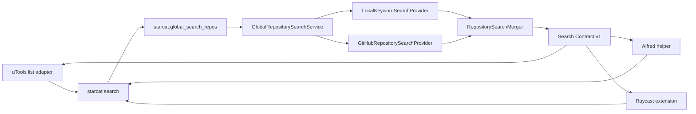

# uTools 与 Raycast 外部搜索集成详细设计

> 状态：Alfred 公共代码基线已收口，uTools 与 Raycast 待实施
>
> 日期：2026-07-29
>
> 前置基线：[Alfred 外部搜索集成详细设计](52-Alfred外部搜索集成详细设计.md)
>
> 适用范围：Starcat Pro、`starcat-cli`、uTools 插件、Raycast Extension

---

## 0. 结论

uTools 与 Raycast 不需要新增搜索业务接口，继续复用已经为 Alfred 建立的调用链：

```text
Launcher Adapter
    -> starcat search
    -> starcat.global_search_repos
    -> GlobalRepositorySearchService
    -> LocalKeywordSearchProvider + GitHubRepositorySearchProvider
```

三种外部工具共享：

- `starcat search` 命令及参数。
- `schema_version = 1` 的成功 JSON。
- 稳定错误码。
- 来源、去重、排序和打开 URL 语义。
- 跨适配器 contract fixtures。

三种外部工具不共享：

- Alfred Script Filter JSON、uTools 列表 item、Raycast `List.Item` 等 UI 模型。
- Alfred 的 Go helper。
- Alfred 的本地头像缓存。Raycast 原生支持 HTTPS 图片；uTools 的图标行为需要在真机验证后决定是否直接使用 URL 或增加轻量缓存。
- 各平台的构建、签名、安装和商店发布流程。

首轮只做 macOS。Starcat App 当前只运行于 macOS，因此 uTools 插件必须把 feature 限制为 `darwin`，Raycast manifest 必须声明：

```json
{
  "platforms": ["macOS"]
}
```

---

## 1. 目标与非目标

### 1.1 用户目标

用户在 uTools 或 Raycast 中输入仓库关键词后，可以：

1. 搜索 Starcat 本地仓库与 GitHub 仓库。
2. 看到 owner / organization avatar。
3. 看到明确来源：`Starcat 本地` 或 `GitHub`。
4. Return 后，本地结果在 Starcat 中打开，纯远端结果在 GitHub 中打开。
5. 在 CLI 未安装、未配对、MCP 未开启、非 Pro、版本过旧时获得可执行的修复提示。

### 1.2 非目标

首版不包含：

- uTools / Raycast 直接访问 MCP endpoint。
- uTools / Raycast 读取 Starcat SQLite、Keychain、Local API Key 或 GitHub Token。
- 为每个平台复制 Local FTS、GitHub Search 或跨来源去重算法。
- 在启动器中修改 Star、标签、笔记、阅读状态。
- Web Reference、语义搜索、GitHub 分页。
- 把平台专属 UI JSON 加进 MCP Tool。
- 为 Windows / Linux 提供“远程搜索但打不开 Starcat”的残缺版本。
- 把 uTools 或 Raycast 的 AI Tool 能力纳入首版。

---

## 2. 现有实现审查

本节审查基线为 2026-07-29 的三个工作区：

- Starcat 主仓库。
- `supports/starcat-cli`。
- `supports/starcat-alfred-workflow`。

### 2.1 已确认可复用

| 层 | 已实现事实 | 结论 |
|----|------------|------|
| App | `GlobalRepositorySearchService` 并发执行 Local / GitHub Provider | 继续复用 |
| App | `RepositorySearchMerger` 统一 GitHub ID / `owner/name` 去重 | 禁止适配器再次去重 |
| App | MCP DTO 输出来源、头像、`open_url`、Provider 状态和 warning | 作为三端唯一数据契约 |
| App | 本地结果生成 `starcat://repo/...`，远端结果输出 GitHub HTTPS URL | 适配器只校验并打开 |
| CLI | 顶层 `starcat search` 映射 `starcat.global_search_repos` | uTools / Raycast 直接调用 |
| CLI | `--source all|local|github`、`--limit 1...50` 已校验 | 可直接映射 scope 控件 |
| CLI | stdout 为业务 JSON，stderr 为错误 | 适合进程调用 |
| Alfred | 已验证 argv 调用、超时、来源展示、错误提示和头像 fallback | 可作为交互与测试参考 |

### 2.2 开始其他适配器前的修复门槛

以下不是 uTools / Raycast 的功能需求，而是本次代码审查发现的公共基线问题。应先修复 P1，再创建两个新适配器仓库。

| ID | 优先级 | 发现 | 影响 | 修复验收 |
|----|--------|------|------|----------|
| R-01 | P1 | `starcat-alfred-workflow/scripts/build.sh` 计算了 `repo_dir`，但没有切换工作目录；从 `/tmp` 执行时 `go list` 已复现 `go.mod file not found` | CI、打包脚本或其他目录调用会失败 | 脚本在任意 cwd 均可构建；增加 shell smoke test |
| R-02 | P1 | CLI 对外虽输出 `STARCAT_ERROR <code>`，但内部仍通过英文 `message contains` 把 MCP error 映射为 code | App 文案变化会让所有 Launcher 降级成 `SEARCH_FAILED` | MCP / CLI 之间提供结构化错误 code，CLI 不再解析英文 |
| R-03 | P1 | Starcat 设置页已指向 `starcat-alfred-workflow` GitHub URL，但 Workflow 仓库当前尚无首个 commit / release，Alfred 人工验收 A-01~A-15 也未完成 | 正式版本中的安装入口可能 404 或指向不可安装状态 | 仓库公开、首个 release 可下载、干净 Mac 验收通过后再发布设置页入口 |
| R-04 | P2 | Alfred `avatarcache.Hydrate` 每次 hydrate 后都扫描缓存；设计要求每 24 小时最多 cleanup 一次 | 连续搜索时产生无必要目录扫描 | 增加 `cleanup-state.json` 或等价时间门控及测试 |
| R-05 | P2 | MCP `globalSearchRepos` 对 `limit <= 0` 使用默认值、对 `> 50` 静默裁剪，但公开 schema 表达的是 `1...50` | MCP 直连者与 CLI 参数行为不一致 | 选择“严格报错”或明确文档化 clamp；三端 fixture 固定同一语义 |
| R-06 | P2 | Alfred HTTPS 打开校验只限制 `github.com` host，没有限制为仓库两段路径 | 上游异常数据可能打开非仓库 GitHub 页面 | 统一公共 `open_url` 校验 fixture，至少拒绝凭据、非 HTTPS、非 allowlist host |

#### 2.2.1 2026-07-29 修复结果

| ID | 状态 | 实现与证据 |
|----|------|------------|
| R-01 | 已修复 | 构建脚本先切换到 `repo_dir`，再使用相对 package；已从 `/tmp` 调用成功并生成 `arm64` / `x86_64` universal binary。 |
| R-02 | 已修复 | MCP 错误新增 `schema_version` / `code` / `message` 结构，CLI 使用 typed error 分类，不再解析英文全文；CLI tests 与 `go vet` 通过。 |
| R-03 | 部分修复 | `starcat-app/starcat-alfred-workflow` 公开仓库与 `main` 已建立，设置页在可安装 Release 就绪前保持禁用；首个 Release、A-01~A-15 和干净 Mac 验收仍未完成。 |
| R-04 | 已修复 | 头像缓存增加 cleanup state 与跨进程 lock，清理每 24 小时最多执行一次；覆盖 23 小时不重复、25 小时重新执行测试。 |
| R-05 | 已修复 | MCP 与 CLI 对 `limit` 统一采用 `1...50` 严格校验，越界返回 `INVALID_ARGUMENTS`，不再静默裁剪。 |
| R-06 | 已修复 | Alfred 只允许无凭据、无自定义端口的版本化 `starcat://repo/...`，或无 query 的 `https://github.com/{owner}/{repo}`；非法路径已有测试。 |

### 2.3 当前测试证据与未覆盖边界

已通过：

- Starcat 定向 Swift tests。
- `starcat-cli` Go tests 与 `go vet`。
- `starcat-alfred-workflow` Go tests、`go vet`、`plutil -lint`。
- Alfred universal helper 的 `arm64` / `x86_64` 架构检查。

仍未证明：

- Alfred Workflow 的真实导入、快速输入、头像二次刷新和 Deep Link 行为。
- Developer ID / Gatekeeper 下的 helper 可执行性。
- uTools `list` 模式是否稳定展示远程 HTTPS avatar。
- Raycast 中连续输入时对子进程的真实取消行为。
- 三个 Launcher 对同一 fixture 的字段和错误映射完全一致。

---

## 3. 可扩展架构



### 3.1 边界原则

1. `starcat search` 是 Launcher 的唯一进程入口。
2. MCP Tool 是搜索业务的唯一外部协议入口。
3. Launcher Adapter 只负责：
   - CLI 定位。
   - 进程超时与取消。
   - JSON decode。
   - 平台 UI 映射。
   - 安全打开 URL。
4. Launcher Adapter 不负责：
   - Provider 选择算法。
   - 去重。
   - 重新排序。
   - Pro 判断。
   - GitHub 鉴权。
5. 新 Launcher 优先增加 adapter，不新增 MCP Tool。

### 3.2 为什么不创建跨平台 runtime SDK

uTools 使用 CommonJS / Node，Raycast 使用 TypeScript / React，Alfred helper 使用 Go。为了“共享”而引入一个多语言 runtime SDK，会产生版本和打包负担。

首版共享静态契约即可：

```text
supports/starcat-cli/
└── contracts/
    └── global-search/
        ├── schema-v1.json
        ├── success-all.json
        ├── success-local-warning.json
        ├── empty.json
        ├── error-codes.json
        └── README.md
```

各适配器把同一组 JSON fixture 复制到测试资源，或在 CI checkout `starcat-cli` 后读取。不要在运行时依赖另一个源码仓库。

---

## 4. 公共 CLI 契约

### 4.1 命令

```bash
starcat search "<query>" --source all --limit 30
```

参数：

| 参数 | 类型 | 默认 | 约束 |
|------|------|------|------|
| `query` | string | 无 | trim 后 1...200 字符 |
| `--source` | enum | `all` | `all`、`local`、`github` |
| `--limit` | integer | `30` | 1...50 |

所有适配器必须使用 `execFile` / argv 数组，禁止：

```text
exec("starcat search " + query)
shell: true
/bin/zsh -c ...
```

### 4.2 成功输出

stdout 只输出 JSON：

```json
{
  "schema_version": 1,
  "query": "local rag",
  "returned_count": 1,
  "items": [
    {
      "repo_id": 123,
      "owner": "starcat-app",
      "name": "starcat",
      "full_name": "starcat-app/starcat",
      "description": "A GitHub Stars knowledge base",
      "language": "Swift",
      "stars_count": 1200,
      "is_private": false,
      "is_starred": true,
      "primary_source": "local",
      "sources": ["local", "github"],
      "icon_url": "https://github.com/starcat-app.png?size=80",
      "open_url": "starcat://repo/starcat-app/starcat?v=1&rid=123",
      "html_url": "https://github.com/starcat-app/starcat",
      "updated_at": "2026-07-29T08:00:00Z"
    }
  ],
  "providers": {
    "local": {"status": "success", "count": 1, "message": null},
    "github": {"status": "success", "count": 1, "message": null}
  },
  "warnings": []
}
```

适配器必须：

- 拒绝未知 `schema_version`。
- 忽略未知字段，允许 v1 增量增加 optional 字段。
- 不根据 `sources` 再次决定主来源，直接使用 `primary_source`。
- 不根据 `is_starred` 自行构造打开 URL，直接使用经过校验的 `open_url`。
- 不持久化完整结果、query 或 private repo 描述。

### 4.3 稳定错误输出

目标契约：

```text
stderr: STARCAT_ERROR <CODE>: <human message>
exit: non-zero
```

稳定 code：

| code | 含义 | Launcher 动作 |
|------|------|---------------|
| `CLI_NOT_FOUND` | 找不到可执行文件 | 引导安装或配置绝对路径 |
| `CLI_NOT_PAIRED` | CLI 未配对 | 引导到 Starcat MCP 设置 |
| `REQUIRES_PRO` | 当前无 Pro entitlement | 打开 Pro 页面 |
| `MCP_DISABLED` | MCP Service 未开启或不可连接 | 引导开启服务 |
| `UPGRADE_REQUIRED` | Tool / schema 版本不兼容 | 升级 App 与 CLI |
| `SEARCH_TIMEOUT` | 超时 | 重试并检查服务 / 网络 |
| `SEARCH_FAILED` | 其他归一化失败 | 运行 `starcat doctor` |

`CLI_NOT_FOUND` 由适配器本地生成，其他 code 由 CLI 提供。适配器不得长期解析英文错误全文。

### 4.4 版本发现

安装诊断可以调用：

```bash
starcat version
starcat capabilities
starcat doctor
```

正常搜索热路径不应每次先调用 capabilities。遇到 `UPGRADE_REQUIRED` 时再显示升级提示。

---

## 5. 公共 Adapter 规则

### 5.1 CLI 定位顺序

1. 用户显式配置的绝对路径。
2. `PATH` 中的 `starcat`。
3. `/opt/homebrew/bin/starcat`。
4. `/usr/local/bin/starcat`。
5. `~/.local/bin/starcat`。

安全约束：

- 显式路径必须是绝对路径。
- 必须是 regular file 且可执行。
- 不通过 shell 展开 `~`、环境变量或通配符。
- 不自动下载、替换或升级 CLI。

### 5.2 取消与旧结果覆盖

每次输入变化时：

1. 增加 `requestID`。
2. 取消上一个 timer。
3. 终止上一个 CLI 子进程。
4. debounce 后启动新进程。
5. 只有完成时仍等于当前 `requestID` 的结果可以上屏。

建议：

- debounce：150...250 ms。
- 单次 CLI timeout：8 秒。
- 空 query 不启动 CLI。
- 进程 stdout 上限：2 MiB。
- stderr 上限：64 KiB。

只依赖 `AbortController` 而不终止子进程是不完整的；底层 `execFile` 必须接收 `signal`，或显式 kill 上一个 child。

### 5.3 URL allowlist

只允许：

```text
starcat://repo/{owner}/{name}?v=1&rid=...
https://github.com/{owner}/{name}
```

共同校验：

- 禁止 URL user info。
- `starcat` host 必须为 `repo`，path 必须恰好两段。
- HTTPS host 必须为 `github.com`，path 至少验证为仓库两段。
- 禁止 `javascript:`、`file:`、`data:`、任意自定义 scheme。
- 打开失败只显示错误，不 fallback 到另一个 URL。

---

## 6. uTools 集成设计

### 6.1 技术选择

使用 uTools 官方模板插件的 `window.exports` + `mode: "list"`：

- 不创建自定义 React / Vue 页面。
- `preload.js` 使用 CommonJS。
- 使用 Node 原生 `child_process.execFile` 调用 CLI。
- `search` 回调更新官方列表。
- `select` 回调通过 `utools.shellOpenExternal` 打开 URL。

官方文档明确说明 list 模式提供 `enter`、`search`、`select` 和 `callbackSetList`。此范围不需要引入前端框架，也不需要运行 HTTP server。

### 6.2 独立仓库

```text
supports/starcat-utools-plugin/        # 独立 Git 仓库
├── .gitignore
├── LICENSE
├── README.md
├── README-ZH.md
├── package.json
├── plugin.json
├── preload.js
├── assets/
│   ├── logo.png
│   └── repo-fallback.png
├── src/
│   ├── cli.js
│   ├── contract.js
│   ├── errors.js
│   ├── list-items.js
│   ├── search-controller.js
│   └── url-policy.js
├── test/
│   ├── fixtures/
│   ├── cli.test.js
│   ├── contract.test.js
│   ├── errors.test.js
│   ├── list-items.test.js
│   └── url-policy.test.js
└── scripts/
    └── verify-package.sh
```

虽然 `preload.js` 不能压缩或混淆，但仍可把可测试纯逻辑放在 `src/*.js`，由 preload 以 CommonJS `require` 引入。

### 6.3 `plugin.json`

建议：

```json
{
  "logo": "assets/logo.png",
  "preload": "preload.js",
  "features": [
    {
      "code": "starcat-repository-search",
      "explain": "搜索 Starcat 本地与 GitHub 仓库",
      "icon": "assets/logo.png",
      "platform": ["darwin"],
      "cmds": ["Starcat", "仓库搜索"]
    }
  ]
}
```

约束：

- 不配置 `main`，启用模板插件。
- `code` 与 `window.exports` key 完全一致。
- `platform` 只允许 `darwin`。
- 首版不配置 `tools`，避免把 Launcher UI 与 uTools AI Agent Tool 混在一起。

### 6.4 `preload.js` 骨架

```js
const { createSearchController } = require("./src/search-controller");
const { safeOpenURL } = require("./src/url-policy");

const controller = createSearchController();

window.exports = {
  "starcat-repository-search": {
    mode: "list",
    args: {
      enter: (_action, setList) => {
        setList([controller.placeholderItem()]);
      },
      search: (_action, searchWord, setList) => {
        controller.search(searchWord, setList);
      },
      select: (_action, item) => {
        const url = safeOpenURL(item.openURL);
        if (!url) return;
        utools.hideMainWindow();
        utools.shellOpenExternal(url);
        utools.outPlugin();
      },
      placeholder: "搜索 Starcat 本地与 GitHub 仓库"
    }
  }
};
```

这只是结构示意。真实实现必须：

- catch 所有 Promise / callback error。
- 取消上一个 child。
- 用 request ID 防止旧结果覆盖。
- 限制 stdout / stderr 大小。
- 不把原始 stderr 直接展示给用户。

### 6.5 列表映射

```js
{
  title: "owner/repo",
  description: "Starcat 本地 · Swift · ★ 12.4k · 项目描述",
  icon: "https://github.com/owner.png?size=80",
  openURL: "starcat://repo/owner/repo?v=1&rid=123"
}
```

字段规则与 Alfred 一致：

- title：`full_name`。
- description：来源 + language + stars + description。
- 来源永远在 description 首段。
- error / empty / warning item 不携带 `openURL`。
- private repo 不写日志。

### 6.6 uTools 图标决策

官方 list 模式只把 `icon` 定义为可选字符串，没有在同一页给出远程 URL、Data URL 和本地路径的完整兼容矩阵。因此实施顺序必须是：

1. 用公开 GitHub avatar HTTPS URL 做真机 spike。
2. 验证首次显示、缓存、断网、重定向、浅色 / 深色主题。
3. 若 HTTPS URL 稳定，直接使用 `icon_url`，fallback 使用本地资源。
4. 若不稳定，再实现与 Alfred 相同安全边界的轻量头像缓存。

不得在验证前复制 Alfred 的完整缓存系统。uTools 本身运行在 Electron / Node 环境，平台约束不同。

### 6.7 Scope

首版提供一个持久化 scope：

```text
全部 / 本地 / GitHub
```

如果官方模板 list 无合适下拉 UI，首版固定 `all`，不为 scope 创建自定义页面。不要为了一个筛选器放弃官方模板模式。

### 6.8 错误交互

错误以不可执行列表项展示：

```js
{
  title: "Starcat CLI 尚未配对",
  description: "在 Starcat 的 MCP 设置中复制配对命令",
  icon: "assets/repo-fallback.png"
}
```

可选增强：选择错误项后打开 Starcat 的设置 Deep Link。只有在 Starcat 提供稳定设置路由后再实现，首版不猜测 URL。

### 6.9 测试

自动化：

1. CLI 路径查找。
2. query 只作为 argv。
3. source / limit 参数。
4. v1 JSON decode。
5. 未知 schema 拒绝。
6. 本地 / GitHub / merged 来源文本。
7. stars / description 格式。
8. stable error code 映射。
9. URL allowlist。
10. debounce 和旧结果丢弃。
11. 子进程 timeout / abort。
12. stdout / stderr 上限。
13. `plugin.json` JSON 校验和 feature / export key 一致性。

人工：

- U-01：`Starcat` 指令可进入列表。
- U-02：输入时无 shell 注入。
- U-03：本地结果打开 Starcat。
- U-04：纯远端结果打开 GitHub。
- U-05：来源和 avatar 正确。
- U-06：连续快速输入不闪回旧结果。
- U-07：CLI missing / unpaired / MCP disabled / Free / old version 提示正确。
- U-08：GitHub 失败时本地结果仍展示。
- U-09：空结果不可执行。
- U-10：浅色 / 深色主题可读。
- U-11：macOS Intel 与 Apple Silicon 各验证一次。
- U-12：UPXS 安装与卸载不留下搜索结果缓存。

### 6.10 打包与发布

开发验证：

1. 在 uTools 开发者工具中选择 `plugin.json`。
2. 接入开发。
3. 完成 U-01~U-11。

离线包：

- 通过开发者工具生成 UPXS。
- UPXS 只用于测试或内部分享。
- 不把打包动作混进主仓库构建。

正式发布：

- 走 uTools 应用市场审核。
- 市场运行平台只选 macOS。
- 发布前核对 semver、隐私说明、CLI / Pro 前置条件。

---

## 7. Raycast 集成设计

### 7.1 技术选择

使用官方 TypeScript / React Extension：

- `List` 显示结果。
- `onSearchTextChange` + `throttle` 驱动服务端式搜索。
- `usePromise` 管理 async state，并用 `AbortController` 取消前一请求。
- Node `child_process.execFile` 调用 CLI。
- `Image` 直接使用 HTTPS `icon_url`，并提供本地 fallback。
- `Action.Open` 或 `open(target)` 打开 `open_url`。

Raycast 的图片 API 明确支持绝对 HTTPS URL 和 fallback，因此不实现 Alfred 式磁盘头像缓存。

### 7.2 独立仓库

```text
supports/starcat-raycast-extension/    # 独立 Git 仓库
├── .gitignore
├── LICENSE
├── README.md
├── README-ZH.md
├── CHANGELOG.md
├── package.json
├── package-lock.json
├── tsconfig.json
├── eslint.config.js
├── assets/
│   ├── icon.png
│   ├── icon@dark.png
│   └── repo-fallback.png
├── src/
│   ├── search-repositories.tsx
│   └── lib/
│       ├── cli.ts
│       ├── contract.ts
│       ├── errors.ts
│       ├── presentation.ts
│       └── url-policy.ts
└── tests/
    ├── fixtures/
    ├── cli.test.ts
    ├── contract.test.ts
    ├── errors.test.ts
    └── url-policy.test.ts
```

### 7.3 manifest

`package.json` 是 npm manifest 与 Raycast manifest 的合并文件：

```json
{
  "name": "starcat",
  "title": "Starcat",
  "description": "Search Starcat and GitHub repositories",
  "icon": "icon.png",
  "author": "<raycast-store-handle>",
  "platforms": ["macOS"],
  "categories": ["Developer Tools", "Productivity"],
  "license": "MIT",
  "commands": [
    {
      "name": "search-repositories",
      "title": "Search Repositories",
      "description": "Search Starcat local and GitHub repositories",
      "mode": "view"
    }
  ],
  "preferences": [
    {
      "name": "starcatCliPath",
      "title": "Starcat CLI",
      "description": "Optional absolute path to the starcat executable",
      "type": "textfield",
      "required": false,
      "placeholder": "/opt/homebrew/bin/starcat"
    },
    {
      "name": "source",
      "title": "Search Source",
      "description": "Choose the repository source",
      "type": "dropdown",
      "required": true,
      "default": "all",
      "data": [
        {"title": "All", "value": "all"},
        {"title": "Local", "value": "local"},
        {"title": "GitHub", "value": "github"}
      ]
    }
  ]
}
```

`author` 必须在实施时填写真实 Raycast Store handle，不能提交占位符。

### 7.4 UI 骨架

```tsx
export default function SearchRepositories() {
  const [query, setQuery] = useState("");
  const abortable = useRef<AbortController>();
  const preferences = getPreferenceValues<Preferences>();

  const { data, error, isLoading } = usePromise(
    searchRepositories,
    [query, preferences.source, preferences.starcatCliPath],
    {
      abortable,
      execute: query.trim().length > 0
    }
  );

  return (
    <List
      filtering={false}
      isLoading={isLoading}
      onSearchTextChange={setQuery}
      throttle
      searchBarPlaceholder="Search Starcat and GitHub repositories"
    >
      {/* empty / error / warning / repository items */}
    </List>
  );
}
```

注意：

- `usePromise` 的 abort signal 必须继续传入 `execFile`。
- `filtering={false}`，因为结果排序由 Starcat 决定，不能让 Raycast 再 fuzzy reorder。
- `execute` 在空 query 时为 false。
- 不使用分页。

### 7.5 `List.Item` 映射

```tsx
<List.Item
  id={repo.repo_id ? `repo:${repo.repo_id}` : `repo-name:${repo.full_name.toLowerCase()}`}
  title={repo.full_name}
  subtitle={presentationSubtitle(repo)}
  icon={{
    source: repo.icon_url,
    fallback: "repo-fallback.png",
    mask: Image.Mask.Circle
  }}
  accessories={[
    { tag: repo.primary_source === "local" ? "Starcat 本地" : "GitHub" },
    repo.language ? { text: repo.language } : null
  ].filter(Boolean)}
  actions={
    <ActionPanel>
      <Action.Open title="Open Repository" target={repo.open_url} />
      <Action.CopyToClipboard title="Copy GitHub URL" content={repo.html_url} />
    </ActionPanel>
  }
/>
```

首版来源至少在 subtitle 或 accessory 中出现一次。若 accessory 已清晰显示来源，subtitle 仍应包含描述，不要出现两次相同来源文本。

### 7.6 头像策略

- 主路径：`icon_url` HTTPS。
- fallback：`assets/repo-fallback.png`。
- 可用 `Image.Mask.Circle`。
- 不自行下载到磁盘。
- 不把 avatar fetch 错误当作搜索失败。
- 不向头像请求添加 Starcat / GitHub 凭据。

### 7.7 Actions

默认 Return：

- 本地：`starcat://repo/...`。
- 远端：`https://github.com/...`。

附加 Action：

- Copy GitHub URL。
- Open in GitHub：本地结果也可以通过 `html_url` 打开。
- Run `starcat doctor` 不应直接作为 action 执行，因为会产生终端型文本且用户不可见；改为复制诊断命令。

所有 URL 在构建 action 前先经过 allowlist。无效条目直接丢弃，并在底部显示一条 warning。

### 7.8 错误交互

预期错误使用：

- `List.EmptyView`：空 query、无结果、前置条件错误。
- `Toast`：重试、打开失败等瞬时错误。
- Action：打开 Extension Preferences、复制 `starcat doctor`。

不要让预期错误成为未处理 Promise rejection。Raycast 生产环境只显示 error message，稳定错误映射必须在 extension 内完成。

### 7.9 测试

自动化：

1. `npm run lint`。
2. `npm run build`。
3. TypeScript 类型检查。
4. CLI 路径和 argv。
5. v1 JSON / 未知 schema。
6. source / limit。
7. presentation mapping。
8. stable error code。
9. URL allowlist。
10. timeout / abort / stale result。
11. remote avatar + fallback props。
12. fixture 与 CLI contract 同步检查。

人工：

- RY-01：命令可从 Raycast root search 打开。
- RY-02：输入时 loading / throttle 正常。
- RY-03：本地结果打开 Starcat。
- RY-04：远端结果打开 GitHub。
- RY-05：头像、来源、language、stars、description 正确。
- RY-06：快速输入不会旧结果覆盖。
- RY-07：全部稳定错误提示正确。
- RY-08：GitHub 单侧失败仍显示本地结果和 warning。
- RY-09：空结果和空 query 正确。
- RY-10：浅色 / 深色主题正确。
- RY-11：preferences 路径与 scope 生效。
- RY-12：Intel / Apple Silicon 各验证一次。

### 7.10 发布

开发：

```bash
npm install
npm run dev
```

发布前验证：

```bash
npm run lint
npm run build
```

正式发布：

- 使用 npm 与 `package-lock.json`。
- LICENSE 为 MIT。
- `platforms` 只包含 macOS。
- 准备 `CHANGELOG.md` 和商店截图。
- `npm run publish` 会创建到 `raycast/extensions` 的 Pull Request。
- 等待 Raycast review 合并后才视为公开发布完成。

禁止在一般开发任务中自动执行 `npm run publish`。

---

## 8. 三个平台差异矩阵

| 维度 | Alfred | uTools | Raycast |
|------|--------|--------|---------|
| UI | Script Filter | 官方模板 list | React `List` |
| 适配语言 | Go | CommonJS / Node | TypeScript / React |
| CLI 调用 | `exec.CommandContext` | `execFile` | `execFile` |
| 搜索节流 | Alfred 输入调度 + helper timeout | adapter debounce | `List throttle` + `usePromise` |
| 取消 | context kill | AbortSignal / child kill | AbortController / child kill |
| 远程头像 | 不支持，必须本地缓存 | 先真机验证 | 官方支持 HTTPS |
| fallback | 本地 PNG | 本地 PNG | extension asset |
| 打开 URL | Open URL Action | `shellOpenExternal` | `Action.Open` / `open` |
| 配置 | Workflow variables | 插件设置能力有限 | manifest preferences |
| 安装包 | `.alfredworkflow` | UPXS / 应用市场 | Raycast Store |
| 支持平台 | macOS | 只开放 `darwin` | `["macOS"]` |

---

## 9. 仓库与 Starcat 设置页

### 9.1 仓库边界

新增两个独立仓库：

```text
supports/starcat-utools-plugin/
supports/starcat-raycast-extension/
```

要求：

- 各自初始化 Git。
- 父 Starcat 仓库不 force-add。
- 各自维护 README、LICENSE、测试和 release。
- 公共 contract 真源放在 `starcat-cli`，不放主 App。

### 9.2 Starcat 设置页

待两个项目有可安装公开地址后，在 Integrations 页面增加：

- Alfred。
- uTools。
- Raycast。

每项只提供：

- 平台说明。
- `需要 Starcat Pro`。
- 安装 / 查看文档链接。
- MCP Service 共用状态。

不要在设置页为三个工具分别维护配对状态。三者都复用同一个 CLI profile 与 MCP 服务。

设置页链接只能在对应仓库和安装入口真实可访问后加入正式版本，禁止先指向空仓库。

---

## 10. 实施顺序

### Phase 0：收口 Alfred 公共基线

1. [x] 修复 R-01 构建 cwd。
2. [x] 修复 R-02 结构化错误 code。
3. [x] R-05 采用 `limit = 1...50` 严格报错语义。
4. [ ] 添加跨适配器 contract fixtures。
5. [ ] 完成 Alfred A-01~A-15。
6. [ ] 建立可安装的 Alfred release。

验收：公共 CLI 契约不再依赖英文错误文案。

### Phase 1：uTools spike

1. 创建独立仓库。
2. 验证 `window.exports` list async 搜索。
3. 验证远程 avatar。
4. 验证 `shellOpenExternal` 打开 `starcat://`。
5. 记录 spike 结论，再进入完整实现。

验收：在真机上用最小插件完成一条本地结果和一条 GitHub 结果。

### Phase 2：uTools 完整实现

1. CLI adapter。
2. contract / error / URL policy。
3. list mapping。
4. cancellation。
5. tests / README。
6. U-01~U-12。

验收：生成可人工安装的 UPXS，但不自动发布。

### Phase 3：Raycast 完整实现

1. 创建 Extension。
2. CLI adapter。
3. `List`、preferences、actions。
4. cancellation。
5. tests / README / changelog。
6. RY-01~RY-12。

验收：`npm run build` 通过并可在 Raycast dev mode 使用，但不自动 publish。

### Phase 4：Starcat 设置页与公开发布

1. 两个仓库公开。
2. 安装地址稳定。
3. 设置页增加入口及 i18n。
4. 分别走 uTools 与 Raycast 商店流程。

验收：干净 Mac 能从公开入口安装并完成搜索。

---

## 11. Definition of Done

公共基线：

- [x] R-01、R-02、R-04、R-05、R-06 已修复并有自动化证据。
- [ ] R-03 完成公开 Release 与干净 Mac 人工验收。
- [ ] `starcat-cli/contracts/global-search` 成为 v1 fixture 真源。
- [x] MCP / CLI 错误分类不依赖英文全文。
- [ ] 三端 adapter 对同一 fixture 输出一致的 title、来源和打开行为。
- [ ] 三端都不读取数据库、Keychain 或 GitHub Token。

uTools：

- [ ] 使用 `window.exports` list 模式。
- [ ] feature 只开放 `darwin`。
- [ ] 查询只走 argv。
- [ ] timeout、取消和旧结果保护生效。
- [ ] 本地 / GitHub 打开正确。
- [ ] 图标 spike 结论有自动化或人工证据。
- [ ] U-01~U-12 有验收记录。
- [ ] README / README-ZH 同步。

Raycast：

- [ ] `platforms = ["macOS"]`。
- [ ] 使用 `List` + `usePromise`。
- [ ] `filtering={false}`，不改变 Starcat 排序。
- [ ] HTTPS avatar + fallback 生效。
- [ ] timeout、取消和旧结果保护生效。
- [ ] 本地 / GitHub actions 正确。
- [ ] `npm run lint` 与 `npm run build` 通过。
- [ ] RY-01~RY-12 有验收记录。
- [ ] README / README-ZH / CHANGELOG 同步。

发布：

- [ ] 三个 Launcher 仓库边界独立。
- [ ] Starcat 设置页只指向真实可安装地址。
- [ ] 未执行未经授权的 package / publish / upload。

---

## 12. 官方参考

uTools：

- [plugin.json 核心配置](https://www.u-tools.cn/docs/developer/information/plugin-json.html)
- [模板插件应用与 list 模式](https://www.u-tools.cn/docs/developer/information/window-exports.html)
- [preload 预加载脚本](https://www.u-tools.cn/docs/developer/information/preload-js/preload-js.html)
- [系统 API：shellOpenExternal](https://www.u-tools.cn/docs/developer/api-reference/utools/system.html)
- [动态指令与 platform](https://www.u-tools.cn/docs/developer/api-reference/utools/features.html)
- [打包为离线安装包](https://www.u-tools.cn/docs/developer/basic/offline-plugin.html)

Raycast：

- [Manifest](https://developers.raycast.com/information/manifest)
- [File Structure](https://developers.raycast.com/information/file-structure)
- [List](https://developers.raycast.com/api-reference/user-interface/list)
- [Icons & Images](https://developers.raycast.com/api-reference/user-interface/icons-and-images)
- [usePromise](https://developers.raycast.com/utilities/react-hooks/usepromise)
- [Preferences](https://developers.raycast.com/api-reference/preferences)
- [System Utilities / open](https://developers.raycast.com/api-reference/utilities)
- [Prepare an Extension for Store](https://developers.raycast.com/basics/prepare-an-extension-for-store)
- [Publish an Extension](https://developers.raycast.com/basics/publish-an-extension)
