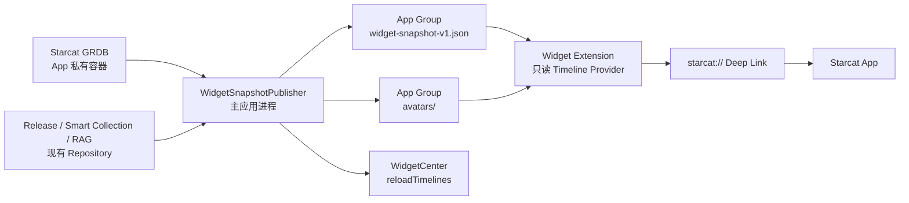

# Starcat macOS 桌面小组件初步方案

> 状态：初步方案，待确认首发组件和产品门控
>
> 适用版本：v1.2 及后续版本
>
> 目标平台：macOS 15+
>
> 调研时间：2026-07-30

---

## 1. 产品定位

Starcat 已通过 Alfred、uTools、Raycast 解决“主动唤起并搜索仓库”的需求。macOS Widget
不应再复制一个不能良好输入文字的搜索框，而应提供：

- 被动看到值得关注的信息。
- 一次点击返回重要仓库。
- 不打开 Starcat 也能知道 Release、知识库和整理状态。
- 让长期收藏的仓库重新被发现。

因此，小组件的定位是：

> Starcat 数据的只读桌面摘要与快速返回入口。

---

## 2. 目标与非目标

### 2.1 首轮目标

1. 提供 `Starcat Focus`、`今日重逢`、`Release Watch` 三类小组件。
2. 支持 Small、Medium、Large 中与内容匹配的尺寸。
3. 复用现有仓库 Deep Link。
4. 主应用准备只读快照，Widget Extension 不直接访问业务数据库。
5. App Store 与 Direct 两个分发渠道都能正确嵌入和签名 Widget。
6. 私有仓库和用户身份切换不发生桌面数据串用。

### 2.2 首轮非目标

- 在 Widget 中提供搜索输入框。
- 在 Widget 中滚动长列表。
- Widget 直接请求 GitHub、AI Provider 或 Starcat 后端。
- Widget 读取 Keychain、GitHub Token、Local API Key。
- Widget 直接打开或迁移 Starcat 主数据库。
- 在 Widget 中生成 AI 摘要或运行 RAG。
- 首轮提供 Star / Unstar、删除、改标签等写操作。
- 用 Widget 替代系统通知。

---

## 3. 当前代码基线

### 3.1 已有可复用能力

| 能力 | 当前实现 | Widget 用途 |
|------|----------|-------------|
| 仓库 Deep Link | `Starcat/Core/Navigation/RepositoryDeepLink.swift` | 点击本地仓库回到 Starcat |
| 最近 Star | `GRDBRepoRepository.fetchRecentStarred(limit:)` | 今日重逢候选池 |
| 置顶仓库 | `GRDBRepoRepository.fetchPinnedRepoTimestamps()` | Focus 排序 |
| 正在使用 | `RepoStatus.using` | Focus 数据源 |
| Smart Collection | `HomeViewModel.matchesSmartCollection(...)` 与用户集合规则 | 可配置集合 |
| Release 未读 | `GRDBReleaseRepository.unreadCount()` | Release Watch badge |
| Release 时间线 | `GRDBReleaseRepository.fetch(forRepo:limit:)` | Release Watch 列表 |
| 知识库统计 | `KnowledgeBaseMetadataSnapshot` | 第二阶段健康度 |
| 概览统计 | `StarcatMCPFacade.getOverviewStatistics()` | 第二阶段概览 |
| owner avatar | `RepoAvatarURL.from(owner:)` | 仓库身份图标 |

### 3.2 当前缺口

当前仓库尚未包含：

- Widget Extension target。
- `WidgetBundle`。
- App Group entitlement。
- Widget 专用共享容器。
- Widget 数据快照。
- `WidgetCenter` 刷新调用。
- Widget Configuration Intent / App Entity。
- Release、Smart Collection、知识库专用 Deep Link。

Starcat 数据库当前位于应用私有的 Application Support：

```text
<Application Support>/<bundle-id>/users/<user-id>/starcat.sqlite
```

App Store target 使用沙箱；Direct target 是独立 bundle ID 且当前按非沙箱应用运行。Widget
Extension 是独立进程，不能依赖主应用内存，也不能假定可以读取上述私有路径。

---

## 4. 小组件组合

### 4.1 Starcat Focus

#### 价值

让用户持续看到当前正在使用或主动置顶的仓库，并一键打开详情。

#### 数据源

优先顺序：

1. 用户为该 Widget 配置的指定仓库。
2. `repo_pins` 中的置顶仓库。
3. `RepoStatus.using`。
4. 用户选择的 Smart Collection。

#### 尺寸

| 尺寸 | 展示 |
|------|------|
| Small | 一个仓库：头像、`owner/name`、语言、简短状态 |
| Medium | 最多三个仓库，每行可独立点击 |
| Large | 最多六个仓库，增加描述、标签或更新时间 |

### 4.2 今日重逢

#### 价值

每天重新展示一个用户很久没有关注的 Star，强化 Starcat“找回收藏价值”的产品定位。

#### 候选规则

首轮使用本地、可解释的确定性规则：

1. 必须仍是 Star 或仍在知识库。
2. 排除 archived。
3. 默认排除 Private repository。
4. 排除最近 30 天新增的仓库。
5. 排除当前 `using` 和已置顶仓库。
6. 使用“本地日期 + repo ID”稳定选出当天结果。

同一天内刷新不应随机跳到另一个仓库。后续若增加“最近打开时间”，可以优先选择长期
未打开的仓库，但首轮不为此新增数据库字段。

#### 尺寸

| 尺寸 | 展示 |
|------|------|
| Small | 一个仓库头像、名称、语言 |
| Medium | 名称、描述、Star 数、标签和“今天重新看看” |

### 4.3 Release Watch

#### 价值

展示已订阅仓库的未读 Release，让桌面组件承担“有变化时提醒”的职责。

#### 数据源

- `release_subscriptions.is_subscribed = 1`
- `releases.is_read = 0`
- Release 发布时间、tag、是否 prerelease
- 对应 repo 的 owner、name 和 avatar

#### 尺寸

| 尺寸 | 展示 |
|------|------|
| Medium | 未读总数 + 最近三个 Release |
| Large | 未读总数 + 最近六个 Release + 发布时间 |

Small 不适合展示多个 Release，首轮不支持。

### 4.4 知识库健康度

第二阶段提供，直接复用 `KnowledgeBaseMetadataSnapshot.IndexHealth`：

- total
- ready
- keyword-only
- pending
- failed
- stale
- embedding model

该组件是运维 / Power User 视图，不应排在 Focus、重逢、Release 之前。

### 4.5 Starcat 概览

可展示：

- Star 数量。
- 知识库项目数量。
- Tag 数量。
- 未整理数量。
- RAG ready / stale。

概览数据易实现但可操作性弱，建议作为后续补充，而不是首发主组件。

---

## 5. 首发范围

建议一个 Widget Extension 中使用 `WidgetBundle` 提供三个独立 kind：

```text
com.starcat.widget.focus
com.starcat.widget.rediscovery
com.starcat.widget.release-watch
```

kind 的最终值应结合 Store / Direct target 的 bundle ID 生成，不能直接把上面的示例当作
签名配置。

首发优先级：

1. `Starcat Focus`
2. `今日重逢`
3. `Release Watch`

知识库健康度和概览进入第二阶段。

---

## 6. 数据架构

### 6.1 总体架构



### 6.2 为什么不共享主数据库

不建议把 `starcat.sqlite` 迁入 App Group，原因是：

- Starcat 已发布正式版，移动数据库需要处理已有用户迁移。
- 主应用与 Widget 同时打开 GRDB 增加并发、WAL、迁移和崩溃恢复复杂度。
- Widget 只需要少量展示数据，没有读取完整数据库的必要。
- App Store / Direct 当前数据库目录和签名边界不同。
- Widget 的刷新预算决定它无法成为实时数据库观察者。

采用版本化 JSON 只读快照，可以不修改现有数据库 schema。

### 6.3 快照文件

建议：

```text
<App Group>/
├── widget-snapshot-v1.json
└── avatars/
    ├── <owner-hash>.png
    └── ...
```

主应用使用临时文件 + 原子替换提交快照。Widget 永远只读完整旧文件或完整新文件，不能
看到半写入状态。

### 6.4 Swift 数据模型

```swift
struct WidgetSnapshot: Codable, Sendable {
    let schemaVersion: Int
    let generatedAt: Date
    let state: WidgetAccountState
    let repositories: [WidgetRepository]
    let focusRepositoryIDs: [Int64]
    let rediscoveryRepositoryID: Int64?
    let unreadReleases: [WidgetRelease]
    let overview: WidgetOverview
    let knowledgeBaseHealth: WidgetKnowledgeBaseHealth?
}

struct WidgetRepository: Codable, Sendable, Identifiable {
    let id: Int64
    let owner: String
    let name: String
    let description: String?
    let language: String?
    let stars: Int
    let isPrivate: Bool
    let tags: [String]
    let status: String?
    let avatarRelativePath: String?
    let openURL: URL
}
```

模型要求：

- `schemaVersion` 从 1 开始。
- 旧 Extension 遇到更高版本时显示可恢复占位，不崩溃。
- 不包含 Token、Keychain 标识、私有笔记正文、RAG chunk 或 AI 对话。
- `openURL` 由主应用通过 `RepositoryDeepLink` 构造。
- 描述和标签需要限制长度与数量，避免快照无限增长。

### 6.5 账户状态

```swift
enum WidgetAccountState: String, Codable {
    case ready
    case signedOut
    case preparing
    case unavailable
}
```

退出登录时必须先写入 `signedOut` 空快照，再调用
`WidgetCenter.shared.reloadAllTimelines()`，避免桌面继续显示上一位用户的数据。

用户数据库切换时：

1. Widget publisher 暂停。
2. 主应用完成数据库切换。
3. 从新用户数据库构建完整快照。
4. 原子替换旧快照。
5. 刷新所有 Widget。

---

## 7. 快照发布器

### 7.1 职责

建议新增一个 actor 或串行服务：

```text
WidgetSnapshotPublisher
```

它负责：

- 从现有 Repository 读取小组件需要的数据。
- 生成当天的重逢结果。
- 准备 avatar。
- 原子写入快照。
- 对短时间内的多次变化进行合并。
- 只刷新受影响的 Widget kind。

### 7.2 发布触发点

| 事件 | 受影响 Widget |
|------|---------------|
| 首次同步 / Stars 同步完成 | Focus、重逢、概览 |
| repo pin 变化 | Focus、重逢 |
| `RepoStatus` 变化 | Focus、重逢 |
| 标签变化 | Focus、重逢、概览 |
| Smart Collection 变化 | Focus |
| Release 轮询完成 | Release Watch |
| Release 标记已读 | Release Watch |
| RAG 索引批次完成 | 知识库健康度 |
| 用户切换 / 退出登录 | 全部 |
| Pro entitlement 变化 | 受门控内容 |

同一同步过程中可能产生大量 repo 更新，禁止每条记录都重写快照。应在业务批次结束后
发布一次，或使用短时 debounce 合并。

---

## 8. Timeline 与刷新策略

WidgetKit 在独立进程中按 Timeline 渲染，系统会限制刷新频率。Starcat 不应把 Widget
当成实时面板。

### 8.1 建议策略

| Widget | 主动刷新 | Timeline fallback |
|--------|----------|-------------------|
| Focus | pin / status / collection / sync 后 | 6 小时后 |
| 今日重逢 | 日期变化、同步后 | 下一个本地日期边界 |
| Release Watch | Release 轮询、标记已读后 | 4～6 小时后 |
| 知识库健康度 | 索引批次完成后 | 6 小时后 |
| 概览 | 同步和整理状态变化后 | 6 小时后 |

fallback 只是防止长期不打开主应用时显示过旧的相对时间，不代表 Widget 可以自行执行
GitHub 或 RAG 请求。

### 8.2 `WidgetCenter` 使用原则

- 优先 `reloadTimelines(ofKind:)`。
- 登录状态和用户切换才使用 `reloadAllTimelines()`。
- 只有当前展示数据变化时才刷新。
- 系统外观、语言等变化由 WidgetKit 处理，不重复请求刷新。
- Debug 环境的刷新行为不能作为发布版预算证据。

---

## 9. 配置与 App Intents

### 9.1 配置类型

使用：

```text
AppIntentConfiguration
WidgetConfigurationIntent
AppIntentTimelineProvider
AppEntity
```

Starcat 最低支持 macOS 15，不需要再维护旧 SiriKit IntentConfiguration。

### 9.2 Focus 配置

建议参数：

- Source：
  - Pinned
  - Using
  - Smart Collection
  - Specific Repository
- Repository：可选 `RepositoryAppEntity`
- Smart Collection：可选 `SmartCollectionAppEntity`
- Include Private Repositories：默认关闭

动态实体查询从 App Group 快照读取，不打开主数据库。

### 9.3 今日重逢配置

首轮保持静态配置，只提供：

- Include Private Repositories：默认关闭。

如果为了减少实现复杂度，也可以首发完全不提供该开关，并严格排除 Private repository。

### 9.4 Release Watch 配置

建议参数：

- All Subscriptions。
- Specific Repository。
- Include Prereleases：默认遵循现有订阅设置。

---

## 10. Deep Link 与点击行为

### 10.1 仓库

直接复用：

```text
starcat://repo/{owner}/{name}?v=1&rid={repo-id}
```

Small 使用一个 `widgetURL`；Medium / Large 的每一行使用独立 `Link`。

### 10.2 Release

当前仓库 Deep Link 只能定位仓库，不能明确打开 Release 区域。实施前需要选择：

1. 首轮点击 Release 只打开仓库详情，由用户进入 Release。
2. 扩展统一导航：

```text
starcat://repo/{owner}/{name}/releases?v=1&rid={repo-id}&release={release-id}
```

建议选择 2，但必须继续由统一 Deep Link 类型负责解析和校验，Widget 不自行拼接任意 URL。

### 10.3 Smart Collection 与知识库

第二阶段可增加：

```text
starcat://smart-collection/{id}?v=1
starcat://knowledge-base?v=1
```

需要同时补齐路由测试、非法 ID 测试、未登录降级和用户切换行为。

---

## 11. 项目图标与头像

Starcat 当前根据 owner 构造：

```text
https://github.com/{owner}.png?size=80
```

Widget 不应在每次 Timeline 构建时联网下载头像。建议由主应用：

1. 复用现有 Kingfisher / avatar 缓存结果。
2. 缩放为 80×80 或 128×128。
3. 转成 PNG。
4. 写入 App Group `avatars/`。
5. 在快照中写相对路径。

Widget 的 fallback 顺序：

1. App Group 本地头像。
2. 语言颜色块 + 仓库首字母。
3. Starcat 默认仓库 symbol。

头像缓存需要：

- 按 owner URL 或 owner 名称 hash。
- 有最大数量或大小。
- 主应用低频清理。
- 不因某个 Widget 渲染失败删除仍被其他 Widget 使用的头像。

---

## 12. 隐私与安全

### 12.1 默认策略

- Private repository 默认不展示。
- 私有笔记正文永不进入 Widget 快照。
- 用户可见标签最多显示少量名称。
- Widget 只显示 owner/name、公开描述和必要状态。
- 快照不包含 Token、API Key、邮箱或 GitHub OAuth 信息。
- 退出登录立即覆盖旧快照。

### 12.2 敏感内容

Widget View 中的仓库名称、描述和 Release 标题应按平台能力标记为
`privacySensitive()`，并提供合理 redacted placeholder。

macOS 桌面本身可能被录屏、共享屏幕或旁人看到，因此即使没有锁屏展示，也必须提供
“允许显示 Private repository”的显式选择，不能从主应用的授权状态推断用户愿意在桌面
公开展示。

### 12.3 URL

Widget 只允许：

- 主应用快照中生成的版本化 Starcat Deep Link。
- 明确允许的 GitHub HTTPS repository URL。

不得从 JSON 读取后直接执行任意 scheme。

---

## 13. 订阅与功能门控

首轮建议不新增 `.widgetIntegration` ProFeature。

原因：

- Widget 只是已有数据的展示入口。
- Release 订阅已有免费数量上限。
- Smart Collection 已有免费数量上限。
- 在 Widget 再增加一套门控会产生双重产品口径。

建议：

- Focus 和今日重逢对所有用户可用。
- Release Watch 展示用户当前有权订阅的数据。
- 自定义 Smart Collection 继续遵循现有集合门控。
- 知识库健康度是否 Pro-only，跟随 RAG 的现有能力边界。
- Widget 中的 entitlement snapshot 只用于显示，不作为主应用业务授权依据。

如果后续决定把全部 Widget 定义为 Pro 能力，应单独进行产品评审，不在技术实现中静默
加入。

---

## 14. App Store 与 Direct 双渠道

### 14.1 当前差异

| 渠道 | App bundle ID | 当前沙箱 |
|------|---------------|----------|
| App Store | `com.starcat.app.store` | 开启 |
| Direct | `com.starcat.app.direct` | 主应用不开启 |

Widget Extension 必须作为各自宿主的合法嵌入式扩展签名。建议：

- 共享全部 Widget Swift 源码。
- Store / Direct 使用独立 Extension target 或独立构建配置。
- Extension bundle ID 分别从宿主 bundle ID 派生。
- App Group identifier 通过 build setting 注入。
- 两个渠道分别配置 entitlements 和签名。
- CI 分别检查嵌入路径、bundle ID、App Group 和 codesign。

### 14.2 不提前硬编码 App Group

建议设置：

```text
STARCAT_WIDGET_APP_GROUP
```

实际 App Group identifier 需要在 Apple Developer 账户、App Store profile 和 Developer ID
签名流程中验证后确定。不要在初步方案阶段假设一个字符串同时适用于两个渠道。

### 14.3 安装冲突

用户可能同时安装 Store 和 Direct 版。两个渠道必须：

- 使用独立 Widget Extension bundle ID。
- 使用独立 App Group。
- 不读取对方快照。
- Widget 展示名称是否区分渠道，需要真实安装后评估。

---

## 15. 建议项目结构

```text
Starcat/
├── Features/
│   └── Widgets/
│       ├── WidgetSnapshot.swift
│       ├── WidgetSnapshotStore.swift
│       ├── WidgetSnapshotPublisher.swift
│       ├── WidgetAvatarStore.swift
│       └── WidgetRefreshCoordinator.swift
│
StarcatWidgets/
├── StarcatWidgetBundle.swift
├── Shared/
│   ├── WidgetSnapshotReader.swift
│   ├── WidgetPlaceholderView.swift
│   └── RepositoryAvatarView.swift
├── Focus/
│   ├── FocusWidget.swift
│   ├── FocusTimelineProvider.swift
│   ├── FocusWidgetView.swift
│   └── FocusWidgetIntent.swift
├── Rediscovery/
│   ├── RediscoveryWidget.swift
│   ├── RediscoveryTimelineProvider.swift
│   └── RediscoveryWidgetView.swift
└── Releases/
    ├── ReleaseWatchWidget.swift
    ├── ReleaseWatchTimelineProvider.swift
    ├── ReleaseWatchWidgetView.swift
    └── ReleaseWatchWidgetIntent.swift
```

共享 Codable 模型必须保持纯数据结构，不让 Widget target 编译完整 GRDB、网络、AI、MCP
或 StoreKit 依赖。

---

## 16. 实施阶段

### 阶段 0：签名和共享容器验证

1. 为 Store / Direct 创建最小 Widget Extension。
2. 验证两个渠道均出现在 Widget Gallery。
3. 验证主应用可以写、Extension 可以读各自 App Group。
4. 验证双安装不串数据。
5. 记录 bundle、entitlement 和 codesign 证据。

这一阶段不接业务数据，先消除双渠道最大风险。

### 阶段 1：快照基础设施

1. 定义 `WidgetSnapshot v1`。
2. 实现原子读写。
3. 实现用户切换和退出登录清空。
4. 实现 avatar 共享缓存。
5. 实现 publisher 合并刷新。
6. 增加纯 Swift 单元测试。

### 阶段 2：Starcat Focus

1. 接入 pin / using。
2. 实现 Small / Medium / Large。
3. 接入仓库 Deep Link。
4. 增加配置 Intent。
5. 完成 Light / Dark、空状态和私有仓库验证。

### 阶段 3：今日重逢

1. 实现稳定日选算法。
2. 实现 Small / Medium。
3. 验证同一天结果不跳动。
4. 验证次日切换。

### 阶段 4：Release Watch

1. 构造订阅 Release 快照。
2. 实现 Medium / Large。
3. 扩展 Release Deep Link。
4. Release 轮询和已读变化后刷新。

### 阶段 5：第二批组件

- 知识库健康度。
- Starcat 概览。
- App Intent 写操作评估。

---

## 17. 测试与验收

### 17.1 单元测试

- Snapshot encode / decode。
- 未知 schema version。
- 原子替换失败保留旧快照。
- signedOut 不携带上一用户数据。
- 用户切换快照隔离。
- 今日重逢过滤规则。
- 同一天结果稳定。
- Private repository 默认排除。
- avatar 缓存命中和 fallback。
- Deep Link allowlist。
- Focus 排序。
- Release 未读筛选和时间排序。

### 17.2 构建与签名

- `xcodegen generate` 后两个 Widget target 存在。
- Store App 正确嵌入 Store Widget Extension。
- Direct App 正确嵌入 Direct Widget Extension。
- Extension bundle ID 以各自宿主标识为前缀。
- entitlements 中 App Group 与 build setting 一致。
- `codesign -d --entitlements :-` 验证主应用和 Extension。
- Archive 中不包含重复或错误渠道的 Extension。

### 17.3 人工验收

- 首次安装并启动 Starcat 后，Widget 出现在 Gallery。
- Small / Medium / Large 布局无截断。
- Light / Dark 均可读。
- 桌面和 Notification Center 均正常。
- Widget 点击打开正确仓库。
- Starcat 未运行时点击可以启动并导航。
- Pin / using 变化后 Widget 更新。
- 今日重逢同一天保持稳定。
- Release 轮询后出现新条目。
- 退出登录后旧数据消失。
- Store / Direct 双安装不串数据。
- 断网时仍显示最后一次有效快照和本地头像。

Widget 在 Xcode Debug 下的刷新不受正常预算约束，因此必须补一次脱离 Debugger 的真实
刷新验收。

---

## 18. 风险与控制

| 风险 | 控制 |
|------|------|
| Widget 直接读主数据库导致迁移和并发风险 | 使用版本化只读 JSON 快照 |
| 同步过程中频繁 reload | publisher 合并事件，批次结束后一次发布 |
| 用户切换后显示旧账户 | signedOut / preparing 快照 + 原子替换 |
| Private repository 暴露在桌面 | 默认排除，显式配置才允许 |
| avatar 网络加载失败 | 主应用预缓存到 App Group + fallback |
| Store / Direct 签名差异 | 阶段 0 先做双渠道最小验证 |
| Widget 内容过密 | 每个 family 单独布局，限制条目数量 |
| Widget 被误当实时状态 | 使用 Timeline + “更新于”提示，不直接联网 |
| 新增第二套 Pro 口径 | 默认复用现有 entitlement，不新增 Widget gate |
| Deep Link 扩展失控 | 统一强类型解析、版本参数和路由测试 |

---

## 19. 开发前待确认

1. 首发是否确定为 Focus、今日重逢、Release Watch。
2. Focus 默认展示 Pinned 还是 `using`。
3. 今日重逢是否永久排除 Private repository，还是允许配置开启。
4. Release 点击是否需要首轮就增加 Release 专用 Deep Link。
5. Widget 是否保持全用户可用，不新增整体 Pro 门控。
6. Store / Direct 的 App Group identifier 和签名配置。
7. 是否允许在 Widget 中显示用户标签名称。
8. 第二阶段优先做知识库健康度还是 Starcat 概览。

---

## 20. 官方参考

- [Creating a widget extension](https://developer.apple.com/documentation/widgetkit/creating-a-widget-extension)
- [Keeping a widget up to date](https://developer.apple.com/documentation/widgetkit/keeping-a-widget-up-to-date)
- [Configuring App Groups](https://developer.apple.com/documentation/xcode/configuring-app-groups/)
- [Making a configurable widget](https://developer.apple.com/documentation/widgetkit/making-a-configurable-widget)
- [AppIntentConfiguration](https://developer.apple.com/documentation/widgetkit/appintentconfiguration)
- [Adding interactivity to widgets](https://developer.apple.com/documentation/widgetkit/adding-interactivity-to-widgets-and-live-activities)
- [Linking to specific app scenes](https://developer.apple.com/documentation/widgetkit/linking-to-specific-app-scenes-from-your-widget-or-live-activity)
