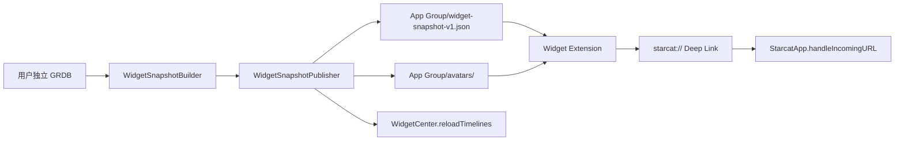

# Starcat macOS 桌面小组件详细落地方案

> 状态：已确认实施
>
> 基线提交：`aa135b7e899b209c6e074d0b4821dc302d40b8cc`
>
> 开发分支：`codex/macos-widget`
>
> 开发 worktree：`/Users/dong4j/Developer/1.AI/ai-incubator/Starcat-macos-widget`
>
> 目标平台：macOS 15+
>
> 关联初步方案：[55-macOS 桌面小组件初步方案](55-macOS桌面小组件初步方案.md)
>
> 专项清单：`docs/4-工程进度/macOS桌面小组件专项/checklist.md`

---

## 1. 交付目标

本专项一次性交付可安装、可配置、可点击、可验证的 Starcat macOS Widget：

1. `Starcat Focus`：展示用户指定、置顶或正在使用的仓库。
2. `今日重逢`：每天稳定推荐一个长期未关注的本地仓库。
3. `Release Watch`：展示订阅仓库的未读 Release。
4. App Store 与 Direct 两个主应用 target 分别嵌入匹配的 Widget Extension。
5. 主应用通过 App Group 发布只读 JSON 快照；Widget 不读取业务数据库、不联网、不读取 Keychain。
6. 退出登录、切换用户和数据准备失败时，不泄露上一位用户的数据。
7. 点击仓库或 Release 后由统一 Deep Link 路由回 Starcat 对应页面。

完成标准不是“代码存在”，而是专项 checklist 全部具备自动化或人工证据，三轮及以上审查
没有未关闭的 P0/P1 问题，最终结果报告与代码、测试、工程配置一致。

---

## 2. 边界与关键决策

### 2.1 首发范围

| Widget | 支持尺寸 | 首发内容 | 点击行为 |
|--------|----------|----------|----------|
| Starcat Focus | Small / Medium / Large | 1 / 3 / 6 个仓库 | 打开仓库详情 |
| 今日重逢 | Small / Medium | 当日稳定仓库 | 打开仓库详情 |
| Release Watch | Medium / Large | 3 / 6 条未读 Release | 打开仓库 Release 区域 |

### 2.2 明确不做

- 不提供 Widget 内搜索输入。
- 不在 Widget 进程访问 GRDB、GitHub、AI Provider、Starcat API 或 MCP。
- 不把 Starcat 数据库迁入 App Group。
- 不增加数据库 schema 或迁移。
- 不在首发 Widget 内执行 Star / Unstar、改标签、删笔记、标记 Release 已读等写操作。
- 不为 Widget 新增一套 Pro 权益。
- 不把 Private repository、私有笔记、RAG chunk、对话或凭据默认写入快照。

### 2.3 数据单向流



App 是唯一写入者，Widget 是只读消费者。发布流程使用临时文件和原子替换，Widget 只能读到
完整旧快照或完整新快照。

---

## 3. 双渠道工程结构

### 3.1 Target

在 `project.yml` 新增两个 Widget Extension target，共用同一份 Swift 源码：

| 主应用 | Extension target | Bundle ID | App Group |
|--------|------------------|-----------|-----------|
| `Starcat` | `StarcatWidgets` | `com.starcat.app.store.widgets` | `group.com.starcat.app.store.widgets` |
| `StarcatDirect` | `StarcatDirectWidgets` | `com.starcat.app.direct.widgets` | `group.com.starcat.app.direct.widgets` |

两个主应用分别只依赖并嵌入自己的 extension，禁止 Store App 嵌入 Direct extension 或反向
嵌入。XcodeGen 会把 app 对 extension target 的依赖生成到 Embed Foundation Extensions
阶段。

### 3.2 目录

```text
Starcat/
├── Core/Widget/
│   ├── WidgetSharedConfiguration.swift
│   ├── WidgetSnapshot.swift
│   ├── WidgetSnapshotStore.swift
│   ├── WidgetSnapshotBuilder.swift
│   ├── WidgetSnapshotPublisher.swift
│   ├── WidgetAvatarCache.swift
│   └── WidgetRefreshCoordinator.swift
├── Features/Widgets/
│   └── WidgetDeepLink.swift
└── Resources/
    └── Widget/
        ├── StarcatWidgets.entitlements
        └── StarcatDirectWidgets.entitlements
StarcatWidgets/
├── StarcatWidgetBundle.swift
├── Shared/
│   ├── WidgetSnapshotLoader.swift
│   ├── WidgetTimelineEntry.swift
│   ├── WidgetPlaceholderView.swift
│   └── WidgetRepositoryRow.swift
├── Focus/
├── Rediscovery/
└── ReleaseWatch/
```

`Starcat/Core/Widget/` 中只有纯 Foundation 模型、选择算法与主应用发布服务。Extension
只编译共享模型和 `StarcatWidgets/` 源码，不编译 GRDB、网络、Keychain 或 App 业务层。

### 3.3 配置注入

两个渠道分别通过 build setting 注入：

```text
STARCAT_WIDGET_APP_GROUP
STARCAT_WIDGET_BUNDLE_SUFFIX
```

`WidgetSharedConfiguration` 从生成后的 Info.plist 读取 App Group，禁止按
`Bundle.main.bundleIdentifier` 猜测。若缺失配置，主应用记录诊断，Extension 显示
“打开 Starcat 完成准备”，不得回退到错误容器。

### 3.4 Entitlement

需要同时修改：

- `Starcat/Starcat.entitlements`
- `Starcat/StarcatDirect.entitlements`
- `Starcat/Resources/Widget/StarcatWidgets.entitlements`
- `Starcat/Resources/Widget/StarcatDirectWidgets.entitlements`

每对 Host / Extension 必须拥有完全相同且只包含本渠道的
`com.apple.security.application-groups` 值。

阶段 0 必须先验证：

1. 两个 scheme 都能构建。
2. `.app/Contents/PlugIns/*.appex` 只出现匹配渠道 extension。
3. Host 与 Extension 的签名 entitlement App Group 完全一致。
4. Extension Info.plist 的 `NSExtensionPointIdentifier` 为
   `com.apple.widgetkit-extension`。

阶段 0 未通过前，不进入业务 Widget 开发。

---

## 4. 共享快照契约

### 4.1 文件布局

```text
<App Group>/
├── widget-snapshot-v1.json
├── widget-snapshot-v1.json.tmp
└── avatars/
    └── <sha256(owner-lowercased)>.png
```

### 4.2 顶层模型

```swift
struct WidgetSnapshot: Codable, Equatable, Sendable {
    static let currentSchemaVersion = 1

    let schemaVersion: Int
    let generatedAt: Date
    let accountState: WidgetAccountState
    let focusRepositories: [WidgetRepository]
    let rediscoveryRepository: WidgetRepository?
    let unreadReleaseCount: Int
    let unreadReleases: [WidgetRelease]
}
```

账户状态：

```swift
enum WidgetAccountState: String, Codable, Sendable {
    case preparing
    case ready
    case signedOut
    case unavailable
}
```

### 4.3 仓库投影

`WidgetRepository` 只允许：

- GitHub repository ID。
- `owner`、`name`。
- 截断后的公开 description。
- primary language。
- stars。
- 最多 3 个公开标签名。
- `RepoStatus` 的展示值。
- App Group 内头像相对路径。
- Starcat repository Deep Link。

禁止进入快照：

- GitHub Token、Local API Key、Keychain key。
- 用户笔记。
- RAG 内容。
- 私有仓库元数据。
- 本机数据库路径。
- 任意非 `starcat://` / 已验证 Universal Link URL。

### 4.4 Release 投影

`WidgetRelease` 包含：

- release ID。
- repository ID、owner、name。
- tag、展示名、发布时间。
- prerelease 标识。
- App Group 头像相对路径。
- Starcat Release Deep Link。

不写入 release body 和 assets JSON，避免快照膨胀。

### 4.5 向前兼容

- `schemaVersion == 1`：正常解码。
- `schemaVersion > currentSchemaVersion`：Extension 显示升级提示，不尝试猜测字段。
- 文件不存在：显示 preparing。
- JSON 损坏：记录 Extension 诊断并显示 unavailable；不得崩溃。
- 快照超过 24 小时：内容仍可显示，但增加“打开 Starcat 刷新”提示。

---

## 5. 快照构建算法

### 5.1 Focus

候选优先级：

1. Widget 配置显式选择的仓库。
2. `repo_pins`，按 `pinned_at` 倒序。
3. `RepoStatus.using`，按最近 Star 时间倒序。

首发实现静态 `AppIntentConfiguration` 的“自动选择”与“指定仓库”模式。指定仓库实体来自
快照可公开仓库，不让 App Intent 直接访问 GRDB。

输出最多 6 条，按 repo ID 去重，默认过滤 Private repository。

### 5.2 今日重逢

候选必须满足：

1. `is_starred == true` 或已在知识库。
2. 非 archived。
3. 非 Private repository。
4. `starred_at` 早于本地当天减 30 天。
5. 非置顶且 status 不是 `using`。

稳定选择：

```text
seed = local-day-yyyyMMdd + stable-account-hash
index = stableHash(seed) % candidates.count
```

不得使用 Swift `Hasher`，因为其随机种子跨进程、跨启动不稳定。使用仓库内实现的确定性
FNV-1a 64-bit 或 SHA-256 前 8 字节。测试覆盖同日稳定、跨日可变化、空候选。

### 5.3 Release Watch

查询范围：

```sql
release_subscriptions.is_subscribed = 1
AND releases.is_read = 0
AND repos.is_private = 0
```

按 `COALESCE(published_at, created_at_remote, fetched_at)` 倒序，最多构建 6 条。未读总数
使用相同过滤条件，避免 badge 包含因隐私过滤而无法显示的私有 Release。

### 5.4 头像

- 主应用下载头像，Extension 不联网。
- 仅允许 `https://github.com/<owner>.png` 形式来源。
- 2 MB 响应上限，只接受可解码图片。
- 临时文件 + 原子替换。
- 单个 owner 缓存文件复用，失败时使用 Starcat 内置 fallback。
- 快照只保存相对文件名，Extension 通过当前 App Group 根目录解析，防止跨渠道路径串用。
- 缓存清理保留当前快照引用和最近使用文件，设置合理总量上限。

---

## 6. 发布与刷新时机

### 6.1 主应用触发

`WidgetRefreshCoordinator` 合并短时间内的重复请求，在以下事件后发布：

- App 启动且恢复会话完成。
- 首次或增量 Stars 同步成功。
- 置顶变化。
- repo status 变化。
- release 缓存或订阅状态变化。
- 标签变化。
- 用户切换完成。
- 退出登录。

数据库写入事件只发“需要刷新”信号，由 coordinator 去抖后重建一次完整快照。不得在每个
Repository 内复制快照构建逻辑。

### 6.2 用户隔离

切换用户：

1. 立即写 `.preparing` 空快照。
2. 切换 GRDB user directory。
3. 新用户数据库准备完成后构建 `.ready` 完整快照。
4. 原子替换。
5. `WidgetCenter.shared.reloadAllTimelines()`。

退出登录：

1. 写 `.signedOut` 空快照。
2. 清理 App Group 头像缓存。
3. reload 全部 timeline。

任何失败都不能继续展示旧用户的 `ready` 快照。

### 6.3 Timeline

- 正常快照：下一次系统建议刷新时间为 30 分钟后。
- 今日重逢：额外计算本地次日 00:05 的刷新点。
- preparing / signedOut：1 小时后重试，并引导打开主应用。
- 主应用发布后主动请求 `WidgetCenter`，但不假定系统立即刷新。

---

## 7. Widget UI 契约

### 7.1 通用

- 遵守 `DESIGN.md` 和颜色规范；文字、图标只用 `.primary` / `.secondary`。
- 使用 `containerBackground(for: .widget)`。
- 头像加载失败时显示 Starcat fallback。
- 每个仓库行都设置明确的 `.widgetURL` 或 `Link`。
- 信息密度按尺寸增长，不在 Small 塞多行滚动列表。
- 所有固定文案进入 `Localizable.xcstrings`，key 使用 `widget.*` 前缀。
- VoiceOver label 包含仓库名、来源状态和操作含义。

### 7.2 空态

| 状态 | 标题 | 操作 |
|------|------|------|
| preparing | 正在准备小组件 | 打开 Starcat |
| signedOut | 登录 Starcat 后显示收藏 | 打开 Starcat 登录 |
| unavailable | 暂时无法读取数据 | 打开 Starcat 修复 |
| empty Focus | 置顶或标记正在使用的仓库 | 打开 Starcat |
| empty Rediscovery | 暂无适合重逢的仓库 | 打开 Starcat |
| empty Release | 没有未读 Release | 打开 Release 页面 |

---

## 8. Deep Link

### 8.1 仓库

继续复用：

```text
starcat://repo/{owner}/{name}?v=1&rid={repository-id}
```

### 8.2 Release

新增：

```text
starcat://repo/{owner}/{name}/releases?v=1&rid={repository-id}&release_id={release-id}
```

解析规则：

- scheme 必须是 `starcat`，或现有受信任 Universal Link host。
- owner / name 必须通过现有 `RepositoryDeepLink` 校验。
- `release_id` 必须是正整数。
- 冷启动时由现有 dispatcher 保存 pending navigation。
- 找不到指定 Release 时降级打开仓库 Release 区域，不打开外部任意 URL。

---

## 9. 实施阶段与提交边界

每完成一个小功能立即以中文 message 提交，不 push：

1. `docs(widget): 迁入桌面小组件初步方案`
2. `docs(widget): 新增桌面小组件详细落地方案`
3. `docs(widget): 新增桌面小组件专项清单`
4. `build(widget): 添加双渠道小组件扩展目标`
5. `feat(widget): 添加版本化共享快照模型`
6. `feat(widget): 实现原子快照存储`
7. `feat(widget): 实现小组件快照构建`
8. `feat(widget): 接入小组件快照刷新协调器`
9. `feat(widget): 添加共享头像缓存`
10. `feat(widget): 实现 Starcat Focus 小组件`
11. `feat(widget): 实现今日重逢小组件`
12. `feat(widget): 实现 Release Watch 小组件`
13. `feat(widget): 完善 Release 深层链接`
14. `test(widget): 补齐桌面小组件单元测试`

若实现中发现必须拆分或合并，以“一个 commit 可独立说明、验证和回退”为准；审查报告与
审查修复也分别提交。

---

## 10. 测试方案

### 10.1 单元测试

至少覆盖：

- snapshot v1 encode / decode。
- 新 schema、损坏文件、缺失文件降级。
- 原子写入不残留临时文件。
- signedOut / preparing 快照不携带 repository / release。
- Private repository 永不进入投影。
- Focus 优先级、去重、数量上限。
- 今日重逢过滤与同日稳定选择。
- Release 未读、订阅、隐私过滤和排序。
- Deep Link encode / parse / 非法输入拒绝。
- 渠道配置选择正确 App Group。

### 10.2 工程与构建

新增 Swift 文件后执行：

```bash
xcodegen generate
```

关闭 Xcode 后执行：

```bash
# 本地尚未取得 Widget App Group provisioning profile 时，测试动作使用 ad-hoc
# 签名并仅对测试构建清空 entitlement；正式 target 配置和分发产物不受影响。
xcodebuild -scheme Starcat -destination 'platform=macOS,arch=arm64' \
  CODE_SIGN_ENTITLEMENTS='' CODE_SIGN_IDENTITY='-' DEVELOPMENT_TEAM='' test

# 开发者后台和本机 profile 就绪后，再用正式 entitlement 复测。
# xcodebuild -scheme Starcat -destination 'platform=macOS,arch=arm64' test

xcodebuild -scheme Starcat -configuration Debug -destination 'platform=macOS,arch=arm64' build
xcodebuild -scheme StarcatDirect -configuration Debug -destination 'platform=macOS,arch=arm64' build
```

并检查：

```bash
find <Store.app>/Contents/PlugIns -maxdepth 1 -name '*.appex'
find <Direct.app>/Contents/PlugIns -maxdepth 1 -name '*.appex'
codesign -d --entitlements :- <Host.app>
codesign -d --entitlements :- <Widget.appex>
/usr/libexec/PlistBuddy -c Print <Widget.appex>/Contents/Info.plist
```

### 10.3 真机人工验收

自动化无法替代以下验收：

1. 在“编辑小组件”图库找到三个 Starcat Widget。
2. 将所有支持尺寸添加到桌面。
3. 数据、头像、空态、深浅色和 VoiceOver 表现正确。
4. 点击仓库与 Release 能冷启动或前台定位。
5. 退出登录后桌面不再显示旧数据。
6. 切换账号过程中不闪现上一账号内容。
7. Store 与 Direct 同时安装时，各自 Widget 不串数据、不串宿主。

人工项必须有截图或明确记录；无法在当前环境观察时保持未勾选，不能伪造完成。

---

## 11. 审查与收口

至少执行三轮：

1. **第一轮：架构与功能完整性**
   - 对照本文、初步方案、checklist、代码和 commit。
   - 检查数据边界、触发链路、三个 Widget 与双渠道。
2. **第二轮：代码、测试、隐私与签名**
   - 检查并发、原子写、错误降级、i18n、可访问性、测试质量、签名产物。
3. **第三轮：最终一致性**
   - 对照文档、代码、测试结果、工程进度、checklist 和真实 UI 证据。

每轮必须先新增并提交
`docs/4-工程进度/macOS桌面小组件专项/审查报告-第N轮.md`，再按报告逐项修复并提交。
有问题则继续下一轮，直到连续复审无新增 P0/P1。

最终新增：

```text
docs/4-工程进度/macOS桌面小组件专项/结果报告.md
```

`docs/功能实现总览.md` 在 dong4j 另行明确授权前只读，不在本专项中自行修改。

---

## 12. 风险与回退

| 风险 | 预防 | 回退 |
|------|------|------|
| App Group 能力未在开发者后台启用 | 阶段 0 先做双渠道签名验证 | 保留代码，checklist 标明外部阻断，不伪造完成 |
| Store / Direct 串容器 | 渠道独立 group、extension、bundle ID | 停止发布快照并显示 unavailable |
| Widget 读取半写文件 | 临时文件 + 原子替换 | 继续展示上一份合法快照 |
| 用户切换泄露旧数据 | 先写 preparing 空快照 | 失败时保持空态 |
| 快照持续增长 | 字段截断、固定条数、头像上限 | 清理未引用头像 |
| 系统延迟刷新 | 发布后请求 WidgetCenter + 合理 timeline | UI 提示打开主应用刷新 |
| 新配置破坏现有主应用 | 双渠道 build + 全量 test | 单独回退 extension 依赖和 entitlement |

---

## 13. 参考资料

- [Creating a widget extension](https://developer.apple.com/documentation/widgetkit/creating-a-widget-extension)
- [Keeping a widget up to date](https://developer.apple.com/documentation/widgetkit/keeping-a-widget-up-to-date)
- [Configuring App Groups](https://developer.apple.com/documentation/xcode/configuring-app-groups)
- [AppIntentConfiguration](https://developer.apple.com/documentation/widgetkit/appintentconfiguration)
- [Linking widgets to specific app scenes](https://developer.apple.com/documentation/widgetkit/linking-to-specific-app-scenes-from-your-widget-or-live-activity)
- [XcodeGen Project Spec](https://github.com/yonaskolb/XcodeGen/blob/master/Docs/ProjectSpec.md)
