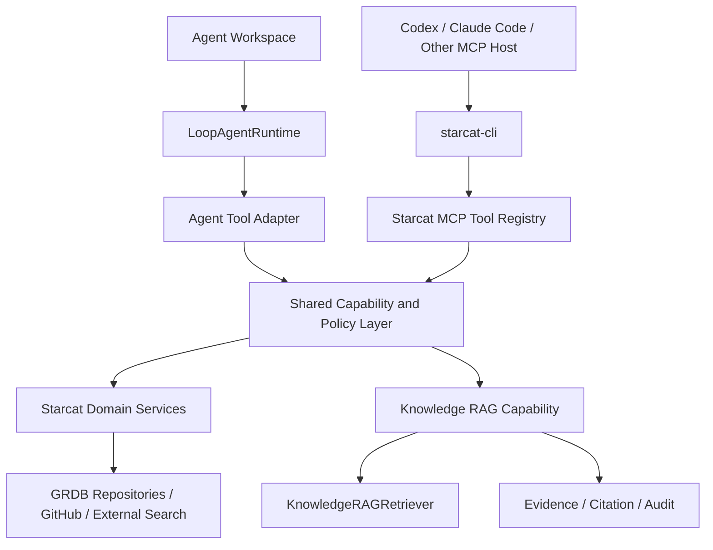

# 57 — Agent 工作台与统一能力层详细设计

> 日期：2026-08-04
>
> 状态：新版权威方案，阶段实施中
>
> 范围：Starcat 内置 Agent 工作台、运行时、上下文、RAG、MCP、CLI、权限、持久化与发布边界
>
> 替代：
> - `docs/2-产品/需求讨论/agent/00-概览-Agent方向讨论与方案.md`
> - `docs/2-产品/需求讨论/agent/16-Agent底层平台技术方案.md`
> - `docs/2-产品/需求讨论/agent/20-CLI-Agent作为AI-Provider初步方案.md`
>
> 关联：
> - `DESIGN.md`
> - `docs/3-设计/详细设计/30-本地RAG设计.md`
> - `docs/3-设计/详细设计/34-StarcatCLI与外部MCP桥接设计.md`
> - `docs/3-设计/详细设计/37-外部搜索服务设计.md`
> - `docs/3-设计/详细设计/37-AI用量统计面板设计.md`
> - `docs/2-产品/需求讨论/agent/19-Cline-Agent设计学习心得.md`

---

## 1. 结论

Starcat Agent 不再按“重新建设一套 AI、上下文、工具和 CLI 集成”的旧思路继续开发。

当前正确路线是：

1. 保留已经落地的 Cline-style `LoopAgentRuntime`、消息链、Tool Schema、Approval 与 Artifact。
2. Agent 与知识库 RAG 保持两个独立产品工作台，但共享成熟的 Composer 交互与确定性上下文协议。
3. Agent 通过受控 Knowledge Tool 复用现有 RAG Retriever、证据、引用和审计，不再复制一套检索流水线。
4. 从现有 MCP Facade / Tool Registry 中抽取进程内共享能力和权限策略，由 Agent 与 MCP 分别适配。
5. `starcat-cli` 继续作为外部 Agent 的跨平台 CLI 与 MCP stdio 桥，不是 Starcat 的模型 Provider。
6. Starcat 主动托管 Codex、Claude Code、Gemini CLI 的 `CLIExternalAgentRuntime` 降为远期可选实验，不进入当前主线。
7. `v19-agent-message-contract` 已完成并通过旧库迁移测试；当前收口重点转为声明式 Workflow、业务上下文、Knowledge eligible 子集与国际化。

一句话架构：

> Agent 负责执行目标，RAG 负责提供可引用知识，统一能力层负责安全访问 Starcat 领域能力，MCP/CLI 负责把同一能力开放给外部 Agent。

---

## 2. 当前实现基线

### 2.1 已落地能力

| 模块 | 当前代码 | 状态 | 新方案处理 |
|---|---|---|---|
| Runtime | `LoopAgentRuntime` | 已有模型 → tool-call → tool-result → 模型循环 | 保留 |
| Prompt | `AgentPromptBuilder` | 已有分层 Prompt、工具规则、附件与运行约束 | 保留并接入新版上下文 |
| Tool Contract | `AgentTool` / `AgentToolRegistry` | 已有 Schema、权限、重试与完成语义 | 保留 Adapter 层，领域实现逐步迁移 |
| Message | `AgentMessage` | 已是 UI 时间线与模型回放的事实源 | 保留 |
| Approval | `AgentApprovalCoordinator` | 已支持 pending / approve / reject / 恢复 | 保留并与统一权限等级对齐 |
| Artifact | `AgentArtifact` | 已支持 Markdown 产物 | 保留，后续按真实场景扩展 |
| Workspace | `AgentWorkspaceView` | 已有 Agent Rail、Run Surface、Timeline、Inspector | 保留工作台职责，重做 Composer 接入 |
| RAG | `KnowledgeRAGService` / `KnowledgeRAGRetriever` | 已有知识库边界、混合检索、证据、引用、审计 | 作为 Agent Knowledge Tool 的底座 |
| MCP | `StarcatMCPFacade` / `StarcatMCPWriteFacade` / `StarcatMCPToolRegistry` | 已有 20 个读写工具及权限控制 | 抽取共享能力，避免重复实现 |
| CLI | `supports/starcat-cli` | 已有跨平台 CLI、配对、MCP stdio bridge | 保持外部集成定位 |

### 2.2 当前产品能力

当前真正启用的内置 Agent 只有：

- `github-weekly-report`
- `repo-insight`

以下仍是禁用占位：

- `repo-alternatives`
- `overlap-scan`
- `recall-search`
- `untagged-tidy`
- `release-watcher`

Agent 工作台在 Release 构建中仍由 `DebugFlags.agentToolbarEntry` 强制关闭。因此现状应定义为：

> Agent 底层技术原型已完成较多，产品能力、统一上下文、工具复用、数据迁移与发布验收尚未收口。

### 2.3 已解除的数据阻断

`GRDBAgentRunRepository` 已按消息链 schema 访问：

- `agent_runs.context_json`
- `agent_runs.model`
- `agent_runs.usage_json`
- `agent_messages`
- `agent_approvals`
- 新版 `agent_artifacts`

`v3-agent-runs` 创建的是旧 run / step / trace / tool output / artifact schema；该差异已由追加的 `registerV19` 迁移完成一次性升级，Agent 专项测试已覆盖旧库升级和新契约读写。

已落实约束：

- 禁止回改 `v3-agent-runs`。
- 已追加 `registerV19`。
- 已用 pre-v19 fixture 验证升级。
- 不能要求用户删库重建。
- 旧 run 与 artifact 的可识别数据必须迁移；不能静默丢弃。

---

## 3. 产品边界

### 3.1 RAG 工作台

RAG 回答“我的知识库里有什么证据能回答这个问题”。

职责：

- 知识库限定检索。
- 显式 `@repo` 范围。
- 混合召回与 Parent Context Packing。
- citation、Evidence、Plan、Index。
- 附件与本轮联网临时上下文。
- 只读问答，不直接修改 Starcat 数据。

RAG 不是通用任务执行器，不承担批量整理、写入审批、任务产物和自动化调度。

### 3.2 Agent 工作台

Agent 回答“为了完成这个目标，需要按什么步骤读取、分析、确认和交付”。

职责：

- 目标驱动的多轮 Tool Loop。
- 工具调用、步骤、状态与错误展示。
- 需要写入时生成预览并等待审批。
- 生成独立 Artifact。
- 保存可恢复、可审计的 Run。

Agent 不应复制 RAG 的检索、引用、附件解析和 repo mention 规则。

### 3.3 MCP Service

MCP 是 Starcat 对外公开的 Agent 协议边界，负责：

- 对外 Tool Schema。
- 本机或可信设备鉴权。
- Pro、隐私与写权限检查。
- `dry_run`。
- 审计。
- MCP 错误响应。

MCP 不是 App 内部所有模块必须调用的网络层。内置 Agent 禁止通过 localhost HTTP 回调自己。

### 3.4 Starcat CLI

`starcat-cli` 的稳定定位是：

- Starcat MCP 的跨平台客户端。
- Codex、Claude Code 等 MCP Host 的 stdio bridge。
- 面向终端用户的少量结构化命令入口。
- 配对、凭据与安全传输适配器。

它不包含 Starcat 业务逻辑，不直接读取 SQLite，也不作为 `AIClientProtocol` 的模型 Provider。

### 3.5 外部 CLI Agent Runtime

Starcat 主动启动 Codex、Claude Code、Gemini CLI，属于另一种能力：外部执行后端。

该方向需要进程管理、Provider 原生事件、动态权限请求、工作目录、sandbox、子进程清理和渠道限制。现阶段已有 MCP/CLI 能满足“外部 Agent 使用 Starcat”的主要需求，因此：

- 不进入当前 P0～P3。
- 不删除研究结论。
- 只有确认必须在 Starcat UI 内托管外部 Agent 会话时，才单独立项。
- 仍限定 Direct build，不进入 Mac App Store 路线。

---

## 4. 总体架构



### 4.1 分层职责

| 层 | 只负责 | 禁止 |
|---|---|---|
| Workspace | 展示状态、收集输入、审批、查看产物 | 直接访问数据库或拼 Prompt |
| Runtime | Loop、预算、取消、事件、恢复 | 实现具体 Repo/Tag/RAG 业务 |
| Agent Adapter | 把统一能力映射为 `AgentTool` | 复制领域查询和写入逻辑 |
| MCP Adapter | 把统一能力映射为 MCP Tool | 成为第二套业务实现 |
| Capability / Policy | Schema、权限、执行、审计语义 | 包含 SwiftUI 或传输层状态 |
| Domain / RAG | 真实数据读取、写入、检索、引用 | 理解 Agent UI 状态 |

### 4.2 单一真源

- Run 事实：`AgentMessage`。
- 知识范围：`repo_notes.library_state == .inLibrary`。
- RAG 证据：`KnowledgeRAGRetriever` 返回的 evidence/citation/audit。
- 领域能力：共享 Capability executor。
- 外部协议：MCP Tool Schema。
- 外部命令：`starcat-cli`，继续只映射 MCP。

---

## 5. UI 与共享 Composer

### 5.1 工作台不合并

保留两套顶层工作台：

| RAG | Agent |
|---|---|
| Conversation Rail | Agent Rail / Run History |
| Answer Surface | Run Timeline |
| Citation Inspector | Artifact / Approval Inspector |
| 问答会话 | 可恢复任务 Run |

二者共享视觉语言和输入组件，不共享 ViewModel、历史模型或执行状态机。

### 5.2 抽取 `AICommandComposer`

不应让 Agent 继续维护普通 `TextField`，也不应让 Agent 直接依赖整个 `RAGWorkspaceAnswerSurface`。

建议从 RAG 已验证实现中抽取：

```text
Shared/Components/AICommandComposer/
├── AICommandTextEditor.swift
├── AICommandComposerView.swift
├── AIComposerAttachmentStrip.swift
├── AIComposerContextDisclosure.swift
├── AIRepoMentionPicker.swift
├── AIComposerModels.swift
└── AIComposerKeyboardPolicy.swift
```

抽取原则：

- 从 `RAGComposerTextEditor` 提升通用输入能力，不复制代码。
- RAG 与 Agent 分别提供自己的 context projection 和提交动作。
- Picker 的 repo 候选范围由调用方决定。
- 所有显式操作必须形成结构化状态，不能只显示 chip。
- 保留当前 `aiChatRequiresCommandReturn` 设置语义。

### 5.3 Agent Composer 第一阶段能力

- 多行输入与稳定动态高度。
- Return / Cmd+Return 发送策略。
- `@repo` 搜索、上下键、Enter、Esc。
- 仓库选择按 Agent Workflow 决定：Weekly 可选多仓覆盖，Repo Insight 只允许单仓。
- 文本、Markdown、JSON、源码附件。
- GitHub 链接识别。
- 本轮联网授权。
- 当前模型展示与本轮切换。
- 按 Agent/草稿维度恢复输入。
- 运行中发送按钮切换为停止按钮。

第一阶段不支持 PDF、图片、任意目录、Shell 工作目录或自动附加全库内容。

### 5.4 状态一致性

`idle / running / waitingForConfirmation / completed / failed / cancelled` 必须同时投影到：

1. Run Header。
2. Timeline。
3. Composer。

等待审批时 Composer 禁止启动新 Run，但允许用户查看参数、证据和已有产物。

---

## 6. Agent Context Plane

### 6.1 输入态与冻结态分离

Composer 中的可编辑状态不是 Run 历史事实。发送时必须生成不可变快照：

```swift
struct AgentRunInput: Sendable {
    var goal: String
    var agentID: String
    var explicitRepoIDs: [Int64]
    var explicitRepoMode: AIComposerRepoMode
    var selectedModelID: String?
    var attachments: [AIComposerAttachment]
    var githubLinks: [AIComposerRepoLink]
    var webSearchEnabled: Bool
    var source: AgentContextSource
}
```

`AIComposer*` 是从 RAG 现有模型中提取的中性输入层类型；RAG 在迁移期通过 Adapter 转换为现有 `RAGComposerContext`，禁止让共享组件反向依赖 Agent 或 RAG 的完整 ViewModel。

持久化使用可编码的 `AgentRunContextSnapshot`，其中：

- repo 记录 id、fullName、关键元数据 hash，不保存 live binding。
- 附件记录文件名、类型、大小、正文 hash、实际发送 token，不长期复制正文。
- GitHub 链接记录解析关系。
- 联网记录本轮授权值。
- 模型记录最终使用的 provider/model 快照。

### 6.2 确定性范围优先

以下规则必须由宿主执行层强制应用，不能交给模型理解：

- AgentDefinition 必须声明 `repositoryContext`、`executionMode`、目标仓库基数、是否允许空上下文和是否允许手动覆盖；UI 与 Runtime 禁止按 Agent ID 猜测。
- Weekly 默认冻结最近 7 天新增 Star；没有新增 Star 时生成合法空周报，不因空仓库失败。
- Weekly 的手选仓库是可选覆盖：`.only` 替换自动时间窗，`.prefer` 置顶后补时间窗，`.exclude` 从时间窗排除。
- Repo Insight 必须且只能冻结 1 个普通 Star 仓库；仓库无需先进入知识库。
- Business Context 与 Knowledge Eligible Scope 分离；非知识库 repo 保留在业务上下文，但不得进入 Knowledge Tool。
- Knowledge Tool 只对 frozen business context 与知识库 ID 的交集执行 `.only` 检索，不再次解释 Composer 的 only/prefer/exclude。
- 只有用户显式开启联网，才允许普通 External Search。
- 未授权私有仓库联网时，只要本次业务上下文包含私有仓库，就关闭该 Run 的 External Search，不能依赖 query 是否包含 fullName 猜测泄漏。

### 6.3 上下文来源

Agent Run 可使用四类上下文：

| 类型 | 来源 | 持久化 |
|---|---|---|
| Selection | 用户显式 repo、当前页面、筛选快照 | 元数据快照 |
| Attachment | 用户主动选择的支持文件 | metadata/hash/token，不长期复制正文 |
| Knowledge Evidence | RAG Retriever | citation/audit，不复制远程正文 |
| Tool Result | 统一能力层 | 摘要 + 有界结构化结果 |

禁止在 Run 启动时把整个数据库或所有 README 预先塞入 Prompt。

### 6.4 内置 Workflow 契约

| Agent | Business Context | 手动选择 | 空上下文 | Execution Mode |
|---|---|---|---|---|
| GitHub Weekly Report | 最近 7 天新增 Star | 可选多仓覆盖 | 允许，输出空周报 | `reportGeneration` |
| Repo Insight | 单个普通 Star | 必须 1 个；GitHub 链接可解析本地 Star | 不允许 | `reportGeneration` |
| Untagged Tidy（后续） | 待整理集合 | 按预览批次 | 允许无操作结果 | `approvedAction` |

知识库不是 Agent 的前置条件。它只决定业务上下文中的哪些仓库可以由 `knowledge_search` 补充 README、笔记、摘要和引用证据。

### 6.5 预算

每轮至少设置：

- 系统与工具定义预算。
- 历史消息预算。
- 本地 evidence 预算。
- RepoContext / Insights XML 独立预算。
- 附件预算。
- 远程临时上下文预算。
- Tool result 回放预算。
- 最终 Artifact 输出预留。

具体 token 上限从模型 context window 和现有 RAG 设置派生，不在 Agent 中再维护一套固定常量。

---

## 7. 统一 Capability 与 Tool Plane

### 7.1 为什么不能直接复用 MCP Transport

MCP 已经具备成熟业务语义，但 `StarcatMCPToolRegistry` 同时承担 MCP SDK Tool 定义和协议 dispatch。若内置 Agent 直接调用 `/mcp`：

- 增加无意义的本机网络环路。
- 引入 Bearer、端口和服务启停依赖。
- 把外部协议错误混入内部执行错误。
- 仍无法解决 Agent Run 级审批和上下文冻结。

因此应复用 MCP 背后的 Facade、领域服务与权限语义，而不是复用 HTTP 传输。

### 7.2 目标抽象

```swift
struct StarcatCapabilityDefinition: Sendable {
    var id: String
    var title: String
    var description: String
    var inputSchema: StarcatJSONSchema
    var permission: StarcatCapabilityPermission
    var openWorld: Bool
    var cost: StarcatCapabilityCost
}

protocol StarcatCapability: Sendable {
    var definition: StarcatCapabilityDefinition { get }
    func execute(_ request: StarcatCapabilityRequest) async -> StarcatCapabilityResult
}
```

Adapter：

- `AgentCapabilityToolAdapter`：转成 `AgentToolDefinition` / `AgentToolResult`。
- `MCPCapabilityToolAdapter`：转成 MCP `Tool` / `CallTool.Result`。

### 7.3 能力分类

| 分类 | 示例 | 默认权限 |
|---|---|---|
| 本地读取 | capabilities、statistics、repo、README、tags | `readOnly` |
| 本地检索 | FTS、semantic、knowledge retrieval | `readOnly` |
| 开放网络读取 | global search、External Search、现场 GitHub 数据 | `openWorldRead` |
| AI 生成 | repo summary、Planner/Generator | `aiCost` |
| 单项写入 | note、status、单 repo tag | `localWrite` |
| 批量写入 | 批量 tag、批量 status | `batchWrite` |
| 替换/删除 | replace tags、清空笔记、取消 Star | `destructiveWrite` |
| Artifact | Markdown / JSON 结构化交付 | `artifactOnly` |

### 7.4 Agent 专属工具

以下工具不应进入公共 MCP Capability Catalog：

- `agent_parse_goal`
- 仅用于 Loop 收敛的 completion tool。
- Artifact schema 提交工具。
- Agent 内部阶段控制工具。

这些属于编排协议，而不是 Starcat 领域能力。

### 7.5 权限并集

统一 Capability 定义提供最低权限；不同入口再叠加自己的运行权限：

```text
最终允许 = Capability 权限
        ∩ 产品/Pro 权限
        ∩ 隐私设置
        ∩ Agent Definition allowlist
        ∩ 本轮 Run 权限
        ∩ 用户审批结果
```

外部 MCP 的“允许本地写入”不能自动批准内置 Agent Run；内置 Agent 的一次审批也不能修改 MCP 全局设置。

---

## 8. Knowledge Tool

### 8.1 定位

Agent 需要的是“可引用的知识证据”，不是另一个自由回答机器人。

建议新增内部能力：

```swift
struct AgentKnowledgeQuery: Sendable {
    var query: String
    var maxRepos: Int
}

struct AgentKnowledgeResult: Sendable {
    var evidenceBlocks: [RAGEvidenceBlock]
    var citations: [RAGCitation]
    var retrievalTrace: RAGRetrievalTrace
    var remoteAudit: [RAGRemoteContextAudit]
    var limitations: [String]
}
```

### 8.2 执行边界

- 使用 `KnowledgeRAGRetriever` 和现有候选仓储。
- 固定为 Business Context 中已进入知识库的 eligible 子集。
- Capability 请求使用 eligible IDs + `.only`；业务层 only/prefer/exclude 在冻结上下文前已完成，禁止 Knowledge Tool 二次解释。
- 复用 FTS/向量/RRF/rerank/parent packing。
- 无向量配置时继续走关键词检索。
- 返回 evidence 与 citation，不先生成一份 RAG 最终回答再交给 Agent 二次改写。
- Agent 最终 Artifact 必须引用返回的 citation 标识。
- Tool 调用同时进入 Agent Timeline 与 RAG retrieval audit。

### 8.3 外部 MCP 演进

内部 Knowledge Tool 稳定后，可评估新增 MCP Tool：

```text
starcat.search_knowledge
```

它应返回结构化 evidence/citation，而不是隐藏一次模型生成。外部 Agent 自己决定如何组织最终回答。

该工具不是首期阻断项；现有 MCP 继续保持兼容。

---

## 9. Runtime 演进

### 9.1 保留 `LoopAgentRuntime`

当前 Runtime 继续作为内置 Agent 唯一默认 Runtime：

```text
build prompt
  → request model
  → validate tool call
  → policy / approval
  → execute capability
  → append tool result message
  → continue or complete artifact
```

禁止恢复线性“生成一段文本即完成”的旧 Runtime。

### 9.2 Tool 执行顺序

- 模型可以在一轮返回多个只读 Tool Call。
- 只读且相互独立的调用可受控并发。
- 有顺序依赖、写入、开放网络调用默认串行。
- 同一 repo 的写入必须串行，避免预览后状态漂移。
- Artifact completion tool 每轮只能成功一次。

### 9.3 错误与降级

| 错误 | Runtime 行为 |
|---|---|
| 参数不合法 | 记录失败 tool result，可允许模型修正一次 |
| 权限拒绝 | 记录 rejected，不自动降级为绕过路径 |
| RAG 无证据 | 返回 limitations，模型不得编造 |
| 外部搜索失败 | 保留本地证据并标记降级 |
| AI Provider 失败 | Run failed，可从持久化消息重试 |
| 超预算 | 终止并说明预算阶段，不生成假 Artifact |
| 用户取消 | 取消网络、模型和工具 Task，flush 已有消息 |

### 9.4 流式性能

复用现有 RAG/AI 结论：

- 原始 token/delta 不逐条写入 `@Observable`。
- reasoning 与正文分别按受控频率发布。
- 完成、取消、失败必须 flush。
- Timeline 的 identity 不得使用持续变化的正文。
- 长输出完成前不创建高成本 Selection Overlay。

---

## 10. 场景重新分类

| 旧场景 | 新归属 | 处理 |
|---|---|---|
| Recall Search | RAG | 从 Agent IA 移除；RAG 已完整覆盖问答与引用 |
| Repo Insight | Agent Artifact / 洞察 | 改为“采用决策书、风险与行动计划”，避免复制只读问答 |
| GitHub Weekly Report | Agent | 保留为只读 Artifact 参考实现 |
| Repo Alternatives | Agent | 使用 Knowledge Tool + Global Search + 对比 Artifact |
| Overlap Scan | Agent | 使用本地/知识检索，输出批量整理建议 |
| Untagged Tidy | Agent | 首个写入型候选，验证预览、审批、批量应用 |
| Release Watcher | Automation + Agent | 后台发现与通知归自动化；解读与升级建议可生成 Agent Artifact |
| Smart Collection 生成 | 现有编辑器增强 | 自然语言 → 规则 → 预览 → 保存，不必进入通用 Agent Workspace |
| 单仓问答 | RAG / Repo AI | 不重复建设 Agent |

推荐首批产品顺序：

1. 收口 Weekly Report 的最近 7 天自动上下文、合法空周报与多仓覆盖。（已实现）
2. 把 Repo Insight 收敛为普通 Star 单仓目标和明确 Artifact。（已实现）
3. 实现 Repo Alternatives，验证 RAG + 全局搜索协同。
4. 实现 Untagged Tidy，验证真正写入审批。
5. 再评估 Overlap Scan 与 Release Automation。

---

## 11. 持久化与 v19 Migration（已完成）

### 11.1 目标 schema

```text
agent_runs
agent_messages
agent_approvals
agent_artifacts
```

不再把 step、trace、tool output 作为三套独立运行时真源。Timeline 从 `agent_messages` 与 approval/artifact 投影。

### 11.2 `v19-agent-message-contract`

迁移已完成：

1. 为 `agent_runs` 增加 `context_json`、`model`、`usage_json`。
2. 创建 `agent_messages`。
3. 创建 `agent_approvals`。
4. 重建 `agent_artifacts` 为新版 schema；旧 `artifact_index` 映射到 `sequence`。
5. 迁移可识别的旧 run / artifact 数据。
6. 对旧 step / trace / tool output 做一次性转换或明确归档，不能由应用层长期双读。
7. 为 run、message、approval、artifact 建立必要索引和外键。

不允许直接 `ALTER` 后留下 `artifact_index NOT NULL`，否则新版 Repository 插入时仍会失败。

### 11.3 Migration 验证

- 新库从 v1 迁移到 v19。
- 真实 pre-v19 fixture 迁移到 v19。
- 旧 run 和 artifact 可读取。
- 新 run/message/approval/artifact 可完整写入和恢复。
- 重复启动 migration 幂等。
- 账号切库不串 run。
- 禁止修改 `v3-agent-runs` checksum/内容。

---

## 12. 写入、审批与审计

### 12.1 三阶段写入

所有 Agent 写入遵循：

```text
propose / dry-run
    → UI review and explicit approval
    → apply through domain capability
    → read-back verification
```

### 12.2 审批粒度

| 操作 | 默认策略 |
|---|---|
| 单 repo 添加非破坏性 tag | 单项确认，可选本 Run 相同操作放行 |
| 修改 note/status | 单项确认 |
| 批量 tag/status | 展示数量、目标、diff 后批量确认 |
| 替换全部 tags | 破坏性确认，不提供永久放行 |
| 清空 note / 取消 Star | 破坏性确认，不提供整轮自动允许 |
| 外部网络 | Composer 本轮授权或逐项确认 |

### 12.3 审计内容

保存：

- run、tool call、参数摘要。
- permission、approval decision、decidedAt。
- dry-run 结果与 apply 结果。
- 目标 repo 与变更摘要。
- Provider、模型、用量和延迟。
- citation 与远程请求 metadata。

禁止保存：

- API Key、Bearer、CLI auth。
- Keychain 内容。
- 远程网页完整正文。
- 未经用户同意长期保存的附件正文。
- 模型隐藏推理原文作为公开审计结论。

---

## 13. 分阶段实施

### P0：恢复可信基线

> 状态：已完成。

目标：当前 Agent 代码与数据库重新一致。

交付：

- `v19-agent-message-contract`。
- Agent Repository migration tests。
- Agent 专项 101/101 恢复全绿。
- 更新失效的验收报告数字，但不提前修改功能总览。

验收：

- 旧库升级成功。
- 新 Run 可保存、恢复、审批和生成 Artifact。
- `git diff --check` 通过。

### P1：统一 Composer 与 Run Context

> 状态：Agent 侧已完成；RAG 保持既有行为。

目标：Agent 使用与 RAG 一致的输入体验和确定性上下文。

交付：

- `AICommandComposer` 共享组件。
- Agent `@repo`、附件、链接、联网、模型和草稿。
- `AgentRunInput` → `AgentRunContextSnapshot` 冻结。
- RAG 行为无回归。

验收：

- 两个工作台的 Return/Cmd+Return、mention、附件限制一致。
- 删除 chip 会真实修改执行上下文。
- Run 启动后修改 Composer 不影响已启动 Run。

### P2：Knowledge Tool 与统一 Capability

> 状态：Knowledge Tool、Repository Read Capability 与 External Search Adapter 已完成；MCP 其余领域能力迁移仍在后续阶段。

目标：Agent 复用 RAG 与 MCP 背后的现成能力。

交付：

- 内部 Knowledge Tool。
- Capability definition/executor。
- Agent Adapter。
- MCP Registry 分阶段迁移到共享 executor。
- Weekly / Repo Insight 不再使用重复的领域读取实现。

验收：

- Agent 产物能引用真实 RAG citation。
- Knowledge Tool 只能读取 frozen business context 的 eligible 子集，模型不可扩大。
- 内置 Agent 不依赖 MCP listener/port/API key。
- MCP 既有 Tool 名称和响应兼容。

### P3：首个写入型 Agent

目标：验证完整的人在回路闭环。

推荐选择 `untagged-tidy`，范围先限制为：

- 用户明确选择的 repo。
- 生成 tag 建议和批量 diff。
- 默认 dry-run。
- 用户确认后调用共享 tag capability。
- 完成后 read-back 验证。

第一版不自动取消 Star，不做后台无人值守写入。

### P4：产品化与 Release Gate

目标：决定是否向普通用户开放。

交付：

- Pro gate 与用量统计。
- 空态、错误恢复、取消、重试和历史管理。
- 完整 i18n。
- Release 入口策略。
- 自动化证据与真实 UI 人工验收分开记录。

只有 P0～P3 完成且验收通过，才允许讨论解除 `DebugFlags.agentToolbarEntry`。

### P5：可选外部 CLI Runtime

进入条件：

- 用户明确需要在 Starcat UI 内托管 Codex/Claude/Gemini 会话。
- 现有 MCP/CLI 外部工作流无法满足该需求。
- 至少一个 Provider 有稳定双向事件与审批协议。
- Direct-only 的 sandbox、签名、进程组清理方案通过安全审查。

未满足条件时不实施。

---

## 14. 测试与验收矩阵

### 14.1 自动化

| 层 | 测试 |
|---|---|
| Migration | pre-v19 fixture、数据转换、索引、外键、重复启动 |
| Composer | Return 策略、mention 键盘、chip 同步、附件边界、草稿 |
| Context | 最近 7 天、合法空周报、单仓基数、手动覆盖、eligible 子集、私有仓库 |
| Knowledge | FTS-only、hybrid、无证据、citation、audit、取消 |
| Capability | schema、permission、dry-run、read-back、错误映射 |
| Runtime | multi-tool、approval、resume、retry、budget、cancel |
| MCP | 现有 Tool contract 回归、权限、错误码 |
| Product Agent | Weekly、Repo Alternatives、Untagged Tidy 场景测试 |

### 14.2 人工验收

- Agent 与 RAG Composer 的真实输入、焦点和弹层位置。
- 长问题、长 repo 名、多附件和窗口缩放。
- Light/Dark、18 种语言和 RTL。
- 流式长输出的 CPU、内存与滚动跟随。
- 审批前后 Timeline、Header、Composer 状态一致性。
- 真实 AI Provider、External Search、GitHub 与私有仓库授权。
- App Store / Direct 渠道的入口与能力差异。

自动化无法观察的 UI、系统权限、签名、真实 Provider 行为不得伪造完成。

---

## 15. 旧文档处理

| 文档 | 新状态 | 说明 |
|---|---|---|
| `00-概览-Agent方向讨论与方案.md` | 已过时，历史讨论 | 基于 2026-06 的生态与产品假设，不再作为开发入口 |
| `16-Agent底层平台技术方案.md` | 已过时，历史实现方案 | Runtime 事实仍可参考；后续架构以本文为准 |
| `20-CLI-Agent作为AI-Provider初步方案.md` | 已过时，远期研究 | 外部 CLI Runtime 降为 P5 可选项 |
| `19-Cline-Agent设计学习心得.md` | 保留参考 | Prompt、Tool Loop、Approval、事件流原则仍有效 |
| Agent 场景文档 | 历史需求输入 | 是否实施、归属与优先级以本文 §10 为准 |
| `30-本地RAG设计.md` | 当前 RAG 真源 | 本文只定义 Agent 如何复用，不改写 RAG 语义 |
| `34-StarcatCLI与外部MCP桥接设计.md` | 当前外部集成真源 | CLI/MCP transport 与安全边界继续由该文档负责 |

旧文档保留是为了追溯决策，不代表其中的阶段、框架评估、场景优先级或 CLI Runtime 路线仍有效。

---

## 16. 非目标

- 不把 RAG 合并进 Agent Workspace。
- 不把 Agent 变成普通聊天窗口。
- 不让 Agent 直接读写 SQLite。
- 不让内置 Agent 通过 localhost MCP 调自己。
- 不把 `starcat-cli` 注册成 `AIServiceProvider`。
- 不在当前主线托管 Codex/Claude/Gemini CLI。
- 不默认开放 Shell、文件编辑、浏览器自动化或 subagent。
- 不自动执行批量写入、取消 Star、发布或后台无人值守任务。
- 不为了兼容旧草稿保留永久双 Runtime、双 Tool 或双上下文路径。

---

## 17. Definition of Done

新版 Agent 平台达到可发布候选，必须同时满足：

- v19 升级可靠，Agent 专项和全量测试通过。
- Agent Composer 复用共享输入组件，不再维持弱化副本。
- Agent 可在确定 repo 范围内获取真实 RAG evidence/citation。
- Agent 与 MCP 使用同一领域能力和权限语义，无重复业务实现。
- 至少一个只读 Artifact Agent 和一个写入型 Agent 完成真实闭环。
- 写入全部经过 dry-run、明确审批、领域 Repository 和 read-back。
- Run 可取消、恢复、失败重试并保留一致审计。
- Pro、用量、隐私、i18n、渠道门禁完整。
- 自动化证据与人工/UI-only 验收均有真实记录。
- dong4j 确认后，才允许同步 `docs/功能实现总览.md` 与解除 Release 门禁。

---

## 18. Swift 学习提示

实现时可从 `docs/7-工具与脚本/Swift-学习索引.md` 查以下关键词：

- `NSViewRepresentable` / `NSTextViewDelegate`：`RAGComposerTextEditor.swift`
- `@Observable` / UI 状态投影：`KnowledgeRAGWorkspaceViewModel.swift`、`AgentWorkspaceViewModel.swift`
- `AsyncThrowingStream` / Actor / Cancellation：`LoopAgentRuntime.swift`
- GRDB migration / table rebuild：`DatabaseMigrationsV1.swift`
- `Codable` tagged payload：`AgentModels.swift`、`KnowledgeRAGModels.swift`
