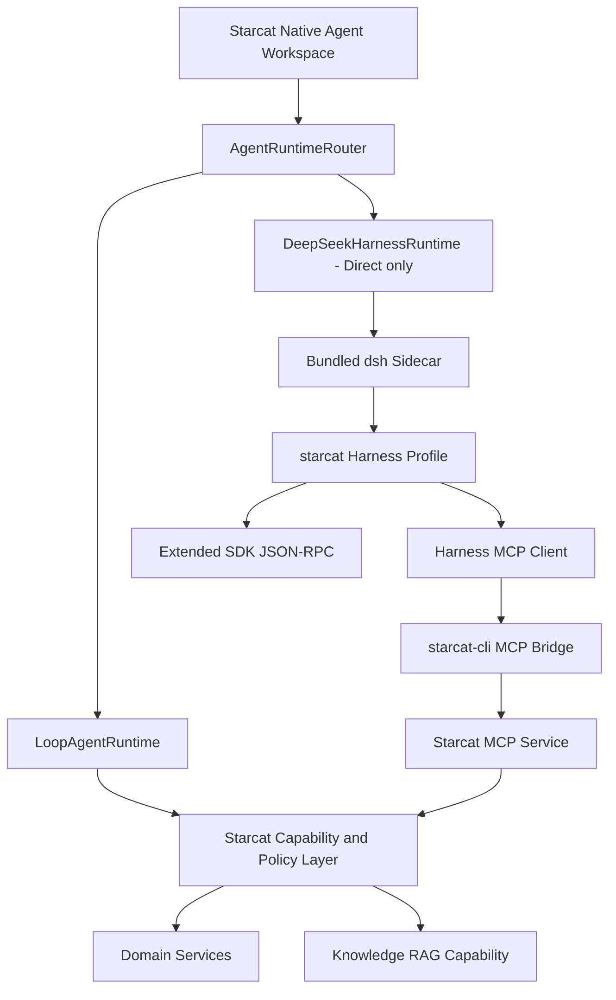

# 58 — DeepSeek Harness 集成评估与 POC 技术方案

> 日期：2026-08-16
>
> 状态：评估完成，POC 待实施
>
> 范围：Direct 版本中的通用 Agent / Research Agent 外部 Runtime 候选，不替换现有固定业务 Agent
>
> 上游评估基线：`deepseek-ai/deepseek-harness` `0.1.0-rc.5`，提交 `47f943859bef60e4160492346772ded9b24f765a`
>
> 关联：
> - `docs/3-设计/详细设计/57-Agent工作台与统一能力层详细设计.md`
> - `docs/3-设计/详细设计/34-StarcatCLI与外部MCP桥接设计.md`
> - `docs/3-设计/详细设计/30-本地RAG设计.md`
> - `DESIGN.md`

---

## 1. 决策结论

DeepSeek Harness 可以作为 Starcat P5 外部 Runtime 的候选实现，但当前只进入 **Direct-only POC**，不能直接替换生产环境中的 `LoopAgentRuntime`。

当前决策：

| 决策项 | 结论 |
|---|---|
| 技术可行性验证 | GO |
| Direct 版本实验功能 | POC 通过后再决定 |
| 替换全部内置 Agent | NO-GO |
| 嵌入 Harness Web UI | NO-GO |
| App Store 版本集成 | 当前 NO-GO |
| Harness 直接读取 Starcat SQLite | NO-GO |
| 复用 Starcat MCP / CLI 能力 | GO |

目标不是把 Starcat 改造成 Coding Agent，也不是引入另一套 RAG。目标是验证：

> Starcat 能否在保留原生工作台、领域能力、权限与产物语义的前提下，使用 DeepSeek Harness 承担长期 Session、多轮动态 Tool Loop、运行中纠偏和未来 Subagent 编排。

---

## 2. 为什么需要单独验证新 Runtime

### 2.1 当前实现擅长固定业务流程

现有 `LoopAgentRuntime` 与 `AgentDefinition` 适合以下任务：

- Weekly 周报生成。
- Repo Insight 与替代品分析。
- Untagged 整理与写入审批。
- 固定工具白名单、确定性上下文与 Artifact 校验。
- App Store / Direct 共用的进程内运行。

这些能力必须保留。固定业务 Agent 需要稳定结果、产品权限和可验证产物，不能因为引入外部 Runtime 而退回自由工具调用。

### 2.2 当前产品模型不等于通用 Agent 工作台

当前模型更接近：

```text
选择固定 Agent → 冻结上下文 → 执行声明式 Workflow → 生成 Artifact
```

通用 Agent 工作台需要的是：

```text
创建长期 Session → 动态选择能力 → 多轮执行 → 用户随时纠偏 → 继续或取消 → 恢复会话
```

两者不是同一产品形态。继续在固定 Workflow 上叠加自由对话、动态工具、Subagent 和后台任务，会让 `LoopAgentRuntime` 同时承担相互冲突的职责。

### 2.3 Harness 的匹配点

DeepSeek Harness 使用 Cordis Plugin 组合模型适配、工具、Session Log、Agent Loop、Sandbox 与 UI Profile。其核心 Session 是 append-only `SessionEvent` 日志，可用于模型上下文、回放、恢复和 UI 投影。

与 Starcat 通用 Agent 目标直接相关的能力包括：

- 多步骤模型 / Tool Loop。
- `followup`、`steer`、`inject` 与 cancel。
- 持久化 Session Event。
- Tool、MCP、Approval、Subagent、Job 与 Sandbox 扩展点。
- Web / Headless 等不同 profile 组合方式。

上游依据：

- [DeepSeek Harness 官方仓库](https://github.com/deepseek-ai/deepseek-harness)
- [Architecture](https://github.com/deepseek-ai/deepseek-harness/blob/master/docs/architecture.md)

---

## 3. 不采用的集成方式

### 3.1 不嵌入 Web UI

`dsh web` 提供浏览器工作台，但 Starcat 不嵌入该页面：

- 无法复用 Starcat 原生 Agent Rail、Composer、Run Surface 与 Inspector。
- 无法统一 Pro、模型、隐私、审批和 Artifact 规则。
- Web UI 的视觉、焦点、快捷键和辅助功能不能替代 macOS 原生体验。
- 会形成 SwiftUI 与 Web 两套状态源。

Harness 只作为执行层候选，UI 继续由 Starcat 原生实现。

### 3.2 不使用 Headless 作为正式接口

`dsh-headless` 适合一次性任务：创建 Agent、发送一个 Prompt、等待空闲、打印最终文本后退出。它不能向 Starcat 提供完整的长期 Session、审批和过程交互。

参考：[Headless Bundle](https://github.com/deepseek-ai/deepseek-harness/blob/master/packages/bundle/headless/README.zh.md)

### 3.3 不只使用 ACP

ACP 支持创建 Session、发送 Prompt、取消和一次性权限请求，但当前适配器刻意省略 reasoning、计划、工具、进度、使用量和 Transcript Replay。该事件粒度不足以驱动 Starcat Run Surface。

参考：[ACP Adapter](https://github.com/deepseek-ai/deepseek-harness/blob/master/packages/acp/acp/README.zh.md)

### 3.4 不把 Harness Runtime 重写为 Swift

重写会复制上游的 Plugin、Session、Agent Loop、模型与 Tool 生态，同时失去跟随上游演进的能力。Starcat 只实现窄协议适配层，不移植 Harness 内核。

---

## 4. 推荐总体架构



### 4.1 Runtime 路由

新增 `AgentRuntimeRouter` 概念，根据 Agent 定义与构建渠道选择执行后端：

| 场景 | Runtime |
|---|---|
| Weekly / Repo Insight / Alternatives / Untagged | `LoopAgentRuntime` |
| General Agent / Research Agent 实验模式 | `DeepSeekHarnessRuntime` |
| App Store build | 只允许 `LoopAgentRuntime` |
| Direct build 且实验开关关闭 | 只允许 `LoopAgentRuntime` |

禁止按 Agent ID 在 View 中分支。Runtime 类型应成为定义或运行配置的显式字段。

### 4.2 Starcat 继续拥有的职责

- SwiftUI Workspace、Composer、Run Surface 与 Inspector。
- Pro 权益、Provider 配置、用量与隐私策略。
- Repo 选择、业务上下文冻结和 RAG eligible 子集。
- 写操作审批、`dry_run`、read-back 与审计。
- Artifact 类型、渲染、复制和导出。
- Agent 历史入口和用户可见错误文案。

### 4.3 Harness 只负责的职责

- 通用 Agent Loop。
- Session 内多轮执行与上下文组织。
- Harness 原生 Session Event。
- 运行中的 followup / steer / inject。
- 上下文压缩、Goal 与后续可选的 Subagent 编排。

Harness 不获得 Starcat 数据库连接，也不能绕过 Capability / MCP 权限边界。

---

## 5. 协议选择与缺口

### 5.1 以 SDK JSON-RPC 为基础

`@deepseek-ai/dsh-sdk-jsonrpc-server` 使用 stdio 上的逐行 JSON-RPC 2.0。现有协议提供：

客户端到服务端：

- `initialize`
- `session/prompt`
- `shutdown`

服务端到客户端：

- `session.event`
- `session.status`
- `subagent.started`
- `subagent.finished`

完整 `session.event` 可以映射成 Starcat 的消息、工具、状态和结果投影，因此 SDK 比 ACP 更适合作为基础。

参考：

- [SDK 总览](https://github.com/deepseek-ai/deepseek-harness/blob/master/packages/sdk/README.zh.md)
- [SDK Protocol](https://github.com/deepseek-ai/deepseek-harness/blob/master/packages/sdk/protocol/README.zh.md)
- [SDK Server](https://github.com/deepseek-ai/deepseek-harness/blob/master/packages/sdk/server/README.zh.md)

### 5.2 POC 必须补齐的协议

上游当前协议不能直接满足 Starcat P5 进入条件。Starcat Extension 或受控 Fork 至少需要补充：

| 方法 / 能力 | 原因 |
|---|---|
| `protocol/capabilities` | 协商协议版本和可选能力，避免上游升级后静默误解析 |
| `session/cancel` | 用户点击停止后必须真正终止当前 Turn |
| `session/close` | 单独释放 Session，不能依赖关闭整个 Sidecar |
| `session/load` / `session/resume` | 支持历史恢复与 App 重启继续 |
| `approval.requested` | 把动态权限请求发送给 Starcat |
| `approval/decide` | 将允许一次、拒绝或取消返回 Runtime |
| `requestID` / `turnID` | Prompt、事件、结果和错误必须可靠关联 |
| Event sequence | 去重、断线恢复和 UI 投影需要单调序号 |

POC 可以先只实现 cancel 与一次性 approval，但没有这两项不能进入产品实验开关。

### 5.3 Event 映射原则

| Harness Event | Starcat 投影 |
|---|---|
| `turn/start` | Run / Turn 开始状态 |
| `user/message` | 用户消息 |
| `assistant/chunk` | 进入现有流式批处理器，不逐 token 发布 Observable 状态 |
| `assistant/message` | 完整 Assistant 消息 |
| `tool/call` | Tool Call 活动 |
| `tool/result` | 与 call ID 合并后的 Tool Result |
| `approval.requested` | `AgentApprovalRequest` |
| `turn/end` | Turn 终态，不等同于整个 Session 关闭 |
| `session.status` | Workspace 状态与可执行操作 |

Harness 原始事件是外部执行事实，`AgentTimelineProjection` 仍负责生成用户可读的 Run Surface。禁止把原始 JSON 直接作为普通 UI 内容展示。

---

## 6. MCP 与领域能力

Harness MCP Client 支持 stdio 与 Streamable HTTP，并将外部 Tool 注册为 Harness 原生工具。POC 通过 MCP 复用 Starcat 已有领域能力，不直接访问 SQLite。

参考：[Harness MCP Client](https://github.com/deepseek-ai/deepseek-harness/blob/master/packages/mcp/mcp-client/README.zh.md)

POC 首批只开放只读能力：

- 全量已知仓库搜索与详情。
- Knowledge RAG 检索、Evidence 与 Citation。
- Weekly / Trending / Discovery 查询。
- 必要的外部搜索能力。

首期禁止开放：

- 任意 Tag / Note / Status 写入。
- Star / Unstar。
- 任意 Shell 与文件系统工具。
- Terminal、后台 Job 与 Subagent。

写能力必须等审批协议验证通过后，再按 Starcat 统一 Capability 的 `dry_run → approval → execute → read-back` 语义逐项接入。

### 6.1 已知链路成本

第一阶段链路为：

```text
Starcat UI
  → dsh SDK Sidecar
  → Harness MCP Client
  → starcat-cli stdio bridge
  → Starcat MCP Listener
  → Shared Capability
```

这条链路会增加一个进程和一层协议跳转，但能避免 Harness 绕过 Starcat 权限。POC 需要测量端到端延迟、取消传播、错误映射与进程清理；验证通过后才能考虑缩短为专用本地 Bridge。

---

## 7. 专用 Harness Profile

禁止直接使用面向 Coding Agent 的完整 `dsh-base` 能力集合。新增 `starcat` profile 时遵守最小权限：

保留：

- Agent Core / Agent Loop。
- Session Event Log。
- 选定的模型 Adapter。
- 上下文压缩与 Goal。
- MCP Client。
- Starcat JSON-RPC Extension。

默认禁用：

- Local Bash。
- 任意文件系统读写。
- Terminal / PTY。
- Background Job。
- Browser Automation。
- Subagent。
- 未经 Starcat 注册的第三方 MCP Server。

POC 只允许连接本机、由 Starcat 启动且完成鉴权的 MCP Endpoint。用户不能通过 Prompt 扩大 Server、Tool 或 repo 范围。

---

## 8. Session 与持久化

### 8.1 避免双重事实源

POC 阶段不新增数据库 migration，也不承诺历史恢复：

- Harness Session Log 是当前实验 Session 的执行事实。
- Starcat 只在内存中生成兼容 `AgentRunEvent` 的展示投影。
- 关闭实验 Session 后不把半成品历史混入现有 Agent 历史。

这样可以先验证协议和运行质量，不提前设计持久化双写。

### 8.2 产品化后的候选方案

只有 POC 通过后才设计正式 Schema。推荐边界是：

- Harness Event Log 保留外部 Runtime 原始事实。
- Starcat 保存 `runtime_kind`、`external_session_id`、事件 watermark、用户可见消息投影、Approval 与 Artifact。
- 每个外部事件携带稳定 event ID / sequence，Starcat 物化采用幂等 upsert。
- 历史展示即使 Sidecar 未启动也能读取 Starcat 本地投影。
- 恢复运行时先校验 watermark，再从 Harness 增量补齐。

这会涉及已发布数据库，因此必须追加新的 `registerVN`，禁止修改 `v19-agent-message-contract` 或旧 migration。

---

## 9. 进程、安全与分发

### 9.1 进程生命周期

POC 的 Sidecar 管理必须满足：

- 使用明确的 Bundle 内可执行文件路径，不从 `PATH` 随机解析。
- stdout 只传 JSON-RPC，日志只写 stderr。
- Starcat 取消 Turn 时向协议发送 cancel，不只取消 Swift Task。
- Starcat 退出、用户登出或切库时终止子进程组。
- 异常退出时生成明确错误，禁止自动无限重启。
- 不允许 Sidecar 成为脱离 App 生命周期的后台守护进程。

### 9.2 凭据

- API Key 继续由 Starcat Keychain 管理。
- 不把整个父进程环境变量无差别传给 Sidecar。
- 使用最小临时环境或受控 stdin 配置传递运行所需凭据。
- stdout、stderr、Session Event、崩溃日志和 Artifact 都禁止记录明文凭据。
- MCP 配对凭据保持现有 Starcat CLI / MCP 安全边界。

### 9.3 分发边界

官方 Python SDK Runtime 可以携带 macOS arm64 Node 可执行文件与 `node-pty` helper，避免要求用户安装 Node，但会引入 Bundle、签名、Notarization 与第三方许可工作。

参考：[Python SDK Runtime](https://github.com/deepseek-ai/deepseek-harness/blob/master/python/sdk-runtime/README.zh.md)

当前约束：

- 只进入 Direct Target 的实验构建。
- 不进入 App Store Target。
- 不执行发布、打包或上传脚本验证 POC。
- 若未来嵌入二进制，必须登记 About 开源致谢并核对 MIT 及所有传递依赖 License。
- 正式发布前必须单独完成签名、Hardened Runtime、Notarization、进程组和恶意 MCP Server 安全审查。

---

## 10. POC 实施拆分

### POC-0：上游基线冻结

交付：

- 固定 Harness commit 与协议版本。
- 记录构建方式、二进制 Hash、License 与传递依赖。
- 建立上游升级清单，禁止自动浮动到最新 commit。

验收：

- 相同源码可重复生成同一架构的本地 Runtime。
- 不要求最终用户安装 Node。

### POC-1：Sidecar 与 JSON-RPC

建议新增模块：

- `DshProcessController`
- `DshJsonRpcClient`
- `DshProtocolModels`

交付：

- 启动、initialize、Prompt、事件接收、shutdown。
- stdout framing、stderr 日志和异常退出映射。
- 进程组清理。

验收：

- 连续启动 / 停止 20 次无残留进程。
- 畸形 JSON、未知事件和上游退出不会卡死主线程。

### POC-2：Runtime Adapter 与原生 Run Surface

建议新增：

- `DeepSeekHarnessRuntime`
- `HarnessAgentEventMapper`

交付：

- 将 Session Event 映射成临时 `AgentRunEvent`。
- 复用现有流式批处理和 Timeline Projection。
- 保持 Starcat 原生 Composer、Run Surface 和 Inspector。

验收：

- 可以展示用户消息、Assistant 正文、Tool Call、Tool Result、错误和完成状态。
- 长输出不逐 token 修改 SwiftUI Observable 状态。
- 运行 10 分钟以上时界面可交互，停止按钮有效。

### POC-3：只读 Starcat MCP

交付：

- `starcat` 最小 Harness profile。
- 连接现有 `starcat-cli` / MCP。
- 只开放 Repo、RAG、Weekly、Trending、Discovery 的只读 Tool。

验收：

- Agent 可读取非 Star、非知识库但已进入 Starcat 全量目录的仓库。
- Knowledge Tool 仍只读取 frozen context 的 eligible 子集。
- Prompt 不能启用未注册 Tool 或扩大 repo 范围。

### POC-4：取消与审批协议

交付：

- `session/cancel`。
- `approval.requested` / `approval/decide`。
- Swift Task、JSON-RPC、Tool 执行和 Sidecar 的取消传播。

验收：

- 运行中停止能在有界时间内终止模型和 Tool。
- 拒绝审批后不执行写入，也不把拒绝误报为成功。
- Sidecar 无响应时可以升级为进程终止，但必须明确记录原因。

---

## 11. 测试矩阵

### 11.1 单元测试

- JSON-RPC framing、partial line、multiple lines、未知字段与错误响应。
- Event → `AgentRunEvent` 的稳定映射。
- Tool call/result 配对与重复事件幂等。
- 状态机：idle、running、waitingApproval、completed、failed、cancelled。
- 凭据和日志脱敏。
- Runtime Router 的渠道与 Agent 类型选择。

### 11.2 进程集成测试

- 正常 initialize / prompt / shutdown。
- 子进程异常退出。
- stdout 污染。
- cancel 超时与强制清理。
- App 退出、登出、切库和切换 Runtime。
- 连续多 Turn 和长 Session。

### 11.3 人工验收

- 原生 Run Surface 的过程、最终回答和 Inspector。
- 运行中 followup / steer 的产品交互。
- Light / Dark、窗口缩放、18 locale 与 VoiceOver。
- 长输出 CPU、内存、滚动与停止响应。
- Direct 签名构建中的 Sidecar 启动和清理。

自动化通过不能代替签名构建、真实 Provider、长任务和 UI 人工验收。

---

## 12. POC 结束判定

### GO 条件

以下条件必须全部满足：

- Starcat 原生 Run Surface 能稳定消费完整 Harness 事件。
- cancel 和一次性 approval 协议可靠。
- 10 分钟以上长任务不阻塞主线程。
- 进程退出与异常恢复无残留。
- 只读 MCP 能力不绕过 repo、知识库、Pro 与隐私边界。
- 无 Shell / FS / Terminal / Job / Subagent 暴露。
- API Key 和 MCP 凭据不进入日志或 Session。
- 上游变更可以被适配层隔离。

### NO-GO 条件

任一条件成立即停止产品化：

- 无法可靠取消正在执行的模型或 Tool。
- Approval 只能靠 UI 假状态模拟。
- 必须让 Harness 直接访问 Starcat SQLite。
- 必须嵌入 Web UI 才能工作。
- Sidecar 无法满足签名、进程清理或凭据隔离。
- 上游协议变化必须频繁侵入 Starcat Workspace / Domain 代码。
- 长任务稳定性或资源占用明显差于现有 Runtime。

---

## 13. POC 之后的产品方向

POC 通过后再单独确认产品化范围，候选入口是：

- `General Agent`：自由目标、多轮操作、动态 Starcat Tool。
- `Research Agent`：Repo、RAG、Weekly、Trending、Discovery 与 External Search 的研究工作台。

现有固定 Agent 不迁移：

- `github-weekly-report`
- `repo-insight`
- `repo-alternatives`
- `untagged-tidy`

只有当某个固定 Agent 明确需要长期 Session 或动态编排，并且迁移后仍能保持确定性 Artifact 与权限规则时，才逐个评估；禁止一次性切换全部 Runtime。

---

## 14. 上游风险与维护策略

DeepSeek Harness 当前仍是 Developer Preview，兼容性破坏属于预期风险。Starcat 必须：

- 固定 commit，不跟随浮动版本。
- 把所有上游类型封装在 `DeepSeekHarnessRuntime` 模块内。
- 为 Starcat Extension 协议维护独立版本。
- 升级前执行协议 fixtures、进程集成测试和长任务回归。
- 记录上游 License、二进制来源与 Hash。
- 允许通过构建配置完全移除 Harness，而不是只隐藏 UI。

本方案只批准 POC 技术路线，不代表依赖已引入、代码已实现或功能已具备发布条件。
