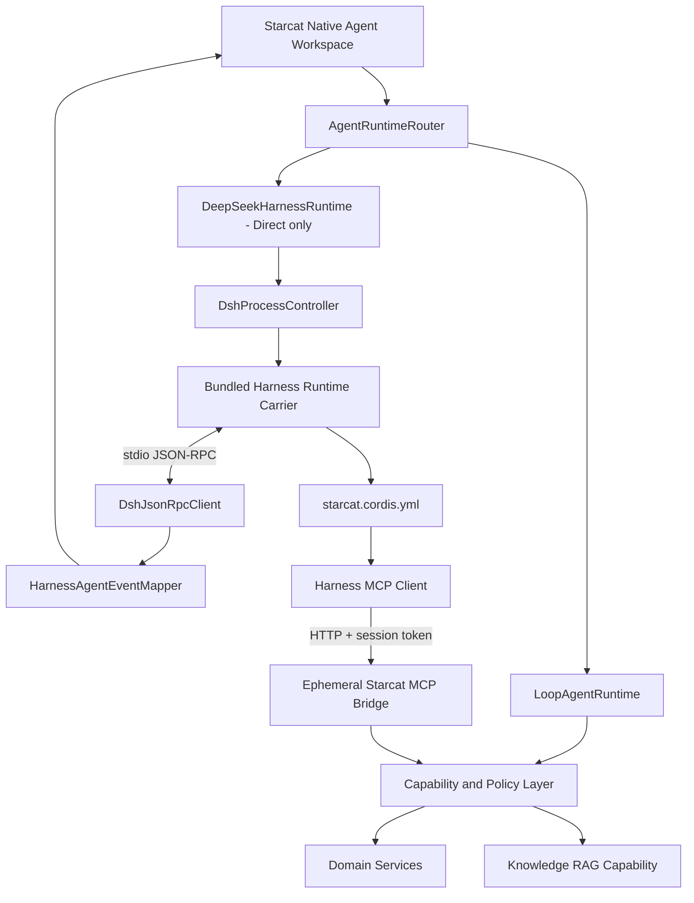

# 58 — DeepSeek Harness 集成评估与 POC 技术方案

> 日期：2026-08-16（2026-08-21 按 `0.1.0-rc.8` 修订）
>
> 状态：评估完成，Direct-only POC 待实施
>
> 范围：Direct 版本中的 General Agent / Research Agent 外部 Runtime 候选，不替换现有固定业务 Agent
>
> 上游基线：`deepseek-ai/deepseek-harness` `0.1.0-rc.8`，tag `dsh-v0.1.0-rc.8`，提交 `141eb6f`
>
> 关联：`57-Agent工作台与统一能力层详细设计.md`、`34-StarcatCLI与外部MCP桥接设计.md`、`30-本地RAG设计.md`、`分发渠道能力门控规范.md`、`DESIGN.md`

---

## 1. 决策结论

DeepSeek Harness 可以作为 Starcat P5 外部 Runtime 的候选实现，但当前只进入 **Direct-only POC**，不能直接替换生产环境中的 `LoopAgentRuntime`。

| 决策项 | 结论 |
|---|---|
| 技术可行性验证 | GO |
| Direct 版本实验功能 | POC 通过后再决定 |
| 替换全部内置 Agent | NO-GO |
| 嵌入 Harness Web UI | NO-GO |
| App Store 版本集成 | 当前 NO-GO |
| Harness 直接读取 Starcat SQLite | NO-GO |
| Harness 经临时 MCP Bridge 使用 Starcat 能力 | GO |
| Starcat 内部通过 `starcat-cli` 转发 | NO-GO |
| 运行时安装任意第三方插件 | NO-GO |

目标不是把 Starcat 改造成 Coding Agent，也不是引入另一套 RAG。目标是验证：

> Starcat 能否在保留原生工作台、领域能力、权限与产物语义的前提下，使用 DeepSeek Harness 承担长期 Session、多轮动态 Tool Loop、运行中纠偏和未来 Subagent 编排。

本方案只批准技术 POC，不代表 Harness 已被引入、功能已实现或具备发布条件。

---

## 2. 产品定位

### 2.1 固定业务 Agent 不迁移

现有 `LoopAgentRuntime` 与声明式 `AgentDefinition` 继续负责：

- Weekly 周报生成。
- Repo Insight 与替代品分析。
- Untagged 整理与写入审批。
- 固定工具白名单、确定性上下文与 Artifact 校验。
- App Store / Direct 共用的进程内运行。

固定业务模型是：

```text
选择固定 Agent → 冻结上下文 → 声明式 Workflow → 生成 Artifact
```

Harness POC 验证的是：

```text
创建 Session → 动态选择只读能力 → 多轮执行 → 用户纠偏 → 继续或停止 → 生成结果
```

候选入口只包括 `General Agent` 与 `Research Agent`。`github-weekly-report`、`repo-insight`、`repo-alternatives`、`untagged-tidy` 不迁移。

### 2.2 `rc.8` 的匹配点与风险

Harness 使用 Cordis Plugin 组合 Agent Core、模型适配、Session、MCP、Subagent 与交互能力。`rc.8` 已提供：

- `code`、`cordis`、`minimal`、`standard` 四个 preset。
- 基于 Session Event 的多轮 Agent Loop。
- stdio JSON-RPC SDK Server。
- MCP stdio 与 Streamable HTTP Client。
- 图片、文件和 Session `@` 引用。
- Codex App Server、Claude Code Agent SDK、ACP 等 Subagent Provider。
- Codex / Claude Code Profile Bundle。
- Subagent report 回传后唤醒父 Agent。
- 并发 Web Search 与持久化图片附件。

这些能力说明 Harness 适合作为可组合执行内核候选，但不代表 Starcat 应直接开启全部能力。上游仍是 Developer Preview，协议、SQLite 存储和打包结构都可能发生不兼容变化。

---

## 3. 不采用的方式

### 3.1 不嵌入 Web UI

`dsh web` 无法复用 Starcat 原生 Agent Rail、Composer、Run Surface 与 Inspector，也会形成 SwiftUI 与 Web 两套状态源。Harness 只作为执行层候选。

### 3.2 不把普通 CLI 当正式协议

开发环境可以运行 `npx @deepseek-ai/dsh web`，但正式集成不能依赖用户安装 Node / pnpm、用户 shell、`PATH`、`npx` 在线下载或面向人的终端文本输出。Starcat 必须启动固定版本的 Bundle Sidecar，并通过逐行 JSON-RPC 2.0 交互。

### 3.3 不使用 Headless 或 ACP 作为唯一接口

Headless 适合一次性 Prompt，不满足长期 Session、过程事件、审批与工作台投影。ACP 虽支持 Session 与一次性权限请求，但 Harness 适配层省略 reasoning、计划、工具、进度、用量和 Transcript Replay，事件粒度不足。

### 3.4 内部链路不经过 `starcat-cli`

`starcat-cli → MCP → Starcat` 是外部 Agent 使用 Starcat 的稳定入口。Starcat 自己托管 Harness 时再启动 CLI，会额外引入一个进程、配对状态和取消跳转。两条路径必须分离：

```text
外部 Agent Host → starcat-cli stdio bridge → Starcat 全局 MCP Service
Starcat 托管 Harness → 临时 Loopback MCP HTTP Bridge → Starcat Capability
```

### 3.5 不重写 Harness 内核

Starcat 只实现窄协议适配层，不用 Swift 重写上游 Plugin、Session、Agent Loop、模型与 Tool 生态。

---

## 4. 推荐架构



### 4.1 Runtime 路由

| 场景 | Runtime |
|---|---|
| Weekly / Repo Insight / Alternatives / Untagged | `LoopAgentRuntime` |
| General Agent / Research Agent 实验模式 | `DeepSeekHarnessRuntime` |
| App Store build | 只允许 `LoopAgentRuntime` |
| Direct build 且实验开关关闭 | 只允许 `LoopAgentRuntime` |

禁止在 View 中按 Agent ID 分支。Runtime 类型应成为定义或运行配置的显式字段。分发门禁应新增 `.externalAgentRuntime`，不能借用语义不同的 `.externalToolBridge`。

### 4.2 职责边界

Starcat 继续拥有：原生 UI、Pro 权益、Provider / Model 选择、用量与隐私、repo 上下文冻结、Tool allowlist、审批与审计、Artifact、Sidecar 生命周期及升级。

Harness 只负责：通用 Agent Loop、Session 内上下文组织、Session Event、上下文压缩、Goal，以及通过本次 Session 明确授予的 MCP Tools 调用 Starcat 能力。

Harness 不获得数据库连接，不能自行决定 repo 范围，也不能绕过 Capability / MCP 权限边界。

---

## 5. Runtime Carrier

### 5.1 实际交付形态

Harness 源码是 TypeScript / Node 项目，但 Direct 用户不需要安装 Node。官方 Python SDK Runtime 已将运行时做成单文件 Node 可执行载体；macOS arm64 实际需要三个配套文件：

```text
dsh-jsonrpc-agent-pkg-macos-arm64
dsh-jsonrpc-agent-pkg-macos-arm64-rg
dsh-jsonrpc-agent-pkg-macos-arm64-spawn-helper
```

当前 Runtime 会在启动期检查配套 sidecar 是否齐全，即使 `starcat` profile 没启用对应 Tool，也不能漏包。因此准确结论是：Harness 可作为受控 Sidecar 运行，但不是只复制一个二进制文件。

### 5.2 Bundle 布局

```text
Starcat.app/Contents/Resources/Harness/
├── bin/
│   ├── dsh-jsonrpc-agent-pkg-macos-arm64
│   ├── dsh-jsonrpc-agent-pkg-macos-arm64-rg
│   └── dsh-jsonrpc-agent-pkg-macos-arm64-spawn-helper
├── config/starcat.cordis.yml
├── manifest.json
├── LICENSE
└── THIRD_PARTY_NOTICES.md
```

`manifest.json` 至少记录 Harness version、tag、commit、协议版本、CPU 架构、三个文件 SHA-256、Profile 依赖闭包和插件清单。

### 5.3 启动约束

- 使用 `Foundation.Process` 直接启动 Bundle 内明确路径，禁止 `/bin/zsh -lc`、`npx` 和用户 `PATH`。
- 通过参数或 `DSH_CORDIS_CONFIG` 显式提供 `starcat.cordis.yml`。
- stdin / stdout 只承载 newline-delimited JSON-RPC 2.0；stderr 承载日志。
- 只传当前模型所需的临时凭据和最小环境，禁止继承整个父进程环境。
- 启动前校验 manifest、Hash、可执行权限和架构。

POC 可参考 `CodebaseMemoryRunner` 的受控 `Process` 边界，但不能复用其产品状态或二进制解析语义。

### 5.4 架构限制

官方当前 macOS Runtime carrier 明确提供 `macosx_14_0_arm64`。在 Starcat 自行构建并验证 x86_64 carrier 前，Apple Silicon 可进入 POC；Intel Mac 必须隐藏该实验能力并给出明确原因。

---

## 6. JSON-RPC 控制面

### 6.1 官方协议现状

客户端到服务端：

- `initialize`
- `session/prompt`
- `shutdown`

服务端到客户端：

- `session.event`
- `session.status`
- `subagent.started`
- `subagent.finished`

stdout 必须只有 JSON-RPC，stderr 承载日志。`session/prompt` 返回的 `messageId` 只表示消息进入 inbox，不是最终回答关联 ID；Starcat 不能把 Prompt RPC 完成当成 Agent 已完成。

### 6.2 已知缺口

官方协议尚未提供 Prompt / Turn cancel、Session close、协议能力协商、Server → Client 用户审批，以及可供断线恢复的稳定 event sequence。

POC-1 只验证 `initialize → prompt → events → shutdown`。在上游补齐或 Starcat 维护受控 Extension 前，停止只能采用“关闭该 Session 专属 Sidecar”的降级语义。

### 6.3 一个活动 Session 一个 Sidecar

POC 使用：

```text
一个 General/Research Session
  ↔ 一个 Harness Sidecar
  ↔ 一个临时 MCP Bridge
```

停止顺序：

1. UI 标记 cancelling，停止接收新输入。
2. 发送 `shutdown`。
3. 有界等待正常退出。
4. 超时后终止进程组，不能只取消 Swift `Task`。
5. 关闭临时 MCP Bridge，销毁 token 与临时凭据。
6. 标记 cancelled，并记录是否发生强制终止。

### 6.4 Event 映射

| Harness Event | Starcat 投影 |
|---|---|
| Turn / status 开始 | Run / Turn 开始状态 |
| User message | 用户消息 |
| Assistant chunk | 进入流式批处理器，不逐 token 发布 Observable 状态 |
| Assistant message | 完整 Assistant 消息 |
| Tool call / result | 合并后的 Tool Activity |
| Subagent started / finished | POC 默认禁用；未来映射为嵌套 Activity |
| Status idle | 当前 Turn 结束，不等于 Session 销毁 |
| Error / process exit | 明确失败或中止原因 |

Harness 原始事件是外部执行事实，`AgentTimelineProjection` 继续生成用户可读 Run Surface；禁止把原始 JSON 作为普通 UI 内容展示。

---

## 7. MCP 能力面

### 7.1 临时 Loopback Bridge

每个 Harness Session 由 Starcat 启动一个临时 Streamable HTTP MCP Endpoint：

- 只监听 `127.0.0.1`。
- 端口由系统分配，不使用全局固定端口。
- 使用每 Session 随机 Bearer token。
- 不进入全局 MCP 设置，不受远程连接或设备配对开关控制。
- Session 结束立即关闭 listener 并销毁 token。
- 复用 `StarcatMCPRuntime`、Tool Registry、Capability / Policy 的领域语义，但生命周期与全局 `StarcatMCPService` 分离。

只有外部进程 Harness 通过临时 Bridge 进入；进程内 `LoopAgentRuntime` 仍直接使用 Agent Adapter / Capability。

### 7.2 上下文冻结

创建 Session 时由 Starcat 冻结 repo 集合、Knowledge RAG eligible 子集、Tool allowlist、Provider / Model、联网和隐私策略。Bridge 每次调用都检查 session token、allowlist 与 repo scope；Prompt 不能新增 MCP Server、启用未注册 Tool 或扩大范围。

### 7.3 POC 首批工具

首批只开放 2～3 个只读 Tool：

- 仓库搜索 / 详情。
- Knowledge RAG 检索、Evidence 与 Citation。
- Weekly / Trending / Discovery 中选择一个聚合 Tool。

数据来源是 Starcat 已同步或已入库的全量仓库目录，不按 GitHub Star 做硬限制；只有 Knowledge RAG Tool 继续遵守知识库 eligible 子集。

首期禁止 Tag / Note / Status 写入、Star / Unstar、Shell、文件系统、Terminal、Job、Browser 与 Subagent。

### 7.4 MCP 上游限制

Harness MCP Client 支持 stdio、Streamable HTTP、超时、重连和 Tool List 更新；当前重点是 MCP Tools，不应假设已完整支持 MCP Resources / Prompts。Tool 注册名为 `mcp__<serverName>__<tool>`，Starcat mapper 必须转成用户可读领域名称。

---

## 8. 审批与写能力

`dsh-user-approval` 已定义 `allowed-once`、`rejected`、`cancelled`、`unavailable`，但不能直接充当 Starcat 审批通道：请求只在开放 Turn 内有效；当前只含 Tool name、reason、call ID，没有完整 Tool arguments；JSON-RPC SDK Server 也没有 Server → Client approval request。

POC 首期因此保持只读。写能力必须建立以下完整链路：

```text
Harness tool request
  → approval.requested(tool, arguments, reason, callID)
  → Starcat AgentApprovalRequest
  → 用户允许一次 / 拒绝 / 取消
  → approval.decide
  → Capability dry_run → execute → read-back → audit
```

没有完整 arguments、可靠 call ID 和双向协议时，禁止用 UI 假状态模拟审批，也禁止绕过 Starcat 执行写入。

---

## 9. Profile、Subagent 与插件

### 9.1 自定义最小 Profile

`starcat.cordis.yml` 只保留 Agent Core / Loop、Session Event、选定模型 Adapter、上下文压缩、Goal、MCP Client 与 JSON-RPC Server。默认禁用 Local Bash、FS、PTY、Job、Browser、Subagent 和第三方 MCP Server。

模型选择与凭据仍以 Starcat 为单一入口，不能复制 Harness Settings UI。

### 9.2 Subagent / Hook 边界

Codex、Claude Code、ACP、DSH SDK Subagent Provider 与 Hook Bridge 只作为后续价值评估，不进入首期。它们会增加进程、账号、权限和事件映射边界；必须先证明单 Agent、只读 MCP、停止与清理稳定。

### 9.3 第三方插件策略

社区目录、聚合清单和 `dsh-plugin` topic 不等于官方审核市场。Cordis Plugin 是可执行 JavaScript，可能访问环境、API Key、Session、cwd、文件、网络与子进程。

Starcat 首版：

- 禁止用户运行时任意安装 npm / pnpm 插件。
- 禁止社区目录一键安装未审核插件。
- 只允许编译期锁定、人工审计、进入 manifest 与开源致谢的白名单插件。
- 新增插件必须重新做权限、License、依赖、Hash、签名与长任务审查。

`dsh plugin --profile ... add` 会调用 pnpm 并要求可写 profile / 依赖目录，不符合已签名 App 边界。新增插件应更新锁定依赖并重建完整 carrier，不能在用户机器上修改 Bundle。

---

## 10. Session 与持久化

POC 不新增数据库 migration，也不承诺 App 重启恢复：Harness Session Event 是实验 Session 的执行事实，Starcat 只在内存中生成 `AgentRunEvent` 投影，避免提前建立双重事实源。

产品化后才设计：`runtime_kind`、`external_session_id`、event watermark、用户可见消息投影、Approval 与 Artifact。外部事件必须有稳定 event ID / sequence，并使用幂等 upsert。涉及已发布数据库时追加新的 `registerVN`，禁止修改 `v19-agent-message-contract`。

上游已发生不兼容 SQLite 存储变更。Harness Session root 必须按精确版本隔离；升级前用 fixtures 验证兼容或显式迁移，不能让新版本直接打开旧目录。

---

## 11. 安全、分发与版本更新

### 11.1 凭据与进程

- API Key 继续由 Starcat Keychain 管理，只传当前模型所需临时凭据。
- stdout、stderr、Session Event、崩溃日志和 Artifact 禁止记录明文凭据。
- Sidecar 不得成为守护进程；App 退出、登出、切库或停止时清理完整进程组。
- stderr 使用有界缓冲与脱敏，防止 pipe 背压卡死。
- JSON-RPC 解析与事件合并不得在 MainActor 上逐 token 执行。

### 11.2 分发边界

- 只进入 Direct Target 实验构建，不进入 App Store Target。
- POC 不执行打包、发布或上传脚本。
- 嵌入前登记 `AboutDependency.all`，同步 License、copyright 与 `THIRD_PARTY_NOTICES`。
- 正式发布前单独验证 nested executable 签名、Hardened Runtime、Notarization 和恶意 MCP Server 边界。

### 11.3 更新策略

- 禁止使用 `latest`、`npx` 或启动时联网安装。
- 固定 release tag、commit、协议、Profile 依赖和插件版本。
- 构建阶段获取 carrier 并校验 SHA-256；三个可执行文件分别签名和校验。
- 首期不做 Harness 独立更新器，随 Starcat Direct 整体发布和回滚。
- 更新时使用新的版本化 Session root，不覆盖运行中二进制。

每次升级审查 JSON-RPC、Session Event、carrier 文件、最低 macOS、native dependency、License、preset 默认 Tool、MCP / Approval / Subagent 权限、存储格式和 CPU 架构。

---

## 12. POC 实施顺序

### POC-0：Runtime Carrier

固定 `rc.8` tag / commit，获取三个 arm64 carrier 文件，建立 manifest，校验 Hash、架构、权限、License，并用最小 Profile 做启动 / 退出 smoke test。不改 UI、不接 MCP、不执行发布脚本。

### POC-1：JSON-RPC 与进程生命周期

新增 `DshProcessController`、`DshJsonRpcClient`、`DshProtocolModels`，完成 initialize、prompt、events、shutdown、stdout framing、stderr 有界日志、异常退出与进程组清理。

验收：连续启停 20 次无残留；畸形 JSON、未知事件和上游退出不阻塞主线程；停止超时可强制终止。

### POC-2：临时 MCP Bridge

实现每 Session 随机端口 / token 的 Loopback Streamable HTTP Endpoint，复用 MCP Runtime / Registry / Capability 语义，只开放 2～3 个只读 Tool，冻结 allowlist 与 repo scope。

验收：可读取全量目录中的非 Star 仓库；RAG 仍限定 eligible 子集；Prompt 不能扩大范围；Session 结束后端口和 token 失效。

### POC-3：Runtime Adapter 与 Run Surface

新增 `DeepSeekHarnessRuntime` 与 `HarnessAgentEventMapper`，映射用户消息、Assistant、Tool、错误和终态，复用流式批处理及 Timeline Projection。

验收：长输出不逐 token 发布 Observable；运行 10 分钟界面仍可交互；停止能清理专属 Sidecar。

### POC-4：Approval 与写能力评估

评估上游协议或 Starcat Extension 的 `approval.requested` / `approval.decide`，完整透传 arguments、reason、call ID，并验证 `dry_run → approval → execute → read-back → audit`。无法建立可靠审批则保持只读并判定写能力 NO-GO。

---

## 13. 测试与门禁

### 13.1 自动化

- JSON-RPC partial line、multiple lines、未知字段、错误响应。
- Event 映射、Tool call/result 配对与幂等。
- idle / running / completed / failed / cancelled 状态机。
- 凭据脱敏、渠道 / CPU 路由、MCP token / allowlist / repo scope。
- 正常启动、异常退出、stdout 污染、shutdown 超时、进程组清理。
- 临时 Bridge 启停、token 失效、端口回收和长 Session。

### 13.2 人工验收

- 原生 Run Surface、Inspector、followup / steer 交互。
- Light / Dark、窗口缩放、18 locale 与 VoiceOver。
- 长输出 CPU、内存、滚动与停止响应。
- Direct 签名构建中的 Sidecar 启动和清理。

自动化不能替代签名构建、真实 Provider、长任务和 UI 人工验收。

### 13.3 GO / NO-GO

GO 要求：完整事件可稳定投影；只读 Bridge 不绕过 repo、知识库、Pro 与隐私；长任务不阻塞；停止后无残留进程、端口和凭据；默认无 Shell / FS / PTY / Job / Browser / Subagent；上游变化被适配层与 manifest 隔离。

任一情况判定 NO-GO：无法有界停止；Approval 只能靠 UI 假状态；必须直读 SQLite；必须嵌 Web UI；无法收口签名、清理或凭据；上游变化频繁侵入 Workspace / Domain；必须开放任意插件安装；资源占用明显差于现有 Runtime。

---

## 14. 上游依据

- [官方仓库](https://github.com/deepseek-ai/deepseek-harness)
- [`0.1.0-rc.8` Release](https://github.com/deepseek-ai/deepseek-harness/releases/tag/dsh-v0.1.0-rc.8)
- [Architecture](https://github.com/deepseek-ai/deepseek-harness/blob/master/docs/architecture.md)
- [Packages Catalog](https://github.com/deepseek-ai/deepseek-harness/blob/master/packages/README.md)
- [Python SDK Runtime](https://github.com/deepseek-ai/deepseek-harness/blob/master/python/sdk-runtime/README.md)
- [Python SDK](https://github.com/deepseek-ai/deepseek-harness/blob/master/python/sdk/README.md)
- [SDK Protocol](https://github.com/deepseek-ai/deepseek-harness/blob/master/packages/sdk/protocol/README.md)
- [SDK Server](https://github.com/deepseek-ai/deepseek-harness/blob/master/packages/sdk/server/README.md)
- [MCP Client](https://github.com/deepseek-ai/deepseek-harness/blob/master/packages/mcp/mcp-client/README.md)
- [User Approval](https://github.com/deepseek-ai/deepseek-harness/blob/master/packages/interaction/user-approval/README.md)
- [Subagents](https://github.com/deepseek-ai/deepseek-harness/blob/master/packages/subagent/README.md)
- [Hooks](https://github.com/deepseek-ai/deepseek-harness/blob/master/packages/hooks/README.md)
- [Agent Presets](https://github.com/deepseek-ai/deepseek-harness/tree/master/apps/cli/config/agent-presets)
- [Third-party Notices](https://github.com/deepseek-ai/deepseek-harness/blob/master/THIRD_PARTY_NOTICES.md)

---

## 15. 最终交互逻辑

Starcat 的正确接法不是调用 CLI 拿最终文本，而是：

```text
Starcat Direct 原生工作台
  ↔ stdio JSON-RPC 控制面
Harness Session 专属 Sidecar
  ↔ 临时 Loopback MCP HTTP 能力面
Starcat Capability / RAG / Domain Services
```

这条路线保留 Starcat 的产品主权，同时把 Harness 限制在可替换、可停止、可审计的外部执行边界内。
