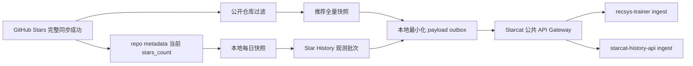

# Starcat 数据贡献与数据平台详细设计

> 日期: 2026-08-22
> 状态: 历史总体方案；推荐贡献实施以 63 为准，History 实施以 62/66 为准
> 版本: v1.0
> 范围: Starcat macOS 客户端数据贡献 + 推荐训练入口 + Star History 观测入口
> 下游设计: [Starcat 自研仓库推荐系统详细设计](61-Starcat自研仓库推荐系统详细设计.md) / [Starcat 自研星标历史服务详细设计](62-Starcat自研星标历史服务详细设计.md)

> 2026-08-26 实施修订: 公开 Star 快照上报已经收口为独立、静默、无删除的 `starcat-collection-api` 链路，权威实施契约见 [63-Starcat 公开 Star 数据静默上报与 Collection 服务详细设计](63-Starcat公开Star数据静默上报与Collection服务详细设计.md)。History 不再建设用户贡献、群体快照、状态或删除链路，改为复用本地唯一 WatchEvent Raw 并发布派生 Delta/Snapshot，权威契约见 [62-Starcat 自研星标历史服务详细设计](62-Starcat自研星标历史服务详细设计.md) 和 [66-Starcat 本地数据湖与云端 Serving 同步详细设计](66-Starcat本地数据湖与云端Serving同步详细设计.md)。本文第 7 节及与两个 Toggle、History 观测、删除重算相关内容只保留为历史设计背景，不得用于新实现。

## 1. 结论

Starcat 后续增加一个默认关闭、用户主动开启的数据贡献能力，使用客户端已经同步到本地的公开 Star 数据，为自研仓库推荐和公开仓库 Star History 提供原始数据。该能力不是现有匿名遥测的扩展，必须有独立开关、独立隐私说明、独立撤回和删除入口。

客户端首期只贡献两类数据：

1. **公开 Star 全量快照**：一个匿名参与者在某次完整同步后仍然 Star 的公开仓库集合，用于构建 co-star 和行为 embedding。
2. **公开仓库 Star 数日快照**：客户端从 GitHub repo metadata 观察到的 `stargazers_count`，用于累积 Star History 精确观测段。

不上传 GitHub 用户 ID、login、Token、私有或 Internal 仓库、标签、笔记、搜索记录、README 阅读、AI 对话和其他本地行为。推荐训练所需的 repo metadata 由服务端根据公开 `repo_id` 补齐，不能靠客户端扩大上报范围。

## 2. 目标与非目标

### 2.1 目标

- 在不改变 local-first 产品边界的前提下，获得可撤回的匿名公开 Star 数据。
- 让同一份本地同步结果分别服务推荐训练和公开 Star History 聚合。
- 以 GitHub repository numeric ID 作为跨服务稳定主键。
- 支持弱网、离线、重复提交、应用重启和账户切换。
- 在服务端尚未具备完整接收、查询、删除能力前，不向正式客户端暴露开关。

### 2.2 非目标

- 不采集用户所有操作，不建设通用产品埋点平台。
- 不上传现有 SQLite 数据库文件或 JSON 全量导出。
- 不上传 Stargazer 用户列表，也不请求额外 GitHub scope。
- 不上传 Private / Internal repo 的 ID、名称、计数或存在性。
- 不把原始匿名快照直接提供给推荐在线 API 或公共查询接口。
- 不以“匿名”替代用户同意、删除权、限期留存和安全控制。

## 3. 设计原则

| 原则 | 约束 |
|---|---|
| 明示同意 | 默认关闭；用户主动开启后才生成待上传任务 |
| 目的分离 | 推荐数据贡献和 Star History 数据贡献使用两个独立 Toggle |
| 最小化 | 推荐只上传 `repo_id + starred_at?`；历史只上传 `repo_id + observed_on + stars_count` |
| 账户隔离 | 每个 GitHub 账户使用独立随机 `participant_id`、同意状态和 outbox |
| 可撤回 | 关闭停止新上传；“删除已贡献数据”调用后端删除并清理本地参与者身份 |
| 私有优先 | Private / Internal 一律在 DTO 构造前过滤，不能依靠后端补救 |
| 可审计 | 设置页可展示上次提交时间、数据种类、条数、状态和隐私说明版本 |
| 可演进 | DTO 由 `schema_version` 管理；服务端只在兼容窗口内接收旧版本 |

## 4. 数据来源与本地边界

### 4.1 当前可复用数据

Starcat 本地已经具备：

- `Repo.id`：GitHub repository numeric ID。
- `Repo.isPrivate`：公开性过滤依据。
- `Repo.starsCount`：本次 repo metadata 同步观察到的当前 Star 数。
- `StarredRepo.starredAt`：GitHub 返回时可用的当前用户 Star 时间；历史数据可能为空。
- 每账户数据库和同步状态：可确定一次完整 Stars 同步是否成功结束。
- `RepoStarHistoryRepository` 的每日本地快照：可构造历史观测批次。

`StarredRepo.userId` 是本地关系字段，属于真实 GitHub 身份，严禁写入贡献 DTO、日志和上传队列。

### 4.2 两条贡献链路



推荐快照必须来自一次成功结束的完整 Stars 同步，不能把分页中断后的部分结果当成完整用户集合。Star History 观测可以随 repo metadata 成功写入后按日增量提交。

## 5. 匿名身份与同意状态

### 5.1 `participant_id`

- 每个 GitHub 账户首次开启任一贡献开关时，在本机生成随机 UUIDv4。
- 不从 GitHub user ID、login、email、设备 ID、Keychain access group 或数据库路径派生。
- 推荐和历史贡献可共用该匿名 ID，便于服务端执行一次性删除，但两类数据仍分别授权。
- 账户退出不自动删除服务端数据；本地保留删除凭据，用户可在退出前或重新登录后执行删除。
- 用户执行“删除已贡献数据”成功后，本地销毁旧 ID；以后重新开启会生成新 ID。

### 5.2 本地设置模型

未来实现建议新增独立模型，不复用 telemetry 开关：

```swift
/// 数据贡献属于明确授权的数据处理，不能与崩溃或匿名遥测共用一个开关。
struct DataContributionConsent: Codable, Equatable {
    var participantID: UUID?
    var recommendationEnabled: Bool
    var starHistoryEnabled: Bool
    var policyVersion: String?
    var consentedAt: Date?
    var lastRecommendationUploadAt: Date?
    var lastHistoryUploadAt: Date?
}
```

同意状态按 Starcat 当前账户隔离。敏感删除凭据进入 Keychain；普通开关和时间可进入账户设置。测试 host 启动期不得主动访问 Keychain，必须继续遵守 `TestEnvironment.isRunning` 门控。

### 5.3 参与者注册与删除凭据

首次开启时先注册匿名参与者：

```http
POST /api/v1/contributions/participants
Authorization: Bearer <Starcat 公共服务 key>
```

```json
{
  "schema_version": 1,
  "participant_id": "63b7d101-88c0-4cee-859f-c61f64d8db96",
  "policy_version": "2026-08-22"
}
```

服务端只在首次注册响应中返回随机 `contribution_token`，数据库只保存 token hash。之后的 ingest、status 和 delete 请求同时携带公共服务 Bearer key 与 `X-Starcat-Contribution-Token`；服务端校验 token 绑定的 `participant_id`。客户端将 token 放入 Keychain，并允许用户从“数据贡献”页面导出一份删除恢复码。不能用可公开的 App key 或单独的 participant ID 执行删除。

如果 Keychain 和恢复码都丢失，匿名设计本身无法通过 GitHub 身份找回；隐私说明必须在开启前明确这一点，并提供人工支持处理无法认证但能证明本地 receipt 的边界。

## 6. 推荐数据契约

### 6.1 完整快照 DTO

```json
{
  "schema_version": 1,
  "snapshot_id": "0191f9e3-95d4-7f52-b4d3-28d628e3a02b",
  "participant_id": "63b7d101-88c0-4cee-859f-c61f64d8db96",
  "captured_at": "2026-08-22T08:30:00Z",
  "mode": "full",
  "content_hash": "sha256:...",
  "repositories": [
    {
      "repo_id": 41881900,
      "starred_at": "2023-06-11T13:20:10Z"
    },
    {
      "repo_id": 1342004,
      "starred_at": null
    }
  ]
}
```

| 字段 | 约束 |
|---|---|
| `snapshot_id` | UUIDv7 或 UUIDv4；同一业务快照重试保持不变 |
| `participant_id` | 本机随机匿名 ID，不是 GitHub 身份 |
| `captured_at` | 完整同步成功结束时间，UTC |
| `mode` | v1 固定 `full`；服务端不得把缺项解释成网络丢失 |
| `content_hash` | 对排序后的 canonical payload 计算 SHA-256，用于去重和短路 |
| `repositories[].repo_id` | 正整数、公开仓库、去重、升序 |
| `starred_at` | 可空；只表达当前用户对该 repo 的 Star 时间，不决定相似度主逻辑 |

`starred_at` 可用于时间切分、数据新鲜度和防止未来信息泄漏，但 Puzer 方案的核心训练输入仍是用户 Star 集合，不依赖精确顺序。旧数据没有该字段时不能丢弃整个样本。

### 6.2 分块上传

单个用户可能有数万 Stars，使用三段式协议：

```http
POST /api/v1/contributions/recommendation-snapshots
PUT  /api/v1/contributions/recommendation-snapshots/{snapshot_id}/chunks/{index}
POST /api/v1/contributions/recommendation-snapshots/{snapshot_id}/commit
```

创建响应返回 `upload_id`、`chunk_size`、`expires_at`。每块最多 1000 个 repo，块使用 `(snapshot_id, index)` 幂等。只有 `commit` 校验块数、总数和 `content_hash` 成功后，快照才进入训练数据；未提交的块 24 小时后清理。

连续两个完整同步的 `content_hash` 相同且未超过服务端要求的刷新周期时，客户端不重复上传正文，只更新本地检查时间。

## 7. Star History 数据契约

### 7.1 观测批次 DTO

```json
{
  "schema_version": 1,
  "batch_id": "0191f9e8-8768-740f-b5e0-52776e274f00",
  "participant_id": "63b7d101-88c0-4cee-859f-c61f64d8db96",
  "captured_at": "2026-08-22T08:32:00Z",
  "observations": [
    {
      "repo_id": 41881900,
      "observed_on": "2026-08-22",
      "stars_count": 168742,
      "source": "local_snapshot",
      "precision": "snapshot"
    }
  ]
}
```

约束：

- 每批最多 1000 条，`batch_id` 在重试时不变。
- 客户端只发送公开 repo；`stars_count >= 0`。
- `observed_on` 由 `captured_at` 的 UTC 日期生成，避免时区产生双日。
- v1 的 `source` 和 `precision` 固定为 `local_snapshot / snapshot`，不能伪装为事件级精确历史。
- 同一参与者、repo、日期只保留最后一次有效观测；明显回退或暴涨由服务端风控标记，不直接覆盖聚合值。

### 7.2 Endpoint

```http
POST /api/v1/contributions/star-history-observations
GET  /api/v1/contributions/status
DELETE /api/v1/contributions
```

所有写接口要求 Starcat 公共服务 Bearer key、参与者 `contribution_token`、请求大小限制和短时速率控制。公共 App key 不是用户认证，不能单独作为删除授权。

## 8. 本地模块与持久化

未来客户端建议新增：

```text
Starcat/Core/DataContribution/
  DataContributionConsent.swift
  DataContributionPolicy.swift
  DataContributionPayloads.swift
  DataContributionOutbox.swift
  DataContributionRepository.swift
  DataContributionUploader.swift
  RecommendationSnapshotBuilder.swift
  StarHistoryObservationBuilder.swift
```

### 8.1 Outbox 表

正式版数据库必须追加新的 `registerVN`，禁止修改 `v1-initial` 或已经发布的 migration。建议表：

```sql
CREATE TABLE data_contribution_outbox (
  id TEXT PRIMARY KEY NOT NULL,
  account_id TEXT NOT NULL,
  participant_id TEXT NOT NULL,
  kind TEXT NOT NULL,
  schema_version INTEGER NOT NULL,
  payload BLOB NOT NULL,
  content_hash TEXT NOT NULL,
  state TEXT NOT NULL,
  attempt_count INTEGER NOT NULL DEFAULT 0,
  next_attempt_at DATETIME,
  created_at DATETIME NOT NULL,
  updated_at DATETIME NOT NULL,
  UNIQUE(account_id, kind, content_hash)
);
```

`payload` 只保存已完成私有过滤的最小 DTO。关闭开关时删除对应未发送任务；删除服务端数据成功后删除该参与者的全部 outbox。

### 8.2 状态机

```text
pending -> uploading -> succeeded
   |          |
   +------> retry_wait -> uploading
   +------> cancelled
```

- 网络错误、429、5xx：指数退避加 jitter，最大 24 小时。
- 400/413/422：标记永久失败并展示可诊断状态，不无限重试。
- 401/403：停止该服务上传，等待配置或服务恢复。
- App 退出、睡眠、账户切换：取消当前请求，保留幂等任务。
- 同种完整推荐快照只保留最新未发送版本；历史观测批次不可因后续批次到来而丢弃。

## 9. 服务端接收与数据流

### 9.1 服务边界

```text
Starcat App
   │
   ├── recommendation snapshot ──> starcat-collection-api ──> starcat-recsys-trainer Pull
   └── history observations ─────> starcat-history-api ingest

starcat-recsys-trainer ──> ServingBundle ──> starcat-recommend-api /api/v2
starcat-history-api ─────> 原始观测 / 日聚合 / History Serving DB
```

可由统一域名或 gateway 暴露入口，但 Collection 原始快照与 Recommend 在线 Serving 必须隔离。`starcat-recommend-api` 只能读取 Trainer 发布的去身份化 Bundle，不能读取参与者或 snapshot items；History 新链路不能重新塞回 `starcat-discovery-api`。

### 9.2 推荐原始表

```sql
participants(participant_id, created_at, deleted_at, policy_version)
recommendation_snapshots(snapshot_id, participant_id, captured_at, content_hash, repo_count, state)
recommendation_snapshot_items(snapshot_id, repo_id, starred_at)
deletion_requests(request_id, participant_id, state, requested_at, completed_at)
```

训练数据导出时只输出内部整数 `training_user_id` 和 repo ID；在线 API 不得访问 `participants` 或 snapshot items。

### 9.3 历史原始表

```sql
history_contributions(batch_id, participant_id, received_at, state)
history_observations(batch_id, repo_id, observed_on, stars_count, received_at, trust_state)
history_daily_series(repo_id, observed_on, stars_count, source, precision, contributor_count, model_version)
```

原始观测用于去重、反滥用和删除重算；日聚合才进入查询链路。

## 10. 隐私、安全与滥用控制

### 10.1 禁止上传清单

- GitHub user ID、login、email、avatar URL、OAuth/GitHub App Token。
- Private / Internal repo 的 ID、名称、计数、Star 关系和历史点。
- tag、note、status、list、library state、搜索词、浏览时长、点击、窗口行为。
- README 正文、代码、AI prompt、AI response、RAG 内容和本地文件。
- 设备序列号、MAC 地址、稳定硬件指纹和原始 IP 持久记录。

### 10.2 服务端防护

- TLS；请求体大小、条数、repo ID 和时间范围校验。
- IP 仅用于短时限流和安全日志，不进入训练集。
- 对异常大用户、机器人式 Star 集合和高频重复数据降权或隔离。
- 训练前对超大 Star 集合做用户权重衰减，避免收藏机器支配相似关系。
- 删除请求必须级联原始快照、观测、训练映射，并触发受影响聚合重建；已发布模型在下一次重训替换，状态页说明最长生效时间。

### 10.3 产品与合规门槛

正式发布前必须完成：

- App 内简明说明和完整隐私政策同步。
- App Store Privacy Nutrition Label 复核。
- 保留期限、删除 SLA、联系渠道和服务地区说明。
- 安全审计、日志脱敏检查、端到端删除演练。
- 用户开启前展示具体字段示例，不使用笼统“帮助改进产品”。

## 11. 设置页交互契约

入口建议放在“设置 → 隐私与数据”，不是“API 服务”：

- `贡献匿名公开 Star 数据以改进仓库推荐`，默认关闭。
- `贡献公开仓库 Star 数快照以改进历史曲线`，默认关闭。
- 状态：上次成功时间、待上传条数、最近错误。
- `查看将上传的数据`：展示按当前账户实时构造的脱敏预览。
- `删除已贡献数据`：二次确认，执行中禁用重复提交。
- 关闭 Toggle 只停止未来贡献；UI 必须明确提示历史数据需单独删除。

开关不得以首次启动弹窗强迫选择，也不得绑定 Pro、推荐可用性或 Star History 可用性。

## 12. 实施顺序

### Phase 0：后端契约和合规准备

1. 冻结 v1 DTO、大小限制、幂等和删除协议。
2. 完成接收端、隔离存储、状态查询和端到端删除。
3. 完成隐私政策、威胁模型和滥用测试。

### Phase 1：客户端本地构造

1. 追加 migration，建立账户级 consent 和 outbox。
2. 实现两个 builder，并以测试证明私有仓库和身份字段无法进入 payload。
3. 实现数据预览，不开放网络上传。

### Phase 2：上传与设置页

1. 接入幂等 uploader、退避、账户切换取消和状态展示。
2. 灰度开放两个独立开关。
3. 验证删除、重装、退出登录和多账户行为。

### Phase 3：数据可用性

1. 推荐训练侧生成覆盖率、用户规模、repo 长尾和异常率报告。
2. History 侧生成观测覆盖、同日分歧和来源可信度报告。
3. 达到 61/62 文档的数据门槛后再训练或切换线上查询。

## 13. 测试清单

### 13.1 客户端

- 默认关闭时不生成 payload、不创建 outbox、不发网络请求。
- 开启推荐后只在完整同步成功时生成 `mode=full` 快照。
- Private / Internal repo 在 builder 输入、payload、日志和持久化四处均不可见。
- `StarredRepo.userId`、login、Token、标签和笔记永不出现在 JSON。
- 重试保持 snapshot/batch ID；相同 `content_hash` 不重复上传。
- 账户 A 的 ID、开关和队列不会被账户 B 读取或发送。
- 关闭开关取消未发送数据；删除完成销毁 participant 和 outbox。
- 测试 host 不触发 Keychain 授权对话框。

### 13.2 后端

- 缺块、重复块、错序块、hash 不匹配和超大 payload 被稳定处理。
- 同一幂等键只产生一条业务记录。
- 非法 repo ID、未来时间、负 Star 数和非法枚举返回稳定 4xx。
- 删除请求可重复调用，最终状态一致。
- 删除后无法在原始表、训练导出、日聚合和在线 Serving 数据中查询到参与者记录。
- 日志、trace、指标 label 不包含完整 Star 集合或匿名参与者 ID。

## 14. 完成定义

只有同时满足以下条件，数据贡献功能才算可以进入正式客户端：

- 两类开关默认关闭且互相独立。
- 字段白名单、私有过滤、账户隔离和数据预览有自动化证明。
- 上传、幂等、退避、暂停、删除和状态查询完整可用。
- 服务端能在约定 SLA 内完成删除并重建受影响聚合。
- 隐私政策和 App Store 披露完成审查。
- 推荐与 History 消费端只读取脱敏聚合产物，不访问原始匿名快照。
- 未开启贡献的用户仍可正常使用 Starcat 和公共查询服务。

## 15. 已采用决策

1. 数据贡献是独立授权，不并入匿名遥测。
2. 推荐使用匿名完整公开 Star 快照；Star History 使用公开 repo 日级 Star 数观测。
3. 客户端不上报真实 GitHub 身份和私有数据。
4. 推荐在线 Serving 和 Star History 分属独立职责；推荐统一由 `starcat-recommend-api` 承担，History 不能归入 Discovery。
5. 后端删除能力先于客户端开关上线。
6. 本轮只完成可实施设计，不修改数据库、客户端代码或后端服务。
