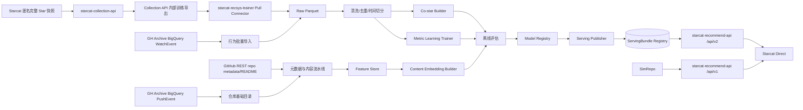

# Starcat 自研仓库推荐系统详细设计

> 日期: 2026-08-24
> 状态: 离线基线与 v2 本机真实全链路已完成；生产级混合模型、shadow 和灰度属于后续阶段
> 版本: v1.1
> 范围: `starcat-collection-api` + `starcat-recsys-trainer` + `starcat-recommend-api` + Starcat Direct
> 当前客户端数据契约: [Starcat 公开 Star 数据静默上报与 Collection 服务详细设计](63-Starcat公开Star数据静默上报与Collection服务详细设计.md)
> 调研基线: `Puzer/github-repo-embeddings` commit `f6a2f836b63f1065b2a2efdee21e8485449923bc`；`Mubelotix/simrepo` commit `07c6ef1dcfe2fd96cc050ef91529b7f180a55288`

## 1. 结论

Starcat 自研推荐采用“时间衰减 co-star + Metric Learning 行为向量 + 内容向量冷启动 + 元数据校正 + MMR 去重”的混合方案。SimRepo 继续作为迁移期外部基线和降级来源；Puzer 项目提供可复现的行为向量训练骨架。两者的思路互补，不直接复制任一实现。

后端由三个独立 Git 项目承担三类职责：

1. **`starcat-collection-api`**：独立、静默接收经用户同意的匿名公开 Star 完整快照，只向训练系统提供内部导出。
2. **`starcat-recsys-trainer`**：主动 Pull Collection 导出、导入公开数据、清洗、构建特征、训练、离线评估并发布版本化推荐产物。
3. **`starcat-recommend-api`**：长期统一推荐入口；`/api/v1` 保持 SimRepo Provider 不变，`/api/v2` 只读 Trainer 发布的 ServingBundle。

不再创建职责重复的 `starcat-recsys-api`。自研链路先通过新增 `/api/v2` 独立验证，不改变现有 `/api/v1` 行为；达到质量门槛后再灰度切换默认 Provider。收口时只删除 SimRepo Provider 和对应密钥，`starcat-recommend-api` 作为统一服务继续保留。

## 2. 上游调研结论

### 2.1 Puzer `github-repo-embeddings`

公开代码可确认的核心链路：

- 从 GH Archive BigQuery 提取 `WatchEvent` 训练 user-repo 关系，并用 `PushEvent` 批量建立 repo ID、最新名称和 Push 时间目录。
- 按 `actor_id` 聚合成 `user -> repo_ids` 的隐式反馈集合。
- 过滤过少或过多行为的用户和低支持度 repo。
- 对每个用户的 Star 集合随机切分 train/test。
- 使用 PyTorch `EmbeddingBag(mode="mean")` 生成用户兴趣中心。
- repo embedding 默认 128 维。
- 使用 `pytorch-metric-learning` 的 `MultiSimilarityLoss` 拉近同一用户 Star 的 repo。
- 用户向量由其 repo embedding 均值形成，再做最近邻推荐。

公开仓库没有给出完整 README/Qwen 初始化和生产 Serving 实现，因此这些不能写成已验证事实。该项目最值得复用的是训练样本组织、`EmbeddingBag` 聚合和 Metric Learning 目标，不是直接部署其代码。

### 2.2 SimRepo

当前公开说明区分两套模型：

| 版本 | 已公开信息 | Starcat 用法 |
|---|---|---|
| v1 | `TruncatedSVD`、100 维 repo embedding、Qdrant cosine | 作为可复现的线性协同过滤 baseline |
| v2 | 基于共享 Stargazer 的协同过滤，时间衰减，结果预计算 | 作为高精度 co-star 方向和线上质量对照 |

SimRepo 的公开仓库没有提供 v2 数据生成和训练流水线，无法确认其精确衰减公式、归一化、采样、反作弊和更新策略。Starcat 只采用“时间衰减共享 Stargazer”这一可确认方向，自行定义可测试公式。

### 2.3 综合选择

| 信号 | 优点 | 缺点 | 定位 |
|---|---|---|---|
| 时间衰减 co-star | 强相关、易解释、成熟 repo 准确 | 长尾稀疏、计算量大 | 高置信主召回 |
| Metric Learning | 能传播兴趣结构、覆盖稀疏关系 | 需训练和版本治理 | 全局行为召回 |
| 内容 embedding | 新 repo 可用、语义清晰 | 容易只“文字像” | 冷启动与补召回 |
| TruncatedSVD | 简单、稳定、可复现 | 表达能力有限 | baseline / 故障回退 |
| 元数据与规则 | 可控、可解释 | 不能单独形成推荐 | 过滤与校正 |

## 3. 产品目标与约束

### 3.1 支持的请求

| 模式 | 输入 | 典型场景 |
|---|---|---|
| 单仓相似 | 一个 `repo_id` | 详情页相似项目 |
| 多仓扩展 | 2～20 个 positive repo，可选 negative | 技术选型候选扩展 |
| 匿名个性化 | 本地直接提交最多 100 个 seed repo，或短期 profile token | “为你推荐” |

首期不允许在线 API 以 `participant_id` 直接查询长期兴趣，避免 Serving 层接触原始匿名身份。个性化请求优先由客户端发送去重后的 seed repo IDs；后续如需 profile token，必须短期、不可反查且与训练身份分离。

### 3.2 输出要求

- 返回稳定 GitHub repo ID、展示 metadata、总分、信号分和可解释 reasons。
- 过滤输入 repo、已归档、已禁用、明显恶意和无法公开访问的 repo。
- 默认排除客户端传入的本地已 Star 集合，避免把“已拥有”当推荐结果。
- 单个 owner、同一模板仓库、同一 topic 簇不能占满一页。
- 模型不可用时返回明确 `degraded`，不得悄悄把随机热门伪装为个性化。

## 4. 总体架构



原始 Star 集合不进入在线服务。训练服务发布的只是 repo 向量、repo-repo 边、metadata、模型 manifest 和预计算 Top-K。

## 5. 数据获取方案

### 5.1 优先级

1. **Starcat 用户主动贡献**：持续、合法边界清晰，可保留 `starred_at`，但早期规模有限。
2. **GH Archive BigQuery**：用于冷启动和覆盖扩展；`WatchEvent` 构建公开 user-repo 关系，`PushEvent` 批量建立仓库基础目录。
3. **GitHub REST/GraphQL**：只对最终 Top N 候选补 repo 当前 metadata、topics、README、状态和重命名，不对数百万仓库逐个请求，也不批量抓取受限 Stargazer 列表。

上报少时使用 BigQuery，不应等待数据规模自然增长后才验证算法。BigQuery 导入仍需要预算门禁、分区裁剪、dry run 和水位线。

PushEvent 目录只把查询范围内的最新仓库名、首次/末次观察到的 Push 时间作为低精度基础 metadata；首次时间不是权威创建时间，末次时间也不保证等于 GitHub 当前 `pushed_at`。Canonical 合并时 GitHub API 的当前描述、Topics、语言、License、Star/Fork 数和 archived/disabled/visibility 状态必须覆盖 PushEvent 缺省值。

### 5.2 统一训练事件

```text
source           string  starcat_snapshot | gh_archive
source_user_id   bytes   仅训练区内部使用的不可逆映射
repo_id          int64
starred_at       timestamp nullable
observed_at      timestamp
source_weight    float32
snapshot_id      string nullable
```

- Starcat snapshot 代表当前仍 Star 的集合；GH Archive `WatchEvent` 代表公开 Star 事件。
- 同源重复先去重；跨源不能用真实身份连接，按独立训练用户处理。
- 仓库转移/重命名始终保持 repo ID；删除或改为私有后从下次发布产物移除。
- `source_weight` 是数据可信度和采样修正，不是最终推荐固定权重。

### 5.3 数据湖与 OLTP

原始训练数据采用按日期/source 分区的 Parquet，放对象存储；不要把数亿 user-repo 边塞进在线 Postgres。Postgres 只保存：

- ingest job、watermark、数据质量报告；
- model run、参数、指标、artifact URI；
- deployment、active version、回滚记录；
- repo metadata 和小规模控制表。

## 6. 数据清洗和样本构造

### 6.1 用户过滤

- 少于配置下限的有效公开 repo 用户不能形成正样本；大规模 BigQuery 示例采用 10。
- 超过配置上限的 Star 集合先隔离疑似机器人/采集账号；当前 BigQuery 示例采用 800，保留的主体再使用 `1 / log2(2 + repo_count)` 权重或分桶采样。
- 高频短时、规则化命名、异常单一 owner 集合进入机器人/采集账号隔离集。
- 每个训练 batch 限制单用户贡献 pair 数，避免组合爆炸。

### 6.2 Repo 过滤

- 排除 private、archived、disabled、DMCA/安全隔离和 metadata 长期不可获取的 repo。
- 训练最小支持度按数据规模配置，但评估必须单独报告长尾，不得只保留热门 repo 后宣称整体效果。
- 当前实现以查询窗口内去重后的来源内主体数作为 repo 支持度；这是观察到的 Star 近似值，不得写成 GitHub 当前 `stargazers_count`。
- Fork 默认保留为候选特征，若与上游内容近重复则由去重/MMR 控制；不在清洗阶段全量删除。

### 6.3 时间切分

离线评估必须按时间切分：

```text
train: starred_at < T
validation: T <= starred_at < T + 14d
test: starred_at >= T + 14d
```

没有 `starred_at` 的 Starcat 旧集合可参与共现/训练，但不能进入严格 next-star 时间评估。Puzer 的 per-user 随机 holdout 可保留为开发快速实验，不作为生产唯一指标，以免未来信息泄漏。

## 7. 算法设计

### 7.1 时间衰减 co-star

对用户 `u` 在 repo `i` 的行为定义：

```text
age_days(u, i) = max(0, train_cutoff - starred_at)
time_weight(u, i) = exp(-ln(2) * age_days / half_life_days)
user_weight(u) = 1 / log2(2 + repo_count(u))
```

缺失 `starred_at` 时 `time_weight = legacy_weight`，首期建议 `0.5`。repo pair 原始支持度：

```text
support(i, j) = Σu user_weight(u) * min(time_weight(u,i), time_weight(u,j))
```

归一化和收缩：

```text
cosine(i,j) = support(i,j) / sqrt(support(i,i) * support(j,j))
co_star_score(i,j) = cosine(i,j) * support(i,j) / (support(i,j) + shrinkage)
```

建议从 `half_life_days=730`、`shrinkage=20` 开始，通过验证集选择。必须保留未衰减版本做 ablation，不能把参数写死为产品事实。

co-star builder 只保存每个 repo 的 Top 500～1000 条边，字段包含 score、support、共同用户估计、模型版本和生成时间。

### 7.2 Metric Learning 行为向量

第一版复现 Puzer 骨架：

- repo embedding 维度：128。
- 一个用户的正样本集合经 `EmbeddingBag(mode="mean")` 形成中心。
- 使用 `MultiSimilarityLoss`；batch 内采样同用户正例和其他用户难负例。
- 超大集合按时间/主题分层抽样，避免均值被热门 repo 淹没。
- 输出 L2 normalized repo vectors 和训练 manifest。

训练实验必须比较：

- 随机初始化；
- TruncatedSVD 100D 初始化/基线；
- 内容 embedding 经投影后的初始化；
- 不同负采样和用户权重。

不把 Qwen/README 初始化列为必需，因为 Puzer 公开代码没有完整可复现实现。内容向量独立召回更容易审计和回滚。

### 7.3 内容向量

构造稳定 repo profile：

```text
name + description + topics + primary_language + license + README summary
```

- README 正文先做长度限制和模板/徽章清洗。
- 模型名称、维度、输入 hash 和生成时间写入版本化 manifest。
- 新 repo metadata 到达后可独立增量生成，不必等待行为模型重训。
- 内容向量只使用公开数据，不从 Starcat 客户端上传 README 或代码。

### 7.4 候选召回

单仓请求默认各取：

| Recall | Top-N | 条件 |
|---|---:|---|
| `co_star_v1` | 200 | 有足够 pair support |
| `metric_v1` | 200 | repo 在行为向量索引中 |
| `content_v1` | 150 | repo 有内容向量 |
| `svd_baseline_v1` | 100 | 只在实验或主模型降级时 |
| `popular_fallback` | 50 | 仅无其他候选，必须标记 degraded |

多仓请求对 positive repo 的向量取加权中心，对候选分数做 max + mean 组合；negative repo 只用于降权和过滤，不写回训练数据。

### 7.5 动态融合

禁止长期使用一组固定的全局权重。先计算行为置信度：

```text
behavior_confidence = clamp01(
  0.35 * log_support
+ 0.25 * source_coverage
+ 0.20 * embedding_availability
+ 0.20 * freshness
)
```

融合：

```text
behavior = max(co_star_score, metric_score)
content_weight = 1 - 0.65 * behavior_confidence

base_score =
  behavior_confidence * behavior
+ content_weight * content_score
+ metadata_adjustment
```

`metadata_adjustment` 只做小范围校正，包括 language/topic、活跃度、archived、异常增长和质量下限。所有分量先在模型版本内做校准。公式是 v1 起点，最终参数由离线验证和 shadow 实验决定。

### 7.6 MMR 多样化

最终 Top-K 使用 Maximal Marginal Relevance：

```text
MMR(candidate) = λ * relevance - (1 - λ) * max_similarity(candidate, selected)
```

首期 `λ=0.8`。再施加硬约束：

- 同 owner 默认最多 2 个；
- 同一 fork/network 默认最多 1 个；
- 前 10 条至少覆盖 2 个 topic 子簇，除非候选不足；
- 不能为了多样性放入低于质量阈值的无关仓库。

## 8. 可解释性

reason 由已校准特征确定性生成，不调用 LLM：

- `与当前仓库拥有较高的共同 Star 用户重叠`
- `在开发者兴趣向量中接近`
- `README 与 topics 均与 RAG/agents 相关`
- `同为 Swift 且最近 90 天仍活跃`

API 可返回最多 3 条 reasons 和 `signals`，但不返回共同用户身份、原始支持者列表或训练用户数量的精确小值。低于隐私阈值的 support 只返回区间或不展示。

## 9. 训练服务设计

### 9.1 仓库结构

```text
supports/starcat-recsys-trainer/
  cmd/ingest-api/
  jobs/
    import_gharchive/
    build_dataset/
    build_costar/
    train_metric/
    build_content/
    evaluate/
    publish/
  recsys/
    datasets/
    models/
    metrics/
    serving/
  migrations/
  configs/
  tests/
  model_cards/
```

训练任务使用 Python。Starcat 公网写入边界由独立 Go 服务 `starcat-collection-api` 承担；Trainer 只通过 Admin Key 保护的内部导出接口主动 Pull，不开放公网写入端口。任务由明确 job manifest 驱动，禁止在 API 进程内同步训练。

### 9.2 Pipeline DAG

```text
pull_collection/import_gharchive
          ↓
validate_and_normalize
          ↓
build_time_split
    ┌─────┼──────────┐
    ↓     ↓          ↓
co-star metric     content
    └─────┼──────────┘
          ↓
evaluate + ablation
          ↓
candidate manifest
          ↓
publish staging
          ↓
atomic activate / rollback
```

每个 job 记录 input watermark、git commit、config hash、random seed、数据统计、artifact checksum、耗时和失败原因。

### 9.3 Model Registry

```sql
model_runs(
  model_version, algorithm, git_commit, config_json,
  dataset_version, metrics_json, artifact_uri, checksum,
  state, created_at
)

model_deployments(
  environment, active_version, previous_version,
  activated_at, activated_by, rollback_reason
)
```

Trainer 先安装并验证本地不可变 Bundle，再通过 `Publisher` 接口把压缩 Bundle 上传到 `starcat-recommend-api` 内部发布端点。Recommend API 校验 manifest、文件 checksum、SQLite `quick_check` 和必需表后，原子切换 active 指针。每个 v2 响应返回 `model_version`；回滚只切换 active version，不改变客户端协议。

## 10. Serving 数据设计

小中规模第一版可用 Postgres + pgvector；大规模预计算边建议对象存储构建后批量导入专用 KV/SQLite 分片或 ClickHouse。具体实现以压测决定，不提前绑定 Qdrant。

逻辑表：

```sql
repos(repo_id, full_name, description, language, stars, forks, topics, archived, pushed_at, metadata_version)
repo_similarity_edges(model_version, source_repo_id, target_repo_id, score, support, signal)
repo_embeddings(model_version, repo_id, kind, vector)
repo_recommendations(model_version, repo_id, rank, target_repo_id, score, signals_json)
```

高流量单仓查询优先读预计算 `repo_recommendations`；多仓和过滤请求使用向量/边在线合并。发布新版本先写新 namespace，再原子切换，旧版本保留至少一个回滚窗口。

## 11. `starcat-recommend-api` 在线契约

### 11.1 单仓推荐

Starcat 客户端以 `RecommendationAPIContract` 显式选择版本：Direct target 使用本节 `/api/v2`，App Store target 保持 `/api/v1` SimRepo。两个版本复用推荐卡片 DTO、磁盘缓存和 UI；v2 额外解码可空 `model_version`，未知 `signals` 字段按 Codable 前向兼容规则忽略。

```http
GET /api/v2/repos/{repo_id}/recommendations
    ?limit=20
    &offset=0
```

响应：

```json
{
  "schema_version": 1,
  "data": {
    "repo_id": 41881900,
    "model_version": "hybrid-2026-08-22.1",
    "source": "starcat_trained",
    "fallback": false,
    "items": [
      {
        "repo_id": 123,
        "full_name": "owner/repo",
        "description": "...",
        "language": "Swift",
        "stars": 1200,
        "forks": 80,
        "archived": false,
        "score": 0.874,
        "signals": {
          "co_star": 0.91,
          "metric": 0.84,
          "content": 0.72,
          "metadata": 0.03
        },
        "source": "starcat_trained",
        "reasons": ["基于公开 Star 共现关系"]
      }
    ],
    "has_more": false,
    "next_offset": null
  },
  "meta": {
    "cache_status": "fresh",
    "generated_at": "2026-08-22T09:00:00Z"
  }
}
```

### 11.2 多仓/个性化推荐

```http
POST /api/v2/recommendations/query
```

```json
{
  "positive_repo_ids": [41881900, 1342004],
  "negative_repo_ids": [],
  "exclude_repo_ids": [123],
  "limit": 20,
  "filters": {
    "languages": ["Swift"],
    "include_archived": false
  }
}
```

限制 positive 20、negative 20、exclude 500。body 不接收 `participant_id`、用户 login、tag 或 note。

### 11.3 内部 Bundle 发布

```http
POST /internal/v1/model-bundles/{model_version}?activate=true
Authorization: Bearer <MODEL_PUBLISH_KEY>
Content-Type: application/zip
```

压缩包只允许包含 `recommendations.sqlite`、`manifest.json` 和 `checksums.json`。服务端拒绝路径穿越、额外文件、版本不一致、checksum 错误、SQLite 损坏和缺少必需表；安装目录不可变，激活指针通过临时文件加原子重命名更新。该端点与客户端 `API_KEYS` 完全隔离，不对第三方开放。

### 11.4 错误和缓存

| 状态 | 语义 |
|---|---|
| 200 | 正常或明确 `degraded=true` 的可用结果 |
| 400 | 参数非法 |
| 404 | repo 不存在或当前模型无任何候选 |
| 422 | 输入全部被过滤 |
| 429 | 限流，带 `Retry-After` |
| 503 | active model / serving store 不可用，不返回伪结果 |

响应使用 ETag，客户端缓存 key 必须包含 model version、输入和过滤器。服务端推荐正常 TTL 24 小时；repo metadata 可单独更短刷新，不必重算向量。

## 12. 评估方案

### 12.1 离线指标

- Recall@10/20/50
- NDCG@10/20
- MRR@10
- HitRate@10
- Coverage（repo、长尾、语言、topic）
- Diversity / Intra-list similarity
- Novelty / Popularity bias
- Freshness（新 repo 覆盖与更新时间）

所有指标按热门、中腰部、长尾、repo age、language 和数据来源分桶。不能只汇报全局均值。

### 12.2 必做 ablation

| 实验 | 配置 |
|---|---|
| A | 热门基线 |
| B | TruncatedSVD v1 baseline |
| C | 内容 embedding only |
| D | time-decayed co-star only |
| E | Metric Learning only |
| F | co-star + Metric + content 动态融合 |
| G | F + metadata + MMR |

必须额外比较无时间衰减、无用户降权和固定权重版本，证明复杂度确实带来收益。

### 12.3 人工评测

建立不少于 100 个种子 repo 的固定评测集，覆盖：

- 同类替代品；
- 同生态互补项目；
- 新 repo 冷启动；
- 热门跨领域 repo；
- 小语种和非主流语言；
- fork、镜像、awesome list 和模板仓库。

每条由至少两人标注相关性 0～3、是否重复、是否可解释。分歧进入复核。

## 13. 灰度与迁移

### Phase 0：基线

- 固化当前 SimRepo 响应样本、延迟、空结果率和人工相关性。
- 复现 SVD、内容和 co-star 小规模 baseline。

### Phase 1：离线训练

- 用 GH Archive bootstrap；并行接收 Starcat opt-in 数据。
- 完成 A～G ablation，不接线上流量。

### Phase 2：Shadow

- `starcat-recommend-api` 对真实 v1 请求异步执行同进程 v2 Provider，只记录脱敏差异指标，不改变 v1 响应。
- 不记录客户端完整已 Star 集合或参与者身份。

### Phase 3：灰度

- 1% → 10% → 50% → 100%，以 server-side stable bucket 分流。
- 任一阶段出现相关性、错误率或 P95 回退，原子切回 SimRepo。

### Phase 4：收口

- 验证通过后可让现有 `/api/v1/repos/{repo_id}/recommendations` 在服务端灰度选择自研 Provider。
- 清理客户端对 `source=simrepo` 的产品依赖，保留通用 source/reasons 展示。
- 删除 `SimRepoProvider` 和密钥；保留 `starcat-recommend-api` 统一服务及自研 Provider，不保留永久双读。

## 14. 服务 SLO 与运维

| 指标 | 目标 |
|---|---|
| 单仓预计算查询 P95 | < 150 ms（不含公网） |
| 多仓在线融合 P95 | < 500 ms |
| 可用性 | 99.9% 月度 |
| 推荐新版本发布 | 至少每周，数据规模允许后每日增量 |
| 回滚 | 10 分钟内切回上一 active version |
| 训练可复现 | 相同 manifest/seed 产物 checksum 可追踪 |

告警覆盖 ingest 延迟、数据规模突变、向量缺失率、Top-K 构建失败、在线错误率、空结果率、延迟和版本漂移。

## 15. 测试清单

### 15.1 训练

- 去重、账户权重、repo 过滤、时间切分和未来数据泄漏测试。
- co-star 小矩阵手算 fixture 与衰减/收缩公式一致。
- Metric Learning 固定 seed 的 smoke test 和向量归一化测试。
- 内容 hash、模型版本和增量重算测试。
- 发布中断不会改变 active manifest；回滚可恢复旧结果。

### 15.2 API

- 单仓、多仓、negative、exclude、filter、cursor 和 ETag 契约。
- 输入 repo 不出现在结果；archived/private 不泄漏。
- 模型缺失、store 故障、超时和降级状态可区分。
- reasons 与实际 signal 对应，不生成虚假解释。
- 在线进程无法读取原始匿名 snapshot 表。

### 15.3 质量

- A～G 指标和分桶报告可由一次命令/任务复现。
- 100 repo 人工集与 SimRepo 盲测完成。
- Shadow 阶段只记录聚合指标，无用户 Star 集合日志。

## 16. 完成定义

- Starcat 数据和 GH Archive 均能生成版本化、可删除重建的训练集。
- co-star、Metric Learning、content、SVD baseline 均可独立训练和评估。
- 动态融合与 MMR 在验证集上优于最强单路模型，并通过长尾分桶审查。
- Trainer 与 Recommend API 的部署、权限、数据存储和发布职责分离。
- 在线 API 达到 SLO，响应带 model version、signals、reasons 和明确 fallback/degraded 状态。
- Shadow/灰度/回滚真实演练完成。
- 自研达到门槛后清理 SimRepo Provider，不删除统一 Recommend 服务，不留下永久双轨。

## 17. 已采用决策

1. 综合 SimRepo 的时间衰减 co-star 与 Puzer 的 Metric Learning，而不是二选一。
2. 内容 embedding 负责冷启动，TruncatedSVD 负责 baseline/回退。
3. 排序使用数据置信度动态融合，不预设长期固定权重。
4. 训练和在线查询拆为 Trainer 与 Recommend API；在线 API 不接触原始匿名身份。
5. BigQuery 用于 bootstrap：WatchEvent 提供关系、PushEvent 提供批量基础目录；GitHub API 只补 Top N 权威 metadata，Starcat opt-in 数据用于持续更新和质量增强。
6. 现有 Recommend API 是长期统一入口；v1 保持 SimRepo 契约，v2 新增自研契约，最终只删除 SimRepo Provider。
7. `starcat-recsys-api` 职责与 Recommend API 重复，明确取消，不创建该项目。

## 18. 参考资料

- Puzer GitHub Repo Embeddings: <https://github.com/Puzer/github-repo-embeddings>
- SimRepo: <https://github.com/Mubelotix/simrepo>
- GH Archive: <https://www.gharchive.org/>
- PyTorch `EmbeddingBag`: <https://pytorch.org/docs/stable/generated/torch.nn.EmbeddingBag.html>
- PyTorch Metric Learning: <https://kevinmusgrave.github.io/pytorch-metric-learning/>
