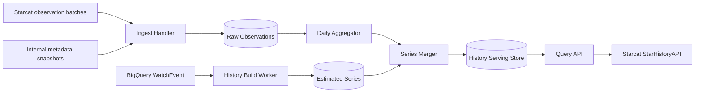

# Starcat 自研星标历史服务详细设计

> 日期: 2026-08-22
> 状态: 方案已确认，待数据贡献链路和独立服务实施
> 版本: v1.0
> 范围: `starcat-history-api` 数据接收、历史构建、公共查询与客户端迁移
> 客户端数据契约: [Starcat 数据贡献与数据平台详细设计](60-Starcat数据贡献与数据平台详细设计.md)
> 当前实现基线: [仓库星标历史整体落地方案](50-仓库星标历史整体落地方案.md)

## 1. 结论

Star History 最终从 `starcat-discovery-api` 迁出，建设独立的 `supports/starcat-history-api`。该服务同时负责：

- 接收 Starcat 用户主动贡献的公开 repo 日级 Star 数观测；
- 从 GH Archive / BigQuery 的 `WatchEvent` 构建公开仓库估算历史；
- 合并服务端已有快照和客户端群体观测；
- 提供带 `source / precision / coverage` 的公共查询 API；
- 在迁移完成后替代 Discovery 路径和 SimRepo/其他第三方历史来源。

推荐和 Star History 必须保持两个独立服务。推荐处理匿名 user-repo 集合和模型产物；History 处理 repo-day 观测和时间序列。二者只有 `repo_id`、公开 repo metadata 和通用运维规范可以共享。

## 2. 当前事实与目标状态

### 2.1 当前已实现

截至现有 v1.3 方案：

- Starcat 客户端已按日保存本地 `stars_count` 快照。
- 有权限的“我的项目”可直连 GitHub `/stargazers`，只在本机聚合。
- 普通公开仓库由 `starcat-discovery-api` 暴露 Star History 路径。
- Discovery 已有 GH Archive/BigQuery Provider、缓存、异步构建、ETag 和错误契约，但生产 Provider 仍受真实数据与预算验证门禁。
- Private / Internal history 不发送公共服务。

这解释了 Discovery 中为什么存在 Star History 路径：它是首版为了复用已有服务基础设施而落地的过渡实现，当前客户端已经使用；不是最终服务归属。

### 2.2 目标状态

```text
Starcat RepoStarHistoryRepository
      ├── 本地快照
      ├── 有权限项目 GitHub Stargazers（仅本机）
      └── StarHistoryAPI
               ↓
       starcat-history-api
          ├── crowd observations
          ├── GH Archive estimate
          ├── service snapshots
          └── daily merged series
```

`starcat-discovery-api` 只负责发现内容，不再拥有历史构建或查询；`starcat-recommend-api` 和 `starcat-recsys-api` 不提供历史接口。

## 3. 产品口径

### 3.1 数据精度

| `source` | `precision` | 含义 |
|---|---|---|
| `github_stargazers` | `reconstructed` | 当前仍在 Stargazer 列表中的用户时间聚合，仅限有权限项目、本机使用 |
| `local_snapshot` | `snapshot` | 当前客户端某日观察到 GitHub 当前 Star 总数 |
| `crowd_snapshot` | `snapshot` | 多个匿名客户端对同一公开 repo-day 的聚合观测 |
| `service_snapshot` | `snapshot` | Starcat 服务端 metadata 同步观察值 |
| `gh_archive` | `estimated` | WatchEvent 累积并按锚点归一化的估算值 |

任何 `snapshot` 只代表某个时间点观察到的总数，不是该日每次 Star/Unstar 事件的完整记录。`reconstructed` 也不等于历史精确总数，因为取消 Star 的用户不再出现在当前 Stargazer 列表。

### 3.2 展示承诺

- API 和 UI 必须同时返回/展示来源、精度、覆盖起点和更新时间。
- 估算点不能命名为“精确历史”。
- 精确快照之间不生成伪造的日值；图表可以连线，但 tooltip 标明真实观察日。
- 来源变化不得制造明显不合理跳变；出现冲突时保留原始来源并以质量状态说明。

## 4. 数据来源

### 4.1 Starcat 群体观测

客户端按 60 文档上传：

```text
participant_id + repo_id + observed_on + stars_count + captured_at
```

接收层保留匿名参与者只用于幂等、滥用控制和删除重算。查询表不保存或返回参与者身份。

### 4.2 GH Archive / BigQuery

使用公开 `WatchEvent` 按 `repo.id` 聚合。查询必须：

- 日期分区裁剪；起点不早于 repo `created_at` 和 GH Archive 覆盖起点；
- 先 dry run，再校验 `maximumBytesBilled`；
- 使用参数化查询；
- 记录 source watermark、扫描字节和结果 hash；
- 不把 `actor.login`、payload 或事件原文写入 Serving DB。

WatchEvent 没有对应的完整 Unstar 事件，累计值只能作为形状信号。它需要由可信快照锚点校准。

### 4.3 服务端 metadata 快照

Starcat 其他公开服务已经获取 repo metadata 时，可通过内部事件或受鉴权 endpoint 提交 `repo_id + observed_at + stargazers_count`。History 服务不能反向依赖 Discovery catalog 生命周期，仓库即使从 Discovery 清理，历史数据也不应级联删除。

### 4.4 SimRepo 和第三方

SimRepo 历史接口只作为迁移期 provider：

- 不写成长期数据真源；
- 响应必须保留 `source=simrepo`；
- 不与 Starcat 精确快照混淆；
- 自研 History 达到覆盖和稳定性门槛后删除配置、调用和缓存。

## 5. 服务架构



首期可在同一仓库和部署单元中包含 ingest API、query API 和 worker，但代码模块、数据库权限和进程入口必须分离。规模增长后再拆部署，不在一开始引入不必要的微服务。

## 6. 仓库结构

```text
supports/starcat-history-api/
  cmd/api/
  cmd/worker/
  internal/handler/
    query.go
    ingest.go
    build.go
  internal/history/
    aggregate.go
    estimate.go
    merge.go
    downsample.go
    quality.go
  internal/provider/
    bigquery.go
    github.go
  internal/store/
  internal/jobs/
  migrations/
  docs/
  tests/
```

沿用 Starcat 后端公共规范：`/healthz`、`/api/v1/ping`、统一 envelope、版本注入、结构化日志、graceful shutdown、Bearer 鉴权、ETag 和稳定错误 code。

## 7. 数据模型

关系型实现可先使用 Postgres；本地/单实例 POC 可用 SQLite，但迁移到生产前必须验证并发 worker、锁和数据量。

### 7.1 Repo 注册表

```sql
CREATE TABLE repositories (
  repo_id BIGINT PRIMARY KEY,
  full_name TEXT,
  visibility TEXT NOT NULL DEFAULT 'public',
  created_at TIMESTAMPTZ,
  current_stars BIGINT,
  metadata_checked_at TIMESTAMPTZ,
  history_state TEXT NOT NULL DEFAULT 'missing',
  updated_at TIMESTAMPTZ NOT NULL
);
```

服务必须在接受公共查询和构建前复核 repo 仍然公开。private/internal 不保留公共 series。

### 7.2 原始观测

```sql
CREATE TABLE history_observations (
  observation_id UUID PRIMARY KEY,
  batch_id UUID NOT NULL,
  participant_id UUID,
  repo_id BIGINT NOT NULL,
  observed_on DATE NOT NULL,
  stars_count BIGINT NOT NULL,
  source TEXT NOT NULL,
  received_at TIMESTAMPTZ NOT NULL,
  trust_state TEXT NOT NULL,
  UNIQUE(batch_id, repo_id, observed_on)
);
```

`participant_id` 只在 raw schema 可见。数据库角色分离：ingest/delete worker 可访问，query API 不可访问。

### 7.3 日聚合和估算事件

```sql
CREATE TABLE history_daily_series (
  repo_id BIGINT NOT NULL,
  observed_on DATE NOT NULL,
  stars_count BIGINT NOT NULL,
  source TEXT NOT NULL,
  precision TEXT NOT NULL,
  contributor_count INTEGER,
  confidence REAL NOT NULL,
  model_version TEXT NOT NULL,
  built_at TIMESTAMPTZ NOT NULL,
  PRIMARY KEY(repo_id, observed_on, model_version)
);

CREATE TABLE gharchive_daily_events (
  repo_id BIGINT NOT NULL,
  event_date DATE NOT NULL,
  event_count BIGINT NOT NULL,
  source_watermark TEXT NOT NULL,
  query_job_id TEXT NOT NULL,
  built_at TIMESTAMPTZ NOT NULL,
  PRIMARY KEY(repo_id, event_date, source_watermark)
);
```

### 7.4 构建任务和水位线

```sql
history_build_jobs(job_id, repo_id, range_start, range_end, state, attempt_count, next_attempt_at, source_watermark, model_version, error_code, created_at, updated_at)
source_watermarks(source, partition_key, watermark, checksum, processed_at)
history_deployments(environment, active_model_version, previous_model_version, activated_at)
```

同一 repo 同一 active model 只能有一个构建任务执行；查询请求不能无限创建重复 job。

## 8. 观测聚合规则

### 8.1 同日 crowd 聚合

对同一 `repo_id + observed_on`：

1. 先按参与者去重，保留该参与者当天最后一条有效值。
2. 校验值相对前后可信快照、当前 GitHub metadata 和同日中位数的偏差。
3. `>= 3` 个独立可信贡献者时取中位数。
4. 只有 1～2 个贡献者时保留为候选快照，置信度较低；若与当天 service snapshot 一致则提升置信度。
5. 任何单一参与者不能通过高频提交提高 `contributor_count`。

建议初始 confidence：

```text
service_snapshot: 1.00
crowd median >= 3 and exact agreement: 0.98
crowd median >= 3 with small spread: 0.92
crowd 1-2: 0.65
gh_archive estimated: 0.45
```

confidence 只用于来源选择和质量展示，不能宣称统计学概率。

### 8.2 快照优先级

同日候选优先级：

1. 公开 repo 的 `service_snapshot`。
2. 通过一致性检查的 `crowd_snapshot` 中位数。
3. `gh_archive estimated`。

本地 `local_snapshot` 不直接存入公共 series 名称；上传后经聚合成为 `crowd_snapshot`。客户端仍将本机点与远端点在 Repository 层合并，同日本机点优先展示给当前用户。

### 8.3 GH Archive 估算

设：

```text
cumulative(d) = Σ event_count(day <= d)
anchor(date, count) = 某个可信 snapshot
```

若只有当前锚点：

```text
estimated(d) = round(anchor.count * cumulative(d) / cumulative(anchor.date))
```

若有多个可信快照，在相邻锚点区间内按 WatchEvent 的累计比例分配增量：

```text
estimated(d) = left.count
  + (right.count - left.count)
  * (cum(d) - cum(left)) / (cum(right) - cum(left))
```

约束：

- 分母为 0 时不生成区间估算。
- 两锚点允许下降，表示真实总量变化；区间内只按事件形状插值，标记 estimated。
- 锚点外不外推超过当前 metadata 日期。
- 构建保留 `model_version`，算法变化时可以整体重建和回滚。

### 8.4 删除重算

参与者删除数据后：

1. 原始 observations 软标记删除并立即对查询角色不可见。
2. 查出受影响的 `repo_id + observed_on`。
3. 重算 crowd 聚合；不足门槛时降级到 service/estimated 或删除该日公共快照。
4. 重建受影响 repo 的 merged series 和 ETag。
5. 达到保留期后物理删除 raw 数据和删除映射。

## 9. 降采样

存储层保留日级点；API 按 range 生成：

| Range | 输出策略 |
|---|---|
| `3m` | 日级 snapshot + 必要 estimated 点 |
| `1y` | 周级形状点，强制保留所有 snapshot 和首尾 |
| `all` | 月级形状点，强制保留所有 snapshot、转折和首尾 |

降采样使用 LTTB 或确定性 bucket 策略。任何算法都必须保留来源边界和可信快照，不能只按均匀间隔删除后让估算覆盖精确点。

## 10. API 契约

### 10.1 查询

兼容现有客户端资源语义：

```http
GET /api/v1/repos/{owner}/{repo}/star-history
    ?repo_id={github_repository_id}
    &range=3m|1y|all
```

成功响应：

```json
{
  "schema_version": 2,
  "data": {
    "repo_id": 41881900,
    "full_name": "microsoft/vscode",
    "range": "1y",
    "status": "ready",
    "model_version": "history-2026-08-22.1",
    "coverage": {
      "starts_on": "2015-09-03",
      "ends_on": "2026-08-22",
      "snapshot_starts_on": "2026-07-27"
    },
    "points": [
      {
        "date": "2026-08-22",
        "stars": 168742,
        "source": "crowd_snapshot",
        "precision": "snapshot",
        "confidence": 0.98
      }
    ],
    "sources": ["gh_archive", "crowd_snapshot"]
  },
  "meta": {
    "generated_at": "2026-08-22T10:00:00Z",
    "cache_status": "fresh"
  }
}
```

客户端 v1 DTO 无法识别的新字段必须可忽略；原有 `source/precision/points` 语义保持。切换 endpoint 不要求同时改 UI 数据口径。

### 10.2 构建

未构建时返回：

```http
HTTP/1.1 202 Accepted
Retry-After: 3
```

```json
{
  "schema_version": 2,
  "data": {
    "status": "building",
    "repo_id": 41881900,
    "retry_after_seconds": 3
  }
}
```

客户端延续三次有界轮询，不无限轮询。若已有 stale series，可返回 200 + `cache_status=stale` 并后台重建。

### 10.3 Ingest

```http
POST /api/v1/contributions/star-history-observations
POST /internal/v1/star-history/service-snapshots
```

公共客户端 endpoint 使用 60 文档 DTO；内部 endpoint 使用服务身份鉴权，禁止仅凭客户端公共 Bearer key 调用。

### 10.4 缓存和错误

- `ETag` 基于 repo ID、range、active model version 和 series hash。
- `If-None-Match` 命中返回 304。
- ready 正常缓存 24 小时；building 短缓存不超过 30 秒；not found 不超过 1 小时。
- 400 参数错误；404 不存在；409 repo ID/name 不一致；422 非公开；429 限流；503 provider 或 store 不可用。
- 错误 code 保持稳定，message 可本地化或调整。

## 11. 私有仓库与权限边界

- `starcat-history-api` 只处理公开 repo。
- 客户端在请求前用 `Repo.isPrivate` 阻断；服务端仍要重新验证可见性。
- “我的项目”使用授权用户自己的 GitHub 凭据直连 `/stargazers`，响应仅在内存聚合后保存本机日级曲线。
- Private / Internal repo 名称、ID、当前 Star 数、历史点和错误日志都不能发往公共 History 服务。
- 仓库从 public 变 private 后，服务端停止查询并从公共 Serving store 移除；raw 安全/审计删除按政策执行。

## 12. 异步构建和成本控制

### 12.1 Job 策略

- 查询 miss 只创建幂等 job，返回 202。
- worker 使用全局和 repo 级并发上限。
- 429/5xx 指数退避；参数/可见性错误不重试。
- 同一 repo 的 stale rebuild 合并；新模型发布可批量排队热门 repo。

### 12.2 BigQuery 预算

每个 job 必须先 dry run，若超过 repo、日或月预算则返回 `budget_rejected`，不执行真实查询。指标至少包括：

- estimated bytes / billed bytes；
- 查询 repo 数、日期跨度、命中分区数；
- 每个 ready series 的平均构建成本；
- cache hit、rebuild 和 provider error。

优先批量离线构建高需求 repo，不让每个在线 miss 都触发独立大扫描。Starcat crowd snapshot 规模足够后，可减少只为短期范围执行的 BigQuery 查询。

## 13. 数据质量与反滥用

- repo current metadata 是异常值校验锚点，但不是整条历史唯一缩放依据。
- 同一 IP/安装产生多个 participant 的高相关提交只计入有限信任，不做硬件指纹持久化。
- 单日值超过当前 metadata 合理误差、负值、未来日期直接隔离。
- 贡献者数量很少时不返回精确 contributor count，避免形成参与者侧信道。
- 每日生成覆盖率、同日 spread、回退率、source 分布和锚点冲突报告。
- 估算算法或聚合阈值改变必须发布新 `model_version`，禁止静默改写线上历史口径。

## 14. 可观测性

指标：

```text
history_query_requests_total{status,range,cache_status}
history_query_duration_seconds{range}
history_build_jobs_total{state,provider}
history_build_bytes_billed_total
history_observations_total{trust_state}
history_series_points{source,precision}
history_source_conflicts_total{type}
history_deletion_rebuild_total{state}
```

日志只记录 repo ID、job ID、模型版本和错误 code；不记录完整 payload、participant ID、IP、Token 或私有 repo 名称。

## 15. 迁移方案

### Phase 0：冻结契约

- 以现有 `StarHistoryAPI` DTO 和 Repository 合并语义为兼容基线。
- 在独立 History 服务实现相同查询资源和稳定错误。
- 完成贡献 ingest、删除和聚合，但不开客户端上传。

### Phase 1：历史数据回填

- 从 Discovery 独立历史缓存导出公开 repo series，不复制 catalog 外键。
- 校验 row count、repo count、points hash、source/precision 和 ETag。
- 导入后两边只读 shadow 比较，不做长期双写。

### Phase 2：客户端数据贡献

- 按 60 文档灰度开启两个独立 opt-in。
- 先观察覆盖和冲突，不立刻把低样本 crowd 点提升为公共主来源。

### Phase 3：查询切换

- 服务端 gateway 按稳定 bucket shadow 1% → 10% → 50% → 100%。
- 客户端可仅更新 `AppEndpoints.StarHistory` 指向，Repository/UI 不改。
- 比较成功率、P95、点数、末值、来源边界和人工图表。

### Phase 4：收口

- 停止 Discovery 新建历史 job，短期只读回退。
- 观察一个发布窗口后删除 Discovery 路由、provider、表和环境变量。
- 删除 SimRepo/第三方 history provider、配置和旧缓存。
- 任何已发布数据库清理使用追加 migration；禁止改历史 migration 或要求删库。

## 16. 验证矩阵

### 16.1 单元/集成

- 同日中位数、少样本、异常值、service/crowd 优先级 fixture。
- 单锚点、多锚点、下降锚点、零事件区间的估算 fixture。
- 降采样保留首尾、快照和 source 边界。
- ingest 幂等、批次限制、非法字段和删除重算。
- BigQuery 参数化、dry run、预算拒绝、watermark 和中断恢复。
- public -> private 后查询阻断和 Serving 清理。

### 16.2 契约

- 200/202/304/400/404/409/422/429/503。
- v1 客户端可忽略 v2 新字段并读取已有点。
- ETag 在数据或 model version 改变时更新，未变时稳定。
- 三次轮询后正常停手；stale 数据可先展示。

### 16.3 数据和人工

- 小/中/大、新/老、快速增长/下降、重命名/转移 repo 样本。
- 与 GitHub 当前 Star 数、现有 Discovery、第三方曲线做末值和形状对照。
- UI 分辨 estimated/snapshot/reconstructed，不产生“精确历史”误导。
- Private / Internal 使用代理和日志审计证明未离开设备。

## 17. SLO 和上线门槛

| 指标 | 目标 |
|---|---|
| ready 查询 P95 | < 200 ms（不含公网） |
| cached 可用性 | 99.9% 月度 |
| 首次 build | 95% 在 60 秒内完成或返回可解释失败 |
| ingest 接收 | 99.9%，支持幂等重试 |
| 删除生效 | 查询隔离立即；聚合重算 24 小时内；物理删除按政策 SLA |

切换前必须同时满足：

- 核心 repo 样本的末值和来源无系统性错误；
- shadow 与 Discovery 响应差异可解释；
- BigQuery 真实数据质量和预算验证通过；
- crowd snapshot 覆盖达到预设阈值，低覆盖时仍能明确降级；
- 删除、public→private、回滚和灾备演练完成。

## 18. 完成定义

- 独立 History 服务拥有 ingest、聚合、构建、查询、删除重算和运维闭环。
- 每个点的 source、precision、confidence、model version 和 coverage 可追踪。
- 客户端保持 local-first，并继续禁止 Private / Internal 公共请求。
- Discovery 历史数据完成一次性迁移和校验。
- 查询灰度达到 100%，至少经过一个稳定发布窗口。
- Discovery Star History 路由和所有第三方 history provider 已删除，无永久双轨。

## 19. 已采用决策

1. Star History 独立于 Discovery 和推荐服务。
2. Starcat 本地日快照是未来公共精确观测段的重要来源，但必须经用户 opt-in 和群体聚合。
3. GH Archive 提供历史形状，永远标记 estimated；有权限的 GitHub Stargazers 只在本机使用。
4. 服务端以 repo ID 为主键，repo name 只校验和展示。
5. 迁移采用 shadow/灰度/一次性回填，稳定后删除 Discovery 路径和第三方 provider。
6. 本轮只完成设计，不修改现有客户端或服务端代码。

## 20. 参考资料

- GH Archive: <https://www.gharchive.org/>
- GitHub REST Starring: <https://docs.github.com/en/rest/activity/starring>
- Star History 当前整体方案: [50-仓库星标历史整体落地方案.md](50-仓库星标历史整体落地方案.md)
