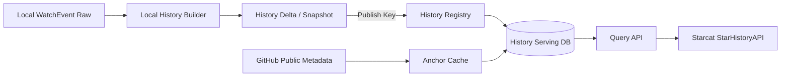

# Starcat 自研星标历史服务详细设计

> 日期: 2026-08-26
> 状态: 本地全量基线完成，生产增量与迁移收口中
> 版本: v1.2
> 范围: `starcat-history-api`、本地 WatchEvent 聚合、History Delta 发布、公共查询与客户端迁移
> 本地数据与发布契约: [Starcat 本地数据湖与云端 Serving 同步详细设计](66-Starcat本地数据湖与云端Serving同步详细设计.md)
> 当前实现基线: [仓库星标历史整体落地方案](50-仓库星标历史整体落地方案.md)

## 1. 结论

Star History 最终从 `starcat-discovery-api` 迁出，建设独立的 `supports/starcat-history-api`。服务职责收敛为：

- 查询本地离线任务发布的公开 repo 日级 WatchEvent 聚合结果；
- 为 Starcat 提供原始 repo/day WatchEvent 接口，由客户端使用本机已有的公开 `stars_count` 形成单一当前锚点；
- 为第三方提供由服务端公开 GitHub metadata 校准的兼容查询接口；
- 两条查询路径均按“不处理 Unstar”的固定口径生成或标记估算 Star 历史；
- 提供 ETag、缓存和稳定错误；
- 接收本地数据平台生成的 History Delta 和完整 Snapshot，并支持幂等应用、恢复和回滚；
- 迁移完成后删除 Discovery 中的临时 History 路径和按请求查询 BigQuery 的 Provider。

推荐和 Star History 继续保持两个独立业务服务。两者共享同一份本地 WatchEvent Raw 数据，但不复制原始文件、不共享 Serving DB，也不互相调用业务接口。

## 2. 2026-08-26 简化决策

此前 v1.0 规划了 History 群体观测、多个精确锚点、Unstar 影响处理和删除重算。当前确认不进入实施范围：

- 不新增 Star History 数据贡献 Toggle。
- 不向公共 History 服务上传 Starcat 本机 `stars_count` 日快照。
- 不接收 `participant_id`、crowd observation 或用户级 History 数据。
- 不处理 Unstar，不尝试还原每次 Star/Unstar 后的精确库存。
- 不做群体中位数、多锚点插值、贡献者置信度和参与者删除重算。
- Starcat 现有本机快照继续仅在本地 Repository 合并，同日本机点仍可优先展示给当前用户。

公共曲线统一标记：

```text
source=gh_archive
precision=estimated
```

该简化不改变 Private/Internal 边界：私有项目仍只允许使用用户本机授权的 GitHub 数据，不进入公共 History 服务。

## 3. 当前事实与目标状态

### 3.1 当前已实现

- Starcat 已有 `StarHistoryAPI`、`GRDBRepoStarHistoryRepository`、`StarHistoryViewModel` 和项目洞察曲线。
- Starcat 已按日保存本地 `stars_count` 快照，并在 Repository 层合并不同来源。
- 有权限的“我的项目”可直连 GitHub `/stargazers` 并仅在本机聚合。
- 普通公开仓库已切换到独立 History 设置槽和 `/star-history/events`，客户端在本地校准并继续复用 Repository/UI。
- 独立服务已实现 Snapshot/Delta 发布、压缩序列查询、ETag、指标和稳定错误；Discovery 旧路径只作为迁移期回退。
- 2016-01-01 至 2026-08-25 的 `3,890` 个 Raw 分区已生成 `260,066,701` 个 repo-day，覆盖 `43,868,648` 个仓库和 `510,104,947` 条 WatchEvent。

### 3.2 目标状态

```text
本地唯一 WatchEvent Raw Parquet
        ↓
每日 repo_id + event_date + event_count 聚合
        ↓
History Delta SQLite / 月度 Snapshot
        ↓ HTTPS Push
starcat-history-api Serving DB
        ↓
GET /api/v1/repos/{owner}/{repo}/star-history/events
        ↓
Starcat StarHistoryAPI + 本机 stars_count 单锚点校准
        ↓
RepoStarHistoryRepository 合并本机点
        ↓
项目洞察 Star 历史曲线
```

`starcat-history-api` 不访问家庭网络、不挂载本地数据湖、不在公共请求中查询 BigQuery。`starcat-discovery-api` 迁移后只负责发现内容。

## 4. 数据口径

### 4.1 WatchEvent 日增量

本地离线任务按 `repo.id + UTC date` 聚合：

```sql
SELECT
  repo_id,
  CAST(created_at AS DATE) AS event_date,
  COUNT(*) AS event_count
FROM read_parquet(?)
GROUP BY repo_id, event_date;
```

History Silver 和云端 Serving 均不保存 `actor_id`、actor login、payload 或原始事件。

### 4.2 绝对值估算

设：

```text
eventCount(d) = 日期 d 的 WatchEvent 数
cumulative(d) = 覆盖起点至日期 d 的 WatchEvent 累计数
anchorDate = 当前 GitHub metadata 获取日期
anchorStars = anchorDate 的 stargazers_count
```

在明确“不处理 Unstar”的前提下，Starcat 客户端与第三方兼容接口使用同一公式：

```text
estimatedStars(d) = round(anchorStars * cumulative(d) / cumulative(anchorDate))
```

约束：

- 比例校准只用于把覆盖期内 WatchEvent 累计形状映射到 UI 需要的绝对 Star 数，不还原具体 Unstar。
- 输出按日期单调不减并钳制到 `anchorStars`，最后一个覆盖点固定等于当前公开 Star 数。
- 2016 年以前创建的仓库只声明覆盖从 2016-01-01 开始，不能展示为完整生命周期。
- Starcat 的锚点来自本机已缓存的公开 `Repo.starsCount`，不为每次曲线查询再次调用 GitHub。
- 第三方兼容接口没有客户端锚点时，才使用服务端公开 GitHub metadata 缓存。
- 当前锚点不存在时返回 unavailable，不把纯事件数伪装成绝对 Star 数。
- 新锚点只影响下一次重建结果，不回写或伪造 Raw WatchEvent。
- 算法变化必须提升 `model_version`，不能静默改变同一版本的历史结果。

### 4.3 来源和精度

| `source` | `precision` | 含义 |
|---|---|---|
| `gh_archive` | `estimated` | 本地 WatchEvent 累积后由单一当前锚点换算的公共曲线 |
| `local_snapshot` | `snapshot` | Starcat 本机观察到的当前 Star 数，只在客户端本地合并 |
| `github_stargazers` | `reconstructed` | 有权限项目的当前 Stargazer 列表时间聚合，只在客户端本地使用 |

公共 API 不返回 `crowd_snapshot` 或参与者相关字段。

## 5. 服务架构



本地 Builder 和云端 API 可以位于同一个 Git 仓库，但必须是不同进程入口和权限边界：

- Builder：只在本地运行，读本地 Artifact URI，生成 Delta/Snapshot。
- Publisher：只执行出站 HTTPS 发布，不开放本地端口。
- Cloud API：只读/应用已发布 Serving 数据，不访问 Raw。
- Metadata Refresher：仅按需或定时读取公开 repo 当前 metadata，不抓取 Stargazer 身份。

## 6. 仓库结构

```text
supports/starcat-history-api/
├── cmd/
│   ├── api/
│   └── builder/
├── internal/
│   ├── handler/
│   │   ├── query.go
│   │   └── publish.go
│   ├── history/
│   │   ├── aggregate.go
│   │   ├── estimate.go
│   │   └── downsample.go
│   ├── provider/
│   │   └── github.go
│   ├── registry/
│   └── store/
├── migrations/
├── docs/
└── tests/
```

不再规划云端 `bigquery.go` Provider。BigQuery Connector 和 Raw Catalog 属于本地数据平台；History Builder 只接收已验证的本地 Partition URI。

## 7. 本地 Builder

### 7.1 首次回填

- 读取 2016-01-01 至当前已完成日期的 WatchEvent Raw 分区。
- 按 `repo_id + event_date` 聚合，写入 History Silver Parquet。
- 生成首个完整 `history-snapshot.sqlite`。
- 保存 input watermark、Raw checksum 集合、Git commit、config hash、row count 和输出 checksum。
- 本地完成 SQLite `quick_check` 和固定 repo 查询 fixture 后才允许发布。

首次回填不复制 Raw，只生成语义不同且更小的日级聚合和 Serving Snapshot。

### 7.2 每日增量

```text
D-1 Raw ready
  -> 聚合当日 repo/event_count
  -> history-delta-YYYYMMDD.sqlite
  -> manifest/checksum
  -> 本地验证
  -> 云端发布
```

同一日期已成功生成且 source checksum 未改变时直接复用。日期缺口不得跳过；失败任务保留稳定错误并从同一水位线重试。

### 7.3 月度 Snapshot

- 每月从 History Silver 重新生成完整 Snapshot。
- Snapshot 和每日 Delta 的行数、总 event count 和抽样 repo 曲线必须一致。
- 云端保留最近 3 个 Snapshot 和最新 Snapshot 之后的全部 Delta。

完整目录、manifest 和恢复要求以 66 文档为准。

## 8. 云端数据模型

### 8.1 Repository metadata

```sql
CREATE TABLE repositories (
  repo_id INTEGER PRIMARY KEY,
  full_name TEXT NOT NULL,
  visibility TEXT NOT NULL DEFAULT 'public',
  created_at TEXT,
  current_stars INTEGER,
  metadata_checked_at TEXT,
  history_state TEXT NOT NULL DEFAULT 'missing',
  updated_at TEXT NOT NULL
);
```

服务在公共查询和锚点刷新前复核仓库仍然公开。Public 变为 Private/Internal 后停止返回公共曲线，并从 active Serving 结果移除。

### 8.2 压缩 WatchEvent 时间序列

```sql
CREATE TABLE repo_history_series (
  repo_id INTEGER PRIMARY KEY,
  coverage_start_day INTEGER NOT NULL,
  coverage_end_day INTEGER NOT NULL,
  event_total INTEGER NOT NULL,
  point_count INTEGER NOT NULL,
  encoding TEXT NOT NULL,
  series BLOB NOT NULL,
  source_watermark TEXT NOT NULL,
  series_checksum TEXT NOT NULL
);
```

本地 History Silver 仍按 `repo_id + event_date + event_count` 保存日级 Parquet，便于审计、增量和重建。云端 Serving 为避免约 `2.09 亿` repo-day 行及其索引开销，改为每个 repo 一行：`series` 使用版本化的 unsigned varint 依次编码“相邻日期差值、当日事件数”。API 通过整数主键读取单行、解码并计算累计曲线；不保存每个事件，也不为没有 WatchEvent 的日期制造点。

编码必须确定性、可校验并设置 point/event 上限。未知 `encoding`、校验失败、日期非递增或累计溢出均视为 Store 损坏，禁止返回部分曲线。

### 8.3 Delta 和部署

```sql
CREATE TABLE applied_deltas (
  delta_id TEXT PRIMARY KEY,
  event_date TEXT NOT NULL,
  source_checksum TEXT NOT NULL,
  row_count INTEGER NOT NULL,
  applied_at TEXT NOT NULL
);

CREATE TABLE history_deployments (
  environment TEXT PRIMARY KEY,
  active_watermark TEXT NOT NULL,
  active_snapshot_version TEXT,
  previous_snapshot_version TEXT,
  activated_at TEXT NOT NULL
);
```

同一 `delta_id + checksum` 重放为 no-op；同一 ID 内容不同返回 409。

## 9. 内部发布契约

### 9.1 Daily Delta

```http
POST /internal/v1/history-deltas/{delta_id}
Authorization: Bearer <HISTORY_PUBLISH_KEY>
Content-Type: application/zip
```

压缩包只允许：

```text
history-delta.sqlite
manifest.json
checksums.json
```

服务端校验文件白名单、路径安全、manifest 版本、checksum、SQLite `quick_check`、必需表、日期连续性和 source watermark。验证通过后在一个事务内解码、追加并重新编码受影响的 `repo_history_series`，登记 Delta 后再推进 active watermark。

### 9.2 Full Snapshot

```http
POST /internal/v1/history-snapshots/{snapshot_version}?activate=true
Authorization: Bearer <HISTORY_PUBLISH_KEY>
Content-Type: application/zip
```

完整 Snapshot 先安装到不可变 Registry，再执行抽样查询和行数校验。只有验证通过才原子切换 active Snapshot；失败不影响当前线上 DB。

Publish Key 与公共 `API_KEYS` 分离，内部发布 endpoint 不向第三方开放。

## 10. 查询 API

### 10.1 Starcat 原始日事件接口

```http
GET /api/v1/repos/{owner}/{repo}/star-history/events
    ?repo_id={github_repository_id}
```

成功响应只返回日级 WatchEvent 计数、覆盖范围、模型版本和 active watermark。它不返回 actor、payload、当前私有 metadata 或校准后的绝对 Star 数：

```json
{
  "schema_version": 1,
  "data": {
    "repo_id": 41881900,
    "full_name": "microsoft/vscode",
    "coverage_start": "2016-01-01",
    "coverage_end": "2026-08-25",
    "event_total": 168742,
    "generated_at": "2026-08-26T00:00:00Z",
    "model_version": "watch-events-no-unstar-v1",
    "active_watermark": "2026-08-25",
    "events": [{"date": "2026-08-25", "count": 25}]
  }
}
```

Starcat 使用本机 `starsCount` 完成校准，再按 `3m/1y/all` 选择范围和降采样。`owner/repo` 用于客户端响应一致性，不是服务端权限依据；服务端的事实主键是 `repo_id`。该接口只暴露曾进入公开 GH Archive 的聚合事件，且必须使用 `API_KEYS` 鉴权。

### 10.2 第三方兼容查询接口

第三方没有 Starcat 本机锚点时可使用：

```http
GET /api/v1/repos/{owner}/{repo}/star-history
    ?repo_id={github_repository_id}
    &range=3m|1y|all
```

成功响应：

```json
{
  "schema_version": 1,
  "data": {
    "repo_id": 41881900,
    "full_name": "microsoft/vscode",
    "range": "1y",
    "current_stars": 168742,
    "coverage_start": "2016-01-01",
    "generated_at": "2026-08-26T00:00:00Z",
    "model_version": "watch-events-no-unstar-v1",
    "active_watermark": "2026-08-25",
    "points": [
      {
        "date": "2026-08-25",
        "count": 168742,
        "source": "gh_archive",
        "precision": "estimated"
      }
    ]
  },
  "meta": {
    "cache": "fresh"
  }
}
```

兼容接口继续返回 `current_stars`、`coverage_start`、`generated_at` 和 `points[].count`，并固定标记 `source=gh_archive`、`precision=estimated`。

### 10.3 Building

repo metadata 或绝对值曲线尚未准备好时：

```http
HTTP/1.1 202 Accepted
Retry-After: 3
```

```json
{
  "schema_version": 2,
  "data": {
    "status": "building",
    "repo_id": 41881900,
    "retry_after_seconds": 3
  }
}
```

客户端延续三次有界轮询；已有 stale 曲线时可以先返回 200 + `cache_status=stale` 并后台刷新锚点。

### 10.4 缓存和错误

- `/events` 的 `ETag` 基于 repo ID、model version、active watermark 和 series hash；兼容接口再包含 range 与 anchor。
- `If-None-Match` 命中返回 304。
- ready TTL 24 小时；building 短缓存不超过 30 秒。
- 400 参数错误；404 覆盖期内无 WatchEvent；兼容接口继续使用 409 ID/name 不一致、422 非公开、429 限流和 503 provider 不可用。
- 错误 code 稳定，message 可以调整。

## 11. 降采样

存储层保留有 WatchEvent 的日级点。Starcat 在客户端按 range 输出，第三方兼容接口在服务端使用相同策略：

| Range | 输出策略 |
|---|---|
| `3m` | 日级点和首尾 |
| `1y` | 周级形状点和首尾 |
| `all` | 月级形状点、转折和首尾 |

降采样使用确定性 bucket 或 LTTB，输出不超过配置上限。对没有事件的日期可在计算累计曲线时延续前值，但不把补点写回 Raw/Silver。

## 12. 私有仓库与权限

- 公共 History 服务只保存曾进入公开 GH Archive 的 repo/day 聚合，不接收 Starcat 私有数据。
- Starcat 在请求 `/events` 前以 `Repo.isPrivate` 阻断，Private/Internal 的名称、ID 和当前 Star 数均不离开设备。
- 第三方兼容接口继续通过公开 GitHub metadata 重新验证 visibility。
- “我的项目”中的 Private/Internal 只使用用户本机授权路径。
- Private/Internal 名称、ID、Star 数、历史点和错误不得发往公共 History 服务。
- Public 转 Private 后 Starcat 停止发起 `/events` 请求；第三方兼容查询由 metadata 校验拒绝。历史 GH Archive 聚合可在后续 Snapshot 清理，但不包含当前私有 metadata。

## 13. 可观测性

```text
history_query_requests_total{status,range,cache_status}
history_query_duration_seconds{range}
history_delta_apply_total{state}
history_snapshot_install_total{state}
history_active_watermark
history_series_points_total
history_anchor_refresh_total{state}
history_store_bytes
```

日志只记录 repo ID、delta/snapshot ID、model version、watermark 和稳定错误 code；不记录完整 payload、Token、本地路径或 actor 数据。

## 14. 迁移方案

### Phase 0：冻结契约（已完成）

- 以现有 `StarHistoryAPI` DTO、Repository 合并语义和错误 code 为兼容基线。
- 建立本地数据平台的 History Silver、Delta 和 Snapshot 契约。
- 独立 History 服务不接真实客户端流量。

### Phase 1：本地回填（已完成）

- 使用共享 WatchEvent Raw 生成 2016 至当前水位线的日级聚合。
- 生成首个完整 Snapshot，并与固定 repo 样本和当前 Discovery 曲线比较。
- 校验 row count、event total、末值、覆盖范围和 checksum。

### Phase 2：增量发布（进行中）

- 连续运行每日 Delta。
- 验证幂等重放、日期缺口、失败不推进、Snapshot 恢复和回滚。
- 不让每个线上 cache miss 再触发 BigQuery 查询。

### Phase 3：查询切换（客户端完成，生产待部署）

- `starcat-history-api` shadow 对比 Discovery。
- 1% → 10% → 50% → 100% 灰度。
- 客户端切换到 `/events` 并在网络层本地校准，Repository/UI 保持不变。

### Phase 4：收口

- 停止 Discovery 新建 History job。
- 一个稳定发布窗口后删除 Discovery History route、BigQuery Provider、配置和旧缓存。
- 已发布数据库清理必须追加 migration，禁止改历史 migration 或要求删库。

## 15. 测试矩阵

### 15.1 Builder

- 单日多个 repo 聚合、同 repo 多事件、空日和大分区。
- 首次回填与逐日增量最终结果一致。
- 相同 Raw checksum 重跑复用；checksum 改变生成新 Artifact。
- 2016 前创建 repo 的 coverage 不越界。
- 单锚点公式固定 fixture，不包含 Unstar 分支。

### 15.2 Publish

- 200 首次应用、相同内容 no-op、同 ID 不同内容 409。
- checksum、schema、SQLite、路径白名单和日期缺口错误。
- 事务失败不推进 active watermark。
- Snapshot + Delta 恢复结果与原库一致。

### 15.3 API

- 200/202/304/400/404/409/422/429/503。
- `/events` 原始日计数、ETag/304、模型版本和 active watermark。
- 客户端 `3m/1y/all`、本地校准、stale 与三次有界轮询。
- source 固定为 `gh_archive`，precision 固定为 `estimated`。
- Private/Internal 在 Starcat 客户端阻断；第三方兼容接口由服务端再次验证。
- active watermark 不变时结果可复现。

### 15.4 人工

- 小/中/大、新/老、重命名/转移 repo 样本。
- UI 明确显示估算来源，不宣称处理 Unstar 或提供精确库存历史。
- 本地数据平台离线时，云端继续服务上一 active watermark。

## 16. SLO 和上线门槛

| 指标 | 目标 |
|---|---|
| ready 查询 P95 | < 200 ms（不含公网） |
| cached 可用性 | 99.9% 月度 |
| History 数据水位线 | 正常情况下不晚于最新完整 UTC 日 48 小时 |
| Delta 应用 | 99% 在 10 分钟内完成或返回稳定错误 |
| 回滚 | 10 分钟内恢复上一 Snapshot/watermark |

切换前必须满足：

- 首次回填、连续每日 Delta 和一次 Snapshot 恢复真实演练完成。
- 核心 repo 样本的覆盖、末值和形状没有不可解释系统性错误。
- API/UI 始终把曲线标记为 `gh_archive + estimated`。
- Private/Internal 代理和日志审计证明未离开设备。
- Discovery shadow 和灰度达到门槛，回滚真实可用。

## 17. 完成定义

- History Builder 复用本地唯一 WatchEvent Raw，不复制 BigQuery 原始文件。
- 日级 Silver、Delta、Snapshot、checksum、watermark 和血缘可追踪。
- `starcat-history-api` 完成发布、查询、缓存、恢复和回滚闭环。
- 公共 API 不接触 actor、participant、Raw 或家庭网络。
- 客户端保持 local-first，Private/Internal 保持本机处理。
- Discovery History 完成迁移并删除，不留下永久双轨。

## 18. 已采用决策

1. Star History 独立于 Discovery、Collection、Trainer 和 Recommend API。
2. History 与 Trainer 共享本地唯一 WatchEvent Raw Dataset，但各自生成独立派生产物。
3. 公共曲线不处理 Unstar；Starcat 在本机、第三方兼容接口在服务端使用同一单锚点公式。
4. 当前阶段不建设 History 用户贡献、群体快照、多锚点或参与者删除重算。
5. 云端只接收 repo-day 聚合 Delta 和按 repo 压缩的完整 Snapshot，不接收原始事件或 actor。
6. 每日同步 Delta、每月生成 Snapshot；失败不推进 active watermark。
7. Starcat 网络层改读原始日事件并本地校准；Repository 合并、source/precision 和 UI 保持兼容。
8. Discovery History 是迁移期实现，稳定后必须删除。
