# Starcat 公开 Star 数据静默上报与 Collection 服务详细设计

> 日期: 2026-08-23
> 状态: 方案已确认，进入实施
> 版本: v1.0
> 范围: Starcat macOS 客户端 + `starcat-collection-api` + `starcat-recsys-trainer`
> 上游背景: [60-Starcat 数据贡献与数据平台详细设计](60-Starcat数据贡献与数据平台详细设计.md)
> 下游训练: [61-Starcat 自研仓库推荐系统详细设计](61-Starcat自研仓库推荐系统详细设计.md)

## 1. 结论

第一阶段只打通公开 Star 全量快照链路：Starcat 在用户主动开启开关后，等下一次正常完整 Stars 同步成功，再以旁路任务构造并上传匿名公开 Star 快照。独立的 `starcat-collection-api` 接收、校验并保存每个匿名参与者最新一次完整快照；`starcat-recsys-trainer` 通过内部接口主动 Pull 数据并进入现有离线训练管道。

该链路是严格旁路能力。Collection 服务不可用、超时、返回错误、本地构造失败或 Outbox 写入失败，都不能改变 Stars 同步结果、页面状态和 Starcat 其他功能。

第一阶段不实现 Star History 上报、数据预览、上传状态展示、用户错误提示、服务端删除、在线推荐迁移和第三方 API。

## 2. 范围与非目标

### 2.1 本轮范围

- Starcat 设置页提供一个默认关闭的公开 Star 数据贡献 Toggle。
- 每个 GitHub 账户使用独立随机 `participant_id` 和独立 Outbox。
- 完整同步成功后构造 `mode=full` 的公开 Star 快照。
- 独立 `starcat-collection-api` 提供分块写入和内部训练导出。
- `starcat-recsys-trainer` 增加 Collection API Pull Connector。
- 完成从客户端 DTO 到 ServingBundle 的本地端到端验证。

### 2.2 非目标

- 不实现 Star History 数据采集或查询。
- 不修改 `starcat-discovery-api`、`starcat-recommend-api` 或 `starcat-api`。
- 不接入统一 Gateway；Starcat 直接访问 Collection 服务独立地址。
- 不展示上传数量、成功时间、失败状态、Toast、Alert、通知或红点。
- 不实现服务端删除、参与者注册、删除 token 或状态查询。
- 不因为开启贡献开关主动触发一次额外 Stars 同步。
- 不在 Collection API 请求进程内执行训练。
- 不开放第三方写入或查询接口。

## 3. 总体链路

```mermaid
flowchart LR
    A[正常完整 Stars 同步成功] --> B[Best Effort 旁路通知]
    B --> C[公开仓库过滤与快照构造]
    C --> D[(账户级 Outbox)]
    D --> E[静默 Uploader]
    E --> F[starcat-collection-api]
    F --> G[(最新完整快照存储)]
    G --> H[内部训练导出]
    H --> I[starcat-recsys-trainer Pull Connector]
    I --> J[canonical / dataset]
    J --> K[Popular / SVD / co-star]
    K --> L[evaluation / ServingBundle]
```



Starcat 不等待 C～F 中任何一步。训练服务主动 Pull，Collection 服务不反向连接训练 Mac。

## 4. Starcat 客户端契约

### 4.1 设置页

入口放在“设置 → 隐私与数据”，只提供一个 Toggle：

```text
贡献公开 Star 数据以改进仓库推荐
```

约束：

- 默认关闭，不能并入 telemetry 或其他隐私开关。
- Toggle 下使用一句简短说明，明确只上传公开仓库 ID 和可用的 Star 时间。
- 不展示数据预览、待上传数量、上次成功时间和错误状态。
- 不提供手动重试、立即上传、删除已上传数据等按钮。
- 关闭后立即停止新建和发送任务，并清除当前账户未完成的 Outbox；服务端已接收快照保持不变。

### 4.2 旁路触发

只有一次完整 Stars 分页同步成功结束后才允许构造快照。分页中断、请求失败、账户切换取消和 ETag `304` 均不能把不确定的局部集合当作新完整快照。

正常同步完成顺序固定为：

```text
提交 Stars 主事务
  -> 更新正常同步状态与 UI
  -> 发出 Best Effort 完成通知
  -> 数据贡献模块自行构造和入队
```

Best Effort 回调中的任何错误必须在模块内部收口，禁止回写 `SyncManager` 的 `state`、`error`、`progress` 或完成时间。

### 4.3 匿名身份

- 每个 GitHub 账户首次开启时生成随机 UUIDv4。
- 不从 GitHub user ID、login、email、设备 ID、数据库路径或硬件信息派生。
- `participant_id` 只用于同一匿名参与者的完整快照替换和训练主体分组。
- 普通账户设置和随机 ID 不进入 Keychain，测试 host 不产生系统授权访问。
- 关闭开关不销毁 `participant_id`；以后重新开启仍使用同一匿名主体，避免服务端产生重复训练主体。

### 4.4 禁止上传

- GitHub user ID、login、email、avatar URL 和 OAuth/GitHub App Token。
- Private / Internal repo 的 ID、名称、计数和存在性。
- tag、note、status、list、library state、搜索、点击和浏览行为。
- README、代码、AI prompt/response、RAG 内容和本地路径。
- 设备序列号、MAC 地址、稳定硬件指纹和原始数据库文件。

私有过滤必须在 DTO 和 Outbox payload 构造前完成，不能依赖 Collection 服务补救。

## 5. 快照 DTO

### 5.1 完整业务快照

```json
{
  "schema_version": 1,
  "snapshot_id": "0191f9e3-95d4-7f52-b4d3-28d628e3a02b",
  "participant_id": "63b7d101-88c0-4cee-859f-c61f64d8db96",
  "captured_at": "2026-08-23T08:30:00Z",
  "mode": "full",
  "content_hash": "sha256:...",
  "repositories": [
    {"repo_id": 1342004, "starred_at": null},
    {"repo_id": 41881900, "starred_at": "2023-06-11T13:20:10Z"}
  ]
}
```

| 字段 | 约束 |
|---|---|
| `schema_version` | v1 固定为 `1` |
| `snapshot_id` | UUIDv4；同一任务重试保持不变 |
| `participant_id` | 账户级随机 UUIDv4 |
| `captured_at` | 完整同步成功结束时间，UTC |
| `mode` | v1 固定为 `full` |
| `content_hash` | 对不含自身的 canonical 快照计算 SHA-256 |
| `repositories` | 按 `repo_id` 升序、去重、只含公开仓库 |
| `starred_at` | 可空；非空时使用 UTC RFC 3339 |

`content_hash` 的 canonical 输入包含 `schema_version`、`snapshot_id`、`participant_id`、`captured_at`、`mode` 和排序后的 `repositories`，JSON key 顺序和日期格式固定。Swift、Go 和 Python 必须使用同一组跨语言 fixture 验证 hash。

### 5.2 分块协议

创建上传：

```http
POST /api/v1/recommendation-snapshots
Authorization: Bearer <Starcat Collection API key>
```

```json
{
  "schema_version": 1,
  "snapshot_id": "...",
  "participant_id": "...",
  "captured_at": "...",
  "mode": "full",
  "content_hash": "sha256:...",
  "repository_count": 1250,
  "chunk_count": 2
}
```

上传分块：

```http
PUT /api/v1/recommendation-snapshots/{snapshot_id}/chunks/{index}
Authorization: Bearer <Starcat Collection API key>
```

```json
{
  "repositories": [
    {"repo_id": 1342004, "starred_at": null}
  ]
}
```

提交：

```http
POST /api/v1/recommendation-snapshots/{snapshot_id}/commit
Authorization: Bearer <Starcat Collection API key>
```

```json
{
  "participant_id": "..."
}
```

约束：

- 每块最多 1000 个仓库，`index` 从 0 开始。
- 创建、分块和 commit 都按业务键幂等。
- commit 重新携带 `participant_id`；服务只用它验证 HMAC 归属并复算完整快照 hash，不落库。
- commit 必须验证块数、总数、全局排序去重和 `content_hash`。
- 只有 commit 成功的快照可被训练导出。
- 未提交上传 24 小时后可由服务端清理。

## 6. 本地 Outbox 与静默重试

正式版数据库追加 `registerV22`，禁止修改既有 migration：

```sql
CREATE TABLE data_contribution_outbox (
  id TEXT PRIMARY KEY NOT NULL,
  account_id TEXT NOT NULL,
  participant_id TEXT NOT NULL,
  schema_version INTEGER NOT NULL,
  payload BLOB NOT NULL,
  content_hash TEXT NOT NULL,
  state TEXT NOT NULL,
  attempt_count INTEGER NOT NULL DEFAULT 0,
  next_attempt_at DATETIME,
  created_at DATETIME NOT NULL,
  updated_at DATETIME NOT NULL,
  UNIQUE(account_id)
);
```

每个账户最多保留一个未完成任务。新完整快照使用事务替换旧任务，不累计历史队列。

状态机：

```text
pending -> uploading -> succeeded -> delete local row
   ^          |
   +--- retry_wait
```

- 网络错误、超时、429 和 5xx 使用指数退避加 jitter，最长间隔 24 小时。
- 400、401、403、413 和 422 不向用户显示；任务进入 24 小时静默重试，等待客户端或服务端修复后恢复。
- App 启动、网络恢复、账户切换完成和正常完整同步结束时可触发一次到期任务扫描。
- 同一账户同一时间只允许一个上传任务。
- App 退出或账户切换取消当前请求，任务回到 `retry_wait`。
- 不把 HTTP body、完整错误文本、participant ID 或 repo 集合写入生产日志。

## 7. `starcat-collection-api`

### 7.1 服务边界

`starcat-collection-api` 是独立 Git 仓库、独立部署单元和独立域名，不挂载到 `starcat-api`，也不接受 `X-SC-Svc` 路由。

第一阶段只负责：

- 接收公开 Star 完整快照。
- 校验、幂等提交和最新快照切换。
- 向训练服务提供受 Admin Key 保护的内部导出。

不包含 History、在线推荐、第三方 API 和训练执行逻辑。

### 7.2 技术与结构

```text
supports/starcat-collection-api/
  cmd/server/
  server/
  internal/config/
  internal/handler/
  internal/model/
  internal/store/
  internal/export/
  migrations/
  tests/
```

- Go 1.25、`net/http`、`starcat-api-kit`、`modernc.org/sqlite`。
- 独立 `STORE_FILE`、`API_KEYS`、`ADMIN_API_KEYS`、`PARTICIPANT_HMAC_KEY`。
- 独立 `/healthz` 和带鉴权的 `/api/v1/ping`。
- 生产地址由 Starcat 构建配置注入，默认 `https://collection.starcat.ink`。

### 7.3 存储

```sql
snapshot_uploads(
  snapshot_id, participant_key, captured_at, content_hash,
  repository_count, chunk_count, state, created_at, committed_at
)

snapshot_chunks(snapshot_id, chunk_index, payload, item_count, created_at)
snapshot_items(snapshot_id, repo_id, starred_at)
active_snapshots(participant_key, snapshot_id, activated_at)
```

服务收到创建请求后用 HMAC-SHA256 将 `participant_id` 转为 `participant_key`，数据库不保存原始 UUID。commit 请求再次携带原始 UUID，服务验证其 HMAC 与已存 `participant_key` 一致后，只在请求内存中复算 canonical hash；然后在单一事务中切换 `active_snapshots`。内部导出只读取 active 快照。

### 7.4 内部训练导出

```http
GET /internal/v1/training/recommendation-snapshots/export
Authorization: Bearer <Collection Admin API key>
Accept: application/x-ndjson
```

响应按 `participant_key`、`repo_id` 稳定排序，每行一个完整快照：

```json
{
  "schema_version": 1,
  "snapshot_id": "...",
  "subject_id": "<HMAC-SHA256 hex>",
  "captured_at": "...",
  "content_hash": "sha256:...",
  "repositories": [{"repo_id": 1342004, "starred_at": null}]
}
```

导出响应提供 `ETag` 和 `X-Starcat-Export-Checksum`。未 commit、hash 校验失败和已被更新快照替代的数据不能进入导出。

## 8. 训练服务接入

`starcat-recsys-trainer` 新增 `starcat_collection_api` Source Connector：

```yaml
sources:
  - type: starcat_collection_api
    base_url: http://127.0.0.1:5010
    admin_key_env: STARCAT_COLLECTION_ADMIN_KEY
    timeout_seconds: 60
    maximum_snapshots: 100000
    maximum_repositories_per_snapshot: 100000
```

Connector 负责：

- 使用 Admin Key 拉取 NDJSON 导出。
- 校验响应 checksum、schema、稳定 subject ID、快照 ID、排序和仓库上限。
- 将数据写入现有 `raw/starcat_snapshot` 分层。
- 复用现有 canonical、dataset、Popular、SVD、co-star、evaluation 和 publish 节点。
- 不在日志、canonical、dataset、模型和 ServingBundle 中保留客户端原始 `participant_id`。

## 9. 故障隔离

必须以自动化测试证明：

- Toggle 关闭时不构造、不入队、不发请求。
- 快照构造抛错不影响完整同步成功。
- Outbox 写入失败不影响完整同步成功。
- DNS、断网、超时、TLS、4xx、429 和 5xx 不改变 App 业务状态。
- Uploader 取消不影响账户切换和 App 退出。
- Collection API 全量不可用时，Starcat 登录、同步、搜索、标签、README、推荐和 History 均按原路径工作。

## 10. 安全与滥用控制

- TLS；请求体、chunk、repo 数和时间范围硬上限。
- 公共 App API Key 仅作为客户端来源门槛，不作为用户身份。
- IP 和 participant_key 只用于短期限流，不进入训练产物。
- Collector 日志禁止记录请求 body、participant ID 和 Star 集合。
- Admin 导出接口使用独立 Key，不能由客户端公共 Key 调用。
- Trainer 继续过滤 private、archived、disabled 和 metadata 不完整的仓库。
- 异常大主体、重复集合和高频变化由训练质量报告识别并降权或隔离。

## 11. 验证矩阵

### 11.1 Swift

- 公开过滤、排序、去重、日期与跨语言 content hash fixture。
- 账户级 consent、participant ID 和 Outbox 隔离。
- 最新任务替换、到期重试、取消恢复和成功删除本地任务。
- `URLProtocol` 覆盖创建、分块、commit、超时和各类 HTTP 状态。
- `SyncManager` 旁路故障不影响同步完成状态。
- 设置 Toggle 默认关闭且只修改当前账户。

### 11.2 Go

- 鉴权、大小限制、DTO、UUID、日期、repo ID 和枚举校验。
- 创建、重复 chunk、缺块、错序、hash 不一致和 commit 幂等。
- HMAC 后数据库不存在原始 participant ID。
- 新快照原子替换 active 快照。
- 内部导出仅包含 active committed 数据，顺序和 checksum 稳定。
- 公共 Key 不能访问内部导出。

### 11.3 Python

- Connector 鉴权、超时、checksum、上限和错误脱敏。
- Collection export 转换为现有 canonical schema。
- 相同训练数据在 Collection API 与本地 fixture 来源下产生等价数据集。
- 新增未来行不改变 Popular、SVD 和 co-star 训练 checksum。

### 11.4 端到端

```text
Swift 生成 fixture
  -> Go 分块接收与 commit
  -> Go 内部 NDJSON 导出
  -> Python Connector
  -> canonical / dataset / train / evaluate / publish
  -> Bundle verify / query
```

## 12. 完成定义

- Starcat 设置页只有一个默认关闭的公开 Star 数据贡献 Toggle。
- 上传完全静默且与 Stars 同步主流程隔离。
- 公开字段白名单和 Private/Internal 过滤有自动化证明。
- Collection API 独立运行，具备幂等分块提交和稳定内部导出。
- Trainer 能直接从 Collection API 完成可复现训练和 Bundle 发布。
- Swift、Go、Python 测试与本地端到端链路全部通过。
- 文档、代码、测试和工程进度一致。
- 未 push、未部署生产服务。

## 13. 已采用决策

1. 服务名称固定为 `starcat-collection-api`。
2. 第一阶段只处理公开 Star 完整快照，不实现 History。
3. Collection API 独立部署，不集成 `starcat-api`。
4. 客户端只展示一个隐私 Toggle，上传状态与失败对用户完全静默。
5. 数据贡献是严格旁路逻辑，任何失败不能影响 Starcat 其他功能。
6. 不实现服务端删除；关闭开关只停止未来上传并清理本地未发送任务。
7. Trainer 通过内部接口主动 Pull，不由公网服务连接训练 Mac。
