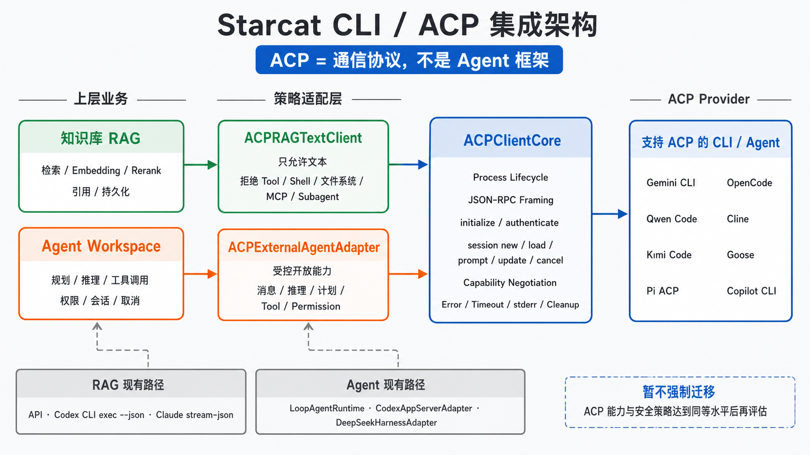

# 64 — ACP 协议接入评估与暂缓方案

> 日期：2026-08-23
>
> 状态：方案冻结，暂缓接入
>
> 范围：记录 ACP 的协议边界、候选架构、现有实现关系和重新评估门禁；本专题不代表已经立项或开始实现
>
> 关联：[`57-Agent工作台与统一能力层详细设计.md`](57-Agent工作台与统一能力层详细设计.md)、[`59-ExternalAgentRuntime多后端POC技术方案.md`](59-ExternalAgentRuntime多后端POC技术方案.md)、[`30-本地RAG设计.md`](30-本地RAG设计.md)、[`34-StarcatCLI与外部MCP桥接设计.md`](34-StarcatCLI与外部MCP桥接设计.md)

---

## 1. 当前决策

Starcat 当前不接入 ACP，也不把 ACP 加入 Agent 工作台 Runtime 路由。

原因不是 ACP 无法使用，而是 Agent 工作台和现有 External Agent Runtime 仍有产品化门禁未完成。此时再加入一套仍在演进的双向协议，会同时扩大 Runtime、权限、会话、事件映射和测试矩阵。先保留方案，等现有底座稳定后再决定是否实施。

| 事项 | 当前结论 |
|---|---|
| 新增 `ACPClientCore` | 不实施 |
| RAG 通过 ACP 调用 CLI Agent | 不实施 |
| Agent 工作台增加 ACP Runtime | 不实施 |
| 把现有 Codex / Claude / DeepSeek 路径迁移到 ACP | 不迁移 |
| 删除现有 Provider adapter | 不删除 |
| 承诺支持图中的 ACP Provider | 不承诺，实施前重新核验 |

暂缓不等于否决。本文保留的是重新评估时可直接使用的边界和门禁，不是当前开发任务。

## 2. ACP 的准确定位

ACP 全称为 Agent Client Protocol，用于 Client 与 Coding Agent 之间的双向通信。它基于 JSON-RPC，通常由 Client 启动 Agent 子进程，通过 stdin/stdout 交换初始化、认证、会话、消息、进度、工具调用、权限请求和取消事件。

ACP 是通信协议，不是 Agent 框架，也不是模型 Provider、CLI 本身或 MCP 的替代品。

| 概念 | 在 Starcat 中的含义 |
|---|---|
| ACP | Client 与 Agent 之间的通信契约 |
| ACP Client | Starcat 内负责启动进程、发送请求和接收事件的一侧 |
| ACP Agent | 实现 ACP server 接口的 CLI Agent 或桥接进程 |
| Agent Runtime | Starcat 负责运行 Agent、映射事件、审批和产物的执行层 |
| RAG | Starcat 自己负责检索、排序、引用和持久化的问答链路 |
| MCP | Agent 调用外部工具或 Starcat 能力的工具协议 |

ACP 官方架构允许 Client 把 MCP server 配置交给 Agent，也允许 Agent 向 Client 发起权限请求。这说明 ACP 不是只有一问一答的通用命令管道，而是面向交互式 Agent 的完整协议。

## 3. 当前实现与 ACP 的关系

### 3.1 知识库 RAG

RAG 当前有三条推理路径：

- OpenAI-compatible API。
- Codex CLI，由 `RAGCLIModelClient` 解析 `codex exec --json` 输出。
- Claude Code CLI，由 `RAGCLIModelClient` 解析 Claude 的流式 JSON 输出。

这三条路径由 RAG 自己控制检索、Embedding、Rerank、引用和持久化。CLI 只承担文本生成，不属于 ACP，也不进入 Agent 工作台 Runtime。

### 3.2 Agent 工作台

Agent 工作台当前保留三类执行后端：

- `LoopAgentRuntime`：Starcat 自己驱动 model、tool call 和 tool result 循环。
- `CodexAppServerAdapter`：通过 Codex App Server 原生协议接入 Direct Debug POC。
- `DeepSeekHarnessAdapter`：通过 DeepSeek Harness JSON-RPC 接入 Direct Debug POC。

现有 `ExternalAgentRuntimeHost` 已经承担进程、JSONL framing、取消、stderr 排空和清理，但 Provider 的请求方法、事件顺序和能力仍由各自 adapter 处理。它不是 ACP Client。

### 3.3 外部 Agent 使用 Starcat

`starcat-cli → MCP → Starcat` 是外部 Agent Host 调用 Starcat 能力的路径。它与“Starcat 主动启动一个 ACP Agent”方向相反，不能合并为同一个概念。

## 4. 候选目标架构



> 图 1：候选目标架构，不是当前实现。右侧 Provider 名称仅用于说明可替换 adapter 的形态，不构成支持清单；正式实施前必须以 ACP Registry、Provider 官方文档和真实握手结果重新核验。

候选方案允许 RAG 和 Agent Workspace 共用进程与协议基础设施，但不共用能力策略：

```text
Knowledge RAG
  → ACPRAGTextClient
      → ACPClientCore
          → ACP Agent

Agent Workspace
  → ACPExternalAgentAdapter
      → ACPClientCore
          → ACP Agent
```

共同部分只处理 ACP 协议事实：

- Process 生命周期。
- stdin/stdout JSON-RPC framing。
- `initialize`、认证和 capability negotiation。
- Session 新建、恢复、prompt、update、cancel 和 close。
- 错误、超时、stderr 排空与进程清理。
- 原始帧的有界、脱敏审计。

RAG 和 Agent 的行为边界必须由各自 adapter 决定，不能因为共用协议核心而混成同一种产品能力。

## 5. RAG 使用 ACP 的边界

RAG 可以在技术上调用 ACP Agent，但前提是把它当成受限文本后端，而不是开放完整 Coding Agent 能力。

候选 `ACPRAGTextClient` 只接受：

- 用户问题和 RAG 已检索出的上下文。
- 文本增量和最终文本。
- 可选的公开 usage、model 和 stop reason。

以下事件一旦出现，默认拒绝当前请求并回收 Session：

- Tool call 或 permission request。
- Shell、PTY 或 terminal 请求。
- 文件读取、文件修改或工作区路径请求。
- MCP server、Subagent 或浏览器自动化请求。
- 无法判断安全级别的扩展 method。

RAG 的检索、Embedding、Rerank、citation 和数据库写入继续由 Starcat 控制。ACP Agent 不直接读取 Starcat SQLite，也不获得知识库目录或用户仓库路径。

因此，ACP 可以成为 RAG 的候选传输方式，但它不是 RAG 框架。若一个 CLI 已有稳定、简单的文本模式，ACP 不一定比现有 `RAGCLIModelClient` 更合适。

## 6. Agent 工作台使用 ACP 的边界

候选 `ACPExternalAgentAdapter` 可以消费 ACP 原生 Agent 事件：

- Assistant message、reasoning summary 和 plan。
- Tool call 状态与结果。
- Permission request 与用户决定回写。
- Session new、resume、cancel、close。
- 可用命令、配置项和终态原因。

Adapter 仍需把事件映射为 Starcat 的 `AgentRunEvent`、`AgentTraceEvent`、Approval 和 Artifact 契约。ACP capability 只表示上游协议能力，不表示 Starcat 已经允许该能力；最终权限必须由 Agent definition allowlist、渠道门禁和宿主安全策略共同决定。

即使使用 ACP，Starcat 仍然需要 Agent Runtime。ACP 只替代部分 Provider 协议适配工作，不替代 Runtime Router、Workspace、审批、审计、持久化和安全控制。

## 7. 现有路径不迁移

| 现有组件 | 当前处理 | 未来重新评估条件 |
|---|---|---|
| `RAGCLIModelClient` / Codex CLI | 保留 | ACP 文本模式的稳定性和安全性明显优于 `exec --json` |
| `RAGCLIModelClient` / Claude CLI | 保留 | 官方或可审计 ACP bridge 达到同等功能和可靠性 |
| `LoopAgentRuntime` | 保留为内置基线 | 不因任何外部协议删除 |
| `CodexAppServerAdapter` | 保留 POC | ACP adapter 达到事件、取消、工具和安全能力对等 |
| `DeepSeekHarnessAdapter` | 保留 POC | 上游提供稳定 ACP 接口，且迁移成本低于继续维护现有协议 |
| `starcat-cli` / MCP | 保留 | 方向与 ACP Host 不同，不参与迁移 |

迁移只能按 Provider 单独评估，不能以“协议统一”为理由一次性替换。若 ACP adapter 无法覆盖原生协议的事件、审批、取消或安全能力，就继续保留原生 adapter。

## 8. 当前不接入的主要风险

### 8.1 两套未稳定边界叠加

Agent 工作台刚完成 Runtime 过程事件产品化，真实 Provider、长任务、停止和残留进程仍需人工验收。此时接入 ACP 会让问题来源同时包含 Workspace、Starcat event mapping、ACP 版本和 Provider 实现，难以定位责任边界。

### 8.2 协议仍在演进

ACP v2 当前仍是 draft，官方 SDK 明确提示可能在任意版本发生不兼容变化。即使只采用稳定入口，也需要固定 schema 版本、扩展字段策略和兼容测试，不能跟随 latest 自动升级。

### 8.3 Swift 侧维护成本

ACP 官方当前列出的主要 SDK 没有 Swift。Starcat 若直接实现 Client，需要自行维护 JSON-RPC 类型、schema 生成、未知事件兼容、并发请求关联和 conformance fixtures；这不是简单增加一个 Provider 枚举。

### 8.4 安全语义不等于产品授权

ACP 支持工具调用和权限请求，不代表 Client 已经完成 OS sandbox。Prompt、空工作目录和 permission UI 都不能单独阻止 Agent 使用自身的 Shell、文件或网络能力。

### 8.5 Provider 支持不一致

不同 Agent 对认证、Session 恢复、取消、Tool、MCP 和扩展 method 的实现可能不同。正式支持必须建立真实 Provider 矩阵，不能只根据“支持 ACP”的宣传描述判定兼容。

## 9. 重新评估门禁

只有以下条件全部满足，才重新讨论 ACP POC：

1. Agent 工作台现有三种 Runtime 的真实任务、取消、错误和残留进程验收完成。
2. Agent 工作台是否继续产品化已经明确，不再只是 Debug-only 试验入口。
3. ACP 采用的稳定协议版本、SDK 或 schema 生成方案可以固定。
4. 至少一个目标 Provider 完成真实 `initialize → session → prompt → update → cancel/close` 验证。
5. Tool、Shell、FS、MCP、Subagent 和 permission 的拒绝路径可以自动化测试。
6. RAG 文本模式与 Agent 模式的 capability policy 分开定义。
7. Direct 与 App Store 渠道边界完成安全、签名和分发审查。
8. dong4j 明确确认开始 ACP POC。

任一条件未满足时，保持本文“暂缓接入”状态。

## 10. 若恢复实施的顺序

重新启动时不直接修改 Agent Workspace，按以下顺序推进：

### Phase A：独立协议探针

- 在产品 UI 之外验证一个 ACP Agent。
- 固定协议版本和完整 fixture。
- 验证握手、认证、Session、取消、异常帧和进程回收。
- 不接 Starcat Tool，不读取用户数据。

### Phase B：单一入口试验

- 在 RAG text-only 与 Agent read-only 中只选择一个入口。
- 先写专用 adapter，不提前抽象同时服务两侧的公共框架。
- 证明第二个入口确实需要相同代码后，再提取 `ACPClientCore`。

### Phase C：能力与安全闭环

- 接入 capability negotiation 和严格 allowlist。
- 建立 permission request 的可达、拒绝和取消测试。
- 验证 Provider 自带工具的硬禁用或独立进程 sandbox。
- 保留原生 Provider adapter 作为对照，不静默回退。

### Phase D：产品化评估

- 决定是否进入 Agent Workspace 或 RAG 设置。
- 完成 Session 持久化、迁移、i18n、用量、隐私和渠道门禁。
- 真实 Provider 人工验收后，才讨论是否迁移某个现有 adapter。

## 11. 非目标

- 不在当前版本实现 ACP。
- 不把 ACP 定义为 Agent 框架。
- 不把 RAG 合并进 Agent Workspace。
- 不用 ACP 替代 MCP。
- 不让 ACP Agent 直接读写 Starcat 数据库。
- 不因为协议统一而删除现有 Codex、Claude 或 DeepSeek adapter。
- 不承诺图中列出的 Provider 已达到 Starcat 的支持标准。
- 不在未验证前增加 App Store 或正式版入口。

## 12. 参考资料

- [ACP 官方架构](https://agentclientprotocol.com/get-started/architecture)
- [ACP 协议概览](https://github.com/agentclientprotocol/agent-client-protocol/blob/main/docs/protocol/v2/overview.mdx)
- [ACP 官方 TypeScript SDK](https://github.com/agentclientprotocol/typescript-sdk)
- [ACP Registry](https://github.com/agentclientprotocol/registry)

## 13. 演进记录

| 日期 | 变更 |
|---|---|
| 2026-08-23 | 新增专题；冻结 ACP 候选架构，明确当前暂缓、现有路径不迁移和重新评估门禁 |
