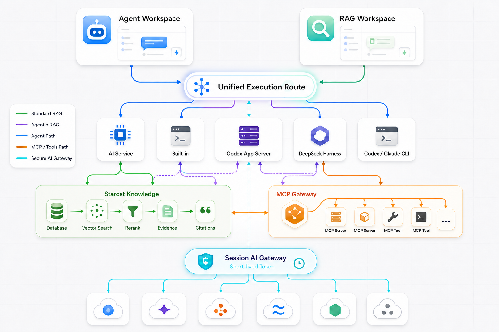

# 65 — Agent Runtime、RAG 与 AI 服务统一路由方案

> 日期：2026-08-25
>
> 状态：方案与任务拆解已获 dong4j 认可，等待明确“开干”授权；未开始代码实施
>
> 范围：Starcat 内置 Runtime、Codex App Server、DeepSeek Harness、知识库 RAG、MCP 与现有“AI 服务”的配置复用、执行路由和凭据安全
>
> 关联：`15-AI设置与调用链重构方案.md`、`57-Agent工作台与统一能力层详细设计.md`、`59-ExternalAgentRuntime多后端POC技术方案.md`、`63-AgentRuntime执行过程产品化专项.md`

---

## 1. 背景与问题定义

Starcat 在 Agent 功能之前已经完成多服务商 AI 配置。历史文档把这条产品路线称为 BYO / BYOK，当前产品设置页统一使用“AI 服务”：用户在一处配置 Provider Profile、Base URL、API Key、可用模型及任务默认模型。

Agent 工作台新增三种可切换 Runtime 后，没有在 Runtime 设置页重复增加模型配置。知识库 RAG 则已经独立支持内置 API、Codex CLI 和 Claude Code CLI 三种文本推理后端。当前实际结构是：

- “AI 服务”负责 Starcat 管理的服务商、凭据、模型目录和任务默认模型。
- “集成 → Agent Runtime”只负责 Codex App Server 与 DeepSeek Harness 的安装目录、配置文件和健康状态。
- Agent 工作台输入区根据当前 Runtime 展示 Provider、Model 与 Reasoning 选择。
- RAG 工作台设置独立选择内置 API、Codex CLI 或 Claude Code CLI；CLI 自己决定实际模型。

因此，本方案不合并两个设置页面，也不重新设计已经存在的“AI 服务”。需要解决的是 Agent 与 RAG 的执行路由存在多个数据来源、多个默认值和不同凭据边界：用户切换 Runtime 时仍可能重复选择或额外维护外部配置，RAG 也无法直接复用已经接入 Agent 工作台的 Codex / DeepSeek Harness。

### 1.1 当前用户体验问题

1. 内置 Runtime 与 DeepSeek Harness 使用同一批“AI 服务”，但分别保存当前模型选择。
2. 用户从内置 Runtime 切换到 DeepSeek Harness 时，即使原 Provider / Model 可用，也可能需要重新确认选择。
3. Codex Provider 来自 `CODEX_HOME/config.toml`，模型来自 App Server 目录，与 Starcat“AI 服务”不是同一数据源。
4. 当前界面只展示 Provider / Model 名称，未明确告诉用户配置由 Starcat 还是 Runtime 管理。
5. “框架支持多 Provider”与“Starcat 已安全接通这些 Provider”容易被混为一谈。
6. RAG 的 `RAGInferenceBackend` 与 Agent 的 `AgentRuntimeBackend` 是两套枚举、两套选择和两套进程装配逻辑。
7. Codex CLI / Claude Code CLI 当前只承担 RAG 文本推理，无法展示 Harness 原生执行事件，也不能主动多轮检索。

### 1.2 本方案回答的问题

- “AI 服务”与 Agent Runtime 是否需要合并？
- 三种 Runtime 如何减少重复配置和重复选择？
- Codex 如何复用 Starcat 已保存的 AI 服务，同时不泄露 API Key？
- 后续增加更多模型服务商时，如何避免为每个 Runtime 分别写一套 UI 和分支判断？
- RAG 如何同时支持直接 AI 服务、现有 CLI 和 Codex / DeepSeek Harness？
- Harness 在 RAG 中究竟只负责生成，还是可以自主决定检索步骤？
- RAG 如何复用现有 MCP 配置，同时保留权限确认、证据引用和过程审计？

---

## 2. 当前实现事实

本文以 2026-08-25 `dev` 工作区代码为准，历史 POC 文档不覆盖当前实现事实。

### 2.1 AI 服务

`AISettingsTab` 管理：

- `AIProviderProfile`
- Provider 类型、显示名称与 Base URL
- 按 Profile ID 保存的 API Key
- Provider 返回的模型目录及启用状态
- Chat、摘要、标签、Embedding、翻译等任务的默认 Provider / Model
- 模型参数、Prompt 和连通性验证

API Key 不写入 UserDefaults，也不进入日志；非敏感 Profile 与任务配置由 `AppSettings` 持久化。

### 2.2 Agent Runtime 设置

`AgentRuntimeSettingsView` 位于“集成”设置页，仅管理外部 Runtime 安装：

- Codex App Server：Runtime 目录与必要组件检测。
- DeepSeek Harness：carrier、Cordis 配置与就绪检测。

这里没有 Provider / Model / Reasoning 配置。本方案保持该职责不变。

### 2.3 工作台的三条模型路由

| Runtime | Provider 来源 | Model 来源 | 凭据来源 | 当前选择持久化 |
|---|---|---|---|---|
| Built-in Loop | 已验证 `AIProviderProfile` | Profile 中启用的非 Embedding 模型 | Starcat Keychain | `AgentWorkspaceViewModel.selectedModelID` / Chat 默认 |
| DeepSeek Harness | 已验证 `AIProviderProfile` | Profile 中启用的 Chat / Unknown 模型 | Starcat Keychain，经最小环境注入 | DeepSeek 专属 UserDefaults |
| Codex App Server | `CODEX_HOME/config.toml` 的 `model_providers` | App Server 模型目录 | Codex 登录态或外部配置 | Codex 专属 UserDefaults |

### 2.4 当前 Codex 多 Provider 限制

Codex adapter 可以读取多个 `model_providers`，但 Starcat 当前不会把“AI 服务”中的 API Key 交给 Codex 子进程。声明 `env_key` 的 Codex Provider 在工作台中不可选。

这个限制是当前安全边界，不是 Codex 上游框架的理论能力边界。只有完成安全凭据桥接后，才能把“Codex 支持自定义 Provider”表述为 Starcat 已支持的功能。

### 2.5 当前 RAG 推理链路

`RAGInferenceBackend` 当前包含：

| 后端 | 模型与凭据来源 | 当前职责 | 工具边界 |
|---|---|---|---|
| `api` | Starcat“AI 服务” | Planner、回答、压缩、标题 | 通过 `AITextGenerating` 直接调用模型，不执行 Agent 工具 |
| `codexCLI` | Codex CLI 本机登录态 | 同上，CLI 自己决定实际模型 | `codex exec` text-only，关闭 Shell、Apps、Browser、Computer Use、Multi-agent 等工具 |
| `claudeCLI` | Claude Code CLI 本机登录态 | 同上，CLI 自己决定实际模型 | `--safe-mode`、空工具集合、无 MCP、无持久 Session |

无论选择哪一种推理后端，以下能力仍由 Starcat 控制：

- Query Planning 的阶段编排。
- 候选仓库解析。
- Keyword / Vector Retrieval。
- Embedding 与 Rerank。
- 远程上下文确认。
- Evidence Prompt、引用校验、会话历史和持久化。

CLI 当前实现的是“把完整 RAG 文本请求交给另一个本机模型入口”，不是 Harness 驱动的 Agentic RAG。

### 2.6 RAG 与 Agent Runtime 的协议边界

RAG 当前消费 `AITextGenerating`，输入为 `AIChatRequest`，输出为文本、Reasoning、Usage 和完成事件。Agent Runtime 则拥有进程生命周期、工具协议、Runtime 原生事件、取消和终态语义。

不能让 `ExternalAgentRuntime` 直接伪装成普通 `AIClientProtocol`。正确做法是在更高一层统一“执行路由”，同时为 RAG 定义专用执行器，将 Harness 的原生事件受控投影成 RAG 事件。

### 2.7 当前 MCP 能力边界

当前代码已经具备：

- `StarcatMCPToolRegistry`：Starcat 对外提供的 MCP Tool Catalog 与执行入口。
- `AgentToolMCPRegistry`：把 Agent Tool 投影到临时 MCP Runtime。
- Codex App Server adapter：可以把本次运行的 Starcat 临时 MCP Bridge 与 Codex 自身 `mcp_servers` 合并。
- MCP 配对、审计日志与写操作确认等基础能力。

当前尚未具备：

- 供 Starcat 主动连接任意第三方 MCP Server 的统一 Client / Profile Registry。
- RAG 专属 MCP 数据源、Evidence Adapter 和引用映射。
- 跨 Built-in、Codex、DeepSeek 的统一 MCP 权限与事件模型。

因此，“复用现有 MCP”首先指复用 Starcat Tool Registry、临时 Bridge、审计和确认能力；第三方 MCP 还必须区分 Runtime 自管配置与未来 Starcat 管理的外部 Server，不能把尚未存在的 Client Registry 写成当前事实。

---

## 3. 设计决策

### 3.1 设置页面不合并

保持现有信息架构：

```text
设置
├── AI 服务
│   ├── Provider Profile
│   ├── API Key / Base URL
│   ├── 模型目录
│   └── 业务任务默认模型
└── 集成
    └── Agent Runtime
        ├── Codex 安装与状态
        └── DeepSeek Harness 安装与状态
```

原因：AI 服务回答“模型请求发到哪里”，Runtime 回答“Agent 如何规划、调用工具和组织执行过程”。二者生命周期、权限和故障处理不同，不应合成一个配置对象。

Agent 与 RAG 的执行选择留在各自工作台，而不是再创建第三套服务商设置：

```text
Agent 工作台 Composer
└── Runtime / Provider 来源 / Model / Reasoning

RAG 工作台设置
└── RAG 模式 / 执行后端 / Provider 来源 / Model / Reasoning
```

两处复用同一 `AIExecutionRouteCatalog` 和同一 AI 服务配置，但各自保存 Workload 所需的执行偏好。

### 3.2 统一模型路由，不统一凭据所有权

三种 Runtime 在工作台投影成统一的模型路由，但保留两类配置所有权：

1. **Starcat 管理**：Provider Profile 和 API Key 由“AI 服务”与 Keychain 管理。
2. **Runtime 管理**：Codex 登录态、`config.toml` 等由 Runtime 自己管理，Starcat 只读取允许展示的非敏感元数据。

统一的是用户选择语义和兼容性判断，不是把所有外部凭据复制进 Starcat，也不是让 Starcat 改写用户的永久 Runtime 配置。

### 3.3 默认继承优先，显式覆盖其次

内置 Runtime 与 DeepSeek Harness 都应默认跟随“AI 服务 → Chat”任务配置：

- 用户没有为 Runtime 显式选择时，读取当前 Chat Provider / Model。
- 用户切换 Runtime 时，优先沿用当前兼容的 Provider / Model。
- 只有用户主动改变选择，才保存 Runtime 专属覆盖值。
- 工作台提供“跟随 AI 服务默认”选项，用于清除覆盖值。

Codex 默认跟随 Codex 当前激活 Provider 与 App Server 默认模型，不假装继承 Starcat Chat 配置。

### 3.4 RAG 明确区分两种运行模式

RAG 不能只增加一个“使用 Harness”的开关。标准 RAG 与 Agentic RAG 的控制权、工具权限和引用生成方式不同，必须是两个显式模式：

1. **标准 RAG**：Starcat 负责规划、检索、Evidence、引用和持久化；选定执行后端只完成各阶段的文本推理。
2. **Agentic RAG**：Built-in 或外部 Harness Runtime 负责多轮规划，并通过 Starcat 提供的知识工具与已授权 MCP Tool 决定何时继续检索、何时生成答案。

标准 RAG 是现有能力的自然扩展，也是第一阶段默认值。Agentic RAG 是独立高级能力，不能通过放开当前 CLI 工具限制来冒充完成。

### 3.5 统一执行选择，不强行统一底层协议

Agent 工作台和 RAG 工作台共享“选择哪个执行引擎、使用哪个模型来源”的上层语义，但底层继续使用适合各自生命周期的协议：

- 直接 AI 服务使用 `AITextGenerating`。
- Codex / Claude CLI 使用一次性文本进程适配器。
- Codex App Server / DeepSeek Harness 使用 Runtime 原生会话、事件和取消协议。

因此，不要求 `ExternalAgentRuntime` 伪装成普通 AI Client，也不把 CLI 文本后端包装成 Agent Runtime。

### 3.6 总体架构图



图中绿色表示标准 RAG 数据流，紫色表示 Agentic RAG 循环，蓝色表示 Agent 执行路径，橙色表示 MCP / Tool 调用，青色表示 Session AI Gateway 的安全模型转发。底部服务商节点使用中性图标，强调架构不绑定具体模型厂商。

---

## 4. 目标模型

### 4.1 共享执行路由

建议把当前仅面向 Agent 的选择抽象升级为可服务 Agent 与 RAG 的执行路由：

```swift
enum AIWorkload: Equatable, Sendable {
    case agent
    case rag(mode: RAGExecutionMode)
}

enum AIExecutionEngine: Equatable, Sendable {
    case directAPI
    case cli(RAGCLIProvider)
    case agentRuntime(AgentRuntimeBackend)
}

struct AIExecutionRoute: Equatable, Sendable {
    let workload: AIWorkload
    let engine: AIExecutionEngine
    let modelRoute: AIModelRoute?
}

struct AIModelRoute: Equatable, Sendable {
    let provider: AIProviderReference
    let model: AIModelReference
    let reasoningEffort: String?
    let selectionMode: AIRouteSelectionMode
}
```

`AIExecutionRoute` 回答“这次任务由谁执行”，`AIModelRoute` 回答“模型从哪里来”。两者只描述选择结果，不保存 API Key，不直接创建网络 Client 或启动进程。

`modelRoute` 允许为空，因为现有 Codex CLI / Claude Code CLI 的具体模型仍由 CLI 自己决定；UI 必须如实显示“由 Runtime 决定”，不能伪造一个 Starcat 模型选择。

### 4.2 Provider 引用

```swift
enum AIProviderReference: Equatable, Sendable {
    case starcatProfile(id: String)
    case runtimeManaged(runtime: AgentRuntimeBackend, id: String)
}
```

- `starcatProfile` 指向现有 `AIProviderProfile.id`。
- `runtimeManaged` 指向 Codex 等 Runtime 自己维护的 Provider。
- UI 根据引用显示“AI 服务”或“Codex 配置”来源，不从显示名称推断所有权。

### 4.3 选择模式

```swift
enum AIRouteSelectionMode: Equatable, Sendable {
    case inherited
    case runtimeOverride
    case runtimeDefault
}
```

- `inherited`：跟随“AI 服务 → Chat”。
- `runtimeOverride`：用户为当前 Runtime 明确选择了 Provider / Model。
- `runtimeDefault`：由外部 Runtime 决定，例如 Codex 服务端默认模型。

### 4.4 执行目录适配

每个执行引擎通过目录适配器生成同一种候选项：

```text
AIExecutionRouteCatalog
├── DirectAPIRouteCatalog
├── CLIInferenceRouteCatalog
├── BuiltinRuntimeRouteCatalog
├── DeepSeekRuntimeRouteCatalog
└── CodexRuntimeRouteCatalog
```

目录适配器只负责：

- 枚举 Provider / Model。
- 标注配置来源。
- 标注 Runtime 当前实际支持的能力。
- 解析默认值和历史覆盖值。
- 生成不可用原因。

它不读取不属于自己的 API Key，也不直接启动 Runtime。

### 4.5 RAG 运行模式

```swift
enum RAGExecutionMode: String, Codable, Sendable {
    case standard
    case agentic
}
```

- `standard`：保持现有确定性检索管线，只替换 Planner / Answer / Compression / Title 的文本执行器。
- `agentic`：由 Harness 进行多轮决策，只能调用 Starcat 暴露的只读 RAG 工具。

模式与执行引擎分别保存，避免将“Codex App Server”误等同于“Agentic RAG”。Built-in Loop、Codex App Server 和 DeepSeek Harness 只有通过工具、MCP、引用和取消门禁后，才开放 Agentic RAG。

---

## 5. 能力与兼容性模型

增加服务商不能只按名称建立白名单。兼容性必须由三层能力共同决定：

```text
Runtime 要求 ∩ Provider 协议能力 ∩ Model 能力 = 可执行路由
```

### 5.1 Provider 能力

第一阶段至少表达：

- 协议族：OpenAI-compatible、Runtime-managed。
- 是否允许空 API Key。
- 是否支持 Chat、Streaming、Tool Calling、Structured Output。
- 是否可被外部 Runtime 安全访问。
- 模型目录是 Starcat 发现、用户自定义还是 Runtime 提供。

### 5.2 Model 能力

第一阶段至少表达：

- Chat / Embedding / Unknown。
- Tool Calling。
- Reasoning 与可用强度。
- Context Window。
- Max Completion Tokens。

现有模型目录无法可靠提供全部字段时，必须区分：

- Provider 明确返回。
- Starcat 内置规则推断。
- 用户显式覆盖。
- 未知。

未知不能伪装成支持；UI 应展示不可用原因或保留 Runtime 默认。

### 5.3 Runtime 要求

Runtime adapter 声明 Starcat 当前已经接通并验证的能力，不声明上游理论能力。例如：

- Built-in Loop 需要 Streaming 与 Tool Calling。
- DeepSeek Harness 需要 carrier 可表达对应模型、Token 和 Reasoning 配置。
- Codex App Server 需要 Provider 能被 Codex 配置解析，并满足当前凭据安全边界。
- 标准 RAG 的 Harness 执行器需要可隔离的文本生成、Reasoning、Usage、取消和确定性终态，不要求开放工具。
- Agentic RAG 额外要求工具权限策略、MCP Gateway、稳定 Tool Call ID、结构化 Tool Result、多轮上下文、事件顺序和取消传播。

### 5.4 RAG 兼容矩阵

| 执行引擎 | 标准 RAG | Agentic RAG | 模型来源 | 当前状态 |
|---|---|---|---|---|
| Starcat AI 服务 | 支持 | 不适用 | Starcat Profile / Model | 已实现 |
| Built-in Loop | 与直接 AI 服务复用 | 规划支持 | Starcat Profile / Model | Agent 已实现，RAG 待接入 |
| Codex CLI | 支持 | 不支持 | CLI 自己决定 | 已实现，保持兼容 |
| Claude Code CLI | 支持 | 不支持 | CLI 自己决定 | 已实现，保持兼容 |
| Codex App Server | 规划支持 | 规划支持 | Codex 配置或 Starcat AI 服务 | 待实现与验收 |
| DeepSeek Harness | 规划支持 | 规划支持 | Starcat AI 服务 | 待实现与验收 |

表中的“规划支持”不是已交付能力。标准 RAG 必须先通过文本阶段、Reasoning、Usage、取消和引用一致性测试；Agentic RAG 还必须通过工具权限、MCP、证据引用与用户授权门禁。

---

## 6. 工作台交互方案

### 6.1 保留 Runtime 选择

Runtime 会改变执行事件、工具协议、取消能力、Sandbox 和错误语义，不能隐藏成普通模型参数。工作台继续显式展示 Runtime。

### 6.2 Provider / Model 采用来源明确的统一控件

Runtime 后面的控件统一展示为：

```text
[Runtime] [配置来源 / Provider] [Model] [Reasoning]
```

示例：

```text
Built-in         AI 服务 · 硅基流动    deepseek-v4-pro    —
DeepSeek Harness AI 服务 · OpenRouter  deepseek-v4-pro    High
Codex App Server Codex 配置 · OpenAI   gpt-5.3-codex      High
```

“AI 服务”和“Codex 配置”是来源提示，不是新增设置入口。

### 6.3 默认与覆盖

Built-in / DeepSeek Provider 菜单第一项为：

```text
✓ 跟随 AI 服务默认
──────────────
  硅基流动
  OpenRouter
  Ollama
```

选择“跟随 AI 服务默认”后不再保存 Provider / Model 副本。Chat 默认变化时，下一次未运行任务自动使用新值。

### 6.4 切换 Runtime

切换规则：

1. 当前运行中禁止切换。
2. 新 Runtime 支持当前 Starcat Profile / Model 时，沿用当前选择。
3. 不支持时，回到该 Runtime 的继承值或 Runtime 默认。
4. 没有可用路由时，禁用发送并展示具体原因及跳转入口。
5. 不因为外部 Runtime 不可用而静默切回内置 Runtime。

### 6.5 错误文案

禁止只显示 `Runtime unavailable`。至少区分：

- Runtime 未安装。
- Runtime 组件不完整。
- 没有已验证的 AI 服务。
- 当前模型不支持 Tool Calling。
- Codex Provider 需要凭据桥接，当前不可选。
- Runtime 模型目录加载失败。

---

## 7. RAG 执行方案

### 7.1 统一入口，分离三类执行器

RAG 不直接依赖 Agent 工作台 ViewModel，也不把 Runtime 事件硬塞进 `AIChatResponse`。在 `KnowledgeRAGService` 与具体后端之间增加 RAG 专用高层协议：

```swift
protocol RAGGenerationExecuting: Sendable {
    func execute(
        phase: RAGGenerationPhase,
        request: RAGGenerationRequest
    ) -> AsyncThrowingStream<RAGExecutionEvent, Error>
}
```

建议提供三类 adapter：

```text
RAGGenerationExecuting
├── DirectAIServiceRAGExecutor
├── CLITextRAGExecutor
└── HarnessRAGExecutor
```

- `DirectAIServiceRAGExecutor` 复用现有 `AITextGenerating`。
- `CLITextRAGExecutor` 复用 Codex CLI / Claude Code CLI 的 text-only 行为。
- `HarnessRAGExecutor` 使用 Codex App Server / DeepSeek Harness 原生协议，并将 Runtime 事件映射为 RAG 可消费的事件。

RAG 服务仍只依赖统一执行协议，不需要知道 App Server JSON-RPC、DeepSeek carrier 或 CLI JSONL 的细节。

### 7.2 标准 RAG：Harness 作为受限生成执行器

标准 RAG 的数据流为：

```text
用户问题
   │
   ▼
Starcat Query Planner
   │
   ▼
Starcat Keyword / Vector Retrieval → Rerank → Evidence
   │                         ▲
   │                         └── 已授权 MCP 证据源（可选）
   │
   ▼
Codex App Server / DeepSeek Harness（生成阶段不直接发起 Tool Call）
   │
   ▼
Starcat 引用校验 → 会话持久化 → UI
```

关键约束：

1. Planner、Answer、Compression、Title 四个阶段分别建立隔离的 Runtime Turn，避免外部会话把前一阶段的隐藏状态带入下一阶段。
2. 每个生成阶段只允许文本输入输出；Codex / DeepSeek 在该阶段不直接调用工具。MCP 如被启用，由 Starcat 在检索阶段调用并归一化为 Evidence。
3. 检索、Embedding、Rerank、Evidence ID、引用校验和数据库持久化继续由 Starcat 控制。
4. Harness 的 Reasoning 摘要、文本增量、Usage、Warning、Error、取消和完成事件映射到 `RAGExecutionEvent`，供中间过程与右侧检查器展示。
5. Harness 没有提供某类事件时显示“Runtime 未提供”，不得生成固定步骤或伪造思考内容。

这个模式满足“RAG 可以由 DeepSeek / Codex Runtime 来跑模型阶段”，同时保持现有检索结果和引用规则不变，风险最低，应作为第一批交付。

### 7.3 Agentic RAG：Runtime 自主多轮检索与 MCP 调用

Agentic RAG 的数据流为：

```text
用户问题
   │
   ▼
Built-in Loop / Codex App Server / DeepSeek Harness
   │  多轮只读 Tool Call
   ▼
Starcat RAG Tool Gateway
   ├── knowledge_search
   ├── knowledge_get_evidence
   ├── knowledge_get_repo_context（按能力开放）
   └── MCP Tool Gateway
       └── 用户已启用的 Server / Tool Allowlist
   │
   ▼
Evidence ID / Citation Handle
   │
   ▼
Harness 最终回答 → Starcat 引用校验 → 持久化
```

这里 Runtime 决定是否改写 Query、补充检索、调用 MCP 和结束推理，但所有调用仍经过 Starcat Gateway。Runtime 不直接访问 SQLite、Meilisearch、Qdrant、GitHub Token、MCP 凭据或用户文件。

首版工具白名单只允许读取：

- `knowledge_search`：返回摘要化证据与稳定 Evidence ID。
- `knowledge_get_evidence`：按 ID 获取受预算限制的证据正文。
- `knowledge_get_repo_context`：仅在当前问题允许仓库上下文时开放。
- 用户为 RAG 启用的 MCP Tool：通过统一 Gateway 暴露，保留 Server、Tool、Call ID 和来源信息。

以下能力默认禁止：

- 未经用户确认写标签、笔记、状态或仓库数据。
- 未经授权的 Shell、文件系统和浏览器能力。
- 绕过 Starcat Gateway 直接加载 Runtime 自己的任意 MCP 配置。
- 绕过 RAG Tool Gateway 直连本地或外部检索后端。
- 使用没有 Evidence ID 的外部内容生成可验证引用。

最终回答必须引用本次 Run 真实返回的 Evidence ID。未知引用、跨 Run 引用或未使用证据均按失败处理，不能只显示 Warning 后继续保存为成功答案。

### 7.4 MCP 接入模型

RAG 支持 MCP，不把“禁用 MCP”作为产品架构限制。为避免混淆配置所有权，MCP 来源显式分成三类：

```swift
enum RAGMCPSourceReference: Equatable, Sendable {
    case starcatTool(id: String)
    case runtimeManaged(runtime: AgentRuntimeBackend, serverID: String, toolName: String)
    case starcatManaged(profileID: String, toolName: String)
}
```

- `starcatTool`：现有 Starcat MCP / Agent Tool，由 Starcat 执行和审计。
- `runtimeManaged`：Codex、Claude 或 DeepSeek 自己配置的 MCP Server，凭据仍由 Runtime 管理。
- `starcatManaged`：后续新增的通用外部 MCP Client Profile，由 Starcat 管理连接、凭据和权限。

MCP 来源与模型执行后端在产品选择上解耦，但实际可用性由来源决定。例如 Built-in 无法直接复用 Codex 私有的 `mcp_servers`；如果希望同一个第三方 MCP 同时用于多个 Runtime，需要配置为 `starcatManaged`。

#### 标准 RAG：MCP 作为证据源

Starcat 根据用户启用的 `starcatTool` 或 `starcatManaged` 数据源调用指定 MCP Tool，将结果转换成统一 Evidence：

```text
MCP Tool Result
   │
   ▼
RAGMCPEvidenceAdapter
   ├── content
   ├── sourceURI
   ├── serverID / toolName / callID
   ├── title / metadata
   └── trust / freshness / truncation
   │
   ▼
Rerank → Evidence ID → Citation
```

模型不直接控制工具循环，但 RAG 可以检索 GitHub 之外的 MCP 数据源。MCP 结果只有完成来源记录、大小限制、文本归一化和引用映射后，才能进入 Prompt。`runtimeManaged` 来源默认不进入标准 RAG，因为 Starcat 无法稳定地主动调用另一个 Runtime 的私有 Tool；只有 Runtime 提供可审计的单次 Tool Invocation 协议时才开放。

#### Agentic RAG：Runtime 动态选择 MCP Tool

Runtime 可以根据问题动态调用用户允许的 MCP Tool。Starcat 负责：

- 复用现有 Starcat MCP Tool Registry，并为第三方 Server 新增独立的 MCP Client Profile；不重复保存 Runtime 自管 MCP 配置。
- 按本次 RAG Run 生成 Tool Allowlist，不把全部工具默认开放。
- 对 `starcatTool` / `starcatManaged` 代理调用并注入凭据，Runtime 只看到 Tool Schema 和脱敏结果。
- 对 `runtimeManaged` 使用显式“信任 Runtime 配置”模式：Starcat 不读取其凭据，只根据 Runtime 返回的原生事件做过程展示和结果审计；无法观测事件时不可用于需要严格引用的回答。
- 对调用次数、并发、超时、输入输出大小和总 Token 设置预算。
- 将 Tool Call / Result / Error / Retry 映射到 RAG 过程事件。
- 把可作为证据的 Tool Result 转成 Evidence ID；动作型 Tool Result 只进入过程日志，不自动成为引用。

MCP 权限不是“永远只读”，而是按策略控制：

```swift
enum RAGMCPPermissionPolicy: Equatable, Sendable {
    case disabled
    case readOnlyAllowed
    case askBeforeSideEffect
    case customAllowlist
}
```

- 默认 `readOnlyAllowed`，适合知识检索。
- MCP `readOnlyHint` 只作为提示，不作为唯一安全依据；Server / Tool 无法可靠判断副作用时按有副作用处理。
- 有副作用的 Tool 可以支持，但必须采用 `askBeforeSideEffect` 或用户显式 Allowlist，并在调用前展示确认，不允许模型自行越权。
- App Store / Direct 的可用性继续服从现有 MCP 能力门禁，不因 RAG 绕过渠道限制。

因此，方案限制的是“未授权、不可审计的任意 MCP 直连”，而不是限制 RAG 使用 MCP。

### 7.5 Embedding 与 Rerank 不交给 Harness 配置

无论标准还是 Agentic RAG：

- Embedding 继续使用“AI 服务”中配置的 Embedding 模型或现有本地 / 降级策略。
- Rerank 继续由 Starcat RAG 管线控制。
- Codex / DeepSeek 的 Provider / Model 只决定生成执行，不自动成为 Embedding Provider。

这样用户可以组合：本地 Embedding + DeepSeek Harness 生成，或 Starcat 云端 Embedding + Codex App Server 生成，而不需要在 Runtime 安装设置里重复配置索引能力。

### 7.6 RAG 工作台交互

RAG 设置建议拆成两个连续选择：

```text
RAG 模式      [标准 RAG ▼]
执行后端      [AI 服务 / Codex CLI / Claude Code CLI / Codex App Server / DeepSeek Harness ▼]
模型来源      [AI 服务默认 / Runtime 配置 ▼]   // 后端支持时显示
Provider      [OpenRouter ▼]                   // Starcat 管理时显示
Model         [deepseek-v4-pro ▼]              // 可由 Starcat 选择时显示
Reasoning     [Default ▼]                      // 后端支持时显示
Embedding     [保持现有 RAG 配置]
MCP 工具      [继承已启用工具 / 自定义 / 关闭 ▼]
```

交互规则：

1. 默认仍为“标准 RAG + AI 服务”，升级不改变现有用户行为。
2. Codex CLI / Claude Code CLI 保留为兼容入口，明确标注“文本推理，由 CLI 决定模型”。
3. 选择 Codex App Server / DeepSeek Harness 后，复用 Agent Runtime 的安装与健康状态，不在 RAG 设置里重复选择目录。
4. Agentic RAG 只展示已通过能力检测和安全门禁的 Built-in / Harness Runtime；不可用时展示具体缺失能力。
5. 切换执行后端不改变 Embedding、检索范围、过滤条件和历史会话。
6. MCP 复用现有 Server / Tool 配置；RAG 只保存启用范围和权限策略，不重复保存地址、Token 或环境变量。
7. 标准 RAG 可选择 MCP 证据源；Agentic RAG 还可允许 Runtime 动态选择 Tool。

### 7.7 Runtime 与 MCP 事件展示

RAG 中间过程不压缩成固定三步，也不把所有 JSON 原样堆在页面。事件分为两层：

- **产品层事件**：规划、检索、重排、证据、模型生成、引用校验、完成。
- **Runtime 原生事件**：Reasoning 摘要、Tool Call、Tool Result、Warning、Retry、Usage、Error。
- **MCP 来源事件**：Server、Tool、权限决策、参数摘要、结果摘要、Evidence ID、耗时和错误。

产品层用于快速理解执行进度；展开后显示关联的 Runtime 原生事件和结构化字段。原始载荷只放在检查器的“查看原始数据”，并做大小限制与敏感字段脱敏。

---

## 8. Codex 与 Starcat AI 服务的安全桥接

### 8.1 不采用直接环境注入

不把 Starcat Keychain 中的第三方 API Key 直接写入 Codex 子进程环境。Codex 可运行命令或派生子进程，环境变量可能被模型诱导读取。

也不自动修改用户永久的 `~/.codex/config.toml`，避免污染 Codex CLI 的独立使用环境。

### 8.2 推荐方案：Session 级本地 AI Gateway

Starcat 为每次外部 Runtime 运行创建临时本地 Gateway：

```text
Codex App Server / DeepSeek Harness
              │
              │ OpenAI-compatible request
              ▼
Starcat Session AI Gateway
              │
              │ 从 Keychain 读取当前 Route 的一个凭据
              ▼
用户配置的 AI 服务
```

Gateway 约束：

- 只监听 loopback 随机端口。
- 每次 Run 使用随机短期 Token。
- Token 只允许访问一个 Provider Profile 和一个模型集合。
- Run 结束立即停止监听并清理临时配置。
- 不记录 Authorization、完整 Prompt、响应正文或上游 API Key。
- 限制请求体、响应体、并发数、重试次数和总运行时长。
- 上游 Base URL 只能来自已验证 `AIProviderProfile`，禁止 Runtime 任意指定转发地址。
- Gateway 只代理模型协议，不暴露 Starcat 数据库、文件系统或业务工具。

外部 Runtime 只获得 Gateway 的临时地址和短期 Token，无法获得真实上游 API Key。同一机制同时服务 Agent 工作台和 RAG Harness 执行，但 Token 按 Run、Workload、Provider 和 Model 分别隔离，不能跨工作台复用。

### 8.3 Codex 临时配置覆盖

使用 Starcat AI 服务时，为本次 Codex App Server 进程生成临时 Provider 配置：

- `base_url` 指向 Session Gateway。
- `env_key` 只引用 Session Gateway 短期 Token。
- Provider ID 使用本次运行的临时命名空间。
- 配置位于本次 Run 临时目录，不修改 `CODEX_HOME/config.toml`。

是否能通过 Codex 当前版本的命令行覆盖或独立 `CODEX_HOME` 安全加载，必须在实施前用当前安装版本 schema 和真实进程验证；验证失败时不得降级为永久改写用户配置。

### 8.4 DeepSeek 演进

DeepSeek Harness 当前只注入所选 Profile 的最小凭据环境。第一阶段保留现状，先完成统一路由和默认继承。

Session Gateway 验证稳定后，DeepSeek 也切换到相同桥接方式，最终取消真实上游 API Key 的子进程环境注入。

---

## 9. 支持更多服务商

### 9.1 第一阶段范围

优先复用现有 OpenAI-compatible Provider Profile，不为每个品牌增加 Runtime 特例。新增服务商通常只需要：

1. Provider 模板与默认 Base URL。
2. API Key 与空 Key 规则。
3. 模型目录解析。
4. 能力推断及用户覆盖。
5. 连通性验证。

Built-in、直接 API RAG 与 DeepSeek 通过统一 Route Catalog 自动获得新增服务商；Codex 在 Session Gateway 完成后获得同一能力。服务商适配完成不代表所有 Workload 自动可用，Agent Tool Calling、标准 RAG 文本生成和 Agentic RAG 工具循环必须分别验收。

### 9.2 非 OpenAI-compatible Provider

Anthropic、Gemini 等原生协议不应通过名称判断硬塞进 OpenAI-compatible Client。后续增加独立 `AIProviderAdapter`：

```text
AIProviderAdapter
├── OpenAICompatibleAdapter
├── AnthropicAdapter
└── GeminiAdapter
```

Session Gateway 对外仍可提供 Runtime 能理解的协议，内部由 Provider Adapter 完成请求与响应映射。只有 Tool Calling、Streaming、Reasoning、Usage 和错误语义完成真实验证后，才标记对应 Runtime 可用。

---

## 10. 配置迁移

### 10.1 不迁移的数据

- 现有 `AIProviderProfile` 保持原 ID。
- 现有 Keychain API Key 不移动、不复制。
- Codex 登录态与永久 `config.toml` 不迁移。
- Agent Run 历史与 Trace 不因模型路由重构改写。
- 现有 RAG 会话、Evidence、引用和检索索引不迁移。

### 10.2 需要迁移的偏好

当前 Codex / DeepSeek 各自的 Provider、Model、Reasoning UserDefaults 映射到新 Route Override：

- 找到仍存在且兼容的候选项：保留为 `runtimeOverride`。
- 候选项已经删除或不可用：清除覆盖，回到 `inherited` 或 `runtimeDefault`。
- 迁移只执行一次；新代码只写新结构，不长期双写两套选择键。

现有 `ragInferenceBackend` 映射为：

- `api` → `standard + directAPI`。
- `codexCLI` → `standard + cli(.codex)`。
- `claudeCLI` → `standard + cli(.claude)`。

升级后默认行为与现有选择完全一致。Harness 和 Agentic RAG 均由用户显式选择，不自动迁移开启。

本方案原则上只涉及设置偏好迁移，不需要数据库 Schema 迁移。若实施审计发现执行 Route 或 Agentic RAG Tool Trace 必须进入已发布表，再单独设计追加 migration，禁止回写已发布迁移。

---

## 11. 分阶段实施

### 阶段 A：共享执行路由模型

- 增加 `AIExecutionRoute`、`AIModelRoute`、Provider 引用和选择模式。
- 为直接 API、CLI 和三种 Runtime 建立统一 Route Catalog。
- 保持现有 UI 和 Runtime 行为，先以测试证明解析结果一致。
- 增加 Agent 旧 UserDefaults 与 `ragInferenceBackend` 的一次性映射。

验收：相同现有配置在重构前后解析到同一 Runtime、RAG Backend、Provider、Model 和 Reasoning，既有用户行为不变。

### 阶段 B：工作台默认继承与来源展示

- Built-in / DeepSeek 增加“跟随 AI 服务默认”。
- 兼容时跨 Runtime 沿用选择。
- Provider 控件展示“AI 服务”或“Codex 配置”来源。
- 不可用状态给出具体原因和正确设置跳转。

验收：只配置一次 AI 服务后，用户可直接运行 Built-in 和 DeepSeek，不需要再选一次服务商。

### 阶段 C：标准 RAG Harness 执行器

- 引入 `RAGGenerationExecuting` 与三类 adapter。
- Codex App Server / DeepSeek Harness 接入 Planner、Answer、Compression、Title 四个隔离阶段。
- 标准模式强制空工具集合，映射 Reasoning、Text、Usage、Warning、Error、Cancel 和 Completed 事件。
- 为标准 RAG 增加 MCP Evidence Adapter，由 Starcat 调用已启用 MCP 数据源并生成可引用 Evidence。
- RAG 设置新增 Harness 选择，但默认和既有 CLI 路由保持不变。

验收：相同冻结 Evidence 输入下，直接 API、Codex Harness、DeepSeek Harness 均能生成通过引用校验的答案；Harness 不直接调用工具，Starcat 可将 MCP 结果作为证据输入；取消后无残留进程或继续写入。

### 阶段 D：RAG MCP 目录与权限策略

- 复用现有 Starcat MCP Tool Registry，建立 RAG Tool Catalog 投影。
- 增加 Starcat 管理的第三方 MCP Client Profile；Runtime 自管 MCP 只登记可观测的非敏感元数据。
- 增加 `RAGMCPPermissionPolicy`、Run 级 Allowlist 和副作用确认。
- 统一 MCP Tool Result 的脱敏、截断、Evidence 转换和来源元数据。
- 在 RAG 过程与检查器中展示 MCP Call、Result、权限决策和引用关系。

验收：标准 RAG 能使用选定 MCP 证据源；未启用 Tool 不可调用；有副作用 Tool 必须确认；MCP 凭据不进入模型上下文和 Runtime 环境。

### 阶段 E：Session AI Gateway

- 实现 Session 级 loopback Gateway、Token、Profile / Model allowlist 和生命周期清理。
- 先接 Codex 临时 Provider 配置。
- 完成安全审计和真实长任务验证后，再让 DeepSeek 切换到 Gateway。

验收：Agent 与 RAG 中的 Codex 均能使用 Starcat“AI 服务”中的第三方 Provider，外部进程环境和临时文件中不存在真实上游 API Key。

### 阶段 F：Agentic RAG

- 增加 RAG Tool Gateway、Run 级 Tool Allowlist 与 MCP 权限策略。
- 将 Built-in Loop、Codex App Server、DeepSeek Harness 接入同一 RAG Tool / MCP Gateway。
- 建立 Evidence ID / Citation Handle 的单次 Run 作用域。
- 映射多轮 Tool Call / Tool Result / Retry / Reasoning / Usage 事件。
- 增加循环次数、工具次数、Evidence 大小、Token、时长和取消预算。
- 只有通过能力探测的 Runtime 才能被选中；MCP Tool 按权限策略逐项开放。

验收：Runtime 能自主发起多轮知识检索与 MCP 调用并生成引用正确的答案；未知引用、越权工具、跨 Run Evidence、预算超限均失败关闭，且不会写入成功结果。

### 阶段 G：更多协议与服务商

- 抽取 Provider Adapter。
- 增加 Anthropic / Gemini 等协议时补齐能力映射。
- 将能力事实用于工作台过滤、用量统计和错误解释。

验收：新增服务商不需要为三种 Runtime 分别新增设置入口或品牌分支。

---

## 12. 功能开发任务拆解

### 12.1 任务清单

| ID | 功能开发 | 主要交付物 | 前置依赖 |
|---|---|---|---|
| T1 | 统一执行路由基础 | `AIExecutionRoute`、`AIModelRoute`、能力与不可用原因、Route Catalog | 无 |
| T2 | Agent 模型路由统一 | Built-in / DeepSeek 默认继承、Codex 双来源、跨 Runtime 兼容选择 | T1 |
| T3 | RAG 执行器抽象 | `RAGGenerationExecuting`、统一请求与事件、现有 API / CLI adapter | T1 |
| T4 | Codex 标准 RAG | Codex App Server 执行 Planner / Answer / Compression / Title | T3 |
| T5 | DeepSeek 标准 RAG | DeepSeek Harness 执行四个隔离文本阶段 | T3 |
| T6 | RAG MCP 证据源 | 三类 MCP 来源、外部 MCP Client Profile、Evidence Adapter 与引用 | T3 |
| T7 | RAG MCP 权限 | Run 级 Allowlist、副作用确认、凭据隔离、调用预算 | T6 |
| T8 | Session AI Gateway | Loopback Gateway、短期 Token、临时 Runtime Provider 配置 | T1 |
| T9 | Agentic RAG Tool Gateway | Starcat 知识工具与 MCP Tool 的统一调用网关 | T6、T7 |
| T10 | Built-in Agentic RAG | 内置 Loop 多轮检索、MCP 调用与预算控制 | T9 |
| T11 | Codex / DeepSeek Agentic RAG | 两个外部 Runtime 的 Tool Call / Result 多轮映射 | T9 |
| T12 | Evidence 与引用安全 | Run 级 Evidence ID、Citation Handle、未知与跨 Run 引用拦截 | T9 |
| T13 | RAG 配置 UI | 模式、执行后端、模型来源、MCP 来源与权限策略 | T2～T8 |
| T14 | RAG 过程与检查器 UI | 产品层步骤、Runtime / MCP 原生事件、结构化详情和性能限制 | T3～T12 |
| T15 | 配置迁移与兼容 | Agent 旧覆盖值、`ragInferenceBackend` 与新 Route 的一次性迁移 | T1、T13 |
| T16 | 专项测试与安全审计 | 合约、越权、引用、取消、泄密、事件性能和双渠道回归 | 全部 |

### 12.2 各任务功能边界

#### T1：统一执行路由基础

- 建立 Workload、Execution Engine、Provider Source、Model、Reasoning 和 Selection Mode 的统一值对象。
- Route Catalog 负责枚举候选项、能力判断、默认解析和不可用原因，不直接启动 Runtime 或读取不属于自己的凭据。
- 保持当前 Agent / RAG 行为，先完成无用户行为变化的结构重构。

#### T2：Agent 模型路由统一

- Built-in 与 DeepSeek 默认跟随“AI 服务 → Chat”，只保存用户显式覆盖。
- Codex 保留 Runtime 自身配置，并为 Session Gateway 预留 Starcat AI 服务来源。
- 切换 Runtime 时只沿用兼容选择；失败不静默回退。

#### T3～T5：标准 RAG 多执行后端

- T3 抽取 RAG 专用执行协议，现有 AI 服务、Codex CLI、Claude Code CLI 先迁移到 adapter。
- T4、T5 分别接入 Codex App Server 与 DeepSeek Harness。
- 四个模型阶段隔离运行；标准模式下 Runtime 不直接发起 Tool Call。
- 所有后端统一输出 Text、Reasoning、Usage、Warning、Retry、Error、Cancel 和 Completed。

#### T6～T7：MCP 数据与权限

- `starcatTool` 复用当前 `StarcatMCPToolRegistry` / `AgentToolMCPRegistry`。
- `runtimeManaged` 读取 Runtime 可展示的 Server / Tool 元数据，不复制私有凭据。
- `starcatManaged` 新增通用第三方 MCP Client Profile、连接验证、Tool Catalog 和安全凭据存储。
- 标准 RAG 把可审计 MCP Result 转换成 Evidence；Agentic RAG 通过 Run 级 Allowlist 动态调用。
- 只读 Tool 默认按策略执行；副作用未知或明确存在时逐次确认或使用显式 Allowlist。

#### T8：Session AI Gateway

- 每次 Run 创建独立 loopback 地址、短期 Token、Provider / Model Allowlist 和临时配置。
- Codex / DeepSeek 只能访问本次允许的模型协议，不能取得真实上游 API Key。
- 取消、失败、App 关闭和强杀恢复路径都必须清理 Gateway 与临时配置。

#### T9～T12：Agentic RAG 与引用安全

- T9 统一 `knowledge_search`、`knowledge_get_evidence`、`knowledge_get_repo_context` 和 MCP Tool。
- T10 让 Built-in Loop 运行 Agentic RAG。
- T11 接入 Codex / DeepSeek 的多轮 Tool Call / Result、Retry 与取消。
- T12 对 Evidence ID、Citation Handle、MCP 来源和单次 Run 作用域做强校验。
- 未知引用、跨 Run 引用、越权工具或预算超限必须失败关闭，不能保存为成功答案。

#### T13～T14：RAG 产品界面

- 配置区增加标准 / Agentic 模式、执行后端、配置来源、Provider、Model、Reasoning、MCP 来源和权限策略。
- 过程区区分产品层步骤、Runtime 原生事件与 MCP 来源事件。
- 大事件流通过合并、分页、懒加载、大小限制和脱敏保证展开与滚动流畅。

#### T15～T16：迁移、回归和交付门禁

- 旧偏好只迁移一次，不自动启用 Harness、MCP 或 Agentic RAG，不移动 API Key。
- 自动化覆盖 Route、Executor、MCP、Tool Gateway、Citation、Gateway、取消、性能和 App Store / Direct 差异。
- Codex、DeepSeek、MCP 副作用确认和 UI 流畅度需要分别进行真实运行验收。

### 12.3 预计文件范围

以下是实施前的预计范围，不代表所有文件都会修改；开工时仍按单个任务做最小差异审计。

| 模块 | 主要现有文件 / 目录 | 预计新增内容 |
|---|---|---|
| 共享 AI 路由 | `Starcat/Features/AI/AIConfiguration.swift`、`Starcat/Core/Settings/AppSettings.swift` | `Starcat/Features/AI/Routing/*` |
| Agent 路由 | `AgentRuntimeBackend.swift`、`AgentRuntimeProviderCatalog.swift`、`ExternalAgentRuntimePreferences.swift`、`AgentWorkspaceViewModel.swift` | Route Catalog adapter 与迁移器 |
| 外部 Runtime | `CodexAppServerAdapter.swift`、`DeepSeekHarnessAdapter.swift`、`ExternalAgentRuntime.swift`、`ExternalAgentProtocol.swift` | RAG Harness session / event adapter |
| RAG Core | `RAGInferenceBackend.swift`、`RAGCLIModelClient.swift`、`KnowledgeRAGService.swift`、`KnowledgeRAGModels.swift` | RAG Executor、Tool Gateway、Evidence / Citation 类型 |
| MCP | `StarcatMCPToolRegistry.swift`、`AgentToolMCPRuntime.swift`、`StarcatMCPAuditLog.swift`、`StarcatMCPModels.swift` | RAG MCP Catalog、外部 Client Profile、Evidence Adapter、权限策略 |
| 依赖装配 | `Starcat/App/AppDependencies.swift` | Route、Executor、Gateway 与 MCP Client 装配 |
| RAG UI | `RAGWorkspaceSettingsSheet.swift`、`KnowledgeRAGWorkspaceViewModel.swift`、`RAGExecutionTimeline.swift`、`RAGWorkspaceInspector.swift` | 模式与后端选择、MCP 权限、结构化 Runtime 过程 |
| Trace 存储 | `RAGExecutionTraceReducer.swift`、`RAGConversationStore.swift` | 新事件投影；只有必要时才追加数据库 migration |
| 测试 | `StarcatTests/*Agent*`、`StarcatTests/*RAG*`、`StarcatTests/*MCP*` | 各任务合约、回归、安全与性能测试 |

### 12.4 建议 commit 清单

每个提交必须可独立审查和回滚，建议保持以下边界：

1. `refactor(ai): 统一 Agent 与 RAG 执行路由`
2. `improve(agent): 复用 AI 服务默认模型路由`
3. `refactor(rag): 抽取统一生成执行器`
4. `feat(rag): 支持 Codex App Server 执行标准 RAG`
5. `feat(rag): 支持 DeepSeek Harness 执行标准 RAG`
6. `feat(rag): 支持 MCP 证据源与引用`
7. `feat(mcp): 增加 RAG 工具权限策略`
8. `feat(ai): 增加 Runtime 会话级 AI Gateway`
9. `feat(rag): 增加 Agentic RAG 工具网关`
10. `feat(rag): 支持 Built-in Agentic RAG`
11. `feat(rag): 支持外部 Runtime Agentic RAG`
12. `feat(rag): 校验 Agentic RAG 证据引用`
13. `improve(rag): 增加执行模式与 MCP 配置`
14. `improve(rag): 展示 Runtime 与 MCP 执行过程`
15. `refactor(rag): 迁移旧执行后端偏好`
16. `test(rag): 覆盖多 Runtime 与 MCP 执行链路`

实现中若某项同时包含不可独立回滚的代码与测试，可以保留在同一提交；不得为了匹配编号把两个独立用户功能塞入一个提交。

### 12.5 交付里程碑

| 里程碑 | 包含任务 | 可验证结果 |
|---|---|---|
| M1 Agent 模型配置统一 | T1～T2 | 配置一次 AI 服务即可运行 Built-in / DeepSeek，Codex 来源清晰 |
| M2 Harness 标准 RAG | T3～T5 | Codex / DeepSeek 可基于 Starcat Evidence 生成引用答案 |
| M3 RAG MCP | T6～T7、T13 | 标准 RAG 可使用 MCP Evidence，并具备来源与权限控制 |
| M4 凭据安全桥接 | T8 | Codex / DeepSeek 可安全复用 Starcat AI 服务 |
| M5 Agentic RAG | T9～T12 | 三种 Runtime 可多轮调用知识与 MCP Tool，并强校验引用 |
| M6 产品化收口 | T14～T16 | 过程 UI、迁移、性能、安全和双渠道回归完成 |

---

## 13. 测试与验收

### 13.1 自动化

- Built-in / DeepSeek 默认继承相同 Chat Profile / Model。
- 显式 Runtime Override 不被全局默认变化覆盖。
- 清除 Override 后恢复继承。
- 切换 Runtime 时只沿用兼容路由。
- Codex Runtime-managed Provider 不访问 Starcat Keychain。
- 声明 `env_key` 且没有安全桥接的 Codex Provider 保持不可选。
- Session Gateway Token、端口、Provider、Model、请求预算和生命周期隔离。
- Run 结束、取消、失败、App 关闭后 Gateway 与临时配置确定性清理。
- 日志、错误和持久化内容不包含 API Key / Authorization。
- App Store 渠道继续强制使用内置 Runtime。
- 现有 `ragInferenceBackend` 三个值升级后仍选择同一执行后端。
- 标准 RAG 使用 Harness 时工具列表为空，Runtime Tool Call 按协议错误处理。
- 标准 RAG 可调用已启用 MCP 证据源，并把 Server / Tool / Call ID 写入引用来源。
- MCP 结果完成大小限制、敏感字段脱敏和不可引用类型过滤。
- 标准 RAG 的四个文本阶段相互隔离，取消与失败不会继续进入下一阶段。
- 直接 API、CLI、Codex Harness、DeepSeek Harness 统一产出可排序的 RAG 事件。
- Harness 未提供 Reasoning / Usage 时显示缺失状态，不生成模拟事件。
- Agentic RAG 只接受 Run 级 Allowlist 工具；只读工具可按策略执行，有副作用工具必须确认；参数、结果大小、次数和总时长受限。
- Agentic RAG 的有副作用 MCP Tool 未确认不得执行，确认结果只对限定范围生效。
- Runtime 无法读取 MCP Token、环境变量或未启用 Server 的 Tool Schema。
- Evidence ID 只能在当前 Run 使用；未知、重复篡改和跨 Run 引用失败。
- 切换 RAG 执行后端不改变 Embedding、Rerank、检索范围和历史会话。

### 13.2 人工验收

1. 只在“AI 服务”配置一个 OpenAI-compatible Provider。
2. 打开 Agent 工作台，Built-in 直接使用 Chat 默认模型。
3. 切换 DeepSeek Harness，兼容模型自动沿用且可以正常执行工具链。
4. 修改“AI 服务 → Chat”默认模型，未覆盖的 Runtime 下一次运行跟随变化。
5. 给 DeepSeek 设置显式覆盖，确认全局默认变化不影响该覆盖。
6. Codex 使用自身 OpenAI 登录态正常运行。
7. Codex 通过 Session Gateway 使用 Starcat AI 服务，真实 API Key 不出现在进程环境、日志和临时文件。
8. Runtime 不可用或模型不兼容时，工作台展示准确原因且不静默回退。
9. 现有 RAG 的 AI 服务、Codex CLI、Claude Code CLI 三种入口升级后行为不变。
10. 标准 RAG 分别选择 Codex App Server 和 DeepSeek Harness，均可看到真实模型事件并得到引用正确的答案。
11. 标准 RAG 中 Runtime 不直接执行工具，但 Starcat 可以调用用户启用的 MCP 证据源；Embedding 与检索配置仍来自 Starcat。
12. Agentic RAG 可看到规划、知识检索、MCP 调用、Evidence、模型生成和引用校验的层次化过程。
13. 有副作用 MCP Tool 在执行前请求确认，拒绝后 Runtime 可继续选择其它检索路径。
14. Agentic RAG 遇到越权工具、错误引用或预算超限时明确失败，并可立即取消。

---

## 14. 风险与停止条件

### 14.1 主要风险

- Codex 当前版本不支持安全的临时 Provider 配置覆盖。
- 外部 Runtime 自动继承环境变量，导致 Session Token 或其它变量扩散到工具子进程。
- Provider 对 OpenAI-compatible Tool Calling 的实现不完整，目录可见但真实任务失败。
- Gateway Streaming、SSE、错误码或 Usage 映射不完整。
- Route 重构错误地覆盖用户现有 Runtime 选择。
- Harness 的会话状态污染标准 RAG 的不同文本阶段。
- Runtime 原生事件数量过大，导致 RAG 工作台滚动、展开或持久化卡顿。
- Agentic RAG 生成了没有对应 Evidence ID 的引用，或绕过工具网关使用外部知识。
- Harness 重试与 Starcat 重试叠加，造成工具调用、Token 和费用失控。
- MCP Tool 的副作用声明不可靠，导致只按 Schema 注解判断权限时误执行写操作。
- MCP 返回二进制、超大内容或动态资源，造成上下文、持久化和 UI 压力。

### 14.2 停止条件

出现以下任一情况时停止对应阶段，不以弱化安全边界换取“可用”：

- 无法证明真实上游 API Key 不会进入外部 Runtime 环境或永久配置。
- Codex 临时配置只能通过修改用户永久 `config.toml` 实现。
- Gateway 不能在取消、崩溃或强杀后确定性回收。
- 目标 Provider 的 Tool Calling 无法通过真实 Agent 任务验证。
- 标准 RAG 无法证明工具被完全关闭，或无法保持现有引用一致性。
- Agentic RAG 无法对工具白名单、Evidence 作用域、循环预算和取消做强制约束。
- MCP 凭据会进入 Runtime 环境、模型上下文、日志或持久化 Trace。
- 无法在调用前拦截未声明或疑似有副作用的 MCP Tool。
- Runtime 事件不能经过限流、合并和大小限制而保持 UI 流畅。

---

## 15. 已确认决策与开工门禁

dong4j 于 2026-08-25 认可本方案及任务拆解，确认以下架构决策：

1. 保持“AI 服务”与“集成 → Agent Runtime”两个现有设置职责，不做页面合并。
2. Built-in 与 DeepSeek 默认跟随“AI 服务 → Chat”，工作台只保存用户显式覆盖。
3. Codex 同时保留“Codex 配置”与“Starcat AI 服务”两种来源，不强制接管现有 Codex 登录态。
4. Codex 复用 Starcat API Key 时采用 Session AI Gateway，不直接注入真实上游凭据。
5. RAG 保留现有 AI 服务、Codex CLI、Claude Code CLI，并新增 Codex App Server、DeepSeek Harness 两个执行后端。
6. RAG 明确区分“标准 RAG”和“Agentic RAG”，默认仍为标准 RAG + AI 服务，不自动改变老用户配置。
7. 第一批先交付标准 RAG Harness 执行器；Agentic RAG 作为后续独立阶段，不通过解除 CLI 工具禁用来实现。
8. RAG 的 Embedding、Rerank、Evidence 和引用校验继续由 Starcat 管理，Runtime Provider 只负责生成阶段。
9. RAG 可以复用现有 MCP Server / Tool；标准 RAG 把 MCP 作为证据源，Agentic RAG 允许 Runtime 动态调用 MCP。
10. MCP 默认开放只读 Tool；有副作用或无法判定的 Tool 需要逐次确认或用户显式 Allowlist，不禁止但也不静默执行。
11. 按阶段 A、B、C、D、E、F、G 分批实施和验收；Session Gateway、MCP 或 Agentic RAG 未通过安全门禁时，不对外宣称相应能力已支持。

本次“认可”用于冻结方案与任务范围，不等同于代码开工授权。只有 dong4j 后续明确说“开干 / 实施 / 动手”后，才从 T1 开始修改代码；本文不代表功能已实现，也不触发数据库、设置迁移或主进度总览变更。
