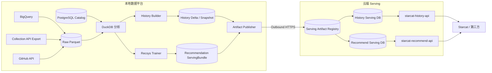

# Starcat 本地数据湖与云端 Serving 同步详细设计

> 日期: 2026-08-26
> 状态: 方案已确认，待实施
> 版本: v1.0
> 范围: BigQuery 本地长期存储、离线分析、History 日增量、Recommend 模型发布与云端同步
> 关联设计: [Starcat 自研仓库推荐系统详细设计](61-Starcat自研仓库推荐系统详细设计.md)、[Starcat 自研星标历史服务详细设计](62-Starcat自研星标历史服务详细设计.md)

## 1. 结论

Starcat 数据平台采用“本地轻量 Lakehouse + 云端只读 Serving”架构：

- BigQuery 与后续大规模外部数据只在本地保存一份 Raw 数据，不复制到云端，也不复制到各业务服务目录。
- Raw 和分析中间层使用按来源、schema 和日期分区的 Parquet；DuckDB 直接读取 Parquet，不把全量明细再次导入单体数据库文件。
- 本地 PostgreSQL 只保存 Dataset、Partition、Watermark、Job、Artifact 和 Deployment 等控制元数据，不保存大规模 WatchEvent 明细。
- History 每日从共享 Raw 数据生成小型增量 SQLite，云端幂等应用；每月生成完整快照用于压缩和恢复。
- Recommend 继续发布不可变 ServingBundle；规模增长后按 `source_repo_id` 分片，通过内容摘要只上传变化分片，但每次激活仍对应一个完整模型版本。
- 云端 API 只接触公开 repo 聚合结果和推荐产物，不接触 `actor_id`、匿名训练主体、原始 WatchEvent 或本地文件路径。
- 本地到云端只允许主动 HTTPS Push，不为家庭网络开放入站端口；发布失败不得改变线上 active 版本。

该方案中的“增量”分为两类：History 是事实行的日级增量；Recommend 是不可变模型版本的文件级增量。不得把不同推荐模型的行直接混写成一个无法追踪的线上版本。

## 2. 边界与非目标

### 2.1 本方案负责

- BigQuery 查询结果的本地长期存储和统一目录契约。
- Raw、Silver、Gold、Control、Scratch 五层数据生命周期。
- 单机起步、多机 Worker 扩展时的任务租约和 Artifact 边界。
- History 日增量、月快照、云端应用、恢复和回滚。
- Recommend ServingBundle 的版本发布、分片演进和原子激活。
- 容量统计、数据质量、校验和、血缘、水位线和灾备边界。

### 2.2 本方案不负责

- 不改变 Collection API 的匿名公开 Star 快照接收职责。
- 不让 `starcat-history-api` 或 `starcat-recommend-api` 查询本地 Raw 数据。
- 不把 BigQuery Raw、训练 user-repo 边或 `actor_id` 上传云端。
- 不在第一阶段引入 Spark、Iceberg、Trino、ClickHouse 或 Kubernetes。
- 不在本文件确定 Web 运维控制台的页面、权限和交互；控制台作为本地数据平台的后续控制面另行讨论和设计。
- 不处理 GH Archive 未提供的 Unstar 事件；History 口径以 WatchEvent 累积估算为准。

## 3. 总体架构



逻辑上的本地数据平台首期只需要 CLI、定时任务和 PostgreSQL，不需要建设一个公网微服务。数据源、分析器和 Publisher 继续通过 Artifact URI、manifest 和 checksum 解耦。

## 4. 本地存储分层

| 层级 | 内容 | 格式 | 是否可重建 | 是否上云 |
|---|---|---|---|---|
| Raw | BigQuery、Collection、GitHub API 的原始采集结果 | Parquet / JSON + manifest | 可从外部重采，但成本高 | 否 |
| Silver | 标准化、去重、聚合、过滤后的分析数据 | Parquet | 可由 Raw 重建 | 否 |
| Gold | History Delta/Snapshot、Recommendation ServingBundle | SQLite + manifest + checksum | 可由 Silver/模型重建 | 是 |
| Control | Dataset、Partition、Watermark、Job、Artifact、Deployment | PostgreSQL | 需备份 | 否 |
| Scratch | Dry run、排序、训练 checkpoint、临时压缩包 | 临时文件 | 可重建 | 否 |

### 4.1 目标目录

```text
/Starcat/
├── lake/
│   ├── raw/
│   │   ├── bigquery/
│   │   │   └── githubarchive_watch_event/
│   │   │       └── schema=v1/
│   │   │           └── event_date=2026-08-25/
│   │   │               ├── part-000.parquet
│   │   │               └── manifest.json
│   │   ├── collection/
│   │   └── github/
│   └── silver/
│       ├── history/repo_star_daily/
│       └── recsys/interactions/
├── artifacts/
│   ├── history/
│   └── recommend/
├── registry/
└── scratch/
```

当前下载目录保持不动：

```text
/Volumes/T0/Starcat/bigquery/watch-events-2016-2026
```

下载完成前禁止移动或重命名。第一阶段把它登记为 `githubarchive_watch_event/schema=v1` 的 Raw Dataset，History 和 Trainer 通过相同的 `file://` Artifact URI 只读访问。后续迁移到家庭存储服务器时只做一次受控移动和 URI 更新，不为两个业务各复制一份。

### 4.2 存储介质

- 家庭存储服务器承担长期 Raw/Silver 主数据湖，使用具备校验和、快照和 scrub 能力的 ZFS/Btrfs 磁盘池。
- T0 NVMe 作为当前下载目标、热数据和训练 Scratch，不作为唯一长期存储规划。
- Mac mini、Mac Studio 和 MBP 通过只读共享挂载访问 Raw；只有 Ingest/Compaction 任务拥有目标分区写权限。
- Artifact 写入使用同目录临时文件、校验和验证和原子重命名，任何消费者只读取已登记为 `ready` 的文件。

## 5. BigQuery 数据契约

### 5.1 Raw 分区

BigQuery 查询按最小可恢复业务分区落盘。GH Archive 当前按 UTC 日表下载：

```text
source=bigquery
dataset=githubarchive_watch_event
schema_version=1
partition_key=event_date
partition_value=2026-08-25
```

Raw 按时间分区，不按高基数 `repo_id` 或 `actor_id` 建目录。后续新的 BigQuery Query 必须拥有独立 `dataset_id` 和 `schema_version`，不能把不同 SQL 结果混入同一目录。

### 5.2 Partition manifest

每个分区必须记录：

```json
{
  "schema_version": 1,
  "dataset_id": "githubarchive_watch_event",
  "partition_key": "event_date",
  "partition_value": "2026-08-25",
  "query_name": "watch_events_by_day",
  "sql_sha256": "...",
  "bigquery_job_id": "...",
  "source_table": "githubarchive.day.20260825",
  "row_count": 123,
  "bytes_processed": 456,
  "file_sha256": "...",
  "created_at": "2026-08-26T00:00:00Z",
  "validation_state": "ready"
}
```

Token、GCP 凭据、billing account、本机用户名和绝对路径不得写入可发布 Artifact；本地 Catalog 可保存受控 `file://` URI。

### 5.3 幂等和水位线

分区状态：

```text
planned -> downloading -> validating -> ready
                   \-> failed
```

- 相同 Dataset/Partition/SQL hash 已 `ready` 时不再次查询 BigQuery。
- 恢复任务必须同时验证 Parquet footer、schema、row count 和 checksum，不能只依赖文件存在。
- checksum 不符的分区先隔离，再重新下载；禁止原地覆盖一个仍可能被读取的文件。
- 水位线只在分区完成验证后推进，下载成功但验证失败不得推进。
- 日期缺口必须显示为缺口，不能因为后一个日期完成而把前一个日期视为成功。

### 5.4 Silver 分区

Silver 根据读取模式增加固定 Bucket：

```text
bucket = repo_id % 256
```

示例：

```text
lake/silver/history/repo_star_daily/schema=v1/year=2026/month=08/bucket=042/*.parquet
```

Raw 保留原始查询粒度；小文件合并只发生在 Silver。Compaction 必须生成新文件、校验行数和聚合结果，再原子替换 Catalog 指针，不能直接修改消费者正在读取的 Parquet。

## 6. 本地 Control Plane

PostgreSQL 只保存小型控制数据：

```text
datasets
dataset_partitions
ingest_runs
source_watermarks
analysis_jobs
worker_leases
artifacts
artifact_files
deployments
quality_checks
storage_metrics
```

关键约束：

- `dataset_id + schema_version + partition_key + partition_value` 唯一。
- Job 必须保存输入 watermark、SQL/config hash、Git commit、输出 checksum、开始/结束时间和失败 code。
- 多机 Worker 通过数据库 Lease 领取任务，不使用共享 SQLite 或 NFS 文件锁作为任务协调真源。
- Lease 有明确过期时间和 heartbeat；过期任务可重领，但输出仍通过 Artifact 幂等键防止重复发布。
- Catalog 只登记 Artifact，不拥有业务计算逻辑；DuckDB、History Builder、Trainer 仍是独立消费者。

首期只有单机 Worker 时也保留同一数据模型，执行器可以串行运行，不需要提前实现分布式调度。

## 7. History 日增量

### 7.1 数据口径

History 只统计公开 `WatchEvent`：

```sql
SELECT
  repo_id,
  CAST(created_at AS DATE) AS event_date,
  COUNT(*) AS event_count
FROM read_parquet(?)
GROUP BY repo_id, event_date;
```

不处理 Unstar，不抓取 Stargazer 身份，不把 `actor_id` 写入 History Silver 或云端。WatchEvent 历史统一返回：

```text
source=gh_archive
precision=estimated
```

为了兼容现有 UI 的绝对 Star 数，服务可按当前 GitHub `stargazers_count` 建立单一当前锚点：

```text
baseline = max(0, current_stars - cumulative_events(anchor_date))
stars(day) = baseline + cumulative_events(day)
```

这是“不考虑 Unstar”的估算模型，不做多锚点插值、群体校准或 Unstar 重算。当前锚点不可用时返回可解释的 building/unavailable，不把纯事件累计伪装为权威 Star 总数。

### 7.2 每日流程

```text
D-1 Raw Partition ready
  -> repo/day 聚合
  -> Silver Parquet
  -> History Delta SQLite
  -> 本地校验
  -> HTTPS 发布
  -> 云端事务应用
  -> 推进云端 active watermark
```

如果 D-1 分区失败，任务继续重试同一日期；不能跳过缺口发布 D。History API 在此期间继续读取上一水位线数据。

### 7.3 Delta Bundle

```text
history-delta-20260825/
├── history-delta.sqlite
├── manifest.json
└── checksums.json
```

```sql
CREATE TABLE repo_star_daily_delta (
  repo_id INTEGER NOT NULL,
  event_date TEXT NOT NULL,
  event_count INTEGER NOT NULL,
  PRIMARY KEY (repo_id, event_date)
);

CREATE TABLE delta_metadata (
  delta_id TEXT PRIMARY KEY,
  event_date TEXT NOT NULL,
  source_checksum TEXT NOT NULL,
  schema_version INTEGER NOT NULL,
  row_count INTEGER NOT NULL
);
```

内部发布接口：

```http
POST /internal/v1/history-deltas/{delta_id}
Authorization: Bearer <HISTORY_PUBLISH_KEY>
Content-Type: application/zip
```

云端处理顺序：

1. 校验文件白名单、manifest、checksum 和 SQLite `quick_check`。
2. 校验 schema、日期连续性和 source watermark。
3. 在单个事务中 Upsert `repo_star_daily` 并登记 `applied_deltas`。
4. 成功后推进 active watermark 并更新受影响 repo 的 ETag。
5. 同一 `delta_id + checksum` 重传返回成功；同一 `delta_id` 内容不同返回 409。
6. 任一步骤失败都不改变 active watermark。

### 7.4 月度完整快照

- 每日生成一个 Delta。
- 每月从本地 Silver 生成一个完整 `history-snapshot.sqlite`。
- 云端保留最近 3 个完整快照，以及最新快照之后的全部 Delta。
- 恢复时先安装最近完整快照，再按 watermark 顺序重放 Delta。
- 完整快照只用于压缩、恢复和校验；日常同步不重复上传持续增长的完整 DB。

## 8. Recommend 数据与模型发布

### 8.1 输入增量

每日新的 WatchEvent 和 Collection 快照进入 Raw/Silver，形成新的训练 Dataset watermark。数据增量不等于必须每日训练；训练由固定周期或新增有效互动量阈值触发。

首期继续使用现有完整 ServingBundle：

```text
model-2026-08-26.1/
├── recommendations.sqlite
├── manifest.json
└── checksums.json
```

发布沿用：

```http
POST /internal/v1/model-bundles/{model_version}?activate=true
Authorization: Bearer <MODEL_PUBLISH_KEY>
```

每个模型版本必须经过离线指标门禁、checksum、SQLite `quick_check`、必需表检查和本地查询 smoke test。云端完成全部校验后才原子切换 active model。

### 8.2 分片演进

当完整 Bundle 的生成、上传、安装或回滚时间超过 SLO 时，再按固定 Bucket 分片：

```text
bucket = source_repo_id % 256
```

```text
recommend-v42/
├── manifest.json
├── shard-000.sqlite
├── shard-001.sqlite
└── ...
```

manifest 保存完整模型版本所需的所有 shard URI 和 checksum。新版本只上传内容摘要发生变化的 shard；未变化 shard 可被新 manifest 复用。只有 manifest 引用的全部文件都存在且验证通过后才能激活。

该机制实现“文件级增量传输 + 完整模型版本”，禁止把 v41 和 v42 的推荐行直接增量写入同一 namespace 后立即对外提供。

### 8.3 发布频率

- WatchEvent 和 Collection 输入每天增量处理。
- 初期推荐模型至少每周训练和评估一次。
- 数据量、训练耗时和质量门禁稳定后可提高到每日。
- 没有足够新数据、指标未提升或门禁失败时不发布空版本。

## 9. 云端 Serving Registry

本地 Publisher 只允许主动向云端发起 HTTPS 请求，不开放家庭网络入站端口。History 和 Recommend 使用独立 Publish Key、独立 endpoint 和独立 Registry。

统一发布状态：

```text
local_ready
  -> uploading
  -> cloud_staging
  -> cloud_verified
  -> active
```

失败状态必须保留稳定错误 code 和可重试边界；失败上传不能生成伪造的 success receipt。

云端推荐部署：

- Serving Artifact Registry 保存不可变 History Snapshot/Delta 和 Recommend Bundle/Shard。
- Fly Volume 或其它持久盘保存当前 API 的热数据和 active pointer。
- 云端对象存储只保存可公开派生产物与回滚版本，不保存任何 Raw/Silver 或主体数据。
- API 启动时校验 active manifest 和 DB；损坏时回退上一已验证版本，而不是在线重建。
- Fly Volume snapshot 是辅助恢复手段，不替代 Artifact Registry 和恢复演练。

## 10. 安全和隐私

### 10.1 永不上传云端

- BigQuery Raw Parquet。
- `actor_id`、actor login、原始 WatchEvent payload。
- Collection `participant_id`、匿名训练主体和 user-repo 明细。
- Private / Internal repo 数据。
- GitHub/GCP Token、Publish Key、数据库密码。
- 本地绝对路径、家庭网络地址和设备标识。

### 10.2 允许上传云端

History：

```text
repo_id + event_date + event_count
可选公开 repo metadata
schema/watermark/checksum
```

Recommend：

```text
source_repo_id + target_repo_id + score/rank/reason
公开 repo metadata
model manifest/checksum
```

Publish Key 只通过环境变量或系统 Secret 注入，不写进 Artifact、日志或错误响应。History 和 Recommend key 不得复用。

## 11. 容量和生命周期

每日记录：

```text
Raw/Silver/Gold/Scratch 总大小
过去 1/7/30 天增长量
分区数、文件数和平均文件大小
磁盘剩余容量
预计 90 天和 1 年容量
最近 checksum/scrub 状态
```

容量水位：

| 水位 | 行为 |
|---|---|
| 70% | 预警并生成容量预测 |
| 85% | 暂停非必要回填和延长历史版本保留 |
| 95% | 停止新的大规模下载，保留 Catalog、校验和和恢复空间 |

保留策略：

| 数据 | 保留策略 |
|---|---|
| Raw BigQuery Parquet | 长期保留 |
| Manifest、checksum、Catalog | 长期保留，并做第二份本地备份 |
| Silver | 当前有效版本和必要重建版本 |
| Scratch | 成功后 7 天清理 |
| 失败任务产物 | 30 天后清理，审计摘要保留 |
| History Snapshot | 云端最近 3 个完整版本 |
| History Delta | 保留最新 Snapshot 之后的全部 Delta |
| Recommend Bundle | active + 至少 2 个回滚版本 |

Raw 可重新从 BigQuery 获取，因此只要求一份逻辑副本；底层磁盘仍需校验和、冗余和定期 scrub。RAID/ZFS 冗余不等于备份，Catalog、manifest 和生产发布记录必须另做小体积备份。

## 12. 计算节点分工

| 设备 | 首期职责 |
|---|---|
| 家庭存储服务器 | Raw/Silver 主数据湖、快照和 scrub |
| T0 NVMe | 当前下载、热数据和 Scratch |
| 24G Mac mini | PostgreSQL Catalog、Scheduler、Publisher、轻量 ETL |
| Mac Studio | DuckDB 大聚合、推荐训练和 Bundle 构建 |
| 64G MBP | 手动分析、备用 Worker，不作为唯一常驻节点 |

单机阶段由 LocalExecutor 串行执行。多机阶段通过 PostgreSQL Lease 分发独立 Job；所有节点通过 Artifact URI 和 checksum 交接，不依赖同一进程内存或未登记的临时路径。

## 13. 可观测性

至少记录：

```text
data_partition_state{dataset,date}
data_ingest_lag_seconds{dataset}
data_partition_rows{dataset,date}
data_partition_bytes{dataset,date}
data_checksum_failures_total{dataset}
history_delta_publish_total{state}
history_active_watermark
recommend_training_runs_total{state,model}
recommend_bundle_publish_total{state}
serving_active_version{service}
storage_bytes{layer,dataset}
worker_lease_total{state,worker}
```

日志可记录 Dataset、Partition、Job、Artifact、model version、repo ID 和稳定错误 code；不得记录 Token、actor、participant、完整 payload 和本地私有路径。

## 14. 失败与恢复

| 故障 | 处理 |
|---|---|
| BigQuery 下载中断 | 从最后 ready 分区恢复，不重复查询已验证日期 |
| Parquet 损坏 | 隔离损坏文件，重采该分区，不推进 watermark |
| History Delta 上传失败 | 保留本地 Delta，线上继续上一 watermark，幂等重试 |
| History 云端 DB 损坏 | 安装最近 Snapshot，再重放后续 Delta |
| 推荐发布失败 | active model 不变，修复后重传同一不可变版本 |
| 推荐新模型质量下降 | active pointer 回滚上一版本 |
| 家庭计算节点离线 | 云端继续服务最后 active 版本，恢复后补齐缺失任务 |
| Catalog 丢失 | 从备份恢复，再用 manifest/checksum 扫描核对数据湖 |

所有恢复流程必须定期演练；“文件存在”不能作为恢复成功的唯一证据，还需校验行数、checksum、schema、水位线和 API 查询。

## 15. 实施阶段

### Phase 1：本地目录和 Catalog

- 保持当前 WatchEvent 下载目录不动。
- 登记已有分区、checksum、row count、SQL hash 和水位线。
- 建立 PostgreSQL Control Plane 和容量统计。
- 把现有 `download-state.json` 纳入 Catalog 导入，不破坏现有断点续传。

### Phase 2：History 日增量

- 建立 `repo_id + event_date + event_count` Silver 数据集。
- 生成并校验 History Delta SQLite。
- 实现云端幂等应用、月 Snapshot、恢复和回滚。
- `starcat-history-api` 达到门槛后迁移现有 Discovery History 查询。

### Phase 3：Recommend 发布治理

- 继续使用现有单文件 ServingBundle，完善调度、发布审计和失败重试。
- 用真实体积、耗时和变更率决定是否进入 256 shard。
- 分片后仍保持完整 manifest 原子激活和至少两个回滚版本。

### Phase 4：多机和长期运营

- Mac Studio/MBP 通过 Worker Lease 承接聚合和训练任务。
- 把长期 Raw/Silver 迁移到家庭存储池，T0 保留为热层和 Scratch。
- 完成容量预测、checksum scrub、备份和恢复演练。
- 在真实运维流程稳定后，再决定 Web 控制台的功能和权限边界。

## 16. 验证矩阵

### 16.1 数据

- 同一 Raw Partition 同时被 History 和 Trainer 只读复用，没有物理复制。
- 已验证日期重跑不访问 BigQuery；损坏分区只重采自身。
- SQL/schema 改变必须产生新 Dataset 或 schema version，不能静默覆盖。
- Raw 到 Silver 的 row count、去重数和聚合总数可追踪。

### 16.2 History

- Delta 首次应用成功；相同 checksum 重放 no-op；同 ID 不同内容返回 409。
- 缺失日期不推进水位线；失败发布不改变线上结果。
- Snapshot + Delta 可恢复出相同 row count、checksum 和查询结果。
- API 返回 `gh_archive + estimated`，不宣称处理了 Unstar。

### 16.3 Recommend

- 指标门禁失败不生成 active 版本。
- Bundle/Shard checksum、SQLite `quick_check` 和必需表校验失败时不激活。
- 分片版本缺一个 shard 时不能激活。
- 回滚后 API 返回上一 model version 和一致查询结果。

### 16.4 运维

- 家庭网络断开时云端 API 继续读取上一 active 版本。
- Catalog 备份恢复和 manifest 重扫结果一致。
- 磁盘达到容量水位时执行对应保护动作。
- Publish Key 不出现在 Artifact、日志、异常和测试快照中。

## 17. 完成定义

- BigQuery Raw 在本地形成唯一、可恢复、带 manifest 和 checksum 的长期数据集。
- History 与 Trainer 通过同一 Artifact URI 读取 Raw，不互相复制原始数据。
- History 每日 Delta、月 Snapshot、云端幂等应用和恢复链路完成验证。
- Recommend 输入增量、模型门禁、不可变 Bundle、原子激活和回滚完成验证。
- 云端只保存公开派生 Serving 数据，不保存任何 Raw、actor 或匿名训练主体。
- 单机执行可用，多机扩展不需要改变数据源和业务节点接口。
- 容量、质量、血缘、水位线、发布和恢复均有可审计记录。

## 18. 已采用决策

1. 采用 Parquet + DuckDB + PostgreSQL Catalog 的轻量 Lakehouse，不在第一阶段引入重型分布式分析栈。
2. BigQuery Raw 只在本地保留一份，云端和各业务服务均不复制。
3. History 使用日级 SQLite Delta 和月度完整 Snapshot，不每日上传完整增长型 DB。
4. History 不处理 Unstar，统一以 `gh_archive + estimated` 表达 WatchEvent 累积曲线。
5. Recommend 首期继续发布完整 ServingBundle；规模达到实际门槛后改为内容寻址分片。
6. 推荐的增量是文件传输优化，线上仍按完整 model version 原子切换。
7. 本地只能主动 Push 到云端，不开放家庭网络入站端口。
8. Web 运维控制台属于后续独立设计，本文件只提供它将要管理的数据和任务控制面。

## 19. 参考资料

- DuckDB Hive Partitioning: <https://duckdb.org/docs/current/data/partitioning/hive_partitioning>
- DuckDB File Formats: <https://duckdb.org/docs/current/guides/performance/file_formats>
- Fly Volumes: <https://fly.io/docs/volumes/overview/>
- Fly Volume Snapshots: <https://fly.io/docs/volumes/snapshots/>
