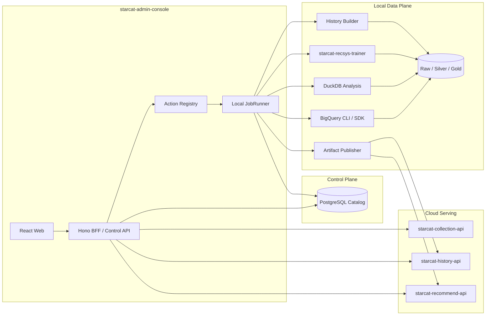

# Starcat 数据平台 Web 运维控制台详细设计

> 日期: 2026-08-26
> 状态: 方案已确认，待实施
> 版本: v1.0
> 范围: 本地数据平台可视化、结构化任务编排、多节点运行状态、History 与 Recommend 产物发布治理
> 关联设计: [Starcat 本地数据湖与云端 Serving 同步详细设计](66-Starcat本地数据湖与云端Serving同步详细设计.md)、[Starcat 自研仓库推荐系统详细设计](61-Starcat自研仓库推荐系统详细设计.md)、[Starcat 自研星标历史服务详细设计](62-Starcat自研星标历史服务详细设计.md)

## 1. 结论

Starcat 数据平台需要 Web 运维控制台，但不新建第三套前端项目。控制台复用独立仓库
`supports/starcat-admin-console` 的 React、Hono BFF、配置存储、安全代理和操作确认能力，在现有
“公开业务服务运维”之外增加“本地数据平台运维”域。

首期采用单机、本地优先方案：

- Web 与 BFF 继续只绑定 `127.0.0.1`，不开放公网，不新增登录、RBAC 或多租户。
- BFF 通过固定 Action Registry 创建结构化 Job，不提供任意 Shell 或任意 URL 请求入口；BigQuery 测试场景提供受控 SQL Lab，必须遵守本设计第 10.4 节的只读、dry run、预算和结果上限。
- PostgreSQL Catalog 是 Dataset、Partition、Job、Artifact、Deployment 和状态的单一真源。
- 首期 JobRunner 内置在 BFF 进程中，以并发度 1 串行调用现有 CLI/API；浏览器关闭不影响任务。
- BigQuery 下载、DuckDB 分析、History 构建、推荐训练和发布逻辑仍由各自 CLI/API 实现，控制台不复制业务计算。
- 后续多机时把相同 Job 协议扩展为 Worker Lease；Mac Studio、Mac mini 和 MBP 不需要改变数据源或 Artifact 接口。
- `starcat-site/_local-admin` 不再扩展；只有在现有能力全部迁移并通过人工验收后，才单独讨论下线。

该控制台的目标是把“脚本是否执行过”升级为“数据、任务、产物和线上版本是否处于可验证状态”。

## 2. 背景与问题

本地数据平台将长期管理以下资源：

- 2016 至今的 GH Archive WatchEvent，以及后续每日增量；
- BigQuery PushEvent 仓库目录和未来新增 Query；
- Collection API 导出的匿名公开 Star 快照；
- Raw、Silver、Gold、Scratch 多层数据；
- History Delta、月度 Snapshot；
- 推荐 Dataset、评估结果、ServingBundle 和模型版本；
- 家庭存储服务器、Mac mini、Mac Studio 和 MBP 等多个节点；
- 本地到云端的发布、激活、回滚和恢复记录。

仅靠脚本会逐渐出现以下问题：

1. 操作者需要记忆命令、环境变量、目录和执行顺序。
2. 下载成功、校验成功、水位线推进和线上激活容易被误认为同一状态。
3. 任务跨多个进程和设备后，日志分散，无法快速判断阻塞位置。
4. 重试可能重复查询 BigQuery、覆盖 Artifact 或重复发布。
5. 磁盘增长、分区缺口、checksum 异常和线上版本漂移缺少统一视图。

Web 控制台不替代数据管道，而是为现有数据管道提供统一控制面。

## 3. 边界与非目标

### 3.1 本方案负责

- 数据平台 Dashboard、Dataset、Partition、Job、Artifact、Deployment、Worker 和 Storage 页面。
- 固定任务的创建、参数校验、进度展示、取消、幂等重试和结果审计。
- BigQuery Query Catalog、扫描预算、日期范围和分区缺口管理。
- History Delta/Snapshot 的构建、发布、水位线和恢复状态展示。
- Recommend 训练、评估门禁、ServingBundle 发布、激活和回滚状态展示。
- Collection、History、Recommend 等服务的健康状态和数据平台相关指标。
- 单机 JobRunner 与未来 PostgreSQL Lease 多机 Worker 的兼容协议。
- 本地密钥、GCP ADC、文件路径和家庭网络信息不进入浏览器的安全边界。

### 3.2 本方案不负责

- 不把 Raw、Silver、主体行为、`actor_id` 或匿名训练主体展示到浏览器。
- 不提供面向任意数据库的通用 SQL 工作台、通用数据库编辑器、文件管理器或任意 Shell 终端；唯一例外是本机 BigQuery SQL Lab。
- 不把 Trainer、History Builder 或 Publisher 的业务逻辑重写到 Node BFF。
- 不让控制台直接修改 Raw Parquet、Serving SQLite 或线上 active pointer。
- 不在首期支持公网访问、远程登录、RBAC、多用户审批或移动端适配。
- 不替代云端 API 自身的 checksum、事务、幂等和原子激活校验。
- 不因为有了 Web 页面就删除现有 CLI 和恢复脚本。

## 4. 现有项目复用决策

### 4.1 复用 `starcat-admin-console`

现有控制台已经具备：

- React + TypeScript + Vite 前端；
- Hono 本地 BFF；
- Test / Production Profile；
- 服务能力白名单和类型化动作；
- BFF 侧密钥托管与上游 API 代理；
- 操作确认、活动记录、服务健康和统计页面；
- Vitest、React Testing Library 和 Playwright 验证入口。

这些能力与数据平台控制面高度重合。复用可以避免第三套导航、主题、凭据存储和本地启动方式。

### 4.2 两个运维域

控制台调整为两个明确隔离的一级域：

| 运维域 | 管理对象 | 数据边界 |
|---|---|---|
| 业务服务 | Sharing、Trending、Weekly、Wiki、Recommend、Discovery | 公开业务 API 的统计、缓存和运营动作 |
| 数据平台 | BigQuery、Collection、Lakehouse、Trainer、History、Recommend Artifact | 本地控制元数据、派生 Artifact 和发布状态 |

`Recommend` 可以同时出现在两个域：业务服务域关心在线 API 健康和查询；数据平台域关心训练、模型、发布和 active version。两者使用不同页面和 Adapter，不混合权限。

实施前必须修订 `starcat-admin-console/AGENTS.md` 现有“只管理六个开源业务 API”限制，明确允许本地数据平台组件进入数据平台域，同时保留 Raw 和凭据不得进入浏览器的约束。

### 4.3 不扩展 `_local-admin`

`starcat-site/_local-admin` 是官网仓库中的历史单页工具，业务逻辑、样式和 API 调用集中在少量文件中，不适合承载长期 Job、Catalog、多节点和发布治理。

迁移规则：

1. 新功能只进入 `starcat-admin-console`。
2. 已有 `_local-admin` 能力在新控制台达到功能对齐前保持不动。
3. 功能对齐、自动化测试和真实人工验收全部通过后，另开任务讨论下线。

## 5. 总体架构



### 5.1 前端职责

- 展示经过脱敏和聚合的控制数据。
- 通过 Action Registry 获取可执行动作和参数 schema。
- 在创建任务前展示环境、对象、扫描预算、影响和确认要求。
- 通过轮询或 SSE 显示 Job stage、进度、稳定错误码和脱敏日志。
- 不直接访问业务 API、PostgreSQL、文件系统或 Worker。

### 5.2 BFF 职责

- 校验 Host、Origin、Profile、Action ID 和参数。
- 持有服务 Key、Publish Key、路径映射和数据库凭据。
- 查询 Catalog 并生成只读 ViewModel。
- 创建 Job、处理取消/重试请求并写入审计记录。
- 首期运行本地 JobRunner；多机后仅负责调度和状态聚合。
- 代理 Collection、History、Recommend 的固定管理接口。

### 5.3 JobRunner 职责

- 只执行 Action Registry 登记的固定可执行文件和参数模板。
- 为每个 Job 创建独立工作目录和脱敏日志文件。
- 设置并刷新 Lease，捕获退出码、Signal、Artifact 和 checksum。
- BFF 重启后恢复 queued Job，并把过期 running Job 转为可审计的 interrupted 状态。
- 不拼接用户输入为 Shell 字符串；所有参数使用 argv 数组传递。

### 5.4 业务 CLI/API 职责

- BigQuery 下载器负责 dry run、预算门禁、断点续传和分区校验。
- DuckDB 任务负责 Raw 到 Silver 的标准化、聚合和 compaction。
- Trainer 负责 Dataset、训练、评估、ServingBundle 和本地校验。
- History Builder 负责 Delta/Snapshot 生成和本地恢复验证。
- Publisher 负责 HTTPS 上传、云端校验、激活和回执。

控制台只消费这些程序产生的结构化状态或 Artifact manifest，不解析自然语言日志推断成功。

## 6. 信息架构

| 一级导航 | 页面 | 核心内容 |
|---|---|---|
| Overview | Data Platform Dashboard | 数据新鲜度、磁盘水位、任务、线上版本和异常摘要 |
| Data | Datasets | 数据来源、schema、分区、水位线、SQL hash、行数和 checksum |
| Data | Partitions | 日期缺口、下载状态、验证状态、隔离分区和重试入口 |
| Operations | Jobs | queued/running/failed/succeeded、stage、耗时、重试和取消 |
| Operations | Workers | 节点能力、心跳、Lease、当前任务和最近失败 |
| Products | History | Silver、Delta、Snapshot、发布记录和 active watermark |
| Products | Recommend | Dataset、训练指标、模型版本、Bundle、激活和回滚 |
| Serving | Deployments | History/Recommend 云端 Artifact、active 版本和回执 |
| Infrastructure | Storage | Raw/Silver/Gold/Scratch 容量、增长率、预测和 scrub |
| Settings | Data Platform | 路径映射、预算、调度、服务地址和密钥状态 |

首期桌面优先，复用现有 App Shell、主题和 Profile。数据平台页面不进入 Starcat macOS App。

## 7. Action Registry

### 7.1 固定动作

首期允许以下 Action：

| Action ID | 参数 | 结果 |
|---|---|---|
| `lake.register-existing-watch-events` | Dataset、现有目录 | Catalog Partition 与校验摘要 |
| `bigquery.watch-events.incremental` | UTC 日期、扫描预算 | Raw Partition |
| `bigquery.watch-events.backfill` | UTC 日期范围、每日/总预算 | 多个 Raw Partition |
| `bigquery.push-events.incremental` | UTC 日期、扫描预算 | 精简 PushEvent Raw Partition |
| `bigquery.push-events.backfill` | UTC 日期范围、每日/总预算 | 多个精简 PushEvent Raw Partition |
| `bigquery.push-catalog.refresh` | 年份范围、总预算 | PushEvent repo catalog |
| `bigquery.sql-lab.dry-run` | SQL、Location、扫描预算 | SQL hash、schema 与预计扫描量 |
| `bigquery.sql-lab.query` | 已 dry run 的 SQL hash、扫描预算、结果上限 | 临时结果页与查询回执 |
| `lake.validate-partition` | Dataset、Partition | Quality Check |
| `lake.compact-silver` | Silver Dataset、日期范围 | 新 Silver Artifact |
| `history.build-delta` | event date | History Delta |
| `history.publish-delta` | Delta Artifact | Deployment Receipt |
| `history.build-snapshot` | month | History Snapshot |
| `history.verify-restore` | Snapshot 与 Delta 范围 | Restore Check |
| `recommend.train` | Dataset watermark、config、model version | Evaluation 与 ServingBundle |
| `recommend.publish` | ServingBundle | Deployment Receipt |
| `recommend.activate` | model version | Active Version |
| `recommend.rollback` | verified model version | Active Version |
| `storage.scrub` | Dataset 或存储卷 | Scrub Report |

新增动作必须同时增加：参数 schema、风险等级、幂等键、执行 Adapter、测试和用户说明。不能只在页面增加一个调用脚本的按钮。

### 7.2 风险等级

| 等级 | 示例 | 确认要求 |
|---|---|---|
| L0 只读 | 查看状态、分区、指标、日志摘要 | 无 |
| L1 幂等写 | 下载单日增量、校验分区、构建 Artifact | 普通确认 |
| L2 资源操作 | 大日期范围 BigQuery 回填、完整训练、compaction | 展示扫描量、存储量、时间范围和预算后确认 |
| L3 线上变更 | 激活、回滚、覆盖 Secret | 输入目标版本或服务名二次确认 |

首期不提供 Raw 删除、全库清空、任意文件移动或跳过 checksum 激活。需要清理时继续使用离线审计后的受控脚本，并另行确认。

## 8. Job 数据模型

### 8.1 核心字段

```text
job_id
action_id
environment
state
stage
progress_current
progress_total
input_json
input_hash
idempotency_key
dataset_watermark
config_hash
git_commit
worker_id
lease_expires_at
heartbeat_at
created_at
started_at
finished_at
exit_code
error_code
error_summary
artifact_ids
```

`input_json` 只能保存经 schema 允许的非敏感参数。Token、数据库密码、本地用户名和原始 payload 不得入库。

### 8.2 状态机

```text
queued
  -> leased
  -> running
  -> validating
  -> succeeded

queued/running/validating
  -> cancel_requested
  -> cancelled

leased/running/validating
  -> interrupted
  -> queued（满足幂等重试条件）

leased/running/validating
  -> failed
```

- `succeeded` 必须来自结构化结果、Artifact manifest 和校验结果，不能只看进程退出码 0。
- `cancel_requested` 不等于已停止；只有子进程退出且临时输出隔离后才进入 `cancelled`。
- `failed` 重试必须复用同一输入和幂等键，或显式创建新版本。
- Publish 状态继续遵循 `local_ready -> uploading -> cloud_staging -> cloud_verified -> active`，作为 Job stage 和 Deployment 状态保存。

### 8.3 日志

页面只展示：

- 时间、stage、进度、稳定错误码和脱敏摘要；
- Dataset、Partition、Artifact、model version 和 repo 聚合数量；
- CLI 退出码和有限长度 stderr 摘要。

页面不展示：

- Token、Authorization header、环境变量全集；
- `actor_id`、participant/subject 明细；
- 本地绝对私有路径和家庭网络地址；
- Collection 原始快照或训练 user-repo 边；BigQuery SQL Lab 的临时结果属于第 10.4 节明确约束的本机测试例外，不进入日志或 Catalog。

完整本地日志采用大小和天数双上限，仅管理员主机可读取。

## 9. BFF API 契约

前端只调用同源 `/api/data-platform/*`：

```http
GET  /api/data-platform/overview
GET  /api/data-platform/datasets
GET  /api/data-platform/datasets/{dataset_id}/partitions
GET  /api/data-platform/actions
POST /api/data-platform/actions/{action_id}/jobs
GET  /api/data-platform/jobs
GET  /api/data-platform/jobs/{job_id}
POST /api/data-platform/jobs/{job_id}/cancel
POST /api/data-platform/jobs/{job_id}/retry
GET  /api/data-platform/jobs/{job_id}/events
GET  /api/data-platform/workers
GET  /api/data-platform/storage
GET  /api/data-platform/history/releases
GET  /api/data-platform/recommend/models
GET  /api/data-platform/deployments
POST /api/data-platform/bigquery/sql/dry-run
POST /api/data-platform/bigquery/sql/query
GET  /api/data-platform/bigquery/downloads
```

创建 Job 示例：

```json
{
  "schema_version": 1,
  "parameters": {
    "start_date": "2026-08-25",
    "end_date": "2026-08-25",
    "maximum_bytes_billed_per_day": 1073741824,
    "maximum_total_bytes_billed": 1073741824
  },
  "confirmation": {
    "risk_level": "L1",
    "expected_input_hash": "..."
  }
}
```

BFF 返回 Job ID，不等待任务完成：

```json
{
  "schema_version": 1,
  "data": {
    "job_id": "job_...",
    "state": "queued",
    "idempotency_key": "..."
  }
}
```

## 10. BigQuery 页面与预算门禁

### 10.1 Query Catalog

生产采集页面不接收任意 SQL。每个 Query 定义固定保存：

```text
query_name
dataset_id
schema_version
partition_key
sql_template
allowed_parameters
dry_run_required
maximum_partition_span
default_daily_budget
default_total_budget
```

首期登记：

- `watch_events_by_day`
- `push_repository_catalog_by_year`

新增 Query 必须经过代码评审、SQL hash 变化检查和 Dataset/schema 兼容性判断。

### 10.2 执行前预览

BigQuery Job 创建前必须展示：

- UTC 查询日期范围；
- 源表和目标 Dataset；
- 已 ready、缺失和需要重采的分区数；
- dry run 预计扫描字节数；
- 每日预算、总预算和当前月累计扫描量；
- 目标存储预计新增空间；
- SQL hash 和配置版本。

dry run 失败、预算超限、日期范围超上限或目标分区已存在冲突时，禁止创建执行 Job。

### 10.3 幂等与恢复

- ready Partition 默认跳过。
- failed 或 checksum 不符 Partition 只能隔离后重采。
- 日期缺口按 UTC 日展示，不允许后续日期掩盖前序缺口。
- Job 页面必须区分 BigQuery 查询完成、Parquet 写入、footer 校验、checksum 校验和 Catalog ready。

### 10.4 本机受控 SQL Lab

SQL Lab 只用于管理员在本机验证 GH Archive BigQuery 数据，不属于 Query Catalog 生产采集链路。它是“不提供任意 SQL”的唯一例外，必须同时满足：

- Web 与 BFF 只绑定 `127.0.0.1`，页面固定标识 `Local Data Platform`，不跟随业务服务 Test/Production Profile。
- 只接受一条只读 `SELECT` 或 `WITH ... SELECT`；BigQuery dry run 返回的 statement type 必须为 `SELECT`。
- 禁止 DDL、DML、`EXPORT DATA`、脚本、多语句、远程函数和写入 destination table。
- 首期只允许引用 `githubarchive` 公共项目的数据表；GCP ADC、billing project 和凭据只存在于本地执行进程。
- 每次执行前必须 dry run，并展示 SQL SHA-256、输出 schema、预计扫描量、当前月累计计费量和剩余额度。
- 正式查询只接受同一次 dry run 对应的 SQL hash 与预算；SQL 或预算变化后必须重新 dry run。
- 请求必须提供 `maximum_bytes_billed`，并继续受项目月度 80% 警告、90% 停止保护。
- 首期最多返回 200 行、2 MiB；达到任一上限即截断响应，但不能把 `LIMIT` 冒充扫描成本保护。
- SQL 文本和结果行不写 PostgreSQL、日志、浏览器存储或活动记录；Catalog 只记录 SQL hash、BigQuery job ID、扫描量、状态和时间。
- BFF 不直接实现 BigQuery SDK 逻辑，只通过固定 argv 调用 Trainer 的结构化 SQL Lab CLI；SQL 使用受限输入文件传递，不进入 shell 字符串或进程 argv。

SQL Lab 返回的是管理员主动查询的公开 GitHub 数据样本。它不允许查询 Collection、Starcat 本地数据库、训练主体边或任何 Private/Internal 数据，也不能保存为 Raw Dataset；需要长期落地的数据仍必须新增 Query Catalog 定义并经过代码评审。

## 11. History 运维

History 页面展示：

- Raw/Silver 最新 ready 日期和缺口；
- 每日 repo 数、event 数、异常变化和 checksum；
- Delta 本地构建、云端上传、应用和 active watermark；
- 月 Snapshot 的生成、校验、保留和恢复演练；
- History API 健康、active watermark、数据来源和精度。

允许的操作：

- 构建指定 ready 日期的 Delta；
- 重试失败发布；
- 构建月 Snapshot；
- 在隔离环境执行 Snapshot + Delta 恢复验证；
- 查看云端水位线与本地 Catalog 差异。

不能从 UI 跳过日期连续性、checksum、SQLite `quick_check` 或事务应用门禁。

## 12. Recommend 运维

Recommend 页面展示：

- Dataset watermark、interaction/repository/subject 数量；
- 数据切分、过滤、冷启动和质量检查摘要；
- Popular、SVD、co-star 等已执行 Trainer 与评估指标；
- 指标门禁结果、model version、Git commit 和 config hash；
- ServingBundle 大小、checksum、SQLite 校验和本地查询 smoke test；
- 云端已验证版本、active version 和回滚版本。

允许的操作：

- 对指定 Dataset watermark 创建训练 Job；
- 重新执行失败的确定性训练；
- 发布已通过门禁的不可变 ServingBundle；
- 激活已 cloud_verified 的版本；
- 回滚到仍被 Registry 保留的已验证版本。

控制台不能修改训练指标、强制把门禁失败版本标记为通过，或覆盖同名模型版本。

## 13. Collection 与云端 Serving

Collection 在数据平台域只展示：

- 服务健康和版本；
- 最新 Export ETag/checksum；
- 当前可导出的 active snapshot 和 subject 聚合数量；
- Trainer 最近 Pull 的时间、输入摘要和失败码。

不展示 participant/subject 明细，不提供删除、原始快照浏览或任意导出下载按钮。

History/Recommend Serving 展示：

- API 健康、active watermark/model version；
- 最近发布回执、版本大小和 checksum；
- 本地期望版本与云端 active 版本是否一致；
- 上一可回滚版本和 Registry 保留状态。

云端 active pointer 只能由服务自身在完整校验后原子更新，控制台不能直接编辑文件或数据库。

## 14. Storage 与容量

Storage 页面按 Raw、Silver、Gold、Scratch 展示：

- 当前大小、文件数、分区数和平均文件大小；
- 过去 1/7/30 天增长量；
- 预计 90 天和 1 年容量；
- 磁盘剩余容量、最近 checksum/scrub 时间；
- 70%、85%、95% 水位状态和保护动作。

路径对浏览器使用逻辑别名：

```text
lake://raw/bigquery/githubarchive_watch_event/schema=v1
lake://silver/history/repo_star_daily/schema=v1
artifact://recommend/model-2026-08-26.1
```

BFF 在本地把逻辑 URI 解析为真实路径。浏览器、API 响应、截图和导出报告不得包含家庭存储地址或用户名。

## 15. 单机与多机执行

### 15.1 首期单机

- Mac mini 运行 PostgreSQL、Admin Console BFF、Scheduler 和 Local JobRunner。
- Local JobRunner 并发度默认 1；轻量状态采集可以独立并发。
- Mac Studio 仍可由人工运行 Trainer，但结果必须通过 manifest 导入 Catalog。
- BFF 重启后扫描过期 Lease，先核对工作目录和 Artifact，再决定重试或标记 interrupted。

首期不为 JobRunner 新建公网服务或独立 Git 项目。

### 15.2 多机阶段

当 Mac Studio/MBP 需要自动领取任务时，引入 Worker：

```text
register -> heartbeat -> lease job -> execute -> validate -> report artifact -> complete
```

Worker capability 示例：

```text
bigquery-download
duckdb-history
recsys-train
artifact-publish
storage-scrub
```

- Worker 只能领取自身 capability 匹配的 Job。
- Lease 有 TTL 和 heartbeat，失联后可回收。
- 同一 Job 的输出仍用 Artifact 幂等键和 checksum 去重。
- Worker 不允许把 Raw 上传控制台；只上报状态、指标和 Artifact manifest。
- 家庭网络外的 Worker 必须经过单独的 TLS、身份和网络方案评审。

## 16. 调度与通知

首期 Scheduler 支持固定计划：

```text
每日 D-1 WatchEvent 增量
每日 History Silver 与 Delta
每日容量统计和分区缺口检查
每周推荐训练候选
每月 History Snapshot
定期 checksum/scrub 与恢复演练
```

自动调度只创建 Job，仍经过相同 Registry、幂等和预算门禁。没有足够新数据、存在前序日期缺口、质量门禁失败或容量达到保护水位时，应创建可解释的 skipped/blocked 记录，而不是静默不执行。

首期错误只在控制台展示，不对 Starcat 用户发通知。管理员通知渠道后续另行设计。

## 17. 安全设计

### 17.1 首期访问边界

- BFF 只绑定 `127.0.0.1`。
- 校验 Host 和 Origin。
- 浏览器不保存任何 Key、Token、数据库密码或 GCP credential。
- Profile 只显示“已配置/未配置”和不可逆指纹。
- 不允许局域网或公网访问首期服务。

如果后续需要从移动端或外网访问，必须先单独完成：TLS、登录、RBAC、CSRF、防重放、审计、Secret 后端、备份和恢复设计。不能直接把本地 BFF 绑定到 `0.0.0.0`。

### 17.2 进程执行

- Action ID 到 executable/argv 的映射由代码固定。
- 日期、版本、Dataset 和数值参数经过 Zod/服务端 schema 双重校验。
- 子进程使用最小环境变量白名单。
- 禁止 `shell: true`，禁止把用户输入拼入命令字符串。
- 工作目录按 Job 隔离，输出只能写入允许的 Scratch/Artifact 目录。
- Publish Key、GCP ADC 和 GitHub Token 只在实际需要的 Action 中注入。

### 17.3 数据隐私

浏览器和操作日志只接触聚合控制信息。以下数据永不返回：

- WatchEvent actor、原始 payload；
- Collection participant/subject 明细；
- 训练 user-repo 边；
- Starcat 标签、笔记、搜索、AI/RAG 内容；
- Private/Internal repo；
- 本地真实路径和家庭网络拓扑。

SQL Lab 可以在本机浏览器当前页面临时展示管理员主动查询的公开 GH Archive 字段，但不得持久化、导出、进入截图报告或复用为业务 API 响应；页面离开或刷新后即丢弃。

## 18. 失败与恢复

| 故障 | 控制台行为 |
|---|---|
| BFF 重启 | 浏览器重新连接；Job 状态从 PostgreSQL 恢复 |
| JobRunner 中断 | Lease 过期后标记 interrupted，核对 Artifact 后再重试 |
| BigQuery 下载失败 | 保留已 ready 日期，只重试失败分区 |
| Parquet 校验失败 | 标记 quarantined，禁止推进 watermark |
| History 发布失败 | 保留本地 Delta，线上继续上一 watermark |
| 推荐发布失败 | active model 不变，保留失败回执和稳定错误码 |
| Worker 离线 | 回收过期 Lease；云端继续提供上一 active 版本 |
| PostgreSQL 不可用 | 禁止创建新 Job，不退化为无审计脚本执行 |
| Catalog 恢复 | 从备份恢复后用 manifest/checksum 扫描核对 |

页面不能通过“强制成功”绕过失败状态。人工修复完成后应重试原 Job 或创建拥有新版本/新输入 hash 的 Job。

## 19. 可观测性

控制台直接消费 66 号设计定义的指标，并补充：

```text
control_api_requests_total{route,state}
control_jobs_total{action,state}
control_job_duration_seconds{action,state}
control_job_queue_age_seconds{action}
control_runner_heartbeat_timestamp
control_action_rejections_total{action,reason}
control_sse_connections
```

Dashboard 优先展示需要采取动作的信息：

- 缺失或损坏分区；
- 超过 SLA 的数据水位线；
- 失败、interrupted 或长时间 queued 的 Job；
- 磁盘容量保护水位；
- 本地 expected 与云端 active 版本不一致；
- Worker 心跳丢失；
- 最近恢复演练失败。

健康状态不应只表示 HTTP 200，还要区分 process health、dependency health、data freshness 和 serving version。

## 20. 脚本迁移策略

现有脚本按三类处理：

| 类型 | 处理 |
|---|---|
| 正式 CLI | 保留并作为 Action Adapter 的底层执行入口 |
| 组合验证脚本 | 拆出结构化阶段，由 Job/Artifact 状态替代文本判断；脚本继续用于 E2E |
| 一次性临时脚本 | 审计后删除或保留在明确的 migration/recovery 目录，不进入 Web Action Registry |

迁移顺序：

1. 先给现有 CLI 增加稳定 JSON 结果和错误码。
2. 再登记 Action Adapter 和参数 schema。
3. 然后接入 JobRunner 与 Catalog。
4. 最后增加页面操作入口和 E2E。

禁止先做一个“执行命令”输入框，再把所有脚本塞进去。

## 21. 实施阶段

### Phase 1：只读控制面

- 扩展 Admin Console 导航和数据平台 Profile。
- 接入 PostgreSQL Catalog，只读展示 Dataset、Partition、Job、Artifact、Deployment 和 Storage。
- 展示 Collection、History、Recommend 健康及 active 状态。
- 展示当前 WatchEvent 下载目录、日期缺口和容量趋势。

### Phase 2：单机任务闭环

- 建立 Action Registry、Job API 和 Local JobRunner。
- 接入现有 WatchEvent 增量、分区校验和 Catalog 登记。
- 接入 WatchEvent / PushEvent 后台下载状态、启动、停止、重启与月度额度保护。
- 接入 BigQuery SQL Lab 的 dry run、预算确认和有上限只读查询。
- 接入 History Delta/Snapshot 构建与发布。
- 接入 Recommend 训练、评估、Bundle 发布和回滚。
- 完成取消、幂等重试、SSE 进度和脱敏日志。

### Phase 3：调度与恢复

- 每日/每周/月度 Scheduler。
- 容量水位、缺口、质量和 active version 告警面板。
- History 恢复演练、推荐回滚演练和 Catalog 备份恢复。
- 完成旧脚本与 `_local-admin` 功能对齐审计。

### Phase 4：多机 Worker

- 抽取 Worker Lease 协议和 capability。
- Mac Studio 承接 DuckDB 聚合和推荐训练。
- MBP 作为手动启停的备用 Worker。
- 完成失联、Lease 回收、重复执行和 Artifact 幂等验证。

### Phase 5：远程访问评估

只有本地控制台稳定后，再决定是否需要移动端/远程访问。进入该阶段前必须重新设计身份、权限、网络和 Secret 边界，不默认实施。

## 22. 测试与验收

### 22.1 单元测试

- Action 参数 schema、风险等级和幂等键。
- 密钥脱敏、路径别名和日志清洗。
- Job 状态机、取消、重试、Lease 过期和恢复。
- Query Catalog、dry run 和扫描预算门禁。
- SQL Lab 只读语句、引用数据集、SQL hash、结果上限和不持久化约束。
- Dataset/Partition/Artifact/Deployment ViewModel 转换。

### 22.2 集成测试

- 使用临时 PostgreSQL 创建、领取、执行和恢复 Job。
- 使用 fixture CLI 验证 argv、环境白名单、Signal 和 JSON 结果。
- 使用 fixture CLI 验证 SQL 通过受限文件而非 argv/shell 传递。
- 使用临时目录验证 Artifact 原子写入和 checksum。
- 使用 stub API 验证 Collection、History、Recommend 发布与失败语义。
- 验证相同幂等键不会重复查询、重复安装或重复激活。

### 22.3 Playwright

- 数据平台导航和环境标识。
- SQL Lab dry run、预算确认、表格结果截断和刷新后清空。
- Dataset/Partition 缺口与筛选。
- L1/L2/L3 操作确认。
- Job 实时进度、失败、取消和重试。
- History 水位线、Recommend 模型和回滚版本展示。
- 浏览器存储、网络响应、页面和错误中不出现凭据与私有路径。

### 22.4 真实验收

- 登记当前 `/Volumes/T0/Starcat/bigquery/watch-events-2016-2026`，不移动、不复制原始文件。
- 从页面创建一个单日 WatchEvent 增量并确认预算、分区和 checksum。
- 生成一个 History Delta，发布后验证云端 watermark。
- 运行一次推荐训练，发布后验证 active model 和 Starcat v2 查询。
- 重启 BFF 后确认 Job 和 Artifact 状态可恢复。
- 模拟失败发布，确认线上 active 版本不变。

自动化通过、真实数据验收和多机验收必须分别报告，不能互相替代。

## 23. 完成定义

- 现有 Admin Console 成为业务服务与本地数据平台的统一控制台，没有新增第三套前端。
- 浏览器可以查看 Dataset、Partition、Job、Artifact、Deployment、Worker 和 Storage 的可信状态。
- BigQuery、History、Recommend 的核心流程可通过固定 Action 创建结构化 Job。
- 浏览器关闭和 BFF 重启不导致任务事实丢失或误报成功。
- 所有写操作具有参数 schema、风险等级、幂等键、审计记录和测试。
- Raw、主体数据、密钥、真实路径和家庭网络信息不进入浏览器。
- 单机任务闭环可用，多机扩展不改变数据源、Artifact 和 Job 业务契约。
- `_local-admin` 和脚本只有在功能对齐、恢复能力和人工验收通过后才另行讨论下线。

## 24. 已采用决策

1. 复用 `starcat-admin-console`，不新建独立数据平台前端项目。
2. 控制台划分业务服务和数据平台两个运维域。
3. 首期继续本机运行，不开放公网，也不做登录、RBAC 和多租户。
4. 首期 JobRunner 内置 BFF，避免新增独立控制服务；多机阶段再抽取 Worker Lease。
5. PostgreSQL Catalog 是任务和数据状态真源；页面不从脚本日志猜测状态。
6. 控制台只创建固定 Action Job，不提供任意 Shell、通用 DB 编辑器或任意 URL 代理；只在本机提供受第 10.4 节完整门禁约束的 BigQuery SQL Lab。
7. Trainer、History Builder、Publisher 和现有 CLI/API 继续拥有业务逻辑，控制台只负责编排。
8. `_local-admin` 不再扩展，但在功能对齐和人工验收前不删除。
9. Raw、主体数据、密钥、真实路径和家庭网络信息不得进入浏览器。
10. 远程访问属于独立后续决策，不能把首期本地 BFF 直接暴露到局域网或公网。
