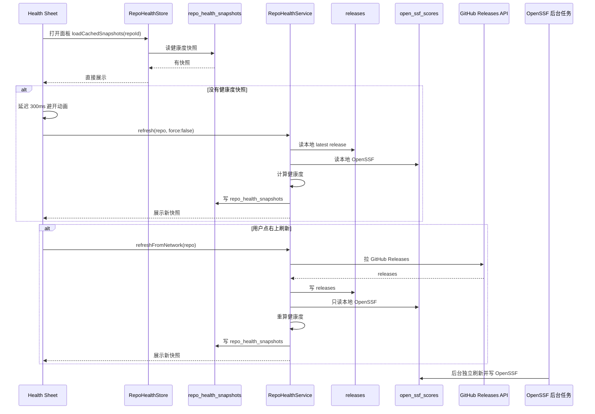
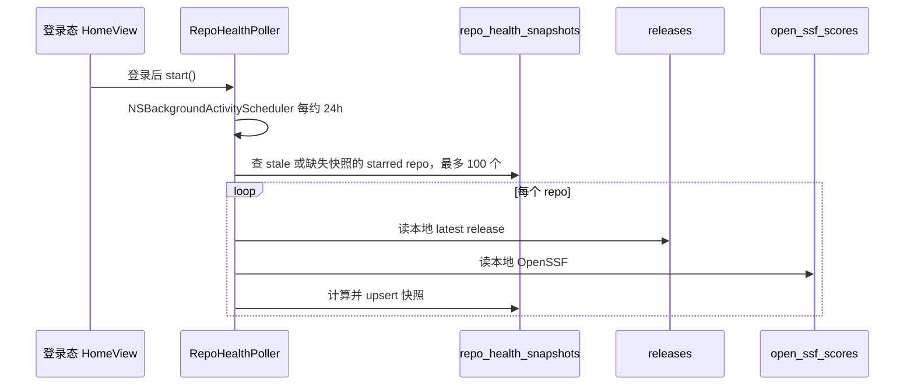

```mermaid
sequenceDiagram
    participant UI as Health Sheet
    participant Store as RepoHealthStore
    participant HDB as repo_health_snapshots
    participant Svc as RepoHealthService
    participant RDB as releases
    participant ODB as open_ssf_scores
    participant GH as GitHub Releases API
    participant OBG as OpenSSF 后台任务

    UI->>Store: 打开面板 loadCachedSnapshots(repoId)
    Store->>HDB: 读健康度快照
    HDB-->>Store: 有快照
    Store-->>UI: 直接展示

    alt 没有健康度快照
        UI->>UI: 延迟 300ms 避开动画
        UI->>Svc: refresh(repo, force:false)
        Svc->>RDB: 读本地 latest release
        Svc->>ODB: 读本地 OpenSSF
        Svc->>Svc: 计算健康度
        Svc->>HDB: 写 repo_health_snapshots
        Svc-->>UI: 展示新快照
    end

    alt 用户点右上刷新
        UI->>Svc: refreshFromNetwork(repo)
        Svc->>GH: 拉 GitHub Releases
        GH-->>Svc: releases
        Svc->>RDB: 写 releases
        Svc->>ODB: 只读本地 OpenSSF
        Svc->>Svc: 重算健康度
        Svc->>HDB: 写 repo_health_snapshots
        Svc-->>UI: 展示新快照
    end

    OBG->>ODB: 后台独立刷新并写 OpenSSF
```

```mermaid
sequenceDiagram
    participant Login as 登录态 HomeView
    participant Poller as RepoHealthPoller
    participant HDB as repo_health_snapshots
    participant RDB as releases
    participant ODB as open_ssf_scores

    Login->>Poller: 登录后 start()
    Poller->>Poller: NSBackgroundActivityScheduler 每约 24h
    Poller->>HDB: 查 stale 或缺失快照的 starred repo，最多 100 个
    loop 每个 repo
        Poller->>RDB: 读本地 latest release
        Poller->>ODB: 读本地 OpenSSF
        Poller->>HDB: 计算并 upsert 快照
    end
```