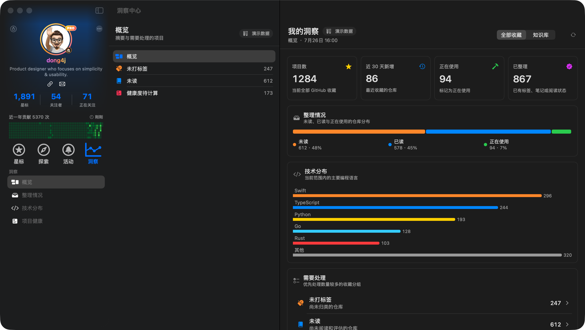
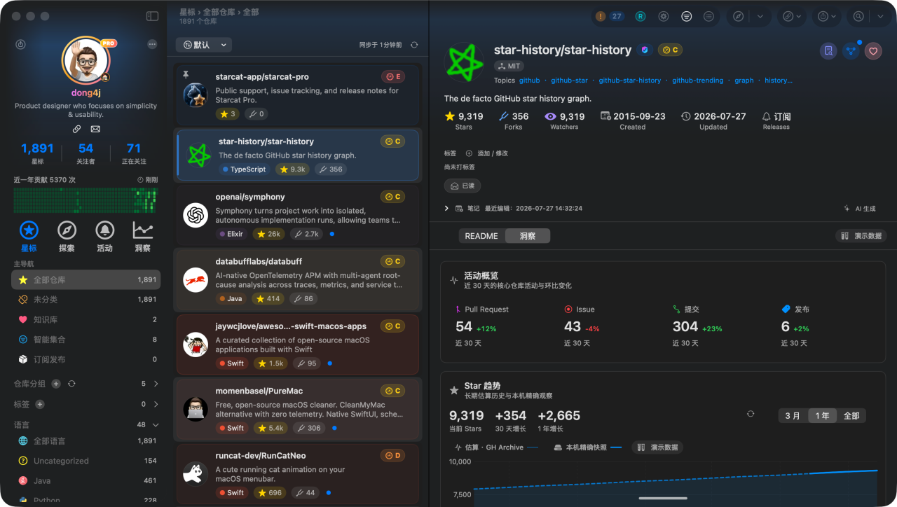

# 洞察中心验收步骤与证据

> 状态：真实 SQLite、GitHub Metrics、Star History 客户端与 Discovery 服务代码已接入；初版截图保留为三栏与信息密度基线，最终完整人工 UI 矩阵待验收
>
> 验收日期：2026-07-27
>
> 验收环境：macOS Debug、简体中文、Dark Mode、主窗口 1440 × 815

## 1. 验收范围

本专项同时验收洞察中心、仓库洞察与 Star 趋势的代码闭环。下列两张截图生成于前端 Mock 阶段，只证明 Starcat 三栏框架、布局密度与区块顺序，不作为真实数据或最终状态矩阵的证据。

- 洞察顶级入口复用 Starcat 现有三栏应用框架。
- “我的洞察”提供全部收藏 / 知识库范围、KPI、整理情况、技术分布、需要处理和覆盖率。
- Manage 详情提供 `README / 洞察`切换，切到洞察后卸载不可见 README `WKWebView`。
- 仓库洞察提供活动 KPI、Star 趋势、提交活动、贡献者、健康度、社区 / 安全信号和最近动态。
- Star 趋势支持 `3 月 / 1 年 / 全部`，区分“估算 · GH Archive”和“本机精确快照”；正式实现已移除演示数据入口。

## 2. 人工验收步骤

### 2.1 我的洞察

1. 启动 Debug App 并保持已登录状态。
2. 点击左侧主导航“洞察”。
3. 检查 Sidebar 的概览、整理情况、技术分布、项目健康。
4. 检查中栏概览、未打标签、未读和健康度待计算。
5. 切换“全部收藏 / 知识库”，确认 KPI 与明细同步替换。
6. 点击刷新按钮，确认只重读本地 Snapshot，不触发全量 Stars 同步。

初版结果：通过。三栏结构、选择状态、KPI 和统计区块无横向溢出。当前真实数据实现仍需按本节步骤重新完成人工终验。



### 2.2 仓库洞察与 Star 趋势

1. 返回“星标”，选择任意已持久化仓库。
2. 在详情 Metadata 下方切换到“洞察”。
3. 检查活动 KPI 与 Star 趋势顺序：活动 KPI → Star 趋势 → Commit activity。
4. 切换 `3 月 / 1 年 / 全部`，确认只改变 Star 趋势观察范围。
5. 检查当前 Stars、30 天增长、1 年增长、来源、覆盖起点、更新时间和精度说明。
6. 切回 README，确认仓库选择不丢失；再次切到洞察，确认页面可重新建立。

初版结果：通过。README Web 内容在洞察模式下从 Accessibility 树消失，证明不可见 `WKWebView` 未保活；Star 趋势首屏在实际 Detail 宽度下无横向溢出。当前真实状态、独立窗口和辅助功能矩阵仍需人工终验。



## 3. 自动化与静态验证

```bash
xcodegen generate
xcodebuild -scheme Starcat -destination 'platform=macOS,arch=arm64' -configuration Debug build
xcodebuild -scheme Starcat -destination 'platform=macOS,arch=arm64' \
  test
jq empty Starcat/Resources/Localizable.xcstrings
git diff --check
```

结果：

- Debug build 通过。
- Starcat 全量 `1800 tests in 209 suites` 通过，0 失败、1 个测试框架已知 issue。
- 洞察 / Star History 定向矩阵 `72 tests in 12 suites` 通过；下钻到数据库列表计数的 `RepoRepositoryTests` 32 项通过。
- `starcat-discovery-api` 的 `make check && go build ./...` 通过。
- String Catalog JSON 与 diff 检查通过。
- 定向测试编译阶段仍会打印既有 `KnowledgeRAGCoreTests` MainActor warning，本轮未新增该 warning。

## 4. 当前仍未验收

以下项目无法由当前自动化替代，保持待验收或待授权：

- 每个“需要处理”数字与真实 Manage 下钻列表的人工逐项核对。
- 主窗口与独立详情窗口的完整交互一致性。
- private / building / empty / failed / stale / offline / rate-limited 的真实运行表现。
- Light Mode、RTL、Increase Contrast、Reduce Motion 和完整 VoiceOver。
- 15 个非中文 / 英文 Locale 的新洞察字符串翻译与布局审阅。
- GH Archive 真实数据质量、扫描字节与成本上限；需要 BigQuery 凭据和预算授权。
- 测试 / 生产环境 Discovery API 联调；需要部署授权。
