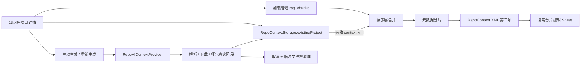

# RepoContext 分片管理实施方案

> 状态：已确认，实施中
> 日期：2026-07-17
> 范围：知识库浏览器单仓库详情中的 RepoContext XML 展示、管理与主动生成
> 关联清单：`RepoContext分片管理Checklist.md`

## 1. 背景与目标

知识库 RAG 的“深度思考”已经能够通过 `RepoAIContextProvider` 读取或生成仓库级 `context.xml`。该 XML 保存在 RepoContext 本地缓存中，不属于普通向量分片，也不会写入 `rag_chunks`。当前知识库浏览器只读取数据库中的普通分片，因此即使项目已经存在有效 XML，用户也无法在“已入库分片”列表中查看或管理它。

本方案将 RepoContext XML 作为一种“特殊托管分片”投影到知识库详情，不改变索引和数据库语义，并补齐主动生成、真实阶段进度、取消、编辑、删除与下载能力。

## 2. 已确认的产品约束

### 2.1 列表位置与统计

- 有效 `context.xml` 固定展示在元数据分片之后，也就是列表第二项；其余普通分片保持原顺序。
- RepoContext 不新增 `RAGChunkSource`，不伪造 `rag_chunks` 数据，不参与 embedding、召回、分页或普通分片覆盖率统计。
- 详情页单独展示 RepoContext `0 / 1` 状态，普通分片总数、可用、待处理、失败、过期等指标继续只表达数据库索引状态。
- XML 不存在时不展示空行，由详情页主动生成入口表达可用操作。

### 2.2 查看、编辑与删除

- 点击 RepoContext 行直接复用现有 `KnowledgeRAGChunkEditor` sheet，不使用 popover。
- 标题固定为 `RepoContext XML`，路径固定为 `context.xml`；XML 正文使用等宽编辑器并允许修改。
- 保存前必须解析 XML，并验证根节点为 `<repository>`；校验失败时保留 sheet 和草稿，展示可读错误。
- 保存采用 UTF-8 原子写入，并同步更新 `metadata.json` 中的 `actualTokens`、`contextXmlBytes`、`lastAccessedAt` 等派生数据。
- 行尾删除操作使用现有破坏性确认样式；确认后删除完整 RepoContext 产物目录中的 `context.xml` 与 `metadata.json`，不写 tombstone，允许后续重新生成。
- 手工编辑的是实际缓存文件。后续 commit、配置或用户主动重新生成触发缓存失效时，允许生成结果覆盖手工版本。

### 2.3 主动生成与更新

- 知识库详情“已入库分片”区域增加“生成 RepoContext XML”入口；已有 XML 时文案切换为“重新生成 RepoContext XML”。
- 入口复用 `AppDependencies.repoAIContextProvider`，不得复制 branch、ZIP 下载、RepoPack、缓存键或降级逻辑。
- 全局 `aiRepoContextEnabled` 关闭时不静默修改设置；禁用操作并引导用户前往 AI 设置开启。
- 生成期间锁定重复生成、编辑和删除，避免同一目录并发读写。

### 2.4 真实阶段进度与取消

生成状态机固定为：

`idle → resolving → downloading → packing → succeeded / failed / cancelled`

- `resolving`：解析默认分支、commit 与缓存键；
- `downloading`：下载仓库 ZIP；命中正式 ZIP 缓存时可跳过；
- `packing`：解压、扫描并生成 XML；
- 不展示无法由底层真实测量的伪百分比，使用阶段进度、当前说明和活动指示器；
- 活动阶段图标默认转圈，hover 或键盘 focus 时切换为 `stop.circle.fill`，点击后立即取消；
- 取消会 `Task.cancel()`，调用 `cleanupTemporaryContextPreparation`，只清理 `.tmp` 和未完成产物，保留已完成 ZIP 与旧的有效 XML；
- 切换仓库、关闭知识库窗口时执行同样的取消与窄清理；
- `CancellationError` 不转换成失败；取消后收起进度，失败态保留可重试入口；
- 成功后立即刷新第二行，可短暂显示完成态后收起。

### 2.5 XML 下载

- RepoContext 编辑 sheet header 增加 `square.and.arrow.down` 下载按钮，关闭仍使用 `SheetCloseButton`。
- 使用 `NSSavePanel`，文件类型限定 XML，默认文件名为 `<owner>-<repo>-context.xml`。
- 下载内容以当前编辑器草稿为准，包括尚未保存的修改；下载不会改变本地缓存或编辑器脏状态。
- 使用 UTF-8 原子写入；用户取消面板时静默返回，写入失败在 sheet 中展示错误。

## 3. 架构与数据流

展示层使用独立的 RepoContext 行模型与普通 `RAGManagedChunk` 组成联合列表。这样可以复用现有行布局和 sheet 交互，又不会让一个仓库级 XML 冒充数据库分片。

## 4. 实现分层

### 4.1 存储与领域能力

在 `RepoContextStorage` 或紧邻的专用服务中补齐：

- 读取可展示的 XML 与 metadata；
- 校验 `<repository>` XML；
- 原子保存编辑后的 XML并刷新 metadata；
- 导出当前草稿；
- 删除项目产物；
- 为 UI 提供稳定、可单测的结果和错误语义。

token 统计复用现有 RepoContext token 估算口径，避免编辑后 UI 与深度思考读取的 metadata 不一致。

### 4.2 浏览器 ViewModel

`KnowledgeRAGBrowserViewModel` 增加：

- 当前项目 RepoContext 快照；
- 生成阶段、错误和当前 `Task`；
- 加载、保存、删除、生成、取消与生命周期清理方法；
- 项目切换时取消旧任务并拒绝过期结果回写；
- XML 变更后仅刷新特殊分片和独立状态，不触发普通 RAG 重建。

### 4.3 SwiftUI 视图

- 分片 header 增加主动生成/重新生成入口及 RepoContext `0 / 1` 状态；
- 进度区复用主窗口 AI 摘要的三阶段 chip 与就地停止交互；
- 元数据行后插入 RepoContext 行；
- 行点击打开现有编辑 sheet；
- 行尾删除进入确认；
- editor header 增加下载，保存支持校验错误且失败时不 dismiss；
- 所有固定文案进入 `Localizable.xcstrings`，sheet 根继续挂 `.appLocaleEnvironment()`。

## 5. 并发、取消与一致性

- 生成任务由 `@MainActor` ViewModel 持有，任何 UI 状态只在主 actor 更新。
- 每次开始生成记录 repo identity；异步返回时再次核对当前项目，防止切换仓库后把旧结果写到新页面。
- `defer` 负责清空任务引用，但只有仍属于当前任务时才能改变可见状态。
- 保存、删除与生成互斥；下载只读取当前草稿，可与未保存编辑并存。
- 取消只清未完成临时文件，不删除有效缓存；删除是独立、明确确认的用户操作。

## 6. 测试与验收

### 6.1 单元测试

- 有效 XML 读取与第二项排序；
- 非法 XML、错误根节点保存失败且原文件不变；
- 合法编辑保存后 XML 与 metadata 同步；
- 删除完整产物且可重新生成；
- 导出使用当前草稿且不修改缓存；
- 生成状态映射、缓存命中、普通失败与 `CancellationError`；
- 取消只清 `.tmp`，保留正式 ZIP 与旧 XML；
- repo 切换/视图消失拒绝过期任务回写。

### 6.2 工程门禁

- `xcodegen generate`（仅在新增或删除 Swift 文件时）；
- RepoContext / Knowledge RAG 相关定向测试；
- 全量 `StarcatTests`；
- `Starcat` 与 `StarcatDirect` Debug build；
- `jq empty Starcat/Resources/Localizable.xcstrings`；
- i18n 禁用 API 扫描与 `git diff --check`。

### 6.3 人工 UI 边界

自动化不能冒充真实用户点选。最终报告会单列人工验收步骤：第二项顺序、长仓库进度、hover/focus 停止、取消后缓存保留、编辑错误不关闭、下载未保存草稿和删除确认。

## 7. 审查与提交策略

- 方案、每个小功能、测试/文档补齐、每轮审查报告、每个审查修复和最终结果报告分别使用中文 commit message 提交；
- 至少执行三轮审查：架构/数据/取消，UI/功能/i18n，测试/文档/工程进度一致性；
- 每轮必须先新增并提交审查报告，再修复发现的问题；
- 最后一轮清洁复审无新增缺口后，才回填全部 Checklist 并生成结果报告；
- 不 push，不执行打包、发布或上传；
- `docs/功能实现总览.md` 本轮只读，等待 dong4j 单独授权后再同步。

## 8. 明确不做

- 不新增或修改 v7 RAG 数据库 schema；
- 不把 RepoContext 写入 `rag_chunks`、embedding、CloudKit 或普通消息；
- 不把 XML 计入普通分片统计；
- 不提供虚假字节百分比；
- 不静默开启全局 RepoContext 设置；
- 不删除用户已完成的 ZIP 缓存作为取消副作用；
- 不执行 push、打包、发布或上传。
