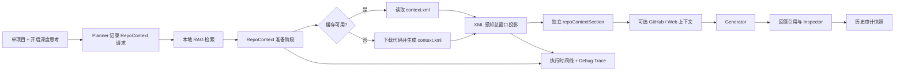

# RepoContext 深度思考实施方案

> 状态：已确认，待按 Checklist 实施
> 日期：2026-07-17
> 范围：知识库 RAG 工作台单项目问答
> 关联清单：`RepoContext深度思考Checklist.md`

## 1. 背景与目标

知识库 RAG 当前主要依赖 README、笔记、AI 摘要、元数据分片，以及按需取得的 GitHub / External Search 临时上下文。对于“这个项目的代码如何组织”“某条调用链在哪里”“实现是否符合仓库现状”一类问题，仅靠已有分片不能稳定提供完整的仓库级代码上下文。

本方案在 RAG Composer 增加一个图标形式的“深度思考”开关。用户明确选中一个知识库项目并开启后，RAG 复用 `RepoAIContextProvider.contextOutcome` 生成或读取 RepoContext XML，将其作为独立上下文加入 Planner、执行时间线、Generator Prompt、引用、Inspector、Debug Trace 和历史审计。

目标不是把一段 XML 简单拼进提示词，而是让用户可以回答以下问题：

- 本轮是否启用了项目代码上下文；
- 上下文来自哪个项目、commit 和缓存状态；
- 生成过程中当前执行到哪一步；
- 实际发送了多少 RepoContext token，是否因模型总上下文窗口做过投影；
- 回答是否引用了 RepoContext；
- 历史会话能否准确说明当时使用的 RepoContext，而不会误展示后来的版本；
- Debug Trace 能否完整定位准备、裁剪、注入和生成问题，同时避免无意义地重复保存 XML。

## 2. 已确认的产品约束

### 2.1 Composer 顺序

输入框右侧操作顺序固定为：

1. 附件；
2. 联网搜索；
3. 深度思考；
4. 发送 / 停止。

深度思考使用 `brain` SF Symbol，不显示常驻文本。按钮必须提供 tooltip 与 accessibility label。关闭态使用 `.secondary`，开启态使用 `.accentColor` 和低透明度圆形背景，尺寸、hover、focus 行为与联网搜索按钮一致。

### 2.2 启用条件

深度思考只允许在“恰好选择一个项目”时开启：

- 0 个项目：不可开启；
- 1 个项目：可开启；
- 2 个及以上项目：不可开启；
- 附件数量不参与判断，不限制开启；
- 已开启后如果项目选择变为 0 个或多个，立即关闭深度思考，避免发送时目标歧义；
- 发送前由 ViewModel / Service 再做一次约束校验，UI 禁用不是唯一安全边界。

项目必须来自当前知识库显式 repo scope，Planner 不允许自行发明或扩大 RepoContext 目标。

### 2.3 持久化方式

深度思考与联网搜索采用相同的 Composer 草稿持久化语义：

- 按会话保存；
- 切换会话后恢复各自状态；
- 关闭并重新打开工作台后恢复；
- 新会话使用默认关闭状态；
- 发送后是否保留开关状态与现有联网开关保持一致；
- 恢复草稿时若当前 repo scope 不再是单项目，强制恢复为关闭。

该状态进入 `RAGComposerContext`、`RAGComposerDraftSnapshot` 和请求快照，避免流式回答期间被后续 UI 操作改变。

### 2.4 独立 Prompt 占位符

RepoContext 不合并进现有 `{evidenceSection}`，Generator Prompt 新增独立占位符：

```text
{repoContextSection}
```

Prompt Builder 分别构建：

- `{evidenceSection}`：本地 RAG 分片、结构化分析与引用标记；
- `{repoContextSection}`：单项目 RepoContext XML、来源说明、commit、内容 hash 与引用标记；
- `{remoteContextSection}`：GitHub / External Search 临时上下文；
- `{attachmentSection}`：附件上下文。

本功能尚未上线，不存在用户自定义旧模板兼容负担，因此默认模板、占位符验证和设置页说明直接切换到新协议，不保留“双写 evidence”或隐式 fallback。

### 2.5 Token 预算边界

RepoContext XML 不受 RAG 分片的 `evidenceTokenBudget`、topK、每项目 child cap 或 chunk hard cap 限制。它拥有独立的 `repoContext` 上下文段和独立配置预算，默认复用 `AppSettings.aiRepoContextTokenBudget`。

RepoContext 仍必须服从模型的总上下文窗口，预算优先级为：

1. system prompt、当前问题和输出保留预算不可被 RepoContext 挤占；
2. RepoContext 不与 evidence 争用“分片预算”；
3. 总窗口不足时，先按现有规则压缩历史和低优先级上下文；
4. 仍不足时，对 RepoContext 做 XML 感知投影，保留合法根节点、目录结构、入口点和完整文件元素，不做破坏 XML 的字符硬截断；
5. Inspector、Plan 和 Debug Trace 展示配置 token、原始 token、实际发送 token及投影原因。

“不受 chunk context token budget 限制”不等于可以突破模型总上下文窗口。

## 3. 端到端流程



实际状态机顺序为：

`思考规划 → 思考 → 检索知识库 → 深度思考 → 联网搜索（可选）→ 思考 → 生成回答`

其中“深度思考”是 RepoContext 准备步骤，不与模型内部 reasoning 混为一谈。运行中展示缓存检查、下载/打包、XML 生成、上下文投影等真实子状态；完成后自动折叠，失败时显示降级原因并允许后续证据继续回答。

## 4. 数据模型与边界

### 4.1 请求与计划

新增请求快照字段：

- `deepThinkingEnabled: Bool`；
- `repoContextRequest: RAGRepoContextRequest?`，由本地代码根据唯一显式项目构造；
- Planner Prompt 只收到开关、目标 repo identity 和能力说明，不收到 RepoContext XML；
- `RAGQueryPlan` / `RAGUserVisiblePlan` 保存标准化请求与面向用户的规划说明。

Plan Inspector 展示：启用状态、目标项目、请求原因、配置预算、实际 outcome、cache hit、commit SHA、原始/发送 token 和投影状态。

### 4.2 运行结果

新增 `RAGRepoContextSnapshot`，保存可审计元数据：

- repo id、full name；
- commit SHA；
- 内容 hash；
- 配置 token、原始 token、实际发送 token；
- cache hit / generated；
- success / degraded / unavailable；
- 是否投影及原因；
- citation marker；
- preparedAt。

XML 正文只作为本轮内存态传递，不新增一份会话数据库正文副本。历史恢复时，仅当 `RepoContextStorage` 中 repo + commit + hash 与历史快照一致时才加载预览；不一致时显示“历史项目代码上下文不可用”，绝不把新 XML 冒充旧证据。

### 4.3 Provider 装配

`AppDependencies` 提升并复用统一的 `RepoAIContextProvider`，注入 `KnowledgeRAGService`。RAG 不复制下载、缓存、RepoPack 或错误降级逻辑。

Provider 取消继续向上传播；普通准备失败转换为 degraded 结果。临时下载文件遵循现有清理语义。

## 5. Prompt 与上下文预算

### 5.1 RepoContext Section 结构

建议输出结构：

```text
## Project code context
[S7] Repository: owner/name
Commit: abcdef...
Content-Hash: ...
The following XML is a repository-level code context snapshot.

<?xml version="1.0" encoding="UTF-8"?>
<repository>...</repository>
```

RepoContext 获得普通 `[S<n>]` 引用标记，但不伪装成数据库 chunk。

### 5.2 XML 感知投影

新增纯函数投影器，输入 XML 与可用 token，输出合法 XML 和统计：

- 优先保留 XML declaration、`repository` 根信息、`directoryStructure`、`entryPoints`；
- `keyFiles` / `fileList` 仅按完整元素纳入；
- 被省略时在 XML 内添加明确的 truncation metadata；
- 不截断 XML tag，不生成无法解析的半段内容；
- 投影结果就是实际进入 Prompt 和 Inspector “本轮发送内容”的版本。

### 5.3 证据门禁

成功且非空的 RepoContext 属于真实证据。即使本地分片检索为空，只要 RepoContext 成功，也允许进入 Generator。RepoContext 失败且其他来源也无证据时，仍走现有无证据拒答。

## 6. 引用与 Inspector

### 6.1 引用模型

新增专用 citation source `repoContext`，不扩展用于索引建表和 source coverage 的 `RAGChunkSource`。RepoContext citation：

- `chunkID = nil`；
- `source = repoContext`；
- `hitKind = repoContext`；
- `sectionTitle = context.xml · <short SHA>`；
- `sourceURL = GitHub commit/tree URL`；
- marker 与 Prompt 中 `[S<n>]` 一致。

数据库现有 citation TEXT 字段和 nullable `chunk_id` 可承载该类型，不需要修改已发布 RAG schema。

### 6.2 Evidence Inspector

Evidence 页在知识库元数据与普通引用之间新增“项目代码上下文”区：

- 即使回答未引用，只要本轮成功注入也展示；
- 展示项目、commit、context.xml、内容 hash、cache/generated、token 与投影状态；
- 默认展示 5 行等宽预览；
- 支持完整 popover 与复制，复用 `CopyFeedbackButton`；
- 点击正文 RepoContext 引用时自动切换 Evidence 页、展开并定位该区；
- RepoContext 的 `chunkID == nil` 不显示“分片已删除”。

Inspector 中 RepoContext 计数独立于 RAG 分片数量，避免把一个仓库级 XML 误报成一个数据库分片。

## 7. 执行时间线与 Debug Trace

### 7.1 执行步骤

新增 `RAGExecutionStepKind.repoContext`，事件至少覆盖：

- prepared：目标与预算已确定；
- progress：检查缓存、获取仓库、生成 XML、投影；
- completed：成功、降级或不可用，含耗时和摘要。

时间线标题使用“深度思考”，详情使用真实动作，不展示笼统的假进度。

### 7.2 Debug Stage

新增独立 Debug stages：

- `repoContextRequest`：目标、配置预算、请求原因；
- `repoContextResponse`：provider outcome、commit、hash、cache、原始 token、耗时；
- `repoContextProjection`：总窗口可用量、实际发送 token、是否投影、原因。

Debug 列表、导出 JSON/Markdown、历史回放和字节计数都必须保留这些结构化 payload。最终 `.prompt` stage 本身已经包含实际发送 XML，因此上述 stage 只保存摘要，不重复存储 XML 正文。

Debug 模式仍可能把完整 Prompt（含 RepoContext XML）写入本地 Debug 文件；帮助文案必须明确其隐私边界，清理行为沿用当前会话 Debug 清理能力。

## 8. 降级、错误与取消

- 单项目条件在 UI、请求快照和 Service 三层校验；
- Provider 普通失败：深度思考步骤标记 degraded，保留本地分片/附件/网络证据继续回答；
- Provider 取消：取消整轮问答，不转换成 degraded；
- XML 空内容或解析失败：不得作为有效证据；
- 模型总窗口过小且无法生成合法最小投影：RepoContext 降级，不破坏其他上下文；
- 历史 XML 不匹配：只展示元数据与不可回放提示；
- 私有仓库身份和 XML 不进入 External Search query；
- RepoContext 不写 `rag_chunks`、notes、CloudKit 或普通消息正文。

## 9. 预计改动面

| 层 | 主要文件 | 目标 |
|---|---|---|
| Composer / ViewModel | `RAGWorkspaceAnswerSurface.swift`、`KnowledgeRAGWorkspaceViewModel.swift` | 开关、单项目约束、草稿持久化、请求快照 |
| Models / Planner | `KnowledgeRAGModels.swift`、`KnowledgeRAGQueryPlanner.swift` | request、plan、snapshot、citation source、execution kind |
| Provider / Service | `RepoAIContextProvider.swift`、`KnowledgeRAGService.swift`、`AppDependencies.swift` | 统一 Provider、执行阶段、证据门禁、Debug events |
| Prompt / Budget | `KnowledgeRAGPromptBuilder.swift` 及上下文预算模型 | 独立占位符、XML 投影、独立 segment |
| Timeline / Inspector | `RAGExecutionTimeline.swift`、`RAGWorkspaceInspector.swift` | 步骤、Plan、Evidence、引用定位、Debug stage |
| Persistence | RAG conversation store / snapshot 编解码 | 草稿开关、审计元数据、历史准确回放 |
| i18n | `Localizable.xcstrings` | tooltip、步骤、Plan、Inspector、错误与隐私说明 |
| Tests | `StarcatTests/KnowledgeRAGCoreTests.swift` 等 | 状态、预算、Prompt、Provider、引用、持久化与 UI model |

## 10. 验收标准

- Composer 顺序严格为“附件 → 联网搜索 → 深度思考 → 发送”；
- 只有恰好一个项目时可开启，附件数量不影响；
- 开关按会话持久化，行为与联网开关一致；
- Generator 模板存在且强制使用独立 `{repoContextSection}`；
- RepoContext 不受 chunk evidence budget 限制，但不会突破模型总上下文窗口；
- 成功 RepoContext 可单独满足证据门禁；
- 运行中可见真实“深度思考”步骤，Debug 有独立结构化 stages；
- Plan、Evidence、引用、历史回放能准确解释 RepoContext；
- Inspector 可查看本轮实际发送 XML 预览，不把它计入普通分片；
- 普通失败可降级，取消语义不丢失；
- Debug、历史和私有仓库边界符合现有隐私约束；
- 定向测试、全量测试、双 Debug target build、i18n JSON 与 diff check 通过；
- Checklist 全部回填，至少三轮审查报告完成，最终结果报告落档；
- 不 push；每个小功能与每轮审查/修复分别使用中文 commit message 提交。

## 11. 明确不做

- 不把 RepoContext 建成 `rag_chunks`；
- 不支持多项目合并 RepoContext；
- 不因附件数量禁用深度思考；
- 不新增旧 Prompt 模板兼容双轨；
- 不让 Planner 自行选择 RepoContext 项目；
- 不把 RepoContext XML 持久化到普通消息、CloudKit 或索引；
- 不执行打包、发布或 push。
