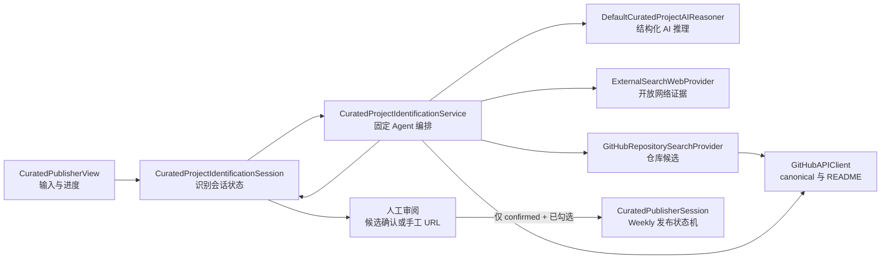
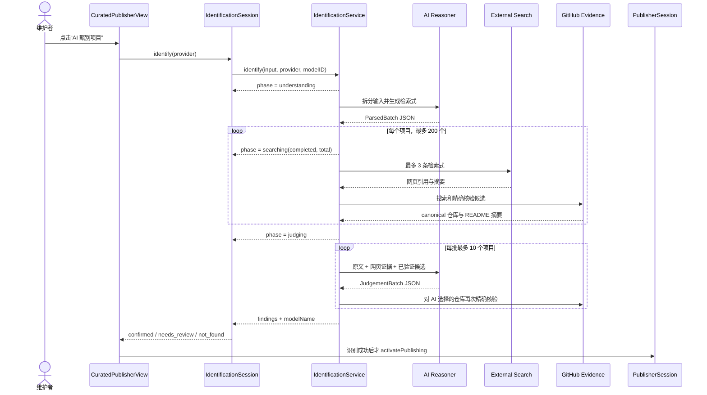

# 精选发布台 Agent 项目识别机制详解

## 1. 这套机制解决什么问题

精选发布台接受的不是一种固定格式。输入可能是一条 GitHub URL，也可能是一段新闻、一个产品名、一页网页、几条笔记，或多个项目混在一起的清单。仅靠正则表达式和 GitHub Search 无法判断“这段话实际在说什么”“哪个仓库属于原始发布主体”“同名仓库是不是第三方实现”。

因此，Starcat 把项目识别实现为一条受约束的 Agent 工作流：AI 负责理解、规划检索和基于证据做判断；External Search 与 GitHub API 负责提供可核验事实；客户端代码负责限制工具范围、验证 AI 输出并保留人工确认权。

这里的 Agent 不是可以任意调用工具、无限循环或自主发布内容的通用 Agent Runtime。它是一条由客户端固定编排的三阶段工作流：

1. 理解并拆分输入。
2. 按项目收集外部证据和 GitHub 候选。
3. 让 AI 在已验证候选中作出判断，再由代码执行防幻觉校验。

Agent 到此结束。它没有 weekly-api client，也没有管理员密钥，不能创建分类或发布项目。

## 2. 总体架构



依赖在 `AppDependencies` 中一次性装配：

- `DefaultCuratedProjectAIReasoner` 复用 Starcat 的 AI Provider、模型参数和 Keychain。
- `ExternalSearchWebProvider` 复用 Starcat External Search 配置。
- `GitHubRepositorySearchProvider` 复用现有 GitHub 搜索与仓库数据模型。
- `DefaultCuratedRepositoryEvidenceProvider` 将 GitHub 搜索、精确地址核验和 README 摘要封装为事实工具。
- `CuratedProjectIdentificationSession` 只持有识别服务，不持有 Weekly API。
- `CuratedPublisherSession` 单独持有管理员发布 API，形成明确的权限边界。

## 3. 从按钮点击到识别完成



### 3.1 UI 和会话层

`CuratedPublisherView` 只负责读取输入、选择模型、展示阶段进度和发起任务。识别期间 UI 依次显示：

- `understanding`：正在理解并拆分输入。
- `searching(completed, total)`：正在逐项检索并核验。
- `judging`：正在审阅证据并判断官方仓库。
- `idle`：识别结束或发生错误。

`CuratedProjectIdentificationSession` 是窗口内的状态所有者。它保存输入、模型、结果、当前选中项和勾选集合。输入在空闲状态发生变化时，旧结果会被清空，避免用户修改线索后误用上一轮判断。

识别成功后，只有 `confirmed` 且存在 repository 的结果默认进入 `includedFindingIDs`。`needs_review` 和 `not_found` 不会自动进入发布集合。

## 4. 第一阶段：理解和拆分输入

服务先调用一次 AI，phase 标记为 `curated_identification_parse`。请求使用 JSON Object 响应格式，要求模型把原始输入按顺序拆成结构化条目：

```json
{
  "items": [
    {
      "id": 0,
      "original_text": "原始线索",
      "title": "项目或产品标题",
      "entity_type": "open_source_project",
      "source_url": "https://example.com/article",
      "explicit_repository": null,
      "search_queries": [
        "项目名 发布主体 official GitHub",
        "项目名 GitHub repository"
      ]
    }
  ]
}
```

系统 Prompt 对模型设置了几个关键约束：

- 新闻标题不等于仓库名，必须先识别真实发布主体。
- 需要区分开源项目、产品、服务、论文、模型、硬件和未知实体。
- 每个项目最多生成三条联网检索式。
- 只有原文明确给出 GitHub 仓库时，才能填写 `explicit_repository`。
- 不允许根据名称猜测 GitHub 地址。

客户端不信任模型返回的原始 `id`，会按当前批次顺序重新编号，保证后续证据和判断能稳定对应。

如果模型没有返回可解析 JSON、字段不符合契约或条目为空，整次识别失败并向 UI 返回错误，不会尝试从自由文本中“猜一个大概结果”。

## 5. 第二阶段：Agent 使用工具收集证据

拆分完成后，客户端逐项目构建 `EvidenceBundle`。每个证据包包含：

- 原始条目与 AI 生成的检索计划。
- 开放网络搜索结果。
- 已由 GitHub 路径核验的仓库候选。
- 有限长度的 README 摘要。

### 5.1 显式 GitHub 地址

如果第一阶段识别到原文中存在明确 GitHub 地址，服务首先解析为 `GitHubRepositoryAddress`，然后调用 `verify(address:)`。

核验不是检查字符串长得像 URL，而是执行精确 GitHub 查询 `repo:owner/repo`，并要求返回结果的标准化 `owner/repo` 与输入完全一致。无法查询到精确仓库时，该地址不会成为候选。

### 5.2 开放网络检索

每个条目最多执行三组 AI 生成的检索式。每组请求通过用户在 Starcat 中配置的 External Search Provider 发起，范围为 Web，最多取 6 条结果。

网页结果提供项目归属、发布主体、产品与仓库关系等 GitHub API 本身无法回答的上下文。证据包含标题、规范化 URL 和可用的摘要。

单组 Web Search 失败时会被忽略，Agent 继续处理其他检索式和 GitHub 候选。这能避免一个外部搜索请求失败导致整批项目全部丢失，但最终证据不足时仍应由判断阶段返回 `needs_review` 或 `not_found`。

### 5.3 GitHub 候选检索

同一组检索式也会送入 `GitHubRepositorySearchProvider`，每次最多取 8 个仓库。候选复用 Starcat 的 `RepositoryCandidate`，包含标准化 owner/name、描述、fork、archived 等仓库事实。

所有候选按标准化 `owner/repo` 去重。开放网络结果中出现的 GitHub URL 也不能直接当作事实：服务只检查前 12 个网页引用，解析出 GitHub 地址后再次执行精确核验，通过后才加入候选集合。

### 5.4 README 证据

每个条目最多为前 4 个候选读取 README。README 只取清理后的前 2,000 个字符，用于判断仓库是否确实属于线索中的项目、产品或发布主体。

README 是辅助归属证据，不是必须条件。读取失败不会让整次识别失败，也不会绕过后续的 canonical 仓库核验。

### 5.5 请求规模边界

为了避免自然语言批次无限放大网络请求和模型上下文，当前实现设置了固定上限：

| 环节 | 上限 |
| --- | --- |
| 单次输入处理的项目 | 200 个 |
| 每个项目的检索式 | 3 条 |
| 每条 Web 检索结果 | 6 条 |
| 每条 GitHub Search 候选 | 8 个 |
| 从 Web 结果二次核验的 GitHub URL | 12 个 |
| 读取 README 的候选 | 4 个 |
| 单份 README 摘要 | 2,000 字符 |
| 发送给判断模型的网页证据 | 前 8 条 |
| 发送给判断模型的仓库候选 | 前 8 个 |
| 单次判断批次 | 10 个项目 |

这些限制是 Agent 的执行预算，不是 UI 展示限制。

## 6. 第三阶段：基于证据作出判断

证据收集完成后，服务把项目按每批 10 个切分，再调用 AI。phase 标记为 `curated_identification_judge`。

模型看到的不是裸项目名，而是一个结构化证据包：

- 原始线索、标题、实体类型和来源 URL。
- Web 证据的标题、URL 和摘要。
- 已验证 GitHub 候选的 URL、描述、fork、archived 和 README 摘要。

判断 Prompt 要求模型严格返回以下三种状态：

| 状态 | 含义 | 是否可发布 |
| --- | --- | --- |
| `confirmed` | 证据足以确认官方仓库 | 是，但仍可人工取消勾选 |
| `needs_review` | 存在多个合理候选或证据不足 | 否，必须人工确认 |
| `not_found` | 没有对应官方仓库 | 否 |

模型还必须遵守以下规则：

- 只确认与原始发布主体直接对应的官方仓库。
- 排除 fork、镜像、占位仓库、同名无关项目、第三方实现、上游项目和配套工具。
- 闭源产品、云服务、论文、模型权重或硬件没有官方仓库时返回 `not_found`。
- `repository` 只能从本轮 `verified GitHub candidates` 中选择。
- 证据不足时返回 `needs_review`，不能用语言自信度代替事实。

## 7. 防幻觉与失败关闭

AI 返回 `confirmed` 并不代表结果会直接被接受。`materializeFindings` 会执行第二层代码守卫：

1. 解析 AI 返回的 `owner/repo`。
2. 确认它已经存在于当前项目的候选集合。
3. 再次调用 GitHub 精确核验。
4. 三步都成功后才写入 `repository`。

如果 AI 声称确认了一个未出现在候选集合中的仓库，或精确核验失败，状态会从 `confirmed` 强制降级为 `needs_review`，repository 置空。也就是说，模型无法通过编造一个看似合理的 GitHub 地址绕过证据层。

其他失败策略如下：

- AI 返回非法 JSON：整次识别失败，不生成部分可发布结果。
- 单条 Web Search 或 GitHub 候选搜索失败：保留其他证据，继续运行。
- README 获取失败：继续判断，但证据可能不足。
- AI 漏掉某个条目的判断：该条目默认 `needs_review`。
- AI 给出证据 URL：只展示本轮真实 Web 引用中匹配的 URL；不匹配时回退展示已收集的前 4 条证据。

## 8. 人工复核如何改变结果

Agent 的输出是建议和证据，不是最终发布命令。

对于 `needs_review`：

- 维护者可以从已经过 GitHub 核验的候选列表中选择一个仓库。
- 也可以输入新的 GitHub URL，但该 URL 仍必须经过 `verify(repositoryURL:)` 精确核验。
- 核验成功后，会话才把该 finding 升级为 `confirmed` 并加入勾选集合。

`not_found` 不会自动发布；如果维护者掌握新的官方仓库地址，也必须通过同一人工 URL 核验流程。

最终可交给发布会话的集合始终满足两个条件：

```text
includedFindingIDs 包含该条目
AND
finding.status == confirmed
AND
finding.repository != nil
```

## 9. AI 模型和凭据如何使用

发布台模型菜单来自 Starcat 已启用的非 Embedding 模型。运行时：

1. 如果用户在发布台选择了模型，Reasoner 在已启用 Provider 中解析对应模型与参数。
2. 如果没有显式选择，则回退到 Starcat 当前 AI Chat 任务配置。
3. API Key 通过 Provider ID 从 Keychain 读取。
4. 使用现有 `OpenAIClient` 发送 JSON Object 请求。
5. 用量记为 `AIUsageContext(feature: .agent, phase: ...)`，拆分和判断分别记录 phase。

模型 API Key、GitHub Token、External Search Key 和 weekly-api 管理员密钥不会被写进 Prompt。需要注意的是，为完成识别，原始项目线索、Web 搜索摘要、候选仓库元数据和 README 摘要会发送给用户选择的 AI Provider。

## 10. 为什么识别阶段不访问 Weekly

识别服务的构造函数只接受三个依赖：

```swift
reasoner: CuratedProjectAIReasoning
webProvider: SearchProvider
repositories: CuratedRepositoryEvidenceProviding
```

它没有 `CuratedPublisherAPIClient`，因此从架构上无法查询分类、检查导入记录或提交仓库。

窗口打开时，发布会话的 `bootstrap` 也只恢复本机凭据状态，不请求 Weekly。只有识别任务成功返回后，View 才把 `publishableFindings` 传给 `CuratedPublisherSession.activatePublishing`。从这一刻开始，发布会话才允许连接管理员接口、读取分类和恢复批次。

这条边界有三个目的：

- 项目真实性判断不受 Weekly 是否已有同名条目影响。
- 识别失败或用户取消时不会产生管理员 API 请求。
- Weekly 的去重继续由服务端按 `source_code + owner/repo` 负责，客户端不建立第二套去重规则。

## 11. 测试如何证明这些约束

识别相关测试集中在：

- `CuratedProjectIdentificationServiceTests`：自然语言拆分、证据搜索、模型 phase、防幻觉、闭源项目、非法 JSON、手工核验。
- `CuratedProjectIdentificationSessionTests`：默认勾选、候选升级、人工 URL 核验和错误状态。
- `CuratedPublisherSessionTests`：窗口启动零 Weekly 请求、识别完成后激活、权限和发布前校验。

其中几个核心回归场景是：

- 自然语言输入必须经历 `curated_identification_parse` 和 `curated_identification_judge` 两次 AI phase。
- AI 返回未收集到的 `invented/project` 时，结果必须降级为 `needs_review`。
- 闭源服务没有官方仓库时保持 `not_found`，不能为了完成任务强配一个仓库。
- AI 返回非 JSON 时必须失败关闭。
- 只有确认且勾选的 finding 才能进入发布集合。

## 12. 关键代码索引

| 职责 | 文件 |
| --- | --- |
| 三阶段 Agent 编排、Prompt 与防幻觉 | `Starcat/Features/CuratedPublisher/CuratedProjectIdentificationService.swift` |
| finding、状态、证据和进度模型 | `Starcat/Features/CuratedPublisher/CuratedProjectIdentificationModels.swift` |
| 窗口识别状态与人工复核 | `Starcat/Features/CuratedPublisher/CuratedProjectIdentificationSession.swift` |
| 三栏 UI、进度展示与发布交接 | `Starcat/Features/CuratedPublisher/CuratedPublisherView.swift` |
| AI、搜索、GitHub 与发布依赖装配 | `Starcat/App/AppDependencies.swift` |
| Agent 识别单元测试 | `StarcatTests/CuratedProjectIdentificationServiceTests.swift` |
| 识别会话单元测试 | `StarcatTests/CuratedProjectIdentificationSessionTests.swift` |
| Weekly 隔离与发布状态测试 | `StarcatTests/CuratedPublisherSessionTests.swift` |

## 13. 当前边界与后续演进

当前实现刻意不具备以下能力：

- 不让模型自由决定调用哪些工具或调用多少次。
- 不并行运行多个自主子 Agent。
- 不允许 AI 直接生成可发布仓库地址。
- 不让 Agent 接触 weekly-api 管理员凭据。
- 不自动发布任何结果。

如果未来需要提高复杂线索的识别率，应优先增强证据质量、检索计划和可观测性，而不是放宽 `repository` 必须来自已验证候选这一守卫。无论 Agent 能力如何演进，“AI 做建议、事实工具做核验、维护者做最终确认、Weekly 独立发布”都应保持为不可跨越的边界。
