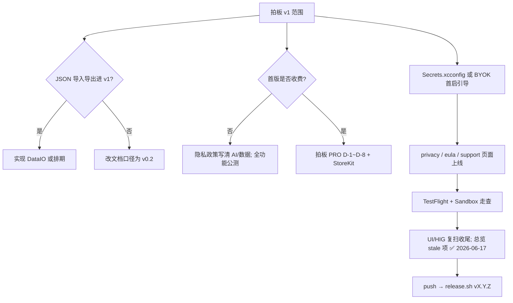

# Starcat v1 上架检查清单

> 创建：2026-06-17
> 用途：上架前收尾走查的单一执行清单（不含具体 App Store 提交流程，那些由 dong4j 自行操作）
> 数据来源：`docs/功能实现总览.md`、§8 上架准备、`docs/6-发版与上架/SOP-发版流程.md`、`docs/2-产品/需求讨论/正式方案/PRO 订阅功能划分.md`、代码与配置扫描
> 维护：每完成一项打勾 `[x]`，重大决策在对应条目下补 `> 决策：...` 行

---

## 0. 总体判断（2026-06-23 快照）

| 维度 | 状态 |
|------|------|
| P0 核心（同步 / 三栏 / 搜索 / README / 标签笔记状态） | 文档口径 **60/60 实质完成**（含 4 项明确延后，见 §2.1） |
| 单测 | **928 case / 119 suites**（见 `功能实现总览.md` 进度仪表盘） |
| 发版工程 | `scripts/release.sh` + git tag 驱动版本号 **已就绪** |
| 当前 git | `main` 曾领先 `origin/main` 25 commits（发版前需 push） |
| 构建密钥 | 本地若无 `Configs/Secrets.xcconfig` → 自建后端 **BYOK-only** |

**结论**：核心 MVP **技术上可发**；「能跑」与「能放心上架」之间仍有合规、配置、产品范围与文档同步项需收尾。

> 2026-06-23 追加：按 Apple 官方 Human Interface Guidelines / App Review Guidelines 复扫后，Starcat 主体 macOS 形态（原生三栏、系统 toolbar、Settings scene、popover / sheet、明暗主题）方向正确；上架前仍需收尾 **UI 可访问性、设置页控件、截图/Review Notes 披露** 三类问题，详见 §2.5(详见 `docs/6-发版与上架/v1-上架信息准备.md`)。

---

## 1. 优先级说明

| 级别 | 含义 |
|------|------|
| **P0** | 上架前建议必须处理或明确拍板 |
| **P1** | 产品范围：决定 v1 是否包含，不挡「技术能跑」 |
| **P2** | 技术债与体验抛光，可首版后迭代 |

---

## 2. P0 — 上架前必须处理

### 2.1 商店与合规物料

对应 `功能实现总览.md` §8；**dong4j 主导**，AI 协作者不代操作商店后台。

- [ ] **Apple Developer Program 注册**（$99/年）
- [ ] **隐私政策 HTTPS 托管** — 关于页已链 `https://starcat.ink/privacy`，需确认页面真实可访问且与 App 实际数据行为一致
- [ ] **匿名遥测披露同步** — 隐私政策 / App Store Connect App Privacy 需写清 Aptabase opt-in、Usage Data / Diagnostics、Not Used to Track You
- [ ] **EULA / 用户协议** — 关于页已链 `https://starcat.ink/eula`，同上
- [ ] **支持页 / 联系邮箱** — 关于页链 `https://starcat.ink/support`、`mailto:dong4j@gmail.com`
- [ ] **App Store 截图**（macOS 各分辨率）
- [ ] **App Store 描述文案**（170 字符内副标题 + 完整描述）
- [ ] **截图标语**（突出「AI 知识整理」等差异化）
- [ ] **TestFlight 内测**（文档建议至少 1 周）
- [ ] **App Sandbox 审核合规走查** — 对照 `Starcat/Starcat.entitlements` 与实际能力（网络、用户选文件、本地通知、Security-Scoped Bookmark 等）

### 2.2 生产环境 API Key（首启体验）

Starcat 默认连接 4 个 `*.fly.dev` 自建后端（见 `AppEndpoints.swift`）。每个后端的 `/api/v1/*` 都要求 `Authorization: Bearer <api-key>`。

#### 配置链路（两端必须对齐）

| 端 | 配置什么 | 在哪里配 | 命令 / 文件 |
|----|----------|----------|-------------|
| **Fly 后端 ×4** | `API_KEYS` 白名单 | 各 API 的 Fly secrets | `make -C supports fly-secrets-all`（从各 `.env` 同步） |
| **Starcat 客户端** | 各服务默认 Bearer Token（可各不相同） | 发版构建注入 | `Configs/Secrets.xcconfig` 的 `STARCAT_PRODUCTION_API_KEY_<SERVICE>` ×4 |
| **Starcat 客户端（覆盖）** | 用户自填 Key | App 内 **设置 → 服务** → 各服务 API Key | 持久化 Keychain，优先级高于 baked-in |

**对齐规则**：每个服务的 baked-in key **必须** 存在于**对应** Fly App 的 `API_KEYS` 白名单里（四端可以各不相同）。

#### 推荐发版前一键流程

```bash
# 1. 在各 supports/starcat-*-api/.env 分别填 API_KEYS=（可以四把不同的 key）
# 2. 推到 Fly
make sync-fly-secrets

# 3. 从四个 .env 自动写入客户端发版配置（不进 git）
make setup-production-api-keys

# 4. 同步 Xcode 工程并重新 build
make run
```

#### 策略二选一（必须拍板）

- [ ] **A. baked-in（推荐首版）**：`Configs/Secrets.xcconfig` 四个 `STARCAT_PRODUCTION_API_KEY_*` 非空 → 用户零配置可用四服务
- [ ] **B. BYOK-only**：不发 baked-in key → 首启会 401，需在 UI / 商店描述引导 **设置 → 服务** 填 Key

> 扫描记录（2026-06-17）：仓库内 **无** `Configs/Secrets.xcconfig`（仅 template），默认等价于 **B**。  
> Fly secrets / 环境变量完整清单：`supports/docs/fly-io-环境变量.md`

#### sharing 额外注意

- Fly 上 `BASE_URL` 必须是公网 URL（生产：`https://starcat-sharing-api.fly.dev`），用于生成分享短链；**不能**同步本地 `.env` 里的 `localhost`。

#### 验证

- [ ] `make -C supports fly-health-all` 四个 `ok`
- [ ] App **设置 → 服务** 对各服务点「测试连接」通过（走 `/api/v1/ping` + Bearer）

### 2.3 发版前工程检查

- [ ] **working tree clean**（`git status` 无未提交改动，见 `docs/6-发版与上架/SOP-发版流程.md` §2）
- [ ] **push 远端** — 本地 commit 已全部 `git push`（避免 tag / Release 与远端不一致）
- [ ] **全量单测** — 关闭 Xcode IDE 后：`xcodegen generate` + `xcodebuild -scheme Starcat -destination 'platform=macOS,arch=arm64' test`
- [ ] **真机冒烟路径**：登录 → 全量同步 → Manage / Trending / Activity / Weekly → AI 摘要 → Release 订阅与通知 → 设置语言切换（中/英）
- [ ] **发版命令演练**（可选 dry-run）：`./scripts/release.sh vX.Y.Z --dry-run`

### 2.4 活文档与清单同步（避免后续协作踩坑） ✅ 2026-06-17

以下 stale 项已在 `docs/功能实现总览.md` 对齐代码真相：

| 条目 | 处理 |
|------|------|
| §8「D-16 Keychain 临时方案切换完成」 | 改为 `[x]`「Token 加密存储（AES-GCM）」 |
| §6 D-16「明文 token 待评估」 | 合并为已完成，与 §3.1 一致 |
| §3.9.3 / §3.9.5「Weekly 客户端对接未开始」 | `[x]`，指向 §3.9.8 R-05（2026-06-12） |
| §11「下一步 W5 CloudKit」 | 重写为 v1 上架导向 |
| `2026-05-30-现阶段问题修复.md` 空条目 | 已删除 |

- [x] **同步更新** `docs/功能实现总览.md` 上述 stale 项 — **2026-06-17**

### 2.5 Apple 官方 UI / HIG 上架走查（2026-06-23）

> 官方依据：
> - [Apple HIG — Designing for macOS](https://developer.apple.com/design/human-interface-guidelines/designing-for-macos)
> - [Apple HIG — Windows](https://developer.apple.com/design/human-interface-guidelines/windows)
> - [Apple HIG — Toolbars](https://developer.apple.com/design/human-interface-guidelines/toolbars)
> - [Apple HIG — Sidebars](https://developer.apple.com/design/human-interface-guidelines/sidebars)
> - [Apple HIG — Sheets](https://developer.apple.com/design/human-interface-guidelines/sheets)
> - [Apple HIG — Popovers](https://developer.apple.com/design/human-interface-guidelines/popovers)
> - [Apple HIG — Focus and selection](https://developer.apple.com/design/human-interface-guidelines/focus-and-selection)
> - [Apple HIG — Color / Dark Mode / Accessibility](https://developer.apple.com/design/human-interface-guidelines/color)
> - [Apple App Review Guidelines](https://developer.apple.com/app-store/review/guidelines/) §2.1 / §2.3 / §4 / §4.8(详见 `docs/3-设计/详细设计/04-技术选型.md`) / §5.1

#### 2.5.1 结论分级

| 级别 | 结论 |
|------|------|
| **P0** | 不一定是代码 bug，但上架前必须处理或在 Review Notes / 截图 / 文案中解释，否则容易触发审核沟通 |
| **P1** | HIG 一致性与可访问性风险；建议 v1 提交前修 |
| **P2** | 体验抛光；可首版后，但不要在商店截图里暴露 |

#### 2.5.2 Starcat 当前不符合 / 待整理项

| 优先级 | 官方关注点 | Starcat 当前证据 | 整理动作 |
|--------|------------|------------------|----------|
| **P0** | App Review 2.3：截图、描述、预览必须准确展示 App 核心体验；截图不能只是标题页 / 登录页。 | `docs/6-发版与上架/v1-上架信息准备.md` §1.4(详见 `docs/2-产品/需求讨论/正式方案/Pro付费墙验证清单.md`) 截图仍是占位；Starcat 首屏有 GitHub 登录，若只截登录页会不符合审核期望。 | 上架截图至少覆盖：主三栏、README 详情、AI 摘要/对话、智能集合、Activity/Weekly；截图内使用虚构或可公开测试数据，避免真实个人账号信息。 |
| **P0** | App Review 2.1 / 2.3.1：非显性功能、IAP、后端服务必须可审；复杂功能需在 Review Notes 说明。 | Starcat 有 GitHub OAuth、StoreKit Pro、MCP loopback service、BYOK / 自建 AI 服务、外部 GitHub / Web 搜索。 | Review Notes 必须说明：测试账号/演示数据、MCP 默认关闭且仅 `127.0.0.1`、Pro 功能入口、AI 数据流、后端服务已上线；若不提供 GitHub 测试账号，则写明作为 GitHub 专用客户端的登录必要性。 |
| **P0** | App Review 4.8：第三方/社交登录通常要求提供同等级 Apple 登录；但“特定第三方服务客户端”可例外。 | Starcat 当前只提供 GitHub OAuth Device Flow；产品核心就是管理用户 GitHub Stars。 | 在 Review Notes 明确 Starcat 是 GitHub 专用客户端，登录仅用于访问用户 GitHub Stars；不要在商店文案里把它描述成通用账号系统。 |
| **P1** | HIG Focus and selection / Accessibility：键盘焦点应让用户确认当前交互目标。 | ✅ 2026-06-23 静态复扫通过：非注释 `.buttonStyle(.plain)` / `.buttonStyle(.borderless)` 均在近邻代码中补齐 `.focusEffectDisabled()`；`RepoHealthSheet.swift` 的旧遗漏已补。 | 不回退项目蓝框规则；上架前仍建议用键盘 Tab 真机走查，确认自定义按钮至少有 hover/pressed/selection 或上下文可见状态。 |
| **P1** | HIG Accessibility / Color：文字、细图标、状态色需要足够对比度，暗色/浅色都要可读。 | 2026-06-23 扫描：`RemoteAvatar` / `RemoteFavicon` 的 `.tertiary` 是装饰占位；`RepoAIWindowContentView` 两处 `.tertiary` 已有“故意弱化”注释；`ShareCardTheme.tertiaryText` 是导出卡片自定义色，未做对比度自动验证。 | 保留已注释的装饰例外；上架截图前用浅色/深色各走一遍 AI 窗口、分享卡、空态、错误态。分享卡若用于商店截图，优先选对比度最高主题，避免小字灰糊。 |
| **P1** | HIG Settings / Controls：设置项应使用熟悉且可预测的 macOS 控件；大量设置需要避免固定窗口裁切。 | `SettingsView` 固定 `540×460`；设置 Tab 已增至 8 个。`AISettingsView.swift:1472` 仍有真实 `Stepper`，违反项目 2026-06-20 “新 UI 禁止 Stepper”军规，也与当前端口/结果数统一 TextField/Slider 模式不一致。 | 把 `AISettingsView.repoContextTier1MaxLinesRow` 的 Stepper 改成 `TextField` 数字过滤 + 范围钳制，或改 `Slider`；设置窗口需在中/英、浅/深、默认字体下确认无裁切。 |
| **P1** | HIG Sheets / Popovers：sheet 用于阻塞式任务；popover 用于临时、轻量上下文；内容应继承当前 App 环境。 | ✅ 2026-06-23 复扫通过：真实 `.sheet` / `.popover` 入口均在根视图附近挂了 `.appLocaleEnvironment()`、`.appSheetRootEnvironment(...)` 或 `ProPaywallSheet.hosted(...)`；前次疑点是静态脚本窗口太短导致的 false positive。 | 当前无需改代码；后续新增 sheet / popover 时继续按 i18n 军规 #3 在根视图显式挂环境。 |
| **P2** | HIG Windows：用户应能按工作流调整窗口；固定尺寸只适合短任务窗口。 | 主窗口已有 `MainWindowFrameModifier`，会恢复/限制默认尺寸；设置窗口固定尺寸；若长 Tab 展开依赖 Form 滚动。 | 主窗口保持现状；设置窗口若实测 Tab 内容频繁滚动或低分辨率裁切，再改为更大默认尺寸或按 Tab 设最小高度。 |
| **P2** | HIG Ratings and reviews：应使用系统 API 请求评分，避免自定义强迫评分。 | ✅ 2026-06-23 已在 About → Support 增加用户主动触发的评分入口，调用 StoreKit `requestReview()`；不做启动弹窗、不做自定义评分弹窗。 | 现状合规；StoreKit 会自行判断是否展示系统评分面板，App 不承诺每次点击都弹出。 |

#### 2.5.3 提交前 UI 自检命令

```bash
rg "Stepper\(" --type swift Starcat/
rg "\.foregroundStyle\(\.tertiary\)|\.foregroundColor\(\.tertiary\)" --type swift Starcat/
rg "buttonStyle\(\.plain\)|buttonStyle\(\.borderless\)" --type swift Starcat/
rg "\.sheet\(|\.popover\(" --type swift Starcat/
```

> 命令只做静态提示，不等价于合规证明。最终仍需要用真实 macOS App 在浅色 / 深色、英文 / 中文、键盘 Tab、低分辨率窗口下手动走查。

---

## 3. P1 — 产品范围：v1 要不要带？

以下不挡「App 能编译运行」，但影响**首版叙事、竞品迁移、付费策略**；需 dong4j 拍板后写入 `> 决策：...`。

### 3.1 仍标 P0 但未实现：JSON 导入 / 导出

- [ ] **JSON 导入** — OhMyStar / Astral 兼容（`Features/DataIO/ImportService.swift` 未建）
- [ ] **JSON 导出** — 全量 / 选中导出（`Features/DataIO/ExportService.swift` 未建）

`docs/1-立项/功能清单.md` 仍标 **P0**；总览注明 dong4j 2026-05-31 延后到 W5。

| 选项 | 说明 |
|------|------|
| **进 v1** | 竞品用户迁移路径完整，工作量独立一块 |
| **不进 v1** | 改 `功能清单.md` / 总览口径为 v0.2，商店文案不写「导入」 |

### 3.2 Pro / 订阅策略（StoreKit 已接入）

> 决策（2026-06-18）：**路径 B** — v1 接入 StoreKit（月订 + 年订），CloudKit 延后且后续归 Pro。支付规格见 **`docs/2-产品/需求讨论/正式方案/支付对接正式方案.md`**。
> Direct 渠道（2026-07-04）：官网 DMG + Sparkle + provider-neutral License API 方案已落档，见 **`docs/2-产品/需求讨论/正式方案/分发渠道正式方案.md`** 与 **`docs/2-产品/需求讨论/正式方案/支付对接正式方案.md`**；App Store build 不展示授权码 / 外部支付 / Sparkle 入口。

当前已接入 StoreKit 2（月订 + 年订）与统一 Pro 付费墙；CloudKit 仍按路径 B 延后。

- [x] **D-1** CloudKit 多端同步归免费还是 Pro — **Pro；v1 不做 CloudKit**（2026-06-18）
- [x] **D-2** AI 标签 / 摘要试用次数 — **0 次，免费版零 AI**（2026-06-19 修订）
- [x] **D-3** 免费版标签数量上限 — **20 个**
- [x] **D-4** BYOK 用户是否仍需 Pro — **需要**；免费用户不可配置 AI，Pro 解锁 BYOK 配置与 AI 工作流
- [x] **D-5** 自动 AI 整理 — **Pro only**；免费不开放手动批量整理
- [x] **D-6** 菜单栏 / Spotlight / Shortcuts / Widget — **暂不实施**，门控留 v0.2+
- [x] **D-7** AI Discovery（Show HN） — **列表免费 / AI 增强 Pro 预埋**，客户端未实施
- [x] **D-8** Chrome 插件 — **预埋 Pro 边界**，插件未实施

| 首版策略 | 动作 |
|----------|------|
| **全功能免费公测** | 隐私政策 / 商店描述写清 AI 与数据使用；Pro 文档标 v0.2 |
| **首版即收费** | ✅ 已选路径 B 且客户端已落地；见 `docs/2-产品/需求讨论/正式方案/支付对接正式方案.md`（App Store StoreKit；Direct provider-neutral license 另行实施） |
| **官网 Direct 版** | ⏳ 单独构建 / 单独 UI / Sparkle / License API / Direct payment provider；不混入 App Store build |

### 3.3 Discovery（Show HN）客户端 — P1 整块未接

总览 §5 中以下仍 `[ ]`（后端设计已有，客户端未开始）：

- [ ] ActivityCategory.discovery + Sidebar
- [ ] DiscoveryView 中栏
- [ ] WeeklyAPI.fetchDiscovery 等网络层
- [ ] RepoDetailAction.hnDiscussion + 详情页
- [ ] 数据来源说明（是否展示第三方来源）

若首版卖点含「技术发现」，此为明显缺口；若不主打，可标 v0.2。

### 3.4 其它 P1 小尾巴

- [x] **Release 直接下载** — HOM-47 9/9（2026-06-17）
- [x] **详情页 Hero 信息增强（4 项）** — **已延期至 v2**（dong4j 2026-06-17；toolbar `ExternalLinksMenu` 已覆盖跳转，v2 做 hero 内联展示）
  > 决策：v1 不做。四项（Website / Open Issues 数 / 独立 Open PR 数 / 最新 Release 内联）及 hero 布局方案见 **`docs/2-产品/需求讨论/v2-功能规划.md` §1**。

### 3.5 明确延后、首版可不做的 P0 口径项

总览仪表盘注脚已记录，**不算阻塞** unless 你改口径：

- Web Application Flow OAuth（需后端，W6+）
- macOS 26 Liquid Glass 适配（待验证）
- JSON 导入/导出（若拍板不进 v1）

---

## 4. P2 — 技术债与体验抛光（可首版后）

### 4.1 代码规范 / 小修

- [x] **Focus ring / 键盘焦点复扫** — 2026-06-23 静态复扫通过；`RepoHealthSheet.swift` 旧遗漏已补 `.focusEffectDisabled()`，上架前仅保留真机 Tab 走查
- [ ] **`.tertiary` / 自定义浅色灰字复扫** — 2026-06-23 复扫确认 `.tertiary` 主要是装饰占位，但 `ShareCardTheme.tertiaryText` 属自定义导出主题色，上架截图前需验证浅色/深色对比度
- [ ] **设置页 `Stepper` 清理** — `AISettingsView.swift:1472` 仍有真实 `Stepper`，需按项目军规改成 `TextField` 数字过滤 + 范围钳制，或改为 `Slider`
- [x] **Sheet / Popover 环境继承复扫** — 2026-06-23 复扫通过；所有真实入口均已有 `.appLocaleEnvironment()` / `.appSheetRootEnvironment(...)` / `ProPaywallSheet.hosted(...)`
- [x] **`GithubAuthViewLegacy.swift`** — 已删除；生产路径仅 `GithubAuthView`（2026-06-17）

### 4.2 已知小产品债

- [ ] **Sidebar 计数** — 过滤 archived/fork 后，侧栏 All Repos 计数与列表显示不一致（总览 W4 D2 已知）
- [ ] **非功能指标未验收**（§7.1）：启动 &lt;2s、列表 60fps、搜索 &lt;500ms、AI 摘要 &lt;5s
- [ ] **匿名遥测事件面复扫** — 上架前确认事件列表只含 allowlist 名称和分桶，不含 repo 名、搜索词、README、笔记、AI 内容、本地路径
- [ ] **UI 视觉升级 Phase 1** — Repo List / Trending row 已完成；Detail header + Empty/Error/Login 样板仍 open

### 4.3 技术债编号（维护性，不挡首发）

- [ ] D-06～D-09、D-10～D-12、D-15、D-23、D-13 等（见总览 §6）

### 4.4 明确可首版后

- CloudKit 同步（Week 5 整块）
- Web Application Flow OAuth
- macOS 26 Liquid Glass
- Chrome 插件 V0.1
- 菜单栏 / Spotlight / Widget（StoreKit / Quota 已完成）
- Sparkle 应用内自动更新（Direct 版已完成首期接入，正式发版前需配置真实 EdDSA key、notarization、appcast）
- Direct 分发授权码实现（Creem / License API / Direct 设置页已完成首期接入，正式发版前需完成真实 test/live 联调）
- 结构化搜索页 / 保存搜索条件
- 同义标签检测、14 预设分类、语义搜索增强等 P1/P2

---

## 5. 已就绪项（无需重复焦虑）

上架走查时以下可视为 **✅ 已完成**（细节见 `功能实现总览.md`）：

- GitHub OAuth Device Flow + AuthSession + 集中式 401
- Stars 全量/增量同步、Rate Limit 退避、ETag 缓存
- macOS 三栏、FTS 搜索、README WebView + SWR 缓存
- 标签 / 笔记 / 状态、多选、Sidebar Tags/Languages
- i18n 大批量收尾（`String.l10n`、相对时间 formatter；sheet / popover locale 复扫已通过，见 §2.5(详见 `docs/6-发版与上架/v1-上架信息准备.md`)）
- AI 设置 / 摘要 / 对话 / AnySearch / RepoContext / 向量搜索等（超原 P1 范围）
- Activity / Trending / Weekly 三场景 + R-01 共用架构
- Release 订阅 + 通知 + 时间线 + 应用内下载
- 关于页、App 图标、开源致谢（`AboutView` → `AboutDependency`）
- Token 存储：**AES-GCM 设备绑定加密**（`CryptoManager` + `KeychainManager`）
- 发版 SOP：`docs/6-发版与上架/SOP-发版流程.md` + `scripts/release.sh`
- 登录页 V2 已上生产（`GithubAuthView`）；设置页语言切换（`LocaleStore`）

---

## 6. 建议执行顺序



### 最小上架包 — 5 个必拍板问题

1. **JSON 导入导出** — 首版要不要？
2. **`Secrets.xcconfig`** — 开箱即用 baked-in key，还是 BYOK-only？
3. **Pro 策略** — 全免费公测，还是首版上付费墙？
4. **`starcat.app/privacy` / `eula`** — 是否已上线且与 App 行为一致？
5. **Discovery 客户端** — 是否进首版产品叙事？

---

## 7. 相关文档索引

| 文档 | 用途 |
|------|------|
| `docs/功能实现总览.md` | 主进度 + §8 原上架清单 |
| `docs/6-发版与上架/SOP-发版流程.md` | tag / build / DMG / release.sh |
| `docs/2-产品/需求讨论/正式方案/PRO 订阅功能划分.md` | 免费 vs Pro 详单 + §8 拍板 |
| `docs/2-产品/需求讨论/正式方案/支付对接正式方案.md` | StoreKit + Direct provider-neutral 支付与授权方案 |
| `docs/2-产品/需求讨论/正式方案/分发渠道正式方案.md` | App Store / Direct DMG / Sparkle / 双打包流程方案 |
| `docs/1-立项/功能清单.md` | 原 P0/P1/P2 优先级表 |
| `docs/2-产品/需求讨论/v2-功能规划.md` | v1 后迭代 backlog（含详情页 Hero 四项） |
| `Configs/Secrets.xcconfig.template` | 生产 API Key 配置说明 |
| `docs/4-工程进度/阶段性回顾/2026-05-30-现阶段问题修复.md` | 零散 UI 问题专项（含首屏大小未填项） |

---

## 8. 变更日志

| 日期 | 变更 |
|------|------|
| 2026-06-17 | 初版：由上架前全项目走查整理写入 |
| 2026-06-18 | StoreKit 2 客户端实现完成；§3.2 更新为月订 + 年订、AI 门控、标签 / Release 免费上限与 D-1～D-8 全部拍板 |
| 2026-06-18 | §3.2 对齐路径 B 拍板；后续归并到 `docs/2-产品/需求讨论/正式方案/支付对接正式方案.md`；D-1 勾选 |
| 2026-06-19 | Pro 定位修订：免费版零 AI；BYOK 配置与 AI 工作流均为 Pro-only；移除 App 内 AI 次数试用 |
| 2026-06-23 | 追加 Apple 官方 HIG / App Review UI 走查 §2.5(详见 `docs/6-发版与上架/v1-上架信息准备.md`)；把 2026-06-17 UI 小修完成口径更新为复扫后的上架前待整理项 |
| 2026-06-23 | About → Support 新增 StoreKit 系统评分入口；Sheet / Popover 环境继承复扫通过并清理 false positive |
| 2026-07-04 | Direct 渠道口径重组：官网 DMG 版走 Sparkle + License API + 可替换支付网关，App Store build 保持 StoreKit-only。 |
| 2026-06-30 | 匿名遥测合规口径同步：Aptabase opt-in、Usage Data / Diagnostics 隐私标签、Not Used to Track You。 |

---

*维护者：dong4j + AI 协作者。完成 P0 项后可在总览 §8 交叉勾选并追加 `> 实现：...` 行。*
