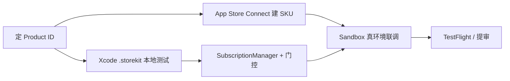

# StoreKit 订阅上架方案

> 创建：2026-06-18
> 状态：**已拍板（dong4j）**，客户端实现已完成（2026-06-18）
> 用途：v1 首版上架的订阅策略、StoreKit 2 技术方案、CloudKit 延后策略的**单一信任源**
> 前置阅读：`docs/PRO 订阅功能划分.md`、`docs/v1-上架检查清单.md`、`docs/CloudKit数据同步设计.md`
> 合规页面：`pages/privacy.html`、`pages/privacy-zh.html`、`pages/eula.html`、`pages/eula-zh.html`

---

## 1. 战略路径（已拍板）

dong4j 2026-06-18 确认采用 **路径 B**：

| 维度 | v1 首版 | 后续版本 |
|------|---------|----------|
| **StoreKit 订阅** | ✅ 必做（月订 + 年订） | 追加买断制 SKU |
| **CloudKit 同步** | ❌ 不做 | Pro 专属功能 |
| **付费墙** | AI + Release 订阅等核心 Pro 能力 | CloudKit 上线时加 `.cloudSync` 门控 |

**理由摘要**：

- StoreKit 能立刻管住 AI 算力成本，商业模式从 day 1 成立；
- 当前仅 macOS 客户端，CloudKit 用户感知弱，且多账号 Zone 隔离工程量大；
- 合规页（`pages/`）已覆盖订阅条款，可与 StoreKit 开发并行。

---

## 2. 产品决策（§8 拍板结果）

> 原 `docs/PRO 订阅功能划分.md` §8 待决策项，本节为 dong4j 确认后的**生效版本**。

| ID | 议题 | **拍板** | 备注 |
|----|------|----------|------|
| **D-1** | CloudKit 多端同步归属 | **Pro** | v1 **不实现** CloudKit；上线后设置页「iCloud 同步」需 `requirePro(.cloudSync)` |
| **D-2** | AI 摘要 / 标签试用次数 | **3 次**（各算 1 次） | 按 GitHub User ID 计数，防同账号重装需另评估 |
| **D-3** | 免费版标签上限 | **20 个** | 创建入口拦截 |
| **D-4** | BYOK 是否需 Pro | **需要** | 配置 UI 可见，**调用** AI 需 Pro 或试用配额 |
| **D-5** | 自动后台 AI 整理 | **v1 简化为全自动 = Pro only** | 免费不开放手动批量整理；D-5 选项 B（单次手动 5 repo）留 v0.2 评估 |
| **D-6** | 菜单栏 / Spotlight / Widget | **暂不实施** | 功能本身未做，门控留 v0.2 |
| **D-7** | AI Discovery 客户端 | **列表免费 / AI 增强 Pro**（预埋） | 客户端未开始 |
| **D-8** | Chrome 插件 | **预埋 Pro 边界** | 插件未实施 |

### 2.1 订阅 SKU（v1）

| SKU | Product ID（建议） | 类型 | v1 |
|-----|-------------------|------|-----|
| Pro 月订 | `com.starcat.app.pro.monthly` | Auto-Renewable | ✅ |
| Pro 年订 | `com.starcat.app.pro.yearly` | Auto-Renewable | ✅ |
| Pro 买断 | `com.starcat.app.pro.lifetime`（预留） | Non-Consumable | ❌ v0.2+ |

**定价**（Connect 后台配置，代码不写死价格）：

- 年订参考价：**$29.99/年**（可在年订上配 **14 天免费试用** Introductory Offer）
- 月订参考价：**$3.99～$4.99/月**（需让年订折算价明显更优，具体 dong4j 在 Connect 定）

**权益规则**：任一月订或年订处于有效 entitlement → `isProUser == true`。

### 2.2 Release 订阅数量限制

| 版本 | Release 仓库订阅上限 |
|------|---------------------|
| 免费 | **5 个** |
| Pro | 无限制 |

### 2.3 早期用户 Grandfather（建议，待 dong4j 最终确认日期）

v1 公测期全功能开放 → v1.1 加锁可能引起体感倒退。建议：

- 在 `AppSettings` 记录 `firstInstallDate` 或 `legacyProGrant`；
- **某截止日期前**首次安装的用户永久 Pro（或永久试用配额翻倍）；
- 截止日期在实施门控前由 dong4j 拍板写入本文件 §变更日志。

---

## 3. CloudKit 延后策略

### 3.1 v1 范围

- **不**添加 iCloud / CloudKit entitlements；
- **不**实现 `CloudKitSyncCoordinator` 等同步代码；
- 隐私政策中 CloudKit 章节保留，但须注明「当前版本未提供，未来将作为 Pro 权益」（见 §6）。

### 3.2 后续实现时的约束（预埋）

依据 `docs/CloudKit数据同步设计.md` + D-30 多账号隔离：

1. **每 GitHub 账号独立 Zone**：`CKRecordZone(zoneName: "user_<github_user_id>")`；
2. 在 `DatabaseManager.reopen(userId:)` 时切换 Zone + 同步 token；
3. 设置页「启用 iCloud 同步」→ `EntitlementGate.requirePro(.cloudSync)`；
4. 同步数据范围仍按设计文档：Tags / RepoNotes / RepoStatus / SavedSearches / SearchHistory / ReleaseSubscriptions 设置等用户数据；**不同步** repo 缓存、README、AI 摘要、embeddings。

---

## 4. 技术架构

### 4.1 模块划分（已实现）

```
Starcat/Core/Subscription/
  ProProductID.swift           // SKU 常量
  ProEntitlement.swift         // isPro / expiration / isInTrial
  SubscriptionManager.swift    // StoreKit 2：加载、购买、恢复、Transaction.updates
  EntitlementGate.swift        // requirePro(feature:) / ProFeature enum
  TrialQuotaStore.swift        // 3 次试用，按 GitHub User ID
  ProPaywallSheet.swift        // 统一付费墙（可选 SubscriptionStoreView）
  SubscriptionExternalLinks.swift // 管理订阅外链
```

### 4.2 数据流

```
App 启动 / 前台恢复
  → SubscriptionManager.refreshEntitlements()
      → Product.products(for: ProProductID.all)
      → Transaction.currentEntitlements
      → Transaction.updates 监听
  → 发布 ProEntitlement（单一信任源）
  → AppSettings.isProUser（只读镜像，删除 ProSettingsView 手动 toggle）
  → EntitlementGate 在各功能入口检查
```

### 4.3 关键约束

1. **`SubscriptionManager` 是订阅状态唯一真相源**；`UserDefaults` 里的 `settings.pro.isProUser` 不再由用户手动写入。
2. **`TestEnvironment.isRunning`** 时返回 mock Pro，避免单测触发 StoreKit / Keychain 弹窗。
3. **保留 `#if DEBUG` 模拟入口**供本地开发，不进入 Release 主路径。
4. **重新启用** `Starcat.entitlements` 中 `keychain-access-groups`（正式 Apple Developer Team 签名后）。

### 4.4 替换现有模拟页

当前 `Starcat/Features/Settings/ProSettingsView.swift` 已替换为 StoreKit 真实购买入口：

- 主路径：商品加载、购买、恢复购买、管理订阅；
- 展示月订、年订两个选项及当前订阅状态；
- 购买成功保留彩纸动画链路；
- 管理订阅入口暂用 Apple 账户订阅管理 URL（当前 macOS SDK 未暴露可用的 `AppStore.showManageSubscriptions`）。

---

## 5. 功能门控矩阵

### 5.1 P0 — 必须门控（v1）

| ProFeature | 入口 / 文件 | 规则 |
|------------|-------------|------|
| `.aiSummary` | `RepoAIInsightViewModel.generate` | Pro 或试用配额 |
| `.aiTags` | 同上 `includeTags` | Pro 或试用配额 |
| `.aiChat` | `RepoAIChatViewModel` 发消息 | Pro |
| `.batchAI` | `HomeView` / `BatchAIQueueService` | Pro |
| `.autoOrganize` | AI 整理调度器注册处 | Pro |
| `.readmeTranslation` | `ReadmeTranslationService` | Pro |
| `.semanticSearch` | `SemanticSearchService` | Pro |
| `.anySearchWeb` | `SearchCenterViewModel` Web 源 | Pro |
| `.repoContext` | `RepoAIInsightService` pack 路径 | Pro |
| `.releaseSubscription` | `ReleaseSubscriptionRepository.subscribe` | 免费 ≤5，Pro 无限 |
| `.codeFlow` | `RepoListView` / `SearchRemoteRepoDetailView` / `CodeFlowPanel` | Pro |

### 5.2 不做门控（保持免费）

- GitHub Stars 同步、FTS 搜索、⌘K Local + GitHub
- 标签 / 笔记 / 状态浏览与编辑（标签 **创建** 受 20 个上限）
- README WebView、三栏布局、HTML/MD 导出、分享卡
- Activity / Trending **列表浏览**（AI 摘要部分走 P0）
- 设置、关于、主题、语言

### 5.3 后续预埋

| ProFeature | 触发时机 |
|------------|----------|
| `.cloudSync` | CloudKit 功能上线 |

---

## 6. 合规与 `pages/` 站点

### 6.1 已就绪

| 资源 | 路径 | App 内链接 |
|------|------|-----------|
| 隐私政策（英） | `pages/privacy.html` | `https://starcat.ink/privacy` |
| 隐私政策（中） | `pages/privacy-zh.html` | 同上（或语言协商） |
| EULA（英） | `pages/eula.html` | `https://starcat.ink/eula` |
| EULA（中） | `pages/eula-zh.html` | 同上 |
| 关于页入口 | `Starcat/Features/About/AboutView.swift` | 已链上述 URL |

**EULA §7** 已覆盖：自动续期订阅、24h 取消、Apple 处理付款、买断预埋、退款走 Apple。

**Privacy** 已覆盖：StoreKit 2 购买凭据、订阅权益验证。

### 6.2 提审前检查（dong4j）

- [ ] `pages/deploy.sh` 部署后浏览器可访问 privacy / eula 中英文
- [x] 隐私政策 **§5.1 CloudKit**：补一句「**当前版本尚未提供 iCloud 同步；该功能将在后续版本作为 Pro 订阅权益上线。**」
- [ ] 落地页 `index-zh.html` / `index.html` 定价区：定好 Connect 价格后可补具体月/年金额（非审核硬性）
- [ ] App Store Connect **App Privacy** 问卷与隐私政策表述一致

---

## 7. 开发工作流：Connect 是否第一步？

**不是。** Connect 与客户端开发可并行。



| 阶段 | 需要 Connect？ | 说明 |
|------|----------------|------|
| 定 Product ID 常量 | ❌ | 代码与 Connect 最终 ID 必须一致 |
| Xcode `Products.storekit` 本地购买调试 | ❌ | Scheme → StoreKit Configuration |
| 编写 `SubscriptionManager` + 单测 | ❌ | `TestEnvironment` mock |
| TestFlight IAP 实测 | ✅ | Sandbox Tester |
| App Store 提审 | ✅ | SKU 已审核通过 |

### 7.1 Connect 后台清单（dong4j）

1. Subscription Group：`Starcat Pro`
2. 产品：`com.starcat.app.pro.monthly`、`com.starcat.app.pro.yearly`
3. 年订 Introductory Offer：14 天免费试用（可选）
4. 本地化描述（中/英）：突出 AI 摘要、整理、Release 订阅、未来云同步
5. Sandbox Tester ≥ 2 个

### 7.2 本地 StoreKit Configuration

1. 新建 `Products.storekit`（建议放 `Starcat/Resources/` 或 `Configs/`）
2. 与 Connect 相同的 Product ID 与 Subscription Group
3. Run Scheme → Options → StoreKit Configuration 选中该文件

---

## 8. 分阶段实施计划

| Phase | 内容 | 负责 | 预估 |
|-------|------|------|------|
| **0** | 本文档拍板 + Connect SKU（并行） | dong4j + AI | 0.5～1 天 |
| **1** | `SubscriptionManager` + `.storekit` + `isProUser` 链路 | AI | 2～3 天 |
| **2** | `ProSettingsTab` 真实购买 UI + `ProPaywallSheet` + i18n | AI | 1～2 天 |
| **3** | `EntitlementGate` + P0 门控 + 试用/标签/Release 限制 | AI | 3～4 天 |
| **4** | Sandbox 联调 + 冒烟 + 单测 + `pages` 部署核对 | dong4j + AI | 2 天 |

**v1 明确不做**：

- CloudKit / iCloud entitlement
- Lifetime 买断 SKU
- 复杂月度 AI Quota（500 次/月）；v1 Pro = 无限（或仅试用计数）

---

## 9. 验收标准

### 9.1 StoreKit

- [x] `.storekit` 环境：月订 / 年订购买入口已接通；购买成功 → `isProUser == true` 待本地 StoreKit UI 实测
- [x] 重启 App 后 entitlement 刷新链路已实现
- [x] 恢复购买可用（`AppStore.sync()` + 刷新权益）
- [ ] 取消订阅（Sandbox）后 AI 入口弹付费墙
- [x] `Transaction.updates` 处理续期 / 过期 / 退款

### 9.2 门控

- [x] 免费用户：AI 摘要 3 次后拦截
- [x] 免费用户：第 21 个标签创建拦截
- [x] 免费用户：第 6 个 Release 订阅拦截
- [x] Pro 用户：上述限制解除

### 9.3 合规

- [ ] About → 隐私 / EULA 链接 200 OK
- [x] 设置 → Pro 页可跳转管理订阅

---

## 10. 风险与缓解

| 风险 | 缓解 |
|------|------|
| 早期用户加锁体感倒退 | §2.3 Grandfather 策略 |
| Sandbox 不稳定 | `.storekit` 本地 + TestFlight 双验证 |
| BYOK 用户反弹 | Pro 页文案：Pro = 集成与 UI 能力，非仅 API 费 |
| 门控遗漏 | `rg` 扫 `AIClient` / `generateInsight` / `makeClient` |
| 审核：订阅说明不清 | EULA §7 + Pro 页列明权益 |
| 隐私政策写 CloudKit 但 App 无此功能 | §6.2 补「当前版本未提供」 |

---

## 11. 实施后文档同步

完成编码后须更新：

1. `docs/工程进度/功能实现总览.md` §5.3 勾选 + `> 实现：...`
2. `docs/PRO 订阅功能划分.md` 状态改为「已拍板」并链本文档
3. `docs/v1-上架检查清单.md` §3.2 更新 StoreKit 进度
4. `docs/功能清单.md` §7 定价章节（可选，与 PRO 文档对齐）

---

## 12. 关联文档

| 文档 | 关系 |
|------|------|
| `docs/Pro付费墙验证清单.md` | 免费用户触发 Pro 能力 → 付费墙的人工验收走查清单 |
| `docs/PRO 订阅功能划分.md` | 功能级免费/Pro 详单；§8 已由本文 §2 覆盖 |
| `docs/v1-上架检查清单.md` | 上架走查；路径 B 已选 |
| `docs/CloudKit数据同步设计.md` | CloudKit 技术设计；v1 不实施，D-1=Pro |
| `docs/发版流程.md` | tag / DMG / 提审节奏 |
| `pages/eula-zh.html` | 订阅法律条款 |
| `pages/privacy-zh.html` | 隐私与 StoreKit 说明 |

---

## 13. 变更日志

| 日期 | 变更 |
|------|------|
| 2026-06-18 | 初版：dong4j 拍板路径 B；D-1 CloudKit 延后且归 Pro；月订+年订 v1、买断 v0.2；Connect 非开发第一步；`pages/` 合规状态与提审前检查项 |
| 2026-06-18 | 客户端实现完成：StoreKit 2 底座、Pro 设置页、统一付费墙、AI / Search / Release / Tag 门控、试用与数量上限、`.storekit` 配置、i18n 与门控单测 |

---

*维护者：dong4j + AI 协作者。StoreKit 后续调整以本文为准；与 `PRO 订阅功能划分.md` 冲突时以本文 §2 拍板表为准。*
