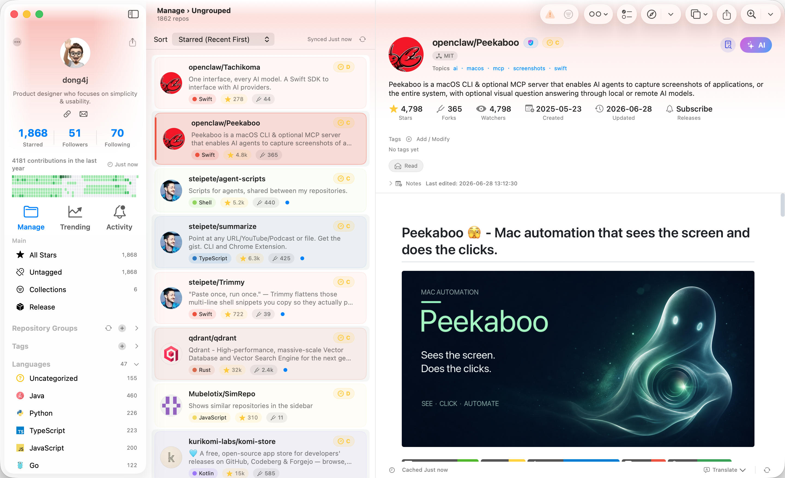

# LinkedIn

## Post Draft

I have been building Starcat, a native macOS app for developers who use GitHub Stars as part of their research workflow.

The product started from a simple observation: for many developers, Stars are no longer just bookmarks. They are a personal map of libraries, frameworks, AI tools, databases, CLI utilities, and ideas we may want to revisit later. But once that list grows, it becomes hard to search, understand, and act on.

Starcat turns GitHub Stars into a local-first repo knowledge base:

- sync Stars into a native macOS app;
- read and cache README files;
- organize repos with tags, notes, and reading status;
- track releases and activity;
- search across metadata, README content, and personal notes;
- use AI summaries, tag suggestions, translation, and contextual repo chat.

The design principle is that AI should support a workflow, not replace judgment. Starcat can summarize a repo or suggest tags, but it does not automatically modify the user's library. Any write action should remain explicit.

The longer-term roadmap is built around three developer workflows:

- Organize: clean up large Stars libraries and generate smart collections.
- Discover: find similar repos, alternatives, and produce technical selection reports.
- Digest: summarize weekly changes, release notes, and help users rediscover what they saved.

For me, the interesting product question is how to make open-source research less scattered. GitHub, README files, release notes, AI summaries, notes, and personal context should not live in separate tabs forever.
