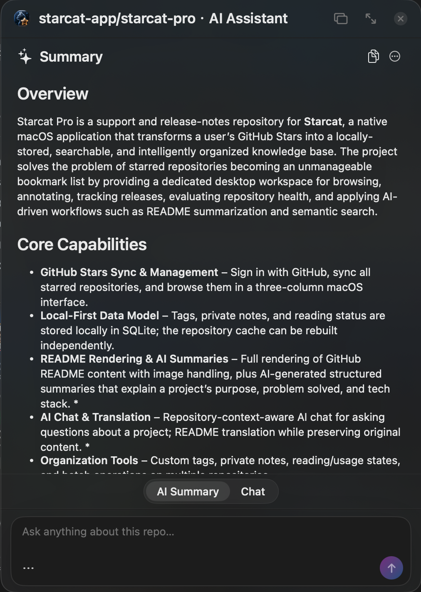
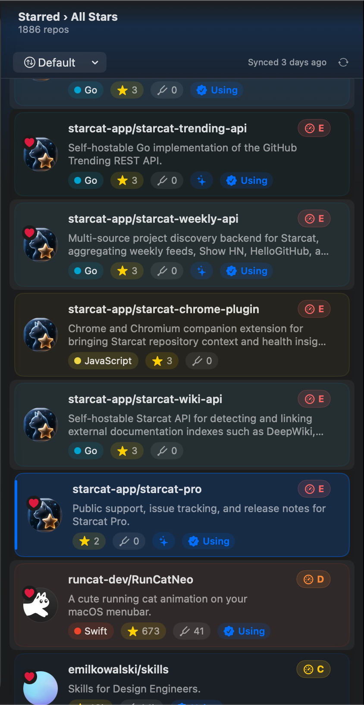
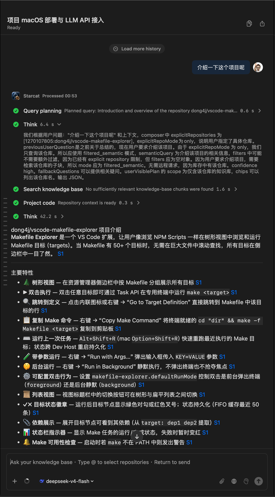
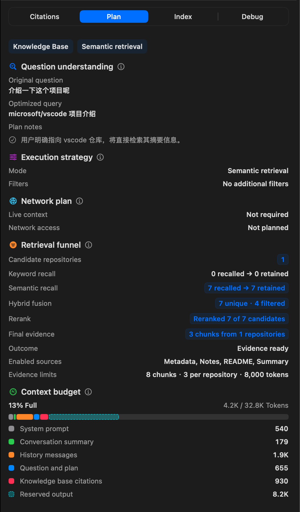
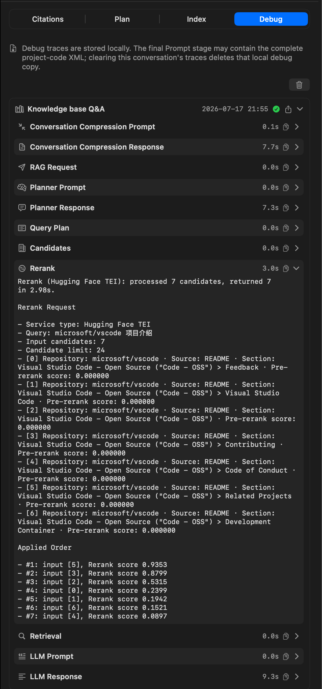
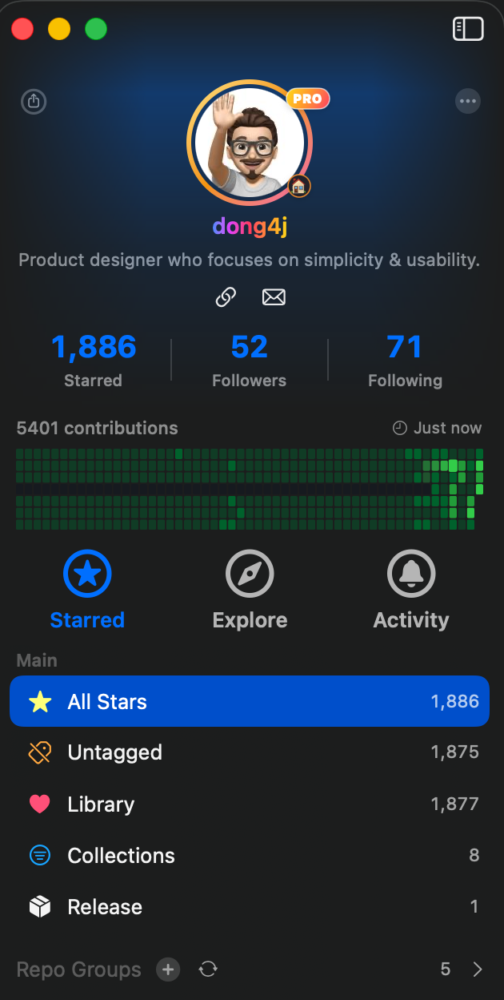
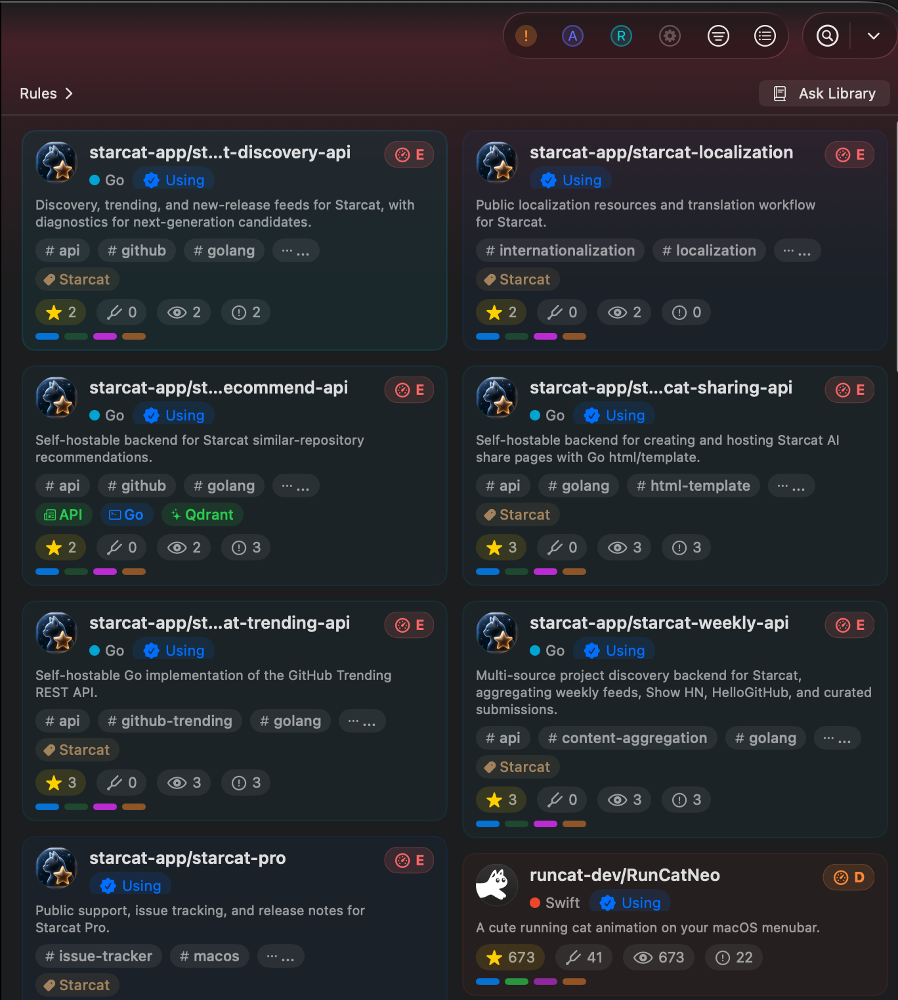

# 小红书

> 平台定位：轻表达破圈，**不是** Starcat 主渠道；标题具体、图清晰，少堆技术细节。
> 配图：内页可复用知乎 CDN；**封面建议单独做 3:4 竖版**。

---

## 发帖清单（发前必读）

| 点 | 说明 |
|---|---|
| 形态 | 图文笔记；封面决定信息流点击 |
| 封面 | 优先 **3:4**（如 1080×1440）；横版 App 截图勿直接当封面 |
| 内页 | 与封面同比例更顺；横屏截图可原图放内页 |
| 数量 | 建议 **4～6 张**（竖版封面 + 管理 + AI/详情 + RAG + 可选引用） |
| 标题 | 口语、具体；少堆 `RAG` / `vDSP` 等词 |
| 标签 | 正文最后一行 `#标签`，约 5～8 个 |
| 别做 | 封面二维码 / 微信号；硬广口吻；规划中功能写成已上线 |

### 竖版封面怎么做

深色底 + 大字 3～7 字 + 缩小嵌入一张截图（管理或 RAG）。

大字备选：

- `Stars → 知识库`
- `收藏也能问答`
- `GitHub 不吃灰`

安全区：重要文字避开上下约 15%（防被裁切 / 标题条挡住）。

### 改稿原则

- 旧稿缺「可问答」→ 用产品语言带一句 RAG，不讲架构
- Stars 用「一千八百多」口语即可
- 路线标「以后想做 / 规划中」
- 文末必有互动句 + 标签

---

## 适合角度

程序员 / 独立开发 / Mac 效率人群。讲「star 完就忘」的共鸣，再亮本地知识库 + 能提问；不要写成发版说明或掘金文。

## 标题

### 推荐

GitHub 收藏太多？我做了个能问答的 Mac 工具

### 备选

- 我把自己的 GitHub Stars 做成了知识库
- 程序员 Mac：把 Stars 从「以后再看」变成能问的
- GitHub Stars 太多怎么办？一个 macOS 小工具

## 正文草稿

程序员应该都懂这种感觉：

看到一个开源项目不错，先 star。  
看到一个工具以后可能用，先 star。  
看到一个 AI 项目挺火，也先 star。

然后过几个月，GitHub Stars 变成一大堆「以后再看」——真要找的时候，名字都想不起来。我 Stars 已经一千八百多个了，有次回翻一个 Swift 剪贴板工具，愣是翻了很久。

所以我做了一个 macOS 小工具 **Starcat**（原生，不是套壳浏览器）。

它把 GitHub Stars 同步到本地：三栏管理，README 直接看，还能加标签、笔记、阅读状态。AI 可以帮你总结「这个 repo 是干什么的」、建议标签——但改标签要你自己确认，不会偷偷写。

我更喜欢的一点：它不太像收藏夹，更像自己的**开源项目知识库**。最近加了「能提问」——比如问「我收藏的项目里哪些用了某某方案」，它会在你自己入库的那些项目里找，并给出可核对的来源，而不是满网乱搜。

适合：GitHub Stars 很多、经常做技术调研、喜欢 macOS 原生工具的人。

官网：https://starcat.ink  
开源：https://github.com/starcat-app

你们 Stars 是放着不管，还是会定期整理？评论区聊聊～

#独立开发 #macOS #GitHub #效率工具 #程序员 #知识管理 #AI工具 #Starcat

---

## 配图说明（本目录 7 张）

发帖时图文一起传。下面每张图配一句说明，方便对照；小红书正文用上面整段即可，不用把图注再贴一遍。

打开一个仓库就能看 AI 摘要：这个项目是干什么的、解决什么问题、技术栈是什么。不用先把 README 啃完。

一千八百多个 Stars 同步到本地，三栏翻列表，不用再回 GitHub 网页慢慢滚。

知识库能提问。问「介绍一下这个项目」，它会在你自己入库的材料里找，并标出引用。

检索过程能看见：问题怎么理解、召回了哪些片段、上下文用了多少 token。

Debug 里能核对重排分数，回答从哪来，不是黑盒。

按 All Stars、未打标、知识库、合集分组，收藏多了也能下手整理。

主应用之外，推荐、Trending、Weekly 这些支撑项目也开源在同一个组织下：https://github.com/starcat-app  
官网：https://starcat.ink

---

## 配图顺序

| 序 | 内容 | 素材 |
|---|---|---|
| 1 | **竖版封面**（必做） | 自制 3:4；文案见上 |
| 2 | 管理主视图 | https://cdn.dong4j.site/source/image/zhihu-01-manage.webp |
| 3 | 详情或 AI 建议 | https://cdn.dong4j.site/source/image/zhihu-02-repo-detail.webp 或 `zhihu-03-ai-suggest.webp` |
| 4 | RAG 问答（重点） | https://cdn.dong4j.site/source/image/zhihu-04-rag-qa.webp |
| 5 | 引用溯源（可选） | https://cdn.dong4j.site/source/image/zhihu-05-rag-citation.webp |

本目录 `小红书/` 里已有 7 张实机截图，可直接当内页；上传前横图可原图放，若平台强制统一比例，再自行加边框垫成 3:4。

---

## 评论区引导

- 你们 GitHub Stars 是放着不管，还是会整理？
- 更想看：使用截图教程，还是「我怎么做这个工具」的开发故事？
- 如果只能问「精选入库」的项目、不能搜全部 stars，你能接受吗？
