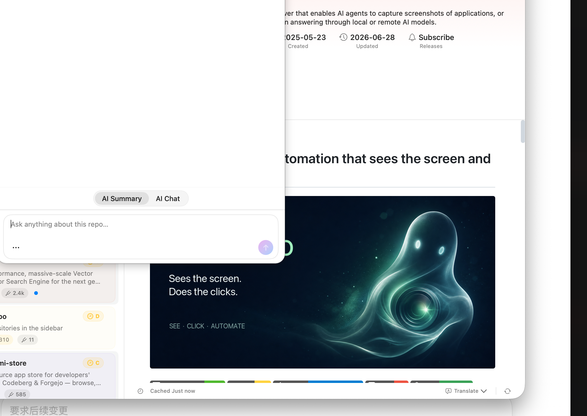

# 掘金

## 文章角度

掘金要以技术内容为主，产品可以自然出现，不要写纯宣传。建议写 Starcat 知识库 RAG 的本地混合检索架构、chunk 索引设计、向量加速优化、推荐服务边界和 MCP 桥接。

## 标题备选

- 从零构建本地知识库 RAG：一个 macOS GitHub Stars 工具的架构记录
- 本地 Hybrid RAG 实战：FTS5 + vDSP 向量加速 + chunk 索引设计
- 做一个带 RAG 问答的 GitHub Stars 本地知识库，我遇到了哪些架构问题

## 正文草稿

这篇记录我做 Starcat 知识库 RAG 时遇到的几个核心架构问题和技术决策。Starcat 是一个 macOS 原生应用，把 GitHub Stars 变成可搜索、可问答的本地知识库。


### 问题一：RAG 的数据边界怎么划？

做 RAG 的第一个问题不是用什么模型，而是：**检索范围是什么？**

直觉上可能是 "用户的所有 stars"。但仔细想想，stars 列表是一个很宽泛的集合。很多人有上千个 stars，里面有过往项目残留、一时兴起的 star、甚至已经不维护的仓库。把 RAG 直接挂在整个 stars 列表上，不仅检索质量下降，用户对回答的信任也会打折扣——"我 star 了 2000 个项目，其中一半我都没认真看过，AI 为什么引用这个不引用那个？"

所以我引入了 Starcat 里已有的一个概念：**知识库（Knowledge Base）**。

知识库是 stars 的一个子集，用户主动把真正研究过、有价值、想持续跟踪的仓库标记为"入库"（`library_state = in_library`）。RAG 默认只在这个范围内检索和回答。

```sql
repo_notes.library_state = 'in_library'
```

这带来的好处：
- **信任边界清晰**：用户知道 AI 是从自己筛选过的项目里找答案。
- **检索质量更高**：知识库里的 repo 通常有更多本地数据——笔记、AI 摘要、阅读状态，这些都可以做 chunk 来源。
- **隐私可控**：知识库 = 用户主动确认过的范围。

当然，如果有需要，用户也可以在问答里临时附加 GitHub issues / PRs / releases / security advisories 作为远程上下文，但这些远程数据不进入本地 RAG 索引，本轮结束后不保留。这是"临时补充"和"永久索引"的分界。

### 问题二：本地 Hybrid RAG 怎么做，不走纯云端？

大多数 RAG 方案把 embedding 和检索放在服务端。Starcat 选了另一条路：**Local-First Hybrid RAG**。

原因：
1. 用户的 stars 和知识库是个人兴趣图谱，默认不应该上传。
2. 本地检索对延迟更友好，不依赖网络。
3. 用户的 AI provider 可以自选，不绑死某个服务。

检索链路是这样的：

```
用户问题
    ├─→ FTS5 全文检索（本地 SQLite，按 BM25 排序）
    ├─→ 本地向量检索（本地 embedding + cosine 相似度）
    └─→ 可选：远程重排（用户主动开启的外部 Reranker）
         ↓
    分数融合 → Top-K chunk → Prompt 组装 → LLM 生成
```

两条检索通道各有适用场景：
- **FTS5 全文**：适合精确匹配。比如 "哪个项目用了 GRDB" — 关键词命中效率高。
- **本地向量**：适合语义理解。比如 "适合做本地持久化的轻量方案" — 这句话里没有 "GRDB"，但向量检索能找到相关 chunk。

两者的分数通过加权融合，再取 Top-K。远程重排只在用户主动开启时才引入，是一个增强而非必须的步骤。

### 问题三：1.8 万个向量，怎么扫得快？

本地向量检索有一个现实问题：当知识库有几百个 repo、每个 repo 拆出几十个 chunk，向量数量轻松过万。纯 Swift 循环计算 cosine 相似度，在 1.8 万个 1536 维向量上要跑很久。

第一版直接用 `vDSP`（Apple Accelerate 框架）替换了纯 Swift 的 cosine 计算：

```swift
// 关键路径：vDSP 批量点积 + L2 范数归一化
// 1.8 万向量 × 1536 维 → 23x 加速
```

这是实测数据：同样的数据集，vDSP 版本比纯 Swift 快了约 23 倍。对于本地向量检索来说，这个加速意味着用户可以实时得到结果，不用盯着加载动画。

### 问题四：chunk 怎么切，citation 怎么引用？

RAG 回答必须可追溯。只告诉你"某个 repo 相关"是不够的——用户需要一个能被验证的结论。

所以 Starcat 的 RAG 做了 **chunk-level 索引**，而不是 repo-level embedding。现有的 `repo_embeddings` 表能回答"哪些 repo 和你的问题语义相关"，但定位不到具体段落。chunk 索引把 README、用户笔记、AI 摘要按段落切分，每个 chunk 独立做 embedding。

回答时的引用链路：

```
LLM 回答 "项目 A 使用 GRDB 做本地存储，支持 FTS5 全文搜索"
  → 引用 [1]: starcat-app/Starcat / README.md § 技术栈 段落 3
  → 用户点击引用 → 跳转到具体段落位置
```



chunk 的元数据（来源 repo、来源文件、段落位置）存在 `rag_chunks` 表里，回答生成时 prompt 要求模型在结论后标注 chunk ID，前端解析后渲染为可点击的引用链接。

### 问题五：推荐服务的边界怎么留？

相似仓库推荐第一版通过 `starcat-recommend-api` 中转，不直接在客户端接第三方上游。


这个决策的原因是：
- **上游可替换**：第一版接 SimRepo，后续可以换成自研的内容向量或用户行为混合推荐。客户端只消费 `/api/v1/repos/{repo_id}/recommendations` 这一个稳定接口。
- **key 不暴露**：第三方 API key 放在服务端，不随客户端分发。
- **故障隔离**：推荐挂了不影响本地核心功能（搜索、标签、阅读）。

这本质上是把推荐服务当成一个"发现"能力的插件，不是 Starcat 的核心依赖。本地搜索和 RAG 问答才是主干。

### 问题六：怎么让外部 Agent 也能用？

Starcat 不只是给人用的，也面向 AI 工具链。它内置了一个本地 MCP Service，让 Claude、Codex 或其他本地 Agent 能：

- 查询用户的 stars 库和知识库
- 搜索 repo 元数据、README、笔记
- 获取 RAG 索引状态和 chunk 数据
- 通过 RepoContextPacker 获取结构化 repo 上下文

MCP Service 通过 `starcat-app/starcat-cli` 这个 Go 跨平台 CLI 暴露，终端里跑 `starcat mcp` 就能桥接。`starcat-app/starcat-skill` 定义了 Agent 工作流，让外部 Agent 编排 Starcat 的能力。

### 项目的组织方式

Starcat 的代码在 [github.com/starcat-app](https://github.com/starcat-app) 组织下，主应用和支撑服务分开维护：

| 项目 | 作用 |
|---|---|
| `Starcat` | macOS 主应用 |
| `starcat-pro` | 问题追踪 |
| `starcat-cli` | Go 跨平台 MCP 桥接 |
| `starcat-recommend-api` | 相似仓库推荐 |
| `starcat-trending-api` | Trending 数据 |
| `starcat-weekly-api` | Weekly 数据 |
| `starcat-sharing-api` | 分享链接与 OG 预览 |
| `starcat-wiki-api` | Wiki 元数据 |
| `starcat-discovery-api` | 探索发现 |

后端服务都遵循 `/ping` 契约统一注入版本号，确保客户端能检测服务健康状态。

---

如果你也在做 macOS / SwiftUI / 本地 RAG / AI 工具相关产品，欢迎到 `starcat-app/starcat-pro` 交流讨论。
