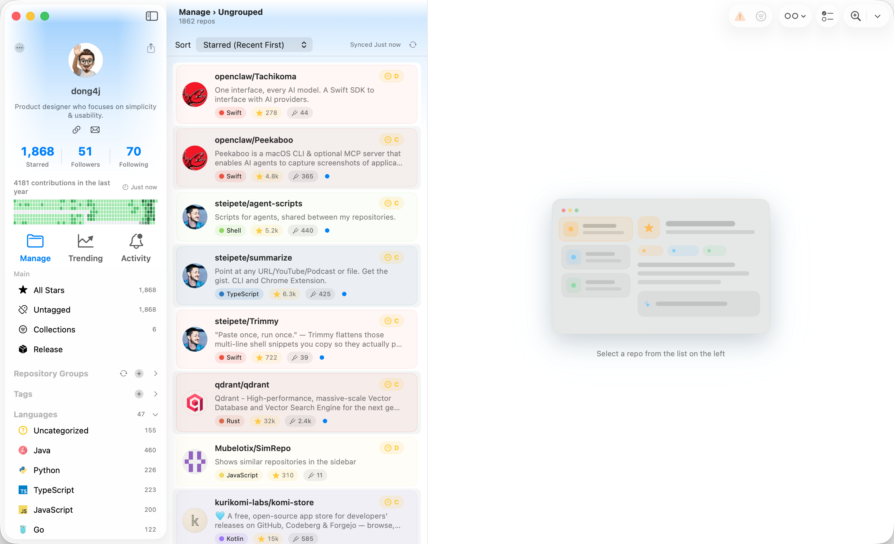

# 知乎

## 适合回答的问题

- 有哪些好用的 GitHub Stars 管理工具?
- 如何高效管理自己收藏的开源项目?
- macOS 上有哪些适合程序员的效率工具?
- 如何发现高质量 GitHub 开源项目?

## 回答草稿

如果你只是偶尔 star 几个项目,GitHub 自带的 Stars 页面就够了。真正麻烦的是另一种情况: 你长期做技术调研、写项目、看开源工具,stars 数量慢慢涨到几百甚至几千。

这时候 Stars 不再是收藏夹,更像一个没有整理过的个人开源项目数据库。问题不是"能不能看到列表",而是:

- 你还记不记得当时为什么 star?
- 能不能按场景找回项目?
- 能不能知道哪些项目已经不维护?
- 能不能比较几个相似方案?
- 能不能把 README、笔记、Release 和 AI 摘要放在一起看?

我自己为了解决这个问题做了一个 macOS 应用,叫 Starcat。

它的思路是把 GitHub Stars 同步到本地,然后把它变成一个可搜索、可标注、可阅读、可继续研究的知识库。

目前它支持:

- GitHub Stars 本地同步和缓存;
- README 阅读;
- 标签、笔记、阅读状态;
- 语言分组和 Smart Collections;
- 全文搜索、语义搜索;
- AI 摘要、标签建议、README 翻译和 repo 对话;
- Release 订阅和 Activity/Weekly 信息流;
- 相似仓库推荐入口。

我觉得这类工具的核心不是"替代 GitHub",而是补 GitHub 不负责的那一段: 收藏之后怎么整理、理解和找回。

后续 Starcat 会继续往三个方向做:

整理: 批量处理未分类 stars,合并相似标签,生成智能集合。  
发现: 找相似项目、替代品,做技术选型对比。  
消化: 生成 Stars 周报、Release 升级建议、回忆搜索和笔记草稿。

如果你问"有没有必要用 AI",我的看法是: AI 只有在贴着 repo 上下文时才有价值。泛泛地让 AI 推荐项目意义不大;但在你正在看一个 repo 时,让它总结 README、解释适用场景、建议标签、指出维护风险,这就比较实用。

所以 Starcat 的 AI 策略比较保守: 它可以建议,但不会自动改你的标签、笔记或收藏。所有写入都应该由用户确认。

