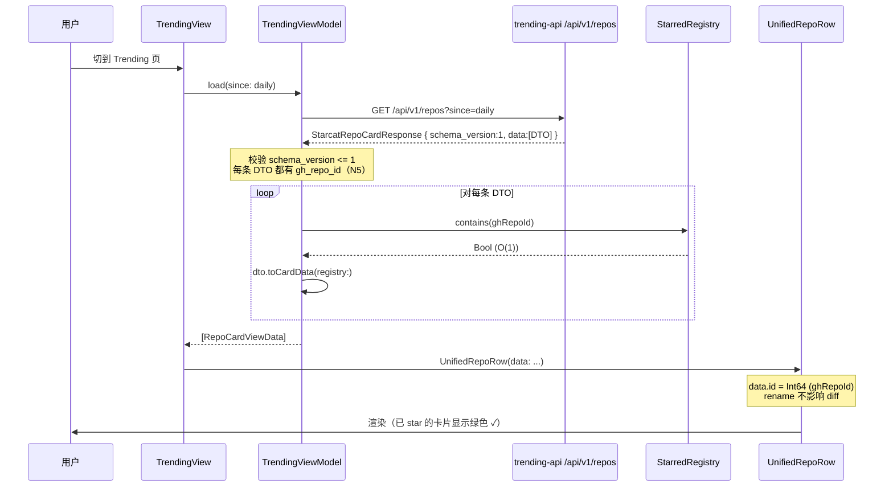
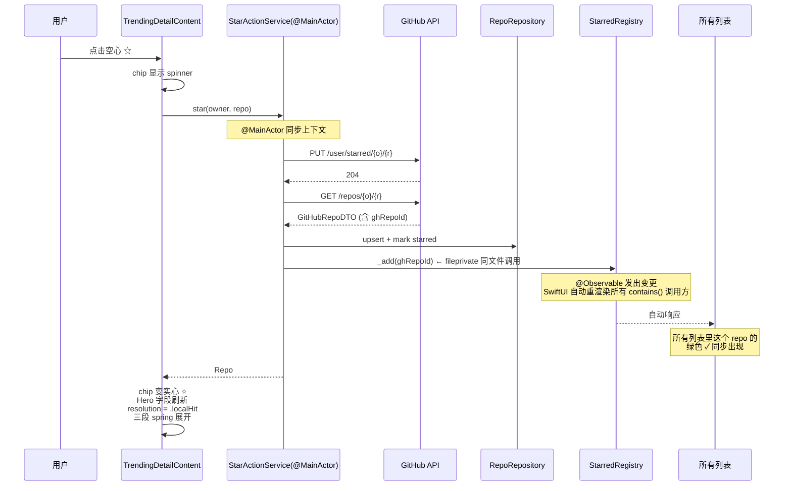
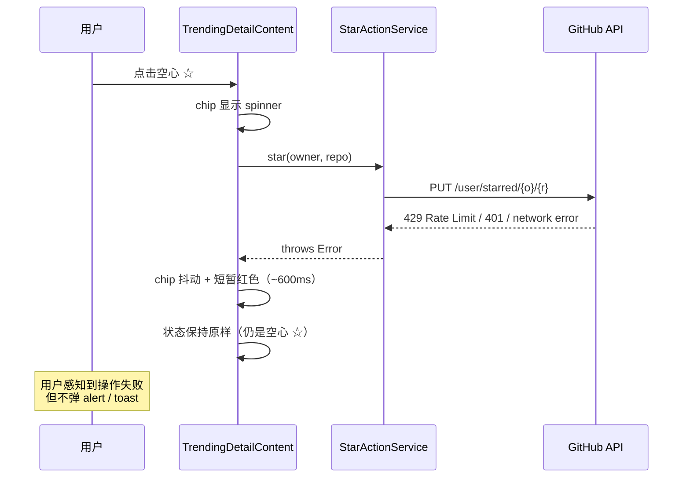
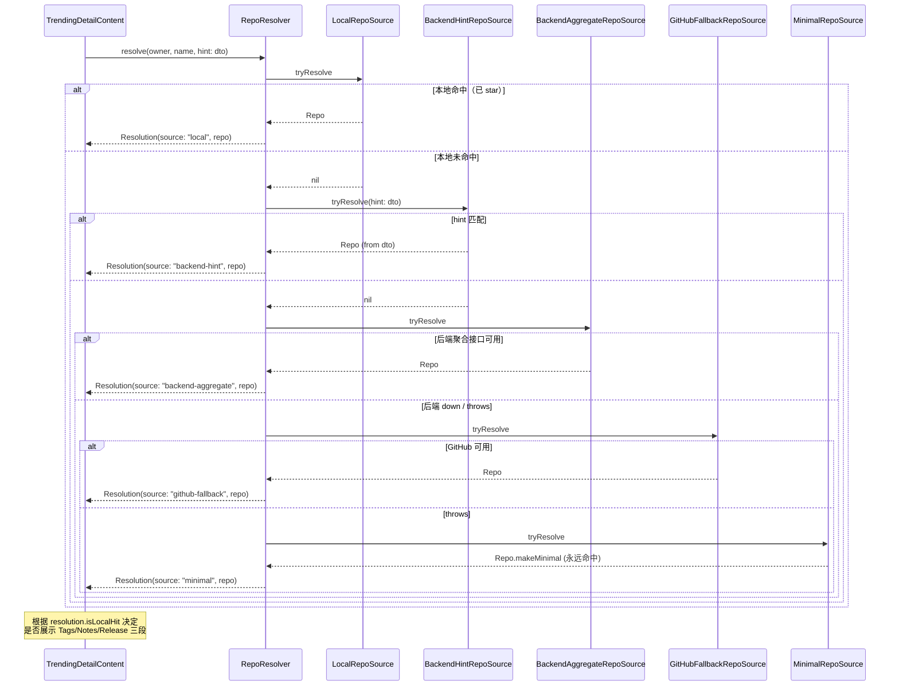

# 三场景共用架构（manage / trending / weekly）

> 创建：2026-06-09
> 状态：设计稿（待实现，R-01）
> 版本：**v1.2**（见下表 changelog；以本文档为单一信任源）
> 上游：dong4j 在 2026-06-09 提出「重后端 / 轻 starcat」原则并多轮 grill 后冻结
> 关联：
> - `docs/详细设计/06-核心模块设计.md`（Sync / Repository 模块边界）
> - `docs/详细设计/16-活动页设计.md`（Activity 聚合页定位）
> - `docs/详细设计/07-Trending数据本地缓存设计.md`（**部分取代**，见附录 B）
> - 后端服务：`supports/starcat-trending-api`、`supports/starcat-weekly-api`、`supports/starcat-sharing-api`

⚠️ **本设计取代** `07-Trending数据本地缓存设计.md` 中「方案 A：复用 `repos` 表」的所有结论——trending / weekly 数据**不再**落客户端 SQLite，全部由后端服务自有 SQLite 缓存。客户端只持有「用户私有数据」+「内存视图」+「派生集合」三类状态。

## 文档版本演进

| 版本 | 日期 | 主要调整 | 触发人 / 触发原因 |
|---|---|---|---|
| v1.0 | 2026-06-09 11:09 | 初稿冻结：UI 规范 + 数据 / 服务 / 后端三层 + StarcatRepoCardDTO + StarredRegistry + 10 关键决策 Q1-Q10 / N1-N5 | dong4j 多轮 grill 后定稿 |
| v1.1 | 2026-06-09 11:23 | dong4j review 三项：① UnifiedRepoDetailView 改 Scaffold + ContentView 插槽（避免 god view）② StarActionService `actor` → `@MainActor final class`（消除无意义 hop）③ CardID 直接 `Int64 = ghRepoId`（彻底告别 fullName 主键） | dong4j review 提出过度统一 / actor 错位 / fullName 漂移三大风险 |
| **v1.2** | **2026-06-09 11:30** | dong4j review 六项：① StarredRegistry 写权限 `fileprivate` 锁死 + 单文件 subsystem ② StarredRegistry 加 Snapshot 扩展点占位 ③ RepoResolver 改 Chain of Responsibility + RepoSource 协议 ④ Backend schema URL 版本化 `/api/v1/*` + 顶层 `schema_version` ⑤ GitHub Rate Limit 基础版做 / Token Pool 列 P2 ⑥ StarcatRepoCardDTO 加扩展段硬边界规则（防止 Article 字段污染 Repo schema） | dong4j review 提出双信任源 / 大规模启动 / God Resolver / Schema 锁死 / Rate Limit / DTO 拖垮六大风险 |

---

## 1. 背景与目标

### 1.1 现状（截至 2026-06-09）

Starcat 当前有四个「以 repo 为主体」的场景：

| 场景 | 数据来源 | 数据持久化 | 卡片实现 | 详情页实现 |
|---|---|---|---|---|
| Manage | GitHub `/user/starred` | 本地 `repos` 表（已 star） | `Features/Home/RepoRowView.swift` | `Features/Home/RepoDetailView.swift`（Manage 分支） |
| Trending | starcat-trending-api（爬虫） | ❌ 内存 only | `Features/Trending/TrendingRepoRowView.swift` | `RepoDetailView`（Trending 分支，**自写一套 header**） |
| Weekly | starcat-weekly-api（阮一峰周刊） | ❌ 内存 only | `Features/Activity/WeeklyContentView.swift` 内嵌 `WeeklyProjectRow` | `Features/Activity/WeeklyDetailView.swift` |
| Activity（repo-backed） | 本地 `repos` 派生 + `releases` 表 | 本地（与 manage 同源） | `Features/Activity/ActivityView.swift` 内嵌 `ActivityRowSurface` | `Features/Activity/ActivityDetailView.swift` |

### 1.2 问题

1. **卡片 surface 4 份重复**（D-17 已登记）：`RepoRowSurface` / `TrendingRepoRowSurface` / `ActivityRowSurface` / `WeeklyProjectRow` 视觉骨架 95% 相同，但模型不同（`Repo` / `TrendingRepo` / `WeeklyProject` / `ActivityItem`），改样式要动 4 处。
2. **Trending 详情自写一套 header**：未复用 `RepoMetadataHeaderView`，导致 Trending 详情**完全缺失** Tags / Notes / Releases 订阅 / 分享 / AI / 翻译 / Watchers / 时间字段等能力。
3. **Trending 详情只能 star、不能 unstar**：因为没有「当前用户是否已 star 过此 repo」的判断机制。
4. **Star/Unstar 流程 5 处重复**:3 处 `performUnstar` + 2 处 `performStar` 散落在 `RepoDetailView` / `ActivityDetailView` / `WeeklyDetailView`,改一次要改五处。
5. **没有全局「已 star 集合」**：`TrendingViewModel.subscribedRepoIDs` 是会话级，不能跨场景生效；导致 Trending / Weekly 列表无法标记「这个我已经收藏过」。
6. **后端字段不齐**：trending 缺 `id / forks / topics / dates / archived / fork / owner_avatar`，weekly 缺 `forks / dates / archived / fork / license`；前端卡片层接入这些字段会大量出现 `N/A`。
7. **数据归属混淆**：`07-Trending数据本地缓存设计.md` 早期方案让 trending 数据写客户端 DB，与「用户私有 vs 公共发现数据」的边界混淆。

### 1.3 目标

1. **UI 完全统一卡片 + 半统一详情页**：卡片层（manage / trending / weekly / activity-repo-backed）共用 `UnifiedRepoRow`；详情层走 `RepoDetailScaffold` 通用骨架 + 各场景独立 `ContentView` 插槽（**避免 god view**，详见 §3.2）。
2. **跨场景 star 状态联动**：任意场景 star / unstar 一个 repo，所有列表的「已 star ✓」标记和详情页的星标 chip 状态实时同步，不需要手动刷新。
3. **数据归属清晰**：客户端 SQLite **只存用户私有数据**（已 star repo + tags + notes + release 订阅 + AI 摘要等），trending / weekly 公共数据**全部在后端**。
4. **后端可独立演进 + 版本化保护**：trending / weekly / 未来其他发现型服务遵循同一份「Starcat Repo Card Schema」+ URL 版本化（`/api/v1/*`）+ 响应顶层 `schema_version` 字段，前端解码零适配；后端各自维护 SQLite + enricher + scheduler。
5. **降级路径明确**：详情层可走 GitHub `/repos/{o}/{r}` fallback；列表层不勉强降级，后端 down 即空态 + retry。
6. **代码净收益**：减少 ~2000 行重复 / 死代码，新增 ~1500 行结构化代码（适配层 + 服务层 + 统一组件 + ContentView 插槽 + Source 链）。

### 1.4 非目标

1. **不改 Manage 现有的 stars 同步 / 增量 / ETag / Rate Limit** 流程（W2/W4 已稳定）。
2. **不引入 CloudKit 同步层**（CloudKit 设计在 W5 单独处理）。
3. **不做 trending HTML 爬虫层的客户端 fallback**（GitHub Trending 无官方 API，客户端爬不可行）。
4. **不做 announcement / release / following 三类 activity 卡片的 README/翻译/AI 接入**（这些非 repo-backed，沿用现状）。
5. **不动 sidebar 结构**（dong4j 明确 Q6 维持现状，weekly 仍归 Activity 子分类）。
6. **不做 Token Pool / GitHub App 改造**（v1.2 review R5：列入 P2，触发阈值后再做）。

---

## 2. 总体架构

### 2.1「重后端 / 轻 starcat」原则

| 维度 | 后端职责 | 客户端职责 |
|---|---|---|
| trending / weekly 数据源对接 | ✅ 爬取、解析、enricher 补字段 | ❌ |
| trending / weekly 数据持久化 | ✅ SQLite 落库 + 缓存 | ❌ |
| 字段聚合 | ✅ 返回前端开箱即用的 schema | ❌ |
| 已 star 数据 | ❌ 不存（用户私有 + 量级） | ✅ SQLite 主表 |
| tags / notes / 阅读状态 / 订阅 / AI 摘要 | ❌ | ✅ SQLite + 未来 CloudKit |
| StarredRegistry | ❌ | ✅ DB 派生，内存集合 |
| 跨场景 star 状态联动 | ❌ | ✅ `StarredRegistry` + `@Observable` |
| 详情页字段 | ✅ 优先后端聚合 | ✅ 后端 down 时 fallback GitHub `/repos` |

### 2.2 架构图

```mermaid
flowchart TB
    subgraph 后端
        BT[trending API<br/>/api/v1/repos<br/>SQLite + enricher + scheduler]
        BW[weekly API<br/>/api/v1/projects<br/>SQLite + enricher 扩字段]
    end

    subgraph 数据层 Starcat/Core
        DB[(本地 SQLite<br/>repos / tags / notes / ...)]
        SR[StarredRegistry<br/>Set Int64<br/>@MainActor @Observable<br/>fileprivate writes]
        RR[RepoRepository]
        SM[SyncManager]
    end

    subgraph 适配层
        DTO[StarcatRepoCardDTO<br/>v1 schema]
        CVD[RepoCardViewData<br/>id = ghRepoId Int64]
        DVD[RepoDetailViewData]
    end

    subgraph 服务层
        SAS[StarActionService<br/>@MainActor class<br/>同文件 StarringSubsystem]
        RES[RepoResolver<br/>Chain of Responsibility]
        S1[LocalRepoSource] & S2[BackendRepoSource] & S3[GitHubRepoSource] & S4[MinimalRepoSource]
    end

    subgraph UI 层
        Surf[RepoRowSurface 统一容器]
        Row[UnifiedRepoRow]
        Scaf[RepoDetailScaffold<br/>Hero + Toolbar + Floating]
        MC[ManageDetailContent] & TC[TrendingDetailContent] & WC[WeeklyDetailContent] & AC[ActivityRepoDetailContent]
    end

    BT --> DTO
    BW --> DTO
    SM --> DB
    SM --> SR
    RR --> DB
    DTO --> CVD
    DTO --> DVD
    SR -.fill isStarred.-> CVD
    SR -.fill isStarred.-> DVD
    SAS --> SR
    SAS --> RR
    SAS -.调 API.-> BT
    S1 & S2 & S3 & S4 --> RES
    Surf --> Row
    Scaf --> MC & TC & WC & AC
    Row -.click.-> Scaf
    Scaf -.点 star.-> SAS
```

### 2.3 各层职责详解

| 层 | 职责 | 不做的事 |
|---|---|---|
| 后端服务 | 数据源对接、字段补全、SQLite 缓存、`/api/v1/*` 版本化 schema | 不知道当前用户身份，不返回 `is_starred` |
| 数据层 `Core/` | 用户私有数据持久化、`StarredRegistry` 维护（**写权限文件级锁死**）、`SyncManager` 同步 | 不持有 trending / weekly 列表数据 |
| 适配层 `Shared/Models/` | 把 DTO + Registry 状态拼成 view 直接消费的视图数据；`id = ghRepoId` 单维主键 | 不做网络、不做持久化 |
| 服务层 `Core/Sync/` | 统一 star / unstar 链路（**StarringSubsystem 单文件**）、详情页 Source Chain | 不做 UI 渲染 |
| UI 层 `Shared/Components/` | `RepoRowSurface` + `UnifiedRepoRow`（卡片完全统一）+ `RepoDetailScaffold`（详情通用骨架） | 不知道场景特定的 section 组合（交给各 ContentView） |
| 场景层 `Features/` | 各场景的 `XxxDetailContent` 自己拼 section 顺序、ViewModel、数据加载 | 不直接画 hero / toolbar（交给 Scaffold） |

---

## 3. UI 规范

### 3.1 卡片层

#### 3.1.1 密度

- **彻底删除 compact 密度**（dong4j Q9 + 「无历史包袱」前提）
- 唯一密度：**Card**（3-4 行高，含描述 + chip 行）
- 删除范围：
  - `Core/Settings/AppSettings.swift` 的 `listDensity` 字段 + 持久化 key
  - `Features/Settings/SettingsView.swift` 的 ListDensity Picker UI
  - `RepoRowCompact` / `TrendingRepoRowCompact` 子视图
  - `RepoListDensity` 枚举本身（不留 `.card` 单 case，调用点直接去掉参数）
  - `RepoRowSkeletonView` 内的 compact 分支

#### 3.1.2 已 star 标记

| 项 | 规格 |
|---|---|
| 图标 | SF Symbol `checkmark.circle.fill` |
| 颜色 | systemGreen（Light / Dark 自适应） |
| 尺寸 | 11pt |
| 位置 | fullName 左侧紧贴，4pt 间距 |
| 显示条件 | **v1.8 双条件 AND**：`UnifiedRepoRow(showStarredCheckmark: true)` && `RepoCardViewData.isStarred == true` |
| 显示场景 | Trending / Weekly 列表（让用户一眼认出哪些已 star，无需打开详情）|
| **不显示场景** | **Manage 列表（本就是已 star 列表，挂 ✓ 视觉冗余）** / Activity 卡片（kind icon 已暗示） |
| 未登录用户 | `StarredRegistry` 为空，所有 `isStarred = false`，永不显示 |

> **v1.8 修订（2026-06-10, dong4j bug 反馈）**：
>
> v1.7 之前实现把 ✓ 渲染条件**单纯挂在** `card.isStarred`，但 `Repo.asCardData()`
> 直接读 `self.isStarred`，Manage row 全部来自本地 `repos.is_starred=1` 表
> → row 100% 显 ✓ → **视觉冗余**（Manage 视图本就是已 star 列表，挂 ✓ 没意义）。
>
> v1.8 把 ✓ 渲染改为 **view 层显式入参 + isStarred 双条件 AND**：
> `UnifiedRepoRow(showStarredCheckmark:)` 默认 `false`，调用方按场景显式传：
> - Manage（`RepoListView`）：不传 → 默认 false → 不显 ✓
> - Trending（`TrendingView`）：传 `true` → 已 star 的 row 显 ✓
> - Weekly（`WeeklyContentView`）：传 `true` → 已 star 的 row 显 ✓
>
> 默认 false 的语义是「除非显式声明，否则不显」—— 安全策略，避免再次出现
> 「全显 ✓」式的实现疏忽。`RepoCardViewData.isStarred` 字段保留（详情页 / 跨页同步会用），
> 只是 row 渲染条件由单挂 `isStarred` 改为 view 入参 + isStarred 双条件 AND。

#### 3.1.3 各场景卡片元素

```
通用骨架：
┌─ accent bar (3px，仅选中态，语言色)
│
│  [头像40]  [✓?] full_name              [Fork/Archive/Private chips]
│            description (2 行截断)
│            [Lang] [Stars] [Forks] [场景独有 chip ...]
│            [场景独有 accessory ...]
└─
```

| 场景 | 头像 | 已 star 标记 | description | 标准 chip 行 | 场景独有元素 |
|---|---|---|---|---|---|
| Manage | 40pt | **—**（v1.8：本就已 star 列表，不显） | 2 行 | Lang → Stars → Forks → Archive → starredAt | — |
| Trending | 40pt | ✓ | 2 行 | Lang → Stars → Forks → **`↗ +N`** (绿色填充) | — |
| Weekly | 40pt | ✓ | 2 行 | Lang → Stars → Forks | 卡片右上：**`📰 第 N 期`** outline + `#dea584` 文字 |
| Activity-star/repository/suggestion | 40pt | ✗（kind 已暗示） | 2 行 | Lang → Stars → Forks | 左上 kind icon + 右上相对时间 |
| Activity-release | 自定义 | ✗ | release body | tag chips | 右上相对时间 |
| Activity-announcement | 公告 icon | ✗ | body 摘要 | — | 右上时间 |

#### 3.1.4 Weekly 期号徽章颜色（Q8 决策）

- 配色：`#dea584`（与 `ActivityCategory.weekly.iconColorHex` 一致）
- 样式：**outline 边框 + 同色文字**（不填色）
- 理由：避免与 Rust 语言色（同色 `#dea584`）撞色——Rust 语言 chip 是浅色填充，Weekly 徽章是 outline，二者并存视觉不冲突

#### 3.1.5 卡片选中态视觉（保持现状）

- 选中：左侧 3pt 语言色 accent bar + 0.18 accent 底 + 0.42 accent 边框
- hover：0.08 accent 底 + 0.18 accent 边框
- 普通：0.045 accent 底（card 密度，无边框）

#### 3.1.6 卡片**不**包含 star / unstar 按钮

- dong4j 之前 grill 阶段明确：列表卡片**不直接放 star 按钮**，只显示「已 star」标记
- 卡片点击只有「选中 / 进入详情」一种交互

#### 3.1.7 Activity 列表 row 的派发规则（**v1.9 修订, 2026-06-10**）

R-01 设计本就明文要 Activity-repo-backed 卡片接 `UnifiedRepoRow`（见 §3.1.5 / §1 概述），但 P0 落地时 Activity 全走独立的 `ActivityRowView`，导致**四场景统一 row 实际只统一了 3 个**（Manage / Trending / Weekly）。dong4j 在 v1.9 真机回归发现并下令一次切干净。

`ActivityKind` 共 6 种，**派发规则**如下：

| kind | row 渲染 | 理由 |
|---|---|---|
| `star` | `UnifiedRepoRow` | 纯仓库型 —— 主体就是 repo 自身 |
| `repository` | `UnifiedRepoRow` | 同上 |
| `suggestion` | `UnifiedRepoRow` | 同上 |
| `release` | `ActivityRowView`（**保留**） | release name 必须主位 + 未读 chip 渲染槽，与 UnifiedRepoRow「以仓库为主体」语义冲突 |
| `announcement` | `ActivityRowView`（**保留**） | `item.repo == nil`，无法构造 `RepoCardViewData`（必填 fullName / owner / repo / ghRepoId）|
| `following` | `ActivityRowView`（**保留**） | 同 announcement，且 ActivityViewModel 当前未生产，仅占位 |

**`UnifiedRepoRow` 已有 `case .activityKind(category, date) = card.badge` 分支自动渲染**：
- 头像角的 kind icon 圆角标（来自 `ActivityCategory.systemImage` + `.iconColor`）；
- 右上角的 `RelativeDateBadge`（来自 `item.createdAt`）。

入参用 `repo.asCardData(badge: .activityKind(item.category, item.createdAt ?? .distantPast))`，无需改 `RepoCardViewData` / `UnifiedRepoRow`，无需新增 helper。

**`showStarredCheckmark` 不传**（默认 false）—— `ActivityViewModel.filter { $0.isStarred }` 已过滤 100% starred，挂 ✓ 视觉冗余，与 v1.8 Manage 同策略。

### 3.2 详情页层（v1.1 改 Scaffold + 插槽，**不做 UnifiedRepoDetailView**）

#### 3.2.0 为什么不做 UnifiedRepoDetailView（v1.1 关键设计决策）

> **dong4j review 提出的核心风险**（2026-06-09 11:23）：
> 卡片通常能统一 95%，**但详情页通常只能统一 70%**。
> 「带 sections 配置的统一详情页」模式（`UnifiedRepoDetailView(sections: DetailSections)`）在工程项目里有**确定性**的腐烂路径：
> - 6 个月后必然演化成 `if sections.tagsAndNotes / if sections.releases / if sections.weeklyIssueButton / if sections.trendingContributors / if sections.activityTimeline / ...`
> - 加新场景就要给 `DetailSections` 加配置字段，每次都触碰统一 view
> - 单文件 1500+ 行后无人敢动
> - 测试要排列组合所有 sections

**v1.2 采纳的方案：Scaffold + ContentView 插槽**

| 角色 | 职责 |
|---|---|
| `RepoDetailScaffold` | **通用骨架**：Hero header（含 stats chips / star chip）+ trailing actions 数组 + 翻译浮动按钮 + 刷新浮动按钮 + 折叠面板动画 + README 滚动监听 |
| `ManageDetailContent` / `TrendingDetailContent` / `WeeklyDetailContent` / `ActivityRepoDetailContent` | **各场景自己组装**：调用同一组共享 Section 组件（`RepoTagsSection` / `RepoNotesSection` / `RepoReleaseSection` 等）拼成本场景特有的内容流 |

#### 3.2.1 Scaffold 整体结构

```
┌─ Hero Header (CollapsibleRepoMetadataPanel 折叠容器) ─────────┐
│  [头像 64]  full_name              [trailing actions →]       │
│            description                                        │
│            [⭐/☆ Stars] [🔱 Forks] [👁 Watch ▾]              │
│            [📅 Updated] [LICENSE] [Topics chips...]           │
└──────────────────────────────────────────────────────────────┘

┌─ Content 插槽（各场景自己渲染） ────────────────────────────┐
│  ManageDetailContent:                                       │
│    Tags 段 → Notes 段 → Releases 订阅段 → README            │
│                                                             │
│  TrendingDetailContent:                                     │
│    [若已 star] Tags 段 → Notes 段 → Releases 订阅段          │
│    Trending Contributors 段                                 │
│    README                                                   │
│                                                             │
│  WeeklyDetailContent:                                       │
│    [若已 star] Tags 段 → Notes 段 → Releases 订阅段          │
│    README                                                   │
└──────────────────────────────────────────────────────────────┘
                                                              
                                    [🌐 翻译] (浮动按钮，Scaffold 控制)
                                    [🔄 刷新] (浮动按钮，Scaffold 控制)
```

#### 3.2.2 Scaffold 接口（草案）

```swift
struct RepoDetailScaffold<Body: View>: View {
    /// Hero header 数据 + 操作
    let hero: RepoDetailHero

    /// 右上 trailing actions（按显示顺序排）
    /// 各场景自由组合：Manage = [share, ai]；Weekly = [weeklyIssue, share, ai]；Trending = [share, ai]
    let trailingActions: [RepoDetailAction]

    /// 翻译数据源；nil 时不渲染翻译浮动按钮
    let translation: ReadmeTranslationContext?

    /// 右下浮动刷新；nil 时不渲染
    let onRefresh: (() async -> Void)?

    /// 详情正文（插槽）
    @ViewBuilder let body: () -> Body
}

struct RepoDetailHero {
    let ghRepoId: Int64?              // nil 时禁用 star chip（minimal fallback 场景）
    let avatarURL: URL?
    let fullName: String
    let description: String?
    let stars: Int
    let forks: Int?
    let watchers: Int?
    let topics: [String]
    let licenseSpdx: String?
    let updatedAt: Date?
    let createdAt: Date?
    let isArchived: Bool
    let isFork: Bool
    let isStarred: Bool
    // ... 其他 hero 字段
}

enum RepoDetailAction: Identifiable {
    case share                                      // ← v1.3 修订（详见下方 amendment）
    case ai                                         // ← v1.3 修订（详见下方 amendment）
    case weeklyIssue(number: Int, url: URL)
    case custom(id: String, label: String, systemImage: String, handler: @MainActor () -> Void)
    var id: String { ... }
}
```

> **v1.3 设计修订（2026-06-10，dong4j P1 审计）**：
>
> 原设计中 `.share(handler: () -> Void)` / `.ai(handler: () -> Void)` 携带 handler 入参，
> 意图是支持各场景自定义点击行为。但**实现落地后发现 handler 实际是冗余参数**：
>
> 1. share / ai 行为对所有 repo 完全一致：share 必走 AI 摘要 + 分享卡，
>    ai 必走 RepoAIWindowController 弹窗。
> 2. Scaffold 内部 `actionButton(for:)` 直接渲染 `RepoShareButton(repo:)` /
>    `RepoAIOpenButton(repo:)` 自治组件，其状态机（progress / alert / window
>    控制器）完全自治，外部 handler 没有注入点。
> 3. 4 个场景（Manage / Trending / Weekly / Activity-repo-backed）真实落地的
>    handler 全部是空闭包 `{}` —— dead 参数。
>
> 决策：把 `.share` / `.ai` 修订为无参 case，handler 入参从设计层移除。
> 若未来确实需要场景特化（例如 Activity-announcement 想 share 跳别处），
> 改用 `.custom(id:label:systemImage:handler:)` 显式注入即可（这才是 handler
> 入参合理的归属）。`.custom` 同步收紧：label 改 String（非 LocalizedStringKey），
> handler 加 `@MainActor`，与实现一致。

#### 3.2.3 Star / Unstar 交互（Q1/Q2/N1/N2 决策，在 Scaffold 的 hero 区落地）

触发点：stats 行的 ⭐/☆ chip（不在 trailing actions 加独立按钮）

| 状态 | chip 视觉 | 点击行为 |
|---|---|---|
| 已 star | ⭐ 实心黄 + 数字 | 直接 unstar（**无 confirm alert**） |
| 未 star | ☆ 空心灰 + 数字 | 直接 star |

**反馈策略（API 200 才变 UI，不做乐观 UI / 撤销 toast）**：

| 阶段 | 视觉 |
|---|---|
| 用户点击 | 立刻禁用 chip 防双击 |
| API 进行中 | chip 显示 spinner 替代 ⭐/☆ 图标（GitHub 网页风格） |
| API 200 | chip 变更为目标状态；同时刷新 Hero 字段（见 3.2.5）+ 触发三段动画（见 3.2.4） |
| API 失败 | chip 抖动 + 短暂红色（约 600ms），状态保持原样；不弹 toast，不修改任何数据 |

**Unstar 数据语义**：`markUnstarred(repoId:)` 只置 `is_starred=false`，**保留** tags / notes / release 订阅 / AI 摘要等用户私有数据。用户后续重新 star 时自动恢复（因索引 = `gh_repo_id` 不变）。

#### 3.2.4 三段过渡动画（Q10 / N3 决策，由 ContentView 控制）

```
T0: 用户点 ☆
T1: API star → 200
T2: GET /repos/{o}/{r} 拉完整字段
T3: DB upsert + Registry add
T4: fetch tags(空) / notes(空) / release 订阅状态(无)
T5: ContentView 内 isStarred 翻 true → Tags/Notes/Release 三段 spring 0.25s 从顶部展开
```

**关键约束（Q10）**：API + DB **数据就位才**触发动画展开，**不在 loading 时先展开占位**。三段展开时数据已就位，内部直接渲染最终状态。

动画规格：
- transition: `.move(edge: .top).combined(with: .opacity)`
- animation: `.spring(response: 0.25, dampingFraction: 0.85)`

实现位置：**ContentView 内部**（不是 Scaffold）——因为各场景的 section 集合不同，Scaffold 不该知道有几段要展开。

> **v1.4 设计修订（2026-06-10，dong4j bug 反馈）：未登录态下三段必须隐藏**
>
> 原设计中三段可见性条件为 `repo.id != 0`（本地命中）。但 dong4j 发现实际落地仍有泄漏路径：
>
> 1. `AuthSession.signOut()` 出于「保护用户数据，重新登录后不丢笔记」的合理设计，**不**清空
>    `repo_tags` / `repo_notes` / `release_subscriptions` 表；
> 2. 用户**曾登录过**再登出后，`StarredRegistry` 已清，但本地 DB 仍有历史数据；
> 3. trending / weekly 详情页 `resolveRepo` 走 `findByOwnerName` 仍可能命中本地（`repo.id != 0`），
>    单 id 守卫无法防住「已登出 + 本地有历史数据」corner case → 三段会渲染上一个登录用户的
>    标签 / 笔记 / 订阅 → 隐私泄漏。
>
> **修订**：三段可见性条件加上「已登录」前提，统一为 `isAuthenticated && repo.id != 0`。
> 实现位置：`Starcat/Shared/Components/RepoLocalSections.swift` 内部读
> `@Environment(AuthSession.self)`，4 个 ContentView 调用方零改动（一处覆盖全场景）。
> 同时把 `.animation(value:)` 的 dependency 从 `repo.id` 切到计算属性 `isVisible`，覆盖
> 「登录态变 / repo.id 变 / 切不同详情页」三种触发源。
>
> **配套：trailingActions(.share / .ai) 同步加 isAuthenticated 守卫**——分享卡（`StarcatRepoCardDTO`
> 上传后端）和 AI 摘要（BYOK key + 缓存键 = repo.id）都是登录后的功能，未登录态展示是误导。
> `.weeklyIssue`（公开 GitHub issue 外链）与登录态独立，继续保留。
> 4 个调用方（TrendingScaffoldShell / WeeklyDetailView / RepoDetailView / ActivityDetailView）
> 各自加守卫，不抽 helper（每处 1-2 行，间接层得不偿失）。

> **v1.5 设计修订（2026-06-10 下午，dong4j bug 反馈）：三段从 ContentView 迁回 Scaffold metadataPanel**
>
> v1.2 P0（2026-06-10 上午）把 `RepoLocalSections` 三段从 `RepoMetadataHeaderView` 下沉到
> ContentView，理由是「各场景的 section 集合不同，hero 不该知道有几段要展开」。但 dong4j
> 真机测试发现新 bug：
>
> 1. 当前结构 `Scaffold body = VStack { metadataPanel(Hero+heroExt); body_(ContentView) }`，
>    其中 `metadataPanel` 包在 `CollapsibleRepoMetadataPanel` 折叠容器内，会按 scroll progress
>    折叠；
> 2. 但 `RepoLocalSections` 在 ContentView 的 VStack 里、**不在折叠容器内**——scroll progress
>    驱不动它；
> 3. 实际表现：滚动 README 时 hero 可以折叠收起，但中间三段（Tags / Status / Notes / Releases）
>    永远占据屏幕中部，挤压 README 阅读区。
>
> **根因复盘**：v1.2 P0「Scaffold 不该知道有几段要展开」原则在 4 场景实际落地后**事实上没被
> 使用**——4 个 ContentView 的 `RepoLocalSections(repo: repo)` 调用 100% 同构、无任何场景
> 特化参数。抽象层"灵活性"在事实上没有被使用，反而把折叠机制割裂。
>
> **方案 A 决策**（vs slot 化 / vs progress 透传）：把 `RepoLocalSections(repo: repo)` 内置到
> `RepoDetailScaffold.metadataPanel` 内、`heroExtension` 之后，跟随 `CollapsibleRepoMetadataPanel`
> 的 scroll progress 一起折叠。理由：
>
> - **折叠一致性 > 抽象灵活性**：4 场景同构事实推翻 v1.2 P0 原则；
> - **零额外代码**：`CollapsibleRepoMetadataPanel` 已是通用容器，PreferenceKey 测自然高度，
>   `visibleHeight = panelHeight × (1 - progress)` 同步衰减——三段加入后面板高度自然增长，
>   折叠时一起收起；
> - **Surgical Changes 原则**：4 场景 ContentView body 简化为只剩 `ReadmeStateView`，删除重复的
>   VStack 包装；
> - **抽象与使用对齐**：`RepoLocalSections` 自身是"4 场景共享的本地数据段"抽象，由 Scaffold 单点
>   挂载比 4 场景重复传 slot 更直观。
>
> **实现位置**：
> - `Starcat/Shared/Components/RepoDetailScaffold.swift` `metadataPanel` 内 hero + heroExt 之后
>   追加 `RepoLocalSections(repo: repo)`；
> - 4 个 ContentView（`ManageDetailContent` / `TrendingDetailContent` / `WeeklyDetailContent` /
>   `ActivityRepoDetailContent`）body 删去自己的 `RepoLocalSections(repo:)` 调用 + VStack 包装，
>   只剩 `ReadmeStateView`。
>
> **保留**：v1.4 守卫（`isAuthenticated && repo.id != 0`）+ spring 0.25s star 后展开转场动画
> 都由 `RepoLocalSections` 内部自治不变。spring 转场与折叠面板的 PreferenceKey 高度变化协同
> ——两层都是 short-duration spring，叠加视觉 OK。

> **v1.7 设计修订（2026-06-10 晚, dong4j bug 反馈）：可见性 + star 行为统一绑 StarredRegistry 派生**
>
> dong4j 在真机回归发现 3 个相关 bug:
>
> 1. **AI 摘要 FK 失败**:`SQLite error 19: FOREIGN KEY constraint failed -
>    INSERT INTO ai_summaries (repo_id, ...)` —— 用户在 trending 详情页(未 star)
>    点 AI 摘要触发。
> 2. **活动分类下未 star repo 也展示私人面板**:违反原设计「按 isStarred 派生」。
> 3. **4 详情页 star 行为不统一**:Manage / Activity 写死 unstar / Trending 按
>    `repo.isStarred` 二分 / Weekly 未命中跳 stargazers 页面 → 各家自由发挥。
>
> **根因(共同)**:R-01 v9 schema 给 `trending_repos` 加 `gh_repo_id` 列后,
> `TrendingRepo.makeEphemeralRepo()` 用 ghRepoId 作 `Repo.id` →
> 未 star 的 trending repo 也满足 `repo.id != 0` → v1.4 守卫 `repo.id != 0` 彻底失效:
>
> - 三段 / 分享 / AI 按钮被错误展示;
> - 用户点 AI 摘要时 `INSERT INTO ai_summaries(repo_id=ghRepoId)` FK 失败,
>   因为 repos 表里没有这条(用户没 star,也没本地缓存)。
>
> 4 详情页 `onStarTapped` / `trailingActions` / `starHelpKey` 行为契约**散落在场景层**
> (R-01 v1.2 设计的"统一"只统一了 UI 骨架 Scaffold,行为契约留给场景方自由组合),
> 是 3 个 bug 共同的工程层根因。
>
> **v1.7 把行为契约也统一收口**——所有「私人功能可见性 + star toggle 行为」
> 全部以 **`StarredRegistry`(R-01 v1.2 §4.3 写权限 fileprivate 锁死的运行时单一信任源)**
> 派生:
>
> 1. **`RepoLocalSections.isVisible`**:`isAuthenticated && repo.id != 0`
>    → `isAuthenticated && starredRegistry.contains(ghRepoId: repo.id)`
> 2. **4 详情页 `trailingActions`**:同上替换守卫
> 3. **4 详情页 `starHelpKey`**:tooltip 由 registry 派生(已 star 显示「取消 star」,
>    未 star 显示「Star」),与 onStarTapped 行为对齐
> 4. **`StarActionService.toggle(repo:)` helper**——内部按 registry 派生 star/unstar:
>    ```swift
>    func toggle(repo: Repo) async throws {
>        if registry.contains(ghRepoId: repo.id) {
>            try await unstar(repo: repo)
>        } else {
>            _ = try await star(owner: repo.owner, repo: repo.name)
>        }
>    }
>    ```
> 5. **4 详情页 `onStarTapped` 模板同构**(6 行):
>    ```swift
>    guard isAuthenticated else { signIn(); return }
>    try await dependencies.starActionService.toggle(repo: repo)
>    await homeViewModel.refreshSidebar()
>    await homeViewModel.reloadItems(forceRefresh: true)
>    ```
> 6. **删 weekly 未命中跳 stargazers 页面妥协**——`StarActionService.star`
>    内部已包含 `PUT /user/starred` + `GET /repos` + DB upsert,与 trending
>    完全同路径,妥协无必要。weekly 也能直接 star 入自己账户。
>
> **影响**:
> - 未 star 任何场景的 repo:分享 / AI / Tags / Notes / Releases 订阅全部隐藏 → 干净
> - 已 star 任何场景的 repo:全部展开 → 一致
> - 用户在 trending / weekly 详情页 star 后:registry @Observable → 私人面板自动展开
>   → AI 按钮自动出现 → 点 AI 时 repos 表已有这条 → 不会再 FK 失败
> - 取消 star 后:私人面板自动收起(R-01 §3.2.3 决定 unstar 不删用户私有数据,
>   重新 star 时 tags/notes 自动恢复)
>
> **设计反思**:R-01 v1.2 设计「统一详情页」边界画在视图骨架 (Scaffold) 上,
> `onStarTapped` / `trailingActions` 等"行为"留给场景方,本是为避免 god view
> (v1.1 修正);但**行为契约也属于"统一对象"**,光统一 UI 骨架不够。
> v1.7 把行为契约统一收口到 `StarActionService.toggle` + `StarredRegistry.contains`
> 两个 API 上,4 详情页彻底同构。后续新加场景只需复制 6 行 `onStarTapped` 模板,
> 不再有"自由发挥空间"。
>
> **实现位置**:
> - `Starcat/Core/Sync/StarringSubsystem.swift` 加 `toggle(repo:)` helper;
> - `Starcat/Shared/Components/RepoLocalSections.swift` `isVisible` 改 registry 派生;
> - `Starcat/Features/Home/RepoDetailView.swift` Manage 分支 + 新增 helper 方法;
> - `Starcat/Features/Trending/TrendingScaffoldShell.swift` `handleStarTapped` /
>   `trailingActions` / `starHelpKey` 改 registry 派生;
> - `Starcat/Features/Activity/ActivityDetailView.swift` `repoBackedDetailPage` +
>   新增 helper 方法;
> - `Starcat/Features/Activity/WeeklyDetailView.swift` `handleStarTapped` /
>   `trailingActions` / `starHelpKey` 改 registry 派生 + 删跳 stargazers 妥协逻辑;
> - `Starcat/Features/Home/RepoMetadataHeaderView.swift` 文件头注释更新到 v1.7。

> **v2.0 设计修订(2026-06-10 晚, dong4j 真机回归后从 v1.7 单一信任源回归)：view 层用 `repo.isStarred`,service 层用 `repo.isStarred || registry.contains(...)` 折中**
>
> dong4j 在 v1.7 + v1.8 上线后真机回归发现 v1.7 引入了 2 个新 bug:
>
> 1. **Manage 详情页所有已 star repo 三段全部不显**(私人面板消失);
> 2. **Manage 已 star repo 点 ⭐ 居然走 star 而不是 unstar**(用户感知是「重新 star」);
>
> **根因**:`StarredRegistry.reload()` 是异步的(`AppDependencies.init` 末尾
> `Task { await bootstrapper.reload() }`),且 `SyncManager` 304 ETag 命中早退路径
> 直接 `return`,**不触发 `onSyncCompleted` hook**(v1.7 漏修复点)。任一路径未跑完
> registry.ids 就是空集 → 4 详情页所有依赖 `registry.contains(...)` 派生的守卫
> (isVisible / trailingActions / starHelpKey)全部返回「未 star」语义 →
> 三段不显 + ⭐ 走 star。
>
> v1.7 选 registry 作为单一信任源的理由是「写权限 fileprivate 锁死」,但
> **「写权限锁死」≠「读时机已就绪」** —— bootstrap 时序与 view 层渲染时序错开是
> 客观存在的 corner case,选异步生效的对象作单一信任源是个设计错误。
>
> **v2.0 折中策略**:**view 层 + service 层信任源拆开**,各取所长:
>
> 1. **view 层守卫(isVisible / trailingActions / starHelpKey)**:全部回归
>    `repo.isStarred`(本地 DB `is_starred` 列的内存镜像,在 `Repo` 对象构造时
>    一次性同步读出)。在 4 场景全部可信:
>    - Manage:`fetchAllStarred` 已 filter is_starred=true → 真值
>    - Trending 本地命中:`findByOwnerName` 返回的 row 含真值
>    - Trending ephemeral:`makeEphemeralRepo()` 显式 `isStarred = false`
>    - Activity:基于 Repo 表查询 → 真值
>    - Weekly:同 Trending(三段降级 resolveRepo)
>
> 2. **service 层 `StarActionService.toggle(repo:)`**:用「双信任源 OR」
>    `repo.isStarred || registry.contains(ghRepoId: repo.id)` 兜底:
>    - DB true & registry true → 已 star,unstar(主路径)
>    - DB true & registry false → 启动期 registry 未 reload,信 DB(v2.0 修复点)
>    - DB false & registry true → 刚 star 完 displayRepo 还是 stale,信 registry
>      (v1.7 想解决的 corner case,v2.0 仍兜得住)
>    - DB false & registry false → 真未 star,star
>
> 3. **`SyncManager` 304 早退也触发 `onSyncCompleted` hook**:从源头根治 registry
>    bootstrap 时序问题。即便 ETag 命中(常态!),hook 也确保 registry 与本地
>    `is_starred` 列一致。
>
> **影响**:
> - Manage 启动期(常态命中 304)私人面板正确显示,⭐ 行为正确判定;
> - 其他 3 个场景(Trending / Weekly / Activity)行为不变,因为它们的 displayRepo
>   都来自本地 DB 查询(或 ephemeral 显式 false),`repo.isStarred` 主路径就稳;
> - service 层 `toggle` 的「双信任源 OR」是冗余兜底,不会改变正确路径行为,
>   仅确保 stale 时段的鲁棒性。
>
> **设计反思**:v1.7 的根本错误不是「想统一」,而是「选错了信任源」。view 层关心
> 的是「**当前帧**该不该显示三段」(同步问题),用 `Repo.isStarred`(同步加载的
> 列值)恰好对路;service 层关心的是「**操作时**该 star 还是 unstar」,允许有
> 兜底容错。两者虽然语义都是「是否 star」,但读时机决定了选哪个数据源更稳。
> R-01 v1.2 「单一信任源」在写入路径上仍然成立(`StarredRegistry` 写权限锁死),
> 但**读路径可以多源**,选与读时机匹配的源(view 同步 → DB 列;service 异步 →
> DB 列 ∪ registry)。
>
> **实现位置**:
> - `Starcat/Core/Sync/StarringSubsystem.swift` `toggle(repo:)` 改 `||` 折中;
> - `Starcat/Core/Sync/SyncManager.swift` 304 早退补 `onSyncCompleted` hook;
> - `Starcat/Shared/Components/RepoLocalSections.swift` `isVisible` 回归
>   `repo.isStarred`,删 `@Environment(AppDependencies.self) dependencies`;
> - `Starcat/Features/Home/RepoDetailView.swift` `trailingActions` / `starHelpKey`
>   回归 `repo.isStarred`;
> - `Starcat/Features/Trending/TrendingScaffoldShell.swift` 同上;
> - `Starcat/Features/Activity/ActivityDetailView.swift` 同上;
> - `Starcat/Features/Activity/WeeklyDetailView.swift` 同上;
> - `Starcat/Features/Home/RepoMetadataHeaderView.swift` 文件头注释更新到 v2.0。

#### 3.2.5 star 成功后 Hero header 字段刷新（N4 决策）

star 成功后，前端调 `GET /repos/{o}/{r}` 拉到 GitHub 最新字段，**立刻覆盖** Hero header 显示（stars 数字 +1、forks、updated_at 等）。

理由：用户期望「点了 star 之后立刻看到生效」，包括 stars 计数 +1 这种细节。trending / weekly 后端缓存可能滞后 15 分钟，覆盖让用户感觉 App 反应灵敏。

#### 3.2.6 各场景 ContentView 组合

> **v1.5 修订（2026-06-10 下午）**：以下 ContentView 示例代码中的 `RepoTagsSection` /
> `RepoNotesSection` / `RepoReleaseSection` 三段 / `RepoLocalSections` 已**整体迁回 Scaffold
> metadataPanel**（详见 §3.2.4 v1.5 修订段）。各场景 ContentView body 实际只剩 `ReadmeStateView`。
> 下面代码块**保留作为设计演化历史**，**不**反映当前实现。当前 ContentView 实际形态见
> `Starcat/Features/{Home,Trending,Activity}/*Content.swift`。

```swift
// Features/Home/ManageDetailContent.swift
struct ManageDetailContent: View {
    let repo: Repo
    var body: some View {
        VStack(spacing: 16) {
            RepoTagsSection(repo: repo)
            RepoNotesSection(repo: repo)
            RepoReleaseSection(repo: repo)
            ReadmeSection(owner: repo.owner, name: repo.name)
        }
    }
}

// Features/Trending/TrendingDetailContent.swift
struct TrendingDetailContent: View {
    let dto: StarcatRepoCardDTO
    @State var resolution: RepoResolver.Resolution?

    var body: some View {
        VStack(spacing: 16) {
            // 已 star 才显示用户私有三段
            if case .localHit(let localRepo) = resolution {
                RepoTagsSection(repo: localRepo)
                    .transition(.move(edge: .top).combined(with: .opacity))
                RepoNotesSection(repo: localRepo)
                    .transition(.move(edge: .top).combined(with: .opacity))
                RepoReleaseSection(repo: localRepo)
                    .transition(.move(edge: .top).combined(with: .opacity))
            }

            // Trending 独有
            TrendingContributorsSection(contributors: dto.trending?.contributors ?? [])

            ReadmeSection(owner: dto.owner, name: dto.repo)
        }
        .animation(.spring(response: 0.25, dampingFraction: 0.85), value: resolution?.isLocalHit)
    }
}

// Features/Activity/WeeklyDetailContent.swift
struct WeeklyDetailContent: View {
    let dto: StarcatRepoCardDTO
    @State var resolution: RepoResolver.Resolution?

    var body: some View {
        VStack(spacing: 16) {
            if case .localHit(let localRepo) = resolution {
                RepoTagsSection(repo: localRepo)
                RepoNotesSection(repo: localRepo)
                RepoReleaseSection(repo: localRepo)
            }
            ReadmeSection(owner: dto.owner, name: dto.repo)
        }
    }
}
```

**收益**：
- 每个 ContentView 200-400 行可控
- Scaffold 单文件 ~250 行不随场景膨胀
- 加新场景：新建一个 `XxxDetailContent.swift`，不动 Scaffold 也不动其他 ContentView
- 加新 section 类型（如未来 Activity Timeline）：新建一个 `XxxSection.swift`，在需要的 ContentView 里 import 即用

#### 3.2.7 AI 窗口规则（Q5 / N3 决策）

AI 窗口包含：**摘要 + 标签 + 对话** 三段（翻译**不在** AI 窗口，独立按钮）。

**状态决策时机**：AI 窗口**打开瞬间**根据当时的 star 状态做一次决策，**本轮不再响应** star 状态变化。

| 打开瞬间状态 | 渲染 | AI 请求 |
|---|---|---|
| 未 star | 摘要 + 对话（**不渲染标签段**） | 仅发摘要请求，**不发标签生成请求** |
| 已 star | 摘要 + 标签 + 对话 | 摘要 + 标签 两个请求都发 |

**用户在 AI 窗口打开期间，从详情页 star 了** ⇒ AI 窗口**保持原样**（不动态切换、不重新生成）。

**关闭 AI 窗口后重新打开** ⇒ 按新的 star 状态重新决定。

#### 3.2.8 翻译按钮（独立于 AI）

| 项 | 规格 |
|---|---|
| 位置 | README 底部浮动按钮（保持现状） |
| 应用范围 | manage / trending / weekly / activity-repo-backed 所有 repo 详情页 |
| 不应用范围 | activity-announcement / activity-release / activity-following 的 body 文本（Q6 决策） |
| 实现 | 复用 `ReadmeTranslationViewModel` + `ReadmeTranslationFooterButton`，通过 `RepoDetailScaffold.translation` 传入 |

#### 3.2.9 刷新按钮（统一动画）

| 项 | 规格 |
|---|---|
| 位置 | 详情页右下角浮动 |
| 动画 | 统一用 `Shared/Components/SyncIconButton`（旋转动画） |
| 改造点 | Activity / Weekly 当前各自手写的旋转动画**全部替换**为 `SyncIconButton`，通过 `RepoDetailScaffold.onRefresh` 传入 |

#### 3.2.10 非 repo 详情（保持现状）

`activity-announcement` / `activity-release` / `activity-following` 三类**不接** `RepoDetailScaffold`，沿用 `ActivityDetailView` 现有的 `announcementDetail` / `releaseDetail` / `repoDetail` 分支。

### 3.3 跨场景一致性动画

| 触发 | 视觉链 |
|---|---|
| 任意 repo 详情 star | chip spinner → 200 → ⭐ 实心 + 数字 +1 → 三段 spring 展开 → 所有列表同名卡片绿勾出现 |
| 任意 repo 详情 unstar | chip spinner → 200 → ☆ 空心 + 数字 -1 → 三段 spring 收起 → 所有列表同名卡片绿勾消失 |
| API 失败 | chip 抖动 + 短暂红色 → 状态保持原样 |
| 跨页面状态联动 | `StarredRegistry` 是 `@Observable`，所有列表 / 详情自动响应，无须手动 reload |

---

## 4. 数据层设计

### 4.1 本地 SQLite（保持现状）

**不增表、不为 trending / weekly 落库**。本地 SQLite 只存用户私有数据：

```
repos                  -- manage 主表，已 star 的 repo
tags / repo_tags       -- 用户标签
notes                  -- 用户笔记
release_subscriptions  -- release 订阅
releases               -- 订阅 repo 的 release 时间线（HOM-47）
read_status            -- 阅读状态
ai_summaries           -- AI 摘要缓存
readmes                -- README HTML + ETag 缓存
sync_state             -- 同步状态
```

> 设计意图：本地 DB **只存「用户花了精力沉淀的数据」**。trending / weekly 是「发现型时效性数据」，每个用户拿到的内容都一样，**没必要落客户端**——既增加 DB 复杂度（多张表 / migration），又让 CloudKit 同步变复杂，且 trending 数据快速过期落库无意义。

### 4.2 客户端内存（短生命周期视图）

```swift
// AppDependencies 持有单例
let starredRegistry: StarredRegistry        // gh_repo_id 集合

// ViewModel 层（session-scoped）
TrendingViewModel.items: [RepoCardViewData]  // 当前 session
WeeklyViewModel.items: [RepoCardViewData]    // 当前 session
WeeklyViewModel.currentIssue: WeeklyIssue?

// 详情页临时 Repo（cross-session 不持久化）
TrendingDetailView.repo: Repo?               // 通过 RepoResolver 解析
WeeklyDetailView.repo: Repo?                 // 同上
```

**生命周期**：App 重启时全部清空，下次需要时重新从后端拉。URLCache 自动处理 HTTP 304 缓存，不需要手写持久化层。

### 4.3 StarredRegistry 设计（v1.2 写权限锁死 + 单文件 subsystem）

#### 4.3.1 设计意图

`StarredRegistry` 是全局已 star 仓库集合（`Set<Int64>` of `gh_repo_id`），唯一目的是**让所有列表 / 详情页快速判断「这个 repo 当前用户是否已 star」**。

关键约束：
- 单一信任源：本地 `repos` 表的派生视图，**写操作必须只有一条路径**
- 跨场景联动：所有列表 / 详情页通过 `@Observable` 自动响应变更
- 高速查询：`Set<Int64>` 查询 O(1)，1.8K 行规模毫秒级全量加载

#### 4.3.2 v1.2 关键改动：写权限文件级锁死

> **dong4j v1.2 review 风险 R1**（2026-06-09 11:30）：
> 如果 `StarredRegistry.add/remove` 是 `internal`（默认 access level），任意 View / ViewModel 都能调，未来必然出现「漏调 / 单调」，导致 DB / Registry 漂移成双 Source of Truth。
>
> **采纳方案**：把 `StarredRegistry` + `StarActionService` + `StarredRegistryBootstrapper` 三个类型放进**同一个文件** `Starcat/Core/Sync/StarringSubsystem.swift`，registry 的写方法全部 `fileprivate`，编译器层面保证只有同文件代码能写。

```swift
// Starcat/Core/Sync/StarringSubsystem.swift
//
// 这个文件承载「Star 状态」整个 subsystem，包含：
// - StarredRegistry：内存集合 + 只读 API
// - StarActionService：唯一允许写入 registry 的 service
// - StarredRegistryBootstrapper：启动 / 全量同步完成后重建 registry 的 helper
//
// 为什么放一个文件？
// Swift 没有 friend class 概念。要强制「写入路径唯一」必须靠 fileprivate
// 写方法 + 三类型同文件。任何 View / ViewModel 试图调 _add 会编译报错。
// 这是双 Source of Truth 风险（DB vs Registry 漂移）的根治方案，由
// dong4j v1.2 review 提出。

@MainActor
@Observable
final class StarredRegistry {
    /// 当前已 star 的 gh_repo_id 集合。
    /// 对外只读；SwiftUI Observation 监听这个字段即可触发跨场景刷新。
    private(set) var ids: Set<Int64> = []

    // ===== 公开只读 API =====

    /// 查询某个 gh_repo_id 是否已 star。
    /// - parameter ghRepoId: GitHub 数字 id；nil（极少数 enricher 未补全场景）一律返 false。
    func contains(ghRepoId: Int64?) -> Bool {
        guard let id = ghRepoId else { return false }
        return ids.contains(id)
    }

    var count: Int { ids.count }

    // ===== fileprivate 写 API =====
    // 仅同文件的 StarActionService / StarredRegistryBootstrapper 可调。
    // 不要把 fileprivate 改成 internal，否则会破坏「写入路径唯一」契约。

    fileprivate func _add(_ ghRepoId: Int64)     { ids.insert(ghRepoId) }
    fileprivate func _remove(_ ghRepoId: Int64)  { ids.remove(ghRepoId) }
    fileprivate func _replace(with snapshot: Set<Int64>) { ids = snapshot }

    // ⚠️ 已知扩展点（达到阈值再做，详见 §9.2）：
    // 当 starred 仓库数 > 5000 时，启动期 SELECT id 可能 > 30ms 影响首屏渲染。
    // 届时引入 Snapshot 机制：
    //   ① 每次 _add/_remove 同步写 `~/Library/Application Support/Starcat/registry.snapshot`
    //     （文本格式，一行一个 Int64）
    //   ② 启动期先 _replace(with: 读 snapshot)，立刻 emit；后台异步 SELECT 校验并修正漂移
    // 触发阈值参考 §9.2「已知约束」。
}

@MainActor
final class StarActionService {
    private let apiClient: GitHubAPIClientProtocol
    private let repoRepository: any RepoRepositoryProtocol
    private let registry: StarredRegistry
    private weak var homeRefresher: HomeRefreshing?

    init(apiClient: GitHubAPIClientProtocol,
         repoRepository: any RepoRepositoryProtocol,
         registry: StarredRegistry,
         homeRefresher: HomeRefreshing?) { ... }

    /// Star 一个 repo。
    /// 流程：
    ///   1. PUT /user/starred/{o}/{r}
    ///   2. GET /repos/{o}/{r} 拉完整字段（含 ghRepoId）
    ///   3. repoRepository.upsert + mark starred
    ///   4. registry._add(ghRepoId)     ← 同文件 fileprivate 可见
    ///   5. homeRefresher.refreshAfterStarChange()
    /// - throws: 任意一步失败抛错，UI 层负责显示「失败抖动」
    func star(owner: String, repo: String) async throws -> Repo {
        try await apiClient.star(owner: owner, repo: repo)
        let dto = try await apiClient.repo(owner: owner, repo: repo)
        let saved = try await repoRepository.upsertStarred(dto)
        registry._add(saved.id)
        await homeRefresher?.refreshAfterStarChange()
        return saved
    }

    /// Unstar 一个 repo。保留 tags / notes / release 订阅（is_starred=0，不删用户私有数据）。
    func unstar(repo: Repo) async throws {
        try await apiClient.unstar(owner: repo.owner, repo: repo.name)
        try await repoRepository.markUnstarred(repoId: repo.id)
        registry._remove(repo.id)
        await homeRefresher?.refreshAfterStarChange()
    }
}

@MainActor
final class StarredRegistryBootstrapper {
    private let registry: StarredRegistry
    private let repoRepository: any RepoRepositoryProtocol

    init(registry: StarredRegistry, repoRepository: any RepoRepositoryProtocol) { ... }

    /// 全量重建 registry（启动 / 登入 / SyncManager 完成全量同步后调用）。
    /// SQL: SELECT id FROM repos WHERE is_starred = 1
    func reload() async {
        do {
            let snapshot = try await repoRepository.fetchStarredRepoIDs()
            registry._replace(with: Set(snapshot))
        } catch {
            AppLog.sync.error("StarredRegistryBootstrapper.reload failed: \(error)")
            // 失败不清空 registry，避免漂移
        }
    }

    /// 登出时清空。
    func clearOnSignOut() {
        registry._replace(with: [])
    }
}

protocol HomeRefreshing: AnyObject {
    @MainActor func refreshAfterStarChange() async
}
```

#### 4.3.3 接入点

- 注入位置：`AppDependencies.starredRegistry` / `.starActionService` / `.starredRegistryBootstrapper`
- 启动加载：`AppDependencies.init` 内通过 `bootstrapper.reload()` 触发（亚毫秒级，避免「绿勾闪一下」）
- 写入维护：唯一路径 `StarActionService.star/unstar`（fileprivate 强制）
- 全量同步完成：`SyncManager` 完成后调 `bootstrapper.reload()`
- 登出清空：`AuthSession.signOut` 调 `bootstrapper.clearOnSignOut()`

### 4.4 适配层：RepoCardViewData（v1.1 改 Int64 主键）

> **v1.1 关键改动**（dong4j review，2026-06-09 11:23）：
> `CardID` 枚举废弃，直接用 `Int64 (ghRepoId)` 作为 view data 的 id。理由：
> - N5 决策已保证 enricher 未补全的 repo 后端不返回，列表上所有 repo 卡片 100% 有 `gh_repo_id`
> - 用 fullName 当主键会导致 GitHub repo rename 后 SwiftUI diff 为「旧消失 + 新出现」（不是 update），selection 丢失 + 列表闪烁
> - GitHub `gh_repo_id` 永不变（即使改名也是同一个 id），是唯一可靠的稳定主键

```swift
// Starcat/Shared/Models/RepoCardViewData.swift

/// 卡片视图数据（适配层）。
///
/// - 所有 repo-backed 场景的卡片 view 只依赖此类型，不直接依赖 Repo / DTO
/// - `isStarred` 由 ViewModel 在转换时通过 StarredRegistry 查询填充
/// - **id = ghRepoId（Int64）**，rename 不影响 SwiftUI diff
/// - Activity 非 repo-backed 卡片（announcement / release / following）**不**用此结构，走自己的 view data
struct RepoCardViewData: Identifiable, Hashable, Sendable {
    var id: Int64 { ghRepoId }        // ← v1.1 改动：直接用 ghRepoId
    let ghRepoId: Int64               // 必填（v1.1 改动：非 optional）
    let fullName: String              // 仅用于显示
    let owner: String                 // 仅用于显示 + 跳转
    let repo: String                  // 仅用于显示 + 跳转
    let avatarURL: URL?
    let description: String?
    let language: String?
    let starsCount: Int
    let forksCount: Int?              // nil 时显示 "—"
    let isArchived: Bool
    let isFork: Bool
    let isPrivate: Bool
    let isStarred: Bool               // 转换时填好，不是 optional
    let badge: CardBadge?
}

enum CardBadge: Sendable {
    case trendingChange(Int)          // +321 today
    case weeklyIssue(Int)             // 第 399 期
    case activityKind(ActivityCategory, Date)
}

// 转换扩展
extension Repo {
    func asCardData() -> RepoCardViewData
    // isStarred 直接读 self.isStarred 字段
    // ghRepoId 直接读 self.id（GitHub repo id）
}

extension StarcatRepoCardDTO {
    func asCardData(registry: StarredRegistry, badge: CardBadge?) -> RepoCardViewData {
        RepoCardViewData(
            ghRepoId: self.ghRepoId,
            fullName: self.fullName,
            ...
            isStarred: registry.contains(ghRepoId: self.ghRepoId),
            badge: badge
        )
    }
}
```

### 4.5 适配层：RepoDetailViewData（v1.1 减重）

> **v1.1 关键改动**：`DetailSections` 配置类大幅减重 / 改名。不再用 sections 配置控制详情页有几段，改由各 `ContentView` 内部自己决定（见 §3.2）。`RepoDetailViewData` 现在只承载 hero / trailing actions 等 Scaffold 入参。

```swift
// Starcat/Shared/Models/RepoDetailViewData.swift

/// 详情页视图数据（输入给 RepoDetailScaffold 使用）。
///
/// 注意：不再有 DetailSections 配置——「该不该显示 tags 段」由各 ContentView
/// 内部判断 resolution.isLocalHit 决定，Scaffold 不参与。
struct RepoDetailViewData {
    let hero: RepoDetailHero
    let trailingActions: [RepoDetailAction]
    let translation: ReadmeTranslationContext?

    /// 各场景可选传入的「列表 hint DTO」，给 RepoResolver chain 用
    let backendHint: StarcatRepoCardDTO?
}
```

---

## 5. 服务层设计

### 5.1 StarActionService（v1.1 改 @MainActor class + v1.2 单文件 subsystem）

详见 §4.3.2 完整定义。

> **v1.1 关键改动**（dong4j review，2026-06-09 11:23）：
> `actor StarActionService` → `@MainActor final class StarActionService`。
>
> 理由：
> - Star 操作本质是 UI 驱动（用户点击触发），不是高并发后台任务
> - 一个用户不会同时 star 两个 repo（UI 串行点击），actor 串行化能力**无意义**
> - `actor → @MainActor (StarredRegistry) → actor` hop 带来无意义复杂度
> - GRDB DatabaseWriter 自身串行，URLSession 自身线程安全，串行化已在更底层保证

> **v1.2 关键改动**（dong4j review，2026-06-09 11:30）：
> 与 `StarredRegistry` + `StarredRegistryBootstrapper` 放进**同一个文件** `StarringSubsystem.swift`，让 registry 的 `_add/_remove/_replace` 写方法可以是 `fileprivate`。这是「双 Source of Truth」风险的根治方案。

### 5.2 RepoResolver（v1.2 改 Chain of Responsibility）

#### 5.2.1 设计意图

详情页打开时，需要尽可能拿到完整的 `Repo` 对象（决定显示哪些段）。来源优先级：

1. **本地 SQLite**（已 star 的 repo，最全字段）
2. **列表传过来的 backend hint DTO**（trending / weekly 列表已经拉过的字段）
3. **starcat 后端的单 repo 聚合接口**（如果有）
4. **GitHub `/repos/{o}/{r}` fallback**（后端 down 时兜底）
5. **Minimal**（全失败，用 hint 字段拼最小 Repo）

#### 5.2.2 v1.2 关键改动：Chain of Responsibility

> **dong4j v1.2 review 风险 R3**（2026-06-09 11:30）：
> 把多层 fallback 写在 Resolver 一个方法里，未来加新源（如 Sharing API / Memory Cache）就要改 Resolver 主体，最终长成 `if localHit / if backendHit / if githubHit / ...` 的 God Object。
>
> **采纳方案**：拆 `RepoSource` 协议 + 5 个实现 + `RepoResolver` 持有 `[any RepoSource]` chain。加新源只 conform 协议，Resolver 主体不动。

```swift
// Starcat/Core/Sync/RepoSource.swift

/// 详情页 Repo 解析的「源」抽象。
///
/// 一个 source 表示「我可以从某个地方拿到 Repo 对象」。RepoResolver 持有
/// `[any RepoSource]` 数组，按顺序询问每一个，命中即返回。
///
/// 设计意图（dong4j v1.2 review）：把每层 fallback 都独立为 source，加新源
/// 只 conform 协议、不改 Resolver；测试每个 source 独立，无需 mock 整条链。
protocol RepoSource: Sendable {
    /// 用于日志 / 可观测性（命中时打 OSLog）
    var name: String { get }

    /// 尝试从此源解析 repo。
    /// - returns: 命中返回 `Repo`；未命中返回 `nil`（链继续询问下一个）
    /// - throws: IO 错误。链会 catch 并跳过此源继续询问下一个；不让单源故障击穿链
    func tryResolve(owner: String, name: String, hint: StarcatRepoCardDTO?) async throws -> Repo?
}

// Starcat/Core/Sync/RepoSources/LocalRepoSource.swift
/// 优先级 1：本地 SQLite。命中即已 star，字段最全。
struct LocalRepoSource: RepoSource {
    let name = "local"
    let repository: any RepoRepositoryProtocol

    func tryResolve(owner: String, name: String, hint: StarcatRepoCardDTO?) async throws -> Repo? {
        try await repository.findByOwnerName(owner: owner, name: name)
        // findByOwnerName 已支持，不限 is_starred=1（命中即使是墓碑也用）
    }
}

// Starcat/Core/Sync/RepoSources/BackendHintRepoSource.swift
/// 优先级 2：列表传过来的 backend hint DTO 直接转 Repo。
/// 零网络 IO，最快。
struct BackendHintRepoSource: RepoSource {
    let name = "backend-hint"

    func tryResolve(owner: String, name: String, hint: StarcatRepoCardDTO?) async throws -> Repo? {
        guard let hint else { return nil }
        // 防御：hint 的 owner/repo 必须匹配（防止旧 hint 残留）
        guard hint.owner.lowercased() == owner.lowercased(),
              hint.repo.lowercased() == name.lowercased() else { return nil }
        return hint.toEphemeralRepo()
    }
}

// Starcat/Core/Sync/RepoSources/BackendAggregateRepoSource.swift
/// 优先级 3：调 starcat 后端的单 repo 聚合接口（如果有）。
/// 暂时只有 weekly / trending 用，sharing 没有这个 endpoint。
struct BackendAggregateRepoSource: RepoSource {
    let name = "backend-aggregate"
    let weeklyAPI: WeeklyAPI?      // 可选，未来加 trendingAPI / etc.

    func tryResolve(owner: String, name: String, hint: StarcatRepoCardDTO?) async throws -> Repo? {
        // 实现：先 hint 命中就跳过 (本来就该在上面 source 命中)；否则 GET /api/v1/projects?owner=&repo=
        // 返回 StarcatRepoCardDTO → toEphemeralRepo
        ...
    }
}

// Starcat/Core/Sync/RepoSources/GitHubFallbackRepoSource.swift
/// 优先级 4：直接调 GitHub /repos/{o}/{r} 兜底。
struct GitHubFallbackRepoSource: RepoSource {
    let name = "github-fallback"
    let apiClient: GitHubAPIClientProtocol

    func tryResolve(owner: String, name: String, hint: StarcatRepoCardDTO?) async throws -> Repo? {
        let dto = try await apiClient.repo(owner: owner, repo: name)
        return dto.toEphemeralRepo()
    }
}

// Starcat/Core/Sync/RepoSources/MinimalRepoSource.swift
/// 优先级 5：兜底永远命中。用 hint 字段（如果有）或 owner/name 构造最小 Repo。
/// 详情页避免白屏的最后一道防线。
struct MinimalRepoSource: RepoSource {
    let name = "minimal"

    func tryResolve(owner: String, name: String, hint: StarcatRepoCardDTO?) async throws -> Repo? {
        return Repo.makeMinimal(owner: owner, name: name, hint: hint)
    }
}
```

#### 5.2.3 RepoResolver

```swift
// Starcat/Core/Sync/RepoResolver.swift

struct RepoResolver {
    /// chain 顺序 = 优先级。装配时由 AppDependencies 配置：
    /// [LocalRepoSource, BackendHintRepoSource, BackendAggregateRepoSource, GitHubFallbackRepoSource, MinimalRepoSource]
    let chain: [any RepoSource]

    struct Resolution {
        let sourceName: String        // 命中是哪个 source（日志可观测）
        let repo: Repo
        var isLocalHit: Bool { sourceName == "local" }
        var isMinimal: Bool { sourceName == "minimal" }
    }

    func resolve(owner: String, name: String, hint: StarcatRepoCardDTO?) async -> Resolution {
        for source in chain {
            do {
                if let repo = try await source.tryResolve(owner: owner, name: name, hint: hint) {
                    AppLog.sync.info("RepoResolver hit: \(source.name) for \(owner)/\(name)")
                    return Resolution(sourceName: source.name, repo: repo)
                }
            } catch {
                AppLog.sync.warning("RepoResolver source \(source.name) failed: \(error), trying next")
                continue
            }
        }
        // 不应到这里——MinimalRepoSource 永远命中。如果到了说明 chain 配错了
        AppLog.sync.fault("RepoResolver chain exhausted for \(owner)/\(name)")
        return Resolution(sourceName: "minimal", repo: Repo.makeMinimal(owner: owner, name: name, hint: hint))
    }
}
```

**收益**：
- 加新源（如 Memory Cache / Sharing API）只新建一个文件 conform 协议
- 测试每个 source 独立（输入 owner/name/hint → 输出 Repo?）
- 链顺序可在 `AppDependencies` 装配时调整（不同环境不同 chain）
- 日志统一（命中是哪个 source 走 `AppLog.sync.info`）

### 5.3 Fallback 策略（N5 决策 + v1.2 chain 化）

| 场景 | 主路径 | Fallback |
|---|---|---|
| Manage 列表 | 本地 SQLite | — |
| Trending 列表 | starcat-trending-api `/api/v1/repos` | ❌ 不做（空态 + retry） |
| Weekly 列表 | starcat-weekly-api `/api/v1/projects` | ❌ 不做（空态 + retry） |
| Manage 详情 | 本地 SQLite | GitHub `/repos/{o}/{r}` 字段刷新 |
| Trending / Weekly 详情 | `RepoResolver.chain` 顺序询问 | chain 自动兜底到 Minimal |

**N5 关键决策**：trending / weekly 后端**不返回** `gh_repo_id` 为 null 的 repo（enricher 未补全的项目对前端不可见）。weekly API 已有 `include_unenriched=false` 参数支持，默认 false。

---

## 6. 后端契约与改造

### 6.1 StarcatRepoCardDTO 统一 schema（v1.2 加版本化 + 硬边界）

#### 6.1.1 URL 版本化

> **v1.2 关键改动**（dong4j review，2026-06-09 11:30）：
> 一个公共 schema 一旦客户端开始消费就难改。必须从一开始就做版本化保护。

| 旧 endpoint | 新 endpoint | 说明 |
|---|---|---|
| `GET /repos?lang=Go&since=daily` | `GET /api/v1/repos?lang=Go&since=daily` | trending 列表 |
| `GET /api/weekly/projects` | `GET /api/v1/projects` | weekly 列表 |
| - | `GET /api/v1/projects/{owner}/{repo}` | weekly 单 repo（给 BackendAggregateRepoSource 用，可选实现） |

**未来 v2**：当字段语义破坏性变更（如重命名 / 类型变化）时，新建 `/api/v2/*`，老客户端永远停在 `/api/v1/*`，前后端双跑直到客户端全升级。

#### 6.1.2 响应顶层 `schema_version`

```jsonc
{
  "schema_version": 1,        // ← 当前 schema 版本
  "data": [
    { ... StarcatRepoCardDTO ... },
    ...
  ]
}
```

- 同版本内**只允许加字段**（不破坏向后兼容）
- 客户端解码侧：
  ```swift
  guard response.schemaVersion <= StarcatRepoCardResponse.supportedSchemaVersion else {
      AppLog.network.warning("schema_version \(response.schemaVersion) > supported, 请升级 Starcat")
      // 继续尝试解码（向后兼容字段），但弹出升级提示
  }
  ```
- 服务端遇到大调整时**先升 schema_version**（如 v1 → v1.1 → v1.2，仍在 `/api/v1/*` 路径下），保留向后兼容
- 不兼容变化才升 URL `/api/v2/*`

#### 6.1.3 DTO 字段

```jsonc
// Starcat Repo Card Schema v1 (snake_case，与 GitHub 风格一致)
{
  "gh_repo_id": 12345678,           // GitHub 数字 id（必填，未补全的 repo 不返回）
  "full_name": "owner/repo",
  "owner": "owner",
  "repo": "repo",
  "owner_avatar": "https://avatars.githubusercontent.com/u/...",
  "description": "...",
  "language": "Go",
  "stars": 1234,
  "forks": 56,
  "watchers": 12,
  "subscribers": 8,
  "topics": ["go", "cli"],
  "homepage": "https://...",
  "license_spdx": "MIT",
  "is_archived": false,
  "is_fork": false,
  "is_private": false,
  "default_branch": "main",
  "open_issues": 3,
  "pushed_at": "2026-06-08T12:00:00Z",
  "updated_at": "2026-06-08T12:00:00Z",
  "created_at": "2024-01-01T00:00:00Z",
  "html_url": "https://github.com/owner/repo",

  // 各服务的特有扩展段（可选，不影响共用解码）
  "trending": {
    "change": 321,
    "contributors": [
      { "avatar": "...", "login": "user" }
    ]
  },
  "weekly": {
    "first_issue": 399,
    "issue_url": "https://github.com/ruanyf/weekly/blob/master/docs/issue-399.md"
  }
}
```

#### 6.1.4 ⚠️ 扩展段硬边界规则（v1.2 强制约束）

> **dong4j v1.2 review 风险 R6**（2026-06-09 11:30）：
> 今天 Weekly 看起来是 Repo，但产品演进中很可能长出「推荐理由 / 编辑点评 / 作者备注 / 相关文章」等非 Repo 字段，本质成了 Article。如果把这些塞进 `StarcatRepoCardDTO` 主体，DTO 会膨胀成 300 行怪物。

**核心字段允许范围**：
仅与 GitHub Repo metadata **原生语义**对齐的字段（GitHub `/repos/{o}/{r}` 响应里有的字段子集 + 派生字段如 `license_spdx`）。

**扩展段允许范围**：
`trending.*` / `weekly.*` 只能放与「该场景的**发现型语义**」绑定的字段。例如：
- `trending.change`：本期榜单 stars 增量
- `trending.contributors`：本期榜单贡献者
- `weekly.first_issue`：首次被收录的期号
- `weekly.issue_url`：跳转链接

**绝对禁止**（红线，不可破坏）：
1. ❌ 把非 Repo metadata 字段（如 `editorComment` / `reason` / `relatedArticles` / `recommendedReadingTime`）放到核心字段
2. ❌ 试图把扩展段字段提升到顶层（如 `weekly.editorComment` → 顶层 `editorComment`）
3. ❌ 在扩展段塞超出「该场景发现型语义」的字段（如 `weekly.unrelatedDiscussion`）

**替代方案**：
当 Weekly 真的演化成 Article 模型时，**不要扩 `StarcatRepoCardDTO`**，而是另起 endpoint：

```
GET /api/v1/weekly/repos       → StarcatRepoCardDTO         (保持卡片 = repo metadata 语义)
GET /api/v1/weekly/articles    → StarcatWeeklyArticleDTO    (独立 schema，含编辑点评 / 相关文章 等)
```

这条规则**同时刻在**：
- 本设计文档 §6.1.4（你正在看的位置）
- 后端 Go 文件 `supports/starcat-weekly-api/internal/model/repo_card.go` 文件头注释
- 前端 Swift 文件 `Starcat/Core/Network/StarcatRepoCardDTO.swift` 文件头注释

#### 6.1.5 前端 Swift DTO

```swift
// Starcat/Core/Network/StarcatRepoCardDTO.swift

/// ⚠️ Schema 硬边界规则（见详细设计 §6.1.4，违反需先改文档）：
/// - 核心字段仅放 GitHub Repo metadata 原生语义字段
/// - 场景独有内容放扩展段（trending / weekly）
/// - 非 Repo metadata 字段（如编辑点评 / 相关文章）→ 另起 endpoint，不污染本 schema

struct StarcatRepoCardResponse: Decodable, Sendable {
    let schemaVersion: Int
    let data: [StarcatRepoCardDTO]

    static let supportedSchemaVersion = 1

    enum CodingKeys: String, CodingKey {
        case schemaVersion = "schema_version"
        case data
    }
}

struct StarcatRepoCardDTO: Decodable, Sendable {
    let ghRepoId: Int64
    let fullName: String
    let owner: String
    let repo: String
    let ownerAvatar: URL?
    let description: String?
    let language: String?
    let stars: Int
    let forks: Int
    let watchers: Int
    let subscribers: Int
    let topics: [String]
    let homepage: URL?
    let licenseSpdx: String?
    let isArchived: Bool
    let isFork: Bool
    let isPrivate: Bool
    let defaultBranch: String?
    let openIssues: Int
    let pushedAt: String?
    let updatedAt: String?
    let createdAt: String?
    let htmlUrl: URL?

    let trending: TrendingExtension?
    let weekly: WeeklyExtension?

    struct TrendingExtension: Decodable, Sendable {
        let change: Int
        let contributors: [TrendingContributor]
    }
    struct TrendingContributor: Decodable, Sendable {
        let avatar: URL
        let login: String
    }
    struct WeeklyExtension: Decodable, Sendable {
        let firstIssue: Int
        let issueUrl: URL
    }
}

extension StarcatRepoCardDTO {
    func toCardData(registry: StarredRegistry, badge: CardBadge?) -> RepoCardViewData
    func toEphemeralRepo() -> Repo
}
```

### 6.2 starcat-trending-api 改造（v1.2 加 /api/v1/* + Rate Limit 基础版）

**目标**：从无状态 HTML 爬虫升级为「SQLite + enricher + scheduler」三层结构（参考 weekly API 现有实现）。

**新增目录**：

```
supports/starcat-trending-api/
├── cmd/server/main.go
├── internal/
│   ├── spider/           (现有，HTML 爬虫)
│   ├── enricher/         (新增) ── 调 GitHub /repos 补字段
│   ├── store/            (新增) ── SQLite 落库
│   ├── scheduler/        (新增) ── cron 周期爬取 + 补字段
│   ├── handler/          (改造，返回 StarcatRepoCardResponse via /api/v1/*)
│   └── model/            (改造，新增 RepoCard struct)
└── trending.db           (新)
```

**新增 schema**：

```sql
CREATE TABLE trending_repos (
    full_name TEXT PRIMARY KEY,
    owner TEXT NOT NULL,
    repo TEXT NOT NULL,

    -- 爬虫原始字段
    desc_html TEXT,
    stars INTEGER NOT NULL,
    forks INTEGER NOT NULL,
    lang TEXT,
    change INTEGER NOT NULL,
    build_by_json TEXT,

    -- enricher 补全字段
    gh_repo_id INTEGER,              -- GitHub repo id（核心）
    description TEXT,
    homepage TEXT,
    license TEXT,
    topics_json TEXT,
    watchers INTEGER,
    subscribers INTEGER,
    owner_avatar TEXT,
    archived INTEGER,
    is_fork INTEGER,
    is_private INTEGER,
    default_branch TEXT,
    open_issues INTEGER,
    pushed_at TEXT,
    updated_at TEXT,
    created_at TEXT,

    -- 元数据
    since TEXT,                      -- daily/weekly/monthly
    captured_at TEXT,
    enriched_at TEXT,
    is_available INTEGER DEFAULT 1
);

CREATE INDEX idx_trending_since_captured ON trending_repos(since, captured_at);
CREATE INDEX idx_trending_gh_repo_id ON trending_repos(gh_repo_id) WHERE gh_repo_id IS NOT NULL;
```

**接口响应**：

```go
// GET /api/v1/repos?lang=Go&since=daily
// Response: StarcatRepoCardResponse { schema_version: 1, data: []StarcatRepoCardDTO }
```

#### 6.2.1 GitHub Rate Limit 基础版（v1.2 R5）

> **v1.2 R5 决策**：R-01 内做基础版（单 token + 优先级队列 + 退避 + Search 独立桶），不做 Token Pool / GitHub App（列入 P2）。

R-01 内做：
1. ✅ 标准 `RateLimitHandler` 退避（沿用 Starcat 主项目已有的模式：拦 `X-RateLimit-Remaining` + `Retry-After`，触发后 sleep 到 reset 时间）
2. ✅ Search API 走独立 token bucket（30 req/min，与 GitHub 官方限制对齐）
3. ✅ **优先级队列**：当前榜单 head（前 30 条）的 repo 优先 enrich，长尾延后
4. ✅ Rate limit 触发时 enricher 暂停，**返回已 enrich 的数据，未 enrich 的不在响应里出现**（N5 配合，前端不可见）

R-01 不做（列入 P2 / 触发阈值后做）：
- ❌ Token Pool（多 PAT 轮换）
- ❌ GitHub App（每 install 独立 quota）
- ❌ 用户访问热度驱动的 enrich 优先级

触发升级阈值（写到代码注释 + 文档）：
- daily quota 累计使用 > 4000 / 5000 连续 3 天 → 必须做 Token Pool
- 或单次冷启动 enrich 队列 > 1000 个 repo → 必须做 Token Pool

### 6.3 starcat-weekly-api 改造（v1.2 加 /api/v1/*）

**enricher 扩字段**：`supports/starcat-weekly-api/internal/enricher/github.go` 扩拉以下字段：

```go
type EnrichedRepo struct {
    // 现有字段
    ID            int64
    FullName      string
    Description   string
    Stars         int
    Language      string
    Topics        []string

    // 新增字段
    GhRepoID      int64    `json:"gh_repo_id"`
    Forks         int      `json:"forks"`
    Watchers      int      `json:"watchers"`
    Subscribers   int      `json:"subscribers"`
    OwnerAvatar   string   `json:"owner_avatar"`
    Homepage      string   `json:"homepage"`
    LicenseSpdx   string   `json:"license_spdx"`
    IsArchived    bool     `json:"is_archived"`
    IsFork        bool     `json:"is_fork"`
    DefaultBranch string   `json:"default_branch"`
    OpenIssues    int      `json:"open_issues"`
    PushedAt      string   `json:"pushed_at"`
    UpdatedAt     string   `json:"updated_at"`
    CreatedAt     string   `json:"created_at"`
}
```

**schema migration**：

```sql
ALTER TABLE projects ADD COLUMN gh_repo_id INTEGER;
ALTER TABLE projects ADD COLUMN forks INTEGER DEFAULT 0;
ALTER TABLE projects ADD COLUMN watchers INTEGER DEFAULT 0;
ALTER TABLE projects ADD COLUMN subscribers INTEGER DEFAULT 0;
ALTER TABLE projects ADD COLUMN owner_avatar TEXT;
ALTER TABLE projects ADD COLUMN homepage TEXT;
ALTER TABLE projects ADD COLUMN license_spdx TEXT;
ALTER TABLE projects ADD COLUMN is_archived INTEGER DEFAULT 0;
ALTER TABLE projects ADD COLUMN is_fork INTEGER DEFAULT 0;
ALTER TABLE projects ADD COLUMN default_branch TEXT;
ALTER TABLE projects ADD COLUMN open_issues INTEGER DEFAULT 0;
ALTER TABLE projects ADD COLUMN pushed_at TEXT;
ALTER TABLE projects ADD COLUMN updated_at TEXT;
ALTER TABLE projects ADD COLUMN created_at TEXT;

CREATE INDEX idx_projects_gh_repo_id ON projects(gh_repo_id) WHERE gh_repo_id IS NOT NULL;
```

**接口响应改造**：
- 旧 `GET /api/weekly/projects` → 新 `GET /api/v1/projects`
- Response: `StarcatRepoCardResponse { schema_version: 1, data: []StarcatRepoCardDTO }` + `weekly` 扩展段
- 默认 `include_unenriched=false` 跳过未补全 `gh_repo_id` 的项目
- 单 repo（给 `BackendAggregateRepoSource` 用）：`GET /api/v1/projects/{owner}/{repo}` 可选实现，R-01 内**可不做**（chain 跳过此源继续询问 GitHub）

### 6.4 sharing API（不在本次范围）

仅作为「卡片最小字段集」的设计参考，本次重构不动。未来如果接入 chain，新建 `SharingRepoSource: RepoSource` 即可。

---

## 7. 关键数据流

### 7.1 用户打开 Trending 列表



### 7.2 用户在 Trending 详情 star 一个 repo



### 7.3 API 失败处理



### 7.4 详情页 RepoResolver Chain 链路（v1.2）



---

## 8. 改造清单

### 8.1 新建文件

**前端**：

| 路径 | 职责 | 估代码量 |
|---|---|---|
| `Starcat/Core/Sync/StarringSubsystem.swift` | **单文件 subsystem**：StarredRegistry + StarActionService + StarredRegistryBootstrapper（fileprivate 锁死写权限） | ~300 行 |
| `Starcat/Core/Sync/RepoSource.swift` | RepoSource 协议 | ~30 行 |
| `Starcat/Core/Sync/RepoSources/LocalRepoSource.swift` | 本地 SQLite source | ~30 行 |
| `Starcat/Core/Sync/RepoSources/BackendHintRepoSource.swift` | 列表 hint source | ~40 行 |
| `Starcat/Core/Sync/RepoSources/BackendAggregateRepoSource.swift` | 后端聚合 source | ~50 行 |
| `Starcat/Core/Sync/RepoSources/GitHubFallbackRepoSource.swift` | GitHub /repos source | ~40 行 |
| `Starcat/Core/Sync/RepoSources/MinimalRepoSource.swift` | 兜底 source | ~30 行 |
| `Starcat/Core/Sync/RepoResolver.swift` | Chain Resolver | ~80 行 |
| `Starcat/Core/Network/StarcatRepoCardDTO.swift` | 统一后端 DTO + schema_version 解码 | ~180 行 |
| `Starcat/Shared/Models/RepoCardViewData.swift` | 卡片视图数据（id = ghRepoId） | ~150 行 |
| `Starcat/Shared/Models/RepoDetailViewData.swift` | 详情页视图数据 + RepoDetailHero / RepoDetailAction | ~150 行 |
| `Starcat/Shared/Components/RepoRowSurface.swift` | 统一 row 容器（解决 D-17） | ~200 行 |
| `Starcat/Shared/Components/UnifiedRepoRow.swift` | 统一卡片视图 | ~250 行 |
| `Starcat/Shared/Components/RepoDetailScaffold.swift` | 详情页通用骨架（Hero + Toolbar + Floating buttons） | ~250 行 |
| `Starcat/Features/Home/ManageDetailContent.swift` | Manage 详情正文（ContentView 插槽） | ~150 行 |
| `Starcat/Features/Trending/TrendingDetailContent.swift` | Trending 详情正文 | ~200 行 |
| `Starcat/Features/Activity/WeeklyDetailContent.swift` | Weekly 详情正文 | ~180 行 |
| `Starcat/Features/Activity/ActivityRepoDetailContent.swift` | Activity repo-backed 详情正文 | ~150 行 |

**后端**：

| 路径 | 职责 |
|---|---|
| `supports/starcat-trending-api/internal/store/sqlite.go` | trending SQLite 落库 |
| `supports/starcat-trending-api/internal/store/migrations.go` | trending schema migration |
| `supports/starcat-trending-api/internal/enricher/github.go` | trending enricher（调 GitHub /repos） |
| `supports/starcat-trending-api/internal/enricher/queue.go` | enrich queue + 优先级 + Rate Limit 退避 |
| `supports/starcat-trending-api/internal/scheduler/cron.go` | trending cron 调度 |

### 8.2 改造文件

**前端**：

| 路径 | 改造 |
|---|---|
| `Starcat/Core/Network/GitHubAPI/RepoAPI.swift` | 已新建（W4），保留 |
| `Starcat/Core/Network/WeeklyModels.swift` | `WeeklyProjectDTO` 替换为 `StarcatRepoCardDTO` + 顶层 `StarcatRepoCardResponse` |
| `Starcat/Core/Network/TrendingModels.swift` | 同上 |
| `Starcat/App/AppDependencies.swift` | 装配：`starredRegistry` / `starActionService` / `starredRegistryBootstrapper` / `repoResolver` 含 5-source chain |
| `Starcat/Features/Home/RepoRowView.swift` | 删除自身，统一改用 `UnifiedRepoRow` |
| `Starcat/Features/Home/RepoListView.swift` | row 渲染改 `UnifiedRepoRow` |
| `Starcat/Features/Home/RepoDetailView.swift` | 拆成 Scaffold + `ManageDetailContent` |
| `Starcat/Features/Home/HomeViewModel.swift` | `performStar/Unstar` 改调 `StarActionService` |
| `Starcat/Features/Trending/TrendingRepoRowView.swift` | 删除，统一改用 `UnifiedRepoRow` |
| `Starcat/Features/Trending/TrendingView.swift` | 删除 Trending 详情自写 header；改 Scaffold + `TrendingDetailContent` |
| `Starcat/Features/Trending/TrendingViewModel.swift` | 删除 `subscribedRepoIDs`；改吃 `StarcatRepoCardDTO` |
| `Starcat/Features/Activity/ActivityView.swift` | row 渲染改 `UnifiedRepoRow` |
| `Starcat/Features/Activity/ActivityDetailView.swift` | repo-backed 分支改 Scaffold + `ActivityRepoDetailContent` |
| `Starcat/Features/Activity/WeeklyContentView.swift` | `WeeklyProjectRow` 改 `UnifiedRepoRow` |
| `Starcat/Features/Activity/WeeklyDetailView.swift` | 改 Scaffold + `WeeklyDetailContent`，保留「第 N 期」按钮（通过 `trailingActions` 传入） |
| `Starcat/Features/AI/RepoAIWindowContentView.swift` | AI 窗口打开瞬间冻结 star 状态决策（不监听 registry 变化） |
| `Starcat/Shared/Components/SyncIconButton.swift` | 已有，保留 |
| `Starcat/Core/Settings/AppSettings.swift` | 删除 `listDensity` |
| `Starcat/Features/Settings/SettingsView.swift` | 删除 ListDensity Picker |
| `Starcat/Resources/Localizable.xcstrings` | 删除 listDensity 相关键 |

**后端**：

| 路径 | 改造 |
|---|---|
| `supports/starcat-trending-api/internal/handler/*.go` | 响应改返回 `StarcatRepoCardResponse`（含 schema_version），endpoint 改 `/api/v1/repos` |
| `supports/starcat-trending-api/internal/model/models.go` | 新增 `RepoCard` + `RepoCardResponse` struct |
| `supports/starcat-weekly-api/internal/enricher/github.go` | 扩 13 个字段 |
| `supports/starcat-weekly-api/internal/store/sqlite.go` | schema migration 加列 |
| `supports/starcat-weekly-api/internal/model/project.go` | 扩 `Project` struct 字段 |
| `supports/starcat-weekly-api/internal/handler/weekly.go` | 响应改 `StarcatRepoCardResponse`，endpoint 改 `/api/v1/projects`，加 `weekly` 扩展段 |

### 8.3 删除文件 / 代码块

**前端文件**：

- `Starcat/Features/Home/RepoRowView.swift`（`RepoRowSurface` / `RepoRowCompact` / `RepoRowCard` 全删）
- `Starcat/Features/Trending/TrendingRepoRowView.swift`（全删）

**前端代码块**：

| 文件 | 删除 |
|---|---|
| `RepoDetailView.swift` | Trending 分支：`trendingMetadataHeader` 等 + `starTrending` |
| `RepoDetailView.swift` | `performUnstar(repo:)` |
| `ActivityDetailView.swift` | `performUnstar(repo:)` |
| `WeeklyDetailView.swift` | `performUnstar(repo:)` / `performStar(repo:)` |
| `TrendingViewModel.swift` | `subscribedRepoIDs` / `subscribe(fullName:)` / `incrementStarsCount(fullName:)` |
| `RepoRowSkeletonView.swift` | compact 分支 |
| `AppSettings.swift` | `listDensity: RepoListDensity` 字段 |

### 8.4 合并到统一位置

| 旧路径 | 新路径 |
|---|---|
| `RepoRowSurface` (`RepoRowView.swift`) | `Shared/Components/RepoRowSurface.swift` |
| `TrendingRepoRowSurface` (`TrendingRepoRowView.swift`) | 同上 |
| `ActivityRowSurface` (`ActivityView.swift`) | 同上 |
| `WeeklyProjectRow` 内嵌容器 (`WeeklyContentView.swift`) | 同上 |
| `performUnstar` 3 处 + `performStar` 2 处 | `StarActionService.star` / `StarActionService.unstar`（在 `StarringSubsystem.swift`） |
| `WeeklyDetailView.resolveRepo` | `RepoResolver.resolve`（chain 化）+ `LocalRepoSource` / `GitHubFallbackRepoSource` / etc. |
| Activity / Weekly 自写刷新动画 | 统一调 `SyncIconButton`（通过 `RepoDetailScaffold.onRefresh` 传入） |

---

## 9. 风险与权衡

### 9.1 设计取舍记录

| 决策 | 选择 | 拒绝 | 理由 |
|---|---|---|---|
| 共用粒度 | 卡片完全统一 + 详情 Scaffold + 插槽 | UnifiedRepoDetailView 单文件 | 避免 god view 腐烂路径（v1.1 dong4j review） |
| 数据归属 | trending/weekly 在后端 | 落客户端 SQLite（07 旧方案） | 「重后端 / 轻 starcat」，公共数据不应进客户端 |
| StarredRegistry 索引 | `Set<Int64>` (gh_repo_id) | `Set<String>` (fullName) | fullName 可改名，gh_repo_id 不变 |
| RepoCardViewData.id | `Int64 (ghRepoId)` | `CardID` 枚举 + fullName 关联值 | rename 后 SwiftUI diff 不闪烁（v1.1 dong4j review） |
| StarActionService 隔离 | `@MainActor final class` | `actor` | Star 是 UI 驱动，actor 无并发收益反增 hop（v1.1 dong4j review） |
| Registry 写权限 | `fileprivate` + 单文件 subsystem | `internal` 默认 | 防双 Source of Truth 漂移，编译器层面强制（v1.2 dong4j review） |
| RepoResolver | Chain of Responsibility + RepoSource 协议 | Resolver 单方法 if-else | 加新源不动主体，可观测性强（v1.2 dong4j review） |
| Backend schema 版本化 | URL `/api/v1/*` + 顶层 `schema_version` | 不版本化 | DTO 一旦消费就难改，必须从一开始版本化（v1.2 dong4j review） |
| StarcatRepoCardDTO 边界 | 核心字段仅 Repo metadata + 扩展段硬边界 | 允许 Weekly Article 字段进顶层 | DTO 不能被一个场景拖垮（v1.2 dong4j review） |
| Star 反馈策略 | API 200 才变 UI | 乐观 UI + 失败回滚 | 简化状态机，避免回滚动画抖动 |
| Unstar 反馈 | 直接调接口、无 confirm、无撤销 | confirm alert / toast 撤销 | GitHub 网页风格，误操作是用户的事 |
| 三段过渡时机 | 数据就位才展开 | 边 loading 边展开 | 视觉一致性，避免双阶段 |
| AI 窗口规则 | 打开瞬间冻结 | 实时响应 registry 变化 | 状态机简单，避免窗口内闪烁 |
| 卡片密度 | 仅 card，删 compact | 保留 compact | 删干净，未来要紧凑模式时重新设计 |
| Weekly 徽章颜色 | outline + `#dea584` | 填充 `#dea584` | 避免与 Rust 语言 chip 撞色 |
| 列表 fallback | 不做 | 客户端爬 GitHub Trending HTML | 工作量高、API 缺失 |
| 详情 fallback | RepoResolver chain 兜底到 Minimal | 不 fallback | 详情是关键阅读场景，必须可降级 |
| Rate Limit 策略 | R-01 内做基础版（退避 + 优先级队列 + Search 桶） | Token Pool / GitHub App | 先用单 token 跑稳，触发阈值再升级（v1.2 dong4j review） |

### 9.2 已知约束（含未来扩展阈值）

1. **trending HTML 爬虫属于灰色地带**：GitHub 没有官方 trending API，爬 HTML 可能被反爬阻断。后端 fly.io 部署时要监控 UA 触发率。
2. **enricher token 配额竞争**：trending / weekly 两个后端都用 GitHub 5000/h，可能互相挤占。
   - **升级阈值**：daily quota 累计使用 > 4000 / 5000 连续 3 天 → 必须做 Token Pool
   - **或**单次冷启动 enrich 队列 > 1000 个 repo → 必须做 Token Pool
3. **StarredRegistry 与 DB 漂移风险**：内存集合若漏 invalidate 会与 DB 不一致。
   - 防御 1：v1.2 写权限 fileprivate 锁死（编译器保证）
   - 防御 2：SyncManager 完成全量同步时强制 `bootstrapper.reload()`
4. **StarredRegistry 启动 SELECT 阻塞**：
   - 当前规模（< 2K starred）：~10ms 无感
   - **触发 Snapshot 机制阈值**：starred > 5000 时启动 SELECT 可能 > 30ms。届时按 §4.3.2 注释里的方案实现 snapshot.txt 缓存。
5. **改名后 gh_repo_id 不变但本地 `repos.full_name` 过期**：用户改了 repo 名 → 客户端 DB 里的 fullName 是旧的 → 跳转链接可能失效。属于 SyncManager 的事，GitHub `/user/starred` 增量同步会自动覆盖。
6. **CloudKit 同步层未接入**：未来 W5 CloudKit 同步进来新 star 时，需要扩展 `StarredRegistryBootstrapper.reload` 路径让远端变更也能触发刷新。本次预留 `bootstrapper.reload()` 接口，具体接入在 W5 处理。
7. **AI 标签按钮在 AI 窗口里灰掉**：UI 实现见 §3.2.7，本次仅约定行为，具体 `RepoAIWindowContentView` 的灰按钮 + tooltip 实现作为子任务。
8. **Schema 演进 SOP**：
   - **加字段**（向后兼容）：同 schema_version 内可加，老客户端忽略未知字段
   - **改字段语义 / 删字段**（不兼容）：必须升 schema_version 或升 URL 版本 `/api/v2/*`
   - **客户端预警**：解码时 `schema_version > supportedSchemaVersion` 弹「请升级」+ 继续尝试解码兼容字段
9. **BackendAggregateRepoSource 可暂不实现**：R-01 内 chain 跳过此源直接走 GitHub fallback。weekly / trending 后端如果以后加单 repo 聚合 endpoint，再回填 source 实现。

### 9.3 未决问题（不在本次范围，记录待办）

1. **AI quota 跨场景算同一份吗**：用户在 manage 详情用 AI 摘要 vs trending 详情用，是否共享 BYOK quota？商业模式问题，待 P1 AI 商业化时定。
2. **CloudKit 同步进来的新 star 是否要触发列表绿勾刷新动画**：CloudKit 设计待 W5。
3. **未来加紧凑模式**：删 compact 后若产品要求「扫读型紧凑模式」，重新设计 spacious/compact 两档，不要恢复旧 compact。
4. **AI quota 在未 star 状态下的提示文案**：英文 / 中文文案待 AI 窗口实现时定。
5. **Weekly 演化成 Article 后的迁移**：参考 §6.1.4 替代方案——新建 `/api/v1/weekly/articles` + `StarcatWeeklyArticleDTO`，不污染 `StarcatRepoCardDTO`。

---

## 10. 实现步骤

按依赖关系排序，**不分阶段**（dong4j 明确「先把架构套路清楚」），所有步骤都是 R-01 子任务：

```
Step 1: 后端 schema 改造
        ├── trending: 加 SQLite + enricher + scheduler + /api/v1/repos + Rate Limit 基础版
        └── weekly: enricher 扩 13 字段 + schema migration + /api/v1/projects

Step 2: 前端数据基础设施
        ├── StarcatRepoCardDTO + StarcatRepoCardResponse + schema_version 校验
        ├── StarringSubsystem.swift（StarredRegistry + StarActionService + Bootstrapper，fileprivate 锁死）
        └── RepoCardViewData / RepoDetailViewData / RepoDetailHero / RepoDetailAction（id = Int64）

Step 3: 前端服务层
        ├── RepoSource 协议 + 5 个 source 实现
        └── RepoResolver chain（AppDependencies 装配链顺序）

Step 4: 前端 UI 层
        ├── RepoRowSurface（解决 D-17）
        ├── UnifiedRepoRow
        └── RepoDetailScaffold（通用骨架，不带 sections 配置）

Step 5: 各场景 ContentView 插槽
        ├── ManageDetailContent
        ├── TrendingDetailContent
        ├── WeeklyDetailContent
        └── ActivityRepoDetailContent

Step 6: 场景层替换
        ├── Manage（RepoRowView / RepoListView / RepoDetailView 替换）
        ├── Trending（删自写 header，接 Scaffold + ContentView）
        ├── Weekly（接 Scaffold，保留第 N 期按钮 via trailingActions）
        └── Activity-repo-backed（接 Scaffold）

Step 7: 删除遗留
        ├── 删除 compact 密度（枚举 + 设置 + 所有分支）
        ├── 删除 TrendingViewModel.subscribedRepoIDs
        ├── 删除 4 处 row surface + 5 处 star/unstar
        └── 替换 Activity/Weekly 自写刷新动画为 SyncIconButton

Step 8: AI 窗口规则改造
        └── 打开瞬间冻结 star 状态，未 star 时不渲染标签段
```

每个 Step 完成后跑 `xcodegen generate` + `xcodebuild test`，保证 331 项单测全绿。

---

## 附录 A：grill 决策记录

本设计在 2026-06-09 经过 3 轮 grill 冻结，关键决策点：

### A.1 第 1 轮（11:09 初稿冻结）

| 编号 | 问题 | 决策 |
|---|---|---|
| Q1 | API 调用失败时 UI 怎么处理 | API 200 才变 UI（不做乐观 UI） |
| Q2 | Unstar 要不要 confirm alert | 删除 confirm，直接调接口 |
| Q3 | StarredRegistry 的数据结构 | `Set<Int64>` (gh_repo_id)，不要 fullName |
| Q4 | Unstar 要不要撤销机制 | 不做 toast 撤销，简单直接 |
| Q5 | AI 窗口里有没有 star 入口 | 没有；AI 窗口打开瞬间冻结 star 状态决策 |
| Q6 | sidebar 结构怎么调整 | 不动（weekly 仍在 Activity 子分类） |
| Q7 | 用什么比对已 star | gh_repo_id（不是 fullName，因为可改名） |
| Q8 | Weekly 第 N 期徽章颜色 | outline + `#dea584` 文字（避免与 Rust 撞色） |
| Q9 | compact 密度怎么处理 | 彻底删，不留枚举 case |
| Q10 | 三段过渡动画时机 | 数据就位才展开，spring 0.25s |
| N1 | API 调用过程中 button 状态 | 显示 spinner 替代图标 |
| N2 | API 调用失败的反馈 | button 抖动 + 短暂红色 |
| N3 | AI 窗口在详情页 star 后是否动态切换 | 不切换，保持原样 |
| N4 | star 成功后 Hero header 字段是否刷新 | 用 GitHub `/repos` 最新字段覆盖 |
| N5 | enricher 未补全的 repo 怎么处理 | 后端不返回（接口契约：必有 gh_repo_id） |

### A.2 第 2 轮（11:23 v1.1 review）

| 编号 | 问题 | 决策 |
|---|---|---|
| R1.1 | UnifiedRepoDetailView 会成 god view 吗 | 接受：拆 Scaffold + 各场景 ContentView 插槽 |
| R1.2 | StarActionService 应该是 actor 吗 | 接受：改 `@MainActor final class`（Star 是 UI 驱动，actor 无收益） |
| R1.3 | CardID 用 fullName 当 ID 安全吗 | 接受：直接 `Int64 (ghRepoId)`，删 CardID 枚举（rename 不影响 diff） |

### A.3 第 3 轮（11:30 v1.2 review）

| 编号 | 问题 | 决策 |
|---|---|---|
| R2.1 | StarredRegistry 写权限要不要锁死 | 接受：`fileprivate` + 单文件 `StarringSubsystem.swift`（StarredRegistry + StarActionService + Bootstrapper 同文件） |
| R2.2 | 启动期 SELECT 大规模下会卡吗 | 接受预案：R-01 内不做，但在代码注释 + §9.2 留 Snapshot 触发阈值（> 5000 starred） |
| R2.3 | RepoResolver 会长成 god object 吗 | 接受：改 Chain of Responsibility，拆 `RepoSource` 协议 + 5 个 source |
| R2.4 | 后端 schema 锁死前端怎么办 | 接受：URL `/api/v1/*` + 顶层 `schema_version` 双保险 |
| R2.5 | GitHub Rate Limit 单 token 够吗 | 接受：R-01 内做基础版（退避 + 优先级队列 + Search 桶），Token Pool / GitHub App 列入 P2（触发阈值后做） |
| R2.6 | StarcatRepoCardDTO 会被 Weekly 拖垮吗 | 接受：加扩展段硬边界规则，Article 字段→另起 endpoint |

---

## 附录 B：07-Trending数据本地缓存设计.md 的过时部分

`docs/详细设计/07-Trending数据本地缓存设计.md` 中以下内容**已废弃**：

| 章节 | 状态 | 原因 |
|---|---|---|
| §2 方案对比 | ❌ 废弃 | 三方案都假设 trending 数据落客户端 DB，新方案数据在后端 |
| §3 推荐方案：方案 A | ❌ 废弃 | 不再扩展 `repos` 表的 `trending_*` 字段 |
| §4 主动刷新按钮 | ⚠️ 部分保留 | UI 规范并入本设计 §3.2.9（统一 SyncIconButton） |
| §5 改动范围 | ❌ 废弃 | 不再加 v5 migration |
| §6 生命周期管理 | ❌ 废弃 | TTL 策略下放到后端 |
| §7 风险与注意事项 | ❌ 废弃 | 数据合并问题不再存在 |
| §8 实现步骤 | ❌ 废弃 | 实现步骤改用本文 §10 |

旧文档保留作为「设计演进史」参考，不再作为实现依据。

---

*最后更新：2026-06-09 11:39*
