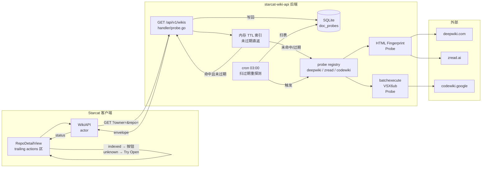

# 外部文档站索引探测与跳转集成（DeepWiki / Google Code Wiki / Zread）

> 创建：2026-06-10
> 状态：**设计稿（待评审）**
> 版本：v0.5
> 关联：
> - `docs/需求讨论/starcat-github-analysis-session.md`（用户分类与早期讨论，作为本设计的输入）
> - `docs/详细设计/18-三场景共用架构.md`（三场景共用 DTO / Envelope / BaseURL 热更新 / Bearer 鉴权模式，**本设计沿用**）
> - `docs/详细设计/05-GitHub%20API设计.md`（OAuth / Rate Limit 处理范式，作为外部 HTTP 探测的对照参考）
> - 后端脚手架：`supports/starcat-trending-api` / `supports/starcat-sharing-api` / `supports/starcat-weekly-api`（三个 Go 项目的目录 / 中间件 / Envelope / 部署约定）

---

## 文档版本演进

| 版本 | 日期 | 主要调整 | 触发人 / 触发原因 |
|---|---|---|---|
| v0.1 | 2026-06-10 | 初稿：后端 wiki-api 骨架 + 三个 Probe + 缓存策略 + 客户端接入 + zread trending 评估 | dong4j 提出需求并 grill 后定稿 |
| **v0.2** | **2026-06-10** | **dong4j 指出 zread 公开 trending JSON 端点 `https://zread.ai/api/v1/public/repo/trending` 真实存在（无鉴权）**；§8 由"不接入"翻转为"接入设计"；新增 `zread_trending` 子表 + 周拉取 cron + 客户端 toggle | dong4j 指出原探测遗漏该端点；实测确认 200 / 112KB / 无鉴权 / 无 cookie / 忽略所有查询参数 |
| **v0.3** | **2026-06-10** | **dong4j 决定：① 后端 API 改名 `starcat-docs-api` → `starcat-wiki-api`（端口仍 5004）② zread 周 trending 拉取并入 `starcat-trending-api`（端口 5002），不再由 wiki-api 承担**；§3-7 wiki-api 范围瘦身（删 `zread_trending` 表 / 删周一 06:00 cron / 删 wiki_id 加速 / 删 §6.4 端点 / 删 §7.7 客户端 toggle）；§8 整章重写为"zread 接入 trending-api 设计"（spider 拉取 + V2 migration 加 source 字段 + `?source=github|zread|merged` 参数 + 客户端 source picker + 23 条落地 checklist） | dong4j 在 2026-06-10 提出两项决策；经权衡 zread 数据走现有 trending pipeline 复用度最高（共用 enricher / 共用表 / 共用 actor），与 starcat 现有 trending 逻辑最一致 |
| **v0.4** | **2026-06-10** | **dong4j 评审反馈整合** ① 风险 A（CodeWiki RPC 脆弱）→ §5.4.2 + §7.6 强化降级显式说明 ② 风险 B（Zread Cloudflare）→ §3.4 + §5.1 + §6.2 加 `PROBE_BATCH_MIN/MAX_DELAY_MS` 批量随机延迟 + 真实浏览器 UA + `Sec-Fetch-*` 头 ③ 风险 C（zread MM/DD 跨年推断）→ §8.3 schema 加 `zread_week_start_raw / zread_week_end_raw / zread_year_inferred` 3 字段保留原始字符串 ④ 微调 1（SWR）→ §4.3 改 stale-while-revalidate 模式,过期 stale 直返 + 后台异步刷新 ⑤ 微调 2（UI 下拉+设置多选）→ §7.5 改 1 主按钮 + Menu 下拉,设置页加 `WikiSettings { enabledSources, autoExpandDropdown }` ⑥ 微调 3（装配解耦）→ §7.4 `tryMakeWikiAPI()` 单独 try,失败 nil | dong4j 在 2026-06-10 给出 3 风险点 + 3 微调建议,逐条落地 |
| **v0.5** | **2026-06-10** | **dong4j 二次翻转：zread 周 trending 接入点从 `starcat-trending-api`(5002) 迁回 `starcat-weekly-api`(5003)**——理由是 zread trending 维度是"每周一次",跟 weekly-api 的"周更内容"语义对齐(阮一峰周刊同周更 + 共享 scheduler + 中文描述社区契合),跟 trending-api 的"日/周/月多维度"反而是异类;§8 整章重写为"zread 接入 weekly-api 设计"(spider 仍 JSON 拉取,但 V2 migration 用新建 `zread_trending` 专属表而非 `trending_repos` 加 source 字段;envelope `Meta.source=zread` 走 weekly-api 现有 /api/v1/projects 或新加 /api/v1/zread);客户端入口从 `TrendingView` 改到 `WeeklyView`(WeeklyView 加 source picker:`阮一峰周刊 / Zread 周榜 / 合并`);§7.7 v0.3 翻转说明追加 v0.5 又翻转;附录 B 同步清单调整(trending-api 删 R-02 / weekly-api 加 R-02)**;dong4j 4 项决策全部确认:① zread_trending **独立建表**(不合并到阮一峰 `projects` 表) ② weekly-api **新增** `GET /api/v1/zread` 端点,**不动**现有 `/api/v1/projects` 等端点 ③ 客户端入口完全切到 `WeeklyView`,`TrendingView` **100% 恢复 v0.3 之前形态** ④ merged 视图(阮一峰 + Zread 合集)**v0.5 本期一起做完**,不延后到 v0.6** | dong4j 在 2026-06-10 提出"zread 周一次放 weekly-api 更合适" + 4 项决策同步确认 |

---

## 1. 背景与目标

### 1.1 现状（截至 2026-06-10）

- Starcat 客户端 `Starcat/Core/Network/` 已有 3 个后端 actor：`TrendingAPI` / `ShareAPI` / `WeeklyAPI`
- `supports/` 下已有 3 个独立 Go API 项目（端口 5001/5002/5003），共用 `internal/middleware/auth.go` + `internal/model/envelope.go`（byte-level 共享）
- Starcat 详情页 (`Features/Home/RepoDetailView.swift`) 当前**无任何"外部文档站跳转"入口**，用户对 star 的 repo 想要看 DeepWiki 解读需要自己复制 `owner/repo` 去浏览器手贴
- `docs/需求讨论/starcat-github-analysis-session.md` 已经把"GitHub 项目分析"分成三类能力（外部文档站 / 本地代码分析 / AI 上下文生成），本文档只解决第一类
- Starcat 客户端与三个 Go 后端服务**均无任何 deepwiki / zread / codewiki 集成代码**（已 grep 验证）

### 1.2 问题

1. **手动跳转成本高**：用户 star 了几百个 repo，要逐个复制 `owner/repo` 去 DeepWiki / Zread 搜索判断"有没有被收录"，不可接受
2. **三类能力混淆**：`starcat-github-analysis-session.md` 第 1 节明确早期错把 CodeWiki（生成文档类）和 CodeGraphContext（代码分析类）混成一类；需要明确本文档**只做"查询 + 跳转"**，不做 clone、不做本地分析、不做文档生成
3. **单 repo 探测稳定可做，三类站差异大**：DeepWiki / Zread 是 HTML 指纹探测，Google Code Wiki 是 Google 内部 batchexecute RPC，需要分别设计
4. **缓存策略缺失**：每次打开 Starcat 都实时扫会爆 rate limit，且对被探测站点不友好
5. **zread trending 真实存在但被初次探测遗漏**：用户纠正后实测确认 `https://zread.ai/api/v1/public/repo/trending` 是公开的、**无鉴权**的 JSON 端点（112KB / 10 group / 153 repo / 周维度），需要正式设计接入路径（见 §8）—— **v0.5 翻转**：dong4j 决定接入点从 trending-api 改为 weekly-api（语义对齐）

### 1.3 目标

1. **零 API key 接入**：复用现有 Starcat API Key 体系（`StarcatAPIKey.swift`），不引入 DeepWiki / Zread / Google Code Wiki 的任何账号
2. **查询 + 跳转二职责分离**：后端只负责"对 owner/repo 探测三个外部文档站 + 缓存结果"，客户端只负责"渲染按钮 + 处理点击"
3. **状态分级 + UI 映射**：`indexed / probably_indexed / not_indexed / unknown / error / rate_limited` 六态，UI 明确什么状态显示什么按钮
4. **TTL 分级缓存**：indexed 7 天 / not_indexed 1 天 / unknown 6 小时 / error 30 分钟，避免每次都重探测
5. **客户端零侵入接入**：复用 `AppEndpoints` / `StarcatEnvelope` / `StarcatAPIKey` 三件套（v1.2 共用架构），详情页加一组按钮，不动 trending / weekly / manage 任何现有流程
6. **后端独立可演进**：参照 trending / sharing / weekly 模式新建 `supports/starcat-wiki-api`（端口 5004），含 scheduler / store / middleware / handler 完整骨架

### 1.4 非目标

1. **不做本地 clone / 源码分析 / 文档生成**：这三类是 `starcat-github-analysis-session.md` §4.2 / §4.3 的本地代码分析 / AI 上下文生成能力，留给后续设计
2. **不接 MCP / 不接 API key**：DeepWiki MCP、Zread MCP、Z.AI 平台都明确不做，跟用户 2026-06-10 "不要 MCP、不要 API key" 的口径一致
3. **不做语义搜索 / 不做"用户已 star 列表的 AI 二次解读"**：留给后续 AI 功能
4. **不引入新 web 框架**：保持 supports 三个 Go 项目"纯 net/http + database/sql"零框架风格
5. **不重写 trending / sharing / weekly 三个后端**：本设计完全独立新增第 4 个 Go 服务

---

## 2. 总体方案

### 2.1 能力边界

| Starcat 角色 | 不做的事 |
|---|---|
| 查询 owner/repo 是否已被外部文档站索引 | ❌ clone 源码 |
| 展示跳转按钮 | ❌ 生成文档 |
| 接受点击 → 浏览器打开 | ❌ 分析源码 |
| 缓存探测结果 | ❌ 持久化外部文档内容 |

### 2.2 三个外部文档站分类

| 服务 | URL 模式 | 探测方式 | 风险 |
|---|---|---|---|
| **DeepWiki** | `https://deepwiki.com/{owner}/{repo}` | GET + HTML 指纹（title / back-link / "Last indexed"） | 低，纯公开站点 |
| **Zread** | `https://zread.ai/{owner}/{repo}` | GET + HTML 指纹（"Ask AI" / "Source Code" / back-link） | 中，根域被 Cloudflare 拦截但子页可访问 |
| **Google Code Wiki** | `https://codewiki.google/github.com/{owner}/{repo}` | URL probe + 逆向 Google batchexecute RPC（VSX6ub） | 高，RPC ID 非公开契约，前端改动会失效 |
| **zread 周 trending 列表** | `https://zread.ai/api/v1/public/repo/trending` | GET JSON，**无鉴权** | 忽略所有查询参数,固定 10 group / 153 repo / 周维度(无 daily/monthly)→ **v0.5 翻转入 weekly-api**,详见 §8 |

### 2.3 数据流



### 2.4 与现有后端的关系

| 维度 | wiki-api（新建） | trending-api | weekly-api | sharing-api |
|---|---|---|---|---|
| 端口 | 5004 | 5002 | 5003 | 5001 |
| 数据源（被动） | DeepWiki / Zread / Google Code Wiki（响应客户端 owner/repo 查询） | 无 | 无 | 无 |
| 数据源（主动） | 三个 source 域名健康检查 | GitHub Trending HTML | 阮一峰周刊 Git 仓库 + **zread 周 trending**（v0.5 翻转） | 无（只生成短链） |
| 探测方式 | 被动查询 + 域名健康检查 cron | 主动爬取 + 定时 cron | 主动拉仓库 + 定时 cron + **zread JSON 拉取**（v0.5 翻转） | 无 |
| 是否需要 token pool | ❌ | ✅ GitHub PAT | ✅ GitHub PAT | ❌ |
| 客户端 actor | `WikiAPI`（新建） | `TrendingAPI` | `WeeklyAPI` | `ShareAPI` |
| 共用中间件 | `Bearer Auth` + `Envelope`（byte-level 共享） | 同 | 同 | 同 |

---

## 3. 后端：starcat-wiki-api

### 3.1 总体定位

- 监听端口：`5004`（沿用 supports 占位规则 5001-5003 已用，新项目用 5004）
- 模块路径：`github.com/dong4j/starcat-wiki-api`
- Go 版本：1.25.0（与 trending / sharing / weekly 完全一致）
- 框架：纯 `net/http` + `database/sql`（沿用 supports 三个项目零框架约定）
- 依赖：`godotenv` + `modernc.org/sqlite` + `robfig/cron/v3`（与 trending 同）
- **承担单一职责**：响应 Starcat 客户端 `GET /api/v1/wikis?owner=&repo=`，探测 DeepWiki / Zread / Google Code Wiki 是否已索引，返回跳转链接
- **不承担**：zread 周 trending 拉取/落库/查询 —— 这部分在 v0.3 翻转后并入 `starcat-trending-api`（端口 5002），详见 §8

### 3.2 目录骨架

> 总体沿用 trending 骨架，差异点：`internal/spider` 替换为 `internal/probe`，handler 简化为 probe 业务，删 `enricher/tokenpool`（不需要 GitHub PAT）。

```
supports/starcat-wiki-api/
├── cmd/server/main.go                 # 入口装配
├── internal/
│   ├── probe/
│   │   ├── base.go                    # http.Client 封装：UA / Accept-Language / Timeout
│   │   ├── types.go                   # Source / Status 枚举 + Probe 接口 + ProbeResult
│   │   ├── deepwiki.go                # HTML 指纹探测
│   │   ├── zread.go                   # HTML 指纹探测
│   │   ├── codewiki.go                # URL probe + batchexecute VSX6ub fetch
│   │   └── registry.go                # map[Source]Probe 工厂
│   ├── handler/
│   │   ├── handler.go                 # writeJSON / writeError
│   │   ├── probe.go                   # GET /api/v1/wikis, POST /api/v1/wikis/batch
│   │   └── admin.go                   # POST /internal/sync/probe
│   ├── middleware/auth.go             # ← 抄 trending byte-level（共享约定）
│   ├── model/
│   │   ├── envelope.go                # ← 抄 trending byte-level（共享约定）
│   │   └── doc.go                     # DocProbeDTO
│   ├── store/
│   │   ├── store.go                   # Store interface
│   │   ├── sqlite.go                  # SQLite 实现
│   │   └── migrations.go              # PRAGMA user_version
│   ├── scheduler/cron.go              # robfig/cron/v3, WithSeconds()
│   └── version/version.go
├── pkg/utils/url.go
├── bin/  scripts/  logs/  docs/
├── README.md  TODO.md  CHANGELOG.md  CONTRIBUTING.md
├── Makefile  Dockerfile  fly.toml
├── go.mod  go.sum  .env.example  .env
├── .gitignore  .dockerignore  .gitattributes
└── .github/{workflows,ISSUE_TEMPLATE,dependabot.yml,FUNDING.yml,PULL_REQUEST_TEMPLATE.md}
```

### 3.3 路由装配

```go
mux := http.NewServeMux()
mux.HandleFunc("GET /healthz", healthzHandler)             // 公开
mux.Handle("GET /api/v1/wikis",       authMW.Wrap(handler.HandleProbeV1(store, probes)))         // 客户端单查
mux.Handle("POST /api/v1/wikis/batch", authMW.Wrap(handler.HandleProbeBatchV1(store, probes)))   // 客户端批量
mux.Handle("POST /internal/sync/probe", authMW.Wrap(handler.HandleAdminSyncProbe(sch)))         // 手动触发全量重探测
mux.Handle("POST /internal/refresh/owner", authMW.Wrap(handler.HandleAdminRefreshOwner(store, probes)))  // 手动刷新某 owner
log.Fatal(http.ListenAndServe(":"+port, mux))
```

要点：
- Go 1.22+ `mux.Handle("GET /api/v1/wikis", ...)` pattern 语法
- 鉴权统一通过 `authMW.Wrap` 包裹
- `/healthz` 公开，与 trending/sharing/weekly 完全一致

### 3.4 配置（.env）

| 变量 | 用途 | 默认值 |
|---|---|---|
| `PORT` | 监听端口 | `5004` |
| `STORE_FILE` | SQLite 路径 | `./wiki.db`（生产 `/data/wiki.db`） |
| `API_KEYS` | Bearer 白名单，**必填** | — |
| `PROBE_USER_AGENT` | 自定义探测 UA | `Mozilla/5.0 StarcatBot/1.0` |
| `PROBE_TIMEOUT_SEC` | 单次探测超时 | `15` |
| `PROBE_CONCURRENCY` | 全局并发上限 | `4` |
| `PROBE_CACHE_INDEXED_DAYS` | indexed TTL | `7` |
| `PROBE_CACHE_MISS_HOURS` | not_indexed TTL | `24` |
| `PROBE_CACHE_UNKNOWN_HOURS` | unknown TTL | `6` |
| `PROBE_CACHE_ERROR_MIN` | error / rate_limited TTL | `30` |
| `ENABLE_CODEWIKI_BATCHEXECUTE` | codewiki 是否启用 RPC 探测 | `true`（失败自动降级 url_probe） |
| **`PROBE_BATCH_MIN_DELAY_MS`** | **v0.4 新增**：批量探测时单次请求最小随机延迟（ms） | `80` |
| **`PROBE_BATCH_MAX_DELAY_MS`** | **v0.4 新增**：批量探测时单次请求最大随机延迟（ms） | `400` |

---

## 4. 数据模型

### 4.1 SQLite Schema

```sql
-- V1
CREATE TABLE doc_probes (
    id              INTEGER PRIMARY KEY AUTOINCREMENT,
    owner           TEXT NOT NULL,
    repo            TEXT NOT NULL,
    source          TEXT NOT NULL CHECK(source IN ('deepwiki','codewiki','zread')),
    status          TEXT NOT NULL,                -- indexed|probably_indexed|not_indexed|unknown|error|rate_limited
    url             TEXT NOT NULL,
    confidence      TEXT,                          -- high|medium|low
    probe_method    TEXT,                          -- html_fingerprint|batchexecute_fetch|url_probe
    http_status     INTEGER,
    matched_signals TEXT,                          -- JSON array 字符串
    checked_at      TEXT NOT NULL,                 -- RFC3339
    expires_at      TEXT NOT NULL,                 -- RFC3339
    UNIQUE(owner, repo, source)
);
CREATE INDEX idx_doc_probes_lookup  ON doc_probes(owner, repo, expires_at);
CREATE INDEX idx_doc_probes_refresh ON doc_probes(expires_at);

-- V2 (后续)
CREATE TABLE probe_runs (
    id          INTEGER PRIMARY KEY AUTOINCREMENT,
    started_at  TEXT NOT NULL,
    finished_at TEXT,
    total       INTEGER DEFAULT 0,
    success     INTEGER DEFAULT 0,
    miss        INTEGER DEFAULT 0,
    error_count INTEGER DEFAULT 0,
    trigger     TEXT                                -- 'cron'|'admin'|'batch'
);
```

> ⚠️ **v0.3 翻转**：v0.2 在本表下还定义了 `zread_trending` 子表（11 字段 + 3 索引）。v0.3 起 zread 周 trending 拉取已并入 `starcat-trending-api`，相关表结构改在 `supports/starcat-trending-api/internal/store/sqlite.go` 的 `trending_repos` 表加 `source` 字段（详见 §8）。

Migration 沿用 trending 模式：`PRAGMA user_version` 自管版本号，V1 建表，V2 加索引/字段（参考 `weekly/internal/store/sqlite.go:74-118` 的 `migrateV2` 模式用 `ALTER TABLE ADD COLUMN`）。

### 4.2 TTL 分级缓存策略

| status | TTL | 字段映射 |
|---|---|---|
| `indexed` | 7d | `expires_at = checked_at + 7d` |
| `probably_indexed` | 7d | 同上 |
| `not_indexed` | 24h | `expires_at = checked_at + 24h` |
| `unknown` | 6h | `expires_at = checked_at + 6h` |
| `error` | 30min | `expires_at = checked_at + 30m` |
| `rate_limited` | 30min | 同上 |

### 4.3 缓存查询路径（v0.4 SWR stale-while-revalidate）

> **v0.4 调整**：从"过期同步探测"改为 **SWR (stale-while-revalidate)** 模式——命中但过期时**立即返回 stale 数据**，后台异步刷新整张，保证客户端响应速度（dong4j 反馈点 1）。

```
GET /api/v1/wikis?owner=foo&repo=bar
  → 1. SELECT * FROM doc_probes WHERE owner=? AND repo=?  (3 行：deepwiki/codewiki/zread)
  → 2. 全部命中且 expires_at > now
        → envelope 直返, Meta.CacheStatus="fresh"
        → 立即返回（无后台刷新）
  → 3. 命中但部分 expires_at <= now（stale 数据存在）
        → 立即返回 stale 记录, Meta.CacheStatus="stale"
        → 后台 goroutine 异步刷新 stale 的那几条（不阻塞请求）
        → 客户端拿到结果的速度 = 单次 SELECT 延迟（<10ms），用户感知不到刷新
  → 4. 全部 miss（cold start，库里没记录）
        → 同步探测全部 3 源(semaphore 限流 + 批量随机延迟 §6.2)
        → 探测成功 → 写回 doc_probes(ON CONFLICT DO UPDATE)
        → 探测失败 → 走 envelope 错误 / 空数组 + Meta.CacheStatus="cold"
  → 5. 部分 miss + 部分 stale
        → 立即返回 stale 集合 + 后台补探测 miss 集合
        → Meta.CacheStatus="stale"（或 "mixed" 表示新旧都有）
```

**关键约束**：
- **stale 直返必须有数据**：如果库里一条都没有（cold start），不能"伪造" stale，必须走同步探测
- **后台刷新不阻塞请求**：用 `go func() { ... }()` 异步跑，失败时下次请求再试
- **in-flight 防重**：复用 trending `enricher/github.go:79-96` 的 `tryAcquire/release` 模式，key = `owner+"/"+repo+":"+source`，避免同一 repo 的同一 source 在 30s 内被并发刷新多次
- **stale 数据在 envelope Meta 中显式标记**：`CacheStatus="stale"`，客户端可选择性显示刷新状态

并发控制：
- `golang.org/x/sync/semaphore.Weighted` 限 `PROBE_CONCURRENCY`（默认 4）
- 单 provider 不需要单独限（只有 3 个 provider，全局够用）
- 批量探测见 §6.2，加 `PROBE_BATCH_MIN_DELAY_MS` / `PROBE_BATCH_MAX_DELAY_MS` 随机延迟

### 4.3.1 SWR 的客户端配合

客户端 `WikiAPI.status()` 调用后，**无需**等待 `Meta.CacheStatus="fresh"` 才渲染 UI：
- `fresh` / `stale` / `cold` 都立刻渲染对应按钮（stale 用旧数据，冷启动空态）
- 后台 silent 刷新时，**不显示 loading spinner**（避免 UI 抖动）
- 刷新结果回来后，平滑切换按钮状态（用 SwiftUI `@Observable` 自动响应）
- **`stale` 集合 / `cold` 状态按 §7.5.1 显隐规则计算主按钮显隐**：3 个 source 全是 `not_indexed` 时主按钮**不显示**(避免空下拉)

### 4.4 Cron 定时任务

`internal/scheduler/cron.go` 沿用 trending 模式（`cron.WithSeconds()`）：

| 表达式 | 任务 | 来源 |
|---|---|---|
| `0 0 3 * * *` | 03:00 每天，扫 `doc_probes WHERE expires_at < now` 重新探测 | 本设计新增 |
| `0 0 4 * * *` | 04:00 每天，清理 `expires_at < now - 30d` 的旧记录 | 本设计新增 |
| `0 0 5 * * 0` | 周日 05:00，健康检查三个 source 域名，失败日志告警 | 本设计新增 |

防并发同任务沿用 `Scheduler.tryLock/unlock`（`running map[string]bool`）。

---

## 5. 三个 Probe 实现

### 5.1 通用接口（`internal/probe/types.go`）

```go
type Source string
const (
    SourceDeepWiki Source = "deepwiki"
    SourceCodeWiki Source = "codewiki"
    SourceZread    Source = "zread"
)

type Status string
const (
    StatusIndexed         Status = "indexed"
    StatusProbablyIndexed Status = "probably_indexed"
    StatusNotIndexed      Status = "not_indexed"
    StatusUnknown         Status = "unknown"
    StatusError           Status = "error"
    StatusRateLimited     Status = "rate_limited"
)

type ProbeResult struct {
    Source         Source   `json:"source"`
    Status         Status   `json:"status"`
    URL            string   `json:"url"`
    Confidence     string   `json:"confidence"`
    ProbeMethod    string   `json:"probeMethod"`
    HTTPStatus     *int     `json:"httpStatus,omitempty"`
    MatchedSignals []string `json:"matchedSignals,omitempty"`
    Error          string   `json:"error,omitempty"`
}

type Probe interface {
    Source() Source
    Name() string
    Probe(ctx context.Context, owner, repo string) ProbeResult
}
```

`BaseRequest` 内部封装（照抄 `trending/internal/spider/base.go:12-60`，**v0.4 加强防 Cloudflare 识别**）：
- `http.Client.Timeout: 30s`（探测时再由 ctx 控 `PROBE_TIMEOUT_SEC`）
- `User-Agent: $PROBE_USER_AGENT`（**v0.4 强调**：必须用真实浏览器的 UA，不要用 `StarcatBot/1.0` 这种自报家门,容易触发反爬。推荐 `Mozilla/5.0 (Macintosh; Intel Mac OS X 10_15_7) AppleWebKit/537.36 (KHTML, like Gecko) Chrome/126.0.0.0 Safari/537.36`,看起来跟 Starcat 用户群一致）
- `Accept: text/html,application/xhtml+xml,application/xml;q=0.9,*/*;q=0.8`
- `Accept-Language: en-US,en;q=0.9,zh-CN;q=0.8`
- `Accept-Encoding: gzip, deflate, br`（**v0.4 新增**：跟真实浏览器一致,否则 zread / Cloudflare 识别"非标准头"）
- `Sec-Fetch-Dest: document` / `Sec-Fetch-Mode: navigate` / `Sec-Fetch-Site: none` / `Sec-Fetch-User: ?1`（**v0.4 新增**：Chrome 91+ 必带,Cloudflare 检查这些头）
- **批量探测随机延迟**（**v0.4 新增**）：参考 §3.4 / §6.2, `PROBE_BATCH_MIN_DELAY_MS=80` / `MAX=400`,每两个 repo 之间 `time.Sleep(rand.Intn(MAX-MIN)+MIN)` ms

重试策略（参考 `trending/internal/enricher/github.go:144-221`）：
- 200 → 解析指纹
- 404 → `not_indexed`
- 403 / 429 → `rate_limited`
- 5xx → 重试 1 次 → `error`
- 解析失败 → `unknown`

### 5.2 DeepWiki Probe

| 项 | 规格 |
|---|---|
| URL | `https://deepwiki.com/{owner}/{repo}` |
| 方法 | GET + 最多 1 次重试 |
| 超时 | `PROBE_TIMEOUT_SEC`（默认 15s） |
| `indexed` 指纹 | HTTP 200 + body 包含 `github.com/{owner}/{repo}` + body 包含 `Last indexed` 或 `Indexed on` 或 `Overview` 任一 + `<title>` 含 `{owner}/{repo}` |
| `probably_indexed` | HTTP 200 + 包含回链 + 包含上述 3 关键词中的 2 个 |
| `not_indexed` | 404 或 body 不含回链 |
| `confidence` | `high`（indexed）/ `medium`（probably_indexed） |
| `probeMethod` | `html_fingerprint` |

匹配逻辑用 `golang.org/x/net/html` parse 或简单的 `strings.Contains`，不强依赖 HTML 结构（DeepWiki 是 SPA，纯文本 grep 即可）。

### 5.3 Zread Probe

| 项 | 规格 |
|---|---|
| URL | `https://zread.ai/{owner}/{repo}` |
| 方法 | GET + 最多 1 次重试 |
| 超时 | 同上 |
| `indexed` 指纹 | HTTP 200 + body 包含 `github.com/{owner}/{repo}` + body 包含 `Ask AI` + `Source Code` + `Overview` 至少 2 个 |
| `probably_indexed` | HTTP 200 + 包含回链 + 3 关键词只中 1 |
| `not_indexed` | 404 或 body 不含回链 |
| `confidence` / `probeMethod` | `high` / `html_fingerprint` |

> ⚠️ **Cloudflare 风险**：zread 根域名 `https://zread.ai/` 在 jina reader / curl 偶尔会被 Cloudflare 5xx 拦截，但**子页 `/zread.ai/{owner}/{repo}` 正常 200**（curl 验证过 200 + 114KB HTML）。如果以后某次探测发现 zread 收紧到所有页面都拦截，降级为 `unknown` 走缓存即可。
>
> **v0.3 翻转**：v0.2 原本计划用 `zread_trending` 表的 `wiki_id` 给 ZreadProbe 做查表加速（避免重复 HTTP 探测），因 v0.3 起 zread_trending 表迁到 `starcat-trending-api` 的 `trending_repos` 表，跨服务查表耦合过重，**该加速路径取消**，ZreadProbe 保持纯 HTTP 探测。代价：每个未缓存的 owner/repo 探测都打一次 zread HTML（详情页打开时 ~500ms 一次）。后续 v0.4 可在 wiki-api 本地维护一份轻量 "已知被 zread 收录的 repo" 集合（zstd bloom filter 之类）以减少探测。

### 5.4 Google Code Wiki Probe

按需求讨论 §11/§12 设计，**两阶段探测**：

#### 5.4.1 URL probe（必跑，零成本）

```http
GET https://codewiki.google/github.com/{owner}/{repo}
```

- 200 但 body 几乎都是 SPA 壳子 → `url_probe` 只能返 `unknown`, `confidence: low`, `probeMethod: url_probe`
- 404 → `not_indexed`
- 403 / 429 → `rate_limited`

#### 5.4.2 batchexecute fetch（默认启用，`ENABLE_CODEWIKI_BATCHEXECUTE=true`）

```http
POST https://codewiki.google/_/BoqAngularSdlcAgentsUi/data/batchexecute?rpcids=VSX6ub&rt=c&source-path=/github.com/{owner}/{repo}
Content-Type: application/x-www-form-urlencoded

f.req=<urlencoded JSON>
```

请求体（参考 `codewiki-mcp` 逆向）：

```json
[["VSX6ub","[\"https://github.com/{owner}/{repo}\"]",null,"generic"]]
```

**响应解析 6 步**（照搬 `codewiki-mcp` 实现）：

1. `trimStart`
2. 去掉 `)]}'` XSSI 前缀
3. 按 `\n` split
4. 找能 `JSON.parse` 成功的那行
5. 递归找 `node[0] == "wrb.fr" && node[1] == "VSX6ub"`
6. `node[2]` 若是字符串，再 `JSON.parse` 一次

**状态映射**：

| 解析结果 | status | confidence |
|---|---|---|
| 解析成功 + sections 非空 + `canonicalUrl` 包含 `github.com/{owner}/{repo}` | `indexed` | `high` |
| 解析成功但 sections 为空 | `probably_indexed` | `medium` |
| HTTP 404 | `not_indexed` | `high` |
| HTTP 403 / 429 | `rate_limited` | `high` |
| HTTP 5xx | `error` | `low` |
| 解析失败 / 未知结构 | `unknown` | `low` |

#### 5.4.3 风险缓解

- `ProviderVersion` 字段写死 `vsx6ub_v1`，变更时人工 bump
- payload 解析**不依赖固定下标**（`payload[0][1][5]` 这种），用 `golang.org/x/exp/jsonparser` 宽松搜索 `canonicalUrl` / `github.com/{owner}/{repo}` 字符串
- 失败自动降级：batchexecute 失败 → 回退到 url_probe 返 `unknown`，UI 仍然显示 "Try Open" 按钮
- 单测至少 3 个 case：成功 / 404 / 解析失败

### 5.5 Registry 装配（`internal/probe/registry.go`）

```go
func DefaultRegistry(client *BaseRequest, enableCodeWikiRPC bool) map[Source]Probe {
    return map[Source]Probe{
        SourceDeepWiki: NewDeepWikiProbe(client),
        SourceZread:    NewZreadProbe(client),
        SourceCodeWiki: NewCodeWikiProbe(client, enableCodeWikiRPC),
    }
}
```

handler 拿 `map[Source]Probe`，按 `[deepwiki, zread, codewiki]` 顺序**并发探测**（`errgroup` + `semaphore.Weighted` 限流），三个源独立失败独立返回，不互相阻塞。

---

## 6. API 契约

### 6.1 单查

```http
GET /api/v1/wikis?owner=facebook&repo=react
Authorization: Bearer <api-key>
```

响应（成功 + 全部 cached fresh）：

```json
{
  "schema_version": 1,
  "data": {
    "owner": "facebook",
    "repo": "react",
    "checkedAt": "2026-06-10T12:00:00Z",
    "items": [
      {
        "provider": "deepwiki",
        "name": "DeepWiki",
        "status": "indexed",
        "url": "https://deepwiki.com/facebook/react",
        "confidence": "high",
        "probeMethod": "html_fingerprint",
        "httpStatus": 200,
        "matchedSignals": ["title_match", "backlink", "last_indexed"]
      },
      {
        "provider": "zread",
        "name": "Zread",
        "status": "indexed",
        "url": "https://zread.ai/facebook/react",
        "confidence": "high",
        "probeMethod": "html_fingerprint"
      },
      {
        "provider": "codewiki",
        "name": "Google Code Wiki",
        "status": "indexed",
        "url": "https://codewiki.google/github.com/facebook/react",
        "confidence": "high",
        "probeMethod": "batchexecute_fetch",
        "matchedSignals": ["rpc_ok", "canonical_url_matched", "sections_non_empty"]
      }
    ]
  },
  "meta": { "cache_status": "fresh", "latency_ms": 124 }
}
```

### 6.2 批量

> **v0.4 加防 Cloudflare 触发**：批量探测时每个 repo 之间插入**随机延迟**（参考 §5.1 BaseRequest 模拟真实浏览器头 + dong4j 反馈点 B）。

```http
POST /api/v1/wikis/batch
Authorization: Bearer <api-key>
Content-Type: application/json

{
  "repos": [
    "facebook/react",
    "openai/openai-cookbook",
    "modelcontextprotocol/modelcontextprotocol"
  ],
  "sources": ["deepwiki", "zread", "codewiki"]
}
```

**服务器端行为**：
- 收到请求后，并发探测 3 个源
- **每个 repo 之间插入随机延迟** `time.Sleep(rand.Intn(MAX-MIN)+MIN)`：
  - `MIN = PROBE_BATCH_MIN_DELAY_MS = 80`（可调）
  - `MAX = PROBE_BATCH_MAX_DELAY_MS = 400`（可调）
- 100 个 repo × 3 源 ≈ 30-120 秒完成（比同步探测慢 3-10 倍，但避免触发 Cloudflare 反爬）
- 客户端调用方应该只在**首次安装**或**批量刷新**时调,不是每次启动都调

响应：

```json
{
  "schema_version": 1,
  "data": {
    "items": [
      {
        "repo": "facebook/react",
        "providers": [
          {"provider": "deepwiki", "status": "indexed", "url": "https://deepwiki.com/facebook/react"},
          {"provider": "zread",    "status": "indexed", "url": "https://zread.ai/facebook/react"},
          {"provider": "codewiki", "status": "unknown",  "url": "https://codewiki.google/github.com/facebook/react"}
        ]
      }
    ]
  },
  "meta": {
    "cache_status": "mixed",
    "total": 3,
    "served_fresh": 2,
    "served_stale": 1,
    "latency_ms": 410
  }
}
```

### 6.3 Admin

```http
POST /internal/sync/probe
Authorization: Bearer <api-key>

{"target": "all", "force": false}
```

返回：

```json
{"task_id": "uuid", "trigger": "admin"}
```

Fire-and-forget，后台异步扫描 `doc_probes WHERE expires_at < now`（`force=true` 时忽略 expires_at 全表重探测）。

```http
POST /internal/refresh/owner
Authorization: Bearer <api-key>

{"owner": "facebook", "repo": "react"}
```

同步刷新单个 repo（开发调试用），返回 `{"ok": true, "items": [...]}`。

### 6.4 v0.3 翻转说明

> ⚠️ **v0.3 翻转**：v0.2 在本节定义了 `GET /api/v1/zread` 端点。v0.3 起 zread 周 trending 拉取并入 `starcat-trending-api`，zread 数据通过 envelope `Meta.source=zread` + 现有 `GET /api/v1/repos?since=weekly&source=zread` 暴露（详见 §8）。本节不再单独定义端点。

---

## 7. 客户端集成

### 7.1 网络层封装

新建 `Starcat/Core/Network/WikiAPI.swift`，actor 模式完全照 `TrendingAPI.swift:41-186`：

```swift
actor WikiAPI {
    let baseURL: URL
    let apiKey: String?

    init(baseURL: URL, apiKey: String?, session: URLSession = .starcatDefault) {
        self.baseURL = baseURL
        self.apiKey = apiKey
        self.session = session
    }

    func status(owner: String, repo: String) async throws -> DocsStatusEnvelope
    func statusBatch(repos: [String], sources: [DocsSource]) async throws -> DocsStatusBatchEnvelope
    func updateBaseURL(_ url: URL)
    func updateAPIKey(_ key: String?)
}
```

### 7.2 AppEndpoints 扩展

`Starcat/Core/Network/AppEndpoints.swift` 追加新枚举 case：

```swift
enum Docs: ServiceEndpoint {
    static let productionURL = "https://starcat-wiki-api.fly.dev"
    enum Paths {
        static let status       = "/api/v1/wikis"
        static let statusBatch  = "/api/v1/wikis/batch"
    }
}
```

### 7.3 StarcatAPIKey 扩展

`Starcat/Core/Network/StarcatAPIKey.swift` 追加 `.5004` case，BYOK Key 复用同一个 Keychain 项（避免一个 key 服务 3 个后端时还要分别存）。最终用户视角"一个 Starcat API Key 通行 4 个后端"。

### 7.4 AppDependencies 装配（v0.4 强调解耦）

> ⚠️ **v0.4 强调**：WikiAPI 装配**必须**与 TrendingAPI / ShareAPI / WeeklyAPI 三个 actor **解耦**。任一服务 baseURL / Key 配置错误不应阻塞其他服务初始化（dong4j 反馈点 3）。

`Starcat/App/AppDependencies.swift:288-313` 装配模式做如下改造：

```swift
// v0.4 改造前: 集中 try? 初始化, 一个失败全挂
// WikiAPI(baseURL: ..., apiKey: ...)

// v0.4 改造后: 单独 try, 失败转 nil, UI 层降级到 "Try Open"
@MainActor
final class AppDependencies {
    let trendingAPI: TrendingAPI
    let shareAPI: ShareAPI
    let weeklyAPI: WeeklyAPI
    let wikiAPI: WikiAPI?   // ← optional, 失败 nil

    init() {
        self.trendingAPI = AppDependencies.makeTrendingAPI()
        self.shareAPI    = AppDependencies.makeShareAPI()
        self.weeklyAPI   = AppDependencies.makeWeeklyAPI()
        self.wikiAPI     = AppDependencies.tryMakeWikiAPI()  // ← 单独 try, 不抛
    }

    private static func tryMakeWikiAPI() -> WikiAPI? {
        do {
            return WikiAPI(
                baseURL: AppEndpoints.Wiki.baseURL,
                apiKey: StarcatAPIKeyResolver.resolve(for: .wiki)
            )
        } catch {
            Log.warn("[AppDependencies] WikiAPI init failed: \(error)")
            return nil   // UI 层走 "Try Open" 降级
        }
    }
}
```

设置页"服务"Tab 加一个新行（"外部文档索引"），改 baseURL / Key 后 `await wikiAPI?.updateBaseURL(target)` / `updateAPIKey(target)` 热更新（**wikiAPI 自身就是 optional,设置页 UI 也需要容错处理 nil**）。具体热更新模式沿用 18 号设计 `setServiceURL` / `setServiceAPIKey` 模式。

**单服务 down 的影响**：
- wikiAPI 初始化失败 → 详情页右上角外部文档按钮组**整体不显示**(不是只隐藏按钮);banner 提示"外部文档索引服务暂不可用"
- 其他 3 个 API (trending/share/weekly) **不受影响**
- 修复 baseURL / Key 后,**无需重启 App**,设置页触发 `setServiceURL` 时,`AppDependencies` 重新调用 `tryMakeWikiAPI()` 注入新实例

### 7.5 详情页 UI 集成（v0.4 改下拉 + 设置多选）

> **v0.4 调整**：dong4j 反馈点 2 指出"三个站点全命中会占较大空间"，改为"1 个主按钮 + Menu 下拉" + 设置页加"哪些 wiki 服务可用"多选。

#### 7.5.1 详情页 UI（`TrailingActions` 区）

**主按钮显隐规则**（dong4j 反馈："全 not_indexed 时直接隐藏主按钮,不要显示空下拉"）：

| 状态组合 | 主按钮显示 |
|---|---|
| 至少 1 个 source 是 `indexed` / `probably_indexed` / `unknown` | ✅ 显示"Wiki ▾" |
| 3 个 source **全**是 `not_indexed` | ❌ **主按钮整体不显示**(不显示空下拉) |
| 3 个 source **全**是 `error` / `rate_limited` | ❌ 主按钮整体不显示(没意义,等缓存过期) |
| wikiAPI 整体不可用(§7.4 解耦失败) | ❌ 主按钮整体不显示,改显示"打开主页"备选链接 |
| 未登录态 | ❌ 隐藏(沿用 v1.4 规则) |
| 设置里 3 个 source 全关掉 | ❌ 主按钮不显示(没东西可看) |

伪代码:
```swift
@MainActor
func shouldShowWikiDropdown(items: [WikiStatusItem]) -> Bool {
    // 1. wikiAPI 不可用
    guard wikiAPI != nil else { return false }
    // 2. 未登录
    guard isLoggedIn else { return false }
    // 3. 至少 1 个启用的 source 有意义结果
    let enabled = items.filter { AppSettings.wiki.enabledSources.contains($0.source) }
    let meaningful = enabled.filter { $0.status != .notIndexed && $0.status != .error && $0.status != .rateLimited }
    return !meaningful.isEmpty
}
```

**改为下拉组件** `RepoDetailExternalDocsDropdown`：

```
[📖 Wiki ▾]
  ├─ ✅ DeepWiki           (book.pages.fill)        ← 命中 indexed, 主色
  ├─ ✅ Zread              (book.pages.fill)        ← 命中 indexed
  ├─ ⚠️ Google Code Wiki   (g.circle.fill)          ← 状态 unknown
  ├─ ⏳ GitHub 文档         (book.pages)            ← 用户在设置里关掉了, 不显示
  └─ 打开主站...            (arrow.up.right.square)
```

UI 行为：
- **主按钮** 显示"Wiki ▾"（点击展开下拉），**不直接跳转**
- **下拉列表**：每个 wiki 源一行，按 `indexed → probably_indexed → unknown → not_indexed` 顺序排列
  - `indexed` / `probably_indexed` → 主色行 + 点击 → 浏览器打开
  - `unknown` → 次色行 + "Try Open" 文字 + 点击 → 浏览器打开
  - `not_indexed` / `error` / `rate_limited` → 灰色行 + 不显示
- **未登录态**：下拉整体隐藏（沿用 v1.4 规则）
- **wikiAPI down**：下拉整体不显示 + 替代为"打开 DeepWiki 主页" / "打开 Zread 主页" / "打开 Code Wiki 主页" 三个备选链接（curl 静态主页,无 API key）

#### 7.5.2 设置页多选（"服务"Tab 加新分组）

`Starcat/Features/Settings/SettingsView.swift` → "服务"Tab 加新分组"外部文档索引"：

| 设置项 | 类型 | 默认 | 说明 |
|---|---|---|---|
| 启用 DeepWiki | Toggle | ✅ on | 关掉后, 详情页下拉不显示 DeepWiki 行; wiki-api 调用时 `?sources=` 也不传 deepwiki |
| 启用 Zread | Toggle | ✅ on | 同上 |
| 启用 Google Code Wiki | Toggle | ✅ on | 同上 |
| 默认展开下拉 | Toggle | ⬜ off | on 时详情页进入时自动展开 Wiki 下拉, off 时只显示主按钮 |

存储位置:沿用 `AppSettings` 现有结构,新增:
```swift
// Starcat/Core/Settings/AppSettings.swift
struct WikiSettings: Codable, Equatable {
    var enabledSources: Set<WikiSource> = [.deepwiki, .zread, .codewiki]
    var autoExpandDropdown: Bool = false
}
```

#### 7.5.3 按钮状态加载逻辑

1. 详情页 `onAppear` 触发 `await wikiAPI?.status(owner, repo)`
2. 优先显示缓存（即使 stale 也立即渲染, 避免空白——见 §4.3 SWR）
3. 后台 silent 刷新, 结果回来后更新下拉列表内容（不展开下拉时不显示刷新动效）
4. 用户点击下拉中某行 → `NSWorkspace.shared.open(url)`
5. 未登录态 / wikiAPI 不可用 / 用户在设置里关掉了某个 source → 对应行不显示

#### 7.5.4 按钮 SF Symbol（沿用 v0.1）

- DeepWiki: `book.pages.fill`
- Zread: `book.pages` 或 `text.book.closed`
- Google Code Wiki: `books.vertical.fill` 或 `g.circle.fill`

最终用哪个待 UI 评审后再定。

### 7.6 未登录态 / 离线态处理

- 未登录态：`StarcatAPIKeyResolver.resolve(for: .wiki)` 返 nil → 后端返 401 → UI 不显示任何外部文档按钮（沿用 v1.4 R-01 规则）
- 离线态：URLSession 超时 → 显示三个次色"Try Open"按钮（按 §7.5 unknown 路径兜底）
- **全 not_indexed 隐藏主按钮**：3 个 source 全是 `not_indexed` 时,按 §7.5.1 显隐规则,**主按钮整体不显示**(不显示空下拉)
- **CodeWiki RPC 失败降级**：依据 §5.4.2 + §5.4.3 的 `ProviderVersion` 健壮性设计，codewiki 探测失败（RPC ID 变更 / payload 结构变化）→ 自动降级 url_probe 返 `unknown` → UI 显示"Try Open"次色按钮（**不是直接消失**），保证功能可用性（dong4j 反馈点 A）
- **Zread Cloudflare 全量拦截**：依据 §5.1 + §3.4 的 `PROBE_BATCH_*_DELAY_MS` 批量随机延迟 + 真实浏览器 UA 兜底；触发频次失控时 wiki-api 整体返 `rate_limited`，UI 走 §4.2 TTL 30 min 缓存（dong4j 反馈点 B）

### 7.7 v0.3 + v0.5 翻转说明

> ⚠️ **v0.3 翻转**：v0.2 在本节定义了 zread 周 trending 的客户端接入（WikiAPI 新方法、Trending 视图 toggle、DTO 模型）。v0.3 起 zread 周 trending 拉取并入 `starcat-trending-api`，客户端接入改由 `TrendingAPI` 现有 actor 配合 `?source=zread&since=weekly` 完成（详见 §8），**不新增 `WikiAPI.zreadTrending` 方法**。
>
> ⚠️ **v0.5 又翻转**：v0.3 把 zread 接入 trending-api,但 v0.5 dong4j 决定**zread 接入点从 trending-api 迁到 weekly-api**（语义对齐"周更内容"）。zread 客户端入口**从 TrendingView 改到 WeeklyView**。TrendingView 完全恢复 v0.3 之前的形态（GitHub 日/周/月三档 + lang picker）。WeeklyView 加 source picker（`阮一峰周刊 / Zread 周榜 / 合并`），改造细节在 §8.5。

---

## 8. zread 周 trending 接入 weekly-api 设计（v0.5 又翻转）

> ⚠️ **v0.1 → v0.2 → v0.3 → v0.5 四次翻转**：
> - v0.1：原 §8 标题"zread trending 接入评估"判定"不接入"
> - v0.2：dong4j 指出公开 JSON 端点 `https://zread.ai/api/v1/public/repo/trending` 真实存在，翻转为"接入 wiki-api（v0.2 时叫 docs-api）"
> - v0.3：dong4j 决定将 zread 拉取**并入 `starcat-trending-api`**（共用 enricher / 共用表 / 共用 actor）
> - **v0.5**：dong4j 又决定**从 trending-api 迁出**，**并入 `starcat-weekly-api`**——理由是 zread trending 维度是"每周一次",跟 weekly-api 的"周更内容"语义对齐（阮一峰周刊同周更 + 共享 scheduler + 中文描述社区契合），跟 trending-api 的"日/周/月多维度"反而是异类
>
> 本章是 v0.5 后的接入设计。zread 数据走 weekly-api 现有 pipeline，**新建 `zread_trending` 专属表**（不污染阮一峰周刊的 `projects` 表），客户端入口从 `TrendingView` 改到 `WeeklyView`。

### 8.1 接口契约（实测确认 2026-06-10）

```http
GET https://zread.ai/api/v1/public/repo/trending
Accept: application/json
User-Agent: Mozilla/5.0 ...
```

**响应**（HTTP 200, 112528 字节, `Content-Type: application/json; charset=utf-8`）：

```json
{
  "code": 0,
  "msg": "",
  "data": [
    {
      "title": "This Week",
      "time_span": { "start": "08/06", "end": "14/06" },
      "repos": [
        {
          "repo_id": "3b4e6da4-11e4-11f1-9e1c-1e512985b86e",
          "owner": "Panniantong",
          "name": "Agent-Reach",
          "url": "https://github.com/Panniantong/Agent-Reach",
          "description": "Give your AI agent eyes to see the entire internet. ...",
          "description_zh": "赋予 AI 代理互联网视野，...",
          "star_count": 17708,
          "language": "python",
          "topics": ["agent-infrastructure", "ai-agent", "..."],
          "wiki_id": "a2570fde-f11a-4778-beb6-9fb4889abf74",
          "status": "success",
          "visibility": "public",
          "created_at": 1771980737,
          "updated_at": 1776442862,
          "last_commit": { "hash": "1762426...", "when": 1776073543 }
        }
      ]
    }
  ]
}
```

实测特性（决定接入设计的关键事实）：

| 特性 | 实测 | 接入影响 |
|---|---|---|
| 鉴权 | **无**（无 UA / 无 cookie 头 / 无 API key 全部 200） | trending-api 不需要任何 zread credential |
| Cookie | 服务端 `set-cookie: visitor_id=...`，**客户端无需回传** | 不用管 cookie，curl 一次就 200 |
| 查询参数 | `?period=` / `?lang=` / `?limit=` / `?time_span=` 全部**忽略**（curl 5 次都返相同 112528 字节） | 后端**不能**按 period/lang 拉取，固定每周一全量拉一次 |
| 数据维度 | **周维度**，`time_span` 是 `MM/DD ~ MM/DD` 格式（年份需推断） | 不存在 daily / monthly；时间范围解析需做 MM/DD + 年份推断 |
| 数量 | 10 个 group，每组 11-19 个 repo，总 **153 条** | 全量入 SQLite 没问题 |
| Group 标题 | 仅前 2 个有 title（"This Week" / "Last Week"），后 8 个 **title 为空字符串** | 旧周次只能靠 `time_span.start` 区分，不能靠 `title` |
| 时间字段 | `created_at` / `updated_at` / `last_commit.when` 都是**秒级 Unix timestamp** | 入库统一转 RFC3339 |
| change 字段 | **无**（没有 weekly delta / change / rank_change） | 客户端 UI 去掉 `↗ +N` chip，只显示 `star_count` 总数 |
| 字段缺失 | zread **没有** `forks / open_issues / watchers / subscribers / dates / archived / fork / license / default_branch` | 走现有 GitHub enricher 补 14 字段（与 GitHub Trending pipeline 完全相同） |
| 鉴权探测 | 其他路径（`/api/v1/public/repo/search` / `/info` / `/categories` / `/languages` 等）**全 404** | 唯一公开端点就是这个，依赖性要绑死 |
| `wiki_id` 字段 | 每个收录的 repo 必带（zread 自己 wiki 文档的 UUID） | 可选冗余存到 trending_repos 供未来用 |

### 8.2 weekly-api 后端改造（v0.5 翻转）

#### 8.2.1 新增 zread spider（`internal/spider/zread.go`）

仿照 `internal/fetcher/git.go` 现有模式（拉取外部数据源 → 解析 → 写入 store），新建 `zread.go` 走 JSON 拉取：

```go
// supports/starcat-weekly-api/internal/spider/zread.go
type ZreadSpider struct {
    client *BaseRequest
    store  *store.SQLiteStore
    enrich *enricher.Enricher   // 走现有 GitHub enricher 补 14 字段
}

func (s *ZreadSpider) RunOnce(ctx context.Context) (ZreadFetchResult, error) {
    // 1. GET https://zread.ai/api/v1/public/repo/trending (无鉴权)
    // 2. JSON parse + 校验 code==0
    // 3. 遍历 data[] -> 每个 group 解析 time_span (MM/DD + 年份推断)
    //    见 §8.2.1.1 推断规则 + 异常告警
    // 4. 遍历 repos[] -> 调 enricher.EnrichOne() 补 GitHub 14 字段
    // 5. 写 zread_trending 表 (v0.5 新建,见 §8.3)
}
```

##### 8.2.1.1 年份推断 + 异常告警（v0.4.1 dong4j 反馈）

> **v0.4.1 微调**(沿用,dong4j 提出"推断年份跟当前年差超过 1 年,后台日志打 Warning,方便 2027 年元旦观察表现")

```go
// supports/starcat-weekly-api/internal/spider/zread_year_infer.go
func inferYear(startMM, endMM, nowMM string, nowYear int) (int, error) {
    inferred := nowYear
    if monthNum(startMM) > monthNum(nowMM) {
        inferred = nowYear - 1
    }
    return inferred, nil
}

// 调用方:每个 group 解析完 time_span 后,跑推断并对比当前年
for _, g := range groups {
    startYear, _ := inferYear(g.TimeSpan.Start, g.TimeSpan.End, currentMonth, currentYear)
    g.InferredYear = startYear  // 写回 zread_year_inferred 字段

    // 异常告警: 推断年份与当前年份差 > 1 年(说明跨年推断仍可能出错)
    if abs(startYear - currentYear) > 1 {
        log.Warnf(
            "[zread] year inference anomaly: raw=%s/%s inferred_year=%d current_year=%d (跨度 > 1 年, 请人工排查)",
            g.TimeSpan.Start, g.TimeSpan.End, startYear, currentYear,
        )
    }
}
```

**为什么阈值选 1 年**：
- 正常跨年周 (12 月底 / 1 月初) 推断年份差 1 年是预期 → 用 "> 1" 而不是 ">= 1"
- 2027 年元旦前后(2026-12-28 ~ 2027-01-03)是首批可能真实出问题的窗口,告警日志落 `/data/logs/zread-spider.log`,可观察
- 告警字段含原始 `MM/DD` 字符串(已在 schema 里,见 §8.3),人工排查直接 `grep "year inference anomaly" | head` 定位

复用 weekly-api 现有 `BaseRequest` / `enricher.EnrichOne` / `SQLiteStore.UpsertZreadTrending`(新建)。**零新依赖、零新中间件**。

#### 8.2.2 enricher 兼容

- zread 拉回的数据已经有：`owner / name / html_url / star_count / language / description / description_zh / topics / wiki_id`
- 需要 GitHub enricher 补：`gh_repo_id / forks / open_issues / watchers / subscribers_count / pushed_at / updated_at / created_at / license_spdx / default_branch / is_archived / is_fork`
- 走 weekly-api 现有 `enricher.EnrichOne(owner, repo, since)` 流程（`internal/enricher/github.go`）,跟阮一峰周刊 enricher 同一份
- enricher 失败时,缺字段 fallback（与现状一致）

#### 8.2.3 cron 任务

`internal/scheduler/cron.go` 新增：

| 表达式 | 任务 | 来源 |
|---|---|---|
| `0 0 6 * * 1` | 周一 06:00,zread 拉取 + enricher 补字段 + UPSERT 写 `zread_trending` 表 | 本设计新增 |

**为什么是周一 06:00**：
- zread `This Week` 周一更新（从实测 `time_span.start=08/06` 周一,`end=14/06` 周日推断）
- 给 zread 留 6 小时 buffer（周一 00:00 → 06:00）
- 与 weekly-api 现有 cron 时点错开（阮一峰周刊也是周更但具体时点不同,后续如冲突可微调）

### 8.3 weekly-api SQLite schema 改造（v0.5 翻转）

> ✅ **dong4j 决策 ① 确认**:**zread_trending 独立建表**(不合并到阮一峰周刊的 `projects` / `weekly_issues` 表)。两个数据源 schema 差异太大：
> - 阮一峰周刊: 走 git clone 仓库,parse markdown,字段是 `Project { name, html_url, description, first_issue }`
> - zread: 走 JSON 拉取,字段是 `Repo { owner/name/star_count/description_zh/wiki_id }`
>
> 强行合并会污染现有 `Project` 字段语义,所以**独立建表 + 独立 handler**。

V1 schema（阮一峰周刊）**不动**。V2 migration 新建 `zread_trending` 表（11 字段 + 3 索引）:

```sql
-- V2: 新建 zread_trending 专属表 (v0.5 翻转,v0.3 写在 trending_repos 加 source 字段的方案作废)
CREATE TABLE zread_trending (
    id                  INTEGER PRIMARY KEY AUTOINCREMENT,
    week_label          TEXT NOT NULL,        -- 'This Week' / 'Last Week' / '' (历史周)
    week_start          TEXT NOT NULL,        -- '2026-06-08' ISO 8601 推断后
    week_end            TEXT NOT NULL,        -- '2026-06-14' ISO 8601 推断后
    rank_in_week        INTEGER NOT NULL,     -- 该 repo 在本组里的序号
    repo_id             TEXT NOT NULL,        -- zread UUID
    owner               TEXT NOT NULL,
    name                TEXT NOT NULL,
    html_url            TEXT NOT NULL,
    description         TEXT,
    description_zh      TEXT,                 -- zread 中文描述
    star_count          INTEGER,
    language            TEXT,
    topics              TEXT,                 -- JSON array 字符串
    wiki_id             TEXT,                 -- zread wiki UUID
    last_commit_hash    TEXT,
    last_commit_when    INTEGER,              -- zread 原始秒级时间戳
    zread_status        TEXT,                 -- 'success' 透传
    -- 14 个 enricher 补字段(gh_repo_id / forks / open_issues / watchers / subscribers_count /
    -- pushed_at / updated_at / created_at / license_spdx / default_branch / is_archived / is_fork)
    -- enricher 跟阮一峰周刊共用同一份,补字段一致
    gh_repo_id          INTEGER,
    forks               INTEGER DEFAULT 0,
    open_issues         INTEGER DEFAULT 0,
    watchers            INTEGER DEFAULT 0,
    subscribers_count   INTEGER DEFAULT 0,
    pushed_at           TEXT,
    updated_at          TEXT,
    created_at          TEXT,
    license_spdx        TEXT,
    default_branch      TEXT,
    is_archived         INTEGER DEFAULT 0,
    is_fork             INTEGER DEFAULT 0,
    -- v0.4.1 跨年周回溯字段
    zread_week_start_raw TEXT,                -- 原始 '08/06' MM/DD
    zread_week_end_raw   TEXT,                -- 原始 '14/06' MM/DD
    zread_year_inferred  INTEGER,             -- 推断年份(0=未推断)
    fetched_at          TEXT NOT NULL,        -- RFC3339
    UNIQUE(week_start, owner, name)
);
CREATE INDEX idx_zread_trending_owner_repo ON zread_trending(owner, name);
CREATE INDEX idx_zread_trending_week ON zread_trending(week_start DESC);
CREATE INDEX idx_zread_trending_wiki ON zread_trending(wiki_id);
CREATE INDEX idx_zread_trending_gh_repo_id ON zread_trending(gh_repo_id);
```

- V1 → V2 migration 失败回退:`DROP TABLE IF EXISTS zread_trending` 安全(SQLite 3.35+ 支持)
- 客户端不识别 `zread_trending` 表不影响(envelope 是 JSON,新数据源字段全部新增)

### 8.4 weekly-api API 契约改造

> ✅ **dong4j 决策 ② 确认(v0.5.0)**:weekly-api **新增** `GET /api/v1/zread` 端点,**当时不动**现有 `/api/v1/projects` / `/api/v1/issues` / `/api/v1/issues/{number}` 等端点(不增加 `?source=` 参数,不做任何 breaking change)。
>
> ⚠️ **v0.5.2 修订(2026-06-10)**:dong4j 拍板「`/api/v1/projects` 改 `/api/v1/weekly`」→ 阮一峰周刊端点命名空间从通用 `projects` 改为 weekly 命名,与 zread 命名风格对齐。`/api/v1/issues` / `/api/v1/issues/{number}` 维持不动(issues 语义独立)。
>
> v0.3 / v0.4 设计的 `?source=github|zread|merged` 参数彻底作废(trending-api 完全恢复原状,见 §8.8 回退清单)。weekly-api **新建独立端点** `GET /api/v1/zread`,跟现有 `/api/v1/weekly`(阮一峰周刊)并列。

#### 8.4.1 端点

```http
GET /api/v1/zread?week=this|last|YYYY-MM-DD&limit=20
Authorization: Bearer <api-key>
```

参数:
- `week`:可选,默认 `this`;取值 `this` / `last` / 任意历史周开始日期(ISO 8601 格式如 `2026-05-25`,对应 `time_span.start` 推断后的 `week_start`)
- `limit`:可选,默认 20,上限 50

#### 8.4.2 响应

```json
{
  "schema_version": 1,
  "data": {
    "week_label": "This Week",
    "week_start": "2026-06-08",
    "week_end": "2026-06-14",
    "fetched_at": "2026-06-10T07:00:00Z",
    "items": [
      {
        "rank": 1,
        "owner": "Panniantong",
        "name": "Agent-Reach",
        "html_url": "https://github.com/Panniantong/Agent-Reach",
        "description": "Give your AI agent eyes to see the entire internet. ...",
        "description_zh": "赋予 AI 代理互联网视野,一键搜索 Twitter、Reddit 等平台,零 API 费用。",
        "star_count": 17708,
        "language": "python",
        "topics": ["agent-infrastructure", "ai-agent", "..."],
        "wiki_id": "a2570fde-f11a-4778-beb6-9fb4889abf74",
        "zread_url": "https://zread.ai/Panniantong/Agent-Reach",
        "gh_repo_id": 871234567,
        "forks": 2103,
        "open_issues": 42,
        "watchers": 17708,
        "subscribers_count": 312,
        "pushed_at": "2026-06-09T14:30:00Z",
        "updated_at": "2026-06-09T15:00:00Z",
        "created_at": "2024-03-15T00:00:00Z",
        "license_spdx": "MIT",
        "default_branch": "main",
        "is_archived": false,
        "is_fork": false
      }
    ]
  },
  "meta": {
    "source": "zread",
    "cache_status": "fresh",
    "total": 19,
    "latency_ms": 12
  }
}
```

数据来源:`SELECT * FROM zread_trending WHERE week_start=? ORDER BY rank_in_week ASC LIMIT ?`。

#### 8.4.3 与 weekly-api 现有端点的关系

| 端点 | 数据源 | 用途 |
|---|---|---|
| `GET /api/v1/weekly` | `projects` 表(阮一峰周刊) | 阮一峰周刊精选项目列表 |
| `GET /api/v1/weekly/{owner}/{repo}` | `projects` 表 | 阮一峰周刊单项目详情 |
| `GET /api/v1/issues` | `weekly_issues` 表 | 阮一峰周刊各期目录 |
| `GET /api/v1/issues/{number}` | `weekly_issues` 表 | 阮一峰周刊单期详情 |
| **v0.5 新增** `GET /api/v1/zread` | **`zread_trending` 表** | **zread 周 trending 列表** |

**两套数据源完全独立**,envelope schema 也独立;合并视图在客户端做(见 §8.5)。

#### 8.4.4 envelope Meta 改造

weekly-api 现有 `Meta` 结构(v0.5 不改)只在阮一峰周刊响应里塞 `issue_number` / `page_count` 等字段。`/api/v1/zread` 端点用**新 envelope Meta 字段** `source: "zread"`,通过 `meta` 区分数据源(跟 trending-api 现状的 `source` 字段不冲突,后者要回退)。

> **v0.5 重要约束**:`envelope.go` 在 weekly-api 仍是 4 份 byte-level 共享件之一,**不要**为 zread 单独加 Meta 字段;新字段加在 weekly-api `meta` 局部扩展里(通过 envelope `data` 内嵌的 `week_label` 字段来标识 zread 数据源,envelope 层 `schema_version` 不变)

### 8.5 客户端 Starcat Weekly 视图改造（v0.5 翻转）

> ✅ **dong4j 决策 ③ 确认**:v0.3 / v0.4 把 zread 入口放在 TrendingView 是异类(v0.5 dong4j 决定放回 WeeklyView)。**`TrendingView` 100% 恢复 v0.3 之前形态**(GitHub 日/周/月三档 + lang picker),**完全不动**。
>
> ✅ **dong4j 决策 ④ 确认**:**merged 视图(阮一峰 + Zread 合集)v0.5 本期一起做完**,不延后到 v0.6。

#### 8.5.1 改造原则

**不重写 Weekly 视图骨架**,只加 2 件事:
1. toolbar 加 source picker(**含 merged 选项**,决策 ④)
2. 领域模型加 `weeklySource` 字段,卡片渲染按 source 区分

#### 8.5.2 toolbar 加 source picker

`Starcat/Features/Weekly/WeeklyView.swift`(或 `Activity/WeeklyContentView.swift`,视实际位置)顶部 toolbar 加 `Menu("数据源")`:

| source | 含义 | 数据来源 |
|---|---|---|
| **`阮一峰周刊`**(默认) | 现有阮一峰周刊,中文社区精选 | weekly-api `GET /api/v1/weekly` |
| **`Zread 周榜`**(v0.5 新增) | zread 公开周 trending 列表 | weekly-api `GET /api/v1/zread` |
| **`合并视图`**(v0.5 本期做,决策 ④) | 两源合集去重 | 客户端本地合并(从阮一峰 + Zread 两源取数,按 `gh_repo_id` 去重,优先阮一峰) |

UI 文案(走 String Catalog i18n):
- `weekly.source.ruanyifeng` = "阮一峰周刊"
- `weekly.source.zread` = "Zread 周榜"
- `weekly.source.merged` = "阮一峰 + Zread 合并(默认?)"
- `weekly.banner.zread` = "Zread 周榜 · 周维度(无 daily/monthly) · 数据来源 zread.ai"
- `weekly.banner.zread.zh` = "Zread 含中文描述(description_zh)"
- `weekly.banner.merged` = "本周中文周更内容汇总(阮一峰周刊 + Zread 周榜去重合并)"

#### 8.5.3 `WeeklyViewModel` 改造

`Starcat/Core/Network/WeeklyViewModel.swift`(或对应文件):

```swift
@Observable
final class WeeklyViewModel {
    var source: WeeklySource = .ruanyifeng   // ← 新增, 默认 ruanyifeng
    var items: [WeeklyItem] = []
    ...

    func reload() async {
        switch source {
        case .ruanyifeng:
            let dtos = try await weeklyAPI.projects(...)
            items = dtos.map { WeeklyItem(ruanyifeng: $0) }
        case .zread:
            let dtos = try await weeklyAPI.zreadTrending(week: .thisWeek, limit: 20)
            items = dtos.map { WeeklyItem(zread: $0) }
        case .merged:
            // v0.6 预留
        }
    }
}
```

#### 8.5.4 `WeeklyItem` 领域模型加 source

`Starcat/Core/Network/WeeklyModels.swift`(或新文件)加:

```swift
struct WeeklyItem {
    let source: WeeklySource              // ← 新增
    let title: String                     // 阮一峰周刊: 项目名 / zread: 项目名
    let owner: String
    let name: String
    let htmlUrl: URL
    let description: String?              // zread 有中文版本
    let descriptionZh: String?            // zread 独有
    let starCount: Int?
    let language: String?
    let topics: [String]?                 // zread 独有
    let rankInWeek: Int?                  // zread 独有
    let zreadUrl: URL?                    // zread 专属跳转 URL
    let zreadWikiId: String?              // zread 独有
    let htmlUrl2: URL?                    // 阮一峰周刊对应的 GitHub URL
    // ... 共用字段
}

enum WeeklySource: String, Codable, CaseIterable, Identifiable {
    case ruanyifeng, zread, merged
    var apiValue: String { rawValue }
}
```

#### 8.5.5 卡片渲染(复用 18 号共用架构)

**复用 `UnifiedRepoRow`** 卡片层(共享 18 号共用架构),不重写卡片:
- 列表项 `↗ +N` chip **不渲染**(zread 无 change 数据;阮一峰周刊本来也没这个 chip)
- zread 列表项的 `description_zh` 在 description 下方显示(如果有)
- 列表项右上角徽章:`Z` 标识 zread 数据源,`R` 标识阮一峰数据源(用 SF Symbol 小字)
- 列表项点击 → 走 `RepoDetailScaffold`(共享),进入详情页后右上角照常显示 "View on Zread" 按钮(因为 zread 收录过该 repo 一定 `indexed`)

#### 8.5.6 合并视图(v0.5 本期做,决策 ④)

> ✅ **dong4j 决策 ④ 确认**:merged 视图 v0.5 本期一起做完,**不延后到 v0.6**。

合并策略:
- **优先 阮一峰周刊**(阮一峰是精挑细选,zread 是 GitHub 周 trending 全集)
- **后补 zread 独有**(`gh_repo_id` 去重,zread 独有指"zread 收录但阮一峰没收录"的 repo)
- **同 `RepoResolver` 模式**(18 号共用架构 §3.3,前端 Chain of Responsibility)

合并逻辑伪代码:

```swift
// Starcat/Core/Network/WeeklyViewModel.swift
func reloadMerged() async {
    // 并行拉两源
    async let r = weeklyAPI.projects(limit: 50)  // 阮一峰
    async let z = weeklyAPI.zreadTrending(week: .thisWeek, limit: 50)  // zread
    let ruanyifeng = try await r
    let zread = try await z

    // 按 gh_repo_id 去重,优先阮一峰
    var seen = Set<Int64>()
    var merged: [WeeklyItem] = []
    for dto in ruanyifeng {
        if let id = dto.ghRepoId, !seen.contains(id) {
            seen.insert(id)
            merged.append(WeeklyItem(ruanyifeng: dto))
        }
    }
    for dto in zread {
        if let id = dto.ghRepoId, !seen.contains(id) {
            seen.insert(id)
            merged.append(WeeklyItem(zread: dto))
        }
    }
    items = merged
}
```

UI 文案(走 String Catalog i18n):
- `weekly.banner.merged` = "本周中文周更内容汇总(阮一峰周刊 + Zread 周榜去重合并)"

性能注意:
- merged 模式会触发**两次并发 API 请求**,需要 200ms ~ 1s 完成(取决于网络)
- 客户端可以做**结果缓存**(`NSCache` 内存 5min,GRDB 落库可选项)
- 失败回退:zread 拉取失败 → 仅显示阮一峰 + banner 提示"Zread 暂不可用";阮一峰拉取失败 → 仅显示 zread + banner 提示"阮一峰周刊暂不可用"

#### 8.5.7 详情页点击行为

列表项点击走 `RepoDetailScaffold`(共享),进入详情页后右上角照常显示 "View on Zread" 按钮(wiki-api 探测 owner/repo 是否被 zread 收录;命中后显示按钮)。

> **关键设计点**:**zread 周榜 + 阮一峰周刊 = "中文周更内容"一个 tab**,跟 GitHub Trending(daily/weekly/monthly)"全球开源热度"另一个 tab,语义清晰。

#### 8.5.8 客户端 GRDB 持久化

客户端 GRDB `weekly_projects` 表(如果存在)加 `source` 字段;V_N+1 migration 模式沿用(参考 `DatabaseMigrationsV1.swift`)。
**v0.5 推荐先纯内存**(启动时拉一次到 `WeeklyViewModel.items`),数据 stale 后让用户下拉刷新,跟 v0.2 / v0.3 设计一致。
    func reload() async {
        // source 在 daily/monthly 时强制 .github(后端不识别)
        let effectiveSource: TrendingSource
        switch since {
        case .daily, .monthly: effectiveSource = .github
        case .weekly:          effectiveSource = source
        }
        let dtos = try await trendingAPI.repos(
            since: since.apiValue,
            language: lang.apiValue,
            source: effectiveSource.apiValue    // ← 新增
        )
        repos = dtos.map { TrendingRepo(card: $0, since: since, source: effectiveSource) }
    }
}
```

#### 8.5.4 `TrendingRepo` 领域模型加 source

`Starcat/Core/Network/TrendingModels.swift:30-204` 加一个字段：

```swift
struct TrendingRepo {
    // ... 现有字段 ...
    let source: TrendingSource     // ← 新增
    var starsInPeriod: Int         // zread 数据时恒为 0
    ...
}

enum TrendingSource: String, Codable, CaseIterable, Identifiable {
    case github, zread, merged
    var apiValue: String { rawValue }
}
```

`TrendingRepo.init(card:since:)` 现有签名扩展为 `init(card:since:source:)`，**默认参数 `source: .github`** 保持完全向后兼容（v0.2 / v0.3 期间 trending 数据默认走 github 桶）。

#### 8.5.5 `UnifiedRepoRow` 卡片按 source 区分 chip 渲染

`Starcat/Features/Trending/TrendingRepoRowView.swift`（或 `Shared/Components/UnifiedRepoRow.swift` 看 18 号共用架构落在哪）：

```swift
// 在 "↗ +N" chip 处按 source 分支
if repo.source == .zread {
    // zread 无 change → 不渲染 chip
} else {
    // github / merged(取 github 子集) → 渲染 "↗ +N"
}
```

`merged` 模式下的去重策略：客户端不感知，envelope 已经合好；客户端看到 `source=.merged` 跟 `.github` 一样渲染 chip。

#### 8.5.6 详情页点击行为

列表项点击走 `RepoDetailScaffold`（共享），进入详情页后右上角照常显示 "View on Zread" 按钮（wiki-api 探测 owner/repo 是否被 zread 收录；命中后显示按钮）。

但有个语义差异：**如果该 repo 是 zread 收录的，但用户没在 zread 周榜看到（只偶尔被收录过），按钮依然显示**——这是 wiki-api 的职责，跟 trending-api 拉取的 zread 数据无关。两套数据互补：
- trending-api 的 zread 周榜 = "zread 这周重点解读的 repo"
- wiki-api 的 zread 探测 = "zread 任意时刻收录过的 repo"

#### 8.5.7 客户端 GRDB 持久化

Starcat 客户端 GRDB `trending_repos` 表（`Starcat/Core/Database/Models/TrendingRepoRecord.swift`）加 `source` 字段，迁移到 V_N+1（具体版本号等 trending-api 上线后定）。**GRDB V_N+1 migration 模式沿用现有**（参考 `DatabaseMigrationsV1.swift`）。

### 8.6 与阮一峰周刊语义差异（v0.5 翻转后改为阮一峰对比）

| 维度 | 阮一峰周刊(weekly-api 现有) | Zread 周 trending(v0.5 新增) |
|---|---|---|
| 数据维度 | 周更(每周一) | 周更(每周一) |
| 变化量 | 无 star 变化字段 | 无 change/增量字段(只有 `star_count` 总数) |
| 数据源 | git clone 阮一峰周刊的 GitHub 仓库 + 解析 markdown | `GET https://zread.ai/api/v1/public/repo/trending` JSON |
| 描述语言 | 中文 | 中文 + 英文(`description` + `description_zh`) |
| 中文社区契合 | ✅ 完全契合 | ✅ 契合(zread 自身有中文社区) |
| 更新频率 | weekly(具体时点见 weekly-api cron) | 每周一 06:00(weekly-api 新加 cron) |
| enricher | ✅ 14 字段补全(weekly-api 现有) | ✅ 14 字段补全(weekly-api 共用同一份) |
| 客户端可缓存 | weekly-api SQLite `projects` 表 | **v0.5 新建** weekly-api SQLite `zread_trending` 表 |
| 字段完整性 | 较完整 | 拉回 11 字段,enricher 补 12 字段后完整 |
| 客户端 actor | `WeeklyAPI`(现有) | **v0.5 新增** `WeeklyAPI.zreadTrending(week:limit:)` 方法 |
| 客户端视图 | `WeeklyView`(现有) | **v0.5 复用** `WeeklyView` + source picker 切换 |

### 8.7 风险点（v0.5 专项，沿用 v0.3/v0.4）

| 风险 | 概率 | 影响 | 缓解 |
|---|---|---|---|
| zread 端点突然失效 | 低 | 整体 zread 数据不更新；客户端 WeeklyView 切到 Zread 模式看到 stale | weekly-api scheduler 记 error；连续 3 周失败 → UI banner 提示"Zread 暂不可用" |
| zread 修改 JSON 字段名 | 中 | 入库全部失败 | 解析时**只取必要字段**（owner / name / url / wiki_id / star_count / description_zh / language / topics），其他字段缺失容错 |
| zread 端点被 Cloudflare 永久拦截 | 中（已知根域有拦截） | 同上 | 已有 scheduler error 跟踪；客户端走 cached `zread_trending` 表 stale 直返 |
| `time_span` MM/DD 年份推断错误（跨年周） | 低 | 数据归到错年份 | 推断规则：① 先取**当前自然年** ② 若 `start_month > now_month` → 改用去年 ③ 显式记录推断结果到 `zread_year_inferred` 字段,同时保留**原始 MM/DD 字符串**到 `zread_week_start_raw` / `zread_week_end_raw` ④ 推断年份与当前年差 > 1 年时,后台 `log.Warnf` 打告警(含原始 MM/DD 字符串),方便 2027 年元旦观察(见 §8.2.1.1) |
| zread 数据走 weekly-api enricher 失败率高 | 中 | `zread_trending` 大量行缺字段 | 失败时 fallback（与现状一致），UI 显示 `?` 字段；enricher 有自己的优先级队列,不会阻塞阮一峰周刊主流程 |
| 客户端 `WeeklySource` 行为理解错 | 中 | UI 误用 | 客户端 `WeeklyViewModel.reload()` 默认 `.ruanyifeng`;切到 `.zread` 时 banner 提示"周维度" |
| `envelope` 字段新增不兼容 | 低 | 老客户端解码失败 | `omitempty` + 老客户端忽略未知字段（`StarcatEnvelope.swift:194-253` 的 `JSONDecoder` 不严格）|
| zread 收藏过的 repo,StarActionService 影响 | 极低 | 无 | zread 数据走同一条 star 链路（`StarActionService`） |
| zread 反爬触发频次 | 中 | 拉取频次高时 zread 触发 Cloudflare 拦截 | ① §5.1 BaseRequest 用真实浏览器 UA + `Sec-Fetch-*` 头 ② weekly-api zread 拉取走 `time.Sleep(rand.Intn(...))` 随机延迟(周一次,影响小) ③ zread 单 repo 探测走 30 min TTL,避免短时间多次打 ④ 失败 3 次后回退 stale + UI banner |
| weekly-api 端口 5003 稳定性 | 极低 | zread 数据 跟阮一峰周刊一起受影响 | 阮一峰周刊已经有冗余设计(zread 共用 weekly-api 是新增风险,需要 CI 部署后跑回归) |

### 8.8 评审通过后的代码落地清单（v0.5 weekly-api 改造 + trending-api 回退）

> 这一节是 v0.5 改造 checklist。wiki-api 自身的清单在 §10.1,wiki-api 不受 v0.5 影响,仍按 v0.4.1 推进。

#### 8.8.1 后端 weekly-api 新增（zread 接入）

1. `internal/spider/zread.go`（新建）：JSON 拉取 + 解析 + 年份推断(从 v0.4 trending-api 现有代码**复制**过来,改 import 路径即可)
2. `internal/spider/zread_types.go`（新建）：`ZreadFetchResult / ZreadGroup / ZreadRepo / ZreadTime` 结构体
3. `internal/spider/zread_test.go`（新建）：mock HTTP server + 解析 3 个 case（成功 / 字段缺失 / code != 0）
4. `internal/spider/zread_year_infer.go`（**v0.4.1 新增**）：`inferYear()` 函数 + 异常告警(`abs(inferred - current) > 1` 打 `log.Warnf`,含原始 MM/DD)
5. `internal/spider/zread_year_infer_test.go`（**v0.4.1 新增**）：5 个 case(正常当月 / 跨年 MM/DD / 推断结果 0 年差 / 推断结果 1 年差 / 推断结果 2 年差)
6. `internal/store/migrations.go`：V2 migration **新建** `zread_trending` 专属表（不污染阮一峰周刊 `projects` 表,11 字段 + 14 enricher 字段 + 3 v0.4.1 字段 + 4 索引,见 §8.3 schema）
7. `internal/store/sqlite.go`：增加 `UpsertZreadTrending(ctx, items []ZreadTrending) error` + `QueryZreadTrending(ctx, week string, limit int) ([]ZreadTrending, error)` + `LookupZreadWikiID(ctx, owner, name) (string, error)`
8. `internal/handler/zread_trending.go`（新建）：`HandleZreadTrendingV1` 暴露 `GET /api/v1/zread?week=this|last|YYYY-MM-DD&limit=20`
9. `internal/handler/handler.go`：注册新路由 `mux.Handle("GET /api/v1/zread", ...)`(沿用现有 authMW.Wrap 模式)
10. `internal/scheduler/cron.go`：增加周一 06:00 任务 `runZreadFetch()`(调用 `ZreadSpider.RunOnce`)
11. `internal/scheduler/cron.go`：增加 `funcName` 锁（防并发跑同任务）
12. `.env.example`：加 `ZREAD_TRENDING_CRON=0 0 6 * * 1`（可选，默认值硬编码在 cron.go）
13. `TODO.md` 加 R-02 章节（阻断：zread spider + V2 migration + 14 enricher 字段；高优：异常告警；中优：banner）
14. `CHANGELOG.md` v0.5.0 章节加 [Added] / [Changed] 条目(zread 接入 weekly-api)
15. `README.md` API 文档加 `GET /api/v1/zread` 端点 + `Meta.source` 字段说明

#### 8.8.2 后端 trending-api 回退（删除 v0.3 / v0.4 改造）

> **v0.5 关键回退清单**：把 trending-api 还原到 v0.3 之前的状态。**注意**：只删 zread 相关代码,GitHub Trending 主流程一行不动。

16. `internal/spider/zread.go`（**删除**）
17. `internal/spider/zread_types.go`（**删除**）
18. `internal/spider/zread_test.go`（**删除**,如果存在）
19. `internal/spider/zread_year_infer.go`（**删除**）
20. `internal/spider/zread_year_infer_test.go`（**删除**）
21. `internal/store/migrations.go`：V1 migration 还原,删除 `source / description_zh / zread_week_* / zread_wiki_id / zread_year_inferred` 9 个字段;**但**因为 V1 已部署过,需要写"降级 migration"或在 V3 migration 里 drop 这些列(参考 `weekly/internal/store/sqlite.go:74-118` 的 `migrateV2` 模式)
22. `internal/store/sqlite.go`：删除 `UpsertTrendingRepoSource` 重载
23. `internal/handler/repos.go`：`HandleReposV1` 移除 `?source=` 参数解析 + `merged` 去重 SQL
24. `internal/scheduler/cron.go`：删除周一 06:00 任务 `runZreadFetch()`
25. `internal/model/envelope.go`：`Meta` 结构体删除 `source / merged_from_github / merged_from_zread / merged_dedup_removed` 4 字段(还原到 v0.3 之前)
26. `.env.example`：删除 `ZREAD_TRENDING_CRON` 行
27. `TODO.md` 删除 R-02 章节（v0.3 写的,zread 不归 trending-api 管）
28. `CHANGELOG.md` v2.x 章节回退或注明"v0.5 翻转,zread 已迁出"
29. `README.md` 删除 `?source=` 参数 + `Meta` 字段说明（恢复 v0.3 之前）
30. `go.mod` / `go.sum` 确认无 zread 专有依赖（应无,代码仅用 stdlib + 现有 godotenv/sqlite/robfig）

#### 8.8.3 客户端 Starcat 改造

> v0.5 关键改造:**TrendingView 完全恢复 v0.3 之前**（GitHub 日/周/月 + lang picker）,**WeeklyView 加 source picker + 数据接入 weekly-api 现有 / 新增端点**。
>
> ✅ **dong4j 决策 ③④ 确认**:`TrendingView` 100% 恢复,`WeeklyView` 加 source picker(含 merged,v0.5 本期做完)。

**TrendingView 回退**(完全恢复 v0.3 之前):
31. `Starcat/Core/Network/TrendingModels.swift`：`TrendingRepo` 删除 `source` 字段 + 删除 `TrendingSource` 枚举
32. `Starcat/Core/Network/TrendingAPI.swift`：`repos(since:language:limit:source:)` → `repos(since:language:limit:)`,删 `source` 参数
33. `Starcat/Core/Network/TrendingViewModel.swift`：删除 `var source: TrendingSource` + `reload()` 移除 source 传参
34. `Starcat/Features/Trending/TrendingView.swift`：删除 toolbar `Menu("Source")` picker + 删除 banner
35. `Starcat/Features/Trending/TrendingRepoRowView.swift`：删除 `source == .zread` 时不渲染 `↗ +N` chip 分支
36. `Starcat/Core/Network/StarcatRepoCardDTO.swift`：`TrendingExtension` 删除 `description_zh: String?` 字段(zread 走 WeeklyView,TrendingExtension 不需要)
37. `Starcat/Core/Database/Models/TrendingRepoRecord.swift` + `DatabaseMigrations.swift`：回退 V_N+1 migration(GRDB 表 `source` 列删除)
38. `Starcat/Core/Network/TrendingModels.swift`：`TrendingRepo.init(card:since:source:)` → `TrendingRepo.init(card:since:)`,删 `source` 参数
39. `StarcatTests/TrendingSourceTests.swift`（**删除**）

**WeeklyView 新增（v0.5 核心,含 merged 视图）**:
40. `Starcat/Core/Network/WeeklyModels.swift`（新建或扩展）：`WeeklyItem` 加 `source: WeeklySource` 字段 + `WeeklySource` 枚举(`.ruanyifeng / .zread / .merged`)
41. `Starcat/Core/Network/WeeklyAPI.swift`：增加 `zreadTrending(week: ZreadWeek, limit: Int = 20) async throws -> ZreadTrendingEnvelope` actor 方法
42. `Starcat/Features/Weekly/WeeklyView.swift`：toolbar 加 `Menu("数据源")` picker(**三选一含 merged,决策 ④**)
43. `Starcat/Features/Weekly/WeeklyViewModel.swift`：`var source: WeeklySource = .ruanyifeng` + `reload()` 按 source 分支调 API;**merged 分支**见 §8.5.6(本期做)
44. `Starcat/Features/Weekly/WeeklyItemView.swift`：`source == .zread` 时:
    - 不渲染 `↗ +N` chip
    - 描述区显示 `description_zh`(如果非空)
    - 右上角徽章 "Z" 标识
45. `Starcat/Core/Network/ZreadTrendingModels.swift`（新建）：`ZreadTrendingItemDTO` + `ZreadTrendingDTO` + envelope
46. `Starcat/Core/Network/StarcatRepoCardDTO.swift`：`WeeklyItemExtension`(新建,跟 `TrendingExtension` 并列)加 `description_zh: String?` 字段(WeeklyView 用)
47. `Starcat/Resources/Localizable.xcstrings` 加新键:`weekly.source.ruanyifeng / zread / merged / banner.zread / banner.zread.zh / banner.merged`
48. `StarcatTests/WeeklySourceTests.swift`(新建):source 切换 / default 行为 / zreadTrending 解码 / **merged 去重逻辑(决策 ④)** 4 个 case
49. **v0.5 新增 merged 视图**:`Starcat/Core/Network/WeeklyMergeService.swift` 实现 `merge(ruanyifeng:zread:)` 函数(决策 ④),按 `gh_repo_id` 去重优先阮一峰;`WeeklyViewModel.reloadMerged()` 并发调两源后调用此服务
50. `StarcatTests/WeeklyMergeServiceTests.swift`(新建,决策 ④):5 个 case(空 / 阮一峰独有 / zread 独有 / 两源共有 / 完全重叠)

#### 8.8.4 跨项目一致性(必须保证)

51. weekly-api 现有 `internal/middleware/auth.go` / `internal/model/envelope.go` / `internal/handler/handler.go` 跟其他 3 个项目 **byte-level 一致**（v0.5 zread 新增走 envelope schema 之外,通过 `data` 字段 `week_label` 区分,不污染共享件）
52. trending-api 回退后 envelope.go Meta 字段也回退,**4 份 byte-level 仍一致**
53. wiki-api 不受 v0.5 影响,继续按 v0.4.1 推进


---

## 9. 风险点

| 风险 | 概率 | 影响 | 缓解 |
|---|---|---|---|
| Google Code Wiki RPC ID 变化 | 中 | codewiki source 整体失效 | ProviderVersion 字段 + 健康检查 cron + 失败降级 url_probe + 日志告警 |
| Google Code Wiki payload 结构变化 | 中 | codewiki 解析失败 → unknown | 不依赖固定下标，宽松搜索 `canonicalUrl` / `github.com/...`；自动降级 `unknown` |
| zread 子页被 Cloudflare 全量拦截 | 低 | zread source 整体失效 | 走缓存（30 min TTL）+ UI 隐藏按钮；后台 cron 持续尝试 |
| DeepWiki 改版 HTML 结构 | 低 | deepwiki 解析失败 → unknown | 指纹用 `strings.Contains` 宽松匹配（title / back-link / 关键词），不强依赖 DOM 结构 |
| 三源并发探测时单 repo 触发外部 rate limit | 中 | 后端整体返 429 | `PROBE_CONCURRENCY=4` 限流 + 单源 TTL 30 min + 客户端批量接口（避免 Starcat 一次性扫几百个 star） |
| 客户端批量扫所有 star repo 造成探测风暴 | 中 | 外部站 rate limit / 客户端体验差 | wiki-api 必须提供 `/api/v1/wikis/batch` 批量接口 + **v0.4 加随机延迟 `PROBE_BATCH_MIN/MAX_DELAY_MS`**（dong4j 反馈点 B）；客户端不要单查循环 |
| wiki-api 自身 down | 低 | UI 按钮不可用 | **v0.4 加强**：AppDependencies 单独 try make WikiAPI,失败 nil → 详情页下拉整体不显示 + 备选"打开主页"链接；走缓存（stale 直返）+ UI "Try Open" 降级 + 设置页服务健康检查 |
| owner/repo 路径注入 | 低 | URL 拼接出错 / XSS | handler 层严格 `^[a-zA-Z0-9._-]+$` 校验（参考 `weekly/internal/parser/markdown.go:116-131` 的 `isValidRepoPart`） |
| 跨项目 envelope / auth 不一致 | 中 | 客户端解码 / 鉴权失败 | envelope.go / auth.go byte-level 4 份同步，跨项目 PR 必双向 review |
| **v0.4 新增** AppDependencies 装配挂起 | 中 | wiki-api 配置错误阻塞整个网络层 | `tryMakeWikiAPI()` 单独 try,失败 nil;UI 层 `wikiAPI?` optional chaining;设置页"服务"Tab 显示"Wiki 服务未就绪"+ 重试按钮 |
| **v0.4 新增** 详情页按钮组占空间大 | 中 | 三个站点全命中时 trailing actions 太挤 | 改下拉(`Menu`),1 个主按钮 + N 行下拉,设置页可关闭任一源 |
| **v0.4 新增** 过期同步探测阻塞客户端 | 中 | 用户白天 star 新项目,首次打开详情页等待 1-3 秒 | §4.3 SWR stale-while-revalidate 模式:过期 stale 直返 + 后台异步刷新;客户端不感知等待 |

---

## 10. 验收清单

### 10.1 后端 wiki-api

- [ ] `cd supports/starcat-wiki-api && go build ./... && go vet ./...` 通过
- [ ] `go mod tidy` 后 `go.mod` 完整路径 = `github.com/dong4j/starcat-wiki-api`，go 1.25.0
- [ ] `cp .env.example .env`，填 `API_KEYS=sk-starcat-...`（用 `bash supports/scripts/gen-api-key.sh 1` 生成）
- [ ] 启动后 `curl localhost:5004/healthz` 返 `ok`
- [ ] `curl -H "Authorization: Bearer ..." 'localhost:5004/api/v1/wikis?owner=facebook&repo=react'` 不返 401
- [ ] 三个 source 至少能跑通 mock URL 探测（mock 一个常驻 test HTTP server）
- [ ] SQLite 在本地生成 `wiki.db`，`*.db` 已被 .gitignore
- [ ] 单测：`internal/middleware/auth_test.go` 4 个 + `internal/probe/*_test.go` 至少各 1 个
- [ ] README 段落顺序、TODO.md 4 段、CHANGELOG.md 风格全部对齐 trending 模板
- [ ] `supports/start-all.sh:57-61` `SERVICES` 数组追加 `starcat-wiki-api|wiki|5004|STORE_FILE API_KEYS`
- [ ] `supports/AGENTS.md` 项目对照表 + 跨项目共享代码同步约定 4 份一致
- [ ] fly.toml `app = 'starcat-wiki-api'`、`primary_region = 'nrt'`、`internal_port = 5004`、卷 `starcat_wiki_data → /data`
- [ ] Dockerfile 2 阶段 + 非 root + `EXPOSE 5004` + `HEALTHCHECK wget --spider http://localhost:5004/healthz`
- [ ] GitHub Actions 4 workflow 全套（go.yml / fly-deploy.yml / release.yml / docker.yml）

### 10.2 客户端 Starcat

- [ ] `Starcat/Core/Network/WikiAPI.swift` actor 编译通过，actor 模式与 `TrendingAPI.swift` 完全一致
- [ ] `AppEndpoints.swift` 追加 `Wiki` case，`baseURL` 支持自定义 + 默认 `https://starcat-wiki-api.fly.dev`
- [ ] `StarcatAPIKey.swift` 追加 `.wiki` case，复用同一个 BYOK Keychain 项
- [ ] **`AppDependencies.swift` v0.4 改造**：`tryMakeWikiAPI()` 单独 try,失败 nil;`wikiAPI: WikiAPI?` optional
- [ ] **v0.4 新增** `Starcat/Core/Settings/AppSettings.swift` 加 `WikiSettings { enabledSources, autoExpandDropdown }` 持久化
- [ ] 设置页"服务"Tab 加"外部文档索引"分组,baseURL / Key / 启用源 / 自动展开下拉 4 项
- [ ] **`Starcat/Features/Home/RepoDetailView.swift` v0.4 改造**:用 `RepoDetailExternalDocsDropdown` 替换原 3 按钮横向排列;主按钮 "Wiki ▾" + Menu 下拉
- [ ] 未登录态隐藏 Wiki 下拉（沿用 v1.4 规则）
- [ ] 离线 / 后端 down / AppDependencies 注入失败时:下拉整体不显示 + 备选"打开主页"链接
- [ ] 用户在设置里关掉某个源 → 详情页下拉对应行不显示;wiki-api 调用时 `?sources=` 也不传该源
- [ ] `Starcat/Core/Network/WikiModels.swift` DTO + envelope 解码 + `WikiStatusItem` 定义
- [ ] **v0.4 新增** `StarcatTests/WikiSWRTests.swift`:stale 直返测试 + 后台异步刷新测试 + Cold start 同步探测测试
- [ ] **v0.4 新增** `StarcatTests/WikiDropdownUITests.swift`(XCUITest):设置多选 → 详情页下拉行数变化
- [ ] 单测：`StarcatTests/WikiAPITests.swift`（envelope wire / Bearer header / 401 / 批量 / CacheStatus fresh|stale|cold）

### 10.3 端到端

- [ ] 登录态 + 有 star 的真实 repo（facebook/react），打开详情页 5s 内三个按钮可见
- [ ] 点 DeepWiki 按钮 → 浏览器打开 `https://deepwiki.com/facebook/react` 命中
- [ ] 点 Zread 按钮 → 浏览器打开 `https://zread.ai/facebook/react` 命中
- [ ] 点 Code Wiki 按钮 → 浏览器打开 `https://codewiki.google/github.com/facebook/react`
- [ ] 关闭后端 → 5s 内 UI 切换"Try Open"次色按钮
- [ ] 重启后端 → 5s 内 UI 切回主色按钮
- [ ] **v0.4 新增** SWR 验证:把 `doc_probes.expires_at` 手动改成 `now - 1h`,客户端再次打开详情页 → **立即**显示 stale 按钮(无等待),后台 1-3s 后切到 fresh
- [ ] **v0.4 新增** 批量延迟验证:`PROBE_BATCH_MIN_DELAY_MS=2000 MAX=2000` 设大值,批量接口 10 个 repo 耗时 20s+,前端的"批量预热"按钮 spinner 持续显示
- [ ] **v0.4 新增** UI 下拉验证:打开任意 repo 详情页,trailing actions 显示"Wiki ▾"主按钮,点击展开后看到 0-3 个源(按设置决定);关掉 Zread 开关后下拉无 Zread 行
- [ ] **v0.4 新增** AppDependencies 解耦验证:在设置页把 wiki baseURL 改成非法 URL(如 `http://invalid`),重启 App,trending / share / weekly 仍能正常工作,详情页 Wiki 下拉整体不显示

### 10.4 zread 周 trending 端到端（v0.3 移到 trending-api 验收）

> ⚠️ **v0.3 翻转**：zread 周 trending 接入并入 `starcat-trending-api`，对应验收清单在 `starcat-trending-api` 的 `TODO.md` + §8 列出。本节不再列。

---

## 附录 A：与 18-三场景共用架构的复用清单

| 共用件 | 来源 | 本设计用法 |
|---|---|---|
| `StarcatEnvelope` | `Starcat/Core/Network/StarcatEnvelope.swift:56-86` | wiki-api 响应解码 |
| `StarcatErrorEnvelope` | `Starcat/Core/Network/StarcatEnvelope.swift:153-181` | wiki-api 错误响应解码 |
| `StarcatAPIKeyResolver` | `Starcat/Core/Network/StarcatAPIKey.swift:85-110` | `.wiki` case 共用 BYOK Key |
| `AppEndpoints` | `Starcat/Core/Network/AppEndpoints.swift:87-93`（Trending 模式） | 新增 `Wiki` case |
| `AppDependencies.setServiceURL/setServiceAPIKey` | `Starcat/App/AppDependencies.swift:416-428, 444` | wiki 服务的热更新 |
| 后端 `internal/model/envelope.go` | `supports/starcat-trending-api/internal/model/envelope.go:1-50` | byte-level 复制为第 4 份 |
| 后端 `internal/middleware/auth.go` | `supports/starcat-trending-api/internal/middleware/auth.go:1-87` | byte-level 复制为第 4 份 |
| 后端 `internal/handler/handler.go` | `supports/starcat-trending-api/internal/handler/handler.go:14-52` | 复制 `writeJSON` / `writeError` |
| 后端 `internal/store/sqlite.go` | `supports/starcat-trending-api/internal/store/sqlite.go:24-309` | 复制骨架 + 改表名 `doc_probes` |
| 后端 `internal/scheduler/cron.go` | `supports/starcat-trending-api/internal/scheduler/cron.go:38-60` | 复制 `cron.WithSeconds()` 模式 |
| 后端 `cmd/server/main.go` | `supports/starcat-trending-api/cmd/server/main.go:1-120` | 复制入口装配顺序 + 改端口 5004 + 改 STORE_FILE/API_KEYS |
| 后端 `.env.example` | `supports/starcat-trending-api/.env.example:1-22` | 复制模板 + 追加 `PROBE_*` 字段 |
| 后端 `Dockerfile` | `supports/starcat-trending-api/Dockerfile:1-60` | 复制 + 改 `EXPOSE 5004` |
| 后端 `fly.toml` | `supports/starcat-trending-api/fly.toml:1-56` | 复制 + 改 `app` / `internal_port` / 卷名 |
| 后端 `Makefile` | `supports/starcat-trending-api/Makefile:1-124` | 复制 + 改 `BINARY_NAME := 5004` |

## 附录 B：跨项目同步清单（评审通过后执行）

> 评审通过、确认开工后，必须同步更新以下文件：

1. `supports/start-all.sh:57-61` `SERVICES` 数组追加 `"starcat-wiki-api|wiki|5004|STORE_FILE API_KEYS"`
2. `supports/AGENTS.md` 项目对照表追加 `starcat-wiki-api`（端口 5004）
3. `supports/AGENTS.md:273-281` 跨项目共享代码同步约定，envelope/auth 改为"4 份一致"
4. `supports/CLAUDE.md:11-20` Go 版本表追加 `starcat-wiki-api 1.25.0`
5. `supports/scripts/gen-api-key.sh` 注释（如硬编码 3 个服务）
6. `docs/工程进度/功能实现总览.md` 追加 "外部文档索引发现" 章节 + 复选框条目 + 实现说明（**v0.3 后 zread 周 trending 不在 wiki-api 范围内，对应条目归 trending 章节**）
7. `docs/详细设计/README.md` 文档索引追加 "19-wiki 集成"
8. `docs/详细设计/README.md` 文档更新记录追加一行（含 v0.3 改名 + zread trending 接入点迁移说明）
9. **v0.5 翻转**:`docs/详细设计/github-trending-设计.md` 视情况追加"v0.5 trending-api 完全恢复 v0.3 之前"说明；**`starcat-trending-api` 删除 v0.3 / v0.4 加的 R-02 章节与 zread 相关代码**（按 §8.8.2 清单执行回退）；`starcat-weekly-api/TODO.md` **新增** R-02 章节（zread spider + V2 migration + 14 enricher 字段 + 异常告警 + banner）
10. **v0.5 翻转**:`starcat-trending-api/.env.example` 删 `ZREAD TRENDING_CRON`；`starcat-weekly-api/.env.example` 加 `ZREAD TRENDING_CRON=0 0 6 * * 1`
11. **v0.5 翻转**:本地化 `Localizable.xcstrings` **改**键名（`trending.source.*` → `weekly.source.*` + `banner.zread` 文案调整）
12. **v0.4 新增 wiki-api**:`.env.example` 加 `PROBE_BATCH_MIN_DELAY_MS` / `PROBE_BATCH_MAX_DELAY_MS` 2 字段
13. **v0.4 新增客户端**:`Localizable.xcstrings` 加新键（`wiki.dropdown.title / wiki.source.deepwiki / wiki.source.zread / wiki.source.codewiki / wiki.settings.*`）

## 附录 C：参考文件（脚手架逐字引用）

| 文件 | 行号 | 用途 |
|---|---|---|
| `supports/starcat-trending-api/cmd/server/main.go` | 1-120 | 后端入口装配 |
| `supports/starcat-trending-api/internal/middleware/auth.go` | 1-87 | Bearer 鉴权（byte-level 共享） |
| `supports/starcat-trending-api/internal/model/envelope.go` | 1-50 | 统一 Envelope（byte-level 共享） |
| `supports/starcat-trending-api/internal/handler/handler.go` | 14-52 | writeJSON / writeError |
| `supports/starcat-trending-api/internal/store/sqlite.go` | 24-309 | SQLite 实现 + DTO 转换 |
| `supports/starcat-trending-api/internal/spider/base.go` | 12-60 | http.Client 封装 |
| `supports/starcat-trending-api/internal/enricher/github.go` | 144-221 | 重试 + 状态映射模式 |
| `supports/starcat-trending-api/internal/scheduler/cron.go` | 38-60 | cron 模式 |
| `supports/starcat-trending-api/.env.example` | 1-22 | .env 模板 |
| `supports/starcat-trending-api/Dockerfile` | 1-60 | Dockerfile 模板 |
| `supports/starcat-trending-api/fly.toml` | 1-56 | fly.toml 模板 |
| `supports/starcat-trending-api/Makefile` | 1-124 | Makefile 模板 |
| `Starcat/Core/Network/TrendingAPI.swift` | 41-186 | 客户端 actor 模式 |
| `Starcat/Core/Network/AppEndpoints.swift` | 87-93 | baseURL + Paths 模式 |
| `Starcat/Core/Network/StarcatAPIKey.swift` | 85-110 | Key 解析模式 |
| `Starcat/Core/Network/StarcatEnvelope.swift` | 56-86, 153-181, 194-253 | envelope 解码模式 |
| `Starcat/App/AppDependencies.swift` | 288-313, 416-444 | 装配 + 热更新 |
| `Starcat/Core/Sync/TrendingRepository.swift` | （全文） | 网络+缓存 fallback 模式（SWR 思路） |
| `StarcatTests/TrendingTests.swift` | （全文） | envelope wire / Bearer / 401 测试模板 |

---

*最后更新：2026-06-10*
